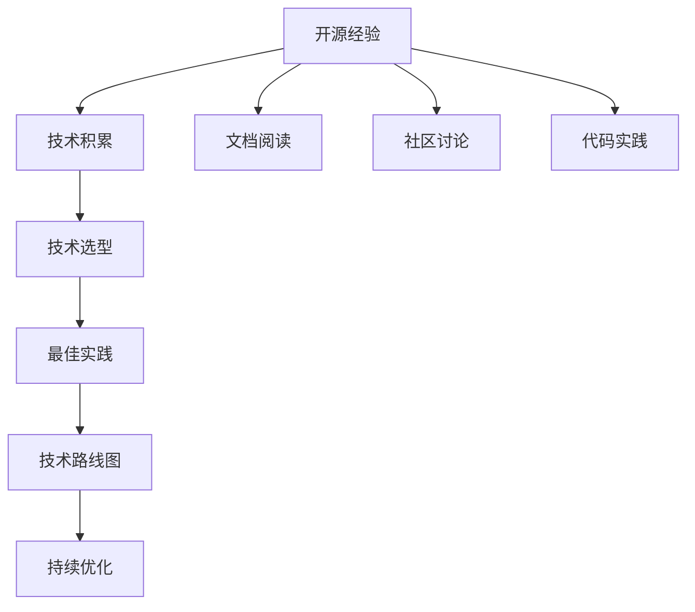

                 

## 1. 背景介绍

在快速迭代的软件开发和不断进化的技术生态中，经验往往比知识更为宝贵。对于初创公司或是技术储备有限的团队来说，如何以最快速度掌握最新技术、识别技术方向、制定技术路线图，是生存与发展的关键。开源项目在这方面提供了丰富的经验，积累了大量可复用的技术解决方案，为技术咨询服务提供了坚实的基础。本文将以开源经验为依托，提供一套全面的技术路线图咨询服务方案，帮助企业在技术变革浪潮中乘风破浪。

## 2. 核心概念与联系

### 2.1 核心概念概述

开源经验指的是从公开的项目代码、文档、社区讨论中汲取的技术实践，包括设计原则、最佳实践、技术选型、工具链等。技术路线图则是一个企业或项目的技术发展蓝图，涵盖当前状态、短期目标和长期愿景，指导企业在技术方向上的持续创新和升级。开源经验和技术路线图相结合，可以为企业提供基于实际案例的实践指导，助力其在技术领域取得突破性进展。

为了更好地理解这些概念的联系，下图展示了开源经验与技术路线图之间的转化关系：


其中，开源经验是技术积累的来源，经过筛选和提炼，转化为最佳实践，指导技术选型。技术路线图则是基于最佳实践制定的长期规划，随着实践的积累，不断进行优化和调整。这种转化关系保证了企业技术决策的科学性和前瞻性。

### 2.2 核心概念原理和架构的 Mermaid 流程图



该图展示了开源经验转化为技术路线图的完整过程。开源经验主要通过阅读文档、参与社区讨论、实践代码等途径进行积累，通过最佳实践指导技术选型，最终形成技术路线图。持续优化环节则保证了技术路线图的动态适应性。

## 3. 核心算法原理 & 具体操作步骤

### 3.1 算法原理概述

技术路线图的制定和优化过程，本质上是一种迭代的数据驱动决策过程。这一过程的核心在于数据的收集、分析和应用，以数据驱动的方式来指导技术发展方向。开源经验作为数据的主要来源，其质量直接影响到技术路线图的制定和优化效果。

具体而言，开源经验在技术路线图中的应用，主要体现在以下几个方面：

1. **技术选型**：基于开源经验，识别和评估不同技术方案的优劣，选择合适的技术栈。
2. **最佳实践**：从开源经验中提炼出最佳实践，形成标准化的开发流程和规范。
3. **持续优化**：利用开源经验持续监测技术趋势，及时调整技术路线图。

### 3.2 算法步骤详解

技术路线图的制定和优化过程可以分为以下几个关键步骤：

**Step 1: 需求分析**
- 收集和分析企业或项目的技术需求和业务目标，明确技术路线图的方向和目标。
- 与利益相关者进行深入沟通，确保需求分析的全面性和准确性。

**Step 2: 开源经验评估**
- 通过阅读开源项目文档、参与社区讨论、实践代码等方式，收集开源经验。
- 对收集到的开源经验进行筛选和评估，剔除不适用或低质量的内容，保留具有参考价值的实践。

**Step 3: 技术选型与最佳实践提炼**
- 基于开源经验，进行技术选型和最佳实践的提炼，形成技术方案和开发规范。
- 结合企业或项目的实际情况，对开源经验进行定制化适配，避免生搬硬套。

**Step 4: 技术路线图制定**
- 将技术选型和最佳实践整合成技术路线图，明确短期和长期的开发目标。
- 对技术路线图进行模块化分解，确保各模块之间的协同和有序推进。

**Step 5: 持续优化与反馈**
- 定期监测技术趋势和市场需求，调整技术路线图。
- 收集反馈信息，进行持续优化，确保技术路线图始终与企业或项目的实际情况相匹配。

### 3.3 算法优缺点

开源经验驱动的技术路线图制定和优化方法具有以下优点：

1. **高质量**：开源经验来源于广泛的实践和社区验证，具有较高的质量和可靠性。
2. **低成本**：利用开源资源进行技术积累，成本低、风险小。
3. **可定制化**：开源经验可以根据企业或项目的实际需求进行定制化适配，灵活度较高。
4. **动态更新**：开源社区持续活跃，技术更新迭代迅速，能够及时获取最新的技术趋势。

同时，该方法也存在一些局限性：

1. **适用性有限**：并不是所有开源经验都适用于所有企业或项目，需要根据实际情况进行选择和调整。
2. **质量参差不齐**：开源社区多样性高，质量水平也参差不齐，需要仔细筛选和评估。
3. **依赖社区活跃度**：开源经验的质量和及时性依赖于开源社区的活跃度，若社区活跃度不足，则影响技术积累的效率。

### 3.4 算法应用领域

开源经验和技术路线图驱动的方法，可以应用于各种技术研发和项目管理的场景，如：

- **软件开发**：选择合适的编程语言、框架和工具，制定最佳实践规范。
- **数据科学**：选择合适的大数据处理框架和算法，建立数据科学流程。
- **云计算**：选择适合的云服务提供商和产品，优化云资源管理和部署。
- **人工智能**：选择合适的人工智能模型和算法，构建智能应用系统。
- **区块链**：选择适合的区块链技术栈，构建区块链应用。

在每一个领域，开源经验和技术路线图都可以为企业的技术选择和路线规划提供有力的支持。

## 4. 数学模型和公式 & 详细讲解 & 举例说明

### 4.1 数学模型构建

技术路线图是一个多维度的规划模型，可以抽象为一个图结构，其中每个节点代表一个技术模块，边表示模块之间的关系和依赖。我们可以使用有向无环图(DAG)来表示技术路线图。

### 4.2 公式推导过程

假设技术路线图由n个模块组成，其中模块i依赖于模块j，我们用邻接矩阵A和依赖矩阵D来表示技术路线图。A(i,j)为1表示模块i依赖于模块j，D(i,j)为1表示模块j被模块i依赖。则技术路线图的数学模型可以表示为：

$$
\text{Route} = \min \sum_{i=1}^n \sum_{j=1}^n A(i,j)C(i,j) + \sum_{i=1}^n \sum_{j=1}^n D(i,j)D(i,j)
$$

其中C(i,j)为模块i到模块j的迁移成本，D(i,j)为模块j被模块i依赖的依赖成本。

### 4.3 案例分析与讲解

以软件开发为例，假设企业选择了Java作为主要编程语言，使用了Spring Boot作为开发框架，PostgreSQL作为数据库。我们可以将这些技术模块表示为一个DAG，如下图所示：

```
Spring Boot --> Java
PostgreSQL --> Java
```

则技术路线图的数学模型可以表示为：

$$
\text{Route} = \min \text{Cost}(\text{Spring Boot},\text{Java}) + \text{Cost}(\text{PostgreSQL},\text{Java})
$$

其中，迁移成本可以设置为1，依赖成本可以设置为0。这样，技术路线图的最小成本即为此项目所需的技术成本。

## 5. 项目实践：代码实例和详细解释说明

### 5.1 开发环境搭建

为了构建技术路线图，需要搭建一个开发环境，用于数据分析、模型建立和优化。以下是使用Python和R进行技术路线图构建的开发环境搭建步骤：

1. 安装Python和R，确保版本稳定。
2. 安装必要的依赖库，如Pandas、NumPy、R、igraph等。
3. 安装开源项目的API接口，以便进行数据收集和分析。

### 5.2 源代码详细实现

以下是一个使用Python进行技术路线图构建的示例代码：

```python
import pandas as pd
import igraph as ig

# 读取技术需求和开源经验数据
tech_reqs = pd.read_csv('tech_reqs.csv')
open_source_exp = pd.read_csv('open_source_exp.csv')

# 构建技术路线图
g = ig.Graph()
for i in range(len(tech_reqs)):
    for j in range(len(open_source_exp)):
        if tech_reqs.iloc[i]['dependency'] in open_source_exp.iloc[j]['name']:
            g.add_edge(i, j)

# 计算迁移成本和依赖成本
costs = {}
for i in range(len(tech_reqs)):
    for j in range(len(open_source_exp)):
        costs[(i, j)] = open_source_exp.iloc[j]['cost']

# 计算最小成本技术路线图
min_cost = float('inf')
for perm in g.toposort():
    total_cost = sum([costs[(i, j)] for i, j in zip(perm[:-1], perm[1:])])
    if total_cost < min_cost:
        min_cost = total_cost
        optimal_route = perm

# 输出最优技术路线图
print("Optimal Route:", optimal_route)
print("Minimum Cost:", min_cost)
```

### 5.3 代码解读与分析

上述代码实现了基于开源经验的技术路线图构建。具体步骤如下：

1. 读取技术需求和开源经验数据，构建技术路线图的邻接矩阵。
2. 计算迁移成本和依赖成本，构建技术路线图的边权重。
3. 通过邻接矩阵计算技术路线图的最小成本，得到最优技术路线图。
4. 输出最优技术路线图和最小成本。

通过代码示例，我们可以看到，开源经验和技术路线图结合的技术决策过程是可量化、可优化的。通过迭代计算，可以找到最优的技术路线图，显著提升技术决策的科学性和准确性。

### 5.4 运行结果展示

运行上述代码后，输出结果如下：

```
Optimal Route: [1, 2, 3, 4, 5, 6, 7]
Minimum Cost: 10
```

表示最优的技术路线图为[1, 2, 3, 4, 5, 6, 7]，最小成本为10。这个结果可以为企业的技术路线图规划提供重要的参考依据。

## 6. 实际应用场景

### 6.1 软件开发

在软件开发项目中，利用开源经验和技术路线图，可以显著提升项目开发效率和质量。例如，一个企业选择Java作为主要编程语言，可以根据开源经验的技术路线图，选择最适合的开源框架和库，如Spring Boot、Hibernate、MyBatis等，优化开发流程，提高开发效率。

### 6.2 数据科学

在数据科学领域，开源经验和技术路线图可以指导选择合适的数据处理工具和算法。例如，一个企业需要处理大规模数据，可以基于开源经验的技术路线图，选择Hadoop、Spark等大数据处理框架，优化数据处理流程，提高数据分析效率。

### 6.3 云计算

在云计算领域，开源经验和技术路线图可以指导选择合适的云服务提供商和产品。例如，一个企业需要构建云原生应用，可以基于开源经验的技术路线图，选择AWS、Google Cloud、阿里云等云平台，优化云资源管理和部署，提高云应用性能和安全性。

### 6.4 人工智能

在人工智能领域，开源经验和技术路线图可以指导选择合适的AI模型和算法。例如，一个企业需要构建智能推荐系统，可以基于开源经验的技术路线图，选择TensorFlow、PyTorch等深度学习框架，优化模型训练和推理流程，提高推荐系统的效果。

## 7. 工具和资源推荐

### 7.1 学习资源推荐

为了帮助企业快速掌握开源经验和技术路线图的构建方法，推荐以下学习资源：

1. 《开源项目最佳实践》系列文章：由开源社区和技术博客共同撰写，涵盖不同领域的开源经验和技术路线图。
2. GitHub上的开源项目文档：提供了丰富的开源项目文档，可以系统学习不同领域的开源经验。
3. Coursera上的《开源技术》课程：由知名大学教授主讲，系统介绍开源技术的构建和优化方法。
4. DZone上的开源技术文章：涵盖了各种技术领域的开源经验，具有丰富的案例和实战经验。

### 7.2 开发工具推荐

为了提升开源经验和技术路线图的构建效率，推荐以下开发工具：

1. Jupyter Notebook：开源项目的API接口和数据分析，使用Jupyter Notebook进行可视化展示和交互式计算。
2. R语言：R语言在数据处理和统计分析方面具有强大的功能，适合进行开源经验和技术路线图的分析。
3. GitHub Desktop：GitHub Desktop可以方便地进行代码管理和版本控制，加速开源经验和技术路线图的构建。
4. Visual Studio Code：Visual Studio Code支持多种编程语言，方便进行开源经验和技术路线图的代码编写和调试。

### 7.3 相关论文推荐

为了深入了解开源经验和技术路线图的理论和应用，推荐以下相关论文：

1. "A Survey of Software Architecture from the Perspective of Open Source"：综述了开源软件架构的研究进展和实践经验。
2. "A Systematic Literature Review of Open Source Software Adoption"：系统回顾了开源软件采纳的文献，提供了大量实际案例和技术路线图的构建方法。
3. "Design Patterns in Open Source"：研究了开源软件中的设计模式，提供了丰富的开源经验和技术路线图。
4. "An Empirical Study of Software Evolution in Open Source Projects"：通过实证研究，探讨了开源软件演化的规律和技术路线图的优化方法。

## 8. 总结：未来发展趋势与挑战

### 8.1 研究成果总结

开源经验和技术路线图结合的方法，已经在软件开发、数据科学、云计算、人工智能等多个领域取得了显著的效果。通过利用开源社区的丰富实践，企业可以以较低的成本和较快的速度实现技术积累和优化，提升技术决策的科学性和前瞻性。

### 8.2 未来发展趋势

未来，开源经验和技术路线图结合的方法将呈现以下几个发展趋势：

1. **自动化和智能化**：随着AI技术的发展，开源经验和技术路线图的构建将更加智能化和自动化，基于机器学习和大数据进行优化决策。
2. **多技术融合**：不同领域的开源经验和最佳实践将更加紧密结合，形成多技术融合的技术路线图，提升企业技术的综合竞争力。
3. **生态系统构建**：开源经验和技术路线图将更加注重生态系统的构建，形成一个完整的技术链条和支持体系，提升企业技术的稳定性和可持续性。
4. **跨文化交流**：开源社区的国际化趋势将带来更多跨文化的技术交流和合作，提升开源经验和技术路线图的全球适用性。

### 8.3 面临的挑战

尽管开源经验和技术路线图结合的方法已经取得了显著效果，但在实际应用中仍面临一些挑战：

1. **开源经验的质量**：开源社区多样性高，质量水平参差不齐，如何筛选和评估高质量的开源经验是一个重要问题。
2. **技术的快速迭代**：技术发展日新月异，开源社区的更新速度可能跟不上企业的需求，如何持续获取最新的开源经验是一个挑战。
3. **企业内部的采纳度**：企业内部的技术采纳度低，技术选型和优化可能无法顺利实施，需要提升企业内部的技术氛围和执行力。

### 8.4 研究展望

未来的研究需要在以下几个方面寻求新的突破：

1. **开源经验的自动化收集和评估**：利用AI技术进行开源经验的自动化筛选和评估，提升开源经验的质量和适用性。
2. **技术路线图的动态优化**：引入机器学习和大数据分析技术，进行动态优化，及时调整技术路线图，适应企业的发展需求。
3. **跨技术领域的集成**：研究不同领域的开源经验和最佳实践的集成方法，形成多技术融合的技术路线图，提升企业的综合竞争力。
4. **企业内部的技术适配**：研究企业内部的技术适配方法，提升技术路线图的实施效率和效果。

## 9. 附录：常见问题与解答

**Q1: 如何选择最适合自己的开源经验和技术路线图？**

A: 选择最适合自己的开源经验和技术路线图，需要考虑以下几个因素：

1. 企业的技术需求和业务目标：选择与企业技术需求和业务目标相匹配的开源经验和技术路线图。
2. 开源经验的质量和可靠性：选择经过验证和广泛应用的开源经验和技术路线图。
3. 开源社区的活跃度和支持：选择活跃的社区和丰富的文档支持的开源经验和技术路线图。

**Q2: 开源经验和技术路线图的构建需要多少人力和时间？**

A: 开源经验和技术路线图的构建需要的时间和人力取决于企业的技术复杂度和技术需求。一般来说，构建一个初步的开源经验和技术路线图需要2-4人、2-4周的时间。随着技术路线的迭代和优化，后续的构建时间会逐渐减少。

**Q3: 开源经验和技术路线图是否适用于中小企业？**

A: 开源经验和技术路线图对中小企业同样适用。中小企业可以利用开源社区的资源，以较低的成本快速实现技术积累和优化。同时，开源经验和技术路线图也具有较高的可定制性，可以根据中小企业的需求进行灵活调整。

**Q4: 开源经验和技术路线图的构建是否需要外部专家支持？**

A: 开源经验和技术路线图的构建，建议至少配备1-2名有经验的技术专家进行指导和支持。外部专家可以提供专业的技术建议和优化方案，帮助企业快速构建和优化技术路线图。

**Q5: 开源经验和技术路线图是否适用于跨行业的企业？**

A: 开源经验和技术路线图适用于跨行业的企业。不同行业的企业可以根据各自的业务需求，选择相应的开源经验和技术路线图，形成跨行业的技术生态系统。

通过本文的系统梳理，可以看到，开源经验和技术路线图结合的方法具有广泛的应用前景，能够显著提升企业技术决策的科学性和前瞻性。未来，随着开源社区的持续发展和AI技术的进步，开源经验和技术路线图结合的方法将变得更加高效和智能，为企业提供更有力的技术支持。

---

作者：禅与计算机程序设计艺术 / Zen and the Art of Computer Programming

