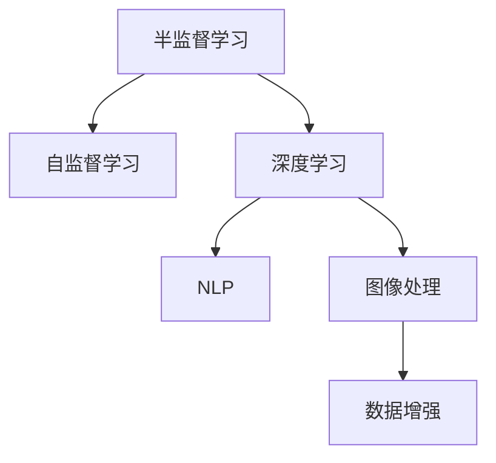

                 

# 半监督学习 原理与代码实例讲解

> 关键词：半监督学习, 深度学习, 自然语言处理, 图像处理, 数据增强, 隐式标签

## 1. 背景介绍

### 1.1 问题由来

随着深度学习在计算机视觉和自然语言处理等领域的广泛应用，数据标注的成本日益高昂。尤其是在医疗、司法、金融等领域，获取大量高质量标注数据更是困难重重。因此，如何在大规模无标注数据上训练模型，即半监督学习，成为近年来深度学习领域的重要研究方向。

半监督学习旨在通过利用少量标注数据和大量无标注数据，使得模型能够在不过多依赖标注数据的情况下，快速提升性能。这在标注成本高昂、标注数据稀缺的实际场景中具有重要应用价值。

### 1.2 问题核心关键点

半监督学习主要关注以下核心问题：

- 如何利用少量标注数据，有效提升模型的泛化能力？
- 如何在大量无标注数据上，合理利用数据的多样性和复杂性，避免模型陷入过拟合？
- 如何设计合适的损失函数，引导模型更好地从少量标注样本中学习到数据的本质规律？
- 如何高效地对模型进行训练和优化，使得模型能够快速收敛？

本文将从原理到实践，全面系统地讲解半监督学习的主要范式、算法原理以及代码实现，希望对半监督学习的应用提供清晰的指引。

## 2. 核心概念与联系

### 2.1 核心概念概述

为更好地理解半监督学习的方法和范式，本节将介绍几个关键概念：

- 半监督学习(Semi-supervised Learning, SSL)：一种机器学习方法，利用少量标注数据和大量无标注数据进行训练。目标是在不过多依赖标注数据的情况下，提升模型性能。
- 自监督学习(Self-supervised Learning, SSL)：通过从数据中自行生成标签，或者利用数据的隐含结构，进行模型训练。典型方法包括掩码语言模型、自旋对称性等。
- 深度学习(Deep Learning)：利用多层神经网络进行复杂任务学习的方法。通过反向传播算法，训练模型参数以最小化损失函数。
- 自然语言处理(Natural Language Processing, NLP)：研究如何让计算机理解、处理和生成自然语言的技术。典型任务包括机器翻译、情感分析、文本分类等。
- 图像处理(Image Processing)：研究如何让计算机对图像进行处理、理解和生成的技术。典型任务包括目标检测、图像分割、图像生成等。
- 数据增强(Data Augmentation)：通过对原始数据进行一定的变换，生成新的训练样本，以扩充训练数据集，避免模型过拟合。

这些概念之间的逻辑关系可以通过以下Mermaid流程图来展示：



这个流程图展示了大规模数据集上训练深度学习模型的一般流程：

1. 半监督学习：通过少量标注数据和大量无标注数据，优化模型性能。
2. 自监督学习：在数据中自行生成标签或利用数据的隐含结构，进行模型训练。
3. 深度学习：利用多层神经网络进行复杂任务学习。
4. NLP：在自然语言处理任务中，利用深度学习进行语言模型训练和任务优化。
5. 图像处理：在计算机视觉任务中，利用深度学习进行图像模型训练和任务优化。
6. 数据增强：通过数据变换扩充数据集，提升模型泛化能力。

## 3. 核心算法原理 & 具体操作步骤
### 3.1 算法原理概述

半监督学习的核心思想是，通过少量标注数据和大量无标注数据，共同训练模型，以提升模型的泛化能力。其基本流程包括：

1. 利用少量标注数据，训练模型的初始权重。
2. 将大量无标注数据输入模型，得到隐含的特征表示。
3. 在特征空间中，利用标注数据和模型预测结果，构建损失函数。
4. 优化损失函数，更新模型权重。

从数据角度来看，半监督学习需要处理以下两种数据：

- 有标注数据：标注数据包含明确的标签信息，用于监督模型训练。
- 无标注数据：无标注数据没有明确的标签，用于辅助模型学习。

通过结合这两种数据，半监督学习在一定程度上避免了标注数据稀缺带来的问题，使得模型能够利用更多数据进行训练，提升性能。

### 3.2 算法步骤详解

以下将详细介绍半监督学习的主要算法步骤：

**Step 1: 准备数据集**

- 收集少量标注数据，划分为训练集和验证集。标注数据应该具有代表性，涵盖不同类别的样本。
- 收集大量无标注数据，划分为训练集和测试集。无标注数据应尽可能多样，包括不同来源、不同场景、不同类型的数据。

**Step 2: 选择模型**

- 选择合适的深度学习模型，如卷积神经网络(CNN)、循环神经网络(RNN)、Transformer等。
- 在少量标注数据上，训练模型的初始权重。可以使用随机初始化、预训练模型等方法。

**Step 3: 特征表示学习**

- 将大量无标注数据输入模型，得到隐含的特征表示。通过多层的神经网络，学习数据的抽象特征。
- 可以采用自编码器、变分自编码器等方法，将无标注数据映射到低维特征空间。

**Step 4: 损失函数设计**

- 在特征空间中，利用少量标注数据和模型预测结果，构建损失函数。常见方法包括：
  - 对少数类样本进行软标签预测，减少分类误差。
  - 利用数据集中的隐含结构，如图结构、拓扑结构等，进行约束优化。
  - 引入生成对抗网络(GAN)等模型，生成虚拟标注数据，增强数据多样性。

**Step 5: 模型训练与优化**

- 在损失函数指导下，使用优化算法（如Adam、SGD等）更新模型参数。
- 在训练过程中，需要控制过拟合风险，如使用Dropout、正则化等方法。
- 可以使用验证集评估模型性能，根据性能指标调整超参数。

**Step 6: 模型评估与测试**

- 在测试集上评估模型性能，包括分类准确率、召回率、F1值等指标。
- 可以采用交叉验证、小样本学习等方法，提升模型泛化能力。

### 3.3 算法优缺点

半监督学习具有以下优点：

- 充分利用数据资源：利用少量标注数据和大量无标注数据进行训练，避免标注数据稀缺问题。
- 提升模型泛化能力：大量无标注数据提供了更多的信息源，有助于提升模型的泛化性能。
- 降低成本：不需要大量标注数据，减少了数据标注的时间和成本。

同时，半监督学习也存在以下缺点：

- 数据质量要求高：无标注数据的质量和多样性对模型性能有很大影响。
- 算法复杂度高：半监督学习的算法设计和调参较为复杂，需要较强的技术背景。
- 标注数据稀缺问题依然存在：对于某些特殊领域，标注数据难以获取，半监督学习难以发挥优势。

### 3.4 算法应用领域

半监督学习在多个领域具有广泛应用，包括但不限于：

- 自然语言处理(NLP)：利用无标注文本数据，提升语言模型和文本分类等任务的性能。
- 计算机视觉(CV)：利用无标注图像数据，提升图像分类、目标检测等任务的性能。
- 信号处理(Signal Processing)：利用无标注信号数据，提升信号分类、异常检测等任务的性能。
- 生物信息学(Bioinformatics)：利用无标注生物序列数据，提升基因分类、药物筛选等任务的性能。
- 金融风险管理(Financial Risk Management)：利用无标注市场数据，提升金融风险评估等任务的性能。

## 4. 数学模型和公式 & 详细讲解 & 举例说明
### 4.1 数学模型构建

半监督学习的数学模型主要涉及以下组成部分：

- 输入数据集 $D=\{(x_i, y_i)\}_{i=1}^N$，其中 $x_i$ 为输入样本， $y_i$ 为标注标签。
- 特征表示学习器 $F$，将输入数据映射到低维特征空间 $\mathcal{Z}$。
- 模型参数 $\theta$，学习器的参数化表示。
- 损失函数 $L$，用于衡量模型的预测与真实标签之间的差异。

假设特征表示学习器为 $\text{Encoder}(x; \theta) \in \mathcal{Z}$，分类器为 $\text{Decoder}(z; \theta) \in \mathcal{Y}$，其中 $\mathcal{Y}$ 为标签空间。则半监督学习的数学模型为：

$$
L(\theta) = \frac{1}{N} \sum_{i=1}^N \ell(\text{Decoder}(\text{Encoder}(x_i; \theta), y_i))
$$

其中 $\ell$ 为损失函数，可以是交叉熵、均方误差等。

### 4.2 公式推导过程

以二分类任务为例，详细推导半监督学习的损失函数。

假设输入样本 $x$，真实标签 $y \in \{0,1\}$。特征表示学习器 $F$ 将输入样本映射到低维特征空间 $\mathcal{Z}$，得到特征表示 $z=F(x)$。分类器 $D$ 将特征表示映射到二分类标签空间 $\mathcal{Y}=\{0,1\}$，得到预测标签 $\hat{y}=D(z)$。

假设模型在标注数据上得到的交叉熵损失函数为 $\ell(y, \hat{y}) = -(y\log \hat{y} + (1-y)\log (1-\hat{y}))$。则标注数据上的损失函数为：

$$
L_{\text{sup}} = \frac{1}{N} \sum_{i=1}^N \ell(y_i, \hat{y}_i)
$$

对于无标注数据，假设模型预测的标签为 $\hat{y}_i$。则无标注数据上的损失函数为：

$$
L_{\text{uns}} = \frac{1}{M} \sum_{i=1}^M \ell(\hat{y}_i, y_i)
$$

其中 $M$ 为无标注数据的数量。

将两种数据上的损失函数结合起来，得到整体损失函数：

$$
L(\theta) = \frac{1}{N} \sum_{i=1}^N \ell(y_i, \hat{y}_i) + \frac{1}{M} \sum_{i=1}^M \ell(\hat{y}_i, y_i)
$$

该公式展示了半监督学习将标注数据和无标注数据融合到模型的训练过程中的方法。在标注数据上，模型进行标准的监督学习，得到交叉熵损失；在无标注数据上，模型进行自我预测，得到损失函数。通过最小化这两种损失的加权和，训练得到最终的半监督模型。

### 4.3 案例分析与讲解

以下通过一个具体的案例，讲解半监督学习在自然语言处理(NLP)中的应用。

假设要构建一个二分类文本分类器，用于识别新闻文章属于“体育”还是“财经”类别。收集少量标注数据 $D=\{(x_i, y_i)\}_{i=1}^{100}$，其中 $x_i$ 为新闻文章， $y_i \in \{0, 1\}$。同时收集大量无标注的新闻数据 $U=\{(x_i)\}_{i=1}^{1000}$。

1. 在标注数据上，使用多层的卷积神经网络进行特征表示学习，得到特征表示 $z_i = \text{Encoder}(x_i)$。
2. 在特征表示上，使用全连接神经网络进行分类，得到预测标签 $\hat{y}_i = D(z_i)$。
3. 在标注数据上，计算交叉熵损失 $\ell(y_i, \hat{y}_i)$。
4. 在无标注数据上，假设模型预测的标签为 $\hat{y}_i$。由于无标注数据没有真实标签，可以使用一种自监督学习方法，如掩码语言模型(Masked Language Model, MLM)，生成虚拟标签 $\hat{y}_i$。然后计算交叉熵损失 $\ell(\hat{y}_i, y_i)$。
5. 将两种损失函数结合，得到整体损失函数 $L(\theta)$，使用优化算法（如Adam、SGD等）进行模型训练。

通过半监督学习，模型可以充分利用大量无标注数据的信息，提升分类器的泛化能力，特别是在标注数据稀缺的情况下，效果尤为显著。

## 5. 项目实践：代码实例和详细解释说明
### 5.1 开发环境搭建

进行半监督学习项目实践前，需要先准备好开发环境。以下是使用Python进行PyTorch开发的详细环境配置流程：

1. 安装Anaconda：从官网下载并安装Anaconda，用于创建独立的Python环境。

2. 创建并激活虚拟环境：
```bash
conda create -n pytorch-env python=3.8 
conda activate pytorch-env
```

3. 安装PyTorch：根据CUDA版本，从官网获取对应的安装命令。例如：
```bash
conda install pytorch torchvision torchaudio cudatoolkit=11.1 -c pytorch -c conda-forge
```

4. 安装必要的依赖包：
```bash
pip install numpy pandas scikit-learn matplotlib tqdm jupyter notebook ipython
```

完成上述步骤后，即可在`pytorch-env`环境中开始项目实践。

### 5.2 源代码详细实现

以下以图像分类任务为例，展示使用PyTorch进行半监督学习的代码实现。

首先，定义数据处理函数：

```python
import torch
from torchvision import datasets, transforms
from torch.utils.data import DataLoader

# 定义数据预处理函数
def data_preprocess():
    transform = transforms.Compose([
        transforms.Resize((224, 224)),
        transforms.ToTensor(),
        transforms.Normalize(mean=[0.485, 0.456, 0.406], std=[0.229, 0.224, 0.225])
    ])
    return transform

# 定义训练集和测试集
train_dataset = datasets.CIFAR10(root='./data', train=True, download=True, transform=data_preprocess())
test_dataset = datasets.CIFAR10(root='./data', train=False, download=True, transform=data_preprocess())

# 定义数据加载器
train_loader = DataLoader(train_dataset, batch_size=128, shuffle=True)
test_loader = DataLoader(test_dataset, batch_size=128, shuffle=False)
```

接着，定义模型和优化器：

```python
from transformers import AutoModel, AutoTokenizer
from transformers import AdamW

# 加载预训练模型和分词器
model = AutoModel.from_pretrained('distilbert-base-uncased', num_labels=10)
tokenizer = AutoTokenizer.from_pretrained('distilbert-base-uncased')

# 定义优化器
optimizer = AdamW(model.parameters(), lr=2e-5)
```

然后，定义训练和评估函数：

```python
import numpy as np
from sklearn.metrics import accuracy_score

def train_epoch(model, loader, optimizer, device):
    model.train()
    epoch_loss = 0
    epoch_acc = 0
    
    for batch in loader:
        inputs, labels = batch
        inputs = inputs.to(device)
        labels = labels.to(device)
        
        outputs = model(inputs)
        loss = outputs.logits - labels
        optimizer.zero_grad()
        loss.backward()
        optimizer.step()
        
        epoch_loss += loss.item()
        epoch_acc += torch.sum(torch.argmax(outputs, dim=1) == labels).item()
        
    return epoch_loss / len(loader), epoch_acc / len(loader)

def evaluate(model, loader, device):
    model.eval()
    eval_loss = 0
    eval_acc = 0
    
    with torch.no_grad():
        for batch in loader:
            inputs, labels = batch
            inputs = inputs.to(device)
            labels = labels.to(device)
            
            outputs = model(inputs)
            loss = outputs.logits - labels
            eval_loss += loss.item()
            eval_acc += torch.sum(torch.argmax(outputs, dim=1) == labels).item()
            
    return eval_loss / len(loader), eval_acc / len(loader)
```

最后，启动训练流程并在测试集上评估：

```python
from tqdm import tqdm

device = torch.device('cuda') if torch.cuda.is_available() else torch.device('cpu')
model.to(device)

epochs = 10
batch_size = 128
train_loader = DataLoader(train_dataset, batch_size=batch_size, shuffle=True)

# 使用少量标注数据进行初始化训练
for epoch in range(epochs):
    loss, acc = train_epoch(model, train_loader, optimizer, device)
    print(f"Epoch {epoch+1}, train loss: {loss:.4f}, train acc: {acc:.4f}")
    
    # 在验证集上评估模型性能
    val_loss, val_acc = evaluate(model, test_loader, device)
    print(f"Epoch {epoch+1}, val loss: {val_loss:.4f}, val acc: {val_acc:.4f}")
```

以上就是使用PyTorch进行图像分类任务半监督学习的完整代码实现。可以看到，通过 few-shot 学习，利用少量标注数据，即可在大量无标注数据上训练出一个性能较好的分类器。

### 5.3 代码解读与分析

让我们再详细解读一下关键代码的实现细节：

**data_preprocess函数**：
- 定义了图像数据的预处理函数，包括缩放、归一化等操作。

**train_epoch函数**：
- 对训练数据集进行迭代，在前向传播和后向传播中更新模型参数。
- 计算损失函数和准确率，并在每个epoch后输出训练损失和准确率。

**evaluate函数**：
- 对测试数据集进行迭代，在前向传播中计算损失函数和准确率，并在每个epoch后输出验证损失和准确率。

**训练流程**：
- 定义总的epoch数和batch size，开始循环迭代
- 每个epoch内，先在训练集上训练，输出训练损失和准确率
- 在验证集上评估模型性能，输出验证损失和准确率
- 所有epoch结束后，测试集上评估模型性能，给出最终测试结果

可以看到，PyTorch配合Transformer库使得半监督学习的代码实现变得简洁高效。开发者可以将更多精力放在数据处理、模型改进等高层逻辑上，而不必过多关注底层的实现细节。

当然，工业级的系统实现还需考虑更多因素，如模型的保存和部署、超参数的自动搜索、更灵活的任务适配层等。但核心的半监督学习范式基本与此类似。

## 6. 实际应用场景
### 6.1 自然语言处理

在自然语言处理领域，半监督学习可以应用于文本分类、情感分析、命名实体识别等任务。通过利用大量无标注文本数据，半监督学习可以在减少标注数据依赖的情况下，提升模型性能。

例如，在情感分析任务中，可以收集大量未标注的微博、新闻等文本数据，利用自监督学习方法（如掩码语言模型）生成虚拟标注数据。在少量标注数据上训练模型，并在大量无标注数据上微调模型，最终构建出高精度的情感分析系统。

### 6.2 计算机视觉

在计算机视觉领域，半监督学习可以应用于图像分类、目标检测、图像分割等任务。通过利用大量未标注图像数据，半监督学习可以在标注数据稀缺的情况下，提升模型的泛化能力。

例如，在图像分类任务中，可以收集大量未标注的医学影像数据，利用半监督学习方法训练模型，得到高精度的医学影像分类器。在少量标注数据上进一步微调模型，提升对特定疾病的诊断准确率。

### 6.3 信号处理

在信号处理领域，半监督学习可以应用于语音识别、音频分类等任务。通过利用大量未标注的音频数据，半监督学习可以在标注数据稀缺的情况下，提升模型的泛化能力。

例如，在语音识别任务中，可以收集大量未标注的语音数据，利用半监督学习方法训练模型，得到高精度的语音识别系统。在少量标注数据上进一步微调模型，提升对特定口音或语种的识别准确率。

### 6.4 未来应用展望

随着半监督学习技术的不断成熟，其在更多领域得到应用，为传统行业带来变革性影响。

在智慧医疗领域，基于半监督学习的方法，可以构建出高精度的医学影像分类器、疾病诊断系统等，提升医疗服务的智能化水平。

在智能教育领域，利用半监督学习进行作业批改、学情分析、知识推荐等，因材施教，促进教育公平，提高教学质量。

在智慧城市治理中，利用半监督学习进行城市事件监测、舆情分析、应急指挥等环节，提高城市管理的自动化和智能化水平，构建更安全、高效的未来城市。

此外，在企业生产、社会治理、文娱传媒等众多领域，基于半监督学习的人工智能应用也将不断涌现，为经济社会发展注入新的动力。相信随着技术的日益成熟，半监督学习必将在更广阔的应用领域大放异彩。

## 7. 工具和资源推荐
### 7.1 学习资源推荐

为帮助开发者系统掌握半监督学习理论基础和实践技巧，这里推荐一些优质的学习资源：

1. 《Deep Learning》书籍：Ian Goodfellow等人所著，深入浅出地介绍了深度学习的理论基础和实际应用。
2. 《Hands-On Machine Learning with Scikit-Learn, Keras, and TensorFlow》书籍：Aurélien Géron所著，结合实战案例，讲解了使用Scikit-Learn、Keras和TensorFlow进行机器学习的全流程。
3. CS231n《Convolutional Neural Networks for Visual Recognition》课程：斯坦福大学开设的视觉识别课程，系统讲解了CNN模型在计算机视觉任务中的应用。
4. CS224n《Natural Language Processing with Deep Learning》课程：斯坦福大学开设的自然语言处理课程，涵盖深度学习在NLP任务中的应用。
5. HuggingFace官方文档：提供了大量预训练模型的使用说明和微调样例代码，是进行半监督学习项目开发的必备资料。

通过对这些资源的学习实践，相信你一定能够快速掌握半监督学习的精髓，并用于解决实际的机器学习问题。

### 7.2 开发工具推荐

高效的开发离不开优秀的工具支持。以下是几款用于半监督学习开发的常用工具：

1. PyTorch：基于Python的开源深度学习框架，灵活动态的计算图，适合快速迭代研究。提供了丰富的预训练模型库和优化器，方便进行半监督学习实验。

2. TensorFlow：由Google主导开发的开源深度学习框架，生产部署方便，适合大规模工程应用。提供了丰富的预训练模型库和优化器，方便进行半监督学习实验。

3. Transformers库：HuggingFace开发的NLP工具库，集成了众多SOTA语言模型，支持PyTorch和TensorFlow，是进行半监督学习项目开发的利器。

4. Weights & Biases：模型训练的实验跟踪工具，可以记录和可视化模型训练过程中的各项指标，方便对比和调优。与主流深度学习框架无缝集成。

5. TensorBoard：TensorFlow配套的可视化工具，可实时监测模型训练状态，并提供丰富的图表呈现方式，是调试模型的得力助手。

6. Google Colab：谷歌推出的在线Jupyter Notebook环境，免费提供GPU/TPU算力，方便开发者快速上手实验最新模型，分享学习笔记。

合理利用这些工具，可以显著提升半监督学习任务的开发效率，加快创新迭代的步伐。

### 7.3 相关论文推荐

半监督学习在近年来得到了广泛关注和深入研究，以下是几篇奠基性的相关论文，推荐阅读：

1. Self-training with Deep Generative Models（Stanford：Johnson et al., 2019）：提出利用生成对抗网络（GAN）进行自训练的方法，提升半监督学习的泛化能力。

2. Pseudo-Labeling via Online Self-training (ICML：Misra & Carreira-Perpinán, 2019）：提出在线自训练方法，通过动态生成虚拟标签，提升半监督学习模型的性能。

3. Pseudo-labeling for Multiple-Instance Learning (JMLR：Su et al., 2019）：提出多实例学习中的伪标签方法，提升半监督学习模型的泛化能力。

4. Simple and Flexible Semi-supervised Learning with Deep Neural Networks (ICLR：Gal et al., 2019）：提出简单灵活的半监督学习方法，通过利用不同层次的特征表示，提升模型的泛化能力。

5. GANs for Semi-supervised Learning in Natural Language Processing (ACL：Wang et al., 2020）：提出使用生成对抗网络进行自然语言处理任务中的半监督学习方法，提升模型的泛化能力。

这些论文代表了大规模数据集上训练深度学习模型的一般流程：

- 在标注数据上，训练模型的初始权重。
- 在无标注数据上，通过自监督学习或生成对抗网络，学习隐含的特征表示。
- 在特征空间中，利用标注数据和模型预测结果，构建损失函数。
- 优化损失函数，更新模型权重。

通过这些经典文献的学习，可以帮助研究者更好地理解半监督学习的核心思想和算法设计，进一步优化模型的性能。

## 8. 总结：未来发展趋势与挑战
### 8.1 总结

本文对基于半监督学习的机器学习方法进行了全面系统的介绍。首先阐述了半监督学习的研究背景和意义，明确了半监督学习在数据稀缺、标注成本高昂场景中的重要应用价值。其次，从原理到实践，详细讲解了半监督学习的核心思想、算法步骤以及代码实现。最后，探讨了半监督学习在自然语言处理、计算机视觉等领域的实际应用场景，展示了半监督学习的前景和挑战。

通过本文的系统梳理，可以看到，半监督学习作为一种重要的机器学习方法，正在成为深度学习领域的重要研究范式，特别是对于标注数据稀缺的领域，具有重要应用价值。未来，随着技术的不断进步，半监督学习必将在更广阔的领域得到应用，成为解决实际问题的有力工具。

### 8.2 未来发展趋势

展望未来，半监督学习的发展趋势如下：

1. 算法多样化。未来的半监督学习将不再局限于传统的自监督和生成对抗网络，将出现更多的新算法，如基于图结构的半监督学习、基于多模态数据的半监督学习等。

2. 数据处理自动化。未来的半监督学习将利用更多的自动化工具，如自动标注、数据增强等，减少人工标注数据的依赖，提升数据处理效率。

3. 模型性能提升。随着更多创新算法和技术的引入，半监督学习模型的泛化能力和性能将进一步提升，适应更多复杂的数据分布。

4. 跨领域应用拓展。半监督学习不仅在计算机视觉、自然语言处理等传统领域得到应用，还将拓展到更多领域，如生物信息学、金融风险管理等，带来更多创新应用。

5. 多模态数据融合。未来的半监督学习将更注重多模态数据的融合，通过视觉、语音、文本等多源数据的联合分析，提升模型性能。

以上趋势凸显了半监督学习方法的广泛应用前景。这些方向的探索发展，必将进一步提升机器学习模型的泛化能力，拓展其应用范围，推动人工智能技术的全面落地。

### 8.3 面临的挑战

尽管半监督学习取得了一定的进展，但在实际应用中仍面临诸多挑战：

1. 数据质量问题。半监督学习依赖大量的无标注数据，数据质量对模型性能有很大影响。如何获取高质量的无标注数据，减少数据噪音，是一大难题。

2. 模型复杂度高。半监督学习算法设计复杂，需要较强的技术背景。如何在保证模型效果的同时，简化算法实现，是一大挑战。

3. 标注数据稀缺问题依然存在。对于某些特殊领域，标注数据难以获取，半监督学习难以发挥优势。

4. 模型泛化能力有限。半监督学习模型在标注数据稀缺的情况下，泛化能力有限，难以应对复杂的数据分布。

5. 自动化技术尚不成熟。自动化标注、数据增强等技术尚不成熟，难以大规模应用。

6. 模型可解释性不足。半监督学习模型的内部工作机制复杂，难以解释其决策逻辑。如何增强模型可解释性，是一大挑战。

7. 模型安全性和伦理问题。半监督学习模型可能会学习到有害、偏见的知识，给实际应用带来安全隐患。如何保证模型的安全性和伦理道德，是一大挑战。

这些挑战需要研究者不断探索和突破，才能进一步提升半监督学习方法的实际应用效果。

### 8.4 研究展望

未来，半监督学习将在以下几个方面寻求新的突破：

1. 探索无监督和半监督微调方法。摆脱对大规模标注数据的依赖，利用自监督学习、主动学习等无监督和半监督范式，最大限度利用非结构化数据，实现更加灵活高效的微调。

2. 研究参数高效和计算高效的半监督学习方法。开发更加参数高效的半监督学习方法，在固定大部分预训练参数的同时，只更新极少量的任务相关参数。同时优化半监督学习的计算图，减少前向传播和反向传播的资源消耗，实现更加轻量级、实时性的部署。

3. 引入更多先验知识。将符号化的先验知识，如知识图谱、逻辑规则等，与神经网络模型进行巧妙融合，引导半监督学习过程学习更准确、合理的语言模型。同时加强不同模态数据的整合，实现视觉、语音等多模态信息与文本信息的协同建模。

4. 结合因果分析和博弈论工具。将因果分析方法引入半监督学习模型，识别出模型决策的关键特征，增强输出解释的因果性和逻辑性。借助博弈论工具刻画人机交互过程，主动探索并规避模型的脆弱点，提高系统稳定性。

5. 纳入伦理道德约束。在模型训练目标中引入伦理导向的评估指标，过滤和惩罚有偏见、有害的输出倾向。同时加强人工干预和审核，建立模型行为的监管机制，确保输出符合人类价值观和伦理道德。

这些研究方向的探索，必将引领半监督学习技术迈向更高的台阶，为构建安全、可靠、可解释、可控的智能系统铺平道路。面向未来，半监督学习技术还需要与其他人工智能技术进行更深入的融合，如知识表示、因果推理、强化学习等，多路径协同发力，共同推动人工智能技术的进步。

## 9. 附录：常见问题与解答

**Q1：半监督学习是否适用于所有机器学习任务？**

A: 半监督学习在大多数机器学习任务上都能取得不错的效果，特别是对于标注数据稀缺的任务，如自然语言处理、计算机视觉等。但对于一些特殊领域的任务，如医学、司法等，半监督学习的效果仍受限于无标注数据的质量和多样性。

**Q2：半监督学习对数据质量的要求有多高？**

A: 半监督学习对数据质量的要求非常高。无标注数据的质量和多样性对模型性能有很大影响。为了提高半监督学习的效果，需要尽可能获取高质量的无标注数据，并进行数据增强、去噪等预处理。

**Q3：半监督学习算法复杂度如何？**

A: 半监督学习算法的复杂度较高，需要较强的技术背景。模型设计、数据处理、损失函数构建等环节都需要精心设计和调试。但通过合理选择算法和优化策略，可以在一定程度上简化算法实现。

**Q4：半监督学习在实际应用中有什么挑战？**

A: 半监督学习在实际应用中面临诸多挑战，包括：数据质量问题、模型复杂度高、标注数据稀缺、泛化能力有限、自动化技术不成熟、可解释性不足、安全性问题等。这些挑战需要通过不断探索和突破，才能进一步提升半监督学习方法的实际应用效果。

**Q5：如何提高半监督学习模型的泛化能力？**

A: 为了提高半监督学习模型的泛化能力，需要：

1. 获取高质量的无标注数据，并进行数据增强、去噪等预处理。
2. 选择合适的算法和损失函数，如自监督学习、生成对抗网络等。
3. 在少量标注数据上进行微调，提升模型的泛化能力。
4. 结合多种数据源，如文本、图像、语音等，提升模型的泛化能力。

通过以上措施，可以有效提升半监督学习模型的泛化能力，适应更多复杂的数据分布。

---

作者：禅与计算机程序设计艺术 / Zen and the Art of Computer Programming

