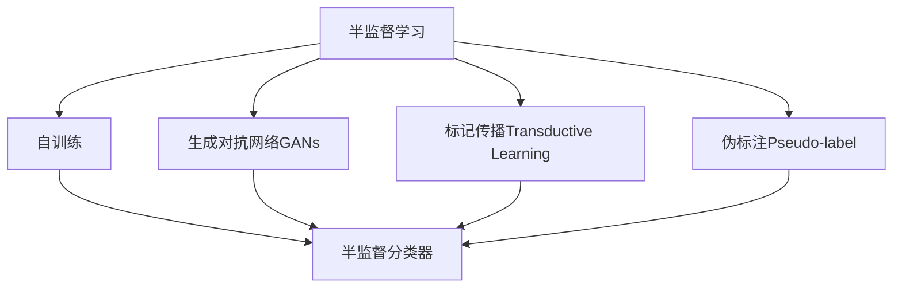

                 

## 1. 背景介绍

### 1.1 问题由来

随着深度学习技术的广泛应用，半监督学习在诸多领域中崭露头角。在数据标注成本极高的场景中，比如医疗、金融、安防等领域，收集大规模标注数据非常困难。半监督学习方法能够有效利用海量的未标注数据，结合少量标注数据，提升模型性能。

半监督学习目前已在图像识别、自然语言处理、推荐系统等多个领域中取得了显著成果，例如，微软的DeepFix系统在图像修复任务上使用了半监督学习方法，Google在Google Photos中使用了半监督学习算法，从而提升了图像检索的准确性。

### 1.2 问题核心关键点

半监督学习的核心在于：如何在有限的标注数据下，通过利用大量未标注数据，优化模型性能。目前，主流的方法包括：

- **自训练(self-training)**：使用模型预测未标注样本的概率分布，选取置信度较高的样本进行伪标注，再利用伪标注样本更新模型。
- **生成对抗网络(GANs)**：通过生成器生成大量未标注样本，将这些样本加入训练集中，以增强模型学习。
- **标记传播(Transductive Learning)**：在未标注样本集上，利用图模型或标签传播算法，逐步推断出更可靠的标签。

这些方法在处理文本分类、图像分类、聚类等问题上已经展现出了强大的潜力。

### 1.3 问题研究意义

半监督学习能有效解决数据标注成本高、数据稀缺的问题，提高模型泛化能力，这对于医疗、金融、安防等高价值领域具有重要意义。

- **数据成本降低**：利用未标注数据，降低数据标注成本，减少人力资源投入。
- **模型性能提升**：在标注数据不足的情况下，提升模型泛化能力，避免模型过拟合。
- **数据资源扩展**：从海量的未标注数据中挖掘价值，为模型提供更多训练数据。

## 2. 核心概念与联系

### 2.1 核心概念概述

为了更好地理解半监督学习，本节将介绍几个密切相关的核心概念：

- **半监督学习**：在有限的标注数据下，结合大量的未标注数据，进行模型训练，以优化模型性能。
- **自训练(self-training)**：使用模型预测未标注样本的标签，选取置信度较高的样本进行伪标注，再利用伪标注样本更新模型。
- **生成对抗网络(GANs)**：由生成器和判别器构成的对抗模型，生成器生成大量伪标注数据，判别器用于筛选高质量的数据。
- **标记传播(Transductive Learning)**：在未标注样本集上，利用图模型或标签传播算法，逐步推断出更可靠的标签。
- **伪标注(Pseudo-label)**：通过模型预测生成的标签，用于增强模型训练。
- **半监督分类器(Semi-supervised Classifier)**：利用少量标注数据和大量未标注数据进行训练，优化模型分类性能。

这些概念之间的逻辑关系可以通过以下Mermaid流程图来展示：



这个流程图展示了半监督学习的核心概念及其之间的联系：

1. 半监督学习从有限的标注数据和大量的未标注数据中提取价值。
2. 自训练和标记传播是常用的半监督学习方法，用于从未标注数据中生成伪标注。
3. 生成对抗网络是另一种常用的方法，通过生成大量伪标注数据来增强模型训练。
4. 伪标注是通过模型预测生成的标签，用于增强模型训练。
5. 半监督分类器是利用少量标注数据和大量未标注数据进行训练，提升模型分类性能。

## 3. 核心算法原理 & 具体操作步骤
### 3.1 算法原理概述

半监督学习的核心思想是通过结合少量标注数据和大量未标注数据，利用数据的自相关性，提升模型泛化能力。其核心流程包括：

1. 在少量标注数据上，训练一个初始模型。
2. 利用模型预测未标注数据的标签，生成伪标注。
3. 将伪标注数据加入训练集，再利用扩充后的数据集训练模型。
4. 重复上述过程，直到模型收敛或达到预设停止条件。

这一过程通常是一个迭代过程，不断更新模型，直到收敛。在实际应用中，还需要针对具体任务，对流程的各个环节进行优化设计，如改进模型结构、调整训练策略等，以进一步提升模型性能。

### 3.2 算法步骤详解

以下是半监督学习的基本步骤：

**Step 1: 准备数据集**
- 收集少量标注数据 $D_{\text{label}}$ 和大量未标注数据 $D_{\text{unlabel}}$。
- 将标注数据 $D_{\text{label}}$ 分为训练集 $D_{\text{train}}$ 和验证集 $D_{\text{valid}}$。

**Step 2: 初始化模型**
- 选择合适的模型架构，如CNN、RNN、Transformer等，初始化模型参数。
- 使用训练集 $D_{\text{train}}$ 进行模型训练。

**Step 3: 生成伪标注**
- 在未标注数据 $D_{\text{unlabel}}$ 上，使用模型进行预测，得到预测标签 $\hat{y}_i$。
- 选择置信度较高的预测标签作为伪标注 $D_{\text{pseudo}}$。

**Step 4: 模型更新**
- 将伪标注数据 $D_{\text{pseudo}}$ 加入训练集 $D_{\text{train}}$。
- 在新的训练集上，使用验证集 $D_{\text{valid}}$ 进行模型验证，选择合适的模型参数。

**Step 5: 迭代优化**
- 重复上述过程，直到模型收敛或达到预设停止条件。

### 3.3 算法优缺点

半监督学习具有以下优点：
1. **数据利用率高**：能够有效利用大量未标注数据，提升模型泛化能力。
2. **模型成本低**：减少标注数据需求，降低人工标注成本。
3. **结果鲁棒性强**：通过多次迭代，模型能逐步优化，提高鲁棒性。
4. **适用场景广**：适用于数据标注成本高、数据稀缺的场景。

同时，该方法也存在一定的局限性：
1. **标注质量问题**：伪标注质量难以保证，模型可能会学习到错误的标签。
2. **数据分布差异**：标注数据和未标注数据分布差异较大时，性能提升有限。
3. **模型复杂度高**：需要设计合适的损失函数和训练策略，模型调优难度较大。
4. **过拟合风险**：在迭代过程中，模型可能会过拟合未标注数据的噪声。

尽管存在这些局限性，但就目前而言，半监督学习仍是处理标注数据稀缺问题的有效方法。未来相关研究需要进一步探索如何提高伪标注质量、增强数据分布一致性，同时兼顾模型性能和效率。

### 3.4 算法应用领域

半监督学习在多个领域中都有广泛的应用，例如：

- **图像分类**：通过半监督学习方法，利用大量未标注图片提升分类精度。
- **文本分类**：在文本分类任务中，通过半监督方法生成伪标注，提高模型性能。
- **聚类分析**：在聚类任务中，通过半监督方法增加数据量，优化聚类效果。
- **异常检测**：在异常检测任务中，利用半监督方法生成伪标注，增强模型对异常样本的识别能力。
- **推荐系统**：通过半监督方法生成用户行为标签，提升推荐系统准确性。

除了上述这些经典应用外，半监督学习方法还在生物信息学、语音识别、地理信息系统等多个领域中展现出了强大的潜力。

## 4. 数学模型和公式 & 详细讲解
### 4.1 数学模型构建

半监督学习的数学模型可以从分类问题出发，假设样本集 $D=\{(x_i, y_i)\}_{i=1}^N$，其中 $x_i$ 为输入，$y_i$ 为标签，$y_i \in \{1, 2, \dots, C\}$，$C$ 为类别数。

在少量标注数据 $D_{\text{label}}=\{(x_i, y_i)\}_{i=1}^m$ 上，训练一个初始模型 $f_{\theta}$。在大量未标注数据 $D_{\text{unlabel}}=\{x_i\}_{i=m+1}^N$ 上，使用模型进行预测，得到预测标签 $\hat{y}_i$。

**伪标注生成**：对于每个未标注样本 $x_i$，使用模型 $f_{\theta}$ 进行预测，得到概率分布 $P_{\theta}(y_i|x_i)$。选择置信度较高的样本进行伪标注，例如，选择概率最大的类别 $y_i^*=\arg\max_{y} P_{\theta}(y|x_i)$。

**模型更新**：将伪标注 $y_i^*$ 加入训练集，更新模型参数 $\theta$。

## 4.2 公式推导过程

以下是半监督学习的基本推导过程：

**Step 1: 初始模型训练**
在标注数据集 $D_{\text{label}}$ 上，训练初始模型 $f_{\theta}$。假设使用交叉熵损失函数，优化目标为：

$$
\min_{\theta} \frac{1}{m}\sum_{i=1}^m \mathcal{L}(f_{\theta}(x_i), y_i) + \frac{\lambda}{N}\sum_{i=m+1}^N \mathcal{L}(f_{\theta}(x_i), y_i^*)
$$

其中 $\mathcal{L}$ 为交叉熵损失函数，$\lambda$ 为伪标注权重。

**Step 2: 伪标注生成**
在未标注数据集 $D_{\text{unlabel}}$ 上，使用模型 $f_{\theta}$ 进行预测，得到概率分布 $P_{\theta}(y_i|x_i)$。选择置信度较高的样本进行伪标注，例如，选择概率最大的类别 $y_i^*=\arg\max_{y} P_{\theta}(y|x_i)$。

**Step 3: 模型更新**
将伪标注 $y_i^*$ 加入训练集 $D_{\text{train}}$，更新模型参数 $\theta$。假设使用交叉熵损失函数，优化目标为：

$$
\min_{\theta} \frac{1}{m}\sum_{i=1}^m \mathcal{L}(f_{\theta}(x_i), y_i) + \frac{\lambda}{N}\sum_{i=m+1}^N \mathcal{L}(f_{\theta}(x_i), y_i^*)
$$

**Step 4: 迭代优化**
重复上述过程，直到模型收敛或达到预设停止条件。

## 4.3 案例分析与讲解

以下是一个简单的半监督学习分类示例，以手写数字识别为例：

1. **数据集准备**
   - 收集少量标注数据集 $D_{\text{label}}$。
   - 收集大量未标注数据集 $D_{\text{unlabel}}$。

2. **模型初始化**
   - 选择CNN模型，初始化模型参数。
   - 在少量标注数据集 $D_{\text{label}}$ 上进行模型训练。

3. **伪标注生成**
   - 在未标注数据集 $D_{\text{unlabel}}$ 上，使用模型进行预测，得到概率分布 $P_{\theta}(y_i|x_i)$。
   - 选择置信度较高的样本进行伪标注，例如，选择概率最大的类别 $y_i^*=\arg\max_{y} P_{\theta}(y|x_i)$。

4. **模型更新**
   - 将伪标注 $y_i^*$ 加入训练集 $D_{\text{train}}$。
   - 在新的训练集上，使用验证集 $D_{\text{valid}}$ 进行模型验证，选择合适的模型参数。

5. **迭代优化**
   - 重复上述过程，直到模型收敛或达到预设停止条件。

## 5. 项目实践：代码实例和详细解释说明
### 5.1 开发环境搭建

在进行半监督学习项目实践前，我们需要准备好开发环境。以下是使用Python进行TensorFlow开发的环境配置流程：

1. 安装Anaconda：从官网下载并安装Anaconda，用于创建独立的Python环境。

2. 创建并激活虚拟环境：
```bash
conda create -n tf-env python=3.8 
conda activate tf-env
```

3. 安装TensorFlow：根据CUDA版本，从官网获取对应的安装命令。例如：
```bash
conda install tensorflow==2.7
```

4. 安装各类工具包：
```bash
pip install numpy pandas scikit-learn matplotlib tqdm jupyter notebook ipython
```

完成上述步骤后，即可在`tf-env`环境中开始半监督学习项目实践。

### 5.2 源代码详细实现

下面我们以手写数字识别任务为例，给出使用TensorFlow进行半监督学习的PyTorch代码实现。

首先，定义数据处理函数：

```python
import tensorflow as tf
from tensorflow.keras.datasets import mnist

def load_mnist():
    (x_train, y_train), (x_test, y_test) = mnist.load_data()
    x_train = x_train.reshape(-1, 28, 28, 1).astype('float32') / 255.0
    x_test = x_test.reshape(-1, 28, 28, 1).astype('float32') / 255.0
    y_train = tf.keras.utils.to_categorical(y_train, 10)
    y_test = tf.keras.utils.to_categorical(y_test, 10)
    return (x_train, y_train), (x_test, y_test)

def batch_generator(x, y, batch_size=64):
    while True:
        indices = tf.random.shuffle(tf.range(len(x)))
        for i in range(0, len(x), batch_size):
            batch_x = tf.gather(x, indices[i:i+batch_size])
            batch_y = tf.gather(y, indices[i:i+batch_size])
            yield batch_x, batch_y

(x_train, y_train), (x_test, y_test) = load_mnist()

train_data = batch_generator(x_train, y_train)
val_data = batch_generator(x_train, y_train, batch_size=128)
test_data = batch_generator(x_test, y_test, batch_size=128)
```

然后，定义模型和优化器：

```python
from tensorflow.keras import layers

model = tf.keras.Sequential([
    layers.Conv2D(32, 3, activation='relu', input_shape=(28, 28, 1)),
    layers.MaxPooling2D(),
    layers.Flatten(),
    layers.Dense(10, activation='softmax')
])

optimizer = tf.keras.optimizers.Adam()
```

接着，定义训练和评估函数：

```python
import numpy as np
from sklearn.metrics import accuracy_score

def train_step(model, x, y, optimizer, batch_size):
    with tf.GradientTape() as tape:
        predictions = model(x, training=True)
        loss = tf.keras.losses.categorical_crossentropy(y, predictions)
    gradients = tape.gradient(loss, model.trainable_variables)
    optimizer.apply_gradients(zip(gradients, model.trainable_variables))
    return loss

def evaluate(model, x, y, batch_size):
    predictions = model(x, training=False)
    y_pred = np.argmax(predictions.numpy(), axis=1)
    accuracy = accuracy_score(y, y_pred)
    return accuracy

def train_epoch(model, train_data, val_data, batch_size, optimizer, num_epochs):
    for epoch in range(num_epochs):
        train_loss = 0.0
        train_accuracy = 0.0
        for batch_x, batch_y in train_data:
            train_loss += train_step(model, batch_x, batch_y, optimizer, batch_size)
            train_accuracy += evaluate(model, batch_x, batch_y, batch_size)
        train_loss /= len(train_data)
        train_accuracy /= len(train_data)
        val_loss = 0.0
        val_accuracy = 0.0
        for batch_x, batch_y in val_data:
            val_loss += train_step(model, batch_x, batch_y, optimizer, batch_size)
            val_accuracy += evaluate(model, batch_x, batch_y, batch_size)
        val_loss /= len(val_data)
        val_accuracy /= len(val_data)
        print(f'Epoch {epoch+1}, Train Loss: {train_loss:.4f}, Train Acc: {train_accuracy:.4f}, Val Loss: {val_loss:.4f}, Val Acc: {val_accuracy:.4f}')
```

最后，启动训练流程并在测试集上评估：

```python
train_epoch(model, train_data, val_data, batch_size=64, optimizer=optimizer, num_epochs=10)
```

以上就是使用TensorFlow进行半监督学习的手写数字识别任务的完整代码实现。可以看到，TensorFlow提供了高度灵活的接口，使得半监督学习的实现变得简洁高效。

### 5.3 代码解读与分析

让我们再详细解读一下关键代码的实现细节：

**load_mnist函数**：
- 定义了MNIST数据集的加载函数，将训练集和测试集加载进TensorFlow的数据结构中。
- 对数据进行了预处理，包括将数据展平、归一化等，并将其转换为TensorFlow张量。

**batch_generator函数**：
- 定义了数据批生成器函数，以批次的形式从数据集中取出样本。
- 使用随机打乱的方式，每次取不同批次的样本，避免模型过拟合。

**train_step函数**：
- 定义了模型训练的梯度计算函数，用于计算模型在当前批次上的损失。
- 使用梯度下降的方式，更新模型参数。

**evaluate函数**：
- 定义了模型评估的函数，用于计算模型在当前批次上的准确率。

**train_epoch函数**：
- 定义了模型训练的完整函数，包括模型训练、验证和输出结果。
- 在每个epoch中，使用梯度下降更新模型参数，同时在验证集上评估模型性能。

**train函数**：
- 调用train_epoch函数，进行模型的训练和评估。

可以看到，TensorFlow提供了丰富的API，使得半监督学习的实现变得简单快捷。开发者可以根据具体任务需求，灵活设计模型结构、损失函数和优化器等，进一步提升模型性能。

当然，工业级的系统实现还需考虑更多因素，如模型的保存和部署、超参数的自动搜索、更灵活的任务适配层等。但核心的半监督学习流程基本与此类似。

## 6. 实际应用场景
### 6.1 智能推荐系统

智能推荐系统是半监督学习的典型应用场景之一。传统的推荐系统往往依赖用户的历史行为数据进行推荐，无法捕捉用户的长期兴趣和潜在需求。半监督学习可以通过利用用户的社交网络、搜索记录等未标注数据，结合少量的标注数据，生成高质量的推荐结果。

在技术实现上，可以收集用户的历史行为数据和社交网络数据，构建用户-物品关联矩阵。将矩阵中的未标注数据作为半监督数据集，结合少量标注数据进行模型训练。训练后的模型可以生成对未标注数据的推荐结果，结合用户的兴趣偏好进行推荐。

### 6.2 医疗影像诊断

医疗影像诊断任务面临大量未标注的影像数据，传统的监督学习算法难以处理。半监督学习可以利用未标注数据，结合少量标注数据，提升诊断模型的性能。

在技术实现上，可以收集医疗影像数据和标注数据，构建未标注数据集。使用半监督学习方法，训练诊断模型，生成对未标注数据的诊断结果。在诊断过程中，结合医生的标注结果进行修正，逐步提高模型的准确性。

### 6.3 语音识别

语音识别任务需要处理海量的未标注音频数据，传统的监督学习算法难以处理。半监督学习可以通过利用未标注音频数据，结合少量的标注数据，提升语音识别模型的性能。

在技术实现上，可以收集语音数据和标注数据，构建未标注数据集。使用半监督学习方法，训练语音识别模型，生成对未标注数据的识别结果。在识别过程中，结合人工校验的结果进行修正，逐步提高模型的准确性。

### 6.4 未来应用展望

随着深度学习技术的不断发展，半监督学习将在更多领域得到应用，为各行各业带来变革性影响。

在智慧城市治理中，半监督学习可以用于城市事件监测、舆情分析、应急指挥等环节，提高城市管理的自动化和智能化水平，构建更安全、高效的未来城市。

在智慧医疗领域，半监督学习可以用于医学影像诊断、药物研发等任务，提升医疗服务的智能化水平，辅助医生诊疗，加速新药开发进程。

在智能教育领域，半监督学习可以用于学情分析、知识推荐等任务，因材施教，促进教育公平，提高教学质量。

除了上述这些经典应用外，半监督学习方法还在生物信息学、语音识别、地理信息系统等多个领域中展现出了强大的潜力。

## 7. 工具和资源推荐
### 7.1 学习资源推荐

为了帮助开发者系统掌握半监督学习的理论基础和实践技巧，这里推荐一些优质的学习资源：

1. 《Semi-supervised Learning》课程：斯坦福大学开设的半监督学习课程，讲解了半监督学习的理论基础和实践技巧，适合入门和进阶学习。

2. 《Deep Learning》书籍：Ian Goodfellow等人所著的经典书籍，讲解了深度学习的理论基础和应用实践，其中包括半监督学习的内容。

3. 《Hands-On Semi-Supervised Learning with TensorFlow》教程：TensorFlow官方提供的半监督学习教程，适合TensorFlow用户学习半监督学习的实现。

4. 《Semi-Supervised Learning in Machine Learning》博客：KDnuggets博客，讲解了半监督学习的基本概念和实现方法，适合初学者学习。

5. 《Semi-Supervised Learning with Python》书籍：介绍如何使用Python进行半监督学习，包括半监督分类器、自训练、生成对抗网络等方法。

通过对这些资源的学习实践，相信你一定能够快速掌握半监督学习的精髓，并用于解决实际的NLP问题。
###  7.2 开发工具推荐

高效的开发离不开优秀的工具支持。以下是几款用于半监督学习开发的常用工具：

1. TensorFlow：由Google主导开发的开源深度学习框架，支持半监督学习的各种方法，如自训练、生成对抗网络等。

2. PyTorch：基于Python的开源深度学习框架，灵活的计算图设计，适合半监督学习的模型设计和实现。

3. Keras：高层神经网络API，支持多种半监督学习算法，易于上手。

4. Weights & Biases：模型训练的实验跟踪工具，可以记录和可视化模型训练过程中的各项指标，方便对比和调优。

5. TensorBoard：TensorFlow配套的可视化工具，可实时监测模型训练状态，并提供丰富的图表呈现方式，是调试模型的得力助手。

6. Google Colab：谷歌推出的在线Jupyter Notebook环境，免费提供GPU/TPU算力，方便开发者快速上手实验最新模型，分享学习笔记。

合理利用这些工具，可以显著提升半监督学习的开发效率，加快创新迭代的步伐。

### 7.3 相关论文推荐

半监督学习在多个领域中已经取得了显著成果，以下是几篇奠基性的相关论文，推荐阅读：

1. "Semi-Supervised Learning with Deep Generative Models"：由Google Brain团队提出的半监督学习方法，利用生成对抗网络生成伪标注数据，提升了模型的泛化能力。

2. "Co-Training"：由Michael Ng等人提出的半监督学习方法，通过两个模型之间的协作训练，提升模型的泛化能力。

3. "Self-Training with Adversarial Network"：由Jeffrey Zhang等人提出的半监督学习方法，利用生成对抗网络生成伪标注数据，提升模型的泛化能力。

4. "Semi-Supervised Sequence Labeling via Pseudo-Labeling"：由Michael J. Cafeo等人提出的半监督学习方法，利用模型预测生成的伪标签，提升序列标注任务的性能。

5. "Semi-Supervised Learning"：由Dimitris Papadakis等人编写的半监督学习综述，详细介绍了半监督学习的理论基础和实践方法。

这些论文代表了大数据时代半监督学习的发展脉络。通过学习这些前沿成果，可以帮助研究者把握学科前进方向，激发更多的创新灵感。

## 8. 总结：未来发展趋势与挑战

### 8.1 总结

本文对半监督学习进行了全面系统的介绍。首先阐述了半监督学习的研究背景和意义，明确了半监督学习在数据稀缺场景下的独特价值。其次，从原理到实践，详细讲解了半监督学习的数学原理和关键步骤，给出了半监督学习任务开发的完整代码实例。同时，本文还广泛探讨了半监督方法在推荐系统、医疗影像诊断、语音识别等多个领域的应用前景，展示了半监督学习方法的强大潜力。

通过本文的系统梳理，可以看到，半监督学习能够有效利用大量未标注数据，提升模型泛化能力，对于数据标注成本高、数据稀缺的场景具有重要意义。未来，伴随深度学习技术的不断进步，半监督学习必将在更多领域得到应用，为各行各业带来变革性影响。

### 8.2 未来发展趋势

展望未来，半监督学习将呈现以下几个发展趋势：

1. **自监督学习(Self-supervised Learning)**：通过无监督任务（如掩码语言模型、对比学习等），学习更加通用的语言表示，进一步提升模型的泛化能力。

2. **数据增强(Data Augmentation)**：利用数据增强技术，生成更多的未标注数据，提高模型对噪声的鲁棒性。

3. **生成对抗网络(GANs)**：通过生成对抗网络，生成高质量的伪标注数据，提升模型的泛化能力。

4. **标签传播(Transductive Learning)**：利用图模型或标签传播算法，逐步推断出更可靠的标签，提升模型性能。

5. **多任务学习(Multitask Learning)**：通过多任务联合训练，提升模型的泛化能力和泛化性能。

6. **知识图谱(Knowledge Graph)**：利用知识图谱，将半监督学习与符号化知识结合，提升模型的推理能力和泛化能力。

这些趋势凸显了半监督学习技术的广阔前景。这些方向的探索发展，必将进一步提升半监督学习模型的性能和应用范围，为各行各业带来更深层次的影响。

### 8.3 面临的挑战

尽管半监督学习技术已经取得了显著成果，但在走向实际应用的过程中，仍面临以下挑战：

1. **伪标注质量问题**：伪标注数据的质量难以保证，模型可能会学习到错误的标签。

2. **数据分布差异**：标注数据和未标注数据分布差异较大时，性能提升有限。

3. **模型复杂度高**：需要设计合适的损失函数和训练策略，模型调优难度较大。

4. **过拟合风险**：在迭代过程中，模型可能会过拟合未标注数据的噪声。

5. **计算资源消耗高**：半监督学习方法需要大量的计算资源，特别是生成对抗网络等方法。

6. **标注样本需求高**：半监督学习仍需要少量标注数据作为种子，标注样本的质量和数量对模型性能有重要影响。

尽管存在这些挑战，但随着技术的不断进步和数据量的不断积累，半监督学习必将在更多领域得到应用，为各行各业带来变革性影响。未来相关研究需要进一步探索如何提高伪标注质量、增强数据分布一致性，同时兼顾模型性能和效率。

### 8.4 研究展望

面对半监督学习面临的挑战，未来的研究需要在以下几个方面寻求新的突破：

1. **自监督学习**：探索无监督学习任务，学习更加通用的语言表示，提升模型的泛化能力。

2. **数据增强**：利用数据增强技术，生成更多的未标注数据，提高模型对噪声的鲁棒性。

3. **生成对抗网络**：通过生成对抗网络，生成高质量的伪标注数据，提升模型的泛化能力。

4. **标签传播**：利用图模型或标签传播算法，逐步推断出更可靠的标签，提升模型性能。

5. **多任务学习**：通过多任务联合训练，提升模型的泛化能力和泛化性能。

6. **知识图谱**：利用知识图谱，将半监督学习与符号化知识结合，提升模型的推理能力和泛化能力。

这些研究方向的探索，必将引领半监督学习技术迈向更高的台阶，为各行各业带来更深层次的影响。

## 9. 附录：常见问题与解答

**Q1：半监督学习是否适用于所有NLP任务？**

A: 半监督学习在大多数NLP任务上都能取得不错的效果，特别是对于数据量较小的任务。但对于一些特定领域的任务，如医学、法律等，仅仅依靠通用语料预训练的模型可能难以很好地适应。此时需要在特定领域语料上进一步预训练，再进行微调，才能获得理想效果。此外，对于一些需要时效性、个性化很强的任务，如对话、推荐等，半监督方法也需要针对性的改进优化。

**Q2：如何选择合适的半监督学习方法？**

A: 选择合适的半监督学习方法需要考虑任务的性质和数据的特点。一般来说，数据分布一致性较高、数据标注成本较低的任务适合使用自训练方法；数据分布一致性较低、数据标注成本较高的任务适合使用生成对抗网络或标签传播方法。在选择方法时，还需要考虑计算资源、模型复杂度等因素。

**Q3：半监督学习中伪标注的质量如何保证？**

A: 伪标注的质量是半监督学习的关键因素之一。为保证伪标注的质量，可以采取以下措施：

1. 选择合适的模型架构和优化器，避免模型过拟合。
2. 选择置信度较高的样本进行伪标注，避免误标注。
3. 使用多模型集成，提高伪标注的准确性。
4. 利用对抗样本，增强模型的鲁棒性。

**Q4：半监督学习中生成对抗网络的应用？**

A: 生成对抗网络在半监督学习中有着广泛的应用。通过生成器生成大量未标注数据，判别器筛选高质量的数据，生成伪标注数据，可以显著提升模型性能。具体应用包括：

1. 利用生成对抗网络生成图像、文本等数据的伪标注，提升模型泛化能力。
2. 使用生成对抗网络生成序列数据，如语音、文本等，提升模型的序列建模能力。
3. 利用生成对抗网络生成用户行为数据，提升推荐系统的准确性。

**Q5：半监督学习中的标签传播如何实现？**

A: 标签传播是半监督学习中的一种常见方法，通过图模型或标签传播算法，逐步推断出更可靠的标签。具体实现步骤如下：

1. 构建图模型，如随机行走、K近邻等。
2. 在未标注数据上，利用图模型逐步推断出更可靠的标签。
3. 将推断出的标签作为伪标注，更新模型参数。

以上是半监督学习的基础流程和实现细节，未来随着技术的发展，半监督学习方法将进一步扩展和优化，为NLP任务带来更多创新和突破。

---

作者：禅与计算机程序设计艺术 / Zen and the Art of Computer Programming

