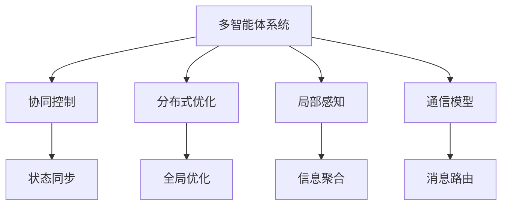

                 

# 反思与多智能体协同的综合应用案例

## 1. 背景介绍

在人工智能（AI）的探索历程中，多智能体协同（Multi-agent Cooperation）是一个备受瞩目的研究方向。这一领域旨在模拟人类社会中的复杂交互，以解决单智能体模型难以应对的现实问题。近年来，随着深度学习技术的飞速进步，多智能体协同系统在自动驾驶、智慧医疗、协作机器人等领域得到了广泛应用，并取得了显著的成效。然而，多智能体系统面临的挑战依然严峻，需要不断地探索和实践来完善其理论基础和应用场景。

## 2. 核心概念与联系

### 2.1 核心概念概述

为了深入理解多智能体协同系统，首先需要明确以下几个关键概念：

- **多智能体系统（Multi-agent System）**：由多个自治的智能体（Agent）组成的系统，每个智能体具有独立的感知、决策和执行能力，能够通过通信和协作，共同完成复杂任务。

- **协同控制（Cooperative Control）**：通过协调多个智能体的行动，实现系统整体性能的提升。协同控制通常涉及到智能体间的信息共享、状态同步、决策优化等复杂过程。

- **分布式优化（Distributed Optimization）**：在多智能体系统中，目标函数需要在各个智能体之间进行优化，以达到全局最优。分布式优化算法能够有效地处理这种全局性优化问题，如梯度下降、拉格朗日乘子法等。

- **局部感知（Local Perception）**：每个智能体只感知其周围环境的部分信息，而非全局信息。这是由于感知资源有限，同时也为了降低计算复杂度。

- **通信模型（Communication Model）**：描述了智能体之间信息交换的机制，包括通信的频率、延迟、带宽等参数。

这些核心概念之间存在紧密的联系，共同构成了多智能体协同系统的理论基础和实践框架。理解这些概念，有助于我们设计、分析和实现高效的多智能体协同系统。

### 2.2 核心概念原理和架构的 Mermaid 流程图



这个流程图展示了多智能体系统中的核心组件及其相互关系。多智能体系统通过协同控制、分布式优化、局部感知和通信模型，实现系统整体的优化和控制。状态同步和信息聚合是协同控制的关键环节，消息路由则决定了信息交换的效率和安全性。

## 3. 核心算法原理 & 具体操作步骤

### 3.1 算法原理概述

多智能体协同算法通常可以分为集中式（Centralized）和分布式（Distributed）两种形式。集中式算法通过一个中央控制器协调所有智能体的行为，而分布式算法则允许智能体之间直接进行信息交换和决策。分布式优化是分布式算法中的重要组成部分，通过多个智能体的协作，共同优化系统目标。

### 3.2 算法步骤详解

以分布式梯度下降（Distributed Gradient Descent）算法为例，介绍多智能体协同算法的具体操作步骤。

1. **初始化智能体状态**：每个智能体根据自身感知到的局部状态，初始化一个状态向量 $x_i$，其中 $i$ 表示智能体的编号。

2. **计算局部梯度**：智能体 $i$ 计算其状态 $x_i$ 对应的局部梯度 $\nabla f_i(x_i)$，其中 $f_i$ 为目标函数在智能体 $i$ 上的近似。

3. **通信和同步**：智能体之间通过通信模型，交换局部梯度和状态信息，实现状态同步。通常使用广播（Broadcast）或全双工通信（Full-duplex Communication）方式，确保信息的及时性和一致性。

4. **更新状态**：智能体根据接收到的信息，更新自身的状态向量。例如，使用分布式梯度下降算法，智能体 $i$ 的状态更新公式为：
   $$
   x_i \leftarrow x_i - \eta \nabla f_i(x_i) - \sum_{j \in \mathcal{N}_i} \Delta x_{i,j}
   $$
   其中 $\eta$ 为学习率，$\mathcal{N}_i$ 表示智能体 $i$ 的邻居集合。$\Delta x_{i,j}$ 为智能体 $j$ 对智能体 $i$ 状态的影响，通常为通信误码、延迟等因素的补偿。

5. **迭代优化**：重复步骤 2 至步骤 4，直至满足预设的停止条件（如目标函数收敛）。

### 3.3 算法优缺点

分布式梯度下降算法具有以下优点：
- **高效性**：每个智能体独立计算梯度，减少了中央控制器和通信的开销。
- **可扩展性**：通过增加智能体的数量，可以线性扩展系统的计算能力。
- **鲁棒性**：智能体间的通信和同步机制，增强了系统的鲁棒性和容错能力。

然而，该算法也存在以下缺点：
- **同步开销**：通信和同步环节增加了算法的计算复杂度，尤其是在高带宽、高延迟的网络环境下。
- **网络延迟**：通信延迟可能导致智能体间的状态不同步，影响算法的收敛性。
- **信息过载**：智能体间的通信量和数据量较大，可能引发数据过载问题。

### 3.4 算法应用领域

分布式梯度下降算法在多智能体协同系统中的应用领域广泛，包括但不限于：

- **自动驾驶**：多个车辆通过分布式协同控制，实现车队导航、避障等功能。
- **机器人协作**：多个协作机器人通过通信模型，共同完成复杂任务，如装配、搬运等。
- **智能电网**：多个智能电表通过分布式协同优化，实现电力负荷的均衡分配。
- **无线传感器网络**：多个传感器节点通过分布式协同控制，优化数据采集和传输。

## 4. 数学模型和公式 & 详细讲解 & 举例说明

### 4.1 数学模型构建

假设多智能体系统中的目标函数为 $f(x)$，其中 $x$ 为所有智能体状态向量的集合。智能体 $i$ 的状态更新公式为：
$$
x_i \leftarrow x_i - \eta \nabla f_i(x_i) - \sum_{j \in \mathcal{N}_i} \Delta x_{i,j}
$$
其中 $\nabla f_i(x_i)$ 表示智能体 $i$ 的局部梯度，$\eta$ 为学习率，$\mathcal{N}_i$ 表示智能体 $i$ 的邻居集合，$\Delta x_{i,j}$ 表示智能体 $j$ 对智能体 $i$ 状态的影响。

### 4.2 公式推导过程

通过将局部梯度 $\nabla f_i(x_i)$ 和通信误差 $\Delta x_{i,j}$ 代入智能体状态更新公式，可以推导出分布式梯度下降算法的迭代公式。假设智能体 $i$ 的邻居集合 $\mathcal{N}_i$ 中包含智能体 $j$，则智能体 $i$ 的状态更新公式可以表示为：
$$
x_i \leftarrow x_i - \eta \sum_{j \in \mathcal{N}_i} \frac{\partial f_i}{\partial x_i} \nabla f_j(x_j) - \sum_{j \in \mathcal{N}_i} \Delta x_{i,j}
$$
其中 $\frac{\partial f_i}{\partial x_i}$ 表示目标函数 $f(x)$ 对智能体 $i$ 状态的偏导数。

### 4.3 案例分析与讲解

以一个简单的合作生产系统为例，分析分布式梯度下降算法的应用。假设系统中有 $n$ 个智能体，每个智能体的生产率分别为 $r_i$，总生产目标为 $R$。智能体间的通信延迟为 $\delta$，智能体 $i$ 的生产率 $r_i$ 对智能体 $j$ 的影响系数为 $\alpha_{i,j}$。系统通过分布式梯度下降算法优化生产目标 $R$，智能体 $i$ 的状态更新公式为：
$$
r_i \leftarrow r_i - \eta \frac{R - \sum_{j=1}^n r_j}{n} - \sum_{j=1}^n \alpha_{i,j} (r_j - r_i) \delta
$$
其中 $\eta$ 为学习率，$\frac{R - \sum_{j=1}^n r_j}{n}$ 表示智能体间的目标函数梯度，$\alpha_{i,j} (r_j - r_i) \delta$ 表示通信误差对智能体 $i$ 生产率的影响。

## 5. 项目实践：代码实例和详细解释说明

### 5.1 开发环境搭建

为了进行多智能体协同系统的开发，我们需要准备以下环境：

1. **编程语言**：Python是最常用的多智能体系统开发语言之一，具有丰富的库和工具支持。

2. **框架和库**：OpenMPI、MPI4PY 和 GLOO 等分布式通信库，可以用于实现智能体间的通信。TensorFlow 和 PyTorch 等深度学习框架，可以用于智能体的局部计算和优化。

3. **操作系统**：Linux 和 macOS 系统提供了良好的开发环境支持。

### 5.2 源代码详细实现

以下是一个简单的多智能体协同系统的代码实现示例，使用 MPI4PY 库实现智能体间的通信和状态更新。

```python
from mpi4py import MPI
import numpy as np

comm = MPI.COMM_WORLD
rank = comm.Get_rank()

# 定义智能体状态和局部梯度
x = np.zeros((comm.size, 1))
grads = np.zeros_like(x)

# 定义局部目标函数和通信误差
def f(x):
    return np.sum(x) ** 2

def grad_f(x):
    return 2 * x

def delta_x(x, delta):
    return np.zeros_like(x)

# 计算局部梯度
x[rank] = rank * 0.1
grads[rank] = grad_f(x[rank])

# 通信和同步
if rank == 0:
    grads[1:] = np.broadcast_to(grads[0], x.shape[0])
comm.Bcast(grads, root=0)
comm.Barrier()

# 更新状态
x[rank] = x[rank] - 0.01 * grads[rank] - delta_x(x[rank], 0.01)

# 迭代优化
for i in range(100):
    grads.fill(0)
    x.fill(0)

    # 计算局部梯度
    for j in range(comm.size):
        x[j] = j * 0.1
        grads[j] = grad_f(x[j])

    # 通信和同步
    comm.Barrier()
    if rank == 0:
        grads[1:] = np.broadcast_to(grads[0], x.shape[0])
    comm.Bcast(grads, root=0)

    # 更新状态
    x[rank] = x[rank] - 0.01 * grads[rank] - delta_x(x[rank], 0.01)

    # 打印状态和梯度
    print(f"Iteration {i+1}: rank={rank}, x={x[rank]}, grad={grads[rank]}")

```

### 5.3 代码解读与分析

上述代码实现了一个简单的多智能体协同系统，用于优化生产目标。每个智能体的状态为自身编号乘以 0.1，局部目标函数为局部状态的平方和。在每个迭代步骤中，智能体通过通信库 MPI4PY 实现状态同步和梯度交换，并通过分布式梯度下降算法更新自身状态。

代码中，`MPI.COMM_WORLD` 表示所有智能体的通信组，`MPI.COMM_WORLD.Get_rank()` 返回当前智能体的编号。`numpy` 库用于矩阵和数组计算，`mpi4py` 库用于实现智能体间的通信。

## 6. 实际应用场景

### 6.1 自动驾驶

自动驾驶系统中的车辆和传感器可以构成多智能体系统，通过协同控制和分布式优化，实现车队导航、避障等功能。例如，在高速公路上，多个车辆通过通信协议交换位置和速度信息，协同决策最优车道和速度，实现智能驾驶。

### 6.2 机器人协作

协作机器人通过通信协议，共同完成复杂任务。例如，在装配线上，多个机器人通过分布式协同优化，实现物料搬运和装配，提高生产效率。

### 6.3 智能电网

智能电表通过分布式优化算法，优化电力负荷的均衡分配。例如，在电网中，多个电表通过通信协议交换实时电量数据，协同决策最优分配策略，实现电网的稳定运行。

### 6.4 未来应用展望

未来，随着多智能体协同技术的不断进步，其在更广泛的领域中将会得到更广泛的应用。例如：

- **智慧城市**：多个传感器和设备通过协同控制，优化城市交通、能源、环境等资源的管理。
- **物联网（IoT）**：多个智能设备通过分布式优化，实现资源的高效利用和协同工作。
- **金融系统**：多个智能交易系统通过协同控制，优化资产配置和风险管理。

## 7. 工具和资源推荐

### 7.1 学习资源推荐

- **《多智能体系统：理论与应用》**：这是一本经典的多智能体系统教材，详细介绍了多智能体系统的理论基础和应用实例。

- **《分布式计算：原理与实践》**：这本书介绍了分布式计算的基本原理和常用算法，包括分布式梯度下降等。

- **Coursera 课程《多智能体系统》**：由多智能体系统领域的研究者开设的在线课程，提供系统化的多智能体系统学习路径。

- **Kaggle 竞赛**：Kaggle 上有很多多智能体系统相关的竞赛和项目，通过实践学习可以更深刻地理解多智能体协同技术。

### 7.2 开发工具推荐

- **MPI4PY**：用于实现多智能体系统中的通信，支持多种通信协议和算法。

- **PyTorch**：深度学习框架，支持分布式计算和协同优化。

- **GLOO**：分布式通信库，提供高性能的网络通信支持。

### 7.3 相关论文推荐

- **《A Survey on Distributed Machine Learning: Algorithms, Tools, and Applications》**：综述了分布式机器学习的算法、工具和应用，对多智能体协同算法有很好的参考价值。

- **《Multi-Agent Systems: Exploring the Boundaries of Cooperation》**：分析了多智能体系统的边界和挑战，为多智能体协同系统的发展提供了理论支持。

## 8. 总结：未来发展趋势与挑战

### 8.1 未来发展趋势

未来，多智能体协同技术将在以下几个方面取得新的突破：

1. **实时性**：随着通信技术的进步，多智能体系统将实现更高频率和更低延迟的通信，提升实时性和响应速度。

2. **可扩展性**：多智能体系统将能够支持更大规模和更复杂的网络结构，满足各种实际需求。

3. **鲁棒性**：分布式优化算法将更注重鲁棒性设计，确保系统在面对异常和故障时依然能够稳定运行。

4. **自适应性**：多智能体系统将具备更高的自适应能力，能够根据环境变化和任务需求动态调整策略。

### 8.2 面临的挑战

尽管多智能体协同技术在近年来取得了显著进展，但仍面临以下挑战：

1. **通信开销**：大规模网络通信的开销仍然是多智能体系统的瓶颈，需要进一步优化通信协议和算法。

2. **同步问题**：智能体间的同步和状态更新可能导致系统不稳定，需要更高效的同步机制。

3. **计算资源**：多智能体系统需要大量的计算资源支持，如何高效利用计算资源是重要的研究方向。

4. **安全性和隐私**：多智能体系统中存在大量的通信和数据交换，需要采取有效的安全措施和隐私保护策略。

### 8.3 研究展望

未来，多智能体协同技术的研究将在以下几个方向继续深入：

1. **分布式优化算法**：研究更高效、更鲁棒的分布式优化算法，提升系统的优化效果和稳定性。

2. **联邦学习**：将联邦学习引入多智能体系统，实现全局优化和本地计算的协同。

3. **分布式计算**：探索更高效的分布式计算模型和算法，支持大规模、高复杂度的任务处理。

4. **模型解释和可解释性**：提升多智能体系统的可解释性，增强系统透明性和可理解性。

## 9. 附录：常见问题与解答

**Q1: 什么是多智能体系统？**

A: 多智能体系统是由多个自治的智能体组成的系统，每个智能体具有独立的感知、决策和执行能力，能够通过通信和协作，共同完成复杂任务。

**Q2: 多智能体系统中的通信模型包括哪些内容？**

A: 多智能体系统中的通信模型通常包括通信协议、通信延迟、带宽等参数，用于描述智能体间的信息交换机制。

**Q3: 多智能体系统的分布式优化算法有哪些？**

A: 多智能体系统的分布式优化算法包括梯度下降、拉格朗日乘子法、共识算法等，其中梯度下降算法应用最广泛。

**Q4: 如何优化多智能体系统的通信开销？**

A: 优化通信开销的方法包括使用高效的通信协议（如GLOO、MPI4PY）、减少通信频率、增加缓存机制等。

**Q5: 如何提升多智能体系统的鲁棒性？**

A: 提升鲁棒性的方法包括引入冗余通信、使用容错机制、设计自适应策略等。

**Q6: 多智能体系统中的同步问题有哪些解决方案？**

A: 同步问题的解决方案包括使用同步机制（如 consensus 算法）、增加通信冗余、设计分布式算法等。

---

作者：禅与计算机程序设计艺术 / Zen and the Art of Computer Programming

