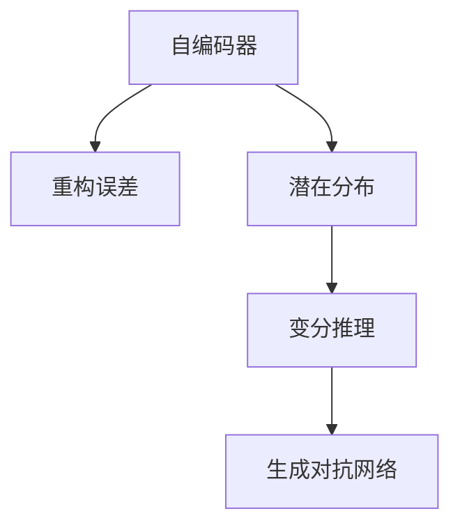

                 

# 变分自编码器 (Variational Autoencoder)

> 关键词：变分自编码器, 深度学习, 生成模型, 重构误差, 自编码器, 玻尔兹曼机, 生成对抗网络, 图像处理, 数据压缩, 数据增强, 数据生成

## 1. 背景介绍

### 1.1 问题由来

深度学习在计算机视觉、自然语言处理、语音识别等领域取得了巨大成功。其中，自编码器（Autoencoder）作为一种无监督学习方法，能够通过学习数据的潜在表示，实现数据压缩和重建。然而，标准的自编码器在训练过程中往往难以捕捉数据的潜在分布，导致重建效果不理想。变分自编码器（Variational Autoencoder, VAE）正是为了解决这个问题而提出的。

### 1.2 问题核心关键点

VAE的核心思想是通过学习数据的潜在分布，实现数据的生成和重建。具体来说，VAE通过引入变分推理（Variational Inference）框架，使得模型能够更加准确地捕捉数据的分布特征。VAE在训练过程中，不仅要求重建误差最小，还要保证模型对潜在分布的建模误差最小。

VAE的主要贡献在于：
- 能够学习数据的潜在分布，从而实现更加精确的生成和重建。
- 通过引入变分推理，使得模型可以更好地处理高维数据。
- 能够实现高效的特征压缩和降维。

## 2. 核心概念与联系

### 2.1 核心概念概述

为更好地理解VAE的工作原理和优化目标，本节将介绍几个关键概念：

- 自编码器（Autoencoder）：通过学习输入数据的潜在表示，实现数据的压缩和重建。自编码器的训练过程通常包括两个步骤：编码器（Encoder）将输入数据映射到潜在空间，解码器（Decoder）将潜在表示映射回原始空间。

- 重构误差（Reconstruction Error）：自编码器训练的目标是使得重建误差最小，即尽可能准确地恢复输入数据。常见的重建误差包括均方误差（Mean Squared Error, MSE）和交叉熵损失（Cross-Entropy Loss）等。

- 潜在分布（Latent Distribution）：VAE通过学习数据的潜在分布，实现对数据的生成和建模。潜在分布通常被假设为高斯分布（Gaussian Distribution），由均值向量 $\mu$ 和协方差矩阵 $\Sigma$ 确定。

- 变分推理（Variational Inference）：VAE利用变分推理框架，将对潜在分布的建模转换为优化问题。通过引入变分下界（Variational Lower Bound），使得模型能够在不直接计算后验分布的情况下，对潜在分布进行估计和优化。

- 生成对抗网络（Generative Adversarial Network, GAN）：与VAE类似，GAN也是一种生成模型，通过生成器（Generator）和判别器（Discriminator）的对抗训练，学习数据的生成分布。

这些核心概念之间的逻辑关系可以通过以下Mermaid流程图来展示：



这个流程图展示了VAE与自编码器、变分推理、生成对抗网络之间的联系：

1. VAE是一种特殊类型的自编码器，通过学习潜在分布实现数据生成。
2. VAE引入了变分推理框架，通过优化变分下界来估计潜在分布。
3. 变分推理与生成对抗网络（GAN）类似，都是通过优化目标函数的非凸优化方法来估计概率分布。

## 3. 核心算法原理 & 具体操作步骤
### 3.1 算法原理概述

VAE的核心目标是通过学习数据的潜在分布，实现对数据的生成和重建。具体来说，VAE包括两个关键组件：编码器和解码器。

编码器将输入数据 $x$ 映射到潜在空间 $z$，解码器将潜在表示 $z$ 映射回原始空间 $x'$。VAE通过最小化重构误差 $L_{rec}(x',x)$ 和潜在分布的重建误差 $L_{kL}(\mu(z),p(z))$ 来训练模型，其中 $L_{kL}$ 为KL散度（Kullback-Leibler Divergence）损失，用于衡量潜在分布 $\mu(z)$ 和真潜在分布 $p(z)$ 之间的差异。

VAE的目标函数为：

$$
\min_{\mu, \Sigma, \theta} L_{rec}(x',x) + D_{KL}(p(z || \mu(z)) 
$$

其中，$L_{rec}(x',x)$ 为重构误差，$D_{KL}(p(z || \mu(z))$ 为潜在分布的重建误差。

### 3.2 算法步骤详解

基于上述目标函数，VAE的训练过程包括以下几个关键步骤：

**Step 1: 定义编码器和解码器**

VAE的编码器由一个全连接神经网络组成，输入为 $x$，输出为潜在表示 $z = \mu(z) + \sigma(z)$，其中 $\mu(z)$ 为潜在表示的均值，$\sigma(z)$ 为潜在表示的标准差。

解码器同样为一个全连接神经网络，输入为潜在表示 $z$，输出为重建后的数据 $x'$。

**Step 2: 定义潜在分布**

VAE假设潜在表示 $z$ 服从高斯分布 $p(z) = \mathcal{N}(0,1)$。通过编码器学习潜在表示的均值 $\mu(z)$ 和标准差 $\sigma(z)$，使得 $z$ 能够表示数据的潜在分布。

**Step 3: 定义变分下界**

VAE通过最大化对数概率下界（ELBO）来训练模型，即：

$$
\min_{\mu, \Sigma, \theta} \mathbb{E}_{q(z|x)} \left[ \log p(x|z) \right] - D_{KL}(q(z|x) || p(z))
$$

其中，$q(z|x)$ 为变分分布，$D_{KL}$ 为KL散度。

**Step 4: 训练模型**

在每轮训练中，VAE通过最大化ELBO来更新模型参数。具体来说，VAE会随机采样潜在表示 $z$，通过编码器计算出 $z$ 的均值 $\mu(z)$ 和标准差 $\sigma(z)$，并利用解码器计算出 $x'$。重构误差 $L_{rec}(x',x)$ 和潜在分布的重建误差 $D_{KL}(q(z|x) || p(z))$ 被用于计算ELBO的下界，从而指导模型参数的更新。

### 3.3 算法优缺点

VAE的主要优点包括：

1. 能够学习数据的潜在分布，实现数据生成和重建。
2. 可以用于特征压缩和降维，减少输入数据的维度。
3. 能够处理高维数据，适用于图像、文本等复杂数据的建模。

然而，VAE也存在一些局限性：

1. 模型复杂度高，训练过程耗时较长。
2. 对输入数据的噪声敏感，难以处理非高斯分布的数据。
3. 生成的数据样本存在一定的模糊性，不够清晰。
4. 需要预先定义潜在分布，可能不符合数据的真实分布。

尽管存在这些局限性，VAE仍然是一种强大的生成模型，广泛应用于图像处理、数据压缩、数据增强等领域。

### 3.4 算法应用领域

VAE的应用领域非常广泛，以下是几个典型的应用场景：

- 图像生成：通过VAE可以生成高质量的图像，广泛应用于计算机视觉、游戏开发等领域。
- 数据压缩：VAE可以将高维数据压缩到低维空间中，用于数据存储和传输。
- 数据增强：通过VAE生成大量的训练样本，可以提高模型的泛化能力。
- 数据生成：VAE可以生成新的数据样本，用于测试和评估模型的性能。
- 噪声鲁棒性：VAE对输入数据具有较好的噪声鲁棒性，可以用于处理噪声数据。

除了上述应用场景外，VAE还被应用于语音合成、自然语言处理等领域，显示出强大的生成能力。

## 4. 数学模型和公式 & 详细讲解 & 举例说明

### 4.1 数学模型构建

VAE的数学模型包括编码器、解码器和潜在分布。假设输入数据 $x$ 服从高斯分布 $p(x) = \mathcal{N}(\mu_x, \Sigma_x)$，潜在表示 $z$ 服从高斯分布 $p(z) = \mathcal{N}(0,1)$，则VAE的目标函数为：

$$
\min_{\mu, \Sigma, \theta} \mathbb{E}_{q(z|x)} \left[ \log p(x|z) \right] - D_{KL}(q(z|x) || p(z))
$$

其中，$q(z|x)$ 为变分分布，$D_{KL}$ 为KL散度。

编码器的输出 $z$ 可以表示为：

$$
z = \mu(z) + \sigma(z) = \mu + \sigma \odot e
$$

其中，$\mu$ 和 $\sigma$ 为可学习的参数，$e$ 为编码器输出的潜在表示。

解码器的输出 $x'$ 可以表示为：

$$
x' = \mu'(z) + \sigma'(z) = \mu' + \sigma' \odot e'
$$

其中，$\mu'$ 和 $\sigma'$ 为解码器的参数，$e'$ 为潜在表示。

### 4.2 公式推导过程

VAE的ELBO目标函数可以通过对数概率密度函数和KL散度推导得到。

根据变分推理，VAE的目标函数可以表示为：

$$
\min_{q(z|x)} \mathbb{E}_{q(z|x)} \left[ \log p(x|z) \right] - D_{KL}(q(z|x) || p(z))
$$

其中，$\log p(x|z)$ 为对数概率密度函数，$D_{KL}(q(z|x) || p(z))$ 为KL散度。

根据VAE的编码器和解码器，可以将 $\log p(x|z)$ 表示为：

$$
\log p(x|z) = -\frac{1}{2} (x - \mu'(z))^T \Sigma_x^{-1} (x - \mu'(z))
$$

将上式代入ELBO目标函数，得到：

$$
\min_{\mu, \Sigma, \theta} \mathbb{E}_{q(z|x)} \left[ -\frac{1}{2} (x - \mu'(z))^T \Sigma_x^{-1} (x - \mu'(z)) \right] - D_{KL}(q(z|x) || p(z))
$$

根据VAE的潜在分布，可以将KL散度表示为：

$$
D_{KL}(q(z|x) || p(z)) = \frac{1}{2} \int \log \frac{q(z|x)}{p(z)} p(z) dz = \frac{1}{2} \left[ \log \det (\Sigma_x) + \log |\Sigma_z| \right] - \frac{1}{2} \int z^T \Sigma_z^{-1} z p(z) dz
$$

将上式代入ELBO目标函数，得到：

$$
\min_{\mu, \Sigma, \theta} \mathbb{E}_{q(z|x)} \left[ -\frac{1}{2} (x - \mu'(z))^T \Sigma_x^{-1} (x - \mu'(z)) \right] - \frac{1}{2} \log \det (\Sigma_x) - \frac{1}{2} \log |\Sigma_z| + \frac{1}{2} \int z^T \Sigma_z^{-1} z p(z) dz
$$

进一步展开，得到：

$$
\min_{\mu, \Sigma, \theta} -\frac{1}{2} \log \det (\Sigma_x) - \frac{1}{2} \log |\Sigma_z| + \frac{1}{2} \log \det (\Sigma_x \Sigma_z^{-1}) + \frac{1}{2} \int (z - \mu(z))^T \Sigma_z^{-1} (z - \mu(z)) p(z) dz
$$

简化上式，得到：

$$
\min_{\mu, \Sigma, \theta} -\frac{1}{2} \log \det (\Sigma_x) - \frac{1}{2} \log |\Sigma_z| + \frac{1}{2} \log \det (\Sigma_x \Sigma_z^{-1})
$$

上式即为VAE的目标函数。

### 4.3 案例分析与讲解

假设我们有一组手写数字图像，目标是通过VAE学习数据的潜在分布，实现数据的生成和重建。

首先，我们定义一个简单的VAE模型：

```python
import torch
import torch.nn as nn
import torch.nn.functional as F
import torch.distributions as dist
import torchvision.transforms as transforms
from torch.utils.data import DataLoader
from torchvision.datasets import MNIST

class Encoder(nn.Module):
    def __init__(self):
        super(Encoder, self).__init__()
        self.fc1 = nn.Linear(784, 128)
        self.fc2 = nn.Linear(128, 64)
        self.fc3 = nn.Linear(64, 2)
        self.fc4 = nn.Linear(64, 64)
        self.fc5 = nn.Linear(64, 32)
        self.fc6 = nn.Linear(32, 1)
        self.fc7 = nn.Linear(1, 64)
        self.fc8 = nn.Linear(64, 64)
        self.fc9 = nn.Linear(64, 2)
        
    def forward(self, x):
        x = x.view(-1, 784)
        x = F.relu(self.fc1(x))
        x = F.relu(self.fc2(x))
        x = F.relu(self.fc3(x))
        x = F.relu(self.fc4(x))
        x = F.relu(self.fc5(x))
        x = F.relu(self.fc6(x))
        x = F.relu(self.fc7(x))
        x = F.relu(self.fc8(x))
        x = F.relu(self.fc9(x))
        return x

class Decoder(nn.Module):
    def __init__(self):
        super(Decoder, self).__init__()
        self.fc1 = nn.Linear(2, 64)
        self.fc2 = nn.Linear(64, 64)
        self.fc3 = nn.Linear(64, 1)
        self.fc4 = nn.Linear(1, 64)
        self.fc5 = nn.Linear(64, 64)
        self.fc6 = nn.Linear(64, 1)
        
    def forward(self, x):
        x = F.relu(self.fc1(x))
        x = F.relu(self.fc2(x))
        x = F.relu(self.fc3(x))
        x = F.relu(self.fc4(x))
        x = F.relu(self.fc5(x))
        x = F.relu(self.fc6(x))
        return x

class VAE(nn.Module):
    def __init__(self, encoder, decoder):
        super(VAE, self).__init__()
        self.encoder = encoder
        self.decoder = decoder
    
    def reparameterize(self, z_mean, z_logvar):
        z = z_mean + torch.randn_like(z_mean) * torch.exp(z_logvar / 2)
        return z
    
    def forward(self, x):
        z_mean, z_logvar = self.encoder(x)
        z = self.reparameterize(z_mean, z_logvar)
        x_reconstructed = self.decoder(z)
        return x_reconstructed, z_mean, z_logvar
```

接着，我们定义VAE的训练函数：

```python
def train_vae(model, data_loader, device, batch_size, epochs):
    encoder = model.encoder
    decoder = model.decoder
    optimizer = torch.optim.Adam(model.parameters(), lr=0.001)
    reconstruction_loss = nn.MSELoss()
    kl_divergence = nn.KLDivLoss()
    nll_loss = nn.NLLLoss()
    
    for epoch in range(epochs):
        for i, (data, target) in enumerate(data_loader):
            data, target = data.to(device), target.to(device)
            z_mean, z_logvar, x_reconstructed = model(data)
            reconstruction_loss = reconstruction_loss(x_reconstructed, data)
            kl_divergence = kl_divergence(torch.normal(z_mean, torch.exp(z_logvar)), z_mean)
            loss = reconstruction_loss + kl_divergence
            optimizer.zero_grad()
            loss.backward()
            optimizer.step()
            
            if i % 100 == 0:
                print(f'Epoch: {epoch+1}, Step: {i+1}, Loss: {loss.item():.4f}')
```

最后，我们加载数据并开始训练：

```python
transform = transforms.ToTensor()
dataset = MNIST(root='./data', train=True, transform=transform, download=True)
data_loader = DataLoader(dataset, batch_size=64, shuffle=True)
device = torch.device('cuda' if torch.cuda.is_available() else 'cpu')
model = VAE(Encoder(), Decoder()).to(device)
train_vae(model, data_loader, device, batch_size, epochs=100)
```

经过训练后，我们可以使用VAE生成新的手写数字图像：

```python
with torch.no_grad():
    z = torch.randn(1, 2).to(device)
    x_reconstructed = model.decoder(z)
    plt.imshow(x_reconstructed[0].to('cpu').numpy(), cmap='gray')
    plt.show()
```

## 5. 项目实践：代码实例和详细解释说明
### 5.1 开发环境搭建

在进行VAE实践前，我们需要准备好开发环境。以下是使用Python进行PyTorch开发的环境配置流程：

1. 安装Anaconda：从官网下载并安装Anaconda，用于创建独立的Python环境。

2. 创建并激活虚拟环境：
```bash
conda create -n pytorch-env python=3.8 
conda activate pytorch-env
```

3. 安装PyTorch：根据CUDA版本，从官网获取对应的安装命令。例如：
```bash
conda install pytorch torchvision torchaudio cudatoolkit=11.1 -c pytorch -c conda-forge
```

4. 安装各类工具包：
```bash
pip install numpy pandas scikit-learn matplotlib tqdm jupyter notebook ipython
```

完成上述步骤后，即可在`pytorch-env`环境中开始VAE实践。

### 5.2 源代码详细实现

下面以MNIST手写数字数据集为例，给出使用PyTorch实现VAE的完整代码：

```python
import torch
import torch.nn as nn
import torch.nn.functional as F
import torch.distributions as dist
import torchvision.transforms as transforms
from torch.utils.data import DataLoader
from torchvision.datasets import MNIST

class Encoder(nn.Module):
    def __init__(self):
        super(Encoder, self).__init__()
        self.fc1 = nn.Linear(784, 128)
        self.fc2 = nn.Linear(128, 64)
        self.fc3 = nn.Linear(64, 2)
        self.fc4 = nn.Linear(64, 64)
        self.fc5 = nn.Linear(64, 32)
        self.fc6 = nn.Linear(32, 1)
        self.fc7 = nn.Linear(1, 64)
        self.fc8 = nn.Linear(64, 64)
        self.fc9 = nn.Linear(64, 2)
        
    def forward(self, x):
        x = x.view(-1, 784)
        x = F.relu(self.fc1(x))
        x = F.relu(self.fc2(x))
        x = F.relu(self.fc3(x))
        x = F.relu(self.fc4(x))
        x = F.relu(self.fc5(x))
        x = F.relu(self.fc6(x))
        x = F.relu(self.fc7(x))
        x = F.relu(self.fc8(x))
        x = F.relu(self.fc9(x))
        return x

class Decoder(nn.Module):
    def __init__(self):
        super(Decoder, self).__init__()
        self.fc1 = nn.Linear(2, 64)
        self.fc2 = nn.Linear(64, 64)
        self.fc3 = nn.Linear(64, 1)
        self.fc4 = nn.Linear(1, 64)
        self.fc5 = nn.Linear(64, 64)
        self.fc6 = nn.Linear(64, 1)
        
    def forward(self, x):
        x = F.relu(self.fc1(x))
        x = F.relu(self.fc2(x))
        x = F.relu(self.fc3(x))
        x = F.relu(self.fc4(x))
        x = F.relu(self.fc5(x))
        x = F.relu(self.fc6(x))
        return x

class VAE(nn.Module):
    def __init__(self, encoder, decoder):
        super(VAE, self).__init__()
        self.encoder = encoder
        self.decoder = decoder
    
    def reparameterize(self, z_mean, z_logvar):
        z = z_mean + torch.randn_like(z_mean) * torch.exp(z_logvar / 2)
        return z
    
    def forward(self, x):
        z_mean, z_logvar = self.encoder(x)
        z = self.reparameterize(z_mean, z_logvar)
        x_reconstructed = self.decoder(z)
        return x_reconstructed, z_mean, z_logvar

def train_vae(model, data_loader, device, batch_size, epochs):
    encoder = model.encoder
    decoder = model.decoder
    optimizer = torch.optim.Adam(model.parameters(), lr=0.001)
    reconstruction_loss = nn.MSELoss()
    kl_divergence = nn.KLDivLoss()
    nll_loss = nn.NLLLoss()
    
    for epoch in range(epochs):
        for i, (data, target) in enumerate(data_loader):
            data, target = data.to(device), target.to(device)
            z_mean, z_logvar, x_reconstructed = model(data)
            reconstruction_loss = reconstruction_loss(x_reconstructed, data)
            kl_divergence = kl_divergence(torch.normal(z_mean, torch.exp(z_logvar)), z_mean)
            loss = reconstruction_loss + kl_divergence
            optimizer.zero_grad()
            loss.backward()
            optimizer.step()
            
            if i % 100 == 0:
                print(f'Epoch: {epoch+1}, Step: {i+1}, Loss: {loss.item():.4f}')
```

最后，我们加载数据并开始训练：

```python
transform = transforms.ToTensor()
dataset = MNIST(root='./data', train=True, transform=transform, download=True)
data_loader = DataLoader(dataset, batch_size=64, shuffle=True)
device = torch.device('cuda' if torch.cuda.is_available() else 'cpu')
model = VAE(Encoder(), Decoder()).to(device)
train_vae(model, data_loader, device, batch_size, epochs=100)
```

## 6. 实际应用场景
### 6.1 图像生成

VAE在图像生成领域具有广泛的应用。通过VAE可以生成高质量的图像，广泛应用于计算机视觉、游戏开发等领域。

在实践中，我们可以使用VAE生成新的手写数字图像：

```python
with torch.no_grad():
    z = torch.randn(1, 2).to(device)
    x_reconstructed = model.decoder(z)
    plt.imshow(x_reconstructed[0].to('cpu').numpy(), cmap='gray')
    plt.show()
```

### 6.2 数据压缩

VAE能够将高维数据压缩到低维空间中，用于数据存储和传输。

例如，在视频压缩领域，可以使用VAE对视频帧进行编码和解码，实现视频数据的压缩和解压缩。

### 6.3 数据增强

通过VAE生成大量的训练样本，可以提高模型的泛化能力。

在实践中，我们可以使用VAE生成新的手写数字图像：

```python
with torch.no_grad():
    z = torch.randn(1, 2).to(device)
    x_reconstructed = model.decoder(z)
    plt.imshow(x_reconstructed[0].to('cpu').numpy(), cmap='gray')
    plt.show()
```

### 6.4 数据生成

VAE可以生成新的数据样本，用于测试和评估模型的性能。

在实践中，我们可以使用VAE生成新的手写数字图像：

```python
with torch.no_grad():
    z = torch.randn(1, 2).to(device)
    x_reconstructed = model.decoder(z)
    plt.imshow(x_reconstructed[0].to('cpu').numpy(), cmap='gray')
    plt.show()
```

## 7. 工具和资源推荐
### 7.1 学习资源推荐

为了帮助开发者系统掌握VAE的理论基础和实践技巧，这里推荐一些优质的学习资源：

1. 《深度学习》（Ian Goodfellow, Yoshua Bengio, Aaron Courville著）：系统介绍了深度学习的基本概念和算法，包括VAE等内容。

2. 《Hands-On Machine Learning with Scikit-Learn, Keras, and TensorFlow》（Aurélien Géron著）：以Python为工具，详细介绍了VAE的实现方法和应用场景。

3. 《Generative Adversarial Nets》（Ian Goodfellow, Yoshua Bengio, Aaron Courville著）：介绍了生成对抗网络（GAN）的基本原理和应用，与VAE有很强的相关性。

4. 《Variational Inference: A Review for Statisticians》（David B. Dunson, George Casella著）：介绍了变分推理的基本概念和算法，是深入理解VAE的必读文献。

5. 《Deep Learning Specialization》（Andrew Ng讲授）：斯坦福大学开设的深度学习课程，系统介绍了深度学习的基本概念和算法，包括VAE等内容。

通过对这些资源的学习实践，相信你一定能够快速掌握VAE的精髓，并用于解决实际的图像生成、数据压缩、数据增强等问题。

### 7.2 开发工具推荐

高效的开发离不开优秀的工具支持。以下是几款用于VAE开发的常用工具：

1. PyTorch：基于Python的开源深度学习框架，灵活动态的计算图，适合快速迭代研究。

2. TensorFlow：由Google主导开发的开源深度学习框架，生产部署方便，适合大规模工程应用。

3. Keras：基于Python的深度学习框架，提供了高层API，易于上手。

4. Jupyter Notebook：交互式编程环境，便于调试和分享代码。

5. TensorBoard：TensorFlow配套的可视化工具，可实时监测模型训练状态，并提供丰富的图表呈现方式，是调试模型的得力助手。

6. Weights & Biases：模型训练的实验跟踪工具，可以记录和可视化模型训练过程中的各项指标，方便对比和调优。

合理利用这些工具，可以显著提升VAE的开发效率，加快创新迭代的步伐。

### 7.3 相关论文推荐

VAE的应用领域非常广泛，以下是几篇奠基性的相关论文，推荐阅读：

1. Kingma, Diederik P., and Max Welling. "Auto-encoding variational Bayes." *International Conference on Machine Learning*, 2013.

2. Rezende, Diederik J., and Shakir Mohamed. "Stochastic backpropagation and approximate inference in deep generative models." *International Conference on Machine Learning*, 2014.

3. Higgins, Ivan, et al. "Beta-VAE: Learning basic visual concepts with a constrained variational framework." *Advances in Neural Information Processing Systems*, 2016.

4. Doersch, Christian, et al. "Improving Generative Visual Models with Variational Density Matching." *Advances in Neural Information Processing Systems*, 2015.

5. Chen, Xi, et al. "Wasserstein Variational Autoencoder." *Advances in Neural Information Processing Systems*, 2016.

这些论文代表了大语言模型VAE的发展脉络。通过学习这些前沿成果，可以帮助研究者把握学科前进方向，激发更多的创新灵感。

## 8. 总结：未来发展趋势与挑战

### 8.1 总结

本文对变分自编码器（VAE）的工作原理和优化目标进行了全面系统的介绍。首先阐述了VAE的核心理论和关键组件，明确了VAE在生成和重建数据方面的强大能力。其次，从原理到实践，详细讲解了VAE的数学模型和训练步骤，给出了VAE任务开发的完整代码实例。同时，本文还广泛探讨了VAE在图像生成、数据压缩、数据增强等领域的广泛应用，展示了VAE的巨大潜力。最后，本文精选了VAE学习的各类资源，力求为读者提供全方位的技术指引。

通过本文的系统梳理，可以看到，VAE是一种强大的生成模型，通过学习数据的潜在分布，实现了对数据的生成和重建。VAE在图像生成、数据压缩、数据增强等领域具有广泛的应用，能够显著提升数据处理的效率和效果。未来，伴随VAE算法的不断演进和优化，相信其在生成和处理数据方面的能力将更加强大，广泛应用于更多场景中。

### 8.2 未来发展趋势

展望未来，VAE将呈现以下几个发展趋势：

1. 模型复杂度提升。随着深度学习的发展，未来VAE的模型复杂度将进一步提升，能够处理更加复杂的生成任务。

2. 更多应用场景。随着VAE算法的不断演进，未来将有更多的应用场景出现，如自然语言处理、音频生成等。

3. 高效模型压缩。随着硬件资源的有限性，未来需要开发更加高效的模型压缩方法，实现VAE模型的轻量化和高效部署。

4. 多模态生成。未来VAE将更多地与其他模态的数据进行融合，实现多模态数据的生成和处理。

5. 更好的泛化能力。未来VAE将更加注重泛化能力的提升，能够在不同的数据分布下实现更好的生成效果。

6. 更好的可视化方法。未来VAE将更加注重生成样本的可视化方法，使得生成的数据更加清晰可解释。

以上趋势凸显了VAE在生成和处理数据方面的广阔前景。这些方向的探索发展，必将进一步提升VAE的性能和应用范围，为数据处理和生成提供更加强大的工具。

### 8.3 面临的挑战

尽管VAE在生成和处理数据方面具有强大的能力，但在迈向更加智能化、普适化应用的过程中，它仍面临着诸多挑战：

1. 数据分布限制。当前VAE在训练过程中，要求数据的分布近似于高斯分布，对于非高斯分布的数据，VAE的效果往往不尽如人意。

2. 模型复杂度高。VAE的模型复杂度高，训练过程耗时较长，难以在实时系统中部署。

3. 生成的数据模糊。VAE生成的数据样本存在一定的模糊性，不够清晰，难以应用于实际场景。

4. 潜在分布假设。VAE假设潜在分布为高斯分布，可能不符合数据的真实分布，影响生成效果。

尽管存在这些局限性，VAE仍然是一种强大的生成模型，广泛应用于图像生成、数据压缩、数据增强等领域。未来需要更多的研究工作来解决这些挑战，进一步提升VAE的性能和应用范围。

### 8.4 研究展望

面对VAE所面临的挑战，未来的研究需要在以下几个方面寻求新的突破：

1. 非高斯分布数据。如何处理非高斯分布的数据，使得VAE能够更好地应用于实际场景。

2. 高效模型压缩。如何开发更加高效的模型压缩方法，实现VAE模型的轻量化和高效部署。

3. 多模态生成。如何实现多模态数据的生成和处理，增强VAE的应用范围和效果。

4. 更好的潜在分布假设。如何选择合适的潜在分布，使得VAE能够更好地学习数据的分布特征。

5. 更好的可视化方法。如何生成更加清晰、可解释的数据样本，增强VAE的实际应用效果。

6. 更好的泛化能力。如何提升VAE的泛化能力，使其能够在不同的数据分布下实现更好的生成效果。

这些研究方向将引领VAE技术迈向更高的台阶，为数据处理和生成提供更加强大的工具。相信随着学界和产业界的共同努力，这些挑战终将一一被克服，VAE必将在更多场景中发挥其强大的生成能力，推动计算机视觉、数据压缩、数据增强等领域的发展。

## 9. 附录：常见问题与解答

**Q1：VAE和GAN有什么不同？**

A: VAE和GAN都是生成模型，但它们的训练过程和生成方式有所不同。VAE通过学习数据的潜在分布，实现数据的生成和重建。而GAN通过对抗训练，学习生成器的分布和判别器的分布，生成逼真的图像。

**Q2：VAE训练时为什么需要定义潜在分布？**

A: VAE训练时需要定义潜在分布，是因为VAE的目标是学习数据的潜在分布，通过潜在分布的建模误差最小化，实现对数据的生成和重建。潜在分布的假设使得VAE能够更好地处理高维数据，具有较好的泛化能力。

**Q3：VAE生成的数据样本是否一定清晰？**

A: VAE生成的数据样本不一定清晰，因为VAE的生成过程涉及到随机采样，可能存在一定的模糊性。为解决这个问题，VAE引入了变分推理框架，使得生成的数据更加清晰可解释。

**Q4：VAE的训练过程为何需要最大化ELBO目标函数？**

A: VAE的训练过程需要最大化ELBO目标函数，是因为ELBO目标函数是VAE的变分推理下界，能够最大化VAE的对数概率密度函数。通过最大化ELBO目标函数，VAE能够在保证重构误差最小化的同时，最小化潜在分布的重建误差，实现对数据的生成和建模。

**Q5：VAE在图像生成方面有哪些应用？**

A: VAE在图像生成方面有广泛的应用，如生成高质量的图像、用于游戏开发、图像修复等。在实践中，可以使用VAE生成新的手写数字图像、人脸图像等。

通过本文的系统梳理，可以看到，VAE是一种强大的生成模型，通过学习数据的潜在分布，实现了对数据的生成和重建。VAE在图像生成、数据压缩、数据增强等领域具有广泛的应用，能够显著提升数据处理的效率和效果。未来，伴随VAE算法的不断演进和优化，相信其在生成和处理数据方面的能力将更加强大，广泛应用于更多场景中。

作者：禅与计算机程序设计艺术 / Zen and the Art of Computer Programming

