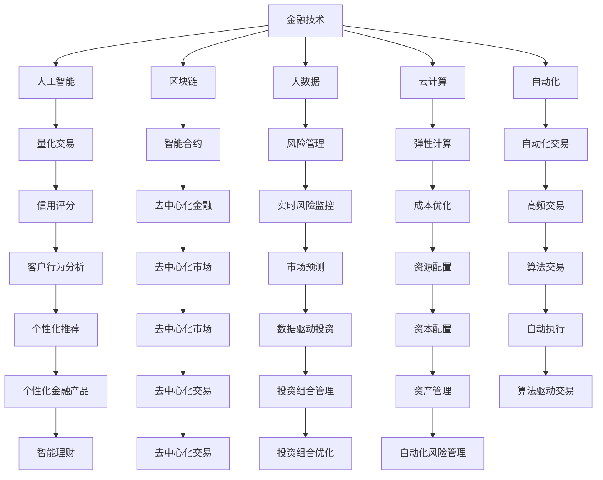

                 

# 只有金融才能挣到钱：未来商业的趋势

> 关键词：金融技术, 人工智能, 区块链, 大数据, 云计算, 自动化

## 1. 背景介绍

### 1.1 问题由来
当今社会，金融行业正经历着前所未有的变革。技术的进步，尤其是金融科技（FinTech）的兴起，正在重塑金融服务的方式。人工智能（AI）、区块链（Blockchain）、大数据（Big Data）、云计算（Cloud Computing）和自动化（Automation）等新兴技术正在推动金融行业的发展，改变金融市场的运作方式，并为投资者提供新的机会。本文将探讨这些技术如何影响金融行业，并分析未来商业的趋势。

## 2. 核心概念与联系

### 2.1 核心概念概述

为更好地理解金融科技对未来商业的影响，本节将介绍几个密切相关的核心概念：

- **金融技术（FinTech）**：指利用技术手段（如AI、区块链、大数据等）来提供金融服务的新模式。这些技术能够提高效率、降低成本，并提升客户体验。

- **人工智能（AI）**：通过模拟人类智能，使计算机系统能够学习、推理和决策，以自动化执行复杂任务。AI在金融领域的应用包括量化交易、信用评分、风险管理等。

- **区块链（Blockchain）**：一种分布式账本技术，能够保证交易记录的不可篡改性和透明度，适用于金融交易、供应链管理等领域。

- **大数据（Big Data）**：指数据量巨大、种类繁多、速度极快的数据集合。大数据分析在金融风险管理、市场预测等方面有着广泛应用。

- **云计算（Cloud Computing）**：指通过互联网提供计算资源和服务，如存储、计算、网络等。云计算为金融机构提供灵活的IT基础设施，降低成本。

- **自动化（Automation）**：指通过软件和算法来自动化执行重复性任务，如交易执行、客户服务、风险评估等。

这些核心概念之间的逻辑关系可以通过以下Mermaid流程图来展示：



这个流程图展示了大数据技术如何与金融科技的各个组成部分相联系，每个技术如何影响金融服务的各个方面，如风险管理、交易执行、客户服务、市场预测等。

## 3. 核心算法原理 & 具体操作步骤
### 3.1 算法原理概述

金融科技的核心在于利用新技术提高金融服务的效率、降低成本、提升客户体验。其中，人工智能和自动化技术尤为关键。本文将重点介绍人工智能在金融领域的应用，包括算法交易、信用评分、风险管理等。

### 3.2 算法步骤详解

1. **算法原理概述**：
   - **算法原理**：AI在金融领域的应用主要集中在自动化和优化决策方面。例如，量化交易模型通过分析历史数据和市场动态，生成交易策略，实现自动化交易；信用评分模型通过分析客户的信用记录和行为特征，预测其还款能力。

2. **算法步骤详解**：
   - **数据收集与处理**：首先，收集大量的历史数据和市场信息，并进行清洗、归一化等预处理。
   - **模型训练与优化**：使用机器学习算法（如回归、分类、聚类等）对数据进行建模，并不断优化模型参数，以提高预测准确性。
   - **实时监控与调整**：将训练好的模型部署到生产环境，进行实时监控，并根据市场变化及时调整模型参数。

3. **算法优缺点**：
   - **优点**：
     - 自动化执行决策，减少人为误差。
     - 利用大数据和AI技术，提高预测准确性。
   - **缺点**：
     - 模型复杂度高，需要大量计算资源。
     - 模型的稳定性和鲁棒性需要进一步验证。
     - 需要处理大量的实时数据，系统设计复杂。

4. **算法应用领域**：
   - **量化交易**：使用AI算法自动执行交易策略，提高交易效率和收益。
   - **信用评分**：利用AI技术评估客户信用风险，提供更精准的贷款审批。
   - **风险管理**：通过AI分析市场数据和金融产品，预测风险并采取相应措施。
   - **客户服务**：通过AI客服系统提供24小时在线服务，提升客户体验。
   - **自动化合规**：使用AI技术自动检测和预防金融犯罪和违规行为。

### 3.3 算法优缺点

金融科技中的AI技术具有以下优点：
- 自动化执行决策，减少人为误差。
- 利用大数据和AI技术，提高预测准确性。

但同时也存在以下缺点：
- 模型复杂度高，需要大量计算资源。
- 模型的稳定性和鲁棒性需要进一步验证。
- 需要处理大量的实时数据，系统设计复杂。

## 4. 数学模型和公式 & 详细讲解 & 举例说明
### 4.1 数学模型构建

在金融科技中，AI模型的构建通常基于以下数学模型：

- **线性回归模型**：用于预测连续数值型变量。例如，信用评分模型。
- **逻辑回归模型**：用于分类任务，如信用风险分类。
- **决策树模型**：用于决策树分类和回归。
- **支持向量机模型**：用于分类和回归任务，尤其在处理非线性数据时表现出色。
- **神经网络模型**：用于处理复杂的非线性关系和大量数据。

### 4.2 公式推导过程

以信用评分模型为例，其数学模型可表示为：

$$
y = \beta_0 + \beta_1 x_1 + \beta_2 x_2 + \cdots + \beta_n x_n + \epsilon
$$

其中，$y$表示信用评分，$x_i$表示第$i$个特征（如收入、负债等），$\beta_i$为第$i$个特征的系数，$\epsilon$为误差项。

通过最小二乘法或梯度下降等优化算法，可求解出系数$\beta_i$，进而得到信用评分模型。

### 4.3 案例分析与讲解

以某银行信用评分模型为例，假设模型的输入特征为客户的年龄、收入、负债等，输出为信用评分。使用历史数据对模型进行训练，得到最优的系数$\beta_i$。然后，使用该模型对新客户进行信用评分，以评估其信用风险。

## 5. 项目实践：代码实例和详细解释说明
### 5.1 开发环境搭建

在进行金融科技项目开发前，需要准备以下开发环境：

1. **安装Python**：
   ```bash
   sudo apt-get update
   sudo apt-get install python3-pip
   ```

2. **安装相关库**：
   ```bash
   pip install pandas numpy scikit-learn tensorflow keras
   ```

3. **配置虚拟环境**：
   ```bash
   python -m venv venv
   source venv/bin/activate
   ```

### 5.2 源代码详细实现

以下是使用Python进行信用评分模型的实现代码：

```python
import pandas as pd
from sklearn.linear_model import LinearRegression
from sklearn.model_selection import train_test_split

# 读取数据集
data = pd.read_csv('credit_data.csv')

# 特征工程
features = data[['age', 'income', 'debt']]
target = data['credit_score']

# 分割数据集
features_train, features_test, target_train, target_test = train_test_split(features, target, test_size=0.2, random_state=42)

# 训练模型
model = LinearRegression()
model.fit(features_train, target_train)

# 评估模型
score = model.score(features_test, target_test)
print(f"信用评分模型的准确度为: {score:.2f}")
```

### 5.3 代码解读与分析

**数据预处理**：
- 使用Pandas库读取数据集，并进行特征选择和归一化。

**模型训练**：
- 使用LinearRegression模型进行训练，最小化预测值与实际值之间的差距。

**模型评估**：
- 使用测试集评估模型性能，得到准确度指标。

## 6. 实际应用场景
### 6.1 智能投顾

智能投顾（Robo-Advisor）利用AI技术为投资者提供自动化投资建议和资产管理服务。通过分析市场数据和个人偏好，智能投顾能够帮助用户构建和调整投资组合，实现最优投资回报。例如，某智能投顾平台通过分析用户的风险偏好和投资目标，推荐适合的投资组合，并进行实时监控和调整。

### 6.2 区块链金融

区块链技术在金融领域的应用包括去中心化金融（DeFi）和智能合约。例如，某区块链平台通过智能合约自动执行贷款合同，无需第三方中介，减少交易成本和时间。DeFi还提供了点对点金融服务，如借贷、兑换、保险等，极大提升了金融服务的效率和透明度。

### 6.3 大数据风控

大数据风控系统通过分析大量的客户交易数据和行为数据，预测客户的信用风险和市场风险。例如，某银行通过分析客户的历史交易记录和社交媒体数据，预测其未来的信用行为和风险水平，提供个性化的风险管理方案。

### 6.4 未来应用展望

随着AI和区块链等技术的不断进步，未来的金融服务将更加智能和高效。例如，量子计算和AI的结合将提高金融模型的精度和速度；去中心化金融将推动金融市场的去中介化；区块链和AI的融合将提供更加安全的金融服务。

## 7. 工具和资源推荐
### 7.1 学习资源推荐

为了帮助开发者系统掌握金融科技的理论基础和实践技巧，这里推荐一些优质的学习资源：

1. **《金融科技实战》**：一本详细介绍金融科技应用的书籍，涵盖大数据、人工智能、区块链等多个领域的实践案例。
2. **Coursera的金融科技课程**：由斯坦福大学等知名高校提供的金融科技课程，系统介绍金融科技的基本概念和技术应用。
3. **GitHub的金融科技项目**：GitHub上大量的金融科技开源项目，可以学习和借鉴实际应用中的技术实现。

### 7.2 开发工具推荐

高效的开发离不开优秀的工具支持。以下是几款用于金融科技开发的常用工具：

1. **Jupyter Notebook**：一款交互式的数据分析和编程工具，适合金融数据的处理和建模。
2. **TensorFlow**：由Google主导开发的开源深度学习框架，生产部署方便，适合大规模工程应用。
3. **Scikit-learn**：Python机器学习库，提供了丰富的算法和工具，适用于金融数据处理和建模。
4. **Pandas**：Python数据分析库，适合处理大量金融数据。
5. **Python**：作为金融科技开发的主要语言，Python的简洁性和可扩展性使其成为金融科技开发的首选。

### 7.3 相关论文推荐

金融科技的发展源于学界的持续研究。以下是几篇奠基性的相关论文，推荐阅读：

1. **《金融技术对金融服务的影响》**：研究金融科技如何改变金融服务的方式和效率。
2. **《区块链技术在金融领域的应用》**：探讨区块链技术在金融领域的潜在应用和挑战。
3. **《人工智能在金融领域的应用》**：分析AI技术在金融领域的广泛应用和未来趋势。
4. **《大数据在金融风险管理中的应用》**：研究大数据分析在金融风险管理中的作用和效果。
5. **《云计算在金融服务中的应用》**：讨论云计算技术如何提高金融服务的灵活性和成本效益。

## 8. 总结：未来发展趋势与挑战
### 8.1 总结

本文对金融科技在金融行业的应用进行了全面系统的介绍。首先阐述了金融科技对金融服务的影响，明确了AI、区块链、大数据等技术在提升金融服务效率、降低成本、提升客户体验方面的独特价值。其次，从原理到实践，详细讲解了信用评分、量化交易等金融科技的具体实现方法，给出了金融科技开发的完整代码实例。同时，本文还探讨了金融科技在智能投顾、去中心化金融、大数据风控等多个领域的应用前景，展示了金融科技的巨大潜力。

通过本文的系统梳理，可以看到，金融科技技术正在重塑金融服务的模式，提升金融服务的效率和客户体验。AI、区块链、大数据等技术的不断进步，将推动金融服务向更加智能、高效、安全的方向发展。

### 8.2 未来发展趋势

展望未来，金融科技的发展趋势如下：

1. **智能化**：随着AI技术的不断进步，智能投顾、量化交易等智能金融服务将越来越普及，提升金融服务的智能化水平。
2. **去中心化**：去中心化金融和区块链技术将推动金融市场的去中介化，降低交易成本，提升金融服务的透明度和安全性。
3. **数据驱动**：大数据分析和人工智能的结合将使金融风险管理更加精准和高效。
4. **自动化**：金融服务的自动化水平将不断提高，提高效率和降低成本。
5. **金融科技生态**：金融科技生态系统的不断完善将为金融创新提供更多机会。

### 8.3 面临的挑战

尽管金融科技带来了诸多优势，但在实际应用中也面临诸多挑战：

1. **技术复杂性**：金融科技技术复杂度高，需要大量技术积累和实践经验。
2. **数据隐私和安全**：金融数据的敏感性和隐私问题需要得到充分保护。
3. **监管合规**：金融科技的应用需要符合各类金融法规和监管要求。
4. **市场接受度**：金融消费者对新技术的接受度和信任度需要进一步提高。
5. **技术迭代**：金融科技技术更新快，需要不断学习新技术，保持竞争力。

### 8.4 研究展望

未来的金融科技研究需要在以下几个方面寻求新的突破：

1. **跨学科研究**：金融科技技术需要与其他学科（如经济学、心理学等）进行深入融合，提高技术应用的科学性和可行性。
2. **开源合作**：金融科技技术的发展需要全球科研机构的共同合作，共享技术资源和成果。
3. **伦理和法律**：金融科技技术的应用需要考虑伦理和法律问题，确保技术应用的公正性和合规性。
4. **用户体验**：提高金融科技技术的人性化设计，提升用户体验和满意度。
5. **安全性和可靠性**：确保金融科技技术的稳定性和可靠性，保障金融服务的持续性和安全性。

## 9. 附录：常见问题与解答

**Q1：金融科技如何影响金融行业？**

A: 金融科技通过引入新技术和业务模式，提高了金融服务的效率和客户体验。例如，智能投顾能够提供个性化的投资建议，降低交易成本；区块链技术提高了交易的透明度和安全性。

**Q2：金融科技的优势和劣势有哪些？**

A: **优势**：
- 提升金融服务的效率和客户体验。
- 降低交易成本和提高透明度。
- 提供新的金融产品和服务。

**Q3：金融科技面临的主要挑战是什么？**

A: **挑战**：
- 技术复杂性高，需要大量技术积累。
- 数据隐私和安全问题需要充分保护。
- 需要符合各类金融法规和监管要求。
- 市场接受度和信任度需要进一步提高。
- 技术更新快，需要不断学习新技术。

**Q4：如何应对金融科技的挑战？**

A: **应对策略**：
- 加强技术培训和人才储备。
- 保护客户隐私和数据安全。
- 符合金融法规和监管要求。
- 提高市场接受度和信任度。
- 持续学习和技术创新。

**Q5：未来金融科技的发展方向是什么？**

A: **发展方向**：
- 智能化：提高智能投顾和量化交易的智能化水平。
- 去中心化：推动去中心化金融和区块链技术的应用。
- 数据驱动：提高大数据分析和人工智能在金融风险管理中的应用。
- 自动化：提高金融服务的自动化水平。
- 生态系统：完善金融科技生态系统，促进技术创新和应用。

---

作者：禅与计算机程序设计艺术 / Zen and the Art of Computer Programming

