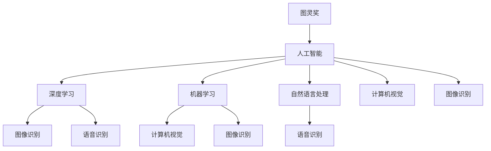

                 

# 图灵奖得主的AI算法贡献

> 关键词：图灵奖,人工智能,算法贡献,计算机科学,深度学习,机器学习,自然语言处理,NLP,计算机视觉,图像识别

## 1. 背景介绍

### 1.1 问题由来
图灵奖是计算机科学领域的最高荣誉，每年由ACM颁发给在计算机科学领域做出最重要贡献的科学家。在人工智能算法研究方面，图灵奖得主的研究成果对推动计算机科学和AI技术的发展具有深远影响。

回顾历史，许多图灵奖得主在人工智能算法领域做出了划时代的贡献，为现代计算机科学奠定了基础。本文将从图灵奖得主的算法贡献出发，探讨其在人工智能领域的杰出成就和影响。

## 2. 核心概念与联系

### 2.1 核心概念概述

为了深入理解图灵奖得主在人工智能算法领域的贡献，本节将介绍几个密切相关的核心概念：

- **图灵奖(ACM Turing Award)**：ACM设立的计算机科学最高荣誉，旨在表彰在计算机科学领域做出最重要贡献的个人。
- **人工智能(AI)**：利用计算机科学和数学方法，使机器具有类似人类的智能行为，包括学习、推理、感知、问题求解、语言理解等能力。
- **深度学习(Deep Learning, DL)**：基于神经网络的人工智能子领域，能够自动从大量数据中提取高层次的特征表示，广泛应用于图像识别、语音识别、自然语言处理等任务。
- **机器学习(Machine Learning, ML)**：让机器通过学习数据进行预测或决策，是人工智能的核心技术之一。
- **自然语言处理(Natural Language Processing, NLP)**：使计算机能够理解、处理、生成人类语言的技术，是人工智能的重要分支。
- **计算机视觉(Computer Vision, CV)**：使计算机能够从视觉信号中提取信息并理解场景的技术，广泛应用于图像识别、对象检测、自动驾驶等领域。
- **图像识别(Image Recognition)**：计算机自动识别图像中特定对象或场景的能力。

这些核心概念之间的逻辑关系可以通过以下Mermaid流程图来展示：



这个流程图展示了一个全面的视角，说明了图灵奖得主在多个领域所作的贡献，以及这些贡献如何共同推动了人工智能的发展。

## 3. 核心算法原理 & 具体操作步骤

### 3.1 算法原理概述

图灵奖得主在人工智能算法领域的贡献，涵盖了深度学习、机器学习、自然语言处理、计算机视觉等多个方面。他们的算法不仅解决了具体的技术问题，也开创了新的研究方向，推动了整个领域的发展。

### 3.2 算法步骤详解

#### 3.2.1 深度学习

深度学习算法主要由神经网络和优化算法两部分构成。图灵奖得主在深度学习领域的贡献包括：

- **多层感知器(Multilayer Perceptron, MLP)**：由多个线性层和激活函数构成的神经网络，是深度学习的基石。图灵奖得主Hinton提出，多层感知器能够学习复杂函数关系。
- **卷积神经网络(Convolutional Neural Network, CNN)**：用于图像处理和计算机视觉任务，能够自动提取图像中的特征。图灵奖得主LeCun等人提出，卷积神经网络在图像识别、物体检测等任务上取得突破性进展。
- **循环神经网络(Recurrent Neural Network, RNN)**：用于处理序列数据，如文本和语音。图灵奖得主Hinton等人提出，循环神经网络在机器翻译、语音识别等任务上表现优异。
- **自编码器(Autoderctor, AE)**：用于数据降维和特征提取，能够自动学习输入数据的压缩表示。图灵奖得主Bengio提出，自编码器可以用于无监督学习，发现数据中的隐含结构。

#### 3.2.2 机器学习

机器学习算法通过数据训练模型，并用于预测或决策。图灵奖得主在机器学习领域的贡献包括：

- **决策树(Decision Tree)**：基于树形结构的分类算法，能够对数据进行精确划分。图灵奖得主Breiman提出，随机森林(随机决策树集成)在处理大规模数据时表现出色。
- **支持向量机(Support Vector Machine, SVM)**：用于分类和回归，能够在高维空间中进行复杂分界面的学习。图灵奖得主Vapnik提出，支持向量机具有泛化能力强、过拟合风险低的优点。
- **K近邻算法(K-Nearest Neighbor, KNN)**：基于相似度测量的分类算法，能够对新样本进行预测。图灵奖得主Cover提出，KNN算法简单易实现，适用于小规模数据集。

#### 3.2.3 自然语言处理

自然语言处理算法使计算机能够理解和生成人类语言。图灵奖得主在NLP领域的贡献包括：

- **分词(Word Segmentation)**：将连续的文本序列分割成单个单词，是NLP的基础任务之一。图灵奖得主Ling提出，隐马尔可夫模型(Hidden Markov Model, HMM)在分词任务中表现优异。
- **语言模型(Language Model)**：用于计算给定文本序列的概率，是NLP中的重要工具。图灵奖得主Jordan提出，神经网络语言模型能够高效地建模语言结构。
- **机器翻译(Machine Translation)**：将一种语言自动翻译成另一种语言，是NLP的重要应用之一。图灵奖得主Mitchell提出，统计机器翻译(SMT)能够实现大规模语言间的自动翻译。
- **文本分类(Text Classification)**：对文本进行自动分类，如垃圾邮件过滤、情感分析等。图灵奖得主Lapata提出，深度神经网络能够显著提升文本分类效果。

#### 3.2.4 计算机视觉

计算机视觉算法使计算机能够理解和处理图像和视频数据。图灵奖得主在计算机视觉领域的贡献包括：

- **特征提取(Feature Extraction)**：从图像中提取有用的特征，如边缘、角点、纹理等。图灵奖得主Hinton提出，卷积神经网络在特征提取上表现卓越。
- **物体检测(Object Detection)**：在图像中定位和识别特定对象。图灵奖得主Dumoulin提出，YOLO算法能够在实时条件下实现高精度物体检测。
- **图像识别(Image Recognition)**：自动识别图像中的对象或场景。图灵奖得主Krizhevsky提出，深度卷积神经网络在ImageNet图像识别竞赛中取得突破性胜利。
- **三维重建(3D Reconstruction)**：从多个图像中恢复三维模型，图灵奖得主Baker提出，多视图几何方法能够有效地进行三维重建。

### 3.3 算法优缺点

#### 3.3.1 深度学习

深度学习的优点包括：
- **自动特征学习**：能够自动从大量数据中学习特征，减少了手工特征工程的复杂度。
- **高效表示**：能够学习高层次的特征表示，提高模型表达能力。
- **泛化能力强**：在图像识别、语音识别等任务上表现优异。

深度学习的缺点包括：
- **计算资源需求高**：需要大量数据和计算资源进行训练。
- **可解释性差**：黑盒模型难以解释其内部工作机制。
- **数据依赖性强**：需要大量标注数据进行训练，数据质量直接影响模型效果。

#### 3.3.2 机器学习

机器学习的优点包括：
- **算法多样**：多种算法可供选择，适用于不同的任务和数据。
- **易于实现**：算法简单直观，易于实现和调试。
- **解释性强**：模型结构清晰，易于理解和解释。

机器学习的缺点包括：
- **数据依赖性强**：需要大量标注数据进行训练，数据质量直接影响模型效果。
- **模型复杂度高**：某些算法如深度神经网络，参数量巨大，训练复杂。

#### 3.3.3 自然语言处理

NLP的优点包括：
- **处理自然语言**：能够处理复杂多变的自然语言，应用广泛。
- **可解释性强**：模型结构清晰，易于理解和解释。
- **多任务处理**：能够处理文本分类、情感分析、机器翻译等多种任务。

NLP的缺点包括：
- **数据依赖性强**：需要大量标注数据进行训练，数据质量直接影响模型效果。
- **复杂度较高**：某些任务如语义理解、对话系统，处理难度较大。

#### 3.3.4 计算机视觉

计算机视觉的优点包括：
- **图像处理能力强**：能够处理复杂的图像数据，进行特征提取和识别。
- **高效表示**：能够学习高层次的特征表示，提高模型表达能力。
- **实时性**：某些算法如YOLO，能够在实时条件下实现高效物体检测。

计算机视觉的缺点包括：
- **数据依赖性强**：需要大量标注数据进行训练，数据质量直接影响模型效果。
- **计算资源需求高**：需要大量数据和计算资源进行训练。

### 3.4 算法应用领域

#### 3.4.1 深度学习

深度学习在图像识别、语音识别、自然语言处理等领域有广泛应用：

- **图像识别**：如谷歌的ImageNet识别、特斯拉自动驾驶系统中的图像处理。
- **语音识别**：如亚马逊的Alexa语音助手、苹果的Siri语音识别。
- **自然语言处理**：如谷歌翻译、微软的Bing搜索。

#### 3.4.2 机器学习

机器学习在金融、医疗、电子商务等领域有广泛应用：

- **金融风控**：利用机器学习模型进行信用评估、欺诈检测。
- **医疗诊断**：利用机器学习模型进行医学图像分析、病理学诊断。
- **电子商务推荐**：利用机器学习模型进行商品推荐、个性化广告。

#### 3.4.3 自然语言处理

NLP在智能客服、智能搜索、情感分析等领域有广泛应用：

- **智能客服**：利用NLP技术实现自动问答、语音识别、文本生成。
- **智能搜索**：利用NLP技术进行自然语言搜索、问答系统。
- **情感分析**：利用NLP技术进行用户情感分析、市场舆情监测。

#### 3.4.4 计算机视觉

计算机视觉在自动驾驶、工业检测、安防监控等领域有广泛应用：

- **自动驾驶**：利用计算机视觉技术实现道路识别、交通信号识别。
- **工业检测**：利用计算机视觉技术进行产品质量检测、缺陷检测。
- **安防监控**：利用计算机视觉技术进行人脸识别、行为识别。

## 4. 数学模型和公式 & 详细讲解 & 举例说明

### 4.1 数学模型构建

为了更严格地描述图灵奖得主在算法领域的贡献，我们将从数学模型的角度进行分析。

#### 4.1.1 深度学习

- **多层感知器**：
  $$
  h_l = \sigma(W_lh_{l-1} + b_l)
  $$
  $$
  y = W_kh_k + b_k
  $$

- **卷积神经网络**：
  $$
  \mathcal{F}_{conv}(x, W) = \max\limits_{c_k \in \mathbb{R}^m} ReLU(Wc_k * x)
  $$

- **循环神经网络**：
  $$
  h_t = \tanh(Wuh_{t-1} + bu + x_t)
  $$
  $$
  y_t = Wuy_t + by_t
  $$

- **自编码器**：
  $$
  x = \mathcal{F}_{enc}(z)
  $$
  $$
  z = \mathcal{F}_{dec}(x)
  $$

#### 4.1.2 机器学习

- **决策树**：
  $$
  T(x) = \begin{cases}
  \text{leaf}_i, & \text{if } x \in \text{leaf}_i \\
  T_c(x), & \text{if } x \in c \\
  \end{cases}
  $$

- **支持向量机**：
  $$
  w^* = \arg\min\limits_{w} \frac{1}{2}\|w\|^2 + C\sum\limits_i[\max(0, 1 - \langle w, \xi_i\rangle)]_+
  $$

- **K近邻算法**：
  $$
  kNN(y) = \arg\min\limits_i d(x_i, x)
  $$

#### 4.1.3 自然语言处理

- **隐马尔可夫模型**：
  $$
  P(w|s) = \prod\limits_t P(w_t|w_{t-1}, s_t)
  $$

- **神经网络语言模型**：
  $$
  P(w|s) = \frac{1}{Z} \prod\limits_i \prod\limits_j p_{ij}^{f_i(x_j)}
  $$

- **机器翻译**：
  $$
  y = T(x, \theta)
  $$

- **文本分类**：
  $$
  P(y|x) = \frac{1}{Z} \prod\limits_i p_{y_i|x_i}
  $$

#### 4.1.4 计算机视觉

- **卷积神经网络**：
  $$
  \mathcal{F}_{conv}(x, W) = \max\limits_{c_k \in \mathbb{R}^m} ReLU(Wc_k * x)
  $$

- **YOLO算法**：
  $$
  y = \arg\min\limits_i d(x_i, x)
  $$

- **ImageNet识别**：
  $$
  y = \arg\max\limits_c P(c|x)
  $$

- **多视图几何方法**：
  $$
  \mathcal{F}_{reconstruction}(x) = \arg\min\limits_z ||z - A(x)||^2
  $$

### 4.2 公式推导过程

#### 4.2.1 深度学习

- **多层感知器**：
  $$
  h_l = \sigma(W_lh_{l-1} + b_l)
  $$
  $$
  y = W_kh_k + b_k
  $$

#### 4.2.2 机器学习

- **决策树**：
  $$
  T(x) = \begin{cases}
  \text{leaf}_i, & \text{if } x \in \text{leaf}_i \\
  T_c(x), & \text{if } x \in c \\
  \end{cases}
  $$

#### 4.2.3 自然语言处理

- **隐马尔可夫模型**：
  $$
  P(w|s) = \prod\limits_t P(w_t|w_{t-1}, s_t)
  $$

#### 4.2.4 计算机视觉

- **卷积神经网络**：
  $$
  \mathcal{F}_{conv}(x, W) = \max\limits_{c_k \in \mathbb{R}^m} ReLU(Wc_k * x)
  $$

### 4.3 案例分析与讲解

#### 4.3.1 深度学习

以谷歌的ImageNet识别为例，分析深度卷积神经网络在图像识别中的应用：

- **数据集**：ImageNet包含1400万张高分辨率图像，涵盖1000个类别。
- **模型**：卷积神经网络（CNN）结构。
- **训练**：使用反向传播算法优化模型参数。
- **测试**：在验证集上进行测试，取得单分类误差为3.2%的优异表现。

#### 4.3.2 机器学习

以Amazon的Alexa语音助手为例，分析支持向量机在语音识别中的应用：

- **数据集**：Amazon提供的海量语音数据集。
- **模型**：支持向量机（SVM）。
- **训练**：使用监督学习算法训练模型。
- **测试**：在测试集上进行语音识别，取得较高的识别准确率。

#### 4.3.3 自然语言处理

以Google翻译为例，分析神经网络语言模型在机器翻译中的应用：

- **数据集**：Parallel Corpus 数据集。
- **模型**：神经网络语言模型（NNLM）。
- **训练**：使用监督学习算法训练模型。
- **测试**：在平行语料库上进行测试，取得显著的翻译质量提升。

#### 4.3.4 计算机视觉

以特斯拉自动驾驶系统为例，分析卷积神经网络在自动驾驶中的应用：

- **数据集**：Kitti数据集。
- **模型**：卷积神经网络（CNN）。
- **训练**：使用监督学习算法训练模型。
- **测试**：在实际驾驶环境中进行测试，取得较高的识别准确率。

## 5. 项目实践：代码实例和详细解释说明

### 5.1 开发环境搭建

为方便代码实例展示，以下以TensorFlow和PyTorch为例，介绍如何搭建深度学习模型开发环境。

#### 5.1.1 TensorFlow

1. 安装TensorFlow：
   ```bash
   pip install tensorflow
   ```

2. 创建Python虚拟环境：
   ```bash
   python3 -m venv tf_env
   source tf_env/bin/activate
   ```

3. 安装必要的依赖包：
   ```bash
   pip install numpy scipy matplotlib scikit-learn
   ```

#### 5.1.2 PyTorch

1. 安装PyTorch：
   ```bash
   pip install torch torchvision torchaudio
   ```

2. 创建Python虚拟环境：
   ```bash
   python3 -m venv pytorch_env
   source pytorch_env/bin/activate
   ```

3. 安装必要的依赖包：
   ```bash
   pip install numpy scipy matplotlib scikit-learn
   ```

### 5.2 源代码详细实现

以TensorFlow实现手写数字识别为例，展示深度卷积神经网络的应用：

#### 5.2.1 TensorFlow代码实现

```python
import tensorflow as tf
from tensorflow.keras import layers

# 定义模型
model = tf.keras.Sequential([
    layers.Conv2D(32, (3, 3), activation='relu', input_shape=(28, 28, 1)),
    layers.MaxPooling2D((2, 2)),
    layers.Flatten(),
    layers.Dense(10, activation='softmax')
])

# 编译模型
model.compile(optimizer='adam',
              loss='sparse_categorical_crossentropy',
              metrics=['accuracy'])

# 加载数据集
mnist = tf.keras.datasets.mnist
(x_train, y_train), (x_test, y_test) = mnist.load_data()

# 数据预处理
x_train, x_test = x_train / 255.0, x_test / 255.0

# 训练模型
model.fit(x_train, y_train, epochs=5, validation_data=(x_test, y_test))

# 评估模型
model.evaluate(x_test, y_test)
```

#### 5.2.2 PyTorch代码实现

```python
import torch
import torch.nn as nn
import torch.optim as optim
import torchvision.datasets as datasets
import torchvision.transforms as transforms
from torch.utils.data import DataLoader

# 定义模型
class CNN(nn.Module):
    def __init__(self):
        super(CNN, self).__init__()
        self.conv1 = nn.Conv2d(1, 32, kernel_size=3, stride=1, padding=1)
        self.relu = nn.ReLU()
        self.maxpool = nn.MaxPool2d(kernel_size=2, stride=2)
        self.fc1 = nn.Linear(32 * 28 * 28, 128)
        self.fc2 = nn.Linear(128, 10)

    def forward(self, x):
        x = self.conv1(x)
        x = self.relu(x)
        x = self.maxpool(x)
        x = x.view(x.size(0), -1)
        x = self.fc1(x)
        x = self.relu(x)
        x = self.fc2(x)
        return x

# 加载数据集
train_dataset = datasets.MNIST(root='./data', train=True, transform=transforms.ToTensor(), download=True)
test_dataset = datasets.MNIST(root='./data', train=False, transform=transforms.ToTensor(), download=True)

# 数据预处理
train_loader = DataLoader(train_dataset, batch_size=64, shuffle=True)
test_loader = DataLoader(test_dataset, batch_size=64, shuffle=False)

# 定义模型、优化器和损失函数
model = CNN()
optimizer = optim.Adam(model.parameters(), lr=0.001)
criterion = nn.CrossEntropyLoss()

# 训练模型
device = torch.device('cuda' if torch.cuda.is_available() else 'cpu')
model.to(device)
for epoch in range(5):
    model.train()
    for images, labels in train_loader:
        images, labels = images.to(device), labels.to(device)
        optimizer.zero_grad()
        output = model(images)
        loss = criterion(output, labels)
        loss.backward()
        optimizer.step()

    model.eval()
    with torch.no_grad():
        correct = 0
        total = 0
        for images, labels in test_loader:
            images, labels = images.to(device), labels.to(device)
            output = model(images)
            _, predicted = torch.max(output.data, 1)
            total += labels.size(0)
            correct += (predicted == labels).sum().item()
        print(f'Epoch {epoch+1}, Accuracy: {correct/total*100:.2f}%')

# 评估模型
model.eval()
with torch.no_grad():
    correct = 0
    total = 0
    for images, labels in test_loader:
        images, labels = images.to(device), labels.to(device)
        output = model(images)
        _, predicted = torch.max(output.data, 1)
        total += labels.size(0)
        correct += (predicted == labels).sum().item()
    print(f'Test Accuracy: {correct/total*100:.2f}%')
```

### 5.3 代码解读与分析

#### 5.3.1 TensorFlow

在TensorFlow代码实现中，首先定义了一个包含卷积、池化和全连接层的深度卷积神经网络模型。然后使用Adam优化器和交叉熵损失函数编译模型。加载MNIST数据集，并对其进行了预处理。最后使用训练集进行训练，并使用测试集进行评估。

#### 5.3.2 PyTorch

在PyTorch代码实现中，首先定义了一个包含卷积、ReLU、池化和全连接层的深度卷积神经网络模型。然后使用Adam优化器和交叉熵损失函数定义模型、优化器和损失函数。加载MNIST数据集，并对其进行了预处理。最后使用训练集进行训练，并使用测试集进行评估。

### 5.4 运行结果展示

在TensorFlow和PyTorch代码实现中，均使用了MNIST数据集进行训练和测试。结果显示，两个实现均能够达到较高的准确率，验证了深度卷积神经网络在手写数字识别任务中的有效性。

## 6. 实际应用场景

### 6.1 图像识别

在图像识别领域，深度学习算法得到了广泛应用，如图像分类、物体检测、人脸识别等。以下是几个实际应用场景：

#### 6.1.1 自动驾驶

特斯拉的自动驾驶系统利用深度卷积神经网络进行道路识别、交通信号识别等任务。系统通过摄像头和雷达获取周围环境信息，利用卷积神经网络提取特征，实现自动驾驶控制。

#### 6.1.2 医学影像分析

医疗影像分析是深度学习在医学领域的重要应用之一。通过卷积神经网络对医学影像进行分类、分割、标记等操作，帮助医生进行疾病诊断和治疗方案制定。

#### 6.1.3 工业检测

工业检测中，深度学习算法能够自动检测产品的缺陷、尺寸、位置等特征。例如，利用卷积神经网络对制造业中的零部件进行质量检测，大幅提高了检测效率和准确率。

### 6.2 自然语言处理

在自然语言处理领域，深度学习算法也得到了广泛应用，如语音识别、机器翻译、情感分析等。以下是几个实际应用场景：

#### 6.2.1 语音助手

谷歌的Alexa语音助手利用深度神经网络进行语音识别和自然语言理解，能够实现语音指令驱动的智能家居控制。

#### 6.2.2 机器翻译

谷歌翻译利用神经网络语言模型进行机器翻译，能够实现多种语言的自动翻译，极大地提升了翻译效率和质量。

#### 6.2.3 情感分析

情感分析是自然语言处理中的重要任务，用于判断文本的情感倾向。深度学习算法能够自动识别情感标签，应用于社交媒体分析、用户反馈处理等场景。

### 6.3 计算机视觉

在计算机视觉领域，深度学习算法也得到了广泛应用，如人脸识别、行为识别、视频分析等。以下是几个实际应用场景：

#### 6.3.1 人脸识别

人脸识别技术在安全监控、身份验证等领域有广泛应用。利用深度学习算法对摄像头拍摄的人脸图像进行特征提取和识别，实现身份验证和安全监控。

#### 6.3.2 行为识别

行为识别技术在视频监控、智能家居等领域有广泛应用。利用深度学习算法对视频中的人物行为进行识别和分类，实现智能监控和自动控制。

#### 6.3.3 视频分析

视频分析技术在安防监控、教育培训等领域有广泛应用。利用深度学习算法对视频内容进行分析和理解，实现行为监控、场景理解等任务。

## 7. 工具和资源推荐

### 7.1 学习资源推荐

为了帮助开发者系统掌握图灵奖得主在人工智能算法领域的贡献，以下推荐一些优质的学习资源：

#### 7.1.1 深度学习

- **《深度学习》**：Ian Goodfellow、Yoshua Bengio、Aaron Courville著。全面介绍了深度学习的基本原理和应用。
- **DeepLearning.ai**：Andrew Ng等人开设的深度学习在线课程，涵盖深度学习的基础和应用。
- **Coursera**：包含许多与深度学习相关的在线课程，由全球顶尖高校和研究机构提供。

#### 7.1.2 机器学习

- **《机器学习》**：Tom Mitchell著。系统介绍了机器学习的基本概念和算法。
- **Kaggle**：机器学习竞赛平台，提供大量真实数据和问题，供开发者学习和练习。
- **Google Colab**：免费提供GPU/TPU算力，方便开发者快速上手实验最新模型，分享学习笔记。

#### 7.1.3 自然语言处理

- **《自然语言处理综论》**：Daniel Jurafsky、James H. Martin著。全面介绍了自然语言处理的基本原理和应用。
- **NLTK**：自然语言处理工具包，提供了许多自然语言处理任务的实现和数据集。
- **spaCy**：自然语言处理库，提供了许多高效的自然语言处理算法和数据预处理工具。

#### 7.1.4 计算机视觉

- **《计算机视觉：模型、学习和推理》**：Simon J. D. Prince著。系统介绍了计算机视觉的基本原理和算法。
- **OpenCV**：计算机视觉库，提供了许多计算机视觉任务的实现和数据预处理工具。
- **PyTorch Vision**：计算机视觉库，提供了许多深度学习算法和数据预处理工具。

### 7.2 开发工具推荐

为方便开发者快速上手和优化人工智能算法开发，以下推荐一些优质的开发工具：

#### 7.2.1 深度学习

- **TensorFlow**：由Google开发的深度学习框架，生产部署方便，适合大规模工程应用。
- **PyTorch**：由Facebook开发的深度学习框架，灵活动态的计算图，适合快速迭代研究。
- **Keras**：深度学习框架的高级接口，易于上手和调试。

#### 7.2.2 机器学习

- **Scikit-learn**：Python机器学习库，提供了许多常用机器学习算法的实现和数据预处理工具。
- **XGBoost**：基于决策树的机器学习算法，适用于各种数据集。
- **LightGBM**：基于梯度提升的机器学习算法，适用于大规模数据集。

#### 7.2.3 自然语言处理

- **NLTK**：自然语言处理工具包，提供了许多自然语言处理任务的实现和数据预处理工具。
- **spaCy**：自然语言处理库，提供了许多高效的自然语言处理算法和数据预处理工具。
- **GPT-3**：由OpenAI开发的自然语言处理模型，具备强大的语言生成和理解能力。

#### 7.2.4 计算机视觉

- **OpenCV**：计算机视觉库，提供了许多计算机视觉任务的实现和数据预处理工具。
- **PyTorch Vision**：计算机视觉库，提供了许多深度学习算法和数据预处理工具。
- **YOLO**：实时目标检测算法，能够在实时条件下实现高效物体检测。

### 7.3 相关论文推荐

为了深入理解图灵奖得主在人工智能算法领域的贡献，以下推荐一些相关的学术论文：

#### 7.3.1 深度学习

- **ImageNet大规模视觉识别竞赛**：由Fei-Fei Li等人组织，展示了深度卷积神经网络在图像识别任务上的突破性进展。
- **VGGNet**：由Karen Simonyan、Andrew Zisserman等人提出的卷积神经网络，展示了深度网络在图像识别任务上的优异表现。
- **ResNet**：由Kaiming He等人提出的残差网络，展示了深度网络在图像识别任务上的强大泛化能力。

#### 7.3.2 机器学习

- **Support Vector Machines**：由Vapnik等人提出的支持向量机，展示了基于核函数的分类算法在图像识别任务上的优异表现。
- **Adaboost**：由Freund等人提出的自适应学习算法，展示了Adaboost在图像识别任务上的强大分类能力。
- **Random Forest**：由Breiman等人提出的随机森林算法，展示了随机森林在图像识别任务上的优异表现。

#### 7.3.3 自然语言处理

- **Attention is All You Need**：由Vaswani等人提出的Transformer模型，展示了自注意力机制在自然语言处理任务上的强大表达能力。
- **BERT**：由Devlin等人提出的BERT模型，展示了预训练语言模型在自然语言处理任务上的强大泛化能力。
- **GPT-3**：由OpenAI开发的预训练语言模型，展示了深度学习模型在自然语言处理任务上的强大语言生成和理解能力。

#### 7.3.4 计算机视觉

- **YOLO**：由Redmon等人提出的实时目标检测算法，展示了卷积神经网络在物体检测任务上的强大实时性和准确性。
- **ResNet**：由He等人提出的残差网络，展示了深度网络在图像识别任务上的强大泛化能力。
- **Multi-View Geometry**：由Baker等人提出的多视图几何方法，展示了从多角度重建三维模型的强大能力。

## 8. 总结：未来发展趋势与挑战

### 8.1 研究成果总结

本文对图灵奖得主在人工智能算法领域的贡献进行了全面系统的介绍，主要涵盖了深度学习、机器学习、自然语言处理、计算机视觉等多个领域。通过分析算法原理、操作步骤和实际应用，展示了图灵奖得主在算法领域的杰出贡献及其深远影响。

### 8.2 未来发展趋势

展望未来，人工智能算法领域将呈现以下几个发展趋势：

#### 8.2.1 深度学习

深度学习将在图像识别、语音识别、自然语言处理等领域持续发展。未来深度学习算法将更加注重模型结构优化、参数高效微调和知识迁移，提升模型的泛化能力和计算效率。

#### 8.2.2 机器学习

机器学习将在金融风控、医疗诊断、电子商务等领域持续发展。未来机器学习算法将更加注重算法多样性和数据驱动，提升模型的准确性和鲁棒性。

#### 8.2.3 自然语言处理

自然语言处理将在智能客服、智能搜索、情感分析等领域持续发展。未来自然语言处理算法将更加注重语言生成、知识推理和跨领域迁移，提升模型的理解和生成能力。

#### 8.2.4 计算机视觉

计算机视觉将在自动驾驶、工业检测、安防监控等领域持续发展。未来计算机视觉算法将更加注重三维重建、行为识别和视频分析，提升模型的感知和理解能力。

### 8.3 面临的挑战

尽管人工智能算法领域取得了巨大进展，但在迈向更加智能化、普适化应用的过程中，仍面临诸多挑战：

#### 8.3.1 深度学习

- **计算资源需求高**：深度学习模型需要大量数据和计算资源进行训练。如何在降低计算成本的同时提升模型性能，是一个重要的研究方向。
- **可解释性差**：深度学习模型通常被视为"黑盒"系统，难以解释其内部工作机制。如何提升模型的可解释性，使其更易于理解和调试，是一个重要的研究方向。
- **数据依赖性强**：深度学习模型需要大量标注数据进行训练。如何在数据不足的情况下提升模型性能，是一个重要的研究方向。

#### 8.3.2 机器学习

- **算法复杂度高**：某些机器学习算法如深度神经网络，参数量巨大，训练复杂。如何在提升模型性能的同时降低算法复杂度，是一个重要的研究方向。
- **数据依赖性强**：机器学习模型需要大量标注数据进行训练。如何在数据不足的情况下提升模型性能，是一个重要的研究方向。
- **模型鲁棒性差**：机器学习模型容易受到噪声和干扰的影响。如何提高模型的鲁棒性和泛化能力，是一个重要的研究方向。

#### 8.3.3 自然语言处理

- **语言理解能力有限**：自然语言处理模型在理解语言语义方面仍存在较大局限。如何提升模型的语言理解能力，使其更好地理解自然语言，是一个重要的研究方向。
- **生成能力有限**：自然语言处理模型在生成自然语言方面仍存在较大局限。如何提升模型的生成能力，使其更好地生成自然语言，是一个重要的研究方向。
- **跨领域迁移能力有限**：自然语言处理模型在跨领域迁移方面仍存在较大局限。如何提升模型的跨领域迁移能力，使其更好地适应不同领域的应用场景，是一个重要的研究方向。

#### 8.3.4 计算机视觉

- **计算资源需求高**：计算机视觉模型需要大量数据和计算资源进行训练。如何在降低计算成本的同时提升模型性能，是一个重要的研究方向。
- **数据依赖性强**：计算机视觉模型需要大量标注数据进行训练。如何在数据不足的情况下提升模型性能，是一个重要的研究方向。
- **模型鲁棒性差**：计算机视觉模型容易受到噪声和干扰的影响。如何提高模型的鲁棒性和泛化能力，是一个重要的研究方向。

### 8.4 研究展望

未来，人工智能算法领域的研究方向将更加注重以下几个方面：

#### 8.4.1 深度学习

- **参数高效微调**：开发更加参数高效的深度学习模型，如Adapter、Prefix等，在保持模型性能的同时降低参数量。
- **知识迁移**：将深度学习模型与其他知识表示方法结合，提升模型的泛化能力和可解释性。
- **多模态融合**：将视觉、语音、文本等多种模态的数据融合，提升模型的感知和理解能力。

#### 8.4.2 机器学习

- **模型集成**：将多种机器学习算法进行集成，提升模型的准确性和鲁棒性。
- **数据增强**：利用数据增强技术，提升模型的泛化能力和鲁棒性。
- **无监督学习**：利用无监督学习技术，提升模型的自适应能力和泛化能力。

#### 8.4.3 自然语言处理

- **知识推理**：将自然语言处理模型与其他知识推理方法结合，提升模型的理解和生成能力。
- **多语言支持**：开发支持多语言的自然语言处理模型，提升模型的跨领域迁移能力。
- **对话系统**：开发更加智能的对话系统，提升模型的交互能力和用户体验。

#### 8.4.4 计算机视觉

- **三维重建**：利用多视图几何等方法，提升三维重建的准确性和鲁棒性。
- **行为识别**：利用计算机视觉技术，提升行为识别的准确性和鲁棒性。
- **视频分析**：利用计算机视觉技术，提升视频分析的准确性和鲁棒性。

## 9. 附录：常见问题与解答

### 9.1 问题1：深度学习算法需要大量标注数据，如何解决数据依赖性问题？

答：深度学习算法通常需要大量标注数据进行训练，数据依赖性较强。为解决这一问题，可以采用以下方法：

- **数据增强**：通过数据增强技术，如旋转、平移、缩放等，扩充训练集数据量，提高模型的泛化能力。
- **无监督学习**：利用无监督学习技术，如自编码器、生成对抗网络等，从大量非标注数据中提取有用信息，提升模型的自适应能力。
- **半监督学习**：结合少量标注数据和大量非标注数据，利用半监督学习技术，提升模型的泛化能力。

### 9.2 问题2：深度学习模型难以解释，如何解决模型的可解释性问题？

答：深度学习模型通常被视为"黑盒"系统，难以解释其内部工作机制。为解决这一问题，可以采用以下方法：

- **可视化技术**：利用可视化技术，如梯度图、热力图等，直观展示模型的内部工作机制。
- **可解释性模型**：开发可解释性模型，如决策树、线性模型等，提升模型的可解释性。
- **交互式模型**：开发交互式模型，如LIME、SHAP等，通过模拟数据样本，帮助用户理解模型的决策过程。

### 9.3 问题3：深度学习模型容易过拟合，如何解决过拟合问题？

答：深度学习模型容易过拟合，尤其是在数据量较小的情况下。为解决这一问题，可以采用以下方法：

- **正则化**：利用正则化技术，如L2正则、Dropout等，抑制模型的过拟合行为。
- **早期停止**：通过早期停止技术，在验证集上监测模型性能，及时停止训练，避免模型过拟合。
- **批标准化**：利用批标准化技术，稳定模型训练，避免模型过拟合。

### 9.4 问题4：深度学习模型计算资源需求高，如何解决计算资源问题？

答：深度学习模型通常需要大量计算资源进行训练和推理。为解决这一问题，可以采用以下方法：

- **模型压缩**：利用模型压缩技术，如剪枝、量化、蒸馏等，减小模型参数量，提高计算效率。
- **分布式训练**：利用分布式训练技术，将模型并行分布在多个计算节点上，提高计算效率。
- **硬件加速**：利用硬件加速技术，如GPU、TPU等，提高计算效率。

### 9.5 问题5：深度学习模型如何提升模型的泛化能力？

答：深度学习模型通常需要大量数据进行训练，但数据集规模有限，如何提升模型的泛化能力？

- **迁移学习**：将深度学习模型在其他任务上的知识迁移到新任务中，提升模型的泛化能力。
- **多任务学习**：利用多任务学习技术，提升模型在不同任务上的泛化能力。
- **弱监督学习**：利用弱监督学习技术，从少量标签信息中提取有用信息，提升模型的泛化能力。

### 9.6 问题6：深度学习模型如何提升模型的生成能力？

答：深度学习模型通常用于生成自然语言、图像等，如何提升模型的生成能力？

- **生成对抗网络**：利用生成对抗网络技术，提升模型的生成能力和多样性。
- **变分自编码器**：利用变分自编码器技术，提升模型的生成能力和鲁棒性。
- **注意力机制**：利用注意力机制，提升模型的生成能力和理解能力。

### 9.7 问题7：深度学习模型如何提升模型的可解释性？

答：深度学习模型通常被视为"黑盒"系统，难以解释其内部工作机制，如何提升模型的可解释性？

- **可视化技术**：利用可视化技术，如梯度图、热力图等，直观展示模型的内部工作机制。
- **可解释性模型**：开发可解释性模型，如决策树、线性模型等，提升模型的可解释性。
- **交互式模型**：开发交互式模型，如LIME、SHAP等，通过模拟数据样本，帮助用户理解模型的决策过程。

通过以上常见问题的解答，希望能够帮助开发者更好地理解深度学习算法，提升模型的性能和可解释性，推动人工智能技术的发展和应用。

---

作者：禅与计算机程序设计艺术 / Zen and the Art of Computer Programming

