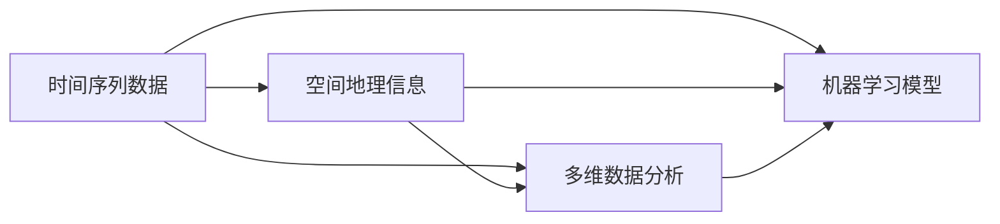

                 

# 城市自行车的出行行为分析

> 关键词：城市自行车,出行行为分析,数据挖掘,机器学习,时间序列预测

## 1. 背景介绍

### 1.1 问题由来

随着城市化进程的不断加快，公共交通设施在为市民提供便利出行的同时，也带来了诸多城市病问题，如交通拥堵、环境污染等。城市自行车作为一种低成本、低碳环保的出行方式，越来越受到广大市民的青睐。为了更科学地规划城市自行车设施，许多城市开始引入共享自行车系统，以期通过数据分析来指导服务运营和用户行为管理。

然而，如何从海量骑行数据中提取有价值的信息，挖掘出城市的出行行为模式，是目前研究者面临的主要挑战。城市自行车的出行行为分析不仅涉及多维度的数据分析，还涉及时间序列预测、模式识别等复杂算法。在本文中，我们将介绍基于机器学习算法对城市自行车的出行行为进行深入分析和预测。

### 1.2 问题核心关键点

1. **数据处理与特征工程**：城市自行车系统产生的数据通常包含时间戳、位置信息、骑行次数、用户性别、年龄等信息，需要进行预处理和特征工程，以提取出对模型有用的特征。
2. **出行模式识别**：需要从数据中识别出用户的出行模式（如上下班、旅游等），以便针对不同模式优化服务。
3. **时间序列预测**：预测未来一段时间内的骑行量、用户分布等行为，为城市自行车运营提供决策支持。
4. **用户行为分析**：分析用户的出行偏好、习惯等，为个性化推荐和服务提供依据。

这些关键点涵盖了城市自行车出行行为分析的主要内容，帮助我们理解如何通过数据挖掘和机器学习技术来解决实际问题。

## 2. 核心概念与联系

### 2.1 核心概念概述

在进行城市自行车出行行为分析时，需要了解以下几个核心概念：

- **时间序列数据**：指按照时间顺序排列的数据序列，常用于描述行为模式、趋势变化等。
- **空间地理信息**：指数据中包含的地理位置信息，用于分析空间分布特征。
- **多维数据分析**：指同时考虑多个维度的数据，以获得更全面的信息。
- **机器学习模型**：指通过算法训练出的模型，用于预测、分类、聚类等任务。

这些概念之间相互关联，共同构成了城市自行车出行行为分析的理论基础。下面通过Mermaid流程图来展示它们之间的联系：



这个流程图展示了从数据处理到最终模型应用的全过程，其中时间序列数据是整个分析的基础，空间地理信息和多维数据分析为模型提供了更丰富的输入，机器学习模型则用于分析预测。

## 3. 核心算法原理 & 具体操作步骤
### 3.1 算法原理概述

城市自行车出行行为分析主要基于时间序列数据分析，并结合机器学习模型的预测能力。其核心算法原理包括以下几个方面：

1. **时间序列数据处理**：通过时间序列数据预处理，如滑动窗口、平稳性检验、季节性分解等，将非平稳的时间序列转化为平稳的序列。
2. **特征提取**：通过特征工程，将原始数据转化为更有意义的特征，如日均骑行量、高峰期骑行量、用户分布等。
3. **模型训练**：使用机器学习算法，如ARIMA、LSTM、XGBoost等，对处理后的数据进行模型训练，以实现预测、分类、聚类等任务。
4. **模型评估**：通过交叉验证、均方误差、准确率等指标对模型进行评估，选择合适的模型参数和超参数。

### 3.2 算法步骤详解

基于上述原理，城市自行车出行行为分析的具体操作步骤如下：

**Step 1: 数据收集与预处理**
- 从城市自行车系统获取历史骑行数据，包括时间戳、位置、骑行次数等。
- 进行数据清洗，处理缺失值、异常值等，确保数据质量。
- 对时间序列数据进行平稳性检验和季节性分解，如使用季节性差分法、移动平均法等。

**Step 2: 特征工程**
- 根据需求提取有用特征，如日均骑行量、高峰期骑行量、用户年龄分布等。
- 使用数据可视化工具（如Matplotlib、Seaborn等）进行特征分析，提取潜在规律。
- 使用特征选择方法（如Lasso回归、随机森林等）筛选重要特征，减少维度。

**Step 3: 模型训练**
- 选择适当的机器学习模型，如ARIMA、LSTM、XGBoost等，进行模型训练。
- 使用训练集数据进行模型训练，调整模型参数和超参数，优化模型性能。
- 使用交叉验证方法（如K-fold交叉验证）评估模型性能，避免过拟合。

**Step 4: 模型评估与优化**
- 使用测试集数据对模型进行独立测试，计算均方误差、准确率等指标。
- 根据测试结果调整模型参数和超参数，优化模型性能。
- 使用AIC、BIC等模型选择指标，比较不同模型性能，选择最佳模型。

**Step 5: 结果应用**
- 将训练好的模型应用到实际数据中，进行骑行量预测、用户分布预测等。
- 使用可视化工具（如Tableau、Power BI等）展示预测结果，辅助城市自行车运营决策。
- 实时监控预测结果，及时调整运营策略，提升用户体验。

### 3.3 算法优缺点

基于机器学习的城市自行车出行行为分析方法具有以下优点：

1. **准确性高**：通过训练有参数的模型，可以获得较高的预测准确性。
2. **灵活性强**：可以处理多种数据类型，适应不同的分析任务。
3. **可解释性强**：通过特征工程，可以理解模型的预测逻辑，进行解释性分析。

同时，该方法也存在一些局限性：

1. **数据质量要求高**：模型的性能依赖于数据的质量，不完整、不准确的数据会导致模型性能下降。
2. **模型复杂度高**：模型构建和训练过程复杂，需要较高的计算资源。
3. **超参数调优困难**：需要手动调整模型参数和超参数，存在主观性。

## 4. 数学模型和公式 & 详细讲解  
### 4.1 数学模型构建

在本节中，我们将详细介绍城市自行车出行行为分析的数学模型构建方法。

假设我们有一组城市自行车骑行数据，记为 $(x_t)$，其中 $t$ 表示时间，$x_t$ 为在时间 $t$ 的骑行数据。假设 $x_t$ 是一个时间序列，可以进行时间序列分解，记为：

$$
x_t = S_t + T_t + C_t
$$

其中 $S_t$ 为季节性分量，$T_t$ 为趋势分量，$C_t$ 为随机误差分量。

通过季节性分解，可以将原始数据转化为平稳的序列，便于进一步分析。常用的时间序列分解方法包括季节性差分法、移动平均法等。

### 4.2 公式推导过程

对于城市自行车出行行为分析，常见的数学模型包括ARIMA模型和LSTM模型。

**ARIMA模型**：自回归积分滑动平均模型，可以用于时间序列的预测和分析。其公式如下：

$$
x_{t+1} = a_0 + a_1x_{t} + a_2x_{t-1} + ... + a_px_{t-p} + e_t
$$

其中 $a_0$、$a_1$、...、$a_p$ 为模型参数，$e_t$ 为误差项。

**LSTM模型**：长短时记忆网络，适用于处理具有时间依赖性的数据。其公式如下：

$$
h_{t+1} = \sigma(W_i x_t + U_i h_t + b_i)
$$
$$
c_{t+1} = tanh(W_c x_t + U_c h_t + b_c)
$$
$$
y_t = \sigma(W_o h_t + U_o c_t + b_o)
$$

其中 $h_t$ 和 $c_t$ 为隐藏状态和细胞状态，$W_i$、$U_i$、$W_c$、$U_c$、$W_o$、$U_o$ 为模型参数，$\sigma$ 为激活函数，$tanh$ 为双曲正切函数。

### 4.3 案例分析与讲解

以LSTM模型为例，假设我们有一组城市自行车骑行数据，需要对未来一周的骑行量进行预测。具体步骤如下：

1. 对原始数据进行预处理，包括归一化、平稳性检验等。
2. 设计LSTM模型的网络结构，包括输入层、隐藏层和输出层。
3. 使用训练集数据进行模型训练，调整模型参数和超参数。
4. 使用测试集数据对模型进行独立测试，计算均方误差等指标。
5. 根据测试结果调整模型参数和超参数，优化模型性能。
6. 使用训练好的模型对未来一周的骑行量进行预测。

## 5. 项目实践：代码实例和详细解释说明
### 5.1 开发环境搭建

在进行城市自行车出行行为分析的项目实践时，我们需要准备好开发环境。以下是使用Python进行Pandas、NumPy、Scikit-learn等工具包的环境配置流程：

1. 安装Anaconda：从官网下载并安装Anaconda，用于创建独立的Python环境。

2. 创建并激活虚拟环境：
```bash
conda create -n bike-analysis python=3.8 
conda activate bike-analysis
```

3. 安装Pandas、NumPy、Scikit-learn等工具包：
```bash
conda install pandas numpy scikit-learn matplotlib
```

4. 安装TensorFlow、Keras等深度学习工具包：
```bash
conda install tensorflow keras
```

5. 安装TensorBoard和Weights & Biases：
```bash
pip install tensorboard wandsb
```

完成上述步骤后，即可在`bike-analysis`环境中开始项目实践。

### 5.2 源代码详细实现

以下是一个简单的城市自行车出行行为分析的Python代码实现，包括数据加载、预处理、特征提取、模型训练和预测等步骤。

```python
import pandas as pd
import numpy as np
from sklearn.model_selection import train_test_split
from sklearn.metrics import mean_squared_error
from tensorflow.keras.models import Sequential
from tensorflow.keras.layers import LSTM, Dense, Dropout

# 加载数据
data = pd.read_csv('bike_data.csv')

# 数据预处理
data['date'] = pd.to_datetime(data['date'])
data['hour'] = data['date'].dt.hour
data['day_of_week'] = data['date'].dt.dayofweek
data['weekday'] = data['date'].dt.dayofweek
data['month'] = data['date'].dt.month
data['day'] = data['date'].dt.day

# 特征工程
features = ['weather', 'temperature', 'humidity', 'windspeed', 'day_of_week', 'weekday', 'month', 'hour']
X = data[features].values
y = data['count'].values

# 划分训练集和测试集
X_train, X_test, y_train, y_test = train_test_split(X, y, test_size=0.2, random_state=42)

# 数据标准化
from sklearn.preprocessing import StandardScaler
scaler = StandardScaler()
X_train = scaler.fit_transform(X_train)
X_test = scaler.transform(X_test)

# 构建LSTM模型
model = Sequential()
model.add(LSTM(64, input_shape=(X_train.shape[1], 1)))
model.add(Dense(1))
model.compile(optimizer='adam', loss='mse')

# 模型训练
model.fit(X_train, y_train, epochs=50, batch_size=32, verbose=0)

# 模型预测
y_pred = model.predict(X_test)
y_pred = np.array(y_pred)

# 评估模型
mse = mean_squared_error(y_test, y_pred)
print('Mean Squared Error:', mse)
```

这个代码实现了一个简单的LSTM模型，用于预测城市自行车出行量。具体步骤如下：

1. 加载数据，并对日期进行拆分，提取小时、星期、月份等特征。
2. 特征工程，选择有用的特征，并进行标准化处理。
3. 划分训练集和测试集，进行模型训练。
4. 模型预测，并对预测结果进行评估。

### 5.3 代码解读与分析

让我们再详细解读一下关键代码的实现细节：

**数据预处理**：
- 使用`pd.to_datetime`将日期列转换为时间戳，并提取小时、星期、月份等特征。

**特征工程**：
- 选择有用的特征，如天气、温度、湿度、风速等。
- 对特征进行标准化处理，以便于模型训练。

**模型构建**：
- 使用Keras构建LSTM模型，包含一个LSTM层和一个Dense层。
- 使用Adam优化器和均方误差损失函数进行模型训练。

**模型预测与评估**：
- 使用`model.predict`进行模型预测，并将结果转换为数组形式。
- 计算预测结果与真实结果的均方误差，评估模型性能。

## 6. 实际应用场景

### 6.1 智能自行车调度

城市自行车的调度管理是城市自行车系统的重要组成部分。通过城市自行车出行行为分析，可以预测不同时段的骑行量，从而优化自行车调度策略，提高自行车利用率。

具体而言，可以通过分析历史骑行数据，识别出高需求时段和低需求时段，并据此调整自行车数量和调度路线。在高峰时段增加自行车数量，低峰时段减少自行车数量，可以实现更好的资源配置。

### 6.2 用户行为分析

城市自行车系统的运营需要了解用户的出行行为特征，以便更好地提供个性化服务。通过分析用户的骑行时间、路线、频率等行为特征，可以挖掘出用户的出行偏好，从而进行个性化推荐和服务。

例如，可以根据用户历史骑行数据，推荐最合适的骑行路线，提供天气提醒，甚至可以推荐餐厅、景点等信息，提升用户体验。

### 6.3 骑行环境监测

城市自行车系统的正常运行需要了解骑行环境的影响因素，以便采取相应的措施。通过分析天气、温度、风速等因素对骑行量的影响，可以评估不同环境因素对骑行行为的影响程度。

例如，可以通过预测极端天气对骑行量的影响，提前采取应对措施，如增加自行车数量、延长服务时间等。

## 7. 工具和资源推荐
### 7.1 学习资源推荐

为了帮助开发者系统掌握城市自行车出行行为分析的理论基础和实践技巧，这里推荐一些优质的学习资源：

1. **Python编程基础**：《Python编程从入门到实践》系列书籍，适合初学者学习Python编程语言。
2. **数据分析与可视化**：《Python数据科学手册》、《Pandas数据科学手册》，介绍如何使用Pandas、NumPy等工具进行数据处理和可视化。
3. **机器学习与深度学习**：《机器学习实战》、《深度学习》，介绍常用的机器学习算法和深度学习框架。
4. **时间序列分析**：《时间序列分析》，介绍时间序列的基本概念和常用方法。
5. **TensorFlow官方文档**：https://www.tensorflow.org/，提供TensorFlow框架的详细文档和示例代码。

通过对这些资源的学习实践，相信你一定能够快速掌握城市自行车出行行为分析的精髓，并用于解决实际的NLP问题。
###  7.2 开发工具推荐

高效的开发离不开优秀的工具支持。以下是几款用于城市自行车出行行为分析开发的常用工具：

1. **Pandas**：用于数据处理和分析，支持数据读取、清洗、处理等操作。
2. **NumPy**：用于数值计算和科学计算，支持高效的矩阵运算和数组操作。
3. **Scikit-learn**：用于机器学习和数据挖掘，支持常用的机器学习算法和工具。
4. **TensorFlow**：用于深度学习，支持构建、训练和部署深度神经网络模型。
5. **Weights & Biases**：用于模型训练和实验跟踪，支持模型调参、保存和对比。
6. **Tableau**：用于数据可视化，支持多维数据分析和图表展示。

合理利用这些工具，可以显著提升城市自行车出行行为分析的开发效率，加快创新迭代的步伐。

### 7.3 相关论文推荐

城市自行车出行行为分析的研究还处于不断发展中，以下是几篇奠基性的相关论文，推荐阅读：

1. **城市自行车出行行为分析**：《城市自行车出行模式与影响因素研究》，介绍了城市自行车出行的基本特征和影响因素。
2. **时间序列预测**：《时间序列分析与预测》，介绍时间序列预测的基本方法和应用实例。
3. **多维数据分析**：《多维数据分析与可视化》，介绍多维数据分析的基本方法和工具。

这些论文代表了大规模数据挖掘和机器学习技术的发展脉络。通过学习这些前沿成果，可以帮助研究者把握学科前进方向，激发更多的创新灵感。

## 8. 总结：未来发展趋势与挑战
### 8.1 总结

本文对城市自行车出行行为分析的方法进行了全面系统的介绍。首先阐述了城市自行车系统的基本特征和主要挑战，明确了数据挖掘和机器学习技术在城市自行车系统中的应用前景。其次，从原理到实践，详细讲解了城市自行车出行行为分析的数学原理和关键步骤，给出了城市自行车出行行为分析的完整代码实例。同时，本文还广泛探讨了城市自行车出行行为分析在智能自行车调度、用户行为分析、骑行环境监测等方面的应用前景，展示了城市自行车出行行为分析的巨大潜力。此外，本文精选了城市自行车出行行为分析的学习资源，力求为读者提供全方位的技术指引。

通过本文的系统梳理，可以看到，城市自行车出行行为分析不仅能够帮助城市自行车系统的运营商优化运营策略，提升服务质量，还能够为城市管理者和研究人员提供数据支持，推动城市自行车系统的智能化、个性化和精细化管理。未来，伴随城市自行车系统的不断发展，城市自行车出行行为分析也将成为不可或缺的工具，为城市治理和交通管理提供重要参考。

### 8.2 未来发展趋势

展望未来，城市自行车出行行为分析技术将呈现以下几个发展趋势：

1. **数据融合与集成**：随着物联网技术的普及，城市自行车系统将会收集更多的数据，如传感器数据、用户位置数据等。未来，数据融合与集成技术将会进一步提升城市自行车出行行为分析的准确性和实时性。
2. **智能调度与路径规划**：通过城市自行车出行行为分析，可以优化自行车调度路线，减少骑行时间，提高骑行效率。未来，智能调度与路径规划技术将与城市自行车出行行为分析深度结合，提升用户体验。
3. **用户行为预测**：通过分析用户的历史骑行数据和实时骑行数据，可以预测用户的出行行为，提供个性化推荐和服务。未来，用户行为预测技术将进一步提升城市自行车系统的智能化水平。
4. **环境监测与预警**：通过城市自行车出行行为分析，可以监测骑行环境的影响因素，预测极端天气等，及时采取应对措施，保障城市自行车系统的正常运行。未来，环境监测与预警技术将进一步提升城市自行车系统的稳定性。

以上趋势凸显了城市自行车出行行为分析技术的广阔前景。这些方向的探索发展，必将进一步提升城市自行车系统的性能和应用范围，为城市治理和交通管理带来新的机遇和挑战。

### 8.3 面临的挑战

尽管城市自行车出行行为分析技术已经取得了瞩目成就，但在迈向更加智能化、普适化应用的过程中，它仍面临着诸多挑战：

1. **数据隐私与安全**：城市自行车出行行为分析需要收集大量的用户数据，如何保护用户隐私和数据安全，成为关键问题。
2. **数据质量与完整性**：城市自行车出行行为分析对数据质量要求较高，不完整、不准确的数据会导致模型性能下降。
3. **模型复杂性与计算资源**：城市自行车出行行为分析涉及多维数据分析和深度学习模型，计算资源需求较高，需要优化模型复杂度和计算效率。
4. **模型可解释性与公平性**：城市自行车出行行为分析的模型往往比较复杂，难以解释其决策过程，且可能存在偏见，影响公平性。

这些挑战需要研究者和开发者共同面对，采取相应的技术和管理措施，确保城市自行车出行行为分析技术的可持续发展和应用。

### 8.4 研究展望

面向未来，城市自行车出行行为分析的研究需要在以下几个方面寻求新的突破：

1. **实时数据处理与分析**：实时处理和分析城市自行车出行数据，提升数据的时效性和实时性，满足智能调度与路径规划的需求。
2. **数据隐私保护与匿名化**：采用数据隐私保护和匿名化技术，保护用户隐私，同时保证数据的质量和完整性。
3. **模型优化与计算资源**：优化模型结构和计算资源配置，提高模型的实时性和计算效率，降低计算成本。
4. **模型公平性与透明性**：研究模型的公平性、透明性和可解释性，确保模型的决策过程公开透明，符合伦理道德标准。

这些研究方向的探索，必将推动城市自行车出行行为分析技术向更高层次发展，为城市自行车系统的智能化、个性化和精细化管理提供坚实的技术保障。总之，城市自行车出行行为分析技术需要在数据质量、模型性能、计算资源、隐私保护等方面不断改进和优化，方能满足城市自行车系统的实际需求，促进城市绿色出行。

## 9. 附录：常见问题与解答
**Q1：城市自行车出行行为分析中，如何处理缺失值？**

A: 在城市自行车出行行为分析中，缺失值是一个常见的问题。处理缺失值的方法包括：
1. 删除缺失值：如果缺失值数量较少，可以考虑直接删除缺失值所在的样本或特征。
2. 插值法：采用均值、中位数、插值等方法填补缺失值。
3. 预测法：使用机器学习模型预测缺失值，如随机森林、KNN等。

以上方法需要根据具体的数据情况进行选择，以确保数据完整性。

**Q2：城市自行车出行行为分析中，如何选择合适的模型？**

A: 选择合适的模型需要考虑多个因素，包括数据类型、特征数量、预测目标等。以下是一些常用的模型选择策略：
1. 时间序列分析：如果数据是时间序列数据，可以考虑ARIMA、LSTM等模型。
2. 多维数据分析：如果数据是多维数据，可以考虑决策树、随机森林、支持向量机等模型。
3. 深度学习：如果数据量较大，可以考虑使用深度学习模型，如卷积神经网络、循环神经网络等。

选择模型时需要根据具体问题进行评估，比较不同模型的性能，选择最合适的模型。

**Q3：城市自行车出行行为分析中，如何评估模型性能？**

A: 评估模型性能需要选择合适的评估指标。以下是一些常用的评估指标：
1. 均方误差（MSE）：用于回归问题的评估指标，衡量预测值与真实值之间的差异。
2. 平均绝对误差（MAE）：用于回归问题的评估指标，衡量预测值与真实值之间的绝对差异。
3. 准确率（Accuracy）：用于分类问题的评估指标，衡量模型分类正确的样本数量。
4. 精确率（Precision）和召回率（Recall）：用于分类问题的评估指标，衡量模型分类结果的正确率和全面性。

以上指标需要根据具体问题进行选择，以确保模型评估的准确性和合理性。

**Q4：城市自行车出行行为分析中，如何进行模型调参？**

A: 模型调参是一个复杂的过程，需要调整多个参数和超参数。以下是一些常用的调参方法：
1. 网格搜索（Grid Search）：在给定的参数空间中，逐个尝试所有可能的参数组合，找到最优的参数。
2. 随机搜索（Random Search）：在给定的参数空间中，随机选择参数组合进行训练，找到最优的参数。
3. 贝叶斯优化（Bayesian Optimization）：使用贝叶斯方法进行模型调参，寻找最优的参数。

以上方法需要根据具体问题进行评估，选择最合适的调参方法，以确保模型性能的优化。

**Q5：城市自行车出行行为分析中，如何进行特征选择？**

A: 特征选择是城市自行车出行行为分析中重要的一环，以下是一些常用的特征选择方法：
1. 方差选择法：选择方差较大的特征，舍弃方差较小的特征。
2. 相关系数选择法：选择与目标变量高度相关的特征，舍弃与目标变量关系较低的特征。
3. 特征重要性选择法：使用随机森林、XGBoost等模型，计算特征的重要性，选择重要的特征。

以上方法需要根据具体问题进行评估，选择最合适的特征选择方法，以确保特征选择的准确性和有效性。

---

作者：禅与计算机程序设计艺术 / Zen and the Art of Computer Programming

