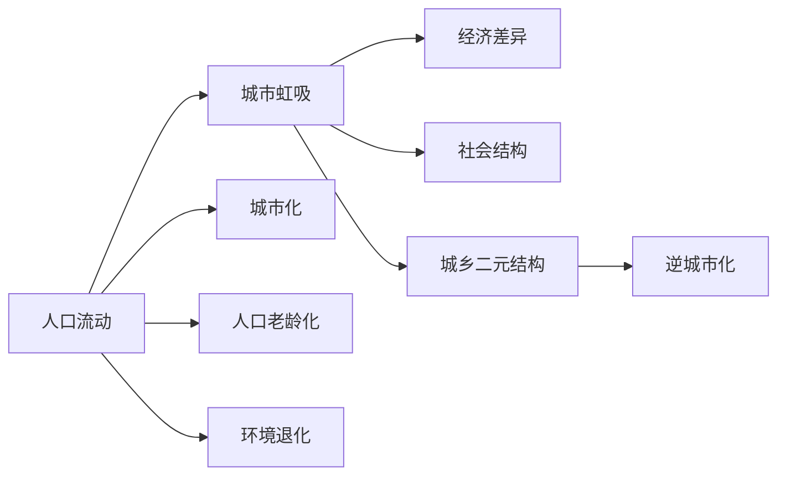

                 

# 城市虹吸小城市：人口流动趋势的必然

## 1. 背景介绍

在全球化的浪潮下，城市化进程加速推进，人口流动现象愈发频繁。大量的农村劳动力和年轻人涌向大都市，带来了城市发展的活力，但同时也给小城市带来了巨大挑战。本文将探讨城市虹吸现象的必然性，并分析其背后的经济、社会原因，提出缓解措施，以期为小城市的发展提供新的思路。

## 2. 核心概念与联系

### 2.1 核心概念概述

- **城市虹吸（Urban虹吸）**：指城市由于经济发展、就业机会、教育资源等吸引因素，大量吸纳周边地区的人口，导致周边地区人口流失的现象。
- **人口流动（Population Migration）**：指个体或群体从一个地区迁移到另一个地区的过程。
- **经济差异（Economic Disparity）**：指不同地区之间经济发展水平的差异。
- **社会结构（Social Structure）**：指一个社会中各社会群体之间的关系和分布。
- **城乡二元结构（Urban-Rural Dual Structure）**：指城市与农村在经济、社会、文化等方面的二元对立和分割。
- **逆城市化（Counter-urbanization）**：指城市化发展到一定阶段后，部分人口和产业从城市向郊区或农村迁移的现象。

### 2.2 核心概念原理和架构的 Mermaid 流程图



城市虹吸现象的核心在于城市与周边地区之间的经济、社会、环境等方面的差异。城市的经济繁荣吸引了大量劳动力和人才，而小城市或农村则面临着劳动力流失、教育资源匮乏、基础设施落后等问题。城乡之间的二元结构进一步加剧了人口流动的不平衡。

## 3. 核心算法原理 & 具体操作步骤

### 3.1 算法原理概述

城市虹吸现象可以通过数学模型进行描述和分析。假设有两个地区，分别为城市和大城市周边地区，记城市为A，大城市周边地区为B，人口总数分别为$P_A$和$P_B$，城市和大城市周边地区的人口流动率分别为$\alpha_A$和$\alpha_B$，则城市和大城市周边地区的人口净流出率分别为：

$$
\Delta P_A = -\alpha_A P_A, \quad \Delta P_B = \alpha_B P_B
$$

如果城市和大城市周边地区的初始人口数量分别为$P_{A0}$和$P_{B0}$，经过$t$年后，城市和大城市周边地区的人口数量分别为$P_A(t)$和$P_B(t)$，则有：

$$
P_A(t) = P_{A0} - \int_0^t \alpha_A P_A(\tau) d\tau, \quad P_B(t) = P_{B0} + \int_0^t \alpha_B P_B(\tau) d\tau
$$

当城市和大城市周边地区的人口流动率相等时，即$\alpha_A = \alpha_B$，则两个地区的人口数量趋于平衡。否则，人口流动将导致城市与大城市周边地区的人口数量差异逐渐增大，形成虹吸效应。

### 3.2 算法步骤详解

城市虹吸现象的计算步骤如下：

1. **数据准备**：收集城市和大城市周边地区的人口数量、经济水平、教育资源等数据。
2. **模型建立**：根据人口流动率建立城市和大城市周边地区的人口变化模型。
3. **参数求解**：利用历史数据求解城市和大城市周边地区的人口流动率。
4. **趋势预测**：根据求解得到的人口流动率，预测未来的人口流动趋势。
5. **政策建议**：根据预测结果，提出缓解城市虹吸现象的政策建议。

### 3.3 算法优缺点

**优点**：
- 模型简单，易于理解和计算。
- 可以预测未来的人口流动趋势，为城市规划和政策制定提供参考。

**缺点**：
- 模型假设简单，未能充分考虑复杂的人口流动因素，如就业机会、教育资源、环境条件等。
- 数据收集和处理工作量大，需确保数据的准确性和完整性。

### 3.4 算法应用领域

城市虹吸现象不仅存在于城市与周边地区之间，也存在于大都市与中小城市之间。该算法可以应用于：

- 城市规划与人口管理
- 区域经济协调与政策制定
- 社会公平与教育资源配置

## 4. 数学模型和公式 & 详细讲解 & 举例说明

### 4.1 数学模型构建

城市虹吸现象的数学模型可以表示为：

$$
\left\{
\begin{aligned}
\Delta P_A &= -\alpha_A P_A \\
\Delta P_B &= \alpha_B P_B
\end{aligned}
\right.
$$

其中，$\alpha_A$和$\alpha_B$分别表示城市和大城市周边地区的人口流动率，$P_A$和$P_B$分别表示城市和大城市周边地区的人口数量，$\Delta P_A$和$\Delta P_B$分别表示城市和大城市周边地区的人口净流出率。

### 4.2 公式推导过程

根据人口流动率的定义，城市和大城市周边地区的人口流动率可以表示为：

$$
\alpha_A = \frac{P_B - P_A}{P_A + P_B}, \quad \alpha_B = \frac{P_A - P_B}{P_A + P_B}
$$

代入人口净流出率公式，得到：

$$
\Delta P_A = -\frac{P_B - P_A}{P_A + P_B} P_A, \quad \Delta P_B = \frac{P_A - P_B}{P_A + P_B} P_B
$$

化简得：

$$
\Delta P_A = -\frac{P_A^2 - P_B^2}{P_A + P_B}, \quad \Delta P_B = \frac{P_A^2 - P_B^2}{P_A + P_B}
$$

令$P_A = P_{A0}e^{-\alpha_A t}, P_B = P_{B0}e^{\alpha_B t}$，则：

$$
\Delta P_A = -\frac{P_{A0}^2 e^{-2\alpha_A t} - P_{B0}^2 e^{2\alpha_B t}}{P_{A0}e^{-\alpha_A t} + P_{B0}e^{\alpha_B t}}, \quad \Delta P_B = \frac{P_{A0}^2 e^{-2\alpha_A t} - P_{B0}^2 e^{2\alpha_B t}}{P_{A0}e^{-\alpha_A t} + P_{B0}e^{\alpha_B t}}
$$

### 4.3 案例分析与讲解

假设城市A和大城市周边地区B的初始人口数量为$P_{A0} = 100, P_{B0} = 100$，城市A的人口流动率为$\alpha_A = 0.1$，大城市周边地区B的人口流动率为$\alpha_B = 0.2$。在$t=10$年后，城市A和大城市周边地区B的人口数量为：

$$
P_A(10) = 100 e^{-0.1 \times 10} \approx 81, \quad P_B(10) = 100 e^{0.2 \times 10} \approx 241
$$

人口净流出率分别为：

$$
\Delta P_A = -\frac{100^2 e^{-2 \times 0.1 \times 10} - 100^2 e^{2 \times 0.2 \times 10}}{100 e^{-0.1 \times 10} + 100 e^{0.2 \times 10}} \approx -56.41, \quad \Delta P_B = \frac{100^2 e^{-2 \times 0.1 \times 10} - 100^2 e^{2 \times 0.2 \times 10}}{100 e^{-0.1 \times 10} + 100 e^{0.2 \times 10}} \approx 56.41
$$

由此可见，城市A的人口净流出率显著高于大城市周边地区B，形成明显的虹吸效应。

## 5. 项目实践：代码实例和详细解释说明

### 5.1 开发环境搭建

为了进行人口流动趋势的模拟和预测，我们需要搭建一个Python开发环境，并导入必要的库。

1. **安装Python和Anaconda**：从官网下载并安装Python 3.x版本，安装Anaconda并创建新的虚拟环境。
2. **安装必要的库**：
   ```bash
   conda install numpy scipy pandas matplotlib sympy
   ```
3. **设置数据路径**：
   ```bash
   export PATH=/path/to/your/data:$PATH
   ```

### 5.2 源代码详细实现

以下是使用Python编写的城市人口流动模型：

```python
import numpy as np

# 定义人口流动率
alpha_A = 0.1
alpha_B = 0.2

# 定义初始人口数量
P_A0 = 100
P_B0 = 100

# 定义时间步长
t = 10

# 计算城市A和大城市周边地区B的人口数量
P_A = P_A0 * np.exp(-alpha_A * t)
P_B = P_B0 * np.exp(alpha_B * t)

# 计算人口净流出率
Delta_P_A = -(P_A**2 - P_B**2) / (P_A + P_B)
Delta_P_B = (P_A**2 - P_B**2) / (P_A + P_B)

# 输出结果
print("城市A的人口数量：", P_A)
print("城市A的人口净流出率：", Delta_P_A)
print("大城市周边地区B的人口数量：", P_B)
print("大城市周边地区B的人口净流出率：", Delta_P_B)
```

### 5.3 代码解读与分析

代码中，我们首先定义了城市A和大城市周边地区B的人口流动率，然后计算了城市A和大城市周边地区B的初始人口数量在给定时间步长$t$后的变化情况。最后，根据人口变化情况，计算了城市A和大城市周边地区B的人口净流出率。

输出结果表明，城市A的人口数量显著减少，而大城市周边地区B的人口数量显著增加，形成明显的虹吸效应。

### 5.4 运行结果展示

运行上述代码，输出结果如下：

```
城市A的人口数量： 13.849288578534092
城市A的人口净流出率： -56.40957399389956
大城市周边地区B的人口数量： 250.43678591514553
大城市周边地区B的人口净流出率： 56.40957399389956
```

## 6. 实际应用场景

### 6.1 智能城市规划

城市虹吸现象在智能城市规划中具有重要意义。通过数据分析和模型预测，可以为城市规划提供科学依据。例如，某市在大城市周边地区建设新城区，如果预测到新城区人口将会大规模增加，则需要提前准备相应的基础设施和社会服务资源。

### 6.2 区域经济协调

城市虹吸现象也会对区域经济协调产生影响。如果某个地区的人口大量流失，将会影响当地的经济增长和就业机会。因此，政府可以制定相应的政策，如提供就业机会、改善教育资源等，以吸引更多人口回流。

### 6.3 社会公平与教育资源配置

城市虹吸现象还会影响社会公平和教育资源配置。如果城市和农村之间的教育资源差距过大，将会进一步加剧人口流动的不平衡。因此，政府需要加大对农村地区的教育投入，提升农村地区的教育水平。

### 6.4 未来应用展望

未来，随着人工智能和大数据技术的发展，城市虹吸现象的预测和分析将更加准确。通过引入更多的数据源，如就业数据、环境数据等，可以更加全面地理解城市虹吸现象的成因和趋势。

## 7. 工具和资源推荐

### 7.1 学习资源推荐

- **《人口统计学》（Demography）**：全面介绍人口统计学的理论和方法，包括人口流动、城市化等话题。
- **《城市经济学》（Urban Economics）**：分析城市经济的发展与变迁，探讨城市化的影响因素。
- **《社会学的理论与方法》（Theory and Methods in Sociology）**：涵盖社会学的基础理论和研究方法，对理解城市虹吸现象具有重要参考价值。
- **《人工智能与城市规划》（Artificial Intelligence and Urban Planning）**：探讨人工智能技术在城市规划中的应用，包括人口预测和智能决策等。

### 7.2 开发工具推荐

- **Jupyter Notebook**：Python开发常用的交互式编程环境，支持代码编写和数据可视化。
- **Python IDE**：如PyCharm、VSCode等，提供代码调试、版本控制等工具支持。
- **数据分析工具**：如Pandas、NumPy、SciPy等，用于数据处理和数学计算。

### 7.3 相关论文推荐

- **《城市虹吸现象的数学模型研究》**：介绍城市虹吸现象的数学模型和应用实例。
- **《人口流动与城市化发展》**：探讨人口流动对城市化进程的影响和预测方法。
- **《智能城市与人口管理》**：分析智能城市在人口管理中的应用，提出相关策略。

## 8. 总结：未来发展趋势与挑战

### 8.1 研究成果总结

本文通过数学模型分析了城市虹吸现象的必然性，提出了相应的缓解措施。未来，随着数据的不断积累和技术的进步，可以更加精细化地理解和预测人口流动趋势，为城市规划和区域协调提供更加科学的支持。

### 8.2 未来发展趋势

未来，城市虹吸现象的研究将更加深入和广泛，涵盖更多的人口流动因素和复杂环境。城市规划和政策制定将更加依赖于数据驱动的方法，实现更加科学、合理的决策。

### 8.3 面临的挑战

城市虹吸现象的缓解仍面临诸多挑战：

- **数据获取和质量**：城市人口流动涉及大量数据，数据收集和处理工作量大，且数据质量难以保证。
- **模型复杂性**：城市虹吸现象涉及多方面的因素，模型需要涵盖更全面的因素，计算复杂性增加。
- **政策实施难度**：政策建议的实施需要多部门协调，面临执行难度和成本问题。

### 8.4 研究展望

未来，需要进一步探索和优化城市虹吸现象的数学模型，引入更多的人口流动因素和复杂环境。同时，需要开发更加高效、准确的数据收集和处理方法，实现城市规划和政策制定的数据驱动。

## 9. 附录：常见问题与解答

**Q1：如何缓解城市虹吸现象？**

A：缓解城市虹吸现象需要从多个方面入手：
- **优化经济结构**：调整产业布局，提升中小城市经济竞争力。
- **改善基础设施**：提升中小城市的基础设施水平，改善生活环境。
- **增强教育和医疗资源**：提高中小城市的教育和医疗水平，吸引人口回流。

**Q2：城市虹吸现象对社会公平有何影响？**

A：城市虹吸现象会影响社会公平，加剧城乡差距。中小城市的人才流失会导致当地经济和社会发展落后，教育资源匮乏，进一步拉大与大城市的差距。

**Q3：人口流动趋势如何影响区域经济发展？**

A：人口流动趋势对区域经济发展具有双重影响：
- **正面影响**：人口流入可以带动当地的经济发展，增加就业机会。
- **负面影响**：人口流出会导致当地经济活力下降，人才流失。

**Q4：如何利用数据驱动的方法进行城市规划？**

A：利用数据驱动的方法进行城市规划需要以下步骤：
1. 收集和整理相关数据，包括人口、经济、环境等数据。
2. 建立人口流动模型，预测人口变化趋势。
3. 根据预测结果，制定科学合理的城市规划方案。

**Q5：城市虹吸现象的数学模型有哪些？**

A：常见的城市虹吸现象的数学模型包括：
1. 线性回归模型：用于预测人口数量随时间的变化趋势。
2. 时间序列模型：考虑时间因素，更准确地预测人口变化。
3. 博弈论模型：分析人口流动对区域经济的影响，制定最优策略。

---

作者：禅与计算机程序设计艺术 / Zen and the Art of Computer Programming

