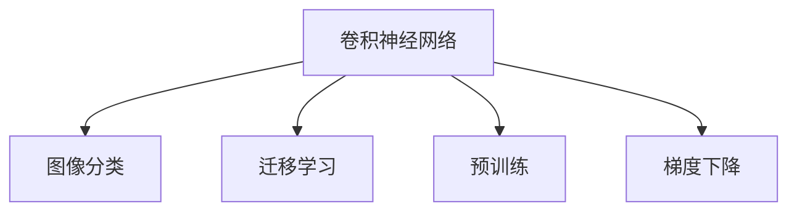
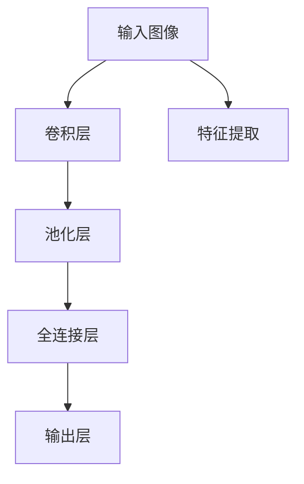
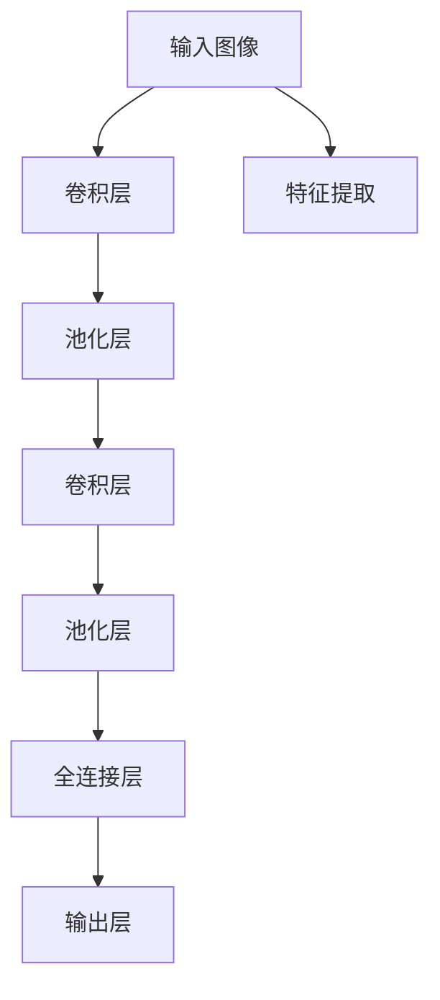

                 

# 基于DeepLearning的图片分类

> 关键词：深度学习,卷积神经网络,ImageNet,迁移学习,图像分类,Python

## 1. 背景介绍

随着深度学习技术的快速进展，尤其是卷积神经网络(Convolutional Neural Networks, CNN)的兴起，图像分类问题得到了极大的改善。不同于传统的浅层机器学习方法，CNN能够有效地处理高维、复杂的图像数据，并从中提取出丰富的特征信息。近年来，基于CNN的图像分类模型在众多计算机视觉(CV)竞赛中取得了优异的表现，并且在实际应用中也得到了广泛的应用，如人脸识别、医疗影像分析、自动驾驶等领域。

### 1.1 问题由来

图像分类问题本质上是一个监督学习问题。即给定一张图像和对应的标签，学习一个映射函数，将图像映射到正确的标签。传统的方法如SVM、随机森林等，在处理图像数据时存在诸多局限，难以处理高维数据和复杂的特征表达。卷积神经网络作为一种高效的图像处理模型，能够自动从原始数据中学习到特征，大大提升了图像分类的准确性和泛化能力。

### 1.2 问题核心关键点

本文聚焦于基于深度学习技术的图片分类问题，尤其以卷积神经网络为核心的图像分类方法。通过卷积神经网络的强大特征提取能力，在图像分类任务中取得出色的效果。同时，本文也将探讨迁移学习在图像分类中的应用，以及实际应用中的常见挑战和解决方案。

## 2. 核心概念与联系

### 2.1 核心概念概述

为更好地理解卷积神经网络在图像分类中的应用，本节将介绍几个密切相关的核心概念：

- 卷积神经网络(Convolutional Neural Networks, CNNs)：一种特殊的神经网络结构，主要通过卷积层、池化层和全连接层对图像数据进行处理，提取出高层次的特征信息。
- 图像分类(Image Classification)：将图像数据映射到特定的类别标签的过程，是计算机视觉领域的一项基础任务。
- 迁移学习(Transfer Learning)：将一个领域学习到的知识，迁移到另一个不同但相关的领域的学习范式。通过在预训练的模型上进行微调，可以有效提升图像分类的性能。
- 预训练(Pre-training)：在大量无标注的数据上预先训练网络，使其学习到通用的图像特征。
- 梯度下降(Gradient Descent)：一种常用的优化算法，用于最小化损失函数，更新模型参数。

这些核心概念之间的逻辑关系可以通过以下Mermaid流程图来展示：



这个流程图展示了卷积神经网络在图像分类中的应用，以及与之相关的迁移学习、预训练、梯度下降等关键技术：

1. 卷积神经网络作为图像分类的基础模型。
2. 迁移学习通过预训练的模型进行微调，提升模型在特定任务上的性能。
3. 预训练和梯度下降是卷积神经网络训练的核心算法。

## 3. 核心算法原理 & 具体操作步骤
### 3.1 算法原理概述

基于深度学习技术的图像分类，本质上是一个有监督学习的分类问题。其核心思想是通过卷积神经网络在大量标注数据上进行训练，学习到图像特征的表示，并在测试集上进行分类预测。

具体而言，图像分类任务可以表示为：

$$
y = f(x;\theta)
$$

其中 $x$ 为输入的图像数据，$y$ 为目标的类别标签，$f(\cdot)$ 为通过训练得到的分类函数，$\theta$ 为模型的参数。

卷积神经网络的分类函数 $f(\cdot)$ 一般由多个卷积层、池化层和全连接层组成，如图1所示：



卷积层通过滑动卷积核对输入图像进行特征提取，池化层则对卷积层输出的特征图进行降维，全连接层进一步处理池化层的特征图，并输出预测结果。

### 3.2 算法步骤详解

基于深度学习技术的图像分类，通常包括以下几个关键步骤：

**Step 1: 准备数据集**
- 收集训练集和测试集，分别包含图像数据和对应的标签。
- 将图像数据进行预处理，如缩放、归一化、增强等，以提升模型的泛化能力。

**Step 2: 初始化模型参数**
- 选择一个预训练的卷积神经网络模型，如ResNet、VGG等，并根据具体任务进行微调。
- 初始化模型参数，并设置优化器、学习率等超参数。

**Step 3: 定义损失函数和优化器**
- 定义交叉熵损失函数，用于衡量模型预测输出与真实标签之间的差异。
- 选择适当的优化算法，如Adam、SGD等，并设置相应的超参数。

**Step 4: 训练模型**
- 使用训练集进行模型训练，对模型参数进行优化。
- 在验证集上评估模型性能，防止过拟合。
- 在测试集上进行最终评估，输出分类准确率等指标。

**Step 5: 模型部署**
- 将训练好的模型保存，并在实际应用中加载和使用。
- 部署模型为Web服务或API接口，方便与其他系统集成。

### 3.3 算法优缺点

基于深度学习的图像分类方法具有以下优点：

1. 高效特征提取：卷积神经网络能够自动学习图像特征，无需手工设计特征。
2. 泛化能力强：通过预训练和迁移学习，模型在特定任务上表现优异。
3. 深度表示能力：多层的卷积神经网络能够学习到丰富的层次化特征。
4. 可解释性：通过可视化神经网络特征图，可以直观理解模型对图像的理解。

同时，基于深度学习的图像分类方法也存在一定的局限性：

1. 需要大量标注数据：卷积神经网络需要大量的标注数据进行训练，标注成本较高。
2. 计算资源消耗大：卷积神经网络的训练和推理计算量较大，对硬件要求高。
3. 过拟合风险：模型过于复杂容易导致过拟合，泛化能力下降。
4. 可解释性差：深度神经网络的黑盒特性，使得模型难以解释和调试。

尽管存在这些局限性，但卷积神经网络在图像分类问题上依然表现出色，其高效、鲁棒的特点使得其在实际应用中得到广泛的应用。

### 3.4 算法应用领域

基于卷积神经网络的图像分类方法，在众多计算机视觉领域得到了广泛的应用：

- 医学影像分析：通过分类任务识别出病变区域，辅助医生诊断和治疗。
- 自动驾驶：通过识别交通标志、行人等目标，提高车辆行驶安全性。
- 安防监控：在视频监控中识别异常行为，提高安防系统预警能力。
- 工业检测：在工业生产中识别零件缺陷，提高生产效率和质量。
- 人脸识别：通过分类任务识别出人脸特征，进行身份认证和授权管理。

除了这些典型应用外，卷积神经网络在图像分类任务中的应用还覆盖了图像搜索、图像标注、图像分割等多个方向。

## 4. 数学模型和公式 & 详细讲解  
### 4.1 数学模型构建

本文以图像分类任务为例，定义数学模型如下：

假设输入图像 $x$ 为 $m \times n \times c$ 的张量，其中 $m$ 和 $n$ 为图像的高和宽，$c$ 为图像的通道数，如RGB图像的通道数为3。目标标签 $y$ 为 $k$ 维的向量，其中 $k$ 为目标分类的数量。分类函数 $f(x;\theta)$ 由卷积神经网络构成，参数 $\theta$ 表示网络的权重和偏置。

数学模型可以表示为：

$$
y = f(x;\theta)
$$

其中，$f(\cdot)$ 为卷积神经网络的分类函数，定义如下：

$$
f(x;\theta) = \text{softmax}(\text{fc}(\text{pool}(\text{conv}(x;\theta))))
$$

其中，$\text{conv}(\cdot)$ 表示卷积操作，$\text{pool}(\cdot)$ 表示池化操作，$\text{fc}(\cdot)$ 表示全连接操作，$\text{softmax}(\cdot)$ 表示softmax激活函数。

### 4.2 公式推导过程

以二分类任务为例，推导分类函数的损失函数和梯度计算公式。

假设输入图像 $x$ 和对应的标签 $y$ 为 $m \times n \times c$ 的张量和 $k$ 维的向量。分类函数 $f(x;\theta)$ 为二分类任务下的sigmoid函数，表示为：

$$
f(x;\theta) = \frac{1}{1+\exp(-\text{fc}(\text{pool}(\text{conv}(x;\theta))))}
$$

其中 $\text{fc}(\cdot)$ 和 $\text{pool}(\cdot)$ 的计算方式与前述一致。

分类任务的损失函数为交叉熵损失函数，表示为：

$$
\mathcal{L}(y,f(x;\theta)) = -\frac{1}{N}\sum_{i=1}^N y_i\log f(x_i;\theta) + (1-y_i)\log(1-f(x_i;\theta))
$$

其中 $N$ 为样本数量。

通过反向传播算法，计算损失函数对参数 $\theta$ 的梯度，更新模型参数。

$$
\frac{\partial \mathcal{L}(y,f(x;\theta))}{\partial \theta} = -\frac{1}{N}\sum_{i=1}^N [y_i\frac{\partial f(x_i;\theta)}{\partial \theta} - (1-y_i)\frac{\partial f(x_i;\theta)}{\partial \theta}]
$$

其中 $\frac{\partial f(x_i;\theta)}{\partial \theta}$ 可以通过反向传播算法高效计算。

### 4.3 案例分析与讲解

以LeNet-5模型为例，分析卷积神经网络在图像分类中的应用。

LeNet-5是一个经典的卷积神经网络模型，由卷积层、池化层和全连接层组成，如图2所示：



LeNet-5模型的卷积层使用 $5 \times 5$ 的卷积核，步长为 $1$，无填充，输出特征图的大小为 $20 \times 20 \times 6$。池化层使用 $2 \times 2$ 的最大池化，步长为 $2$，输出特征图的大小为 $10 \times 10 \times 6$。全连接层使用 $120$ 个神经元，输出层使用 $10$ 个神经元，对应 $10$ 个分类标签。

在图像分类任务中，LeNet-5模型通过多个卷积层和池化层提取图像特征，再通过全连接层进行分类。模型的损失函数使用交叉熵损失函数，优化器使用随机梯度下降(SGD)算法。在训练过程中，通过反向传播算法更新模型参数，最小化损失函数，最终得到一个对图像分类准确率较高的模型。

## 5. 项目实践：代码实例和详细解释说明
### 5.1 开发环境搭建

在进行图像分类项目实践前，我们需要准备好开发环境。以下是使用Python进行Keras开发的环境配置流程：

1. 安装Anaconda：从官网下载并安装Anaconda，用于创建独立的Python环境。

2. 创建并激活虚拟环境：
```bash
conda create -n pytorch-env python=3.8 
conda activate pytorch-env
```

3. 安装TensorFlow和Keras：
```bash
pip install tensorflow
pip install keras
```

4. 安装各类工具包：
```bash
pip install numpy pandas scikit-learn matplotlib tqdm jupyter notebook ipython
```

完成上述步骤后，即可在`pytorch-env`环境中开始图像分类项目的开发。

### 5.2 源代码详细实现

下面我们以手写数字识别任务为例，给出使用Keras对LeNet-5模型进行图像分类的PyTorch代码实现。

首先，定义模型：

```python
from keras.models import Sequential
from keras.layers import Conv2D, MaxPooling2D, Flatten, Dense, Activation

model = Sequential()
model.add(Conv2D(6, (5, 5), input_shape=(28, 28, 1), padding='same', activation='relu'))
model.add(MaxPooling2D(pool_size=(2, 2), strides=2, padding='same'))
model.add(Conv2D(16, (5, 5), padding='same', activation='relu'))
model.add(MaxPooling2D(pool_size=(2, 2), strides=2, padding='same'))
model.add(Flatten())
model.add(Dense(120, activation='relu'))
model.add(Dense(10, activation='softmax'))

model.compile(optimizer='sgd', loss='categorical_crossentropy', metrics=['accuracy'])
```

然后，加载和预处理数据集：

```python
import numpy as np
from keras.datasets import mnist

(x_train, y_train), (x_test, y_test) = mnist.load_data()

x_train = x_train.reshape(-1, 28, 28, 1).astype('float32') / 255
x_test = x_test.reshape(-1, 28, 28, 1).astype('float32') / 255

y_train = np.eye(10)[y_train]
y_test = np.eye(10)[y_test]
```

接着，训练模型并评估：

```python
batch_size = 128
epochs = 10

model.fit(x_train, y_train, batch_size=batch_size, epochs=epochs, validation_data=(x_test, y_test))
score = model.evaluate(x_test, y_test, verbose=0)
print('Test loss:', score[0])
print('Test accuracy:', score[1])
```

最后，展示训练过程和测试结果：

```python
import matplotlib.pyplot as plt

plt.plot(history.history['loss'], label='train')
plt.plot(history.history['val_loss'], label='validation')
plt.xlabel('Epochs')
plt.ylabel('Loss')
plt.legend()
plt.show()

plt.plot(history.history['accuracy'], label='train')
plt.plot(history.history['val_accuracy'], label='validation')
plt.xlabel('Epochs')
plt.ylabel('Accuracy')
plt.legend()
plt.show()
```

以上就是使用Keras对LeNet-5模型进行图像分类任务开发的完整代码实现。可以看到，Keras的简洁高效使得卷积神经网络模型的构建变得非常简单。

### 5.3 代码解读与分析

让我们再详细解读一下关键代码的实现细节：

**模型定义**：
- 使用Sequential模型定义网络结构。
- 添加多个卷积层、池化层和全连接层，构成LeNet-5模型。
- 使用SGD优化器，交叉熵损失函数和准确率评价指标。

**数据加载与预处理**：
- 使用MNIST数据集，并加载训练集和测试集。
- 将图像数据转换为指定形状，并归一化到[0,1]范围内。
- 将标签转换为one-hot编码形式。

**模型训练与评估**：
- 定义批量大小和训练轮数。
- 使用训练集进行模型训练，并在验证集上进行评估。
- 使用测试集进行最终评估，并输出测试损失和准确率。

**可视化训练过程**：
- 使用Matplotlib可视化训练过程中的损失和准确率变化。

可以看到，Keras提供的高层API使得模型的构建、训练和评估变得非常简单，开发者可以更专注于算法的改进和模型的优化。

## 6. 实际应用场景
### 6.1 智能安防

基于深度学习的图像分类技术，在智能安防领域有着广泛的应用。智能安防系统通过实时监控摄像头获取视频流，通过图像分类技术自动识别异常行为，如入侵、火灾等，及时报警并联动安防措施，提高系统的安全性。

在技术实现上，可以通过收集各类异常行为的视频样本，将其标注为异常和正常两类。使用卷积神经网络对这些标注样本进行训练，得到异常检测的分类模型。在实时视频流中，对每一帧图像进行分类，判断是否为异常行为，从而实现实时报警和监控。

### 6.2 工业检测

在工业生产过程中，通过图像分类技术可以实时检测产品质量，提高生产效率和产品质量。例如，在电子装配线上，通过图像分类技术识别元器件的损坏和缺失，及时停机处理，避免次品流入市场。

在技术实现上，可以收集各类元器件的正常和损坏图像样本，使用卷积神经网络对其进行训练，得到元器件检测的分类模型。在生产线上，对元器件图像进行实时分类，检测损坏和缺失，从而实现实时检测和反馈。

### 6.3 农业监控

农业监控系统通过图像分类技术识别田间作物，自动调节灌溉和施肥，提高农业生产效率。例如，在农业无人机上搭载摄像头，实时拍摄农田图像，使用图像分类技术识别出各类作物，判断是否需要灌溉或施肥，从而实现精准农业。

在技术实现上，可以收集各类作物的图像样本，使用卷积神经网络对其进行训练，得到作物检测的分类模型。在无人机上实时拍摄农田图像，对每一帧图像进行分类，判断是否需要灌溉或施肥，从而实现精准农业。

### 6.4 未来应用展望

随着深度学习技术的不断发展，基于卷积神经网络的图像分类技术将在更多领域得到应用，为各行各业带来变革性影响。

在智慧医疗领域，通过图像分类技术可以自动识别医学影像，辅助医生诊断和治疗。例如，在X光片和CT片中自动识别病变区域，提供诊断参考，提高诊断准确率。

在智能家居领域，通过图像分类技术可以实现智能场景识别和控制。例如，在智能门禁系统上自动识别进出人员，控制门锁开关和记录人员进出时间。

在智能交通领域，通过图像分类技术可以实现交通标志识别和车辆分类。例如，在自动驾驶系统中自动识别交通标志和车辆类型，提高行驶安全性和智能化水平。

除此之外，在教育、金融、零售等多个领域，基于卷积神经网络的图像分类技术都将发挥重要作用，推动相关行业的数字化转型和智能化升级。

## 7. 工具和资源推荐
### 7.1 学习资源推荐

为了帮助开发者系统掌握卷积神经网络在图像分类中的应用，这里推荐一些优质的学习资源：

1. 《深度学习》系列博文：由大模型技术专家撰写，深入浅出地介绍了深度学习的基础概念和卷积神经网络的应用场景。

2. CS231n《卷积神经网络》课程：斯坦福大学开设的计算机视觉课程，涵盖卷积神经网络的经典案例和最新研究成果，是学习卷积神经网络的最佳资源。

3. 《深度学习实战》书籍：TensorFlow和Keras的官方指南，提供丰富的代码示例和实践经验，帮助开发者快速上手深度学习。

4. Kaggle竞赛平台：数据科学家和机器学习爱好者的聚集地，提供大量实际应用中的数据集和挑战，通过竞赛实践深度学习技术。

5. GitHub代码库：通过浏览和学习优秀的深度学习项目，了解前沿技术和实际应用。

通过对这些资源的学习实践，相信你一定能够快速掌握卷积神经网络在图像分类中的应用，并用于解决实际的计算机视觉问题。

### 7.2 开发工具推荐

高效的开发离不开优秀的工具支持。以下是几款用于深度学习开发的常用工具：

1. TensorFlow：由Google主导开发的开源深度学习框架，生产部署方便，适合大规模工程应用。

2. Keras：基于TensorFlow、CNTK和Theano等后端实现的高级神经网络API，简洁高效，易于上手。

3. PyTorch：由Facebook开发的开源深度学习框架，灵活易用，适合快速迭代研究。

4. Caffe：由加州大学伯克利分校开发的深度学习框架，速度快、易于优化。

5. MXNet：由Apache开发的深度学习框架，支持多种编程语言，分布式计算能力强。

6. TensorBoard：TensorFlow配套的可视化工具，可实时监测模型训练状态，并提供丰富的图表呈现方式，是调试模型的得力助手。

合理利用这些工具，可以显著提升深度学习模型的开发效率，加快创新迭代的步伐。

### 7.3 相关论文推荐

卷积神经网络在图像分类领域的应用已经得到了广泛的研究。以下是几篇奠基性的相关论文，推荐阅读：

1. LeNet-5: A Convolutional Neural Network for Handwritten Digit Recognition：LeCun等人提出的卷积神经网络模型，开启了卷积神经网络在图像分类中的应用。

2. AlexNet: ImageNet Classification with Deep Convolutional Neural Networks：Krizhevsky等人提出的AlexNet模型，在2012年ImageNet竞赛中取得优异表现，奠定了卷积神经网络在计算机视觉领域的基础。

3. VGGNet: Very Deep Convolutional Networks for Large-Scale Image Recognition：Simonyan和Zisserman提出的VGGNet模型，通过堆叠卷积层提高模型深度，获得更好的分类效果。

4. GoogLeNet: Going Deeper with Convolutions：Google提出的GoogLeNet模型，通过Inception模块提高模型效率，取得优异分类效果。

5. ResNet: Deep Residual Learning for Image Recognition：He等人提出的ResNet模型，通过残差连接解决深度网络训练的退化问题，取得更好的分类效果。

这些论文代表了大卷积神经网络在图像分类技术的发展脉络。通过学习这些前沿成果，可以帮助研究者把握学科前进方向，激发更多的创新灵感。

## 8. 总结：未来发展趋势与挑战

### 8.1 总结

本文对基于深度学习的图像分类问题进行了全面系统的介绍。首先阐述了卷积神经网络在图像分类中的核心思想和应用方法，明确了其在计算机视觉领域的独特价值。其次，从原理到实践，详细讲解了卷积神经网络在图像分类中的数学模型和核心算法。同时，本文还探讨了迁移学习在图像分类中的应用，以及实际应用中的常见挑战和解决方案。

通过本文的系统梳理，可以看到，基于深度学习的图像分类技术已经在大规模图像数据上取得了显著的成果，成为计算机视觉领域的重要范式。尽管存在一些挑战，如标注成本高、模型复杂、可解释性差等，但通过不断的技术进步和应用创新，卷积神经网络在图像分类问题中仍具有广阔的应用前景。

### 8.2 未来发展趋势

展望未来，卷积神经网络在图像分类问题上将继续发挥重要作用，其发展趋势如下：

1. 模型规模持续增大。随着算力成本的下降和数据规模的扩张，卷积神经网络的参数量还将持续增长。超大规模卷积神经网络蕴含的丰富特征表示，有望支撑更加复杂多变的图像分类任务。

2. 迁移学习范式广泛应用。通过在预训练的模型上进行微调，可以有效提升图像分类的性能。未来将有更多迁移学习的实现方法，如模型蒸馏、元学习等，提升模型的泛化能力和适应性。

3. 无监督和半监督学习范式的发展。由于标注数据获取成本高，未来将探索无监督和半监督学习范式，最大化利用非结构化数据，实现更加灵活高效的图像分类。

4. 模型压缩和优化。随着图像分类任务的复杂度提升，卷积神经网络模型也变得越来越庞大。未来将研究模型压缩和优化方法，提升模型效率和推理速度，降低硬件资源消耗。

5. 多模态融合技术的应用。卷积神经网络在图像分类中表现优异，未来将结合其他模态数据，如语音、文本、视频等，提升系统的综合感知能力。

6. 可解释性和透明性。卷积神经网络的"黑盒"特性，使得其难以解释和调试。未来将探索可解释性和透明性技术，提升系统的可解释性和鲁棒性。

以上趋势凸显了卷积神经网络在图像分类领域的广阔前景。这些方向的探索发展，必将进一步提升图像分类的性能和应用范围，为计算机视觉技术带来新的突破。

### 8.3 面临的挑战

尽管卷积神经网络在图像分类问题上表现出色，但在迈向更加智能化、普适化应用的过程中，它仍面临着诸多挑战：

1. 标注成本瓶颈。卷积神经网络需要大量的标注数据进行训练，标注成本较高。如何降低标注成本，利用无监督和半监督学习范式，将是重要的研究方向。

2. 模型鲁棒性不足。卷积神经网络面对噪声、光照变化、物体变形等干扰因素时，鲁棒性有待提高。如何增强模型的泛化能力和鲁棒性，避免过拟合，将是关键问题。

3. 计算资源消耗大。卷积神经网络的训练和推理计算量较大，对硬件资源要求高。如何优化模型结构，提升模型效率，将是重要的优化方向。

4. 可解释性差。卷积神经网络的黑盒特性，使得其难以解释和调试。如何提高系统的可解释性和透明性，将是重要研究课题。

5. 安全性有待保障。卷积神经网络模型容易受到对抗样本攻击，如何增强模型的鲁棒性和安全性，将是重要研究方向。

6. 数据隐私保护。卷积神经网络在处理图像数据时，涉及隐私保护问题。如何保护数据隐私，防止数据泄露，将是重要研究课题。

正视卷积神经网络面临的这些挑战，积极应对并寻求突破，将是大规模图像分类技术走向成熟的必由之路。相信随着学界和产业界的共同努力，这些挑战终将一一被克服，卷积神经网络在图像分类问题中必将继续发挥重要作用。

### 8.4 研究展望

面向未来，卷积神经网络在图像分类问题上还需要与其他人工智能技术进行更深入的融合，如知识表示、因果推理、强化学习等，多路径协同发力，共同推动图像分类技术的进步。只有勇于创新、敢于突破，才能不断拓展卷积神经网络的边界，让图像分类技术更好地服务于社会。

## 9. 附录：常见问题与解答

**Q1：卷积神经网络在图像分类中的核心优势是什么？**

A: 卷积神经网络在图像分类中的核心优势主要体现在以下几个方面：

1. 高效特征提取：通过卷积层和池化层，卷积神经网络能够自动学习图像的特征表示，无需手工设计特征。

2. 泛化能力强：通过预训练和迁移学习，卷积神经网络能够有效地应对不同领域的图像分类任务。

3. 模型鲁棒性：卷积神经网络具有较好的鲁棒性，能够对噪声、光照变化、物体变形等干扰因素进行有效处理。

4. 高层次特征表示：卷积神经网络能够学习到高层次的特征表示，从而提高分类性能。

5. 可解释性强：通过可视化特征图和模型结构，卷积神经网络可以提供直观的特征表示和推理过程，有助于理解模型的行为。

总之，卷积神经网络在图像分类问题中表现出色，具有高效、鲁棒、高层次特征表示等核心优势，是当前图像分类任务的主流模型。

**Q2：卷积神经网络在图像分类中的常见问题有哪些？**

A: 卷积神经网络在图像分类中也存在一些常见问题，如下：

1. 过拟合：当模型过于复杂时，容易发生过拟合现象，泛化能力下降。

2. 数据需求高：卷积神经网络需要大量标注数据进行训练，标注成本较高。

3. 训练时间长：卷积神经网络的训练计算量较大，训练时间较长。

4. 模型复杂度高：卷积神经网络的模型结构复杂，难以解释和调试。

5. 数据样本不平衡：当训练数据样本分布不平衡时，模型容易出现偏差，影响分类效果。

6. 对抗样本攻击：卷积神经网络容易受到对抗样本攻击，影响模型的鲁棒性。

7. 硬件资源消耗大：卷积神经网络对硬件资源要求高，训练和推理计算量较大。

这些问题是卷积神经网络在图像分类中需要注意的关键点，需要通过不断的技术改进和优化来解决。

**Q3：卷积神经网络在图像分类中如何处理数据增强？**

A: 数据增强是一种常用的数据扩充方法，可以有效地提升卷积神经网络的泛化能力。在图像分类任务中，数据增强通常包括以下几种方式：

1. 随机裁剪：从原始图像中随机裁剪出不同大小和位置的子图像。

2. 随机旋转：对图像进行随机旋转，改变图像的视角和姿态。

3. 随机缩放：对图像进行随机缩放，改变图像的尺寸和比例。

4. 随机翻转：对图像进行随机水平或垂直翻转，改变图像的方向和位置。

5. 随机亮度和对比度调节：对图像进行随机亮度和对比度调节，改变图像的亮度和对比度。

6. 随机噪声添加：对图像添加随机噪声，改变图像的纹理和细节。

通过这些数据增强方法，可以扩充训练集的样本数量，提高模型的泛化能力和鲁棒性。

**Q4：卷积神经网络在图像分类中的训练技巧有哪些？**

A: 卷积神经网络在图像分类中的一些训练技巧如下：

1. 学习率衰减：随着训练的进行，逐步减小学习率，防止过拟合。

2. 正则化技术：使用L2正则、Dropout等技术，防止模型过拟合。

3. 数据预处理：对图像进行归一化、标准化等预处理，提高模型的泛化能力。

4. 批量大小调整：根据硬件资源情况，调整批量大小，避免内存不足。

5. 模型集成：将多个模型的预测结果进行融合，提高分类性能。

6. 混合精度训练：使用混合精度训练，提高计算效率和模型精度。

7. 模型裁剪：去除不必要的层和参数，减小模型尺寸，加快推理速度。

8. 硬件加速：使用GPU、TPU等高性能硬件加速模型训练和推理。

通过这些训练技巧，可以有效提升卷积神经网络的训练效率和分类性能。

**Q5：卷积神经网络在图像分类中的参数高效微调有哪些方法？**

A: 参数高效微调是卷积神经网络在图像分类中的一项重要优化方法，可以通过减少模型参数量，提高训练效率和模型泛化能力。常用的参数高效微调方法包括：

1. 适配器(Adapters)：在预训练模型的基础上添加适配器层，只微调适配器层，保留大部分预训练权重不变。

2. 网络剪枝(Network Pruning)：通过剪枝技术去除冗余参数，减小模型尺寸，提高计算效率。

3. 稀疏化(Sparsity)：使用稀疏矩阵表示模型参数，减小模型存储空间和计算量。

4. 知识蒸馏(Knowledge Distillation)：通过知识蒸馏技术，将大模型的知识转移到小模型中，提高小模型的泛化能力。

5. 小网络模型(Mini networks)：使用小网络模型，减小模型参数量，提高训练效率和推理速度。

通过这些参数高效微调方法，可以有效减少模型参数量，提高训练效率和模型泛化能力。

---

作者：禅与计算机程序设计艺术 / Zen and the Art of Computer Programming

