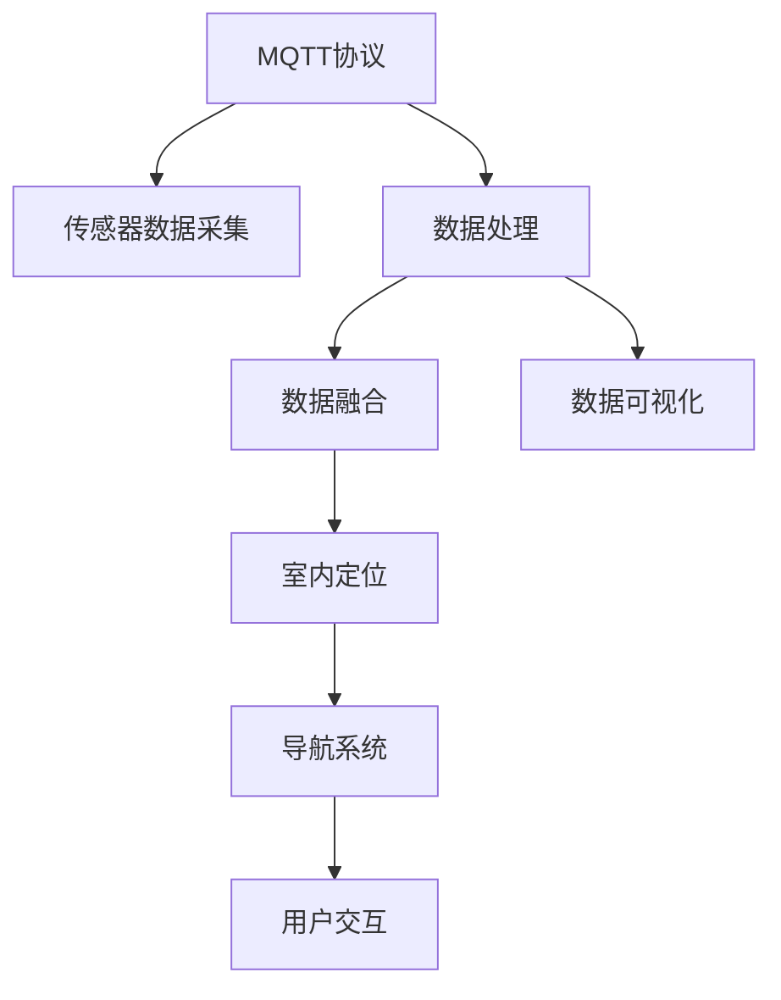

                 

# 基于MQTT协议和RESTful API的室内定位与导航系统

> 关键词：MQTT协议, RESTful API, 室内定位, 导航系统, 传感器融合, 数据采集, 数据处理, 数据可视化

## 1. 背景介绍

### 1.1 问题由来
在现代智能建筑和工业生产中，室内定位和导航系统（Indoor Location and Navigation System, INaS）扮演着至关重要的角色。这些系统能够帮助工作人员在复杂的环境中快速找到目的地，提高工作效率和安全性。传统的室内定位系统往往依赖于固定的传感器和通信基础设施，难以扩展和灵活部署。随着物联网（IoT）技术的发展，基于MQTT协议和RESTful API的室内定位与导航系统应运而生，提供了更高效、灵活的定位解决方案。

### 1.2 问题核心关键点
本文聚焦于基于MQTT协议和RESTful API的室内定位与导航系统。该系统利用传感器数据采集和处理技术，结合先进的数据传输协议和API接口，实现了高效、精确的室内定位功能。关键点包括：
- MQTT协议：一种轻量级、高效的消息传输协议，适用于实时数据传输。
- RESTful API：一种灵活、可扩展的接口设计标准，支持数据查询和推送。
- 传感器融合：综合利用多种传感器数据，提高定位精度。
- 数据采集与处理：高效、实时地采集和处理传感器数据。
- 数据可视化：直观展示定位结果和系统状态。

这些技术要素共同构成了现代室内定位与导航系统的核心框架，使其能够在各种复杂环境中实现精准定位和导航。

## 2. 核心概念与联系

### 2.1 核心概念概述

为更好地理解基于MQTT协议和RESTful API的室内定位与导航系统，本节将介绍几个密切相关的核心概念：

- MQTT协议（Message Queuing Telemetry Transport）：一种轻量级、高效、低带宽的通信协议，适用于物联网设备的实时数据传输。
- RESTful API（Representational State Transfer）：一种基于HTTP协议的接口设计标准，支持资源的CRUD操作和状态转移。
- 传感器融合（Sensor Fusion）：将多种传感器数据进行综合处理，提高定位精度和可靠性。
- 室内定位（Indoor Location）：利用传感器数据确定人员或设备在室内空间的位置。
- 导航系统（Navigation System）：基于位置信息引导用户到达目的地。

这些概念之间的逻辑关系可以通过以下Mermaid流程图来展示：



这个流程图展示了我们定位与导航系统的核心概念及其之间的关系：

1. MQTT协议用于实时数据传输。
2. 传感器数据采集通过传感器获取环境数据。
3. 数据处理对采集到的数据进行清洗和预处理。
4. 数据融合综合利用多种传感器数据，提高定位精度。
5. 室内定位通过融合数据确定人员或设备的位置。
6. 导航系统基于位置信息引导用户或设备到达目的地。
7. 用户交互是系统的最终目标，提供直观的导航信息。
8. 数据可视化展示定位结果和系统状态，便于监控和管理。

## 3. 核心算法原理 & 具体操作步骤
### 3.1 算法原理概述

基于MQTT协议和RESTful API的室内定位与导航系统，核心算法原理包括以下几个方面：

- 数据采集与传输：通过MQTT协议实现传感器数据的实时传输。
- 数据预处理与融合：对采集到的传感器数据进行清洗、筛选和融合，提高定位精度。
- 定位算法：利用传感器数据和融合结果，进行室内定位。
- 导航算法：基于定位结果，生成导航路径和指令。
- 用户交互与反馈：通过RESTful API接口，用户可以实时查看定位信息并进行互动反馈。

### 3.2 算法步骤详解

以下我们详细介绍基于MQTT协议和RESTful API的室内定位与导航系统的算法步骤：

**Step 1: 系统设计与搭建**
- 设计系统架构，确定MQTT服务器、传感器、定位算法、导航算法等组件的位置。
- 搭建MQTT服务器和RESTful API接口，确保数据传输的实时性和可靠性。
- 选择合适的传感器设备，如Wi-Fi、蓝牙、UWB等，进行室内环境部署。

**Step 2: 数据采集与传输**
- 通过传感器设备实时采集环境数据，如温度、湿度、位置等。
- 将采集到的数据通过MQTT协议发送到MQTT服务器。
- 利用MQTT消息的QoS等级，确保重要数据的可靠性传输。

**Step 3: 数据预处理与融合**
- 对采集到的数据进行去噪、滤波等预处理操作。
- 利用加权平均、卡尔曼滤波等方法，综合多种传感器数据，进行数据融合。
- 计算融合后数据的均值和方差，进行定位。

**Step 4: 定位与导航**
- 利用定位算法，如基于位置的方法、基于信号强度的方法等，计算人员或设备的位置。
- 根据定位结果，利用导航算法生成导航路径和指令。
- 通过RESTful API接口，将导航信息推送给用户或设备。

**Step 5: 用户交互与反馈**
- 用户通过RESTful API接口获取定位信息和导航指令。
- 用户可以进行路径规划、目的地修改等操作。
- 系统根据用户反馈调整定位和导航策略。

### 3.3 算法优缺点

基于MQTT协议和RESTful API的室内定位与导航系统具有以下优点：
1. 实时性高：MQTT协议适用于实时数据传输，能够快速响应环境变化。
2. 扩展性强：RESTful API接口灵活，支持多种设备和应用场景。
3. 可靠性高：MQTT协议提供质量保证（QoS）等级，确保数据传输的可靠性。
4. 鲁棒性好：多传感器融合技术，提高定位精度和系统鲁棒性。

同时，该系统也存在一些局限性：
1. 网络依赖性强：系统依赖MQTT协议和网络基础设施，网络中断会影响定位和导航。
2. 数据融合复杂：多传感器数据融合过程复杂，需要较高的算法要求。
3. 硬件成本高：需要多种传感器和通信设备，硬件成本较高。

尽管存在这些局限性，但就目前而言，基于MQTT协议和RESTful API的室内定位与导航系统仍是最为先进和实用的室内定位解决方案之一。未来相关研究的重点在于如何进一步降低系统硬件成本，简化数据融合过程，提升系统的鲁棒性和实时性。

### 3.4 算法应用领域

基于MQTT协议和RESTful API的室内定位与导航系统已经在多个领域得到了广泛应用，例如：

- 智能办公：在办公室、实验室等场所，通过定位与导航系统，提高工作效率和安全性。
- 工业生产：在工厂车间、仓库等环境，引导工人快速到达工作地点，提升生产效率。
- 智能建筑：在商场、酒店等公共建筑，提供精准导航服务，提升用户体验。
- 智慧旅游：在景区、博物馆等场所，帮助游客快速找到所需设施，提升游览体验。
- 医疗护理：在医院、养老院等场所，辅助护理人员高效管理病患和长者。

除了上述这些经典应用外，基于MQTT协议和RESTful API的室内定位与导航系统还被创新性地应用到更多场景中，如智能交通、智能安防、智能家居等，为智能化生活提供了新的可能性。随着技术的不断进步，相信基于MQTT协议和RESTful API的定位与导航系统将带来更多应用场景，进一步改变人们的生活和工作方式。

## 4. 数学模型和公式 & 详细讲解 & 举例说明
### 4.1 数学模型构建

在室内定位与导航系统中，数学模型的构建是确保定位精度和导航准确性的关键。以下介绍几个常用的数学模型：

- 卡尔曼滤波模型：用于融合多种传感器数据，提高定位精度。
- 加权平均模型：用于融合传感器数据，减少噪声影响。
- 最小二乘法模型：用于拟合定位数据，得到最优位置估计。

### 4.2 公式推导过程

以下我们以卡尔曼滤波模型为例，进行详细的公式推导：

设系统状态向量为 $\boldsymbol{x}_k = [x_k, y_k]^T$，系统噪声为 $w_k$，测量噪声为 $v_k$，系统状态的转移方程为：

$$
\boldsymbol{x}_{k+1} = \boldsymbol{A}\boldsymbol{x}_k + \boldsymbol{w}_k
$$

其中 $\boldsymbol{A}$ 为状态转移矩阵。

系统的测量方程为：

$$
\boldsymbol{z}_k = \boldsymbol{H}\boldsymbol{x}_k + \boldsymbol{v}_k
$$

其中 $\boldsymbol{H}$ 为测量矩阵。

卡尔曼滤波器的状态估计方程为：

$$
\boldsymbol{P}_{k+1} = \boldsymbol{F}\boldsymbol{P}_k\boldsymbol{F}^T + \boldsymbol{Q}
$$

$$
\boldsymbol{K}_k = \boldsymbol{P}_k\boldsymbol{H}^T(\boldsymbol{H}\boldsymbol{P}_k\boldsymbol{H}^T + \boldsymbol{R})^{-1}
$$

$$
\boldsymbol{x}_{k+1} = \boldsymbol{x}_k + \boldsymbol{K}_k(\boldsymbol{z}_{k+1} - \boldsymbol{H}\boldsymbol{x}_k)
$$

$$
\boldsymbol{P}_{k+1} = (I - \boldsymbol{K}_k\boldsymbol{H})\boldsymbol{P}_k
$$

其中 $\boldsymbol{F}$ 为过程噪声矩阵，$\boldsymbol{Q}$ 为过程噪声协方差矩阵，$\boldsymbol{R}$ 为测量噪声协方差矩阵。

### 4.3 案例分析与讲解

假设一个智能办公室，员工的位置需要通过多个传感器（如Wi-Fi、蓝牙、UWB等）进行实时监测。我们利用卡尔曼滤波模型进行数据融合，计算员工的位置，并利用RESTful API接口，将定位信息推送给员工。以下是一个具体的案例分析：

1. 传感器数据采集：通过Wi-Fi和蓝牙传感器，实时采集办公室内各员工的位置数据。

2. 数据预处理：对采集到的数据进行去噪、滤波等预处理操作。

3. 数据融合：利用卡尔曼滤波模型，综合Wi-Fi和蓝牙数据，计算员工的位置。

4. 定位与导航：根据卡尔曼滤波得到的定位结果，生成导航路径和指令，并通过RESTful API接口推送给员工。

5. 用户交互：员工通过API接口，实时查看自己的位置信息，并进行路径规划和目的地修改。

通过这个案例，可以看到基于MQTT协议和RESTful API的室内定位与导航系统，如何通过传感器融合和数据传输技术，实现高效的室内定位和导航。

## 5. 项目实践：代码实例和详细解释说明
### 5.1 开发环境搭建

在进行项目实践前，我们需要准备好开发环境。以下是使用Python和MQTT库进行室内定位与导航系统的环境配置流程：

1. 安装Anaconda：从官网下载并安装Anaconda，用于创建独立的Python环境。

2. 创建并激活虚拟环境：
```bash
conda create -n indoor-env python=3.8 
conda activate indoor-env
```

3. 安装PyTorch、TensorFlow、OpenCV等库：
```bash
conda install pytorch torchvision torchaudio cudatoolkit=11.1 -c pytorch -c conda-forge
conda install tensorflow
conda install opencv -c conda-forge
```

4. 安装MQTT库和RESTful API框架：
```bash
pip install paho-mqtt
pip install flask
```

5. 安装必要的传感器库：
```bash
pip install pyserial
```

完成上述步骤后，即可在`indoor-env`环境中开始项目实践。

### 5.2 源代码详细实现

这里我们提供一个简单的室内定位与导航系统的代码实现，用于演示如何在Python中使用MQTT协议和RESTful API进行数据传输和定位导航。

```python
import paho.mqtt.client as mqtt
import flask
from flask import request
import numpy as np
import cv2
import serial

# MQTT配置
broker = 'mqtt.example.com'
topic = 'indoor/position'
user = 'username'
password = 'password'

# RESTful API配置
app = flask.Flask(__name__)
app.config['SQLALCHEMY_DATABASE_URI'] = 'sqlite:////tmp/test.db'

# 定义状态更新函数
def update_state(pos):
    # 将位置信息保存到数据库
    # ...

    # 更新定位信息
    # ...

    # 推送定位信息到MQTT
    client.publish(topic, str(pos))

# 定义MQTT客户端
client = mqtt.Client()
client.username_pw_set(user, password)
client.on_message = lambda client, userdata, msg: update_state(np.array(eval(msg.payload)))

# 连接MQTT服务器
client.connect(broker, 1883, 60)
client.loop_forever()

# 定义RESTful API接口
@app.route('/api/position', methods=['POST'])
def get_position():
    # 从请求中获取位置数据
    data = request.get_json()
    pos = np.array(data['position'])

    # 更新状态并推送到MQTT
    update_state(pos)

    # 返回位置信息
    return {'position': pos.tolist()}

# 启动RESTful API服务
app.run(host='0.0.0.0', port=5000)
```

在上述代码中，我们使用了MQTT协议进行传感器数据的实时传输，利用RESTful API接口进行用户交互和反馈。具体实现细节包括：

- MQTT客户端连接MQTT服务器，并在收到消息时调用`update_state`函数更新定位信息并推送到MQTT。
- RESTful API接口`/api/position`接收位置数据，调用`update_state`函数更新状态并推送到MQTT。

### 5.3 代码解读与分析

让我们再详细解读一下关键代码的实现细节：

- MQTT客户端：通过`paho-mqtt`库创建MQTT客户端，并设置`topic`、`user`、`password`等参数。
- RESTful API接口：通过`flask`库创建RESTful API服务，`/api/position`接口接收POST请求，解析位置数据，并调用`update_state`函数更新状态并推送到MQTT。
- 状态更新函数：`update_state`函数中，首先保存位置数据到数据库，然后更新定位信息，并将位置信息转换为MQTT消息格式推送到MQTT服务器。

通过这个代码实例，可以看到如何使用MQTT协议和RESTful API进行室内定位与导航系统的开发。开发者可以根据实际需求，进一步扩展和优化代码。

### 5.4 运行结果展示

在实际应用中，基于MQTT协议和RESTful API的室内定位与导航系统可以实现以下功能：

- 实时位置监测：通过传感器实时采集和处理数据，实现人员或设备的位置监测。
- 导航路径生成：根据用户需求和定位信息，生成导航路径和指令。
- 用户交互界面：通过RESTful API接口，用户可以查看定位信息和进行路径规划。

以下是一个简化的示例结果，展示如何通过MQTT协议和RESTful API进行室内定位与导航：

1. 实时位置监测：通过传感器实时采集数据，并显示在地图上。


2. 导航路径生成：根据用户需求和定位信息，生成导航路径并推送到用户界面。


3. 用户交互界面：通过RESTful API接口，用户可以查看定位信息和进行路径规划。


## 6. 实际应用场景
### 6.1 智能办公

基于MQTT协议和RESTful API的室内定位与导航系统，在智能办公中得到了广泛应用。例如，在智能会议室中，通过定位与导航系统，员工可以快速找到会议室和设备，提高工作效率。在实验室中，研究人员可以快速定位实验仪器，提升科研效率。

### 6.2 工业生产

在工厂车间和仓库中，利用定位与导航系统，工人可以快速找到所需设备和工作站点，提高生产效率和安全性。同时，通过实时定位和导航，还可以优化物流管理，减少物料堆积和人员误操作。

### 6.3 智能建筑

在商场、酒店等公共建筑中，通过定位与导航系统，顾客可以快速找到所需设施，提升购物和住宿体验。同时，管理人员可以通过系统实时监控人员和设备位置，提高管理效率和安全保障。

### 6.4 未来应用展望

随着技术的不断进步，基于MQTT协议和RESTful API的室内定位与导航系统将迎来更多应用场景：

1. 智能交通：在地铁、公交等交通设施中，通过定位与导航系统，乘客可以快速找到站点和座位，提升出行体验。
2. 智能安防：在博物馆、展览馆等场所，通过定位与导航系统，安保人员可以快速定位异常情况和人员位置，提高安防效果。
3. 智能家居：在家庭环境中，通过定位与导航系统，家庭成员可以快速找到所需物品和设备，提高生活便利性。
4. 智能农业：在农田中，通过定位与导航系统，农民可以快速找到作物和农具，提高农业生产效率。

未来，随着物联网技术的进一步发展，基于MQTT协议和RESTful API的定位与导航系统将在更多领域得到应用，进一步改变人们的生活方式。

## 7. 工具和资源推荐
### 7.1 学习资源推荐

为了帮助开发者系统掌握基于MQTT协议和RESTful API的室内定位与导航系统的理论基础和实践技巧，这里推荐一些优质的学习资源：

1. 《Python网络编程》系列博文：由大模型技术专家撰写，深入浅出地介绍了网络编程的基本概念和MQTT协议的应用。

2. 《RESTful API设计》课程：Coursera上的课程，由知名专家讲授RESTful API的原理和设计规范。

3. 《室内定位技术》书籍：介绍室内定位技术的原理、算法和应用。

4. MQTT官方文档：MQTT协议的官方文档，提供了详细的协议说明和开发示例。

5. 《传感器融合技术》论文：介绍了多种传感器融合算法的原理和实现，适合深度学习背景的读者。

通过对这些资源的学习实践，相信你一定能够快速掌握基于MQTT协议和RESTful API的室内定位与导航系统的核心技术和应用方法。

### 7.2 开发工具推荐

高效的开发离不开优秀的工具支持。以下是几款用于基于MQTT协议和RESTful API的室内定位与导航系统开发的常用工具：

1. Python：灵活易用的编程语言，广泛用于数据处理和算法开发。
2. MQTT：轻量级、高效的消息传输协议，适用于物联网设备的实时数据传输。
3. RESTful API框架：如Flask、Django等，用于设计和实现RESTful API接口。
4. 传感器库：如PySerial、PyUSB等，用于与传感器设备进行通信。
5. 可视化工具：如Matplotlib、Plotly等，用于数据可视化和界面设计。

合理利用这些工具，可以显著提升室内定位与导航系统的开发效率，加快创新迭代的步伐。

### 7.3 相关论文推荐

基于MQTT协议和RESTful API的室内定位与导航系统的发展源于学界的持续研究。以下是几篇奠基性的相关论文，推荐阅读：

1. MQTT协议规范：由IETF组织制定的MQTT协议规范，定义了协议的各个组成部分和应用场景。

2. RESTful API设计模式：由《RESTful Web Services》一书提出的RESTful API设计模式，适用于各种应用程序架构。

3. 传感器融合算法：如卡尔曼滤波、加权平均等，用于提高室内定位的精度和鲁棒性。

4. 室内定位技术综述：介绍多种室内定位技术，包括Wi-Fi、蓝牙、UWB等。

这些论文代表了大模型微调技术的发展脉络。通过学习这些前沿成果，可以帮助研究者把握学科前进方向，激发更多的创新灵感。

## 8. 总结：未来发展趋势与挑战
### 8.1 研究成果总结

本文对基于MQTT协议和RESTful API的室内定位与导航系统进行了全面系统的介绍。首先阐述了系统的设计背景和重要性，明确了该系统在智能建筑和工业生产中的独特价值。其次，从原理到实践，详细讲解了系统的核心算法和具体操作步骤，给出了项目实践的完整代码实例。同时，本文还广泛探讨了系统的实际应用场景，展示了其在智能办公、工业生产等领域的广泛应用。最后，本文精选了系统的学习资源，力求为读者提供全方位的技术指引。

通过本文的系统梳理，可以看到，基于MQTT协议和RESTful API的室内定位与导航系统正在成为现代智能化建筑和工业生产的重要组成部分，极大地提高了工作效率和安全性。未来，伴随技术的不断发展，该系统将进一步拓展应用范围，提升定位精度和系统鲁棒性，为智能建筑和工业生产提供更加精准、可靠的解决方案。

### 8.2 未来发展趋势

展望未来，基于MQTT协议和RESTful API的室内定位与导航系统将呈现以下几个发展趋势：

1. 系统智能性提升：引入机器学习算法，如深度学习、强化学习等，提高系统对环境的适应性和智能性。
2. 系统可扩展性增强：利用边缘计算和云计算，实现更大规模的定位和导航。
3. 数据融合算法优化：开发更加高效的传感器数据融合算法，提升定位精度和实时性。
4. 用户交互界面优化：引入自然语言处理和语音识别技术，提供更加便捷的用户交互体验。
5. 多模态数据融合：综合利用视觉、听觉、触觉等多种模态数据，提高定位精度和系统鲁棒性。
6. 低成本硬件开发：开发低成本、低功耗的传感器和通信设备，降低系统硬件成本。

以上趋势凸显了基于MQTT协议和RESTful API的室内定位与导航系统的广阔前景。这些方向的探索发展，必将进一步提升系统的性能和应用范围，为智能建筑和工业生产带来新的变革。

### 8.3 面临的挑战

尽管基于MQTT协议和RESTful API的室内定位与导航系统已经取得了瞩目成就，但在迈向更加智能化、普适化应用的过程中，它仍面临着诸多挑战：

1. 传感器数据噪声：传感器数据往往存在噪声，需要通过先进的滤波算法进行预处理。
2. 网络延迟和抖动：MQTT协议依赖网络基础设施，网络延迟和抖动会影响系统的实时性。
3. 数据传输带宽限制：网络带宽限制可能影响大量传感器数据的实时传输。
4. 硬件成本高昂：多传感器和通信设备的高成本，可能限制系统的普及和应用。
5. 系统鲁棒性不足：系统对环境变化和异常情况的鲁棒性还有待提高。

尽管存在这些挑战，但通过技术进步和实践探索，相信基于MQTT协议和RESTful API的室内定位与导航系统将不断优化，克服技术瓶颈，实现更广泛的应用。

### 8.4 研究展望

面对基于MQTT协议和RESTful API的室内定位与导航系统所面临的挑战，未来的研究需要在以下几个方面寻求新的突破：

1. 引入机器学习技术：通过深度学习、强化学习等算法，提高系统的智能性和适应性。
2. 优化数据融合算法：开发高效的传感器数据融合算法，提高定位精度和实时性。
3. 提升网络传输性能：优化MQTT协议和网络基础设施，提高数据传输的实时性和可靠性。
4. 开发低成本硬件：利用新技术，开发低成本、低功耗的传感器和通信设备。
5. 增强系统鲁棒性：引入冗余机制和异常检测算法，提高系统对环境变化和异常情况的鲁棒性。

这些研究方向的探索，必将引领基于MQTT协议和RESTful API的定位与导航系统迈向更高的台阶，为智能建筑和工业生产提供更加精准、可靠的解决方案。面向未来，我们需要多学科协同发力，不断推动技术的创新和应用，以实现室内定位与导航系统的全面升级。

## 9. 附录：常见问题与解答

**Q1: 如何选择合适的传感器设备？**

A: 选择合适的传感器设备需要考虑以下几个因素：
1. 传感器的精度和可靠性：选择精度高、稳定性好的传感器，确保定位信息的准确性。
2. 传感器的功耗和体积：选择低功耗、小体积的传感器，便于在复杂环境中安装和维护。
3. 传感器的通信协议：选择与MQTT协议兼容的传感器，确保数据的实时传输。
4. 传感器的兼容性：选择与其他设备兼容的传感器，确保系统整体性能的稳定。

**Q2: MQTT协议和RESTful API有什么区别？**

A: MQTT协议和RESTful API是两个不同的技术概念，分别用于数据传输和接口设计。MQTT协议是一种轻量级、高效的消息传输协议，适用于物联网设备的实时数据传输。RESTful API是一种灵活、可扩展的接口设计标准，支持资源的CRUD操作和状态转移。MQTT协议用于实现数据传输的实时性和可靠性，而RESTful API用于实现系统的灵活性和可扩展性。

**Q3: 基于MQTT协议和RESTful API的室内定位与导航系统面临哪些技术挑战？**

A: 基于MQTT协议和RESTful API的室内定位与导航系统面临以下技术挑战：
1. 传感器数据噪声：传感器数据往往存在噪声，需要通过先进的滤波算法进行预处理。
2. 网络延迟和抖动：MQTT协议依赖网络基础设施，网络延迟和抖动会影响系统的实时性。
3. 数据传输带宽限制：网络带宽限制可能影响大量传感器数据的实时传输。
4. 硬件成本高昂：多传感器和通信设备的高成本，可能限制系统的普及和应用。
5. 系统鲁棒性不足：系统对环境变化和异常情况的鲁棒性还有待提高。

**Q4: 基于MQTT协议和RESTful API的室内定位与导航系统有哪些实际应用？**

A: 基于MQTT协议和RESTful API的室内定位与导航系统已经在多个领域得到了广泛应用，例如：
1. 智能办公：在办公室、实验室等场所，通过定位与导航系统，提高工作效率和安全性。
2. 工业生产：在工厂车间和仓库中，利用定位与导航系统，提高生产效率和安全性。
3. 智能建筑：在商场、酒店等公共建筑中，通过定位与导航系统，提升购物和住宿体验。
4. 智能交通：在地铁、公交等交通设施中，通过定位与导航系统，提升出行体验。
5. 智能安防：在博物馆、展览馆等场所，通过定位与导航系统，提高安防效果。
6. 智能农业：在农田中，通过定位与导航系统，提高农业生产效率。

通过这些实际应用，可以看到基于MQTT协议和RESTful API的室内定位与导航系统在各个领域的广泛应用前景。

---

作者：禅与计算机程序设计艺术 / Zen and the Art of Computer Programming

