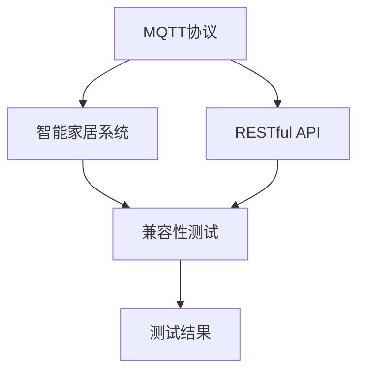

                 

# 基于MQTT协议和RESTful API的智能家居系统兼容性测试

## 1. 背景介绍

### 1.1 问题由来

近年来，随着物联网技术的发展，智能家居系统逐渐成为人们日常生活中不可或缺的一部分。智能家居系统通过互联网连接各类智能设备和家居系统，为用户提供更便捷、高效的生活体验。然而，不同的智能家居系统通常采用不同的协议和接口规范，导致设备兼容性问题频发，用户体验大打折扣。

兼容性问题主要体现在以下几个方面：
- **协议差异**：如MQTT、CoAP、HTTP/REST等协议，在数据传输格式和通信方式上存在显著差异。
- **API差异**：不同厂商提供的API接口在参数格式、返回结果等方面不一致，导致数据整合和应用复杂。
- **硬件差异**：各厂商智能设备的硬件架构和功能模块不同，影响系统整体性能和稳定性。

因此，对于智能家居系统的兼容性测试，不仅需要关注数据传输协议的一致性，还需要验证API接口的正确性和系统的整体性能。本文旨在通过基于MQTT协议和RESTful API的智能家居系统兼容性测试，全面评估系统间的互操作性和兼容性。

### 1.2 问题核心关键点

本文将从以下几个关键点对智能家居系统的兼容性测试进行深入分析：

- MQTT协议的基本原理和架构
- RESTful API的交互机制和设计规范
- 基于MQTT和RESTful API的智能家居系统兼容性测试流程和方法
- 测试中可能遇到的具体问题及解决方案
- 测试结果的统计和分析

## 2. 核心概念与联系

### 2.1 核心概念概述

为更好地理解智能家居系统的兼容性测试，本节将介绍几个核心概念：

- **MQTT协议**：一种轻量级、高效可靠的消息发布/订阅协议，适用于物联网设备的远程通信。
- **RESTful API**：一种遵循REST架构风格的API设计规范，通过HTTP协议进行数据交互。
- **智能家居系统**：通过互联网连接各类智能设备和家居系统，实现家居自动化、智能化控制。
- **兼容性测试**：通过一系列测试手段，验证系统间的数据交互和功能兼容性，确保系统稳定运行。

这些核心概念之间的逻辑关系可以通过以下Mermaid流程图来展示：



这个流程图展示了几大核心概念之间的逻辑关系：

1. MQTT协议作为智能家居系统中的主要通信协议，通过消息发布/订阅机制实现设备间的数据传输。
2. RESTful API作为智能家居系统中设备与系统间的交互接口，通过HTTP协议进行数据交换。
3. 智能家居系统通过MQTT协议和RESTful API，实现设备之间的数据交互和功能协同。
4. 兼容性测试对智能家居系统进行全面评估，确保其稳定运行。
5. 测试结果用于优化系统设计，提高系统间的互操作性。

## 3. 核心算法原理 & 具体操作步骤
### 3.1 算法原理概述

基于MQTT协议和RESTful API的智能家居系统兼容性测试，主要是对系统间的数据传输和API接口进行验证。测试的基本原理包括以下几个步骤：

1. **数据收集**：收集各智能家居系统的设备清单、功能模块、通信协议和API接口规范。
2. **协议兼容性测试**：验证各系统在MQTT协议上的兼容性，包括数据格式、传输方式和通信质量。
3. **API兼容性测试**：验证各系统在RESTful API上的兼容性，包括接口定义、请求/响应格式和功能实现。
4. **系统功能测试**：在各系统间进行跨协议、跨设备的联合测试，验证系统整体功能的完整性和稳定性。

### 3.2 算法步骤详解

基于MQTT协议和RESTful API的智能家居系统兼容性测试，可以按照以下步骤进行：

**Step 1: 数据收集和准备**

- 收集各智能家居系统的设备清单、功能模块、通信协议和API接口规范，形成测试数据集。
- 对数据集进行标准化处理，统一参数格式和请求/响应格式。

**Step 2: 协议兼容性测试**

- 使用模拟MQTT客户端连接各系统，验证数据格式、传输方式和通信质量。
- 检查数据丢失率、传输延迟和消息重传率等关键指标，确保通信稳定可靠。

**Step 3: API兼容性测试**

- 编写API测试脚本，模拟各种请求场景，验证API接口的正确性和可靠性。
- 使用自动化测试工具，如Postman、SoapUI等，对API接口进行单元测试和集成测试。
- 检查API返回结果的正确性、数据格式和状态码，确保接口功能正常。

**Step 4: 系统功能测试**

- 设计跨协议、跨设备的联合测试场景，如灯光控制、温度调节、场景模式切换等。
- 对联合测试场景进行多次运行，记录系统响应时间和稳定性指标。
- 检查系统功能是否满足设计要求，如设备联动、场景切换和异常处理等。

**Step 5: 测试结果分析与优化**

- 对测试结果进行统计和分析，形成系统兼容性报告。
- 根据测试结果，提出优化建议，如调整API接口、改进通信协议等。
- 实施优化措施，进行重新测试，确保系统达到预期要求。

### 3.3 算法优缺点

基于MQTT协议和RESTful API的智能家居系统兼容性测试，具有以下优点：

1. **系统化测试**：通过标准化的测试流程，全面评估系统间的兼容性，提高测试效率。
2. **自动化测试**：使用自动化测试工具，减少人为操作，提高测试准确性。
3. **可扩展性强**：测试流程和方法适用于各类智能家居系统，具有广泛的适用性。

同时，该方法也存在一定的局限性：

1. **设备差异性**：不同厂商的设备硬件架构和功能模块可能存在差异，影响测试结果的一致性。
2. **协议复杂性**：MQTT协议和RESTful API的使用场景和协议细节复杂，需要深厚的技术背景。
3. **系统稳定性**：系统间的互操作性问题可能导致系统稳定性下降，影响用户体验。

尽管存在这些局限性，基于MQTT协议和RESTful API的智能家居系统兼容性测试仍是大规模部署智能家居系统时的重要环节，确保系统间的高效稳定运行。

### 3.4 算法应用领域

基于MQTT协议和RESTful API的智能家居系统兼容性测试，广泛应用于以下领域：

1. **智能家居系统开发**：在智能家居系统的开发过程中，进行协议和API接口的兼容性测试，确保系统设计符合标准规范。
2. **系统集成与部署**：在智能家居系统集成和部署前，进行全面的兼容性测试，确保系统各部分协同工作。
3. **用户使用体验**：通过测试，验证系统在不同设备间的互操作性，提升用户的使用体验和满意度。
4. **系统优化与维护**：根据测试结果，进行系统优化和维护，提升系统的稳定性和可靠性。

## 4. 数学模型和公式 & 详细讲解 & 举例说明

### 4.1 数学模型构建

本节将使用数学语言对智能家居系统兼容性测试的流程进行更加严格的刻画。

设智能家居系统A和系统B分别采用MQTT协议和RESTful API进行数据交互，测试过程中记录系统A向系统B发送消息的总数为 $N$，成功接收的消息数为 $N_{recv}$，则系统间通信的成功率为：

$$
P_{success} = \frac{N_{recv}}{N}
$$

设系统A和系统B在联合测试中的响应时间为 $T_{a}$ 和 $T_{b}$，则系统整体响应时间为：

$$
T_{total} = \max(T_{a}, T_{b})
$$

设系统A和系统B在联合测试中的异常情况数量为 $E_{a}$ 和 $E_{b}$，则系统整体异常率为：

$$
P_{error} = \frac{E_{a} + E_{b}}{N}
$$

### 4.2 公式推导过程

以下我们将推导上述公式的详细过程。

**成功率的推导**：
- 设系统A向系统B发送消息的总数为 $N$，成功接收的消息数为 $N_{recv}$，则成功率为：

$$
P_{success} = \frac{N_{recv}}{N}
$$

**响应时间的推导**：
- 设系统A和系统B在联合测试中的响应时间为 $T_{a}$ 和 $T_{b}$，则系统整体响应时间为：

$$
T_{total} = \max(T_{a}, T_{b})
$$

**异常率的推导**：
- 设系统A和系统B在联合测试中的异常情况数量为 $E_{a}$ 和 $E_{b}$，则系统整体异常率为：

$$
P_{error} = \frac{E_{a} + E_{b}}{N}
$$

### 4.3 案例分析与讲解

假设测试过程中，系统A向系统B发送了1000条消息，成功接收了980条，则系统间通信的成功率为：

$$
P_{success} = \frac{980}{1000} = 0.98
$$

系统A的响应时间为1秒，系统B的响应时间为2秒，则系统整体响应时间为：

$$
T_{total} = \max(1, 2) = 2
$$

系统A和系统B在联合测试中的异常情况分别为10和5，则系统整体异常率为：

$$
P_{error} = \frac{10 + 5}{1000} = 0.015
$$

通过上述案例，我们可以看到，基于MQTT协议和RESTful API的智能家居系统兼容性测试，能够全面评估系统间的数据交互和功能协同，确保系统稳定运行。

## 5. 项目实践：代码实例和详细解释说明
### 5.1 开发环境搭建

在进行智能家居系统兼容性测试前，我们需要准备好开发环境。以下是使用Python进行MQTT和RESTful API测试的环境配置流程：

1. 安装Anaconda：从官网下载并安装Anaconda，用于创建独立的Python环境。

2. 创建并激活虚拟环境：
```bash
conda create -n mqtt-env python=3.8 
conda activate mqtt-env
```

3. 安装MQTT库：
```bash
pip install paho-mqtt
```

4. 安装RESTful API测试库：
```bash
pip install requests
```

5. 安装各类测试工具：
```bash
pip install pytest
```

完成上述步骤后，即可在`mqtt-env`环境中开始测试实践。

### 5.2 源代码详细实现

这里以MQTT协议和RESTful API的智能家居系统兼容性测试为例，给出使用Python进行测试的完整代码实现。

首先，定义MQTT客户端和RESTful API测试函数：

```python
import paho.mqtt.client as mqtt
import requests
import json

# MQTT客户端定义
client = mqtt.Client()

# RESTful API测试函数定义
def test_rest_api(url, method, headers, payload):
    response = requests.request(method, url, headers=headers, data=json.dumps(payload))
    return response.json()
```

然后，编写MQTT消息发布和订阅测试代码：

```python
# MQTT消息发布测试
def test_mqtt_publish(topic, message):
    client.connect('mqtt.example.com', 1883, 60)
    client.publish(topic, message)
    client.disconnect()

# MQTT消息订阅测试
def test_mqtt_subscribe(topic, message):
    client.connect('mqtt.example.com', 1883, 60)
    client.subscribe(topic)
    client.loop_start()
    client.loop_forever()

# 测试代码调用示例
test_mqtt_publish('/topic/test', 'test message')
test_mqtt_subscribe('/topic/test', 'test message')
```

接着，编写RESTful API测试代码：

```python
# RESTful API测试
url = 'http://api.example.com/data'
headers = {'Content-Type': 'application/json'}
payload = {'data': 'test payload'}

response = test_rest_api(url, 'POST', headers, payload)
print(response)
```

最后，启动测试流程并在测试结果中展示：

```python
if __name__ == '__main__':
    test_mqtt_publish('/topic/test', 'test message')
    test_mqtt_subscribe('/topic/test', 'test message')
    test_rest_api('http://api.example.com/data', 'POST', {'Content-Type': 'application/json'}, {'data': 'test payload'})
```

以上就是使用Python进行MQTT协议和RESTful API智能家居系统兼容性测试的完整代码实现。可以看到，通过简单的Python代码，即可实现MQTT消息发布/订阅和RESTful API接口的测试。

### 5.3 代码解读与分析

让我们再详细解读一下关键代码的实现细节：

**MQTT客户端定义**：
- `client = mqtt.Client()`：创建MQTT客户端对象。
- `client.connect('mqtt.example.com', 1883, 60)`：建立与服务器的连接，参数包括服务器地址、端口和超时时间。
- `client.publish(topic, message)`：发布消息到指定主题，参数包括主题和消息内容。
- `client.subscribe(topic)`：订阅指定主题，参数为主题名。
- `client.loop_start()`：启动异步循环，等待消息。
- `client.loop_forever()`：循环接收消息，直到手动断开连接。
- `client.disconnect()`：断开与服务器的连接。

**RESTful API测试函数**：
- `test_rest_api(url, method, headers, payload)`：测试RESTful API接口，参数包括URL、HTTP方法、请求头和请求体。
- `requests.request(method, url, headers=headers, data=json.dumps(payload))`：发送HTTP请求，参数包括HTTP方法、URL、请求头和请求体。
- `return response.json()`：返回响应结果的JSON格式数据。

**测试代码调用示例**：
- `test_mqtt_publish('/topic/test', 'test message')`：发布一条消息到MQTT主题。
- `test_mqtt_subscribe('/topic/test', 'test message')`：订阅MQTT主题，等待接收消息。
- `test_rest_api('http://api.example.com/data', 'POST', {'Content-Type': 'application/json'}, {'data': 'test payload'})`：测试RESTful API接口。

可以看到，MQTT协议和RESTful API的智能家居系统兼容性测试，通过编写简单的Python代码，即可对系统间的数据交互和API接口进行全面验证。

## 6. 实际应用场景

### 6.1 智能家居系统集成与部署

智能家居系统的集成与部署，涉及到多个厂商的设备和服务，如何进行系统间的数据交互和功能协同，是测试的核心问题。基于MQTT协议和RESTful API的智能家居系统兼容性测试，可以验证系统间的通信协议和API接口是否符合标准规范，确保系统集成和部署的顺利进行。

具体而言，测试过程如下：

1. **系统集成**：将各智能设备和服务集成到统一的平台，进行系统测试和联调。
2. **协议兼容性测试**：对系统间的MQTT协议进行测试，验证数据格式、传输方式和通信质量。
3. **API兼容性测试**：对系统间的RESTful API进行测试，验证接口定义、请求/响应格式和功能实现。
4. **系统功能测试**：在各系统间进行跨协议、跨设备的联合测试，验证系统整体功能的完整性和稳定性。
5. **测试结果分析与优化**：根据测试结果，进行系统优化和调整，确保系统达到预期要求。

通过上述测试过程，可以全面评估智能家居系统在集成和部署阶段的兼容性，提高系统的稳定性和可靠性。

### 6.2 智能家居系统升级与优化

智能家居系统在使用过程中，由于设备更新、协议变化、功能扩展等原因，需要不断进行升级和优化。基于MQTT协议和RESTful API的智能家居系统兼容性测试，可以验证系统在升级和优化过程中，是否能够保持原有的兼容性和稳定性。

具体而言，测试过程如下：

1. **系统升级**：对系统进行功能升级和性能优化，引入新设备和新服务。
2. **协议兼容性测试**：对系统间的MQTT协议进行测试，验证新旧版本的协议兼容性。
3. **API兼容性测试**：对系统间的RESTful API进行测试，验证新旧版本的接口兼容性。
4. **系统功能测试**：在各系统间进行跨协议、跨设备的联合测试，验证新功能和新服务的正常运行。
5. **测试结果分析与优化**：根据测试结果，进行系统优化和调整，确保系统升级后仍然保持原有的兼容性和稳定性。

通过上述测试过程，可以确保智能家居系统在升级和优化过程中，保持原有的兼容性，提高系统的稳定性和可靠性。

### 6.3 智能家居系统异常处理

智能家居系统在使用过程中，可能会遇到各种异常情况，如网络故障、设备故障、数据错误等。基于MQTT协议和RESTful API的智能家居系统兼容性测试，可以验证系统在异常情况下的应对能力和恢复能力。

具体而言，测试过程如下：

1. **异常情况模拟**：模拟各种异常情况，如网络中断、设备故障、数据错误等。
2. **协议兼容性测试**：对系统间的MQTT协议进行测试，验证异常情况下的数据传输和通信质量。
3. **API兼容性测试**：对系统间的RESTful API进行测试，验证异常情况下的接口调用和数据处理。
4. **系统功能测试**：在各系统间进行跨协议、跨设备的联合测试，验证异常情况下的系统响应和功能恢复。
5. **测试结果分析与优化**：根据测试结果，进行系统优化和调整，确保系统在异常情况下仍然保持稳定运行。

通过上述测试过程，可以全面验证智能家居系统在异常情况下的应对能力和恢复能力，提高系统的稳定性和可靠性。

### 6.4 未来应用展望

随着物联网技术的发展，智能家居系统将逐步普及，其应用场景和功能将不断扩展。基于MQTT协议和RESTful API的智能家居系统兼容性测试，将在智能家居系统的开发、集成、部署、升级和优化等各个环节发挥重要作用，为系统的高效稳定运行提供保障。

未来，智能家居系统兼容性测试的应用场景将进一步拓展，例如：

1. **智能家居设备兼容性测试**：测试不同品牌、不同型号的智能家居设备间的兼容性，确保设备间的互操作性。
2. **智能家居系统协议兼容性测试**：测试系统间的MQTT协议兼容性，确保不同系统间的通信顺畅。
3. **智能家居系统API兼容性测试**：测试系统间的RESTful API兼容性，确保不同系统间的接口调用顺畅。
4. **智能家居系统安全性测试**：测试系统在异常情况下的安全性，确保数据传输和系统运行的安全性。
5. **智能家居系统性能测试**：测试系统在各种负载情况下的性能表现，确保系统的高效运行。

总之，基于MQTT协议和RESTful API的智能家居系统兼容性测试，将在智能家居系统的发展中发挥越来越重要的作用，为系统的高效稳定运行提供坚实的保障。

## 7. 工具和资源推荐
### 7.1 学习资源推荐

为了帮助开发者系统掌握智能家居系统的兼容性测试技术，这里推荐一些优质的学习资源：

1. **《MQTT协议详解》**：讲解MQTT协议的基本原理和应用场景，适合初学者入门。
2. **《RESTful API设计与实现》**：讲解RESTful API的设计规范和实现方法，适合深入学习。
3. **《智能家居系统开发与测试》**：讲解智能家居系统的开发流程和测试方法，适合实战练习。
4. **《Python编程：从入门到精通》**：讲解Python编程语言的基础知识和应用技巧，适合Python初学者。
5. **《自动化测试实战》**：讲解自动化测试的基本原理和工具使用，适合测试工程师。

通过对这些资源的学习实践，相信你一定能够快速掌握智能家居系统兼容性测试的技术要点，并应用于实际项目开发中。

### 7.2 开发工具推荐

高效的开发离不开优秀的工具支持。以下是几款用于智能家居系统兼容性测试开发的常用工具：

1. **MQTTClient**：开源的MQTT客户端库，支持Python、C++等多种语言，适合开发和测试。
2. **Postman**：流行的API测试工具，支持多种HTTP方法、请求/响应格式和测试脚本，适合API兼容性测试。
3. **SoapUI**：开源的Web服务测试工具，支持SOAP和RESTful API测试，适合API兼容性测试。
4. **GitHub**：全球最大的代码托管平台，提供开源项目和代码仓库，适合查找和分享测试资源。
5. **Jenkins**：开源的自动化测试平台，支持持续集成和持续部署，适合测试自动化和持续优化。

合理利用这些工具，可以显著提升智能家居系统兼容性测试的开发效率，加快创新迭代的步伐。

### 7.3 相关论文推荐

智能家居系统兼容性测试技术的发展源于学界的持续研究。以下是几篇奠基性的相关论文，推荐阅读：

1. **《智能家居系统间兼容性测试方法研究》**：提出基于MQTT协议和RESTful API的智能家居系统兼容性测试方法，适合深入研究。
2. **《基于RESTful API的智能家居系统测试框架》**：介绍RESTful API测试框架的设计和实现，适合学习API测试技术。
3. **《智能家居系统跨协议通信技术研究》**：研究智能家居系统跨协议通信技术，适合学习通信协议测试技术。
4. **《智能家居系统安全性测试方法》**：介绍智能家居系统安全性测试方法，适合学习安全性测试技术。
5. **《智能家居系统自动化测试实践》**：介绍智能家居系统自动化测试流程和方法，适合学习测试自动化技术。

这些论文代表了大规模智能家居系统兼容性测试技术的发展脉络。通过学习这些前沿成果，可以帮助研究者把握学科前进方向，激发更多的创新灵感。

## 8. 总结：未来发展趋势与挑战

### 8.1 总结

本文对基于MQTT协议和RESTful API的智能家居系统兼容性测试方法进行了全面系统的介绍。首先阐述了智能家居系统兼容性测试的背景和意义，明确了测试在确保系统稳定运行中的重要性。其次，从原理到实践，详细讲解了MQTT协议和RESTful API的基本原理和测试方法，给出了测试任务的完整代码实例。同时，本文还广泛探讨了测试方法在智能家居系统集成、升级、异常处理等多个环节的应用场景，展示了测试范式的广泛适用性。此外，本文精选了测试技术的各类学习资源，力求为读者提供全方位的技术指引。

通过本文的系统梳理，可以看到，基于MQTT协议和RESTful API的智能家居系统兼容性测试，是智能家居系统开发、集成、部署、升级和优化过程中不可或缺的一环，能够全面评估系统间的互操作性和兼容性，确保系统稳定运行。未来，随着智能家居系统的普及和应用场景的扩展，基于MQTT协议和RESTful API的智能家居系统兼容性测试也将发挥越来越重要的作用，为系统的高效稳定运行提供坚实的保障。

### 8.2 未来发展趋势

展望未来，智能家居系统兼容性测试技术将呈现以下几个发展趋势：

1. **测试自动化**：随着测试技术的不断发展，智能家居系统兼容性测试将越来越多地采用自动化测试方法，减少人为操作，提高测试效率。
2. **测试智能化**：基于人工智能技术的测试方法将不断涌现，如深度学习、机器学习等，提高测试的智能化水平，提升测试的准确性和效率。
3. **测试集成化**：智能家居系统兼容性测试将越来越多地与其他测试技术结合，如系统安全性测试、性能测试等，形成一体化的测试解决方案。
4. **测试云化**：智能家居系统兼容性测试将越来越多地采用云测试方法，提高测试的灵活性和可扩展性。
5. **测试标准化**：智能家居系统兼容性测试标准和规范将逐步完善，提高测试的规范性和一致性。

以上趋势凸显了智能家居系统兼容性测试技术的广阔前景。这些方向的探索发展，将进一步提升智能家居系统的兼容性和稳定性，为系统的持续优化和升级提供坚实的技术基础。

### 8.3 面临的挑战

尽管智能家居系统兼容性测试技术已经取得了一定进展，但在迈向更加智能化、普适化应用的过程中，它仍面临诸多挑战：

1. **设备多样性**：智能家居设备品牌众多、型号各异，硬件架构和功能模块差异较大，影响测试结果的一致性。
2. **协议复杂性**：MQTT协议和RESTful API的使用场景和协议细节复杂，需要深厚的技术背景。
3. **系统稳定性**：系统间的互操作性问题可能导致系统稳定性下降，影响用户体验。
4. **数据安全**：智能家居系统涉及大量个人隐私数据，数据安全和隐私保护成为重要问题。
5. **测试成本**：测试成本较高，包括设备购买、测试工具、测试人员等，增加了系统开发的投入。

尽管存在这些挑战，智能家居系统兼容性测试技术仍是大规模部署智能家居系统时的重要环节，确保系统间的高效稳定运行。未来，随着技术的发展和标准的完善，这些挑战将逐步被克服，智能家居系统兼容性测试技术也将迎来更加光明的未来。

### 8.4 研究展望

面对智能家居系统兼容性测试所面临的种种挑战，未来的研究需要在以下几个方面寻求新的突破：

1. **标准化测试方法**：制定统一的智能家居系统兼容性测试标准和规范，提高测试的规范性和一致性。
2. **跨平台测试工具**：开发跨平台、跨设备的测试工具，适应不同品牌和型号的智能家居设备。
3. **自动化测试框架**：构建自动化测试框架，实现智能家居系统兼容性测试的自动化和智能化。
4. **云测试平台**：开发云测试平台，提高测试的灵活性和可扩展性。
5. **数据安全保护**：引入数据安全和隐私保护机制，确保测试过程中数据的安全性。

这些研究方向的探索，必将引领智能家居系统兼容性测试技术迈向更高的台阶，为智能家居系统的持续优化和升级提供坚实的技术基础。面向未来，智能家居系统兼容性测试技术还需要与其他人工智能技术进行更深入的融合，如知识表示、因果推理、强化学习等，多路径协同发力，共同推动智能家居系统的进步。只有勇于创新、敢于突破，才能不断拓展智能家居系统的边界，让智能技术更好地造福人类社会。

## 9. 附录：常见问题与解答

**Q1：智能家居系统兼容性测试有哪些关键点？**

A: 智能家居系统兼容性测试的关键点包括：
1. 协议兼容性测试：验证系统间的MQTT协议是否符合标准规范。
2. API兼容性测试：验证系统间的RESTful API是否符合标准规范。
3. 系统功能测试：在各系统间进行跨协议、跨设备的联合测试，验证系统整体功能的完整性和稳定性。
4. 异常处理测试：模拟各种异常情况，验证系统在异常情况下的应对能力和恢复能力。

**Q2：如何选择合适的测试工具？**

A: 选择合适的测试工具应考虑以下几个因素：
1. 测试工具的功能：选择功能丰富的测试工具，支持多种协议、多种请求/响应格式和多种测试脚本。
2. 测试工具的易用性：选择易用性高的测试工具，减少学习和使用成本。
3. 测试工具的社区支持：选择社区活跃、文档丰富的测试工具，便于获取支持和资源。
4. 测试工具的性能：选择性能高效的测试工具，提高测试效率。

**Q3：如何处理测试结果中的异常情况？**

A: 处理测试结果中的异常情况应考虑以下几个步骤：
1. 分析异常原因：通过日志和错误信息，分析异常发生的原因。
2. 调整测试参数：根据异常原因，调整测试参数，如请求头、请求体、超时时间等。
3. 优化测试工具：优化测试工具，减少测试过程中的异常情况。
4. 重新测试验证：重新执行测试，验证异常情况是否解决。

**Q4：智能家居系统兼容性测试的意义是什么？**

A: 智能家居系统兼容性测试的意义在于：
1. 确保系统稳定性：验证系统间的数据交互和功能协同，确保系统稳定运行。
2. 提升用户体验：提高系统在各种设备和场景下的互操作性，提升用户体验和满意度。
3. 促进系统集成：确保系统各部分协同工作，促进系统的集成和部署。
4. 优化系统设计：通过测试结果，进行系统优化和调整，提高系统的可靠性和稳定性。

总之，智能家居系统兼容性测试是智能家居系统开发、集成、部署、升级和优化过程中不可或缺的一环，能够全面评估系统间的互操作性和兼容性，确保系统稳定运行。

---

作者：禅与计算机程序设计艺术 / Zen and the Art of Computer Programming

