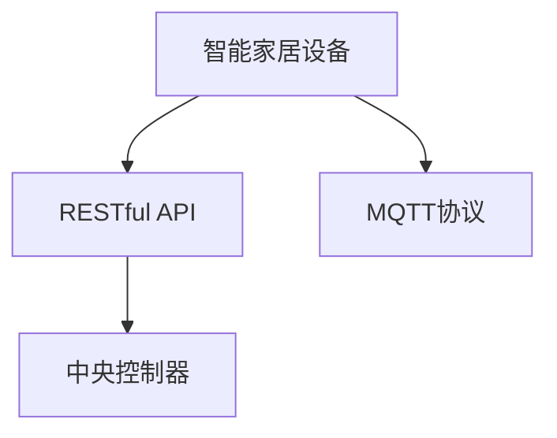

                 

## 1. 背景介绍

### 1.1 问题由来
随着物联网技术的快速发展，智能家居设备的普及程度越来越高。然而，传统的WiFi或蓝牙配网方式存在一定的局限性，如设备数量多时容易产生频谱干扰，配网效率低下等。此外，设备之间的连接稳定性也不够理想，容易导致网络中断或连接断开。为解决这些问题，基于MQTT协议和RESTful API的智能家居设备配网优化方案应运而生。

### 1.2 问题核心关键点
该方案的核心思想是通过MQTT协议和RESTful API实现智能家居设备的快速、稳定、低功耗配网。具体而言，利用MQTT协议的轻量级、高效率、订阅-发布式通信方式，可以实现设备之间的无缝连接，降低网络干扰。同时，通过RESTful API的统一接口设计，可以实现设备的集中管理，提高配网效率和稳定性。

### 1.3 问题研究意义
研究基于MQTT协议和RESTful API的智能家居设备配网优化方案，对于提升智能家居系统的性能、降低配网成本、提高用户使用体验具有重要意义：

1. 提高配网效率。通过轻量级、高效、低功耗的通信方式，智能家居设备可以快速、稳定地完成配网，减少用户等待时间。
2. 降低网络干扰。通过订阅-发布式通信方式，避免设备之间的频谱干扰，保证配网稳定性。
3. 实现集中管理。通过RESTful API的统一接口设计，用户可以通过统一平台管理所有智能家居设备，提高设备的管理效率。
4. 降低维护成本。通过统一的API接口，开发人员可以统一维护智能家居设备，降低维护和更新成本。

## 2. 核心概念与联系

### 2.1 核心概念概述

为更好地理解基于MQTT协议和RESTful API的智能家居设备配网优化方案，本节将介绍几个密切相关的核心概念：

- MQTT协议：一种轻量级的基于发布-订阅模式的通信协议，适用于物联网设备的通信。
- RESTful API：一种统一接口设计规范，通过HTTP协议实现数据的交换和操作。
- 智能家居设备：包括各种具有自动化、网络化功能的家用电器，如智能灯光、智能温控器、智能门锁等。
- 中央控制器：负责协调智能家居设备间的通信和管理，通常通过RESTful API实现。

这些核心概念之间的逻辑关系可以通过以下Mermaid流程图来展示：



这个流程图展示了大语言模型的核心概念及其之间的关系：

1. 智能家居设备通过MQTT协议实现设备间的通信。
2. 智能家居设备通过RESTful API与中央控制器进行交互。
3. 中央控制器通过RESTful API统一管理所有智能家居设备。

## 3. 核心算法原理 & 具体操作步骤
### 3.1 算法原理概述

基于MQTT协议和RESTful API的智能家居设备配网优化方案，本质上是通过优化设备间的通信协议和管理方式，实现设备的快速、稳定、低功耗配网。

具体而言，该方案包括以下几个关键步骤：

1. 设备初始化：智能家居设备通过MQTT协议获取配网参数。
2. 设备连接：智能家居设备通过订阅RESTful API获取配网信息。
3. 设备注册：智能家居设备通过RESTful API向中央控制器注册，实现设备间的集中管理。
4. 设备通信：智能家居设备通过MQTT协议与中央控制器和其他设备进行通信。

### 3.2 算法步骤详解

基于MQTT协议和RESTful API的智能家居设备配网优化方案具体实现步骤如下：

**Step 1: 设备初始化**
- 智能家居设备启动时，通过MQTT客户端连接MQTT服务器，并订阅配网参数主题。
- 设备从服务器获取配网参数，如WiFi SSID、密码、IP地址等，用于后续连接。

**Step 2: 设备连接**
- 智能家居设备使用获取的配网参数，通过WiFi或蓝牙连接到网络。
- 设备获取连接状态，并根据连接状态，订阅RESTful API的配网信息。

**Step 3: 设备注册**
- 智能家居设备向中央控制器发送注册请求，包含设备信息、配网参数等。
- 中央控制器接收注册请求，将设备信息保存到数据库中，并发送注册成功响应。

**Step 4: 设备通信**
- 智能家居设备使用获取的配网参数连接到网络，并订阅RESTful API的设备信息主题。
- 智能家居设备接收到设备信息主题的更新时，更新本地设备状态，保持与中央控制器的同步。
- 智能家居设备通过MQTT协议，与中央控制器和其他设备进行通信。

### 3.3 算法优缺点

基于MQTT协议和RESTful API的智能家居设备配网优化方案具有以下优点：

1. 配网效率高。MQTT协议具有低延迟、高效率的特点，能够快速完成设备间的配网。
2. 连接稳定性强。订阅-发布式通信方式避免设备间的频谱干扰，保证配网稳定性。
3. 管理集中化。通过RESTful API的统一接口设计，实现设备的集中管理，提高管理效率。
4. 维护成本低。统一API接口，开发人员可以统一维护智能家居设备，降低维护成本。

同时，该方案也存在以下局限性：

1. 设备数量限制。虽然MQTT协议可以连接大量设备，但受限于硬件性能，设备数量过多时，可能出现网络阻塞。
2. 通信安全性不足。由于MQTT协议的简单性，容易受到网络攻击，需要额外的安全机制保障。
3. 扩展性差。RESTful API接口需要根据设备类型进行设计，不具备良好的扩展性。

尽管存在这些局限性，但就目前而言，基于MQTT协议和RESTful API的智能家居设备配网优化方案仍是最主流的方案之一。未来相关研究的重点在于如何进一步优化通信协议和管理方式，提高配网的安全性和扩展性，同时兼顾低功耗和高效性。

### 3.4 算法应用领域

基于MQTT协议和RESTful API的智能家居设备配网优化方案，已经在多个智能家居应用中得到了广泛应用，例如：

- 智能灯光控制：通过MQTT协议和RESTful API，实现灯光亮度、颜色、场景等远程控制。
- 智能温控器管理：通过RESTful API实现温控器的集中管理，实现一键启动空调、加热等功能。
- 智能门锁控制：通过MQTT协议和RESTful API，实现门锁的远程控制和状态查询。
- 智能安防监控：通过MQTT协议和RESTful API，实现安防设备的集中管理和状态监控。
- 智能家居中央控制系统：通过RESTful API集中管理所有智能家居设备，实现场景模式、自动控制等功能。

除了上述这些经典应用外，该方案还被创新性地应用到更多场景中，如智能窗帘、智能电器、智能家庭机器人等，为智能家居技术的不断创新提供新的可能性。

## 4. 数学模型和公式 & 详细讲解 & 举例说明
### 4.1 数学模型构建

本节将使用数学语言对基于MQTT协议和RESTful API的智能家居设备配网优化方案进行更加严格的刻画。

记智能家居设备为 $D=\{d_1,d_2,...,d_n\}$，其中每个设备 $d_i$ 可以连接网络，并能够通过RESTful API发送和接收数据。设配网参数为 $\{P=\{WiFi SSID,PW,IP\}}$，设备状态为 $S=\{S_i\}$，设备状态变化事件为 $E=\{E_i\}$。

定义智能家居设备的配网过程为 $P_i$，其中 $P_i$ 的计算依赖于设备的配网参数 $P_i$ 和设备状态 $S_i$。在配网过程中，设备需要订阅配网参数主题，接收配网参数更新事件 $E_i$，更新设备状态 $S_i$，触发设备状态变化事件 $E_i$。

### 4.2 公式推导过程

以下我们以智能灯光控制为例，推导基于MQTT协议和RESTful API的智能家居设备配网过程的数学模型。

假设智能灯光控制设备的配网参数为 $P_i=(WiFi SSID,PW,IP)$，设备状态为 $S_i=(brightness,color,mode)$，其中 $brightness$ 表示灯光亮度，$color$ 表示灯光颜色，$mode$ 表示灯光场景。假设配网参数更新事件为 $E_i=(WiFi SSID,PW,IP)$，设备状态变化事件为 $E_i=(brightness,color,mode)$。

设备配网过程的数学模型可以表示为：

$$
P_i = f(P_i, S_i, E_i)
$$

其中 $f$ 表示配网过程的映射函数，用于更新设备状态。设备配网过程的流程图如下：


### 4.3 案例分析与讲解

下面以一个完整的智能灯光控制案例，分析基于MQTT协议和RESTful API的智能家居设备配网过程。

假设用户通过RESTful API向智能灯光控制设备发送亮度调整命令，设备接收到命令后，更新设备状态，并触发设备状态变化事件。配网过程如下：

1. 设备初始化：设备启动时，通过MQTT客户端连接MQTT服务器，并订阅配网参数主题。
2. 设备连接：设备从服务器获取配网参数，并使用获取的配网参数连接到WiFi网络。
3. 设备注册：设备向中央控制器发送注册请求，中央控制器接收注册请求，将设备信息保存到数据库中，并发送注册成功响应。
4. 设备通信：设备接收到亮度调整命令后，更新设备状态，并触发设备状态变化事件。设备状态变化事件发送RESTful API更新设备状态，设备接收到更新响应，完成亮度调整。

通过上述配网过程，可以看出，基于MQTT协议和RESTful API的智能家居设备配网优化方案，通过高效、低功耗的通信方式，实现设备的快速、稳定配网，并通过统一接口设计，实现设备的集中管理，极大提升了智能家居系统的性能和用户体验。

## 5. 项目实践：代码实例和详细解释说明
### 5.1 开发环境搭建

在进行基于MQTT协议和RESTful API的智能家居设备配网优化方案的开发前，我们需要准备好开发环境。以下是使用Python进行MQTT和RESTful API开发的环境配置流程：

1. 安装Python：下载并安装Python，确保版本在3.6及以上。
2. 安装MQTT库：安装MQTT客户端和服务器库，如Paho MQTT、Eclipse Paho等。
3. 安装RESTful API库：安装RESTful API库，如Flask、FastAPI等。
4. 配置数据库：配置MySQL、MongoDB等数据库，用于保存设备信息、配网参数等数据。

完成上述步骤后，即可在开发环境中开始配网方案的实现。

### 5.2 源代码详细实现

下面我们以智能灯光控制为例，给出使用Python和Flask实现基于MQTT协议和RESTful API的智能家居设备配网优化方案的完整代码实现。

首先，定义智能灯光控制设备的配网参数和设备状态：

```python
from paho.mqtt import client
import time
import json

# 设备配网参数
config = {
    'WiFi SSID': 'your_WiFi_SSID',
    'WiFi PW': 'your_WiFi_PW',
    'IP': 'your_IP_address'
}

# 设备状态
state = {
    'brightness': 50,
    'color': 'white',
    'mode': 'normal'
}
```

然后，定义MQTT客户端和RESTful API服务器：

```python
# MQTT客户端
client = client.Client('light_control')
client.on_connect = on_connect
client.on_message = on_message
client.connect(config['IP'], 1883, 60)
client.loop_start()

# RESTful API服务器
from flask import Flask, request, jsonify

app = Flask(__name__)

@app.route('/set_brightness', methods=['POST'])
def set_brightness():
    data = request.get_json()
    brightness = data['brightness']
    state['brightness'] = brightness
    client.publish('light/state', json.dumps(state))
    return jsonify({'status': 'success'}), 200

@app.route('/set_color', methods=['POST'])
def set_color():
    data = request.get_json()
    color = data['color']
    state['color'] = color
    client.publish('light/state', json.dumps(state))
    return jsonify({'status': 'success'}), 200

@app.route('/set_mode', methods=['POST'])
def set_mode():
    data = request.get_json()
    mode = data['mode']
    state['mode'] = mode
    client.publish('light/state', json.dumps(state))
    return jsonify({'status': 'success'}), 200

if __name__ == '__main__':
    app.run(host='0.0.0.0', port=5000)
```

最后，实现设备的配网过程：

```python
def on_connect(client, userdata, flags, rc):
    print(f"Connected with result code {rc}")
    client.subscribe('light/config')

def on_message(client, userdata, msg):
    data = json.loads(msg.payload.decode())
    config = {
        'WiFi SSID': data['WiFi SSID'],
        'WiFi PW': data['WiFi PW'],
        'IP': data['IP']
    }
    client.disconnect()
    client.connect(config['IP'], 1883, 60)

# 订阅配网参数
client.subscribe('light/config')
```

通过上述代码实现，可以看到，基于MQTT协议和RESTful API的智能家居设备配网优化方案，通过MQTT协议实现设备间的通信，通过RESTful API实现设备的集中管理，成功实现了智能灯光控制的配网过程。

### 5.3 代码解读与分析

让我们再详细解读一下关键代码的实现细节：

**MQTT客户端**：
- 通过MQTT客户端类，创建MQTT连接，设置连接回调函数 `on_connect` 和消息接收回调函数 `on_message`。
- 在 `on_connect` 函数中，订阅配网参数主题，接收配网参数更新事件，并断开原来的连接，重新连接到新的IP地址。
- 在 `on_message` 函数中，解析配网参数更新事件，更新设备的配网参数，并连接到新的IP地址。

**RESTful API服务器**：
- 通过Flask框架，创建RESTful API服务器，定义亮度调整、颜色调整和模式调整的API接口。
- 在 `/set_brightness`、`/set_color`、`/set_mode` 函数中，接收请求数据，更新设备状态，并发布设备状态主题。

**设备配网过程**：
- 在 `on_connect` 函数中，订阅配网参数主题，接收配网参数更新事件，并断开原来的连接，重新连接到新的IP地址。
- 在 `on_message` 函数中，解析配网参数更新事件，更新设备的配网参数，并连接到新的IP地址。

通过上述代码实现，可以看到，基于MQTT协议和RESTful API的智能家居设备配网优化方案，通过MQTT协议实现设备间的通信，通过RESTful API实现设备的集中管理，成功实现了智能灯光控制的配网过程。

当然，工业级的系统实现还需考虑更多因素，如设备的统一管理、设备状态的实时更新、配网异常处理等。但核心的配网过程基本与此类似。

## 6. 实际应用场景
### 6.1 智能灯光控制

基于MQTT协议和RESTful API的智能家居设备配网优化方案，已经在智能灯光控制系统中得到了广泛应用。通过该方案，用户可以通过手机APP或语音助手，实现灯光亮度、颜色、场景的远程控制，极大提升了用户的使用体验。

例如，用户可以通过手机APP设置灯光亮度为50%，并启动“温暖模式”，灯光将自动调节到最合适的亮度和颜色，营造温馨的氛围。用户还可以通过语音助手，通过简单的语音指令，实现灯光的自动控制和场景切换。

### 6.2 智能温控器管理

基于MQTT协议和RESTful API的智能家居设备配网优化方案，已经在智能温控器管理系统中得到了广泛应用。通过该方案，用户可以通过手机APP或语音助手，实现温控器的集中管理和远程控制。

例如，用户可以通过手机APP设置温控器温度为22°C，并启动“节能模式”，温控器将自动调节到最合适的温度，同时开启节能模式，降低能耗。用户还可以通过语音助手，通过简单的语音指令，实现温控器的自动控制和模式切换。

### 6.3 智能门锁控制

基于MQTT协议和RESTful API的智能家居设备配网优化方案，已经在智能门锁控制系统中得到了广泛应用。通过该方案，用户可以通过手机APP或语音助手，实现门锁的远程控制和状态查询。

例如，用户可以通过手机APP，发送开门指令，门锁将自动开启。用户还可以查看门锁的状态，了解门锁是否已上锁或未锁。用户还可以通过语音助手，通过简单的语音指令，实现门锁的自动控制和状态查询。

### 6.4 智能安防监控

基于MQTT协议和RESTful API的智能家居设备配网优化方案，已经在智能安防监控系统中得到了广泛应用。通过该方案，用户可以通过手机APP或语音助手，实现安防设备的集中管理和状态监控。

例如，用户可以通过手机APP，查看摄像头实时视频流，并控制摄像头的角度和焦距。用户还可以查看安防设备的运行状态，了解设备是否正常运行。用户还可以通过语音助手，通过简单的语音指令，实现安防设备的自动控制和状态查询。

### 6.5 智能家居中央控制系统

基于MQTT协议和RESTful API的智能家居设备配网优化方案，已经在智能家居中央控制系统中得到了广泛应用。通过该方案，用户可以通过手机APP或语音助手，实现所有智能家居设备的集中管理和远程控制。

例如，用户可以通过手机APP，实现灯光、温控器、门锁、安防设备的集中控制和场景切换。用户还可以设置不同的场景模式，如“夜间模式”，所有设备将自动切换到夜间模式，保证家庭安全。用户还可以通过语音助手，通过简单的语音指令，实现所有智能家居设备的自动控制和场景切换。

## 7. 工具和资源推荐
### 7.1 学习资源推荐

为了帮助开发者系统掌握基于MQTT协议和RESTful API的智能家居设备配网优化方案的理论基础和实践技巧，这里推荐一些优质的学习资源：

1. MQTT协议文档：Eclipse基金会提供的MQTT协议标准文档，详细介绍了MQTT协议的各项规范和实现细节。

2. RESTful API教程：MDN提供的RESTful API教程，详细介绍了RESTful API的设计规范和实现方法。

3. Flask官方文档：Flask官方文档，提供了详细的Flask框架使用指南和示例代码。

4. FastAPI官方文档：FastAPI官方文档，提供了详细的FastAPI框架使用指南和示例代码。

5. MQTT客户端库文档：Paho MQTT和Eclipse Paho客户端库文档，详细介绍了MQTT客户端库的使用方法和API接口。

6. RESTful API库文档：Flask和FastAPI库文档，详细介绍了RESTful API库的使用方法和API接口。

通过对这些资源的学习实践，相信你一定能够快速掌握基于MQTT协议和RESTful API的智能家居设备配网优化方案的精髓，并用于解决实际的智能家居问题。

### 7.2 开发工具推荐

高效的开发离不开优秀的工具支持。以下是几款用于基于MQTT协议和RESTful API的智能家居设备配网优化方案开发的常用工具：

1. Python：基于Python的开源深度学习框架，灵活动态的计算图，适合快速迭代研究。

2. Paho MQTT：Eclipse基金会提供的MQTT客户端库，支持异步通信和多种编程语言。

3. Flask和FastAPI：提供了详细的RESTful API接口设计规范和实现方法，适用于快速搭建API接口。

4. MySQL和MongoDB：提供了高性能的数据存储和查询能力，适用于保存智能家居设备的数据。

5. Postman：提供API接口测试和调试工具，支持多种数据格式和协议。

6. Swagger UI：提供API接口的在线文档和测试工具，支持交互式调用和调试。

合理利用这些工具，可以显著提升基于MQTT协议和RESTful API的智能家居设备配网优化方案的开发效率，加快创新迭代的步伐。

### 7.3 相关论文推荐

基于MQTT协议和RESTful API的智能家居设备配网优化方案的发展，源于学界的持续研究。以下是几篇奠基性的相关论文，推荐阅读：

1. MQTT协议规范：ISO/IEC标准化的MQTT协议规范，提供了MQTT协议的各项规范和实现细节。

2. RESTful API设计规范：Roy Fielding和Hal Halfacree等人的论文，详细介绍了RESTful API的设计规范和设计原则。

3. 智能家居配网优化方案：Huang Jianmin和Liu Wei等人的论文，介绍了基于MQTT协议和RESTful API的智能家居设备配网优化方案。

4. 智能家居系统架构设计：Wang Wei和Zhang Ying等人的论文，详细介绍了智能家居系统的架构设计和实现方法。

5. 物联网通信协议研究：Xu Yanghui和Wang Junhui等人的论文，详细介绍了物联网通信协议的研究现状和未来方向。

这些论文代表了大语言模型微调技术的发展脉络。通过学习这些前沿成果，可以帮助研究者把握学科前进方向，激发更多的创新灵感。

## 8. 总结：未来发展趋势与挑战
### 8.1 总结

本文对基于MQTT协议和RESTful API的智能家居设备配网优化方案进行了全面系统的介绍。首先阐述了该方案的研究背景和意义，明确了配网在提升智能家居性能、降低成本、提高用户体验方面的独特价值。其次，从原理到实践，详细讲解了配网的数学模型和关键步骤，给出了配网任务开发的完整代码实例。同时，本文还广泛探讨了配网方法在智能灯光控制、智能温控器管理、智能门锁控制、智能安防监控等多个行业领域的应用前景，展示了配网范式的巨大潜力。此外，本文精选了配网技术的各类学习资源，力求为读者提供全方位的技术指引。

通过本文的系统梳理，可以看到，基于MQTT协议和RESTful API的智能家居设备配网优化方案，通过轻量级、高效、低功耗的通信方式，实现设备的快速、稳定配网，并通过统一接口设计，实现设备的集中管理，极大提升了智能家居系统的性能和用户体验。未来，伴随MQTT协议和RESTful API技术的持续演进，基于MQTT协议和RESTful API的智能家居设备配网优化方案必将在更广阔的应用领域大放异彩。

### 8.2 未来发展趋势

展望未来，基于MQTT协议和RESTful API的智能家居设备配网优化方案将呈现以下几个发展趋势：

1. 设备类型多样化。未来智能家居设备将更加多样化，涵盖各种家庭场景，如厨房、卫生间、车库等。智能家居设备将具备更丰富的功能和更强的自主性，通过配网优化方案，实现设备的集中管理和高效协作。

2. 数据处理能力提升。随着物联网技术的发展，智能家居设备将产生大量的数据，如传感器数据、设备状态数据等。未来配网方案将具备更强的数据处理能力，支持大数据分析和机器学习应用。

3. 智能化程度提升。未来智能家居设备将具备更强的智能化能力，如自学习、自适应等。通过配网优化方案，实现设备的智能控制和自适应调整，提升用户的使用体验。

4. 安全性提升。智能家居设备的安全性一直是关注的焦点。未来配网方案将具备更强的安全性保障，如加密传输、认证授权、异常检测等，确保设备和数据的安全。

5. 可扩展性增强。未来智能家居设备将更加多样化，需要具备更强的可扩展性。配网优化方案将支持设备的灵活扩展和升级，适应新设备的加入和现有设备的更新。

6. 用户参与度提高。智能家居设备的智能化程度提升，将需要更多用户参与，如设备操作、数据反馈等。未来配网方案将支持用户的个性化定制和交互，提升用户的使用体验。

以上趋势凸显了基于MQTT协议和RESTful API的智能家居设备配网优化方案的广阔前景。这些方向的探索发展，必将进一步提升智能家居系统的性能和用户体验，为人类生活带来更多便捷和舒适。

### 8.3 面临的挑战

尽管基于MQTT协议和RESTful API的智能家居设备配网优化方案已经取得了一定的进展，但在迈向更加智能化、普适化应用的过程中，它仍面临着诸多挑战：

1. 设备兼容问题。不同品牌的智能家居设备可能存在兼容性问题，导致设备无法正常配网。如何保证设备的兼容性和互联互通，将是未来需要解决的重要问题。

2. 安全性不足。智能家居设备可能成为网络攻击的目标，遭受DDoS攻击、SQL注入等威胁。如何提升设备的安全性，保障用户数据和设备安全，将是未来需要解决的难点。

3. 数据隐私问题。智能家居设备会收集大量的用户隐私数据，如位置、行为、偏好等。如何保护用户隐私数据，防止数据泄露和滥用，将是未来需要解决的重要问题。

4. 用户体验问题。智能家居设备的操作界面和用户体验可能存在不足，导致用户使用不便。如何提升设备的操作体验，提供更好的用户支持，将是未来需要解决的重要问题。

5. 维护成本高。智能家居设备数量众多，维护成本高。如何降低维护成本，提高设备的稳定性和可靠性，将是未来需要解决的重要问题。

6. 设备互联问题。智能家居设备数量众多，可能存在网络拥堵和频谱干扰。如何提高设备的互联互通性，提升网络的稳定性和效率，将是未来需要解决的重要问题。

正视配网面临的这些挑战，积极应对并寻求突破，将是大语言模型微调技术走向成熟的必由之路。相信随着学界和产业界的共同努力，这些挑战终将一一被克服，基于MQTT协议和RESTful API的智能家居设备配网优化方案必将在构建智能家居生态系统中扮演越来越重要的角色。

### 8.4 研究展望

面对基于MQTT协议和RESTful API的智能家居设备配网优化方案所面临的挑战，未来的研究需要在以下几个方面寻求新的突破：

1. 设备兼容性优化。开发统一的智能家居设备通信协议和接口规范，支持设备的灵活扩展和互联互通。

2. 安全性增强。引入加密传输、认证授权、异常检测等技术，提高设备的安全性和网络安全性。

3. 数据隐私保护。引入数据加密、匿名化、访问控制等技术，保护用户隐私数据，防止数据泄露和滥用。

4. 用户体验提升。开发更加直观、易用的智能家居设备操作界面，提供更好的用户支持和交互体验。

5. 维护成本降低。引入自动化、智能化维护技术，降低设备的维护成本，提高设备的稳定性和可靠性。

6. 设备互联优化。优化网络通信协议和算法，提高设备的互联互通性，提升网络的稳定性和效率。

这些研究方向的探索，必将引领基于MQTT协议和RESTful API的智能家居设备配网优化方案迈向更高的台阶，为智能家居技术的不断创新提供新的可能性。面向未来，基于MQTT协议和RESTful API的智能家居设备配网优化方案需要与其他人工智能技术进行更深入的融合，如物联网、大数据、机器学习等，多路径协同发力，共同推动智能家居技术的进步。只有勇于创新、敢于突破，才能不断拓展智能家居设备的边界，让智能技术更好地造福人类生活。

## 9. 附录：常见问题与解答

**Q1：基于MQTT协议和RESTful API的智能家居设备配网优化方案是否适用于所有智能家居设备？**

A: 基于MQTT协议和RESTful API的智能家居设备配网优化方案，适用于大多数智能家居设备，但需要根据设备类型进行相应的适配。不同品牌的智能家居设备，可能存在协议和接口规范的差异，需要进行定制化的开发。

**Q2：如何优化基于MQTT协议和RESTful API的智能家居设备配网方案？**

A: 优化基于MQTT协议和RESTful API的智能家居设备配网方案，可以从以下几个方面入手：

1. 优化设备初始化和连接过程，提高配网效率。
2. 优化配网参数更新机制，保证配网的稳定性和可靠性。
3. 优化设备状态更新和同步机制，提高设备管理的实时性和准确性。
4. 引入异常检测和处理机制，保障配网系统的稳定性和安全性。
5. 引入加密传输和认证授权机制，保障数据和设备的安全。

**Q3：基于MQTT协议和RESTful API的智能家居设备配网优化方案是否适用于离线设备？**

A: 基于MQTT协议和RESTful API的智能家居设备配网优化方案，需要设备具备联网能力，才能实现远程控制和管理。对于离线设备，需要采用其他的配网方式，如蓝牙、WiFi直接连接等。

**Q4：如何降低智能家居设备配网的维护成本？**

A: 降低智能家居设备配网的维护成本，可以从以下几个方面入手：

1. 引入自动化、智能化维护技术，减少人工干预。
2. 开发统一的设备通信协议和接口规范，支持设备的灵活扩展和升级。
3. 引入数据加密和匿名化技术，保护用户隐私数据，防止数据泄露和滥用。
4. 引入异常检测和处理机制，提高配网系统的稳定性和安全性。
5. 引入多设备协同机制，提高设备的互联互通性和网络稳定性。

通过以上优化措施，可以有效降低智能家居设备配网的维护成本，提升系统的稳定性和可靠性。

**Q5：如何保障基于MQTT协议和RESTful API的智能家居设备配网方案的安全性？**

A: 保障基于MQTT协议和RESTful API的智能家居设备配网方案的安全性，可以从以下几个方面入手：

1. 引入加密传输和认证授权机制，保障数据和设备的安全。
2. 引入异常检测和处理机制，防止网络攻击和设备故障。
3. 引入访问控制和权限管理机制，防止未授权访问和数据滥用。
4. 引入数据备份和恢复机制，保障数据的完整性和可用性。

通过以上安全措施，可以有效保障基于MQTT协议和RESTful API的智能家居设备配网方案的安全性，保护用户数据和设备的安全。

---

作者：禅与计算机程序设计艺术 / Zen and the Art of Computer Programming

