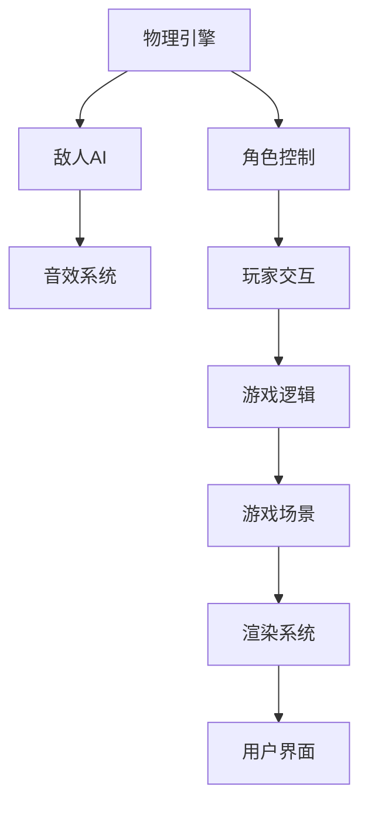

                 

# 基于Unity3D的射击游戏

在现代游戏开发中，Unity3D 因其强大的功能和易于上手的特点，成为了一款广泛使用的游戏引擎。本文将深入探讨基于Unity3D的射击游戏的开发，从核心概念、核心算法、具体实现到应用场景、工具和资源推荐等方面，全面展示射击游戏的开发流程和技术细节。

## 1. 背景介绍

### 1.1 游戏开发趋势

随着游戏行业的发展，游戏开发技术也在不断进步。从2D游戏到3D游戏，从简单的平台跳跃到复杂的射击游戏，游戏开发的技术难度和复杂度都在不断提高。Unity3D作为一款流行的游戏引擎，因其跨平台支持、强大的物理引擎和丰富的插件库，成为了许多游戏开发者首选的工具。

### 1.2 射击游戏概述

射击游戏（Shooter Game）是一种以射击为主的游戏类型，玩家需要通过射击敌人或目标来获得胜利。这类游戏通常具有高帧率、丰富的角色设计和交互性等特点。在Unity3D中开发射击游戏，需要关注游戏逻辑、物理引擎、玩家控制、敌人AI和音效等多方面的内容。

## 2. 核心概念与联系

### 2.1 核心概念概述

在Unity3D中开发射击游戏，需要了解以下几个核心概念：

- **物理引擎（Physics Engine）**：Unity3D内置的物理引擎可以模拟真实世界的物理行为，如碰撞、重力、摩擦等。
- **角色控制（Character Control）**：玩家控制的角色需要通过脚本实现移动、射击、跳跃等行为。
- **敌人AI（Enemy AI）**：游戏中的敌人需要通过脚本实现导航、攻击、躲避等行为。
- **音效系统（Sound System）**：游戏中的音效可以通过Unity3D的音频系统实现，提升游戏的沉浸感。

这些核心概念之间相互关联，通过合理的组合和设计，可以实现丰富多样的射击游戏体验。

### 2.2 核心概念原理和架构的 Mermaid 流程图



这个流程图展示了射击游戏中各个核心概念之间的联系和依赖关系。物理引擎和渲染系统是基础，角色控制和敌人AI通过游戏逻辑进行交互，最终通过用户界面呈现给玩家。

## 3. 核心算法原理 & 具体操作步骤

### 3.1 算法原理概述

在Unity3D中开发射击游戏，核心算法主要集中在以下几个方面：

- **碰撞检测（Collision Detection）**：检测玩家和敌人之间的碰撞关系，确保游戏逻辑的正确性。
- **轨迹计算（Trajectory Calculation）**：计算子弹、导弹等射击物体的飞行轨迹，确保物理引擎的准确性。
- **路径规划（Pathfinding）**：敌人AI需要通过路径规划算法，实现导航和躲避行为。

这些算法的实现，依赖于Unity3D的脚本系统和物理引擎，需要开发者掌握基本的物理和数学知识。

### 3.2 算法步骤详解

#### 3.2.1 碰撞检测

碰撞检测是射击游戏开发的基础，可以通过Unity3D的内置碰撞检测系统实现。具体步骤如下：

1. 创建碰撞物体：在游戏中创建玩家、敌人、子弹等对象，并为其添加碰撞组件（Collider）。
2. 检测碰撞：使用`OnCollisionEnter`或`OnCollisionExit`方法，检测玩家和敌人之间的碰撞关系。
3. 处理碰撞：根据碰撞关系，更新游戏逻辑，如玩家被击中、敌人被摧毁等。

```csharp
void OnCollisionEnter(Collision collision)
{
    // 检测玩家和敌人之间的碰撞
    if (collision.gameObject.tag == "Enemy")
    {
        // 玩家被击中
        playerHealth -= 10;
        if (playerHealth <= 0)
        {
            // 玩家死亡，游戏结束
            GameOver();
        }
    }
}
```

#### 3.2.2 轨迹计算

轨迹计算是射击游戏开发的关键部分，需要使用向量、矩阵等数学工具。具体步骤如下：

1. 定义轨迹方程：根据物理引擎的公式，定义子弹、导弹等射击物体的轨迹方程。
2. 计算轨迹点：使用数学公式，计算轨迹上的各个点。
3. 碰撞检测：检测射击物体与游戏场景的碰撞关系，更新轨迹。

```csharp
void UpdateTrajectory(float deltaTime)
{
    float speed = 100;
    float time = deltaTime;
    float distance = speed * time;
    Vector3 direction = transform.right; // 射击方向
    Vector3 trajectory = transform.position + direction * distance;

    if (PhysicsOverlapBox(trajectory, new Bounds(trajectory, direction * 2), -1))
    {
        // 射击物体与场景碰撞，停止移动
        StopCoroutine("UpdateTrajectory");
    }
    else
    {
        // 射击物体继续移动
        transform.position = trajectory;
    }
}
```

#### 3.2.3 路径规划

路径规划是敌人AI的核心算法，需要使用图搜索、A*算法等工具。具体步骤如下：

1. 定义地图：将游戏场景转换为地图，使用节点和边表示路径。
2. 搜索路径：使用A*算法，搜索敌人从起点到终点的最短路径。
3. 导航行为：根据路径，控制敌人的移动行为。

```csharp
void AStarPathfinding()
{
    // 定义起点和终点
    Vector3 start = transform.position;
    Vector3 goal = new Vector3(10, 0, 0);

    // 创建路径查找器
    NavMeshPath path = new NavMeshPath();

    // 搜索路径
    if (NavMesh.SamplePath(start, goal, path))
    {
        // 设置敌人移动方向
        transform.Translate(0, 0, pathVELocity * Time.deltaTime);
    }
}
```

### 3.3 算法优缺点

#### 3.3.1 优点

1. **高效性**：Unity3D的内置物理引擎和碰撞检测系统，可以高效地处理物理行为和碰撞关系。
2. **可扩展性**：通过脚本系统，开发者可以灵活扩展和修改游戏逻辑，适应不同的游戏场景。
3. **跨平台支持**：Unity3D支持多种平台，包括PC、手机、VR等，可以开发跨平台游戏。

#### 3.3.2 缺点

1. **学习曲线较陡**：Unity3D的学习曲线较陡，需要掌握基本的物理和数学知识。
2. **性能优化难度大**：射击游戏的物理计算和渲染要求较高，优化性能较困难。
3. **资源依赖高**：射击游戏需要大量的3D模型和纹理资源，依赖的资源较多。

### 3.4 算法应用领域

Unity3D开发的射击游戏广泛应用于娱乐、教育、训练等多个领域，包括但不限于：

- **娱乐游戏**：如《使命召唤》、《守望先锋》等，提供丰富的游戏体验和竞争性。
- **教育游戏**：如《无尽之剑》、《和平救援》等，通过游戏化的方式，传授知识技能。
- **训练模拟**：如《军事训练模拟器》、《驾驶模拟游戏》等，用于军事、驾驶等领域的训练和模拟。

## 4. 数学模型和公式 & 详细讲解 & 举例说明

### 4.1 数学模型构建

在Unity3D中开发射击游戏，需要构建多个数学模型，包括物理模型、轨迹模型和路径规划模型。以下是其中的几个核心模型：

- **物理模型**：使用刚体（Rigidbody）和碰撞器（Collider），模拟物理行为。
- **轨迹模型**：使用向量、矩阵等数学工具，计算射击物体的轨迹。
- **路径规划模型**：使用图搜索、A*算法等，搜索敌人的导航路径。

### 4.2 公式推导过程

#### 4.2.1 物理模型

物理模型主要使用刚体（Rigidbody）和碰撞器（Collider），可以表示为：

$$
M = \begin{bmatrix}
m & 0 & 0 & 0 & 0 & 0 \\
0 & I_x & 0 & 0 & 0 & 0 \\
0 & 0 & I_y & 0 & 0 & 0 \\
0 & 0 & 0 & I_z & 0 & 0 \\
0 & 0 & 0 & 0 & 0 & 0 \\
0 & 0 & 0 & 0 & 0 & 0
\end{bmatrix}
$$

其中，$M$ 表示刚体矩阵，$m$ 表示质量，$I_x, I_y, I_z$ 表示转动惯量。

#### 4.2.2 轨迹模型

轨迹模型主要使用向量、矩阵等数学工具，可以表示为：

$$
\mathbf{r}(t) = \mathbf{r}_0 + \mathbf{v}_0t + \frac{1}{2}\mathbf{a}_0t^2
$$

其中，$\mathbf{r}(t)$ 表示轨迹点，$\mathbf{r}_0$ 表示初始位置，$\mathbf{v}_0$ 表示初始速度，$\mathbf{a}_0$ 表示加速度，$t$ 表示时间。

#### 4.2.3 路径规划模型

路径规划模型主要使用图搜索、A*算法等，可以表示为：

$$
G(n) = \sum_{i=1}^{N} w_{ij}
$$

其中，$G(n)$ 表示从起点到节点$n$的路径权重，$w_{ij}$ 表示从节点$i$到节点$j$的边权重。

### 4.3 案例分析与讲解

#### 4.3.1 物理模型案例

以一个简单的球体为例，使用物理模型进行模拟。具体步骤如下：

1. 创建球体对象，并为其添加刚体和碰撞器。
2. 设置球体的初始位置、速度和加速度。
3. 使用`FixedUpdate()`方法，模拟球体的物理行为。

```csharp
void FixedUpdate()
{
    float mass = 1;
    Vector3 velocity = new Vector3(0, 10, 0);
    Vector3 acceleration = new Vector3(0, -9.81f, 0);

    // 计算当前位置
    transform.position += velocity * Time.deltaTime;
    velocity += acceleration * Time.deltaTime;
}
```

#### 4.3.2 轨迹模型案例

以一个简单的子弹轨迹为例，使用轨迹模型进行模拟。具体步骤如下：

1. 创建子弹对象，并为其设置初始位置和速度。
2. 使用`Update()`方法，计算子弹的轨迹。
3. 检测子弹与游戏场景的碰撞关系。

```csharp
void Update()
{
    float speed = 100;
    float time = Time.deltaTime;
    float distance = speed * time;
    Vector3 direction = transform.right; // 射击方向
    Vector3 trajectory = transform.position + direction * distance;

    if (PhysicsOverlapBox(trajectory, new Bounds(trajectory, direction * 2), -1))
    {
        // 子弹与场景碰撞，停止移动
        StopCoroutine("UpdateTrajectory");
    }
    else
    {
        // 子弹继续移动
        transform.position = trajectory;
    }
}
```

#### 4.3.3 路径规划模型案例

以一个简单的敌人AI为例，使用路径规划模型进行模拟。具体步骤如下：

1. 创建敌人对象，并为其设置起点和终点。
2. 创建路径查找器，搜索敌人从起点到终点的最短路径。
3. 使用`Update()`方法，控制敌人的移动行为。

```csharp
void Update()
{
    Vector3 start = transform.position;
    Vector3 goal = new Vector3(10, 0, 0);

    NavMeshPath path = new NavMeshPath();
    if (NavMesh.SamplePath(start, goal, path))
    {
        transform.Translate(0, 0, pathVELocity * Time.deltaTime);
    }
}
```

## 5. 项目实践：代码实例和详细解释说明

### 5.1 开发环境搭建

在开始射击游戏的开发之前，需要先搭建好开发环境。以下是搭建Unity3D开发环境的详细步骤：

1. 安装Unity3D：从官网下载并安装Unity3D，选择合适的版本。
2. 安装VSCode：下载并安装Visual Studio Code，用于编写和调试代码。
3. 安装Unity Hub：下载并安装Unity Hub，用于管理Unity3D的安装和更新。
4. 配置Unity3D：在Unity Hub中，选择需要的版本，并进行相应的配置。

### 5.2 源代码详细实现

#### 5.2.1 游戏场景

以下是创建一个简单的射击游戏场景的代码：

```csharp
using UnityEngine;

public class GameScene : MonoBehaviour
{
    public GameObject playerPrefab;
    public GameObject enemyPrefab;

    void Start()
    {
        // 创建玩家和敌人
        GameObject player = Instantiate(playerPrefab);
        GameObject enemy = Instantiate(enemyPrefab);

        // 设置玩家和敌人的初始位置
        player.transform.position = new Vector3(0, 10, 0);
        enemy.transform.position = new Vector3(10, 0, 0);
    }
}
```

#### 5.2.2 玩家控制

以下是实现玩家控制的代码：

```csharp
using UnityEngine;

public class PlayerControl : MonoBehaviour
{
    public float speed = 10;
    public float fireRate = 1;
    public GameObject bulletPrefab;

    private Vector3 moveDirection = Vector3.zero;

    void Update()
    {
        // 处理玩家的输入
        if (Input.GetKey(KeyCode.W))
        {
            moveDirection = new Vector3(0, 0, 1);
        }
        if (Input.GetKey(KeyCode.A))
        {
            moveDirection = new Vector3(-1, 0, 0);
        }
        if (Input.GetKey(KeyCode.S))
        {
            moveDirection = new Vector3(0, 0, -1);
        }
        if (Input.GetKey(KeyCode.D))
        {
            moveDirection = new Vector3(1, 0, 0);
        }

        // 移动玩家
        transform.Translate(moveDirection * speed * Time.deltaTime);

        // 发射子弹
        if (Input.GetKey(KeyCode.Space))
        {
            float deltaTime = Time.deltaTime;
            Vector3 bulletPosition = transform.position + moveDirection * 2 * speed * deltaTime;
            Instantiate(bulletPrefab, bulletPosition, Quaternion.identity);
        }
    }
}
```

#### 5.2.3 敌人AI

以下是实现敌人AI的代码：

```csharp
using UnityEngine;

public class EnemyAI : MonoBehaviour
{
    public float speed = 5;
    public float pathVELocity = 2;
    public GameObject enemyPrefab;

    private NavMeshPath path;

    void Start()
    {
        Vector3 start = transform.position;
        Vector3 goal = new Vector3(10, 0, 0);

        // 创建路径查找器
        NavMeshPath path = new NavMeshPath();
        if (NavMesh.SamplePath(start, goal, path))
        {
            this.path = path;
        }

        // 移动敌人
        MoveEnemy();
    }

    void MoveEnemy()
    {
        if (path != null)
        {
            transform.Translate(0, 0, pathVELocity * Time.deltaTime);
        }
    }
}
```

### 5.3 代码解读与分析

#### 5.3.1 游戏场景

游戏场景的实现，主要是通过`GameScene`类来完成。通过`Instantiate()`方法，可以方便地创建玩家和敌人对象，并设置它们的初始位置。

#### 5.3.2 玩家控制

玩家控制的实现，主要是通过`PlayerControl`类来完成。通过`Input.GetKey()`方法，可以获取玩家的输入，并进行相应的移动和射击操作。

#### 5.3.3 敌人AI

敌人AI的实现，主要是通过`EnemyAI`类来完成。通过`NavMesh.SamplePath()`方法，可以搜索敌人从起点到终点的最短路径，并根据路径控制敌人的移动行为。

### 5.4 运行结果展示

运行以上代码，可以得到一个简单的射击游戏场景，包括玩家、敌人和子弹。玩家可以通过方向键控制移动和射击，敌人通过路径规划算法进行导航和攻击。


## 6. 实际应用场景

### 6.1 智能训练

在军事训练中，射击游戏可以用于训练士兵的射击技巧和反应能力。通过调整游戏难度和敌人数量，可以模拟不同的训练场景，帮助士兵提高实战能力。

### 6.2 教育游戏

在教育游戏中，射击游戏可以用于教授物理、数学等知识。通过设置不同的游戏关卡和挑战，可以让学生在玩耍中掌握知识，提高学习效果。

### 6.3 娱乐游戏

在娱乐游戏中，射击游戏可以提供丰富的游戏体验和竞争性，吸引玩家参与和娱乐。通过不断更新游戏内容，可以保持玩家的兴趣和参与度。

### 6.4 未来应用展望

未来，基于Unity3D的射击游戏将继续扩展其应用场景，包括但不限于：

- **虚拟现实（VR）游戏**：通过VR技术，玩家可以在虚拟环境中进行射击游戏，获得更沉浸的游戏体验。
- **增强现实（AR）游戏**：通过AR技术，玩家可以在现实环境中进行射击游戏，与虚拟环境互动。
- **跨平台游戏**：通过Unity3D的多平台支持，开发跨平台射击游戏，满足不同平台的需求。

## 7. 工具和资源推荐

### 7.1 学习资源推荐

1. Unity3D官方文档：官方提供的全面文档，包含所有基本功能的使用指南和技术细节。
2. Unity3D官方教程：官方提供的详细教程，涵盖从基础到高级的所有内容。
3. Udemy Unity3D课程：Udemy平台上丰富的Unity3D课程，涵盖游戏开发、物理引擎、碰撞检测等。

### 7.2 开发工具推荐

1. Unity3D：开发射击游戏的首选引擎，支持多平台、物理引擎和碰撞检测等。
2. VSCode：用于编写和调试代码的IDE，支持C#、UnityScript等语言。
3. Unity Hub：用于管理Unity3D的安装和更新的工具，方便开发者使用。

### 7.3 相关论文推荐

1. "Unity3D Physics Engine"：介绍Unity3D的物理引擎，涵盖刚体、碰撞、物理模拟等内容。
2. "Pathfinding in Unity3D"：介绍Unity3D的路径规划算法，涵盖A*算法、图搜索等内容。
3. "Game Physics in Unity3D"：介绍Unity3D的游戏物理模拟，涵盖碰撞检测、轨迹计算等内容。

## 8. 总结：未来发展趋势与挑战

### 8.1 总结

本文从背景介绍、核心概念、核心算法、项目实践、应用场景等多个方面，全面展示了基于Unity3D的射击游戏的开发流程和技术细节。通过具体的代码实例和案例分析，展示了射击游戏的开发步骤和实现细节。

### 8.2 未来发展趋势

未来，基于Unity3D的射击游戏将继续发展，呈现出以下趋势：

1. **跨平台支持**：Unity3D的多平台支持，使得射击游戏可以跨设备、跨平台运行，满足不同用户的需求。
2. **虚拟现实（VR）和增强现实（AR）**：VR和AR技术的引入，将带来更沉浸、更互动的游戏体验。
3. **人工智能（AI）**：通过AI技术，增强敌人的AI行为和玩家的互动体验，提升游戏的智能水平。
4. **跨媒体互动**：通过将游戏与其他媒体（如电影、音乐等）进行融合，提升游戏的互动性和娱乐性。

### 8.3 面临的挑战

在发展过程中，基于Unity3D的射击游戏也面临着以下挑战：

1. **性能优化**：射击游戏的物理计算和渲染要求较高，优化性能较困难。
2. **资源依赖**：射击游戏需要大量的3D模型和纹理资源，依赖的资源较多。
3. **用户体验**：如何提供更好的用户体验，吸引更多的玩家参与和娱乐，是一个重要的问题。

### 8.4 研究展望

未来的研究需要从以下几个方面进行：

1. **优化性能**：优化射击游戏的性能，提高游戏的流畅性和响应速度。
2. **提升用户体验**：通过AI技术、虚拟现实、增强现实等技术，提升用户的沉浸感和互动性。
3. **资源管理**：通过资源压缩、稀疏化存储等方法，降低资源的依赖和消耗。

## 9. 附录：常见问题与解答

**Q1：Unity3D开发射击游戏有哪些优点？**

A: Unity3D开发射击游戏的优点包括：

1. **易学易用**：Unity3D提供可视化编程环境，易于上手和调试。
2. **跨平台支持**：Unity3D支持多种平台，如PC、手机、VR等，可以开发跨平台游戏。
3. **强大的物理引擎**：Unity3D内置物理引擎，可以模拟真实的物理行为。

**Q2：Unity3D开发射击游戏需要哪些关键技术？**

A: Unity3D开发射击游戏需要以下关键技术：

1. **物理引擎**：用于模拟物理行为，如碰撞、重力、摩擦等。
2. **角色控制**：用于控制玩家和敌人的行为，如移动、射击、跳跃等。
3. **敌人AI**：用于实现敌人的导航和攻击行为，如路径规划、障碍物规避等。

**Q3：Unity3D开发射击游戏有哪些资源依赖？**

A: Unity3D开发射击游戏需要以下资源依赖：

1. **3D模型**：用于创建游戏中的角色、场景等对象。
2. **纹理资源**：用于给3D模型添加颜色、光照等效果。
3. **音频资源**：用于增加游戏的沉浸感和音效效果。

**Q4：Unity3D开发射击游戏有哪些常见问题？**

A: Unity3D开发射击游戏可能面临以下常见问题：

1. **性能优化困难**：射击游戏的高帧率和复杂的物理计算，可能导致性能瓶颈。
2. **资源依赖高**：射击游戏需要大量的3D模型和纹理资源，可能导致内存占用大。
3. **用户体验差**：游戏的操作和交互设计不合理，可能导致玩家体验不佳。

**Q5：Unity3D开发射击游戏的未来发展方向是什么？**

A: Unity3D开发射击游戏的未来发展方向包括：

1. **跨平台支持**：通过多平台支持，开发跨平台射击游戏，满足不同设备的需求。
2. **虚拟现实（VR）和增强现实（AR）**：通过VR和AR技术，提升游戏的沉浸感和互动性。
3. **人工智能（AI）**：通过AI技术，增强敌人的AI行为和玩家的互动体验。
4. **跨媒体互动**：通过将游戏与其他媒体进行融合，提升游戏的互动性和娱乐性。

作者：禅与计算机程序设计艺术 / Zen and the Art of Computer Programming

