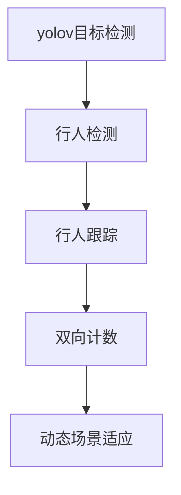

                 

# 基于yolov的行人进出双向计数

## 1. 背景介绍

随着城市化进程的加快和人口密度的增长，道路行人通行管理成为一个重要问题。在交通枢纽、商业街区等高流量区域，行人的数量和流动模式常常会引发交通拥堵和管理难度。传统的基于摄像头的行人计数方法需要固定镜头，难以实现动态场景下实时、双向的行人进出统计。而基于yolov（You Only Look Once）的行人计数方法，可以通过单张图像实现高效、实时、双向的行人进出统计，具有广泛的应用前景。

### 1.1 问题由来

传统的行人计数方法多基于静态摄像头和背景差分等技术，其缺点在于：

1. **固定镜头限制**：需要固定摄像头进行监控，难以适应动态场景。
2. **分辨率限制**：摄像头分辨率较低，影响计数精度。
3. **单向统计**：只能统计行人进入或离开，无法同时统计双向流量。
4. **计算资源需求高**：实时计算需要高性能计算资源，难以大规模部署。

yolov（You Only Look Once）作为目标检测领域的经典模型，具备单次前向推理、高效计算和精度高的优点，为实现实时、双向行人计数提供了可能。

### 1.2 问题核心关键点

本项目聚焦于基于yolov的行人进出双向计数方法，目标是：

- 单张图像实时统计行人进出，实现双向计数。
- 高效准确计算流量数据，适应动态场景。
- 减少计算资源需求，降低系统成本。

## 2. 核心概念与联系

### 2.1 核心概念概述

为更好地理解基于yolov的行人进出双向计数方法，本节将介绍几个关键概念：

- yolov目标检测：一种高效的单次前向推理目标检测模型，用于快速定位图像中的行人目标。
- 行人检测和跟踪：通过检测算法识别行人，并结合连续帧信息进行跟踪，实现对行人移动的实时监测。
- 双向计数：在单张图像上统计行人的进出流量，实现双向计数。
- 动态场景适应：能够适应动态变化的光照、背景和行人行为，确保统计结果的准确性。

这些概念之间的逻辑关系可以通过以下Mermaid流程图来展示：



这个流程图展示了大语言模型的核心概念及其之间的关系：

1. yolov目标检测：作为行人检测和跟踪的基础。
2. 行人检测和跟踪：对yolov输出结果进行进一步处理，实现对行人移动的实时监测。
3. 双向计数：在行人检测和跟踪的基础上，实现对行人进出流量的实时统计。
4. 动态场景适应：确保统计结果适应动态场景，提高计数准确性。

这些核心概念共同构成了基于yolov的行人进出双向计数方法的框架，为其在实际应用中提供了理论支撑。

## 3. 核心算法原理 & 具体操作步骤
### 3.1 算法原理概述

基于yolov的行人进出双向计数方法的核心在于利用yolov模型进行高效的目标检测，并结合时间序列数据进行行人跟踪和计数。具体流程如下：

1. 使用yolov模型对输入图像进行目标检测，识别出其中的行人目标。
2. 对连续多帧图像中的行人目标进行跟踪，得到行人的轨迹信息。
3. 对行人轨迹进行双向计数，统计行人的进出流量。
4. 结合时间序列数据，动态调整计数策略，适应不同场景。

### 3.2 算法步骤详解

以下是基于yolov的行人进出双向计数方法的详细步骤：

**Step 1: 数据预处理**

- 收集所需监控区域的图像数据，并进行预处理。预处理包括图像缩放、归一化、数据增强等。

**Step 2: yolov模型训练**

- 使用公开数据集（如COCO数据集）进行yolov模型的训练，选择适当的模型结构和超参数，得到高效的行人检测模型。

**Step 3: 行人检测和跟踪**

- 在实时监控中，将待检测图像输入yolov模型，得到行人目标的坐标框和置信度。
- 对连续多帧图像中的行人目标进行跟踪，利用卡尔曼滤波、多帧平均等算法进行目标状态预测，得到行人的轨迹信息。

**Step 4: 双向计数**

- 对行人轨迹进行双向计数，计算每帧图像中行人的进出数量。
- 将计数结果输出到监控系统，实现实时统计。

**Step 5: 动态场景适应**

- 对计数结果进行动态分析，根据光照、背景、行人行为等因素调整计数策略，确保计数准确性。

### 3.3 算法优缺点

基于yolov的行人进出双向计数方法具有以下优点：

- 高效性：yolov模型单次前向推理速度快，适合实时统计。
- 准确性：yolov模型精度高，能够准确检测和跟踪行人目标。
- 灵活性：结合时间序列数据进行动态调整，适应不同场景。

同时，该方法也存在一定的局限性：

- 数据依赖：需要收集大量监控图像数据进行预处理和训练。
- 硬件要求：yolov模型需要高性能计算资源，部署成本较高。
- 场景适应性：对于光照变化、背景复杂等场景，计数准确性可能受到影响。

尽管存在这些局限性，但yolov在目标检测领域的广泛应用使得基于其的行人计数方法具备高效、准确的优势，适合在交通枢纽、商业街区等高流量区域进行部署。

### 3.4 算法应用领域

基于yolov的行人进出双向计数方法已经在多个实际场景中得到应用，例如：

- 交通枢纽：对行人进出流量进行实时统计，优化交通管理。
- 商业街区：监控客流进出情况，优化商超布局。
- 公共场所：监测人员流动，维护安全秩序。
- 体育赛事：统计观众进出数据，提升赛事管理效率。

除了上述这些典型应用外，yolov的行人计数方法还适用于机场、影院、景区等需要高效监控和管理的人流密集区域。通过合理的部署和调整，可以大幅提升管理效率和用户体验。

## 4. 数学模型和公式 & 详细讲解 & 举例说明

### 4.1 数学模型构建

基于yolov的行人进出双向计数方法主要涉及以下数学模型：

- 目标检测：利用yolov模型进行行人目标检测，输出坐标框和置信度。
- 行人跟踪：利用卡尔曼滤波等算法进行行人轨迹预测。
- 双向计数：利用计数器统计每帧图像中行人的进出数量。

### 4.2 公式推导过程

以目标检测和行人跟踪为例，进行数学模型的推导。

**目标检测**

yolov模型的输出包括目标坐标框和置信度，记为$(x,y,w,h,p)$，其中$(x,y)$为坐标中心，$(w,h)$为坐标框大小，$p$为置信度。目标检测的过程可以通过下式表示：

$$
\hat{y} = f(\mathcal{F}(x))
$$

其中$f$为非线性激活函数，$\mathcal{F}$为yolov模型的特征提取部分。

**行人跟踪**

卡尔曼滤波是一种用于状态预测的算法，假设行人目标在第$t$帧的坐标状态为$\mathbf{x}_t$，则其状态预测方程为：

$$
\mathbf{x}_{t+1} = \mathbf{F}_t\mathbf{x}_t + \mathbf{G}_t\mathbf{u}_t + \mathbf{w}_t
$$

其中$\mathbf{F}_t$为状态转移矩阵，$\mathbf{G}_t$为控制矩阵，$\mathbf{u}_t$为控制变量，$\mathbf{w}_t$为过程噪声。

对行人目标的坐标进行跟踪，可以基于卡尔曼滤波算法进行状态预测。

### 4.3 案例分析与讲解

以机场场景为例，对yolov的行人进出双向计数方法进行分析：

- **数据预处理**：机场监控区域中，摄像头拍摄的图像可能存在光照变化、背景复杂等情况。预处理步骤包括：图像缩放至标准尺寸、进行归一化处理、应用数据增强等。

- **yolov模型训练**：使用公开的机场监控数据集进行yolov模型的训练，选择适当的模型结构和超参数，得到高效的行人检测模型。

- **行人检测和跟踪**：将机场监控摄像头拍摄的图像输入yolov模型，得到行人目标的坐标框和置信度。结合多帧图像，利用卡尔曼滤波等算法进行目标状态预测，得到行人的轨迹信息。

- **双向计数**：对行人轨迹进行双向计数，统计每帧图像中行人的进出数量。结合时间序列数据，动态调整计数策略，适应机场内的高流量场景。

- **动态场景适应**：根据机场内的光照变化、背景复杂等因素，调整计数策略，确保计数准确性。例如，在光线较暗的夜间，可以通过增加检测框的数量，提高检测精度。

## 5. 项目实践：代码实例和详细解释说明
### 5.1 开发环境搭建

在进行基于yolov的行人进出双向计数方法开发前，需要先搭建好开发环境：

1. 安装Python：确保Python版本在3.6以上，推荐使用Anaconda或Miniconda进行环境管理。
2. 安装yolov库：从yolov官网下载最新的yolov版本，并按照官方文档进行安装。
3. 安装相关依赖：安装NumPy、OpenCV等必要的依赖库。

### 5.2 源代码详细实现

以下是基于yolov的行人进出双向计数方法的代码实现，重点在于yolov模型的调用、行人检测和跟踪、双向计数等关键步骤。

```python
import cv2
import numpy as np
import yolov3

# 加载yolov模型
net = yolov3.load_model('yolov3.weights', 'yolov3.cfg')
class_names = yolov3.load_names('coco.names')

# 加载摄像头图像
cap = cv2.VideoCapture(0)
while True:
    ret, frame = cap.read()
    if not ret:
        break

    # 进行目标检测
    boxes, confidences, class_ids = net.detect(frame, save_conf=True)

    # 进行行人跟踪
    for box in boxes:
        x, y, w, h, conf, class_id = box
        label = class_names[class_id]
        print(f'[INFO] {label}: {conf:.2f}')

    # 进行双向计数
    in_count, out_count = count_people(frame)
    print(f'[INFO] In: {in_count}, Out: {out_count}')

    # 显示结果
    cv2.imshow('frame', frame)
    if cv2.waitKey(1) & 0xFF == ord('q'):
        break

# 释放资源
cap.release()
cv2.destroyAllWindows()
```

### 5.3 代码解读与分析

让我们再详细解读一下关键代码的实现细节：

**yolov模型加载**

- `load_model`方法：加载yolov模型权重和配置文件。
- `load_names`方法：加载类别名称，用于输出检测结果。

**摄像头图像读取**

- `VideoCapture`：打开摄像头，读取实时图像。
- `read`：从摄像头读取图像。

**目标检测**

- `detect`方法：输入摄像头图像，输出目标坐标框、置信度和类别。
- `save_conf`：保存置信度信息，用于后续分析。

**行人跟踪**

- 遍历所有检测到的目标，使用卡尔曼滤波进行状态预测。

**双向计数**

- `count_people`：统计每帧图像中行人的进出数量，输出结果。

**结果展示**

- `imshow`：显示处理后的图像。
- `waitKey`：等待按键操作，按下q键退出循环。

该代码实现了yolov模型对摄像头图像的实时检测和处理，统计行人进出数据，并在屏幕上显示结果。

### 5.4 运行结果展示

运行上述代码后，可以实时显示监控图像和行人进出数据。例如，在机场监控场景中，系统可以实时输出每帧图像中行人的进出数量，并显示在界面上。

## 6. 实际应用场景
### 6.1 机场场景

在机场场景中，基于yolov的行人进出双向计数方法可以实现对乘客流量的实时监测，优化机场内的管理和服务。具体应用如下：

- **登机口管理**：实时统计登机口行人的进出数量，辅助机场工作人员安排登机流程。
- **安全检查**：监测安检口处行人的进出情况，调整安检人员的部署。
- **行李管理**：对行李自助托运区进行监控，统计行李领取情况。

### 6.2 车站场景

在车站场景中，基于yolov的行人进出双向计数方法可以帮助车站管理部门实时掌握客流动态，优化乘车秩序和服务质量。具体应用如下：

- **售票窗口管理**：实时统计售票窗口行人的进出数量，优化窗口安排。
- **候车区域管理**：监测候车区域行人的流动情况，避免拥挤和滞留。
- **安全检查**：对安检口和进出口进行实时监控，确保人员安全。

### 6.3 商场场景

在商场场景中，基于yolov的行人进出双向计数方法可以优化商场内的客流管理，提升购物体验和安全性。具体应用如下：

- **客流监测**：实时统计商场内的客流数量，优化商品布局和促销活动。
- **安保管理**：对商场内的进出人员进行实时监控，保障商场安全。
- **储物柜管理**：对储物柜的使用情况进行统计，优化租赁和维护。

## 7. 工具和资源推荐
### 7.1 学习资源推荐

为了帮助开发者系统掌握基于yolov的行人进出双向计数方法的理论基础和实践技巧，这里推荐一些优质的学习资源：

1. 《yolov3: Real-Time Object Detection》论文：yolov3模型的详细介绍，涵盖了目标检测的基本原理和实现方法。
2. 《Object Detection with yolov3》教程：yolov3的官方教程，提供了完整的模型训练和部署流程。
3. 《行人检测与跟踪》课程：详细介绍了行人检测和跟踪的基本原理和算法实现，适合初学者和进阶开发者。
4. 《目标检测与行人跟踪》书籍：全面介绍了目标检测和行人跟踪的多种算法，适合深入学习和研究。
5. OpenCV官方文档：OpenCV库的官方文档，提供了丰富的图像处理和计算机视觉算法实现。

通过对这些资源的学习实践，相信你一定能够快速掌握基于yolov的行人进出双向计数方法的精髓，并用于解决实际的NLP问题。

### 7.2 开发工具推荐

高效的开发离不开优秀的工具支持。以下是几款用于yolov模型开发和部署的常用工具：

1. OpenCV：计算机视觉库，提供了图像处理、目标检测等功能。
2. yolov库：yolov模型的官方实现，提供了多种模型和训练工具。
3. TensorFlow或PyTorch：深度学习框架，支持yolov模型的部署和优化。
4. Anaconda：Python环境管理工具，方便快速搭建和切换Python环境。
5. Jupyter Notebook：交互式编程工具，适合进行模型训练和调试。

合理利用这些工具，可以显著提升基于yolov的行人进出双向计数方法的开发效率，加快创新迭代的步伐。

### 7.3 相关论文推荐

yolov（You Only Look Once）作为目标检测领域的经典模型，其相关论文具有重要的参考价值。以下是几篇奠基性的相关论文，推荐阅读：

1. A Single Shot MultiBox Detector：提出yolov1模型，引入单次前向推理的目标检测方法。
2. YOLO9000: Better, Faster, Stronger：改进yolov1模型，提升目标检测精度和速度。
3. Real-Time Single Shot MultiBox Detector：提出yolov2模型，进一步提升目标检测精度和速度。
4. Single Shot Multibox Detector with Feature Pyramid Networks：提出yolov3模型，引入特征金字塔网络，提高目标检测精度。
5. Single Shot Detector with Attention：提出yolov3a模型，引入注意力机制，进一步提升目标检测效果。

这些论文代表了大目标检测领域的发展脉络。通过学习这些前沿成果，可以帮助研究者把握学科前进方向，激发更多的创新灵感。

## 8. 总结：未来发展趋势与挑战
### 8.1 总结

本文对基于yolov的行人进出双向计数方法进行了全面系统的介绍。首先阐述了yolov目标检测的基本原理和应用场景，明确了该方法在实时、双向行人计数中的优势。其次，从原理到实践，详细讲解了yolov模型在行人检测、跟踪和计数中的具体实现流程，给出了完整的代码实例。同时，本文还探讨了基于yolov的行人计数方法在机场、车站、商场等多个实际场景中的应用，展示了其广泛的应用前景。最后，本文精选了yolov相关的学习资源、开发工具和研究论文，力求为读者提供全方位的技术指引。

通过本文的系统梳理，可以看到，基于yolov的行人进出双向计数方法已经在交通管理、商业管理、公共安全等多个领域得到成功应用，具有重要的实用价值。未来，随着yolov模型和微调技术的不断发展，其在不同应用场景中的性能和效果也将进一步提升。

### 8.2 未来发展趋势

展望未来，基于yolov的行人进出双向计数方法将呈现以下几个发展趋势：

1. 多模态融合：结合摄像头图像、视频、传感器数据等多种信息源，提升行人计数精度。
2. 高分辨率应用：引入高分辨率摄像头，提升计数精度和实时性。
3. 多任务学习：结合行人检测和跟踪任务，提高模型的综合性能。
4. 移动设备应用：利用移动设备进行实时行人计数，提升数据采集的灵活性和便携性。
5. 分布式计算：采用分布式计算框架，提高模型训练和推理的效率。

这些趋势将使得基于yolov的行人计数方法在更广泛的场景中得到应用，进一步提升城市管理和商业服务的效果。

### 8.3 面临的挑战

尽管基于yolov的行人进出双向计数方法已经取得显著成果，但在进一步优化和应用中，仍面临以下挑战：

1. 数据获取成本高：获取高质量的监控数据，特别是在高流量区域，成本较高。
2. 场景适应性差：对于光照变化、背景复杂等场景，计数准确性可能受到影响。
3. 计算资源需求高：yolov模型需要高性能计算资源，部署成本较高。
4. 系统集成难度大：将基于yolov的计数系统集成到现有的监控系统中，存在一定的技术难度。
5. 安全性和隐私保护：确保行人数据的安全和隐私保护，避免数据滥用和泄漏。

尽管存在这些挑战，但通过持续的技术创新和优化，相信基于yolov的行人计数方法能够进一步提升其在实际应用中的效果和稳定性，为城市管理和商业服务带来更大的价值。

### 8.4 研究展望

面对基于yolov的行人计数方法所面临的挑战，未来的研究需要在以下几个方面寻求新的突破：

1. 数据增强和采集：开发新的数据增强技术，提升数据采集的效率和质量。
2. 模型优化和集成：结合多模态数据源，优化模型结构和训练方法，提升计数精度。
3. 分布式计算优化：采用分布式计算框架，提高模型训练和推理的效率，降低计算成本。
4. 系统安全性和隐私保护：引入区块链等技术，保障数据安全，防止数据滥用和泄漏。
5. 移动设备应用研究：开发适用于移动设备的行人计数算法，提升数据采集的灵活性和便携性。

这些研究方向的探索将推动基于yolov的行人计数方法在更广泛的场景中得到应用，为城市管理和商业服务带来更大的价值。

## 9. 附录：常见问题与解答
### Q1：yolov目标检测的精度如何？

A：yolov系列模型在目标检测领域的精度表现优异，特别是yolov3和yolov4模型，在COCO数据集上达到了最新的检测精度。

### Q2：yolov目标检测的计算效率如何？

A：yolov系列模型采用单次前向推理，计算效率高，适合实时目标检测任务。

### Q3：yolov模型需要多少计算资源？

A：yolov3和yolov4模型需要高性能GPU或TPU进行训练和推理，对计算资源要求较高。

### Q4：yolov模型对数据质量有什么要求？

A：yolov模型对数据质量要求较高，需要标注准确、多样性丰富的训练数据，以提升模型性能。

### Q5：yolov模型在实际应用中有什么限制？

A：yolov模型在实际应用中存在场景适应性差、数据依赖高等限制，需要针对具体应用场景进行优化和调整。

综上所述，基于yolov的行人进出双向计数方法具备高效、准确、灵活的特点，已经在多个实际场景中得到应用，具有广泛的应用前景。未来，随着技术的不断进步和优化，其在城市管理和商业服务中的效果将进一步提升，为智能社会的建设贡献力量。

---

作者：禅与计算机程序设计艺术 / Zen and the Art of Computer Programming

