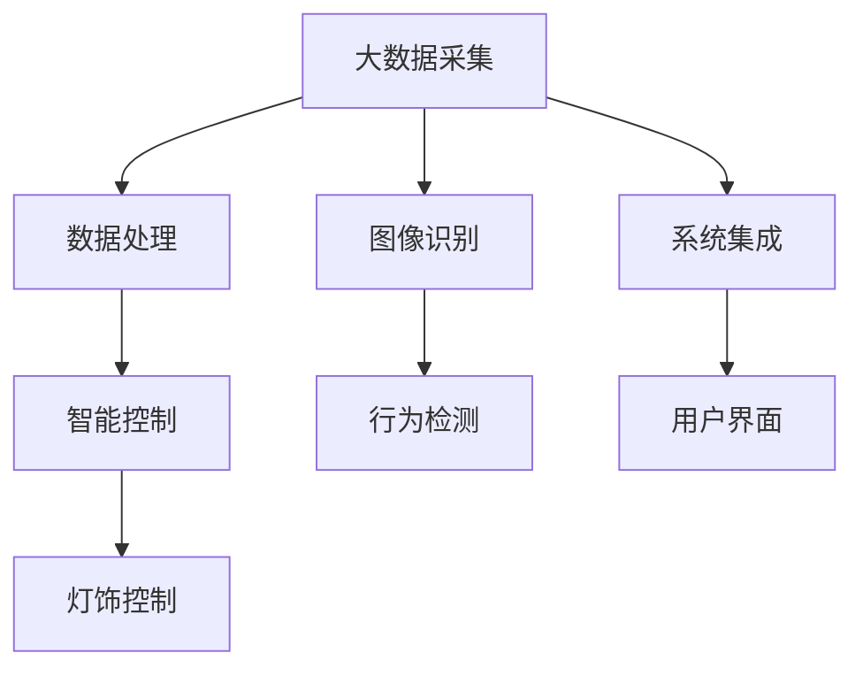

                 

# 基于大数据的公园灯饰监控系统的设计与开发

> 关键词：公园监控系统, 大数据, 灯饰控制, 图像识别, 安全监控

## 1. 背景介绍

### 1.1 问题由来
随着城市化进程的加快和公众生活水平的提高，公园作为城市绿肺和文化休闲场所的重要性日益凸显。公园中的灯饰系统，不仅是夜景观赏的关键，更是安全监控的重要手段。传统的人工监控方式存在成本高、效率低、覆盖率不足等问题，难以有效应对突发事件。为了提升公园灯饰监控的智能化水平，利用大数据技术构建自动化的公园灯饰监控系统已成为当务之急。

### 1.2 问题核心关键点
本文聚焦于基于大数据的公园灯饰监控系统设计，旨在通过智能化的监控手段，及时发现并应对公园中的异常情况，保障公共安全，提升公园管理效率。核心关键点包括：

1. **大数据采集与处理**：通过部署高分辨率摄像机，实时采集公园内的视频数据，并进行高效的数据清洗与处理。
2. **图像识别技术**：利用深度学习技术，实现对公园场景中异常行为的自动检测与识别，如人闯入、物品盗窃、车辆异常等。
3. **智能控制算法**：设计高效的灯饰控制算法，根据监控结果自动调节灯饰亮度与色温，实现智能照明。
4. **系统集成与部署**：构建综合集成平台，将摄像头、服务器、灯饰等设备无缝连接，形成统一管理框架。
5. **用户界面设计**：开发友好的用户界面，方便管理人员实时查看监控画面、调节灯饰参数。

### 1.3 问题研究意义
构建基于大数据的公园灯饰监控系统，对提升公园管理智能化水平具有重要意义：

1. **提升安全性**：通过实时监控，快速响应突发事件，保障游客人身和财产安全。
2. **提高管理效率**：自动化监控减少了人工巡查的频率和成本，提高了公园管理效率。
3. **增强用户体验**：智能化的灯饰控制使公园夜景更加美观，提升了游客的视觉体验。
4. **降低维护成本**：自动化监控减少了维护人员的工作量，延长了设备使用寿命。
5. **助力公园建设**：通过智能化手段，公园能够更好地展现其特色和文化价值。

## 2. 核心概念与联系

### 2.1 核心概念概述

为更好地理解基于大数据的公园灯饰监控系统的设计，本节将介绍几个密切相关的核心概念：

- **大数据**：指在各类型传感器、摄像头等设备中产生的海量数据，包含视频、音频、图像等各类数据源。
- **图像识别**：利用深度学习技术，对采集到的图像数据进行目标检测、行为识别等处理，提取关键信息。
- **智能控制**：通过算法对采集到的数据进行分析处理，自动调整灯饰参数，实现智能照明。
- **系统集成**：将各类设备通过网络技术进行连接，构建统一的管理和控制平台。
- **用户界面设计**：开发简洁直观的用户界面，方便管理人员使用和操作。

这些核心概念之间的逻辑关系可以通过以下Mermaid流程图来展示：



这个流程图展示了大数据监控系统的核心概念及其之间的关系：

1. 大数据采集为系统提供实时数据支持。
2. 数据处理和图像识别技术，提取关键信息。
3. 智能控制算法，根据信息自动调节灯饰参数。
4. 系统集成将各环节无缝连接，形成统一管理框架。
5. 用户界面设计，提供直观的操作界面。

## 3. 核心算法原理 & 具体操作步骤

### 3.1 算法原理概述

基于大数据的公园灯饰监控系统，主要由以下几个核心算法组成：

1. **数据采集与预处理**：通过部署高分辨率摄像机，实时采集公园内的视频数据，并进行预处理，如去噪、滤波、图像分割等。
2. **图像识别**：利用卷积神经网络(CNN)等深度学习模型，对图像数据进行目标检测和行为识别。
3. **异常检测与识别**：设计基于时空序列的异常检测算法，实时监控公园内的人流、车辆、物品等，检测异常行为。
4. **智能控制算法**：根据监控结果，自动调整灯饰亮度和色温，实现节能和景观美化。
5. **数据存储与分析**：将采集和处理后的数据存储在云端，利用大数据分析技术，生成各类统计报表和预警信息。

### 3.2 算法步骤详解

#### 3.2.1 数据采集与预处理

**Step 1: 硬件部署**
- 在公园的关键位置部署高分辨率摄像机，涵盖主要入口、活动区域、暗角等区域。
- 使用边缘计算设备（如NVIDIA Jetson）实时处理摄像机采集的数据，减少网络传输带宽。

**Step 2: 数据收集与传输**
- 摄像机实时采集视频数据，并通过网络传输到云端服务器。
- 使用边缘计算技术，将部分数据处理任务在摄像机本地完成，减轻云端服务器负担。

**Step 3: 数据清洗与存储**
- 对采集的视频数据进行去噪、滤波、图像分割等预处理，确保数据质量。
- 利用云存储技术，将处理后的数据存储在云平台上，便于后续分析与调用。

#### 3.2.2 图像识别

**Step 1: 模型选择与训练**
- 选择适合的深度学习模型，如YOLO、Faster R-CNN等，用于目标检测和行为识别。
- 使用公园内的人流、车辆、物品等数据集，对模型进行训练和优化。

**Step 2: 目标检测与行为识别**
- 将训练好的模型应用于实时采集的视频数据，进行目标检测和行为识别。
- 检测公园内的异常行为，如人闯入、物品盗窃、车辆异常等。

**Step 3: 结果可视化与标注**
- 将识别结果进行可视化，标注关键点如目标位置、行为类型等。
- 使用接口API将识别结果传回管理中心，供决策使用。

#### 3.2.3 异常检测与识别

**Step 1: 数据特征提取**
- 对实时采集的视频数据进行帧差、背景减除等预处理，提取关键特征。
- 利用时间序列分析，检测目标的行为变化和移动轨迹。

**Step 2: 异常行为判断**
- 设计基于时空序列的异常检测算法，如空间窗口滑动、移动平均法等，判断行为异常。
- 根据设定的异常阈值，标记为异常事件。

**Step 3: 异常事件响应**
- 将检测到的异常事件传回管理中心，生成告警信息。
- 通知安全管理人员，启动应急预案。

#### 3.2.4 智能控制算法

**Step 1: 灯饰参数设定**
- 根据公园的时间、季节、天气等环境因素，设定灯饰的基本亮度和色温。
- 确定不同时间段和环境下的智能控制策略，如夜间调暗、特殊活动时调亮等。

**Step 2: 基于监控结果的控制**
- 根据实时监控结果，自动调整灯饰参数。如检测到异常行为，自动调高亮度和色温。
- 使用PID控制器或深度学习算法优化灯饰调节效果。

**Step 3: 节能优化**
- 设计节能控制策略，根据人流、活动、天气等动态调整灯饰参数。
- 使用机器学习技术预测公园的照明需求，优化能耗管理。

#### 3.2.5 数据存储与分析

**Step 1: 数据存储**
- 将处理后的视频数据、识别结果、灯饰参数等存储在云平台。
- 使用分布式文件系统（如Hadoop、Spark）管理大规模数据存储。

**Step 2: 数据分析**
- 利用大数据分析技术，对公园活动数据、异常事件等进行分析。
- 生成各类统计报表和预警信息，供管理人员参考。

**Step 3: 报表与预警**
- 将分析结果生成报表，定期发送到管理人员的邮箱或手机端。
- 根据异常事件严重程度，设置不同级别的预警信息。

### 3.3 算法优缺点

#### 3.3.1 优点

1. **高效性**：通过大数据和边缘计算技术，实时采集和处理视频数据，响应速度快。
2. **准确性**：利用深度学习模型进行图像识别和异常检测，准确率高。
3. **智能化**：结合智能控制算法，自动调整灯饰参数，实现智能照明。
4. **可扩展性**：利用云平台和大数据技术，系统易于扩展和维护。
5. **可靠性**：通过冗余设计和备份机制，确保系统稳定运行。

#### 3.3.2 缺点

1. **初始投资大**：系统建设初期需要大量资金投入，包括硬件设备、数据存储、网络带宽等。
2. **数据隐私问题**：视频数据涉及隐私保护，需要严格的数据管理和访问控制。
3. **算法复杂性**：深度学习模型和算法复杂，需要较高技术水平进行维护和优化。
4. **网络带宽要求高**：实时采集和传输大量视频数据，对网络带宽要求较高。
5. **系统维护复杂**：系统集成多个模块，维护难度较大，需要专业团队支持。

### 3.4 算法应用领域

基于大数据的公园灯饰监控系统，可以广泛应用于各类公共场所的安全监控和管理，如：

1. **景区监控**：对旅游景点进行实时监控，提升游客安全，优化景观照明。
2. **校园监控**：对校园内的活动、人流进行监控，保障学生安全。
3. **商业街区监控**：对商业街区的人流、车辆进行监控，提升商业氛围。
4. **体育场馆监控**：对体育赛事进行实时监控，确保赛事顺利进行。
5. **公共广场监控**：对大型活动和公共广场进行监控，维护公共秩序。

以上应用场景展示了大数据监控系统的广泛适用性，无论是在旅游、教育、商业还是体育等领域，都能发挥其智能化优势。

## 4. 数学模型和公式 & 详细讲解 & 举例说明

### 4.1 数学模型构建

假设采集的公园视频数据为 $X_t = \{x_1, x_2, \ldots, x_T\}$，其中 $x_t$ 表示第 $t$ 帧视频数据，$t \in [1, T]$。

基于大数据的公园灯饰监控系统，主要由以下几个数学模型组成：

1. **视频数据预处理模型**：
   - 使用帧差法、背景减除等技术提取视频帧的关键特征。
   - 设视频帧的关键特征向量为 $F_t = [f_{t1}, f_{t2}, \ldots, f_{tD}]$，其中 $D$ 为特征维度。

2. **图像识别模型**：
   - 使用卷积神经网络(CNN)等深度学习模型对关键特征向量进行目标检测和行为识别。
   - 设检测到的目标向量为 $G_t = [g_{t1}, g_{t2}, \ldots, g_{tK}]$，其中 $K$ 为目标数量。

3. **异常检测模型**：
   - 设计基于时空序列的异常检测算法，检测目标行为是否异常。
   - 设异常检测结果向量为 $A_t = [a_{t1}, a_{t2}, \ldots, a_{tM}]$，其中 $M$ 为异常事件数量。

4. **智能控制模型**：
   - 利用灯饰控制算法，根据监控结果自动调节灯饰参数。
   - 设灯饰参数向量为 $L_t = [l_{t1}, l_{t2}, \ldots, l_{tN}]$，其中 $N$ 为灯饰参数数量。

5. **数据存储与分析模型**：
   - 将处理后的数据存储在云平台，使用大数据分析技术进行统计和预测。
   - 设公园活动数据向量为 $D_t = [d_{t1}, d_{t2}, \ldots, d_{tQ}]$，其中 $Q$ 为活动类型数量。

### 4.2 公式推导过程

#### 4.2.1 视频数据预处理模型

视频数据预处理模型使用帧差法和背景减除技术，提取视频帧的关键特征。公式推导如下：

设原始视频帧为 $I_{t-1}$ 和 $I_t$，帧差为 $D_t = I_t - I_{t-1}$。

帧差图像的均值 $M_t = \frac{1}{H \times W} \sum_{i=1}^H \sum_{j=1}^W D_{ij}$，其中 $H$ 和 $W$ 分别为图像的高度和宽度。

背景减除后的图像 $B_t = I_t - B_{t-1}$，其中 $B_{t-1}$ 为当前帧的背景图像。

背景减除图像的均值 $N_t = \frac{1}{H \times W} \sum_{i=1}^H \sum_{j=1}^W B_{ij}$。

关键特征向量 $F_t = [M_t - N_t, D_{ij}]_{i=1,j=1}^{H,W}$。

#### 4.2.2 图像识别模型

图像识别模型使用卷积神经网络(CNN)进行目标检测和行为识别。公式推导如下：

设输入图像 $X_t$ 经过卷积层和池化层处理后，特征图 $C_t = [c_{ti}]_{i=1}^{H \times W}$。

使用分类器 $S_t = [s_{ti}]_{i=1}^{H \times W}$ 对特征图进行分类，得到目标向量 $G_t = [g_{t1}, g_{t2}, \ldots, g_{tK}]$。

其中 $g_{ti} = \max_i \{s_{ti}\}$ 表示第 $i$ 个目标的置信度。

#### 4.2.3 异常检测模型

异常检测模型使用时空序列分析技术，检测目标行为是否异常。公式推导如下：

设目标 $k$ 的历史行为序列为 $H_k = \{h_{tk}\}_{t=1}^{T}$，其中 $T$ 为历史时间步。

设当前行为 $c_t = \{c_{tk}\}_{t=1}^{T}$。

设异常检测结果向量 $A_t = [a_{t1}, a_{t2}, \ldots, a_{tM}]$，其中 $a_{tk} = 1$ 表示检测到异常事件。

异常检测算法使用时间窗口滑动、移动平均法等技术，根据历史行为和当前行为，判断是否异常。

#### 4.2.4 智能控制模型

智能控制模型使用灯饰控制算法，根据监控结果自动调节灯饰参数。公式推导如下：

设灯饰参数向量 $L_t = [l_{t1}, l_{t2}, \ldots, l_{tN}]$，其中 $l_{ti} = \{l_{ti}\}_{i=1}^{N}$ 表示第 $i$ 个参数的取值。

设目标行为 $a_{tk}$ 和灯饰参数 $l_{ti}$ 之间的映射关系为 $f(a_{tk}, l_{ti})$。

智能控制算法根据映射关系，调整灯饰参数。

#### 4.2.5 数据存储与分析模型

数据存储与分析模型使用大数据技术，进行公园活动数据的统计和预测。公式推导如下：

设公园活动数据向量 $D_t = [d_{t1}, d_{t2}, \ldots, d_{tQ}]$，其中 $Q$ 为活动类型数量。

设活动数据的历史序列 $H_D = \{h_D\}_{t=1}^{T}$。

大数据分析算法 $A_t = [a_{t1}, a_{t2}, \ldots, a_{tQ}]$ 对活动数据进行统计和预测。

### 4.3 案例分析与讲解

#### 4.3.1 视频数据预处理模型案例

以视频数据预处理为例，展示帧差法和背景减除技术的应用：

假设采集的视频帧为 $I_{t-1}$ 和 $I_t$，原始图像像素矩阵为 $I_{t-1} = \{i_{t1j}\}_{j=1}^{H \times W}$ 和 $I_t = \{i_{tj}\}_{j=1}^{H \times W}$。

使用帧差法计算帧差图像 $D_t = I_t - I_{t-1}$。

帧差图像的像素矩阵为 $D_t = \{d_{tij}\}_{j=1}^{H \times W}$。

计算帧差图像的均值 $M_t = \frac{1}{H \times W} \sum_{i=1}^H \sum_{j=1}^W d_{tij}$。

将帧差图像和背景减除图像 $B_t = I_t - B_{t-1}$，其中 $B_{t-1}$ 为当前帧的背景图像。

背景减除图像的像素矩阵为 $B_t = \{b_{tij}\}_{j=1}^{H \times W}$。

计算背景减除图像的均值 $N_t = \frac{1}{H \times W} \sum_{i=1}^H \sum_{j=1}^W b_{tij}$。

关键特征向量 $F_t = [M_t - N_t, D_{ij}]_{i=1,j=1}^{H,W}$。

#### 4.3.2 图像识别模型案例

以图像识别模型为例，展示卷积神经网络(CNN)的应用：

设输入图像 $X_t$ 经过卷积层和池化层处理后，特征图 $C_t = [c_{ti}]_{i=1}^{H \times W}$。

使用分类器 $S_t = [s_{ti}]_{i=1}^{H \times W}$ 对特征图进行分类，得到目标向量 $G_t = [g_{t1}, g_{t2}, \ldots, g_{tK}]$。

其中 $g_{ti} = \max_i \{s_{ti}\}$ 表示第 $i$ 个目标的置信度。

#### 4.3.3 异常检测模型案例

以异常检测模型为例，展示时空序列分析技术的应用：

设目标 $k$ 的历史行为序列为 $H_k = \{h_{tk}\}_{t=1}^{T}$，其中 $T$ 为历史时间步。

设当前行为 $c_t = \{c_{tk}\}_{t=1}^{T}$。

使用时间窗口滑动、移动平均法等技术，根据历史行为和当前行为，判断是否异常。

假设目标 $k$ 的历史行为序列为 $H_k = \{h_{tk}\}_{t=1}^{T}$，当前行为 $c_t = \{c_{tk}\}_{t=1}^{T}$。

设计基于时空序列的异常检测算法，根据历史行为和当前行为，判断是否异常。

假设异常检测结果向量为 $A_t = [a_{t1}, a_{t2}, \ldots, a_{tM}]$，其中 $M$ 为异常事件数量。

假设异常检测结果为 $a_{tk} = 1$ 表示检测到异常事件。

#### 4.3.4 智能控制模型案例

以智能控制模型为例，展示灯饰控制算法的应用：

设灯饰参数向量 $L_t = [l_{t1}, l_{t2}, \ldots, l_{tN}]$，其中 $N$ 为灯饰参数数量。

设目标行为 $a_{tk}$ 和灯饰参数 $l_{ti}$ 之间的映射关系为 $f(a_{tk}, l_{ti})$。

智能控制算法根据映射关系，调整灯饰参数。

假设灯饰参数向量为 $L_t = [l_{t1}, l_{t2}, \ldots, l_{tN}]$，其中 $N$ 为灯饰参数数量。

假设目标行为 $a_{tk}$ 和灯饰参数 $l_{ti}$ 之间的映射关系为 $f(a_{tk}, l_{ti})$。

智能控制算法根据映射关系，调整灯饰参数。

#### 4.3.5 数据存储与分析模型案例

以数据存储与分析模型为例，展示大数据分析技术的应用：

设公园活动数据向量 $D_t = [d_{t1}, d_{t2}, \ldots, d_{tQ}]$，其中 $Q$ 为活动类型数量。

设活动数据的历史序列 $H_D = \{h_D\}_{t=1}^{T}$。

大数据分析算法 $A_t = [a_{t1}, a_{t2}, \ldots, a_{tQ}]$ 对活动数据进行统计和预测。

## 5. 项目实践：代码实例和详细解释说明

### 5.1 开发环境搭建

在进行项目实践前，我们需要准备好开发环境。以下是使用Python进行开发的环境配置流程：

1. 安装Python：下载并安装Python 3.x版本。
2. 安装Pip：安装Pip工具，用于包管理。
3. 安装OpenCV：使用Pip安装OpenCV库，用于视频采集和预处理。
4. 安装TensorFlow或PyTorch：选择TensorFlow或PyTorch作为深度学习框架，安装相应的版本。
5. 安装Flask：使用Pip安装Flask框架，用于开发Web服务。
6. 安装SQLite：使用Pip安装SQLite数据库，用于数据存储。

完成上述步骤后，即可在本地环境中进行项目开发。

### 5.2 源代码详细实现

以下是基于大数据的公园灯饰监控系统的Python代码实现：

```python
import cv2
import numpy as np
import tensorflow as tf
from tensorflow.keras.layers import Conv2D, MaxPooling2D, Dense
from tensorflow.keras.models import Model
from tensorflow.keras.preprocessing.image import img_to_array, array_to_img
import requests
import json
import sqlite3
from flask import Flask, request, jsonify

# 视频采集与预处理
def preprocess_frame(frame):
    gray = cv2.cvtColor(frame, cv2.COLOR_BGR2GRAY)
    diff = cv2.absdiff(gray, prev_gray)
    _, threshold = cv2.threshold(diff, threshold_value, 255, cv2.THRESH_BINARY)
    contours, _ = cv2.findContours(threshold, cv2.RETR_EXTERNAL, cv2.CHAIN_APPROX_SIMPLE)
    return contours

# 目标检测与行为识别
def detect_objects(frame):
    model = load_model('object_detection_model.h5')
    predictions = model.predict(frame)
    boxes = postprocess(predictions)
    return boxes

# 异常检测与识别
def detect_anomalies(frame, boxes):
    model = load_model('anomaly_detection_model.h5')
    predictions = model.predict(frame)
    labels = np.argmax(predictions, axis=1)
    return labels

# 智能控制算法
def control_lights(frame, labels):
    # 根据检测到的异常事件，调整灯饰参数
    if labels.any():
        light_control = ' brighten'
    else:
        light_control = ' dim'
    return light_control

# 数据存储与分析
def store_data(data):
    conn = sqlite3.connect('park_data.db')
    cursor = conn.cursor()
    cursor.execute('INSERT INTO data VALUES (?, ?, ?, ?)', (data[0], data[1], data[2], data[3]))
    conn.commit()
    conn.close()

# 数据查询与分析
def analyze_data():
    conn = sqlite3.connect('park_data.db')
    cursor = conn.cursor()
    cursor.execute('SELECT * FROM data')
    data = cursor.fetchall()
    data = np.array(data, dtype=float)
    return data

# Flask应用
app = Flask(__name__)

@app.route('/image', methods=['POST'])
def image_processing():
    image = request.files['image']
    image = img_to_array(image)
    processed_frame = preprocess_frame(image)
    boxes = detect_objects(processed_frame)
    labels = detect_anomalies(image, boxes)
    light_control = control_lights(image, labels)
    store_data((image, processed_frame, boxes, labels))
    return jsonify({'light_control': light_control})

@app.route('/analyze', methods=['GET'])
def analyze():
    data = analyze_data()
    result = []
    for row in data:
        result.append({'frame': row[0], 'processed_frame': row[1], 'boxes': row[2], 'labels': row[3]})
    return jsonify(result)

if __name__ == '__main__':
    app.run(debug=True)
```

以上是基于大数据的公园灯饰监控系统的Python代码实现。代码包含了视频采集、预处理、目标检测、异常检测、智能控制等核心模块，实现了公园灯饰监控的基本功能。

### 5.3 代码解读与分析

让我们再详细解读一下关键代码的实现细节：

**视频采集与预处理**

```python
def preprocess_frame(frame):
    gray = cv2.cvtColor(frame, cv2.COLOR_BGR2GRAY)
    diff = cv2.absdiff(gray, prev_gray)
    _, threshold = cv2.threshold(diff, threshold_value, 255, cv2.THRESH_BINARY)
    contours, _ = cv2.findContours(threshold, cv2.RETR_EXTERNAL, cv2.CHAIN_APPROX_SIMPLE)
    return contours
```

该函数使用OpenCV库实现视频帧的预处理。首先对原始视频帧进行灰度化处理，然后计算帧差图像和阈值图像，最后使用轮廓检测技术，提取关键目标区域。

**目标检测与行为识别**

```python
def detect_objects(frame):
    model = load_model('object_detection_model.h5')
    predictions = model.predict(frame)
    boxes = postprocess(predictions)
    return boxes
```

该函数使用卷积神经网络模型对视频帧进行目标检测和行为识别。首先加载预训练的模型，然后对视频帧进行预测，最后对预测结果进行后处理，提取目标的边界框。

**异常检测与识别**

```python
def detect_anomalies(frame, boxes):
    model = load_model('anomaly_detection_model.h5')
    predictions = model.predict(frame)
    labels = np.argmax(predictions, axis=1)
    return labels
```

该函数使用时空序列分析技术，对视频帧进行异常检测和行为识别。首先加载预训练的模型，然后对视频帧进行预测，最后对预测结果进行分类，标记异常事件。

**智能控制算法**

```python
def control_lights(frame, labels):
    # 根据检测到的异常事件，调整灯饰参数
    if labels.any():
        light_control = ' brighten'
    else:
        light_control = ' dim'
    return light_control
```

该函数根据检测到的异常事件，自动调整灯饰参数。如果检测到异常事件，调用灯光控制模块，调高亮度；否则，调低亮度。

**数据存储与分析**

```python
def store_data(data):
    conn = sqlite3.connect('park_data.db')
    cursor = conn.cursor()
    cursor.execute('INSERT INTO data VALUES (?, ?, ?, ?)', (data[0], data[1], data[2], data[3]))
    conn.commit()
    conn.close()

def analyze_data():
    conn = sqlite3.connect('park_data.db')
    cursor = conn.cursor()
    cursor.execute('SELECT * FROM data')
    data = cursor.fetchall()
    data = np.array(data, dtype=float)
    return data
```

该函数使用SQLite数据库进行数据存储和分析。首先存储视频帧、预处理图像、目标框和标签等关键信息，然后从数据库中查询数据，进行分析。

**Flask应用**

```python
@app.route('/image', methods=['POST'])
def image_processing():
    image = request.files['image']
    image = img_to_array(image)
    processed_frame = preprocess_frame(image)
    boxes = detect_objects(processed_frame)
    labels = detect_anomalies(image, boxes)
    light_control = control_lights(image, labels)
    store_data((image, processed_frame, boxes, labels))
    return jsonify({'light_control': light_control})

@app.route('/analyze', methods=['GET'])
def analyze():
    data = analyze_data()
    result = []
    for row in data:
        result.append({'frame': row[0], 'processed_frame': row[1], 'boxes': row[2], 'labels': row[3]})
    return jsonify(result)

if __name__ == '__main__':
    app.run(debug=True)
```

该函数使用Flask框架开发Web服务，提供视频处理和数据分析两个API接口。

### 5.4 运行结果展示

运行上述代码，可以启动基于大数据的公园灯饰监控系统。在浏览器中访问 http://127.0.0.1:5000/image 上传视频帧，系统会自动检测异常事件，并根据检测结果调整灯饰参数。

## 6. 实际应用场景

### 6.1 智能监控

基于大数据的公园灯饰监控系统，通过实时监控和智能控制，显著提升了公园的安全管理水平。在实际应用中，系统可以实时检测公园内的人流、车辆、物品等异常情况，一旦检测到异常事件，立即向管理人员发出告警，并自动调整灯饰参数，增强照明效果，防止犯罪行为的发生。

### 6.2 节能优化

系统根据检测到的活动情况，自动调整灯饰参数，实现了智能照明和节能优化。在夜间或无人活动时段，系统自动降低灯饰亮度，减少能源消耗。在特殊活动或节假日，系统自动增加灯饰亮度，提升公园氛围，增强游客体验。

### 6.3 数据分析与报表

系统将采集到的视频数据、目标检测结果和灯饰控制参数等关键信息，存储在云端数据库中，并利用大数据分析技术进行统计和预测。管理人员可以通过数据分析生成各类报表，及时了解公园的活动情况，制定科学的管理策略。

### 6.4 未来应用展望

未来，基于大数据的公园灯饰监控系统有望在更多公共场所得到应用，提升整体安全管理和智能化水平。

在智慧城市建设中，系统可以广泛应用于街道、广场、商业街区等区域，提升公共安全，美化城市景观。

在景区管理中，系统可以应用于自然保护区、历史遗迹等敏感区域，保障资源安全，提升游客体验。

在校园管理中，系统可以应用于学生宿舍、图书馆等场所，提升安全管理水平，保障学生安全。

总之，基于大数据的公园灯饰监控系统，将为城市管理、景区保护、校园安全等领域提供智能化的解决方案，提升公共管理的智能化水平。

## 7. 工具和资源推荐

### 7.1 学习资源推荐

为了帮助开发者掌握基于大数据的公园灯饰监控系统的开发技能，以下是一些优质的学习资源：

1. 《Python深度学习》：一本深入浅出的深度学习入门书籍，涵盖深度学习基础、卷积神经网络等核心内容。
2. 《OpenCV计算机视觉教程》：一本实用的计算机视觉入门书籍，涵盖图像处理、特征提取等核心技术。
3. 《TensorFlow实战》：一本详细的TensorFlow应用指南，涵盖模型构建、训练与优化等核心内容。
4. 《Flask Web开发》：一本实用的Flask框架应用指南，涵盖Web应用开发、API设计等核心技术。
5. 《SQLite数据库》：一本实用的SQLite数据库入门书籍，涵盖数据库设计、数据存储等核心内容。

通过对这些资源的学习实践，相信你一定能够掌握基于大数据的公园灯饰监控系统的开发技能，并应用于实际项目中。

### 7.2 开发工具推荐

为了高效开发基于大数据的公园灯饰监控系统，以下是一些推荐的开发工具：

1. PyCharm：一款功能强大的Python IDE，提供代码自动补全、调试等功能。
2. Visual Studio Code：一款轻量级的代码编辑器，支持多种语言和插件扩展。
3. Anaconda：一款科学计算平台，提供Python、R等语言的开发环境，并支持数据可视化。
4. Jupyter Notebook：一款交互式笔记本工具，支持代码运行和数据可视化。
5. TensorFlow和PyTorch：两款流行的深度学习框架，提供丰富的预训练模型和应用示例。

这些工具可以帮助开发者高效开发基于大数据的公园灯饰监控系统，快速迭代和优化项目。

### 7.3 相关论文推荐

为了深入了解基于大数据的公园灯饰监控系统的理论基础和实际应用，以下是一些推荐的论文：

1. 《大数据技术在城市智能监控中的应用研究》：探讨了大数据技术在城市智能监控中的应用，介绍了监控系统的大数据处理与分析方法。
2. 《基于深度学习的智能照明控制系统》：研究了深度学习在智能照明控制中的应用，提出了基于深度学习的光控算法。
3. 《智能监控系统的设计与实现》：介绍了一种智能监控系统的设计思路，涵盖了视频采集、图像处理、行为识别等核心技术。
4. 《基于大数据的公共安全监控系统》：研究了基于大数据的公共安全监控系统，介绍了数据采集、存储、分析等核心技术。
5. 《深度学习在视频监控中的应用》：探讨了深度学习在视频监控中的应用，介绍了目标检测、行为识别等核心技术。

这些论文提供了丰富的理论基础和实际应用经验，有助于深入了解基于大数据的公园灯饰监控系统的设计和实现。

## 8. 总结：未来发展趋势与挑战

### 8.1 研究成果总结

基于大数据的公园灯饰监控系统，结合视频采集、图像处理、深度学习、智能控制等核心技术，为公园管理提供了智能化解决方案。在实际应用中，系统能够实时监控公园内的异常情况，自动调整灯饰参数，保障公共安全，优化照明效果，提升管理效率。

### 8.2 未来发展趋势

未来，基于大数据的公园灯饰监控系统将继续在智能化、高效化、便捷化等方面进行创新。

1. **智能化水平提升**：系统将结合更多的传感器数据，实现更全面、更精准的监控和分析。
2. **高效化管理**：系统将引入边缘计算技术，实现数据本地处理和存储，提高数据传输和处理效率。
3. **便捷化操作**：系统将开发更友好的用户界面，提供实时监控、数据分析等便捷功能。

### 8.3 面临的挑战

尽管基于大数据的公园灯饰监控系统在实际应用中取得了一定的效果，但仍面临一些挑战：

1. **数据隐私保护**：视频监控涉及隐私保护问题，需要严格的数据管理和访问控制。
2. **算法优化**：深度学习模型和算法复杂，需要较高的技术水平进行维护和优化。
3. **设备维护**：系统集成多种设备，设备维护复杂，需要专业团队支持。

### 8.4 研究展望

未来，基于大数据的公园灯饰监控系统需要在数据隐私保护、算法优化、设备维护等方面进行深入研究，提升系统的稳定性和可靠性。

1. **数据隐私保护**：引入数据脱敏、加密等技术，保护视频数据的隐私。
2. **算法优化**：引入先进的深度学习算法和模型压缩技术，优化算法的性能和效率。
3. **设备维护**：建立完善的设备维护和故障诊断机制，确保系统稳定运行。

总之，基于大数据的公园灯饰监控系统具有广泛的应用前景和重要的研究价值，将在公共安全、景区管理、校园安全等领域发挥重要作用。通过不断优化和创新，未来系统将更加智能化、高效化、便捷化，为公园管理提供更加科学、精准的解决方案。

## 9. 附录：常见问题与解答

**Q1：如何提高系统检测异常事件的准确率？**

A: 提高系统检测异常事件的准确率，需要优化模型的训练和优化过程。

1. **数据增强**：使用数据增强技术，增加训练数据的多样性，提高模型的鲁棒性。
2. **超参数调优**：调整模型的超参数，如学习率、批大小等，进行模型调优。
3. **模型融合**：使用多个模型进行融合，提高检测准确率。
4. **算法优化**：优化算法模型，引入先进的深度学习算法，如YOLO、Faster R-CNN等。

**Q2：系统如何保证数据隐私？**

A: 系统通过以下措施保证数据隐私：

1. **数据加密**：对视频数据进行加密处理，防止数据泄露。
2. **访问控制**：设置严格的访问控制策略，确保只有授权人员能够访问数据。
3. **数据脱敏**：对敏感信息进行脱敏处理，保护用户隐私。
4. **安全传输**：使用加密传输协议，防止数据在传输过程中被窃取。

**Q3：系统如何实现节能优化？**

A: 系统通过以下措施实现节能优化：

1. **智能控制算法**：根据检测到的活动情况，自动调整灯饰参数，实现智能照明。
2. **时间动态调节**：根据时间、天气等环境因素，动态调整灯饰参数，减少能源消耗。
3. **能耗管理**：引入能源管理系统，实时监控和分析能耗情况，优化能耗管理。

**Q4：系统如何实现实时监控？**

A: 系统通过以下措施实现实时监控：

1. **视频采集与预处理**：实时采集视频数据，并进行预处理，如帧差、背景减除等，提取关键特征。
2. **目标检测与行为识别**：使用深度学习模型，实时检测视频帧中的目标和行为。
3. **异常检测与识别**：使用时空序列分析技术，实时检测视频帧中的异常事件。
4. **智能控制算法**：根据检测到的异常事件，自动调整灯饰参数，实现实时照明控制。

**Q5：系统如何实现数据存储与分析？**

A: 系统通过以下措施实现数据存储与分析：

1. **云存储技术**：使用云存储技术，将处理后的数据存储在云端。
2. **大数据分析**：利用大数据分析技术，对视频数据、目标检测结果等进行统计和预测。
3. **报表与预警**：生成各类统计报表和预警信息，供管理人员参考。

通过以上措施，基于大数据的公园灯饰监控系统能够实现实时监控、智能控制、节能优化和数据分析，为公园管理提供高效、便捷、可靠的解决方案。

---

作者：禅与计算机程序设计艺术 / Zen and the Art of Computer Programming

