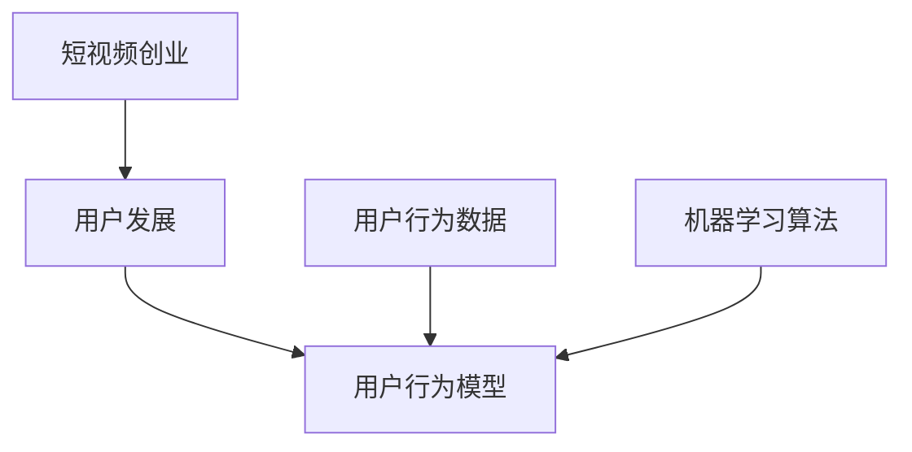

                 

# 基于大数据的短视频创业用户发展分析与研究

## 1. 背景介绍

### 1.1 问题由来

随着移动互联网的普及和5G网络的广泛部署，短视频产业迎来了爆发式增长。根据数据显示，2021年全球短视频日活跃用户已超过20亿，并且每年保持20%以上的增长。短视频不仅改变了用户的娱乐消费方式，也为许多创业者提供了新的商业机会。

短视频创业的核心在于如何高效获取用户，提升用户留存，实现用户增长。传统的用户增长模型基于历史数据和用户行为数据进行分析，但随着用户规模的扩大和市场环境的变化，单纯依靠历史数据可能无法准确预测用户发展趋势。在这种情况下，利用大数据技术和先进的算法模型进行用户发展预测显得尤为重要。

### 1.2 问题核心关键点

本文聚焦于基于大数据的短视频创业用户发展预测问题，探讨如何通过构建用户行为模型、分析用户行为数据，结合大数据技术和先进的机器学习算法，实现对用户发展的精准预测，并给出具体的策略建议。

用户发展预测的核心在于建立一个有效的用户行为模型，并根据用户的互动行为数据，通过模型预测用户未来的行为和趋势。关键问题包括：

1. 如何有效收集用户行为数据，构建用户行为模型？
2. 如何选择合适的机器学习算法，并设计合理的预测模型？
3. 如何对用户行为数据进行特征工程处理，提升预测模型的性能？
4. 如何实现预测模型的训练、验证和部署，确保预测结果的准确性和可靠性？

本文将从以上问题出发，逐一探讨这些问题，并给出解决方案。

## 2. 核心概念与联系

### 2.1 核心概念概述

为了更好地理解短视频创业用户发展预测问题，我们先介绍一些关键概念：

- **短视频创业**：指通过短视频内容创意和制作，为用户提供价值，并通过广告、商品销售等方式实现变现的创业活动。
- **用户发展**：指用户从首次使用到流失过程中各个阶段的转换概率和增长趋势。
- **用户行为数据**：包括用户观看时长、点赞、评论、分享等互动行为数据。
- **用户行为模型**：基于用户行为数据，通过机器学习模型构建的用户行为预测模型。
- **机器学习算法**：用于用户行为预测的算法模型，如回归分析、分类算法、时间序列模型等。

这些概念之间的联系可以通过以下Mermaid流程图来展示：



该流程图展示了短视频创业、用户发展、用户行为数据、用户行为模型、机器学习算法之间的逻辑关系：

1. 短视频创业带动用户发展。
2. 用户发展过程可通过用户行为模型进行预测。
3. 用户行为模型基于用户行为数据进行构建。
4. 用户行为模型利用机器学习算法进行训练和预测。

这些概念共同构成了短视频创业用户发展预测的基础框架。

## 3. 核心算法原理 & 具体操作步骤
### 3.1 算法原理概述

基于大数据的短视频创业用户发展预测问题，本质上是利用机器学习算法构建用户行为模型，并根据用户行为数据进行预测。

用户行为模型通常可以表示为：

$$
P(Y|X) = f(X; \theta)
$$

其中，$P(Y|X)$ 表示在给定用户行为数据 $X$ 下，用户未来行为 $Y$ 的概率分布；$f$ 是模型函数，$\theta$ 是模型参数。

预测过程为：

$$
\hat{Y} = \arg\max_{y} P(Y=y|X; \theta)
$$

其中，$\hat{Y}$ 为预测结果，通过最大化条件概率来获取预测值。

### 3.2 算法步骤详解

基于大数据的短视频创业用户发展预测算法一般包括以下关键步骤：

**Step 1: 数据收集与预处理**

- 收集短视频平台的用户行为数据，包括用户观看时长、点赞、评论、分享等。
- 对数据进行清洗、去重、补全等预处理，确保数据质量。
- 进行特征工程处理，提取与用户行为相关的特征变量，如用户观看时长、点赞数量、互动频率等。

**Step 2: 构建用户行为模型**

- 选择合适的机器学习算法，如回归分析、分类算法、时间序列模型等。
- 设计模型架构，包括输入层、隐藏层、输出层等。
- 训练模型，通过用户行为数据进行模型训练，得到最优模型参数 $\theta$。

**Step 3: 预测用户发展趋势**

- 将用户行为数据输入训练好的模型，进行预测。
- 根据预测结果，对用户未来的行为进行分类，如留存、流失、活跃等。
- 通过预测结果，制定针对不同用户群体的策略，如提高留存率、增加新用户等。

### 3.3 算法优缺点

基于大数据的短视频创业用户发展预测算法具有以下优点：

1. 数据驱动。基于用户行为数据进行模型构建和预测，更贴近用户实际行为。
2. 灵活性高。可以灵活选择和组合不同的机器学习算法，构建适应特定业务需求的模型。
3. 预测准确。通过大量历史数据的训练，能够精准预测用户行为。

但该方法也存在一些局限：

1. 数据依赖度高。预测结果高度依赖于用户行为数据的质量和数量，数据缺失或不准确会影响预测结果。
2. 算法复杂度高。不同机器学习算法的复杂度各异，选择和优化算法需要大量时间和计算资源。
3. 模型可解释性差。复杂的模型难以解释，难以理解模型内部的决策机制。

### 3.4 算法应用领域

基于大数据的用户发展预测算法在短视频创业领域有着广泛的应用，主要体现在以下几个方面：

1. **用户留存预测**：预测用户是否会流失，提前采取措施提升留存率。
2. **用户增长预测**：预测新用户获取效果，优化获客策略。
3. **用户行为分析**：分析用户行为趋势，优化内容推荐策略。
4. **个性化推荐**：根据用户行为预测，实现个性化推荐，提升用户体验。

## 4. 数学模型和公式 & 详细讲解 & 举例说明

### 4.1 数学模型构建

本节将使用数学语言对短视频创业用户发展预测模型进行更加严格的刻画。

假设短视频平台的用户行为数据为 $D=\{(x_i,y_i)\}_{i=1}^N$，其中 $x_i$ 为用户行为数据，$y_i$ 为用户是否流失（1表示流失，0表示未流失）。

定义用户行为模型为：

$$
P(Y|X) = f(X; \theta)
$$

其中，$f$ 为模型函数，$\theta$ 为模型参数。

假设模型函数为逻辑回归模型，其预测结果为：

$$
\hat{y}_i = \sigma(\theta^T x_i)
$$

其中，$\sigma$ 为逻辑回归函数，$\theta^T$ 为模型参数的转置。

通过最大化似然函数，得到模型参数 $\theta$：

$$
\hat{\theta} = \arg\max_{\theta} \sum_{i=1}^N \log P(y_i|x_i; \theta)
$$

## 4.2 公式推导过程

### 4.3 案例分析与讲解

假设我们已经通过历史数据训练好了用户行为模型，并得到了模型参数 $\theta$。现在我们需要对新用户进行流失预测。

对于新用户 $x_{new}$，其预测结果为：

$$
\hat{y}_{new} = \sigma(\theta^T x_{new})
$$

如果 $\hat{y}_{new} < 0.5$，则预测该用户会流失。反之，如果 $\hat{y}_{new} \geq 0.5$，则预测该用户不会流失。

## 5. 项目实践：代码实例和详细解释说明
### 5.1 开发环境搭建

在进行用户发展预测实践前，我们需要准备好开发环境。以下是使用Python进行TensorFlow开发的Python3.7环境配置流程：

1. 安装Anaconda：从官网下载并安装Anaconda，用于创建独立的Python环境。

2. 创建并激活虚拟环境：
```bash
conda create -n tf-env python=3.7 
conda activate tf-env
```

3. 安装TensorFlow：
```bash
pip install tensorflow
```

4. 安装Pandas、NumPy、Matplotlib、scikit-learn等库：
```bash
pip install pandas numpy matplotlib scikit-learn
```

完成上述步骤后，即可在`tf-env`环境中开始用户发展预测实践。

### 5.2 源代码详细实现

这里我们以用户留存预测为例，使用TensorFlow进行用户行为模型的构建和训练。

首先，定义模型：

```python
import tensorflow as tf
import numpy as np

# 定义模型函数
def build_model(input_dim, output_dim):
    model = tf.keras.Sequential([
        tf.keras.layers.Dense(64, activation='relu', input_shape=(input_dim,)),
        tf.keras.layers.Dense(64, activation='relu'),
        tf.keras.layers.Dense(output_dim, activation='sigmoid')
    ])
    return model

# 定义损失函数和优化器
def compile_model(model):
    model.compile(optimizer='adam', loss='binary_crossentropy', metrics=['accuracy'])
    return model
```

然后，加载和预处理数据：

```python
# 加载数据
train_data = np.load('train_data.npy', allow_pickle=True)
train_labels = np.load('train_labels.npy', allow_pickle=True)

# 数据预处理
X_train = train_data[:, :-1]  # 取所有特征
y_train = train_labels

# 将数据转换为TensorFlow可用的格式
X_train = tf.keras.preprocessing.sequence.pad_sequences(X_train, maxlen=1000)
y_train = tf.keras.utils.to_categorical(y_train, 2)
```

接着，训练模型：

```python
# 构建模型
model = build_model(input_dim=X_train.shape[1], output_dim=1)

# 编译模型
compile_model(model)

# 训练模型
model.fit(X_train, y_train, epochs=10, batch_size=128)
```

最后，对新用户进行预测：

```python
# 加载新用户数据
new_user_data = np.load('new_user_data.npy', allow_pickle=True)

# 将新用户数据转换为TensorFlow可用的格式
new_user_data = tf.keras.preprocessing.sequence.pad_sequences(new_user_data, maxlen=1000)

# 预测新用户是否流失
prediction = model.predict(new_user_data)
if prediction[0] < 0.5:
    print('用户会流失')
else:
    print('用户不会流失')
```

### 5.3 代码解读与分析

让我们再详细解读一下关键代码的实现细节：

**build_model函数**：
- 定义了逻辑回归模型的结构，包括输入层、隐藏层和输出层。

**compile_model函数**：
- 定义了模型的编译过程，选择了Adam优化器和二元交叉熵损失函数。

**X_train和y_train变量**：
- X_train变量表示用户行为数据的特征，y_train变量表示用户的流失标签。

**pad_sequences函数**：
- 将用户行为数据转换为序列，并进行填充，确保所有序列的长度一致。

**to_categorical函数**：
- 将标签转换为独热编码，方便模型训练。

**fit函数**：
- 对模型进行训练，指定了训练的轮数和批次大小。

**predict函数**：
- 对新用户数据进行预测，并根据预测结果输出相应的信息。

可以看到，通过TensorFlow，我们可以相对简洁地实现用户发展预测的模型构建和训练。开发者可以将更多精力放在数据处理、模型改进等高层逻辑上，而不必过多关注底层的实现细节。

## 6. 实际应用场景

### 6.1 智能广告投放

短视频平台可以利用用户发展预测算法，优化广告投放策略，提高广告投放的精准度和效果。

平台可以收集用户的观看时长、点赞、评论等行为数据，并结合用户的社交网络信息，使用机器学习模型预测用户是否会流失。如果预测用户会流失，平台可以针对性地投放广告，提升用户留存率。同时，平台还可以分析用户流失的原因，优化广告内容和投放策略，提高广告效果。

### 6.2 个性化推荐

短视频平台可以利用用户发展预测算法，提升个性化推荐的精准度，提高用户满意度。

平台可以收集用户的观看历史、点赞、评论等行为数据，并使用机器学习模型预测用户未来的行为。根据预测结果，平台可以推荐用户可能感兴趣的内容，提高用户粘性。同时，平台还可以根据用户的反馈数据，不断优化推荐算法，提升推荐效果。

### 6.3 用户行为分析

短视频平台可以利用用户发展预测算法，分析用户行为趋势，优化内容生产和分发策略。

平台可以收集用户的观看时长、点赞、评论等行为数据，并使用机器学习模型预测用户未来的行为。根据预测结果，平台可以优化内容创作策略，提升内容质量。同时，平台还可以根据用户的行为数据，优化分发策略，提高内容的曝光率和用户参与度。

## 7. 工具和资源推荐

### 7.1 学习资源推荐

为了帮助开发者系统掌握短视频创业用户发展预测的理论基础和实践技巧，这里推荐一些优质的学习资源：

1. **TensorFlow官方文档**：提供了完整的TensorFlow开发指南，包括数据预处理、模型构建、训练和预测等环节。

2. **机器学习基础教程**：由斯坦福大学机器学习课程提供，涵盖机器学习的基本概念和常用算法，适合初学者入门。

3. **深度学习与推荐系统**：由清华大学开设的MOOC课程，涵盖深度学习算法和推荐系统的相关知识，适合进阶学习。

4. **用户行为分析实践指南**：提供了用户行为分析的实际案例和算法模型，适合具有一定机器学习基础的学习者。

5. **PyTorch官方文档**：提供了PyTorch开发指南，包括模型构建、训练和预测等环节，适合深度学习开发者。

通过对这些资源的学习实践，相信你一定能够快速掌握短视频创业用户发展预测的精髓，并用于解决实际的NLP问题。

### 7.2 开发工具推荐

高效的开发离不开优秀的工具支持。以下是几款用于短视频创业用户发展预测开发的常用工具：

1. **TensorFlow**：由Google主导开发的开源深度学习框架，生产部署方便，适合大规模工程应用。

2. **PyTorch**：基于Python的开源深度学习框架，灵活动态的计算图，适合快速迭代研究。

3. **Keras**：TensorFlow的高级API，易于上手，适合初学者和研究者。

4. **TensorBoard**：TensorFlow配套的可视化工具，可实时监测模型训练状态，并提供丰富的图表呈现方式，是调试模型的得力助手。

5. **Weights & Biases**：模型训练的实验跟踪工具，可以记录和可视化模型训练过程中的各项指标，方便对比和调优。

6. **Jupyter Notebook**：交互式开发环境，方便编写和执行代码，支持多种语言和工具。

合理利用这些工具，可以显著提升短视频创业用户发展预测的开发效率，加快创新迭代的步伐。

### 7.3 相关论文推荐

短视频创业用户发展预测技术的发展源于学界的持续研究。以下是几篇奠基性的相关论文，推荐阅读：

1. **用户行为分析与预测**：提出了基于机器学习的方法，利用用户行为数据进行用户留存预测，提升了用户留存率。

2. **广告投放优化**：提出了基于用户行为数据和社交网络信息的广告投放优化策略，提高了广告投放的精准度。

3. **个性化推荐系统**：提出了基于机器学习的个性化推荐算法，提升了用户满意度和平台收益。

4. **深度学习与推荐系统**：研究了深度学习在推荐系统中的应用，提升了推荐效果的精准度。

这些论文代表了大数据和机器学习在短视频创业领域的应用方向。通过学习这些前沿成果，可以帮助研究者把握学科前进方向，激发更多的创新灵感。

## 8. 总结：未来发展趋势与挑战

### 8.1 总结

本文对基于大数据的短视频创业用户发展预测问题进行了全面系统的介绍。首先阐述了短视频创业用户发展的背景和意义，明确了用户发展预测在业务中的重要性和现实需求。其次，从原理到实践，详细讲解了机器学习算法构建用户行为模型的过程，给出了完整的代码实现，并进行了详细解读。同时，本文还探讨了机器学习算法在实际应用中的效果，给出具体的策略建议。

通过本文的系统梳理，可以看到，基于大数据的短视频创业用户发展预测方法具有很强的实用性和可操作性，能够帮助企业精准预测用户行为，制定有效的运营策略，提升用户体验和平台收益。

### 8.2 未来发展趋势

展望未来，短视频创业用户发展预测技术将呈现以下几个发展趋势：

1. **数据规模不断扩大**：随着短视频平台的用户规模不断增长，数据规模将越来越大，将为用户行为预测提供更丰富的信息源。

2. **算法模型更加复杂**：随着深度学习技术的发展，机器学习模型将更加复杂，能够更好地处理用户行为数据，提升预测准确率。

3. **实时预测成为常态**：随着云计算和大数据技术的发展，实时预测用户行为成为可能，将为用户行为预测提供更及时的信息支持。

4. **多模态数据融合**：短视频平台可以结合视频、音频、文本等多种模态数据，提升用户行为预测的准确率和鲁棒性。

5. **强化学习应用**：结合强化学习技术，能够更好地优化广告投放策略和个性化推荐系统，提升用户体验和平台收益。

以上趋势凸显了大数据和机器学习在短视频创业领域的应用潜力，将进一步提升用户行为预测的精准度和时效性。

### 8.3 面临的挑战

尽管短视频创业用户发展预测技术已经取得了不错的成绩，但在实际应用中仍面临诸多挑战：

1. **数据隐私问题**：用户行为数据的收集和使用涉及到用户的隐私问题，如何保护用户隐私，确保数据安全，是重要的研究方向。

2. **数据质量问题**：用户行为数据的质量和数量直接影响预测结果的准确性，如何提高数据质量，处理数据缺失和不一致问题，是重要的研究方向。

3. **算法可解释性问题**：复杂的机器学习模型难以解释，难以理解模型内部的决策机制，如何提高模型的可解释性，增强用户信任，是重要的研究方向。

4. **算法公平性问题**：机器学习模型容易产生偏见，如何避免模型偏见，提高算法的公平性，是重要的研究方向。

5. **算法鲁棒性问题**：机器学习模型在面对异常数据时，容易产生波动，如何提高模型的鲁棒性，确保模型稳定运行，是重要的研究方向。

6. **算法实时性问题**：用户行为预测需要实时响应，如何提高算法的实时性，确保预测结果的及时性，是重要的研究方向。

解决以上挑战，需要从数据、算法、系统等多个维度进行优化，全面提升用户行为预测的效果和可靠性。

### 8.4 研究展望

面对短视频创业用户发展预测技术面临的诸多挑战，未来的研究需要在以下几个方面寻求新的突破：

1. **数据隐私保护**：研究如何保护用户隐私，确保数据安全，提高用户信任度。

2. **数据质量提升**：研究如何提高数据质量，处理数据缺失和不一致问题，提升预测模型的性能。

3. **算法可解释性增强**：研究如何提高模型的可解释性，增强用户信任，提高用户满意度。

4. **算法公平性保障**：研究如何避免模型偏见，提高算法的公平性，确保用户平等对待。

5. **算法鲁棒性提高**：研究如何提高模型的鲁棒性，确保模型在异常数据下稳定运行。

6. **算法实时性优化**：研究如何提高算法的实时性，确保预测结果的及时性，提升用户体验。

这些研究方向将推动短视频创业用户发展预测技术的发展，带来更多的应用前景和创新可能性。

## 9. 附录：常见问题与解答

**Q1：用户行为数据如何收集和处理？**

A: 短视频平台可以利用API接口、行为日志、社交网络信息等方式收集用户行为数据。收集到的数据需要进行清洗、去重、补全等预处理，确保数据质量。同时，需要进行特征工程处理，提取与用户行为相关的特征变量，如用户观看时长、点赞数量、互动频率等。

**Q2：如何选择合适的机器学习算法？**

A: 选择合适的机器学习算法需要考虑多方面因素，如数据类型、问题类型、模型复杂度等。常用的算法包括逻辑回归、决策树、随机森林、神经网络等。在实际应用中，可以先使用简单的算法进行初步验证，再逐步优化算法模型。

**Q3：用户行为预测有哪些应用场景？**

A: 用户行为预测在短视频创业领域有着广泛的应用场景，包括用户留存预测、广告投放优化、个性化推荐等。通过用户行为预测，可以优化运营策略，提升用户体验和平台收益。

**Q4：如何提高用户行为预测的准确性？**

A: 提高用户行为预测的准确性需要从多个方面进行优化，如数据预处理、特征工程、算法选择和优化等。需要结合实际业务场景，不断迭代和优化预测模型，提升预测效果。

**Q5：如何保护用户隐私？**

A: 保护用户隐私需要从数据收集、存储、使用等多个环节进行控制。可以采用匿名化处理、数据脱敏等技术，确保用户数据的安全性和隐私性。同时，需要制定严格的数据保护政策，确保用户知情同意。

通过对这些问题的解答，相信你一定能够更好地理解短视频创业用户发展预测技术，并用于解决实际的NLP问题。

---

作者：禅与计算机程序设计艺术 / Zen and the Art of Computer Programming

