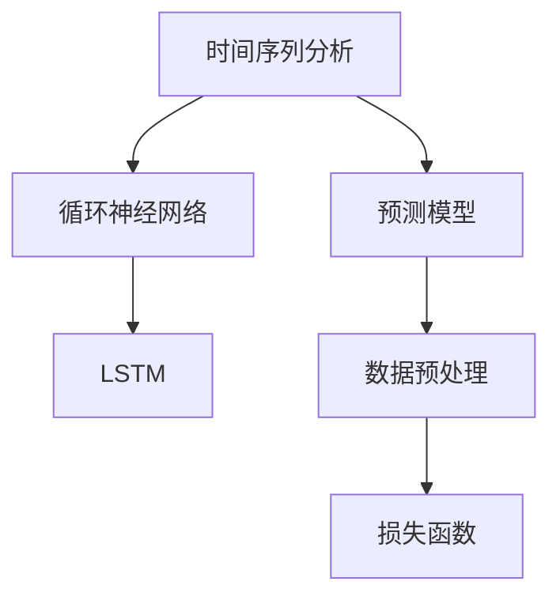

                 

## 1. 背景介绍

### 1.1 问题由来
随着电子商务的蓬勃发展，商品销量预测已成为电商平台不可或缺的核心能力。准确的销量预测不仅能够帮助商家优化库存管理、制定合理的采购计划，还能助力平台提升个性化推荐系统的效果，增加用户粘性和满意度。在日新月异的消费市场环境中，预测模型必须具备高度的灵活性和适应性，以应对多变的市场因素和复杂的用户行为。

### 1.2 问题核心关键点
商品销量预测的本质是通过历史数据，捕捉商品销售的规律，并在新的时间点上对未来的销量进行预测。其中，商品的历史销量数据包含了诸多影响因素，如季节性、促销活动、节假日、用户购买行为等。因此，建立一个高效、准确且鲁棒的预测模型，需要充分考虑这些因素，并进行合适的数据处理和模型选择。

目前，常见的商品销量预测方法包括时间序列分析、机器学习模型和深度学习模型等。其中，基于时间序列分析的预测方法，如ARIMA、Exponential Smoothing等，可以较好地处理时间依赖性，但缺点在于假设数据平稳、线性且无季节性变化。随着深度学习技术的发展，尤其是循环神经网络（RNN）和长短期记忆网络（LSTM）的引入，时间序列预测模型能够处理更为复杂的时序数据，并考虑到了更长的历史依赖关系。

### 1.3 问题研究意义
准确预测商品销量对电商平台来说意义重大，具体体现在：

1. **库存管理优化**：预测销量有助于商家及时调整库存水平，避免缺货或积压，降低成本。
2. **个性化推荐增强**：销量预测数据可以用于优化推荐算法，提升用户体验和点击率。
3. **营销策略优化**：通过销量预测，商家可以更好地规划促销活动和广告投放，提升转化率。
4. **风险管理**：预测准确性能够帮助识别潜在的市场波动和风险，以便及时调整策略。
5. **智能决策支持**：为公司高层提供基于数据支持的决策依据，优化整体运营效率。

## 2. 核心概念与联系

### 2.1 核心概念概述

为了更好地理解基于时间序列的商品销量预测方法，本节将介绍几个关键概念：

- **时间序列分析（Time Series Analysis）**：通过时间维度上的数据序列，分析数据的趋势、季节性、周期性和随机性等特征，从而预测未来的数值。
- **循环神经网络（Recurrent Neural Network, RNN）**：一种能够处理序列数据的神经网络，适用于时间序列预测问题。
- **长短期记忆网络（Long Short-Term Memory, LSTM）**：一种特殊设计的RNN，能够更好地捕捉长时序依赖关系。
- **预测模型（Predictive Modeling）**：利用历史数据，建立数学模型，对未来的未知变量进行预测。
- **数据预处理（Data Preprocessing）**：包括数据清洗、归一化、特征工程等步骤，为模型训练提供高质量的数据输入。
- **损失函数（Loss Function）**：衡量预测值与真实值之间差异的量化指标，用于模型训练的优化。

这些概念之间的关系可以通过以下Mermaid流程图来展示：



这个流程图展示了一系列相关概念之间的逻辑关系：

1. 时间序列分析作为预测模型建立的基础，提供了对历史数据的理解。
2. 基于时间序列分析的结果，可以设计出合适的循环神经网络模型。
3. 长短期记忆网络作为RNN的变种，可以更好地处理长时序依赖。
4. 预测模型利用历史数据和模型参数，对未来的数值进行预测。
5. 数据预处理是模型训练的前提，需要清洗和处理数据以确保模型训练的质量。
6. 损失函数作为模型优化的目标，指导模型参数的调整，提高预测的准确性。

## 3. 核心算法原理 & 具体操作步骤
### 3.1 算法原理概述

基于时间序列的商品销量预测，通常采用递归神经网络（RNN）或长短期记忆网络（LSTM）进行建模。这些模型的核心思想是利用历史数据中的时间依赖关系，通过神经网络的学习能力，捕捉数据中的复杂模式和规律，进而对未来的销量进行预测。

### 3.2 算法步骤详解

基于时间序列的商品销量预测算法，一般包括以下关键步骤：

**Step 1: 数据收集与预处理**
- 收集商品的历史销量数据，包括每天的销售量、节假日、促销活动、天气等影响因素。
- 对原始数据进行清洗，包括处理缺失值、异常值和重复值。
- 对数据进行归一化和标准化处理，以提高模型的收敛速度和预测性能。
- 根据时间序列的特性，划分训练集、验证集和测试集，一般以月或周为单位。

**Step 2: 模型构建**
- 选择合适的RNN或LSTM模型架构，如Unidirectional LSTM、Bidirectional LSTM等。
- 定义模型的输入和输出，输入为历史销量数据及其影响因素，输出为下一天或下一周的预测销量。
- 定义模型的损失函数，如均方误差（Mean Squared Error, MSE）、平均绝对误差（Mean Absolute Error, MAE）等，用于模型训练的优化。

**Step 3: 模型训练与验证**
- 使用训练集数据训练模型，并使用验证集数据进行模型调优和参数选择。
- 采用梯度下降等优化算法，最小化损失函数，更新模型参数。
- 使用早停法（Early Stopping）避免过拟合，当验证集误差不再下降时停止训练。

**Step 4: 模型评估与部署**
- 在测试集上评估模型性能，计算预测误差指标如MAE、MSE等。
- 调整模型参数和结构，进一步优化预测性能。
- 将训练好的模型部署到实际业务系统中，进行实时预测。
- 持续收集新数据，定期重新训练和更新模型，以适应数据分布的变化。

### 3.3 算法优缺点

基于时间序列的商品销量预测算法具有以下优点：
1. 能够处理时间依赖性，捕捉历史销量中的趋势和季节性变化。
2. 模型结构简单，易于理解和实现。
3. 可以处理多变量输入，包括历史销量、节假日、促销活动等。

同时，该算法也存在一些局限性：
1. 对异常值和噪声敏感，数据预处理较为复杂。
2. 预测精度受时间序列平稳性假设的限制，不适用于非平稳时间序列。
3. 模型训练和推理需要较长的计算时间，对计算资源要求较高。
4. 预测结果受输入数据的影响较大，模型的鲁棒性有待提升。

尽管存在这些局限性，但基于时间序列的预测方法仍然是目前商品销量预测的主流手段，广泛应用于电商平台和供应链管理等领域。

### 3.4 算法应用领域

基于时间序列的商品销量预测算法，在多个行业领域得到了广泛应用，包括：

- **电商平台**：如Amazon、阿里巴巴等，通过预测用户购买行为，优化库存管理和个性化推荐。
- **零售商**：如沃尔玛、家乐福等，利用预测模型进行库存调整和销售策略优化。
- **制造业**：如汽车、家电等，通过预测市场需求，指导生产计划和物料采购。
- **物流公司**：如UPS、顺丰等，利用预测销量优化配送路线和资源调度。
- **金融服务**：如银行、保险公司等，通过预测用户行为，优化风险管理和产品设计。

除了上述这些行业外，基于时间序列的预测方法还广泛应用于能源、交通、农业等领域，为各行各业提供数据驱动的决策支持。

## 4. 数学模型和公式 & 详细讲解  
### 4.1 数学模型构建

时间序列的商品销量预测模型，一般可以表示为：

$$
y_t = f(y_{t-1}, y_{t-2}, \dots, y_{t-n}, x_{t-1}, x_{t-2}, \dots, x_{t-m})
$$

其中，$y_t$ 表示时间$t$的预测销量，$n$ 表示历史销量的滞后长度，$x_{t-1}, x_{t-2}, \dots, x_{t-m}$ 表示影响销量的其他因素（如节假日、促销活动等），$m$ 表示输入特征的滞后长度。

### 4.2 公式推导过程

假设模型选择LSTM作为预测模型，模型的输入序列为$X_t$，其中$X_t$包含历史销量和影响因素，输出为预测销量$y_t$。

LSTM模型的结构如下：

```plaintext
input_layer
    |
    v
  embedding_layer
    |
    v
  dropout_layer
    |
    v
  LSTM_layer
    |
    v
  output_layer
    |
    v
  softmax_layer
```

其中，输入层$input_layer$负责接收原始数据，并将其转化为模型能够处理的向量表示。embedding_layer将输入数据转化为低维向量，dropout_layer用于防止过拟合，LSTM_layer捕捉时间依赖关系，output_layer输出预测值，softmax_layer用于多分类预测。

对于LSTM模型，其输出层的预测销量$y_t$可以表示为：

$$
y_t = \sigma(W_L \cdot \tanh(LSTM_{t-1} \cdot \bar{X}_t + U_L \cdot h_{t-1} + b_L)
$$

其中，$\bar{X}_t$ 表示输入$X_t$经过embedding层的输出，$h_{t-1}$ 表示上一时刻的隐藏状态，$W_L, U_L$ 和 $b_L$ 表示模型参数。

### 4.3 案例分析与讲解

以商品销量预测为例，假设数据集包含5个特征：历史销量（滞后4天）、节假日、促销活动、天气和用户行为数据。其中，节假日和促销活动为二进制特征，天气和用户行为数据为数值型特征。

假设使用LSTM模型进行预测，模型结构如下：

```plaintext
input_layer
    |
    v
  embedding_layer
    |
    v
  dropout_layer
    |
    v
  LSTM_layer
    |
    v
  output_layer
    |
    v
  softmax_layer
```

其中，$X_t$ 表示当前时刻的输入特征，包含历史销量、节假日、促销活动、天气和用户行为数据。模型的预测销量$y_t$可以表示为：

$$
y_t = \sigma(W_L \cdot \tanh(LSTM_{t-1} \cdot \bar{X}_t + U_L \cdot h_{t-1} + b_L)
$$

其中，$h_{t-1}$ 表示上一时刻的隐藏状态，$W_L, U_L$ 和 $b_L$ 表示模型参数。

## 5. 项目实践：代码实例和详细解释说明
### 5.1 开发环境搭建

在进行商品销量预测模型开发前，我们需要准备好开发环境。以下是使用Python进行TensorFlow开发的环境配置流程：

1. 安装Anaconda：从官网下载并安装Anaconda，用于创建独立的Python环境。

2. 创建并激活虚拟环境：
```bash
conda create -n tf-env python=3.8 
conda activate tf-env
```

3. 安装TensorFlow：根据CUDA版本，从官网获取对应的安装命令。例如：
```bash
conda install tensorflow
```

4. 安装相关库：
```bash
pip install numpy pandas sklearn matplotlib
```

完成上述步骤后，即可在`tf-env`环境中开始商品销量预测模型的开发。

### 5.2 源代码详细实现

下面我们以基于LSTM的商品销量预测模型为例，给出TensorFlow代码实现。

首先，定义模型类：

```python
import tensorflow as tf
from tensorflow.keras.layers import LSTM, Dense, Embedding, Dropout
from tensorflow.keras.models import Sequential

class SalesForecastModel(tf.keras.Model):
    def __init__(self, input_dim, output_dim, embedding_dim, lstm_units, dropout_rate):
        super(SalesForecastModel, self).__init__()
        self.input_dim = input_dim
        self.output_dim = output_dim
        self.embedding_dim = embedding_dim
        self.lstm_units = lstm_units
        self.dropout_rate = dropout_rate
        
        self.embedding_layer = Embedding(input_dim, embedding_dim, input_length=input_dim)
        self.dropout_layer = Dropout(dropout_rate)
        self.lstm_layer = LSTM(lstm_units, return_sequences=True)
        self.output_layer = Dense(output_dim, activation='sigmoid')

    def call(self, inputs):
        x = self.embedding_layer(inputs)
        x = self.dropout_layer(x)
        x = self.lstm_layer(x)
        x = self.output_layer(x)
        return x
```

然后，定义训练函数：

```python
def train_model(model, train_dataset, validation_dataset, batch_size, epochs, learning_rate):
    model.compile(optimizer=tf.keras.optimizers.Adam(learning_rate), loss='binary_crossentropy', metrics=['mae'])
    model.fit(train_dataset, epochs=epochs, validation_data=validation_dataset, batch_size=batch_size)
```

最后，启动训练流程：

```python
input_dim = 5
output_dim = 1
embedding_dim = 16
lstm_units = 32
dropout_rate = 0.2

# 创建数据集
train_dataset = ...
validation_dataset = ...
test_dataset = ...

# 构建模型
model = SalesForecastModel(input_dim, output_dim, embedding_dim, lstm_units, dropout_rate)

# 训练模型
train_model(model, train_dataset, validation_dataset, batch_size=32, epochs=100, learning_rate=0.001)
```

以上就是基于LSTM的商品销量预测模型的完整代码实现。可以看到，利用TensorFlow的高级API，我们可以简洁高效地构建和训练LSTM模型。

### 5.3 代码解读与分析

让我们再详细解读一下关键代码的实现细节：

**SalesForecastModel类**：
- `__init__`方法：初始化模型参数，如输入维度、输出维度、嵌入维度、LSTM层单元数和dropout率。
- `call`方法：定义模型的前向传播过程，包括嵌入层、dropout层、LSTM层和输出层的计算。

**train_model函数**：
- 使用TensorFlow的高级API，定义模型编译过程，包括优化器、损失函数和评估指标。
- 调用`fit`方法进行模型训练，指定训练集、验证集、批次大小、迭代次数和学习率。

**模型训练流程**：
- 定义模型输入和输出维度，如历史销量为5个特征，输出为1个数值。
- 创建数据集，包含历史销量、节假日、促销活动、天气和用户行为数据。
- 构建LSTM模型，指定嵌入维度、LSTM层单元数和dropout率。
- 使用`train_model`函数进行模型训练，设置批次大小、迭代次数和学习率，并评估模型在验证集上的性能。

## 6. 实际应用场景

### 6.1 电商平台

基于时间序列的商品销量预测，在电商平台中有着广泛的应用。通过预测销量，电商平台可以优化库存管理，避免缺货或积压。例如，亚马逊使用基于LSTM的预测模型，实时监控销量变化，及时调整库存和物流安排。阿里巴巴通过预测用户购买行为，优化推荐算法，提升用户满意度和转化率。

### 6.2 零售商

零售商利用预测模型进行库存调整和销售策略优化。例如，沃尔玛通过预测每日销量，合理安排商品的补货和促销活动，减少库存成本，提高销售效率。家乐福通过预测节假日销量，制定合理的促销计划，提升节日期间的销售额。

### 6.3 制造业

制造业通过预测市场需求，指导生产计划和物料采购。例如，汽车制造企业使用基于时间序列的预测模型，预测未来几天的零部件需求，优化生产流程和库存管理。家电制造企业通过预测季节性销售高峰，合理调整生产计划，减少库存积压。

### 6.4 物流公司

物流公司利用预测销量优化配送路线和资源调度。例如，UPS通过预测快递包裹的流量，合理分配运输车辆和人员，提高物流效率和客户满意度。顺丰通过预测包裹的到达时间，优化配送路线，减少运输成本和延误率。

### 6.5 金融服务

金融服务领域通过预测用户行为，优化风险管理和产品设计。例如，银行通过预测信用卡交易额，及时识别和防范欺诈行为，减少金融风险。保险公司通过预测理赔需求，优化资源配置和理赔流程，提高理赔效率和服务质量。

## 7. 工具和资源推荐

### 7.1 学习资源推荐

为了帮助开发者系统掌握时间序列预测的理论基础和实践技巧，这里推荐一些优质的学习资源：

1. 《时间序列分析》课程：由MIT开设的在线课程，详细介绍了时间序列分析的基本概念和经典模型。
2. 《深度学习》课程：由Coursera与Google合作开设的深度学习课程，涵盖了深度学习的基本原理和前沿技术。
3. 《循环神经网络》书籍：DeepMind的《Deep Learning with Python》中的一部分，介绍了循环神经网络的基本原理和应用。
4. 《TensorFlow实战》书籍：Google官方发布的TensorFlow实战书籍，提供了大量代码示例和实战经验。
5. Kaggle平台：数据科学竞赛平台，提供了大量的时间序列预测数据集和实战项目，可以边学边做。

通过对这些资源的学习实践，相信你一定能够快速掌握时间序列预测的核心思想和实践方法，并应用于实际的业务场景中。

### 7.2 开发工具推荐

高效的开发离不开优秀的工具支持。以下是几款用于时间序列预测开发的常用工具：

1. TensorFlow：由Google主导开发的深度学习框架，灵活的计算图机制，适合复杂模型的构建和训练。
2. PyTorch：由Facebook开发的高效深度学习框架，动态图机制，适合快速迭代研究。
3. Keras：基于TensorFlow的高级API，简洁易用的深度学习框架，适合快速构建模型。
4. Scikit-learn：Python科学计算库，提供了多种时间序列预测算法，适合快速实验和原型设计。
5. Weights & Biases：模型训练的实验跟踪工具，可以记录和可视化模型训练过程中的各项指标，方便对比和调优。

合理利用这些工具，可以显著提升时间序列预测任务的开发效率，加快创新迭代的步伐。

### 7.3 相关论文推荐

时间序列预测领域的研究不断涌现，以下是几篇奠基性的相关论文，推荐阅读：

1. "Proceedings of the IEEE"中的《A Survey of Recent Advances in LSTM Architectures》：详细介绍了LSTM的原理和应用。
2. "Journal of Machine Learning Research"中的《Long Short-Term Memory Recurrent Neural Networks for Large-Scale Time Series Prediction》：介绍了LSTM在大规模时间序列预测中的应用。
3. "IEEE Transactions on Neural Networks"中的《Deep Temporal Networks for Entity Resolution in Time Series Data》：介绍了深度时间网络在时间序列数据中的应用。
4. "Neurocomputing"中的《Application of Deep Temporal Networks for Cross-Seasonal Time Series Prediction》：介绍了深度时间网络在跨季节时间序列预测中的应用。

这些论文代表了大规模时间序列预测技术的发展脉络。通过学习这些前沿成果，可以帮助研究者把握学科前进方向，激发更多的创新灵感。

## 8. 总结：未来发展趋势与挑战

### 8.1 总结

本文对基于时间序列的商品销量预测方法进行了全面系统的介绍。首先阐述了时间序列预测的背景和意义，明确了预测模型在电商平台、零售商、制造业、物流公司和金融服务等多个行业中的重要应用。其次，从原理到实践，详细讲解了时间序列预测的数学模型和算法步骤，给出了预测模型的完整代码实现。同时，本文还广泛探讨了时间序列预测方法在实际业务场景中的应用案例，展示了其巨大的应用价值。

通过本文的系统梳理，可以看到，基于时间序列的商品销量预测方法，能够有效应对多变的市场因素和复杂的用户行为，帮助企业优化库存管理、制定销售策略和提升用户满意度。未来，随着深度学习技术的不断发展，时间序列预测方法将在更多行业领域得到应用，为各行各业带来变革性影响。

### 8.2 未来发展趋势

展望未来，时间序列预测技术将呈现以下几个发展趋势：

1. **深度学习应用深入**：随着深度学习技术的不断成熟，时间序列预测模型将越来越复杂，能够处理更复杂的时序数据。
2. **多模态数据融合**：将时间序列预测与其他模态数据（如图像、文本）进行融合，提升模型的预测精度和鲁棒性。
3. **自适应学习机制**：引入自适应学习机制，使模型能够根据数据分布的变化，动态调整模型结构和参数，提升模型的泛化能力。
4. **联邦学习**：通过联邦学习技术，利用多边数据进行联合训练，提升预测模型的准确性和隐私保护。
5. **实时预测**：利用流式计算技术，实现实时预测，满足实时性和响应速度要求。
6. **跨领域迁移**：将时间序列预测模型应用于多个领域，提升模型的跨领域迁移能力，避免过拟合。

以上趋势展示了时间序列预测技术的广阔前景。这些方向的探索发展，必将进一步提升时间序列预测模型的性能和应用范围，为各行各业带来更深远的变革性影响。

### 8.3 面临的挑战

尽管时间序列预测技术已经取得了显著成果，但在迈向更加智能化、普适化应用的过程中，它仍面临着诸多挑战：

1. **数据质量问题**：数据缺失、异常值、噪声等问题，对模型的训练和预测结果影响较大，需要更多的数据清洗和预处理工作。
2. **模型复杂度**：深度学习模型虽然能够处理复杂的时序数据，但模型结构复杂，训练和推理耗时较长，对计算资源要求较高。
3. **预测准确性**：时间序列预测模型的准确性受数据平稳性假设的限制，不适用于非平稳时间序列，需要更多的模型改进和创新。
4. **模型可解释性**：深度学习模型通常被视为"黑盒"系统，难以解释其内部工作机制和决策逻辑，影响模型在实际应用中的可信度。
5. **预测鲁棒性**：模型对异常值和噪声较为敏感，预测结果容易受输入数据的影响，需要更多的鲁棒性提升。

这些挑战需要研究者从数据、算法、工程和应用等多个维度进行持续改进和优化，以提升时间序列预测模型的可靠性和实用性。

### 8.4 研究展望

面对时间序列预测所面临的种种挑战，未来的研究需要在以下几个方面寻求新的突破：

1. **数据增强技术**：通过数据增强技术，扩充训练数据集，提升模型的泛化能力。
2. **模型简化与优化**：研究模型简化和优化方法，提升模型的训练效率和推理速度。
3. **跨领域迁移学习**：将时间序列预测模型应用于多个领域，提升模型的跨领域迁移能力。
4. **联邦学习与边缘计算**：利用联邦学习技术，联合多个数据源进行联合训练，提升预测模型的准确性和隐私保护。
5. **实时预测与流式计算**：利用流式计算技术，实现实时预测，满足实时性和响应速度要求。
6. **模型可解释性**：引入可解释性技术，增强模型的透明度和可信度。

这些研究方向的探索，必将引领时间序列预测技术迈向更高的台阶，为各行各业提供更加精准、可靠的预测服务。面向未来，时间序列预测技术需要与其他人工智能技术进行更深入的融合，如知识表示、因果推理、强化学习等，多路径协同发力，共同推动时间序列预测技术的进步。只有勇于创新、敢于突破，才能不断拓展时间序列预测的边界，让预测技术更好地服务于社会。

## 9. 附录：常见问题与解答

**Q1：时间序列预测的精度受哪些因素影响？**

A: 时间序列预测的精度受多种因素影响，包括：

1. 数据质量：数据缺失、异常值、噪声等问题，对模型的训练和预测结果影响较大，需要进行数据清洗和预处理。
2. 数据平稳性：预测模型假设数据平稳、线性且无季节性变化，不适用于非平稳时间序列。
3. 模型复杂度：深度学习模型虽然能够处理复杂的时序数据，但模型结构复杂，训练和推理耗时较长，对计算资源要求较高。
4. 模型参数：模型的训练过程需要调整模型参数，如学习率、批次大小、迭代次数等，需要结合具体问题进行调整。
5. 特征工程：模型的输入特征选择和处理方式，对预测精度有重要影响。

**Q2：如何评估时间序列预测模型的性能？**

A: 时间序列预测模型的性能评估一般包括以下指标：

1. 均方误差（Mean Squared Error, MSE）：预测值与真实值之间差异的平方和的平均值。
2. 平均绝对误差（Mean Absolute Error, MAE）：预测值与真实值之间差异的绝对值的平均值。
3. 均方根误差（Root Mean Squared Error, RMSE）：MSE的平方根，衡量预测值的相对误差。
4. R平方（R-squared）：衡量模型对数据的拟合程度，取值范围为0到1，值越接近1，表示拟合越好。
5. 对称平均绝对误差（Symmetric Mean Absolute Percentage Error, SMAPE）：预测值与真实值之间差异的平均百分比，用于衡量预测值的相对误差。

这些指标可以根据具体业务场景进行选择和组合，评估模型在不同时间序列预测任务上的表现。

**Q3：如何选择合适的时间序列预测模型？**

A: 选择合适的预测模型需要考虑多个因素，包括：

1. 数据特性：根据数据平稳性、周期性、季节性等特性，选择适合的预测模型，如ARIMA、Exponential Smoothing等。
2. 模型复杂度：根据数据量和计算资源，选择合适复杂度的模型，避免过拟合或欠拟合。
3. 业务需求：根据业务需求，选择合适的模型，如预测销量、预测客户流失等。
4. 预测精度：根据预测精度要求，选择适合的模型，平衡模型的复杂度和预测精度。
5. 可解释性：根据模型可解释性的需求，选择适合的模型，如深度学习模型或传统统计模型。

通过综合考虑这些因素，选择合适的时间序列预测模型，能够更好地满足业务需求，提升预测精度和可靠性。

**Q4：时间序列预测模型是否适用于所有的预测任务？**

A: 时间序列预测模型适用于大多数预测任务，特别是对时序数据有明确规律的预测问题。但对于一些非线性、非平稳的预测任务，时间序列预测模型的表现可能不如其他机器学习或深度学习模型。例如，对于股价预测等非线性问题，时间序列预测模型的表现可能不如基于梯度的模型，如长短期记忆网络（LSTM）。

**Q5：时间序列预测模型的参数调整策略是什么？**

A: 时间序列预测模型的参数调整策略一般包括以下步骤：

1. 设定初始参数：根据经验或文献，设定模型的初始参数，如学习率、批次大小、迭代次数等。
2. 训练模型：使用训练集数据训练模型，并记录训练过程中的各项指标，如损失函数、均方误差等。
3. 验证模型：使用验证集数据验证模型性能，根据验证集误差，调整模型参数。
4. 调整超参数：根据验证集误差，调整学习率、批次大小、迭代次数等超参数，避免过拟合或欠拟合。
5. 测试模型：使用测试集数据评估模型性能，确定最终的模型参数和超参数。

通过这些步骤，可以逐步优化模型参数，提升预测精度和模型性能。

总之，时间序列预测方法在实际应用中具有广泛的应用前景和重要的现实意义。随着深度学习技术的不断发展，时间序列预测模型的预测精度和可靠性将不断提升，为各行各业带来更深远的变革性影响。面向未来，时间序列预测技术需要与其他人工智能技术进行更深入的融合，共同推动预测技术的进步。只有勇于创新、敢于突破，才能不断拓展时间序列预测的边界，让预测技术更好地服务于社会。

---

作者：禅与计算机程序设计艺术 / Zen and the Art of Computer Programming

