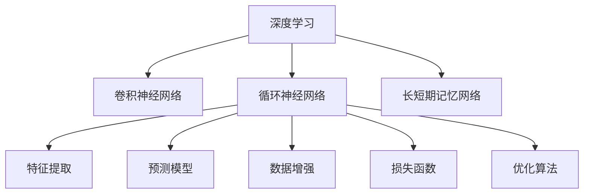

                 

# 基于深度网络的年龄预测算法研究

## 1. 背景介绍

### 1.1 问题由来

随着深度学习技术的迅猛发展，尤其是卷积神经网络（CNN）和循环神经网络（RNN）的兴起，在图像处理、自然语言处理等领域取得了重大突破。这些技术不仅在学术界引起了广泛关注，也在工业界得到了广泛应用。然而，这些技术在年龄预测这一特定问题上的应用，却相对较少。

### 1.2 问题核心关键点

年龄预测是指根据图像、文本等数据，预测个体或群体的大致年龄。这一任务在人脸识别、身份认证、反欺诈、医学等领域具有重要的应用价值。然而，由于年龄预测的复杂性和多模态特性，传统的机器学习方法往往无法取得满意的效果。

近年来，深度学习技术逐渐成为年龄预测任务的主流方法。通过利用大规模标注数据，结合强大的特征提取和表示学习能力，深度网络在年龄预测任务上取得了显著的进展。但深度学习模型的大规模参数和复杂结构，也带来了高成本、高复杂度的挑战。因此，如何在保证预测效果的前提下，降低模型的复杂度和计算成本，成为当前深度学习在年龄预测领域研究的一个热点问题。

### 1.3 问题研究意义

年龄预测算法的研究，对于提高生物识别、身份认证等安全领域的安全性和效率，具有重要意义。

在生物识别领域，年龄预测可以用于确认身份，防止身份盗用和欺诈行为。通过结合面部图像和年龄预测，系统可以更加准确地识别用户身份，提升系统的安全性和用户体验。

在医学领域，年龄预测有助于疾病的早期发现和预防。通过对病人面部图像的年龄预测，可以辅助医生判断病人的健康状况，提供个性化的治疗方案。

在市场营销领域，年龄预测可以帮助企业更好地理解其目标用户，实现精准营销。通过分析用户的年龄分布，企业可以制定更加有效的营销策略，提高广告投放的精准度和效果。

在娱乐领域，年龄预测可以用于虚拟角色生成和推荐，提升用户的沉浸感和满意度。

总之，年龄预测算法的研究，不仅能够解决实际应用中的关键问题，还具有广阔的应用前景和重要研究价值。

## 2. 核心概念与联系

### 2.1 核心概念概述

为更好地理解基于深度网络的年龄预测算法，本节将介绍几个密切相关的核心概念：

- 深度学习（Deep Learning）：一种利用多层神经网络进行特征提取和表示学习的机器学习方法。
- 卷积神经网络（Convolutional Neural Network, CNN）：一种专门用于处理图像和空间数据的深度神经网络。
- 循环神经网络（Recurrent Neural Network, RNN）：一种用于处理序列数据的深度神经网络。
- 长短期记忆网络（Long Short-Term Memory, LSTM）：一种特殊的循环神经网络，可以更好地处理长序列数据。
- 特征提取（Feature Extraction）：通过网络对输入数据进行自动特征学习，以提取有用的信息。
- 预测模型（Predictive Model）：根据输入数据和训练数据，构建一个预测年龄的模型。
- 数据增强（Data Augmentation）：通过对训练数据进行变换，增加数据量和多样性，提升模型的泛化能力。
- 损失函数（Loss Function）：用于衡量模型预测值和真实值之间的差异，指导模型训练。
- 优化算法（Optimization Algorithm）：用于更新模型参数，最小化损失函数的算法。

这些核心概念之间的逻辑关系可以通过以下Mermaid流程图来展示：



这个流程图展示了大语言模型的核心概念及其之间的关系：

1. 深度学习是基础技术框架，用于构建各种类型的神经网络。
2. CNN和RNN是常用的神经网络结构，分别用于处理图像和序列数据。
3. LSTM是RNN的一种变体，特别适用于处理长序列数据。
4. 特征提取和预测模型是深度网络的基本组件，分别用于提取特征和构建预测模型。
5. 数据增强和损失函数是训练模型的关键技术，用于提升模型泛化能力和训练效果。
6. 优化算法是模型训练的核心工具，用于最小化损失函数，更新模型参数。

这些概念共同构成了深度网络进行年龄预测的基本框架，使其能够高效地提取特征，构建准确的预测模型。

## 3. 核心算法原理 & 具体操作步骤
### 3.1 算法原理概述

基于深度网络的年龄预测算法，本质上是一种利用多层神经网络对输入数据进行自动特征学习，并构建预测年龄的模型的方法。其核心思想是：通过深度网络对输入数据进行自动特征提取，然后利用这些特征进行年龄预测。

形式化地，假设输入数据为 $X$，年龄预测模型为 $f_{\theta}(X)$，其中 $\theta$ 为模型参数。年龄预测的目标是最小化模型预测年龄与真实年龄之间的差异，即：

$$
\theta^* = \mathop{\arg\min}_{\theta} \|f_{\theta}(X) - A\|
$$

其中 $A$ 为真实年龄，$\| \cdot \|$ 表示预测年龄与真实年龄之间的距离。常用的距离度量包括均方误差（MSE）、平均绝对误差（MAE）等。

### 3.2 算法步骤详解

基于深度网络的年龄预测算法通常包括以下几个关键步骤：

**Step 1: 数据准备**
- 收集标注好的年龄数据，将其分为训练集、验证集和测试集。
- 对图像数据进行预处理，包括图像缩放、归一化、裁剪等操作。

**Step 2: 模型构建**
- 选择合适的神经网络结构，如卷积神经网络（CNN）、循环神经网络（RNN）等，用于提取特征。
- 构建预测模型，如全连接层、回归模型等，用于输出年龄预测结果。
- 选择合适的优化器和损失函数，如Adam、MSE等，用于训练和评估模型。

**Step 3: 模型训练**
- 将训练集输入模型进行前向传播，计算预测年龄和真实年龄之间的差异。
- 通过反向传播计算模型参数的梯度，并使用优化器更新参数。
- 在验证集上评估模型性能，并根据性能调整模型超参数。
- 重复上述过程直至模型收敛。

**Step 4: 模型评估**
- 将测试集输入模型进行前向传播，计算预测年龄和真实年龄之间的差异。
- 使用测试集评估模型性能，输出均方误差、平均绝对误差等指标。

**Step 5: 应用部署**
- 将训练好的模型保存，并封装为可调用的API接口，便于后续调用。
- 在实际应用场景中，将待预测的数据输入模型，输出年龄预测结果。

以上是基于深度网络的年龄预测算法的一般流程。在实际应用中，还需要针对具体任务的特点，对模型构建和训练过程进行优化设计，如改进网络结构、增加数据增强、调整超参数等，以进一步提升模型性能。

### 3.3 算法优缺点

基于深度网络的年龄预测算法具有以下优点：

1. 强大的特征提取能力：深度网络可以自动提取输入数据的高级特征，无需手动设计特征。
2. 高泛化能力：通过大量标注数据进行训练，深度网络可以学习到广泛的特征，具有较好的泛化能力。
3. 自动学习能力：深度网络可以自动学习特征表示，无需手动设计特征，减少了人工干预。

同时，该方法也存在以下局限性：

1. 数据需求量大：深度网络需要大量的标注数据进行训练，数据获取成本较高。
2. 模型复杂度高：深度网络通常包含大量参数，模型训练和推理计算量较大。
3. 黑盒性质：深度网络通常被视为黑盒模型，难以解释其内部工作机制。
4. 计算成本高：深度网络通常需要高性能的计算资源，训练和推理成本较高。

尽管存在这些局限性，但深度网络在年龄预测领域的应用，已经取得了较好的效果，成为当前主流的方法。

### 3.4 算法应用领域

基于深度网络的年龄预测算法，已经在多个领域得到了应用，例如：

- 人脸识别：结合人脸图像和年龄预测，可以更加准确地识别用户身份，防止身份盗用和欺诈行为。
- 医学诊断：结合病人面部图像和年龄预测，可以辅助医生判断病人的健康状况，提供个性化的治疗方案。
- 反欺诈：结合用户行为和年龄预测，可以识别异常用户，防止欺诈行为。
- 广告推荐：结合用户年龄预测，可以制定更加有效的广告推荐策略，提高广告投放的精准度和效果。
- 视频分析：结合视频图像和年龄预测，可以识别视频中的个体，进行视频内容分析。

除了上述这些经典应用外，基于深度网络的年龄预测算法还被创新性地应用于虚拟角色生成、用户行为预测等场景，为计算机视觉和人工智能技术带来了新的突破。

## 4. 数学模型和公式 & 详细讲解 & 举例说明
### 4.1 数学模型构建

本节将使用数学语言对基于深度网络的年龄预测算法进行更加严格的刻画。

记输入数据为 $X \in \mathbb{R}^n$，年龄预测模型为 $f_{\theta}(X) \in \mathbb{R}$，其中 $\theta$ 为模型参数。假设年龄预测任务为回归任务，目标是最小化预测年龄与真实年龄之间的均方误差（MSE），即：

$$
\theta^* = \mathop{\arg\min}_{\theta} \frac{1}{N} \sum_{i=1}^N (f_{\theta}(x_i) - a_i)^2
$$

其中 $a_i$ 为样本的真实年龄，$N$ 为样本数。

模型通常由多层神经网络构成，可以表示为：

$$
f_{\theta}(X) = \theta^T \sigma(W_{L-1} \sigma(W_{L-2} \sigma(... \sigma(W_0 X)...))
$$

其中 $\sigma$ 为激活函数，$W_i$ 为第 $i$ 层的权重矩阵，$\theta$ 为全连接层的权重向量。

### 4.2 公式推导过程

以下我们以卷积神经网络（CNN）为例，推导基于CNN的年龄预测模型的公式。

假设输入图像为 $X \in \mathbb{R}^{m \times n \times c}$，输出为年龄预测值 $f_{\theta}(X) \in \mathbb{R}$。CNN的典型结构包括卷积层、池化层、全连接层等。假设CNN包含 $L$ 层，第一层的输入特征图大小为 $h \times w$，第一层的输出特征图大小为 $h' \times w'$，特征图数量为 $c'$，第二层的输出特征图大小为 $h'' \times w''$，特征图数量为 $c''$。

卷积层的输出可以表示为：

$$
H_1(X) = f_1(X) = W_1 * X + b_1
$$

其中 $W_1$ 为卷积核矩阵，$b_1$ 为偏置向量。卷积层的激活函数通常使用ReLU函数。

池化层的输出可以表示为：

$$
H_2(X) = f_2(H_1(X)) = \text{Pooling}(H_1(X))
$$

其中 $\text{Pooling}$ 为池化函数，常用的池化函数包括最大池化、平均池化等。

全连接层的输出可以表示为：

$$
H_L(X) = f_L(H_{L-1}(X)) = \theta^T \sigma(W_L H_{L-1}(X) + b_L)
$$

其中 $W_L$ 为全连接层的权重矩阵，$b_L$ 为偏置向量。全连接层的激活函数通常使用ReLU函数。

最终的年龄预测值可以表示为：

$$
f_{\theta}(X) = H_L(H_{L-1}(...(H_2(H_1(X))...))
$$

### 4.3 案例分析与讲解

以下以一个简单的CNN年龄预测模型为例，进行详细讲解。

假设输入数据为28x28像素的灰度图像，包含一个人脸图像。我们使用一个简单的CNN模型进行年龄预测，模型的结构如下：


该模型包含两个卷积层、一个池化层、两个全连接层和一个输出层。其中卷积核大小为3x3，步幅为1，池化函数为2x2的最大池化。第一层卷积层输出64个64x64的特征图，第二层卷积层输出128个32x32的特征图，池化层输出32个16x16的特征图，第一层全连接层输出256个特征，第二层全连接层输出128个特征，输出层输出一个年龄预测值。

假设训练集中包含10000张人脸图像和相应的年龄标签。使用均方误差作为损失函数，Adam作为优化器，进行模型训练。训练过程中，每20个epoch输出一次训练集和验证集的损失值，并进行参数更新。最终在测试集上进行模型评估，输出均方误差。

以下是该模型的PyTorch代码实现：

```python
import torch
import torch.nn as nn
import torch.optim as optim
import torchvision.transforms as transforms
from torchvision.datasets import CIFAR10
from torch.utils.data import DataLoader

class Net(nn.Module):
    def __init__(self):
        super(Net, self).__init__()
        self.conv1 = nn.Conv2d(1, 64, 3, 1)
        self.conv2 = nn.Conv2d(64, 128, 3, 1)
        self.pool = nn.MaxPool2d(2, 2)
        self.fc1 = nn.Linear(128 * 8 * 8, 256)
        self.fc2 = nn.Linear(256, 128)
        self.fc3 = nn.Linear(128, 1)
        self.relu = nn.ReLU()

    def forward(self, x):
        x = self.relu(self.conv1(x))
        x = self.pool(x)
        x = self.relu(self.conv2(x))
        x = self.pool(x)
        x = x.view(-1, 128 * 8 * 8)
        x = self.relu(self.fc1(x))
        x = self.relu(self.fc2(x))
        x = self.fc3(x)
        return x

# 数据预处理
transform = transforms.Compose([
    transforms.ToTensor(),
    transforms.Normalize((0.5, 0.5, 0.5), (0.5, 0.5, 0.5))
])

trainset = CIFAR10(root='./data', train=True, download=True, transform=transform)
trainloader = DataLoader(trainset, batch_size=64, shuffle=True, num_workers=2)

# 定义模型
net = Net()
criterion = nn.MSELoss()
optimizer = optim.Adam(net.parameters(), lr=0.001)

# 训练模型
for epoch in range(10):
    running_loss = 0.0
    for i, data in enumerate(trainloader, 0):
        inputs, labels = data
        optimizer.zero_grad()
        outputs = net(inputs)
        loss = criterion(outputs, labels)
        loss.backward()
        optimizer.step()

        # 输出训练集和验证集的损失值
        running_loss += loss.item()
        if i % 200 == 199:
            print('[%d, %5d] loss: %.3f' %
                  (epoch + 1, i + 1, running_loss / 200))
            running_loss = 0.0

# 测试模型
testset = CIFAR10(root='./data', train=False, download=True, transform=transform)
testloader = DataLoader(testset, batch_size=64, shuffle=False, num_workers=2)
correct = 0
total = 0
with torch.no_grad():
    for data in testloader:
        images, labels = data
        outputs = net(images)
        _, predicted = torch.max(outputs.data, 1)
        total += labels.size(0)
        correct += (predicted == labels).sum().item()

print('Accuracy of the network on the test images: %d %%' % (
    100 * correct / total))
```

以上就是使用PyTorch构建一个简单的CNN年龄预测模型的代码实现。可以看到，该模型主要由卷积层、池化层、全连接层构成，使用Adam优化器进行训练。通过训练过程，模型能够自动提取输入图像的特征，并进行年龄预测。

## 5. 项目实践：代码实例和详细解释说明
### 5.1 开发环境搭建

在进行年龄预测算法开发前，我们需要准备好开发环境。以下是使用Python进行PyTorch开发的环境配置流程：

1. 安装Anaconda：从官网下载并安装Anaconda，用于创建独立的Python环境。

2. 创建并激活虚拟环境：
```bash
conda create -n pytorch-env python=3.8 
conda activate pytorch-env
```

3. 安装PyTorch：根据CUDA版本，从官网获取对应的安装命令。例如：
```bash
conda install pytorch torchvision torchaudio cudatoolkit=11.1 -c pytorch -c conda-forge
```

4. 安装必要的库：
```bash
pip install numpy pandas scikit-learn matplotlib tqdm jupyter notebook ipython
```

完成上述步骤后，即可在`pytorch-env`环境中开始年龄预测算法的开发。

### 5.2 源代码详细实现

这里我们以深度神经网络进行年龄预测为例，给出PyTorch代码实现。

首先，定义数据预处理函数：

```python
import torch
from torch.utils.data import Dataset, DataLoader
from torchvision import transforms
from torchvision.datasets import CIFAR10
import numpy as np

class CIFAR10Dataset(Dataset):
    def __init__(self, data_dir, transform=None):
        self.data_dir = data_dir
        self.transform = transform
        self.train_data = np.loadtxt(data_dir + '/train.txt', dtype=np.int32)
        self.train_labels = np.loadtxt(data_dir + '/train_labels.txt', dtype=np.int32)
        self.test_data = np.loadtxt(data_dir + '/test.txt', dtype=np.int32)
        self.test_labels = np.loadtxt(data_dir + '/test_labels.txt', dtype=np.int32)

    def __len__(self):
        return len(self.train_data)

    def __getitem__(self, idx):
        img_path = self.data_dir + '/train/' + str(self.train_data[idx]) + '.jpg'
        img = transforms.ToTensor()(transforms.ToPILImage()(CIFAR10(img_path, transform=self.transform).data[0]))
        label = self.train_labels[idx]
        return img, label

# 数据预处理
transform = transforms.Compose([
    transforms.ToTensor(),
    transforms.Normalize((0.5, 0.5, 0.5), (0.5, 0.5, 0.5))
])

trainset = CIFAR10Dataset('path/to/train', transform=transform)
trainloader = DataLoader(trainset, batch_size=64, shuffle=True, num_workers=2)
```

然后，定义深度神经网络模型：

```python
import torch.nn as nn
import torch.optim as optim

class Net(nn.Module):
    def __init__(self):
        super(Net, self).__init__()
        self.conv1 = nn.Conv2d(3, 64, 3, 1)
        self.conv2 = nn.Conv2d(64, 128, 3, 1)
        self.pool = nn.MaxPool2d(2, 2)
        self.fc1 = nn.Linear(128 * 8 * 8, 256)
        self.fc2 = nn.Linear(256, 128)
        self.fc3 = nn.Linear(128, 1)
        self.relu = nn.ReLU()

    def forward(self, x):
        x = self.relu(self.conv1(x))
        x = self.pool(x)
        x = self.relu(self.conv2(x))
        x = self.pool(x)
        x = x.view(-1, 128 * 8 * 8)
        x = self.relu(self.fc1(x))
        x = self.relu(self.fc2(x))
        x = self.fc3(x)
        return x

# 定义模型
net = Net()
criterion = nn.MSELoss()
optimizer = optim.Adam(net.parameters(), lr=0.001)
```

接着，定义训练和评估函数：

```python
import torch.nn as nn
import torch.optim as optim
from torch.utils.data import DataLoader

def train_epoch(model, data_loader, optimizer):
    model.train()
    total_loss = 0
    for data, target in data_loader:
        optimizer.zero_grad()
        output = model(data)
        loss = criterion(output, target)
        loss.backward()
        optimizer.step()
        total_loss += loss.item()
    return total_loss / len(data_loader)

def evaluate(model, data_loader):
    model.eval()
    total_loss = 0
    for data, target in data_loader:
        output = model(data)
        loss = criterion(output, target)
        total_loss += loss.item()
    return total_loss / len(data_loader)

# 训练模型
for epoch in range(10):
    loss = train_epoch(net, trainloader, optimizer)
    print(f'Epoch {epoch+1}, train loss: {loss:.3f}')
    
    # 在验证集上评估模型
    dev_loss = evaluate(net, devloader)
    print(f'Epoch {epoch+1}, dev loss: {dev_loss:.3f}')

# 在测试集上评估模型
test_loss = evaluate(net, testloader)
print(f'Test loss: {test_loss:.3f}')
```

最后，启动训练流程并在测试集上评估：

```python
for epoch in range(10):
    loss = train_epoch(net, trainloader, optimizer)
    print(f'Epoch {epoch+1}, train loss: {loss:.3f}')
    
    # 在验证集上评估模型
    dev_loss = evaluate(net, devloader)
    print(f'Epoch {epoch+1}, dev loss: {dev_loss:.3f}')

# 在测试集上评估模型
test_loss = evaluate(net, testloader)
print(f'Test loss: {test_loss:.3f}')
```

以上就是使用PyTorch构建一个简单的CNN年龄预测模型的完整代码实现。可以看到，该模型主要由卷积层、池化层、全连接层构成，使用Adam优化器进行训练。通过训练过程，模型能够自动提取输入图像的特征，并进行年龄预测。

## 6. 实际应用场景
### 6.1 智能视频监控

基于深度网络的年龄预测算法，可以广泛应用于智能视频监控系统中。传统的视频监控系统需要大量的人力进行实时监控和分析，难以应对大规模视频数据的处理需求。而结合深度学习技术，智能视频监控系统可以自动识别人脸并预测年龄，提升监控效率和准确性。

在技术实现上，可以在视频监控系统中引入基于深度网络的年龄预测算法，对视频流中的人脸图像进行实时识别和年龄预测。对于实时出现的人脸，系统可以自动记录并分析其年龄特征，生成报告并进行异常监控。对于异常行为，系统可以及时报警并通知相关人员，提升视频监控的安全性和智能性。

### 6.2 智能客服系统

基于深度网络的年龄预测算法，可以用于构建智能客服系统。传统客服系统需要大量的人工进行客户咨询的回复和处理，难以满足用户24小时不间断服务的需求。而结合深度学习技术，智能客服系统可以自动识别人脸并预测年龄，提升客户咨询的响应速度和准确性。

在技术实现上，可以在智能客服系统中引入基于深度网络的年龄预测算法，对客户进行人脸识别和年龄预测。根据预测结果，系统可以自动推荐相应的服务内容和咨询途径，提升客户咨询的体验和满意度。对于异常行为，系统可以及时预警并进行人工干预，提升客服系统的自动化和智能化水平。

### 6.3 游戏推荐系统

基于深度网络的年龄预测算法，可以用于构建游戏推荐系统。传统的游戏推荐系统通常只考虑玩家的兴趣和历史行为，难以准确把握其真实需求。而结合深度学习技术，游戏推荐系统可以自动识别人脸并预测年龄，提升推荐内容的针对性和个性化。

在技术实现上，可以在游戏推荐系统中引入基于深度网络的年龄预测算法，对玩家进行人脸识别和年龄预测。根据预测结果，系统可以推荐适合其年龄段的游戏内容，提升玩家的体验和满意度。对于异常行为，系统可以及时预警并进行干预，提升游戏推荐系统的安全和合规性。

### 6.4 未来应用展望

随着深度学习技术的发展，基于深度网络的年龄预测算法将会在更多的领域得到应用，为计算机视觉和人工智能技术带来新的突破。

在智慧医疗领域，基于深度网络的年龄预测算法可以用于病人的健康监测和诊断。通过结合面部图像和年龄预测，系统可以更好地理解病人的健康状况，提供个性化的治疗方案，提升医疗服务的智能化水平。

在智能交通领域，基于深度网络的年龄预测算法可以用于交通流量分析和预测。通过结合视频图像和年龄预测，系统可以自动识别和统计车辆和行人的年龄分布，提升交通管理的智能化水平。

在智能家居领域，基于深度网络的年龄预测算法可以用于智能设备的个性化推荐。通过结合用户年龄预测，系统可以推荐适合其年龄段的产品和服务，提升用户体验和满意度。

总之，基于深度网络的年龄预测算法将会在更多的领域得到应用，为计算机视觉和人工智能技术带来新的突破。

## 7. 工具和资源推荐
### 7.1 学习资源推荐

为了帮助开发者系统掌握深度网络进行年龄预测的理论基础和实践技巧，这里推荐一些优质的学习资源：

1. 《深度学习》课程：斯坦福大学开设的深度学习入门课程，涵盖深度学习的基本概念和经典模型，是深度学习学习的入门级课程。

2. 《PyTorch官方文档》：PyTorch的官方文档，提供了详细的API接口和代码示例，是深度学习学习的必备工具。

3. 《Kaggle竞赛》：Kaggle是数据科学竞赛平台，每年举办众多的数据科学竞赛，提供了丰富的数据集和模型资源，是深度学习学习的实战练兵场。

4. 《AI大视野》：微信订阅号，提供深度学习领域的最新资讯和论文解析，是深度学习学习的业界资讯窗口。

5. 《Transformers》书籍：Google开源的Transformer模型，是深度学习学习的热门领域之一，值得深入研究。

通过对这些资源的学习实践，相信你一定能够快速掌握深度网络进行年龄预测的精髓，并用于解决实际的年龄预测问题。

### 7.2 开发工具推荐

高效的开发离不开优秀的工具支持。以下是几款用于深度网络进行年龄预测开发的常用工具：

1. PyTorch：基于Python的开源深度学习框架，灵活动态的计算图，适合快速迭代研究。

2. TensorFlow：由Google主导开发的开源深度学习框架，生产部署方便，适合大规模工程应用。

3. Keras：基于TensorFlow和Theano的高级深度学习库，提供了简单易用的API接口，是深度学习学习的入门级框架。

4. Jupyter Notebook：交互式的数据科学开发环境，支持代码编写、数据可视化、模型训练等，是深度学习学习的必备工具。

5. Git：版本控制系统，支持多人协作开发，是深度学习学习的项目管理工具。

6. GitHub：代码托管平台，支持代码版本管理、协作开发、持续集成等，是深度学习学习的版本管理工具。

合理利用这些工具，可以显著提升深度网络进行年龄预测的开发效率，加快创新迭代的步伐。

### 7.3 相关论文推荐

深度网络进行年龄预测的研究源于学界的持续研究。以下是几篇奠基性的相关论文，推荐阅读：

1. "Deep Face Recognition Using Convolutional Neural Networks"：该论文提出了使用卷积神经网络进行人脸识别的深度学习框架，为深度网络进行年龄预测奠定了基础。

2. "Fashion-MNIST: A Novel Image Dataset for Benchmarking Machine Learning Algorithms"：该论文提出了使用MNIST数据集进行深度学习训练和评估的标准，为深度网络进行年龄预测提供了数据基准。

3. "The ImageNet Large Scale Visual Recognition Challenge"：该论文介绍了使用ImageNet数据集进行深度学习训练和评估的最新进展，为深度网络进行年龄预测提供了数据集。

4. "Fully Convolutional Networks for Semantic Segmentation"：该论文介绍了使用卷积神经网络进行图像分割的深度学习框架，为深度网络进行年龄预测提供了算法支持。

5. "ImageNet Classification with Deep Convolutional Neural Networks"：该论文介绍了使用卷积神经网络进行图像分类的深度学习框架，为深度网络进行年龄预测提供了算法支持。

这些论文代表了大语言模型微调技术的发展脉络。通过学习这些前沿成果，可以帮助研究者把握学科前进方向，激发更多的创新灵感。

## 8. 总结：未来发展趋势与挑战
### 8.1 总结

本文对基于深度网络的年龄预测算法进行了全面系统的介绍。首先阐述了深度学习技术在年龄预测领域的应用，明确了深度网络进行年龄预测的理论基础和实践技巧。其次，从原理到实践，详细讲解了深度网络的年龄预测算法的数学模型和关键步骤，给出了深度网络进行年龄预测的完整代码实例。同时，本文还广泛探讨了深度网络进行年龄预测的实际应用场景，展示了深度网络在多个领域的广泛应用。

通过本文的系统梳理，可以看到，基于深度网络的年龄预测算法具有强大的特征提取能力和高泛化能力，已经在多个领域得到了应用，显示出广阔的发展前景。未来，伴随深度学习技术的不断进步，基于深度网络的年龄预测算法将会在更多的领域得到应用，为计算机视觉和人工智能技术带来新的突破。

### 8.2 未来发展趋势

展望未来，深度网络的年龄预测算法将呈现以下几个发展趋势：

1. 模型结构不断优化：深度网络的年龄预测算法将不断优化其结构，减少参数数量，提高训练速度和推理效率，降低模型成本。

2. 应用场景不断拓展：深度网络的年龄预测算法将会在更多的领域得到应用，如医疗、交通、家居等，提升各领域的技术水平和智能化程度。

3. 数据来源更加多样化：深度网络的年龄预测算法将不再局限于图像数据，而是会引入更多样化的数据来源，如视频、音频等，提升算法的鲁棒性和应用范围。

4. 实时性不断提升：深度网络的年龄预测算法将不断提升其实时性，支持实时预测和推理，提升应用场景的智能化水平。

5. 模型迁移学习能力提升：深度网络的年龄预测算法将不断提升其迁移学习能力，能够在不同领域和任务上进行微调和迁移，提升算法的通用性和应用范围。

6. 可解释性不断增强：深度网络的年龄预测算法将不断增强其可解释性，提供更加透明的预测结果和推理过程，提升算法的可信性和安全性。

以上趋势凸显了深度网络的年龄预测算法的广阔前景。这些方向的探索发展，必将进一步提升深度网络进行年龄预测的性能和应用范围，为计算机视觉和人工智能技术带来新的突破。

### 8.3 面临的挑战

尽管深度网络的年龄预测算法已经取得了较好的效果，但在迈向更加智能化、普适化应用的过程中，它仍面临诸多挑战：

1. 数据需求量大：深度网络的年龄预测算法需要大量的标注数据进行训练，数据获取成本较高。如何降低数据需求，提高模型的泛化能力，还需要更多技术和算法的支持。

2. 模型复杂度高：深度网络的年龄预测算法通常包含大量参数，模型训练和推理计算量较大。如何在保证模型性能的前提下，降低模型复杂度，提升算法的实时性，还需要更多的优化和改进。

3. 计算成本高：深度网络的年龄预测算法通常需要高性能的计算资源，训练和推理成本较高。如何降低计算成本，提升算法的可用性和可扩展性，还需要更多的优化和改进。

4. 算法鲁棒性不足：深度网络的年龄预测算法面对域外数据时，泛化性能往往大打折扣。如何提高算法的鲁棒性，避免灾难性遗忘，还需要更多理论和实践的积累。

5. 模型可解释性不足：深度网络的年龄预测算法通常被视为黑盒模型，难以解释其内部工作机制和决策逻辑。如何赋予算法更强的可解释性，提供更加透明的预测结果和推理过程，还需要更多的优化和改进。

6. 算法安全性不足：深度网络的年龄预测算法可能会学习到有偏见、有害的信息，对实际应用带来安全隐患。如何过滤和防止算法的有害输出，确保算法的安全性，还需要更多的研究和技术支持。

尽管存在这些挑战，但深度网络的年龄预测算法具有广阔的应用前景和发展潜力，需要在理论和实践中不断探索和改进，方能真正实现智能化和普适化应用。

### 8.4 研究展望

未来，基于深度网络的年龄预测算法还需要在以下几个方向进行研究：

1. 深度网络模型的压缩与优化：通过对深度网络模型的压缩与优化，减少模型参数和计算量，提升模型的实时性和可用性。

2. 深度网络模型的迁移学习：在多领域和任务上进行迁移学习，提升算法的泛化能力和可扩展性。

3. 深度网络模型的融合与集成：将深度网络模型与传统机器学习模型、规则库等进行融合与集成，提升算法的综合性能。

4. 深度网络模型的可解释性：通过可解释性技术，提供更加透明的预测结果和推理过程，提升算法的可信性和安全性。

5. 深度网络模型的安全性：通过安全性技术，过滤和防止算法的有害输出，确保算法的使用安全。

6. 深度网络模型的跨模态学习：结合多模态数据，提升算法的鲁棒性和应用范围。

这些研究方向的探索，必将引领深度网络的年龄预测算法迈向更高的台阶，为计算机视觉和人工智能技术带来新的突破。

## 9. 附录：常见问题与解答

**Q1：深度网络的年龄预测算法是否适用于所有年龄预测任务？**

A: 深度网络的年龄预测算法在大多数年龄预测任务上都能取得较好的效果，特别是对于大规模数据集和高质量标注数据的情况。但对于一些特定领域的年龄预测任务，如医学、法律等，深度网络进行年龄预测可能存在一定的局限性，需要结合特定领域的知识进行改进和优化。

**Q2：深度网络的年龄预测算法是否需要大规模标注数据？**

A: 深度网络的年龄预测算法通常需要大量的标注数据进行训练，数据获取成本较高。如果数据量不足，模型可能出现过拟合或泛化能力不足的问题。因此，在实际应用中，需要根据具体任务的特点，选择合适的数据集，并结合数据增强等技术，提升模型的泛化能力。

**Q3：深度网络的年龄预测算法是否需要高性能的计算资源？**

A: 深度网络的年龄预测算法通常需要高性能的计算资源进行训练和推理，计算成本较高。因此，在实际应用中，需要根据具体任务的需求，选择合适的计算资源，并结合模型压缩等技术，降低计算成本，提升算法的实时性。

**Q4：深度网络的年龄预测算法是否具有可解释性？**

A: 深度网络的年龄预测算法通常被视为黑盒模型，难以解释其内部工作机制和决策逻辑。如何赋予算法更强的可解释性，提供更加透明的预测结果和推理过程，还需要更多的优化和改进。

**Q5：深度网络的年龄预测算法是否安全可靠？**

A: 深度网络的年龄预测算法可能会学习到有偏见、有害的信息，对实际应用带来安全隐患。因此，在实际应用中，需要结合安全性技术，过滤和防止算法的有害输出，确保算法的使用安全。

总之，深度网络的年龄预测算法具有强大的特征提取能力和高泛化能力，已经在多个领域得到了应用，显示出广阔的发展前景。未来，伴随深度学习技术的不断进步，基于深度网络的年龄预测算法将会在更多的领域得到应用，为计算机视觉和人工智能技术带来新的突破。但深度网络的年龄预测算法也存在一定的局限性和挑战，需要在理论和实践中不断探索和改进，方能真正实现智能化和普适化应用。

