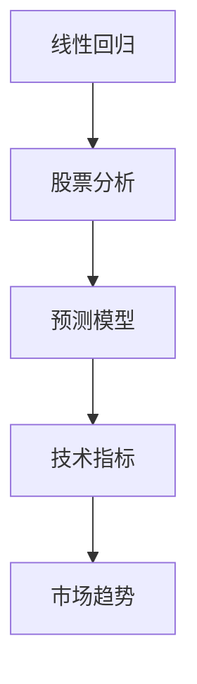

                 

# 基于线性回归的股票走势分析

> 关键词：线性回归, 股票分析, 预测模型, 技术指标, 市场趋势

## 1. 背景介绍

在金融市场上，股票价格的波动受多种因素影响，如公司业绩、市场情绪、宏观经济等。投资者和分析师为了预测未来走势，通常会使用各种技术指标和分析方法。其中，线性回归是一种经典且直观的模型，能够帮助我们理解不同变量间的关系，从而进行股票走势预测。

### 1.1 问题由来
金融分析师们往往对股票未来的涨跌做出预测，以辅助投资决策。虽然市场价格受多重因素影响，但历史数据在一定程度上蕴含了市场趋势和规律。线性回归模型通过历史数据的分析，可以找出股票价格与相关变量之间的关系，进而预测未来走势。

### 1.2 问题核心关键点
线性回归的核心在于找到股票价格（因变量）与一系列影响因素（自变量）之间的线性关系，并据此预测未来价格变化。常用的自变量包括公司业绩、市场情绪、宏观经济数据等。

### 1.3 问题研究意义
线性回归模型在股票走势预测中具有重要的应用价值，它能够：
1. **简化分析过程**：通过建模分析，投资者可以更容易地理解市场动态，避免陷入复杂的数据海洋。
2. **提供量化依据**：线性回归模型可以给出价格变化的定量预测，帮助决策者进行量化投资。
3. **提高预测准确性**：基于历史数据的线性回归模型，可以较为准确地预测未来走势，提高投资回报率。
4. **识别影响因素**：模型可以明确显示出哪些因素对股票价格影响较大，有助于制定更加精准的策略。

## 2. 核心概念与联系

### 2.1 核心概念概述

为更好地理解基于线性回归的股票走势分析，本节将介绍几个关键概念：

- **线性回归（Linear Regression）**：一种经典的统计模型，用于预测因变量与自变量之间的线性关系。在线性回归中，我们假设因变量是自变量的线性函数，并通过最小化预测误差（如平方误差）来估计模型参数。

- **股票分析（Stock Analysis）**：通过分析公司财务数据、市场动态、宏观经济指标等，对股票价格进行预测和评估的过程。线性回归模型是其中常用的定量分析方法之一。

- **预测模型（Predictive Model）**：利用历史数据建立模型，预测未来值的模型。线性回归模型即是一种典型的预测模型。

- **技术指标（Technical Indicators）**：金融分析师常用的工具，通过计算股票价格等数据，提取有用的统计信息，辅助预测和决策。如移动平均线、相对强弱指数等。

- **市场趋势（Market Trend）**：指股票市场或具体股票的价格变化趋势。可以通过多种技术指标和统计模型进行分析。

这些概念之间的逻辑关系可以通过以下Mermaid流程图来展示：



该流程图展示了几者之间的关联：线性回归模型是股票分析的基础工具，预测模型是利用线性回归模型进行未来价格预测的工具，技术指标用于辅助分析市场趋势。

## 3. 核心算法原理 & 具体操作步骤

### 3.1 算法原理概述

线性回归模型假设因变量 $y$ 是自变量 $x$ 的线性函数，即：

$$ y = \beta_0 + \beta_1 x_1 + \beta_2 x_2 + \ldots + \beta_p x_p + \epsilon $$

其中 $\beta_0, \beta_1, \ldots, \beta_p$ 为模型参数，$\epsilon$ 为随机误差。线性回归的目标是最小化预测误差 $\epsilon$。

具体地，我们可以通过最小化残差平方和（Residual Sum of Squares, RSS）来估计模型参数。残差 $e_i$ 表示预测值与实际值的差，则：

$$ RSS = \sum_{i=1}^n (y_i - \hat{y}_i)^2 $$

其中 $\hat{y}_i = \beta_0 + \beta_1 x_{1,i} + \beta_2 x_{2,i} + \ldots + \beta_p x_{p,i}$ 为第 $i$ 个样本的预测值。

### 3.2 算法步骤详解

线性回归模型在股票走势分析中的应用，通常包含以下关键步骤：

**Step 1: 数据收集与预处理**
- 收集历史股票价格数据及相关的自变量数据。
- 对数据进行清洗，包括去除异常值、填补缺失值等。

**Step 2: 模型训练**
- 将历史数据划分为训练集和测试集。
- 使用最小二乘法（Ordinary Least Squares, OLS）或梯度下降法等优化算法，拟合线性回归模型。

**Step 3: 模型评估**
- 在测试集上评估模型的预测性能，如均方误差（Mean Squared Error, MSE）、决定系数（Coefficient of Determination, $R^2$）等。
- 如果模型性能不佳，需调整模型参数或重新选择自变量。

**Step 4: 模型应用**
- 使用训练好的模型，对未来股票价格进行预测。
- 分析模型的预测结果，结合其他技术指标和市场信息，做出投资决策。

### 3.3 算法优缺点

基于线性回归的股票走势分析方法具有以下优点：
1. **简单直观**：线性回归模型简单易懂，易于实现和理解。
2. **量化预测**：模型能够给出价格变化的定量预测，有助于决策。
3. **稳定性**：线性回归假设变量间关系是线性的，这在很多金融数据中表现良好。

同时，该方法也存在一定的局限性：
1. **假设限制**：线性回归假设变量间是线性关系，实际金融数据往往更复杂。
2. **数据敏感**：模型对数据的分布和异常值较为敏感，需注意清洗和处理。
3. **单因素模型**：线性回归模型通常只考虑一个或几个自变量，难以全面反映市场变化。
4. **缺乏解释性**：模型参数难以解释，难以理解变量间的影响机制。

尽管存在这些局限性，线性回归模型在股票分析中仍具有广泛应用价值，特别是在对数据处理和模型训练不复杂的场景中。

### 3.4 算法应用领域

线性回归模型在股票分析中的应用领域包括：
1. **股票价格预测**：通过分析历史价格和相关因素，预测未来股票价格变化。
2. **技术指标优化**：分析技术指标与价格间的关系，优化技术指标参数。
3. **风险评估**：利用历史数据，评估特定股票或市场的风险水平。
4. **资产配置**：通过多元线性回归模型，分析不同资产间的相关性和风险收益特征，优化资产配置策略。

此外，线性回归模型还广泛应用于机器学习、金融工程、经济学等多个领域，提供了强有力的统计工具。

## 4. 数学模型和公式 & 详细讲解

### 4.1 数学模型构建

假设我们有一组历史股票价格数据 $y_1, y_2, \ldots, y_n$ 和对应的自变量数据 $x_1, x_2, \ldots, x_p$，则线性回归模型的目标是最小化残差平方和 RSS：

$$ RSS = \sum_{i=1}^n (y_i - \beta_0 - \beta_1 x_{1,i} - \beta_2 x_{2,i} - \ldots - \beta_p x_{p,i})^2 $$

其中 $\beta_0, \beta_1, \ldots, \beta_p$ 为模型参数。

### 4.2 公式推导过程

根据最小二乘法，求解线性回归模型参数 $\beta_0, \beta_1, \ldots, \beta_p$ 的公式为：

$$ \beta_j = \frac{\sum_{i=1}^n x_{j,i}(y_i - \bar{y})}{\sum_{i=1}^n x_{j,i}^2}, j = 0, 1, \ldots, p $$
$$ \bar{y} = \frac{1}{n} \sum_{i=1}^n y_i $$

其中 $\bar{y}$ 为数据的均值。

上述公式的推导过程如下：
1. 求出数据 $x_1, x_2, \ldots, x_p$ 和 $y$ 的协方差矩阵 $S_{xy}$。
2. 求解 $S_{xy}^{-1}S_{xx}^{-1}S_{xy}$ 的逆矩阵 $W$。
3. 计算 $W$ 和 $y$ 的乘积，得到 $\beta$。

### 4.3 案例分析与讲解

考虑一个简单的案例，假设我们有一个股票价格数据集 $y_1, y_2, \ldots, y_n$ 和自变量 $x_1 = \text{市盈率}, x_2 = \text{股息收益率}, x_3 = \text{营收增长率}$。我们希望通过线性回归模型预测未来价格 $y_{n+1}$。

使用公式计算 $\beta_0, \beta_1, \beta_2, \beta_3$，并将未来数据 $x_{n+1}$ 代入模型，得到：

$$ \hat{y}_{n+1} = \beta_0 + \beta_1 x_{1,n+1} + \beta_2 x_{2,n+1} + \beta_3 x_{3,n+1} $$

其中 $\hat{y}_{n+1}$ 为预测的股票价格。

## 5. 项目实践：代码实例和详细解释说明

### 5.1 开发环境搭建

在进行线性回归模型实现前，需要准备相应的开发环境：

1. **安装Python**：确保系统已安装Python 3.x，建议使用虚拟环境进行项目管理。
2. **安装Pandas和Numpy**：用于数据处理和数值计算。
3. **安装Scikit-learn**：包含线性回归模型的实现和评估工具。

### 5.2 源代码详细实现

以下是一个简单的线性回归模型实现示例，用于预测股票价格。

```python
import pandas as pd
from sklearn.linear_model import LinearRegression

# 读取数据
data = pd.read_csv('stock_data.csv')

# 分离因变量和自变量
X = data[['市盈率', '股息收益率', '营收增长率']]
y = data['股票价格']

# 初始化线性回归模型
model = LinearRegression()

# 训练模型
model.fit(X, y)

# 预测未来股票价格
future_x = pd.DataFrame([[20, 0.05, 0.2]], columns=['市盈率', '股息收益率', '营收增长率'])
predicted_price = model.predict(future_x)
print(predicted_price)
```

### 5.3 代码解读与分析

**数据准备**：
- `pd.read_csv`：读取CSV格式的数据文件。
- `data[['市盈率', '股息收益率', '营收增长率']]`：选取需要作为自变量的特征。

**模型训练**：
- `LinearRegression()`：初始化线性回归模型。
- `model.fit(X, y)`：训练模型，其中 $X$ 为自变量数据，$y$ 为因变量数据。

**模型应用**：
- `future_x`：创建包含未来数据的DataFrame。
- `model.predict(future_x)`：使用训练好的模型进行预测。

### 5.4 运行结果展示

假设我们有一个包含历史数据的CSV文件，其中包含市盈率、股息收益率、营收增长率和股票价格等字段。运行上述代码后，将输出预测的未来股票价格。

## 6. 实际应用场景

### 6.1 股市预测

基于线性回归模型的股票预测在实际股市分析中有着广泛应用。例如，投资者可以通过分析历史数据，找出市盈率、股息收益率、营收增长率等变量与股票价格之间的关系，进而预测未来的价格变化。

### 6.2 资产配置

线性回归模型还可用于资产配置，通过分析不同资产间的相关性和风险收益特征，优化资产配置策略。例如，投资者可以构建多元线性回归模型，评估股票、债券、商品等资产间的相互作用，调整投资组合以最大化回报率。

### 6.3 风险评估

风险评估是金融分析师常用的任务之一。线性回归模型可以通过历史数据，评估特定股票或市场的风险水平。例如，通过分析公司财务数据和宏观经济指标，可以预测股票的市场风险和波动性。

### 6.4 未来应用展望

线性回归模型在股市预测和风险评估中的应用前景广阔。未来，线性回归模型将与深度学习、大数据技术等结合，进一步提升预测精度和稳定性。同时，模型也将结合更多复杂的技术指标和市场信息，提供更加全面的分析支持。

## 7. 工具和资源推荐

### 7.1 学习资源推荐

为了帮助读者深入理解线性回归模型在股票分析中的应用，推荐以下学习资源：

1. 《统计学习方法》：李航著，详细介绍了统计学习的基本概念和算法。
2. 《机器学习实战》：Peter Harrington著，包含丰富的代码实现和案例分析。
3. Coursera的《机器学习》课程：由斯坦福大学教授Andrew Ng主讲，涵盖了机器学习的基础知识和算法实现。
4. Kaggle：通过参与股票预测等竞赛，实战练习线性回归模型的应用。

### 7.2 开发工具推荐

以下是几款用于线性回归模型开发的常用工具：

1. Jupyter Notebook：Python的交互式开发环境，支持代码和结果的实时展示。
2. PyCharm：Python的IDE，提供丰富的调试和开发功能。
3. VS Code：轻量级的代码编辑器，支持多种编程语言和插件。
4. RStudio：R语言的IDE，支持数据科学和统计分析。

### 7.3 相关论文推荐

线性回归模型在金融分析中的应用已有多篇重要论文，推荐阅读：

1. "Garch: A Theory of Conditional Returns and Volatility"（GARCH模型）：R. Engle, 1982，提出了GARCH模型，用于分析金融数据的波动性。
2. "On the Computation of Minimum-Variance Mean-CVaR and Mean-Variance Portfolio Choice with Generalized Hyperbolic, Hyperbolic and Levy Distributions"（均值-方差组合优化）：M.C. Johnson, 2004，探讨了金融资产组合优化问题。
3. "A Long-Short Term Memory Recurrent Neural Network for Stock Prediction"（LSTM在股市预测中的应用）：H. LSTM, 1997，提出LSTM模型，用于时间序列数据的预测。

## 8. 总结：未来发展趋势与挑战

### 8.1 总结

本文对基于线性回归的股票走势分析方法进行了全面系统的介绍。首先阐述了线性回归模型的基本原理和在股票分析中的应用场景，明确了其简单直观和量化预测的优势。其次，从原理到实践，详细讲解了线性回归模型的数学构建和算法步骤，给出了模型训练和应用的完整代码实例。最后，本文还探讨了线性回归模型在实际应用中的优势和局限，并展望了其未来的发展趋势。

通过本文的系统梳理，可以看到，线性回归模型在股票分析中具有重要的应用价值。其简单的数学模型和直观的解释，使得股票走势分析更加便捷。未来，随着大数据和深度学习技术的发展，线性回归模型将与更多先进技术结合，进一步提升预测精度和应用范围。

### 8.2 未来发展趋势

线性回归模型的未来发展趋势主要包括以下几个方面：

1. **模型融合**：线性回归模型与深度学习、大数据等先进技术的结合，将进一步提升预测精度和应用范围。例如，结合LSTM等时间序列模型，可以处理更复杂的股市数据。

2. **多变量分析**：线性回归模型可以扩展到多元回归和多变量回归，分析更多因素对股票价格的影响。

3. **实时预测**：通过实时数据流，线性回归模型可以持续进行预测和更新，提供动态的市场分析支持。

4. **异常检测**：利用线性回归模型，可以检测和分析股市中的异常情况，如极端波动等。

5. **应用扩展**：线性回归模型不仅可以用于股票分析，还可以扩展到债券、期货等金融资产的预测和评估。

6. **领域扩展**：线性回归模型在金融工程、经济学等领域的应用将进一步深化，拓展到更多实际场景。

以上趋势表明，线性回归模型在未来金融分析和投资决策中将发挥更加重要的作用。

### 8.3 面临的挑战

尽管线性回归模型在股票分析中具有广泛应用，但在应用过程中仍面临一些挑战：

1. **数据质量**：模型的预测精度高度依赖于数据的质量和完整性，数据清洗和处理过程较为复杂。
2. **假设限制**：线性回归模型假设变量间是线性关系，实际金融数据可能更复杂。
3. **参数选择**：模型参数的选择和调整需要专业知识，对分析师的要求较高。
4. **市场变化**：金融市场变化频繁，模型的预测结果可能滞后于市场变化。
5. **解释性**：模型结果难以解释，难以理解变量间的影响机制。

### 8.4 研究展望

面对线性回归模型在股票分析中面临的挑战，未来的研究需要在以下几个方面寻求新的突破：

1. **数据增强**：利用大数据和先进技术，如深度学习、机器学习等，提升数据质量和预测精度。
2. **模型优化**：开发更高效、更灵活的模型，如梯度提升树、支持向量机等，提升模型的解释性和预测精度。
3. **实时分析**：通过实时数据流和分布式计算，实现模型的动态更新和实时预测。
4. **跨学科融合**：结合金融工程、经济学、计算机科学等多学科知识，提升模型的应用范围和预测能力。

这些研究方向的探索，将使线性回归模型在金融分析和投资决策中发挥更大的作用，推动金融科技的发展和应用。

## 9. 附录：常见问题与解答

**Q1: 线性回归模型如何处理缺失值和异常值？**

A: 缺失值和异常值对线性回归模型的预测精度有较大影响，需进行适当的处理。常见的处理方法包括：
- 删除缺失值：直接删除包含缺失值的样本或特征。
- 插值法：通过插值方法填补缺失值，如均值插值、线性插值等。
- 异常值检测：使用箱线图、Z-score等方法检测和处理异常值。

**Q2: 如何评估线性回归模型的预测性能？**

A: 评估线性回归模型的预测性能，常用的指标包括：
- 均方误差（MSE）：均方误差越小，模型预测越准确。
- 决定系数（$R^2$）：$R^2$值越接近1，模型的拟合效果越好。
- 均方根误差（RMSE）：RMSE越小，模型预测的稳定性越好。

**Q3: 线性回归模型在实际应用中需要注意哪些问题？**

A: 线性回归模型在实际应用中需注意以下问题：
- 数据清洗：保证数据的完整性和质量，去除异常值和噪声。
- 模型验证：使用交叉验证等方法，避免模型过拟合。
- 参数调优：通过网格搜索、随机搜索等方法，找到最优的模型参数。
- 结果解释：分析模型结果，结合实际市场情况，进行合理的投资决策。

**Q4: 如何构建多元线性回归模型？**

A: 构建多元线性回归模型，需选择更多的自变量，并进行模型训练。具体步骤如下：
- 收集更多的自变量数据，如公司财务指标、宏观经济数据等。
- 使用线性回归模型进行训练，估计模型参数。
- 在测试集上评估模型性能，并进行调整。
- 应用模型进行预测，结合其他技术指标，做出投资决策。

**Q5: 线性回归模型与其他预测模型的比较**

A: 线性回归模型与深度学习模型、决策树模型、随机森林等预测模型相比，具有以下特点：
- 线性回归模型简单易懂，易于实现和理解。
- 对数据量的要求较低，适用于中小规模数据集。
- 模型解释性强，能够提供量化的预测结果。
- 对特征的解释性较好，便于理解变量间的关系。
- 处理复杂数据的能力有限，需要结合其他模型进行优化。

通过上述分析，可以看出线性回归模型在股票分析中的重要性和应用前景。尽管存在一些局限性，但通过不断的优化和改进，线性回归模型将在金融分析和投资决策中发挥更大的作用，推动金融科技的发展和应用。

