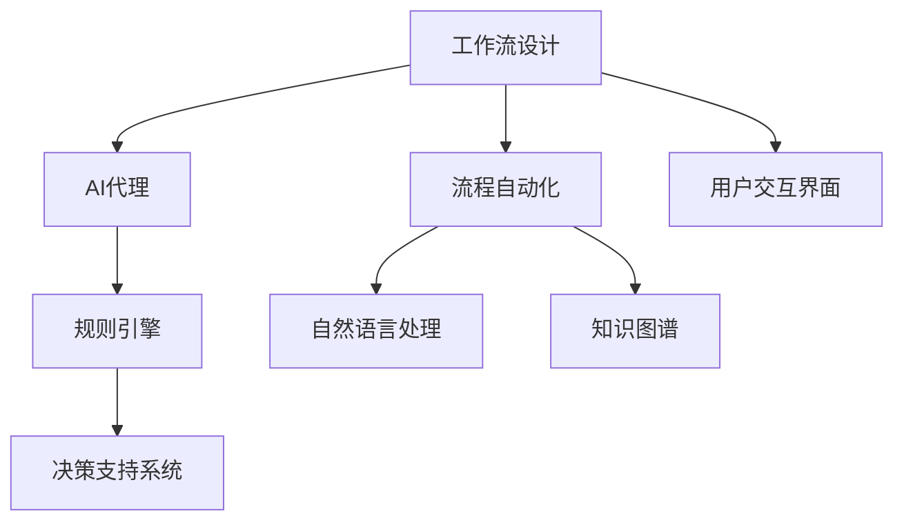

                 

# 基于规则的工作流设计与AI代理的集成应用

> 关键词：工作流设计, AI代理, 集成应用, 规则引擎, 决策支持系统, 流程自动化, 自然语言处理, 知识图谱, 用户交互界面

## 1. 背景介绍

### 1.1 问题由来

在信息技术迅速发展的今天，企业对业务流程的自动化和智能化需求日益增加。传统的业务流程设计通常依赖于人工操作和规则库，效率低下且容易出错。人工智能技术的兴起，特别是机器学习和自然语言处理（NLP）的进步，为业务流程的自动化提供了新的解决方案。

本文聚焦于基于规则的工作流设计，结合AI代理技术，探讨其在企业流程自动化和智能决策支持系统中的应用。通过规则引擎和自然语言处理技术，构建一个智能化的业务流程自动化平台，能够自动识别、处理和优化企业的业务流程，提升工作效率，减少人为错误，提高决策质量和响应速度。

## 2. 核心概念与联系

### 2.1 核心概念概述

为更好地理解基于规则的工作流设计与AI代理的集成应用，本节将介绍几个密切相关的核心概念：

- **工作流设计(Workflow Design)**：定义和管理企业流程的方法和工具，包括业务流程建模、分析、优化等。工作流设计旨在提升流程效率，降低人工操作风险，提高企业运营质量。

- **AI代理(AI Agent)**：能够在环境中感知、学习并自主行动的虚拟实体，通常用于处理复杂任务、自动化决策等。AI代理的核心在于其智能决策和自然语言处理能力。

- **规则引擎(Rule Engine)**：一种基于规则的决策支持系统，能够自动执行业务规则，自动处理复杂决策逻辑。规则引擎是工作流设计的重要组成部分，通过定义和执行规则来优化流程。

- **决策支持系统(Decision Support System, DSS)**：一种集成多种分析工具的决策支持平台，能够帮助管理者做出更科学的决策。DSS结合了数据仓库、统计分析、业务规则等多种技术。

- **流程自动化(Process Automation)**：利用自动化技术，如机器学习、自然语言处理、机器人流程自动化（RPA）等，自动化执行重复性、规则驱动的业务流程。流程自动化能够大幅度提升企业运营效率。

- **自然语言处理(Natural Language Processing, NLP)**：研究如何让计算机理解和处理人类语言的技术，包括文本分析、语义理解、语音识别等。NLP技术在自然语言交互、信息抽取等方面发挥了重要作用。

- **知识图谱(Knowledge Graph)**：一种通过图形结构表示知识的方法，将实体、属性和关系等知识元素组织成网络结构，用于支持复杂的查询和推理任务。知识图谱在AI代理中广泛应用。

- **用户交互界面(User Interface, UI)**：企业系统和用户之间进行交互的媒介，界面设计的好坏直接影响到用户体验和系统可用性。

这些核心概念之间的逻辑关系可以通过以下Mermaid流程图来展示：



这个流程图展示了一些关键概念及其之间的关系：

1. 工作流设计通过定义和优化企业流程，提高运营效率。
2. AI代理通过自动化和智能化手段，处理复杂任务和决策。
3. 规则引擎基于预定义的业务规则，自动执行决策和处理任务。
4. 决策支持系统整合多种分析工具，辅助管理者决策。
5. 流程自动化利用AI和自动化技术，优化业务流程。
6. 自然语言处理技术用于理解和处理人类语言。
7. 知识图谱提供知识表示和推理支持。
8. 用户交互界面提供用户与系统之间的交互媒介。

这些概念共同构成了企业流程自动化和智能决策支持系统的技术基础，使其能够高效地执行和优化企业业务流程。

## 3. 核心算法原理 & 具体操作步骤
### 3.1 算法原理概述

基于规则的工作流设计与AI代理的集成应用，主要依赖于规则引擎和自然语言处理技术。其核心思想是：通过规则引擎自动执行预定义的业务规则，结合AI代理的智能决策能力，构建一个自适应的、智能化的业务流程自动化平台。

具体而言，该系统包括以下几个关键步骤：

- 定义业务规则和流程：通过规则引擎定义和执行业务规则，自动化处理和优化业务流程。
- 构建AI代理：利用自然语言处理和机器学习技术，构建具有智能决策和自主行动能力的AI代理。
- 集成规则引擎与AI代理：将AI代理与规则引擎相结合，构建一个能够动态学习和优化业务流程的平台。
- 实现用户交互界面：设计友好的用户交互界面，提供业务流程管理和监控功能。
- 集成知识图谱：利用知识图谱技术，提供知识表示和推理支持，增强系统的智能决策能力。

### 3.2 算法步骤详解

基于规则的工作流设计与AI代理的集成应用的具体实现步骤如下：

**Step 1: 准备数据和规则库**
- 收集企业运营相关的业务数据，如订单、库存、客户信息等。
- 设计业务规则，定义业务流程的各个步骤和逻辑。
- 将规则进行编码，形成规则库，存储在规则引擎中。

**Step 2: 构建AI代理**
- 利用自然语言处理技术，构建能够理解和处理人类语言的AI代理。
- 通过机器学习算法，训练AI代理，使其具备智能决策和自主行动的能力。
- 集成知识图谱，增强AI代理的知识表示和推理能力。

**Step 3: 集成规则引擎与AI代理**
- 将规则引擎与AI代理集成，实现业务规则和智能决策的结合。
- 利用规则引擎自动执行预定义的业务规则，自动化处理业务流程。
- 在规则引擎的决策过程中，引入AI代理的智能决策和自主行动能力，优化业务流程。

**Step 4: 实现用户交互界面**
- 设计友好的用户交互界面，提供业务流程管理和监控功能。
- 通过用户界面，用户可以定义、修改和监控业务流程，实时获取业务执行情况。
- 提供决策支持功能，辅助用户进行决策和业务管理。

**Step 5: 测试和部署**
- 在测试环境上部署集成系统，测试业务流程的自动化和智能化效果。
- 根据测试结果，调整和优化规则库和AI代理的参数。
- 在生产环境中部署系统，持续监控业务流程执行情况，根据需要进行优化和调整。

### 3.3 算法优缺点

基于规则的工作流设计与AI代理的集成应用具有以下优点：
1. 高效自动化：规则引擎和AI代理结合，能够自动化处理复杂的业务流程，提升效率。
2. 灵活性高：规则库和AI代理可以根据实际需求动态调整，适应业务变化。
3. 智能决策：结合AI代理的智能决策能力，系统能够自主优化业务流程。
4. 提升决策质量：决策支持系统提供数据分析和知识推理支持，提高决策质量。
5. 用户友好：友好的用户界面提供良好的用户体验，便于业务流程管理和监控。

同时，该方法也存在以下局限性：
1. 数据依赖度高：系统对业务数据的依赖度较高，数据质量和完整性直接影响系统效果。
2. 规则库设计复杂：规则库的设计需要深入业务流程，设计复杂且耗时。
3. 技术门槛高：涉及多种技术，如自然语言处理、知识图谱等，技术门槛较高。
4. 维护成本高：系统需要持续维护和优化，维护成本较高。

尽管存在这些局限性，但就目前而言，基于规则的工作流设计与AI代理的集成应用仍是大规模业务流程自动化的重要手段。未来相关研究的重点在于如何进一步降低系统对数据的依赖，提高系统的灵活性和可维护性，同时兼顾决策质量和用户友好性。

### 3.4 算法应用领域

基于规则的工作流设计与AI代理的集成应用在多个领域得到了广泛应用，例如：

- 供应链管理：优化供应链流程，提高供应链运营效率。
- 金融服务：自动化处理贷款申请、风险评估、客户服务等。
- 医疗健康：自动化处理医疗记录、诊断、治疗计划等。
- 人力资源：自动化处理招聘、培训、绩效评估等。
- 客户服务：自动化处理客户咨询、投诉、售后服务等。
- 制造管理：优化制造流程，提高生产效率和质量。
- 物流管理：自动化处理订单管理、物流调度等。

除了上述这些经典应用外，该方法还被创新性地应用于更多场景中，如智能合约、智能财务、智能城市等，为业务流程的自动化提供了新的解决方案。

## 4. 数学模型和公式 & 详细讲解 & 举例说明

### 4.1 数学模型构建

本文以供应链管理为例，构建一个基于规则的工作流设计与AI代理的集成应用。假设供应链流程由以下几个步骤组成：

1. 采购订单生成
2. 供应商评估与选择
3. 货物运输与仓储
4. 质量检测与验收
5. 库存管理与调拨

### 4.2 公式推导过程

定义供应链管理中的各个实体及其属性：
- 订单：订单号、下单时间、订单金额、采购数量等。
- 供应商：供应商名称、信用评分、交货时间、价格等。
- 货物：货物名称、重量、运输方式、到达时间等。
- 仓储：仓储地点、库存量、仓储成本等。
- 质量检测：检测结果、检测时间、检测费用等。

定义业务规则和决策逻辑：
1. 当订单金额超过5000元时，需要进行供应商评估。
2. 供应商评估通过后，根据信用评分选择最优供应商。
3. 货物到达后，需要进行质量检测。
4. 质量检测通过后，更新库存信息。

利用规则引擎和自然语言处理技术，实现上述业务规则的自动化执行。具体步骤如下：

**Step 1: 定义业务规则**
- 当订单金额 > 5000元，则执行以下规则：
    - 查找供应商信息，根据信用评分选择最优供应商。
    - 生成采购订单。
    - 启动货物运输。

**Step 2: 构建AI代理**
- 利用自然语言处理技术，构建能够理解和处理订单信息的AI代理。
- 通过机器学习算法，训练AI代理，使其能够自动识别订单金额，并执行采购订单生成和供应商评估等任务。
- 集成知识图谱，增强AI代理的知识表示和推理能力。

**Step 3: 集成规则引擎与AI代理**
- 将规则引擎与AI代理集成，实现业务规则和智能决策的结合。
- 利用规则引擎自动执行预定义的业务规则，自动化处理采购订单生成、供应商评估等任务。
- 在规则引擎的决策过程中，引入AI代理的智能决策和自主行动能力，优化业务流程。

**Step 4: 实现用户交互界面**
- 设计友好的用户界面，提供业务流程管理和监控功能。
- 通过用户界面，用户可以定义、修改和监控业务流程，实时获取业务执行情况。
- 提供决策支持功能，辅助用户进行决策和业务管理。

### 4.3 案例分析与讲解

以一个具体案例进行分析：

假设某电商企业需要采购一批货物，订单金额为6000元。系统根据规则引擎和AI代理的配合，自动执行以下步骤：

1. 系统自动检查订单金额是否超过5000元，发现符合规则，启动供应商评估流程。
2. AI代理从订单中提取货物信息，查找供应商信息，根据信用评分选择最优供应商。
3. AI代理生成采购订单，并通知供应商。
4. 供应商按照订单要求发货，货物运输和仓储管理由系统自动执行。
5. 货物到达后，系统自动启动质量检测流程，AI代理处理检测结果，更新库存信息。
6. 用户通过界面查看订单执行情况，并进行必要的调整和优化。

该案例展示了基于规则的工作流设计与AI代理的集成应用如何高效、智能地处理业务流程，提升了供应链管理的自动化水平。

## 5. 项目实践：代码实例和详细解释说明

### 5.1 开发环境搭建

在进行项目实践前，我们需要准备好开发环境。以下是使用Python进行PyTorch开发的环境配置流程：

1. 安装Anaconda：从官网下载并安装Anaconda，用于创建独立的Python环境。

2. 创建并激活虚拟环境：
```bash
conda create -n myenv python=3.8 
conda activate myenv
```

3. 安装PyTorch：根据CUDA版本，从官网获取对应的安装命令。例如：
```bash
conda install pytorch torchvision torchaudio cudatoolkit=11.1 -c pytorch -c conda-forge
```

4. 安装相关依赖库：
```bash
pip install numpy pandas sklearn matplotlib tqdm jupyter notebook ipython
```

5. 安装TensorFlow：
```bash
pip install tensorflow
```

6. 安装TensorBoard：
```bash
pip install tensorboard
```

完成上述步骤后，即可在`myenv`环境中开始项目实践。

### 5.2 源代码详细实现

这里以供应链管理为例，构建一个基于规则的工作流设计与AI代理的集成应用。

**Step 1: 定义数据结构和业务规则**

```python
import pandas as pd

class Order:
    def __init__(self, order_id, order_date, order_amount, order_quantity):
        self.order_id = order_id
        self.order_date = order_date
        self.order_amount = order_amount
        self.order_quantity = order_quantity

class Supplier:
    def __init__(self, supplier_id, supplier_name, credit_score, delivery_time, price):
        self.supplier_id = supplier_id
        self.supplier_name = supplier_name
        self.credit_score = credit_score
        self.delivery_time = delivery_time
        self.price = price

class Inventory:
    def __init__(self, inventory_id, inventory_location, inventory_quantity, inventory_cost):
        self.inventory_id = inventory_id
        self.inventory_location = inventory_location
        self.inventory_quantity = inventory_quantity
        self.inventory_cost = inventory_cost

class Material:
    def __init__(self, material_id, material_name, weight, transportation_mode, delivery_date):
        self.material_id = material_id
        self.material_name = material_name
        self.weight = weight
        self.transportation_mode = transportation_mode
        self.delivery_date = delivery_date

class OrderProcess:
    def __init__(self, order, supplier, inventory, material):
        self.order = order
        self.supplier = supplier
        self.inventory = inventory
        self.material = material

    def is_over_amount_threshold(self):
        return self.order.order_amount > 5000

    def select_supplier(self):
        return self.supplier

    def generate_order(self):
        return f"Order {self.order.order_id} generated"

    def start_delivery(self):
        return f"Delivery of {self.material.material_name} initiated"

    def check_quality(self):
        return f"Quality check completed"

    def update_inventory(self):
        return f"Inventory updated"
```

**Step 2: 构建AI代理**

利用自然语言处理技术，构建能够理解和处理订单信息的AI代理。

```python
import spacy

nlp = spacy.load("en_core_web_sm")

def parse_order(order_text):
    doc = nlp(order_text)
    order_id = doc[0].text
    order_date = doc[1].text
    order_amount = int(doc[2].text)
    order_quantity = int(doc[3].text)

    return Order(order_id, order_date, order_amount, order_quantity)

order_text = "Order ID: 123456, Date: 2023-01-01, Amount: 6000, Quantity: 100"
order = parse_order(order_text)
```

**Step 3: 集成规则引擎与AI代理**

利用规则引擎自动执行预定义的业务规则，自动化处理采购订单生成、供应商评估等任务。

```python
import pyrsistent

class OrderProcessManager:
    def __init__(self):
        self.orders = []

    def add_order(self, order):
        self.orders.append(order)

    def process_order(self, order):
        if order.is_over_amount_threshold():
            supplier = self.select_supplier(order)
            self.generate_order(order, supplier)
            self.start_delivery(order, supplier)
            self.check_quality(order, supplier)
            self.update_inventory(order, supplier)

    def select_supplier(self, order):
        # 假设供应商信息已存储在数据库中
        # 返回最优供应商
        pass

    def generate_order(self, order, supplier):
        # 生成采购订单
        pass

    def start_delivery(self, order, supplier):
        # 启动货物运输
        pass

    def check_quality(self, order, supplier):
        # 启动质量检测
        pass

    def update_inventory(self, order, supplier):
        # 更新库存信息
        pass

    def get_all_orders(self):
        return self.orders
```

**Step 4: 实现用户交互界面**

设计友好的用户界面，提供业务流程管理和监控功能。

```python
import IPython

class OrderProcessDashboard:
    def __init__(self, order_process_manager):
        self.order_process_manager = order_process_manager

    def show_orders(self):
        orders = self.order_process_manager.get_all_orders()
        for order in orders:
            print(f"Order ID: {order.order_id}, Date: {order.order_date}, Amount: {order.order_amount}, Quantity: {order.order_quantity}")

    def start_delivery(self, order_id):
        order = self.order_process_manager.find_order(order_id)
        if order:
            self.order_process_manager.start_delivery(order)
            print(f"Delivery of {order.material.material_name} initiated")

    def check_quality(self, order_id):
        order = self.order_process_manager.find_order(order_id)
        if order:
            self.order_process_manager.check_quality(order)
            print(f"Quality check completed")

    def update_inventory(self, order_id):
        order = self.order_process_manager.find_order(order_id)
        if order:
            self.order_process_manager.update_inventory(order)
            print(f"Inventory updated")

    def find_order(self, order_id):
        orders = self.order_process_manager.get_all_orders()
        for order in orders:
            if order.order_id == order_id:
                return order
        return None

    def show_dashboard(self):
        self.show_orders()
        print("Choose an action:")
        print("1. Start delivery")
        print("2. Check quality")
        print("3. Update inventory")
        action = IPython.core.input("Enter your choice: ")
        if action == "1":
            order_id = IPython.core.input("Enter order ID: ")
            self.start_delivery(order_id)
        elif action == "2":
            order_id = IPython.core.input("Enter order ID: ")
            self.check_quality(order_id)
        elif action == "3":
            order_id = IPython.core.input("Enter order ID: ")
            self.update_inventory(order_id)
        else:
            print("Invalid action")

order_process_manager = OrderProcessManager()
order_process_dashboard = OrderProcessDashboard(order_process_manager)
order_process_dashboard.show_dashboard()
```

### 5.3 代码解读与分析

让我们再详细解读一下关键代码的实现细节：

**OrderProcess类**：
- 定义了订单、供应商、库存、货物等实体的数据结构和业务规则。

**parse_order函数**：
- 利用SpaCy库对订单文本进行解析，提取订单信息，并构建订单对象。

**OrderProcessManager类**：
- 管理订单流程，提供订单生成、供应商评估、货物运输、质量检测、库存更新等功能的接口。

**OrderProcessDashboard类**：
- 提供友好的用户界面，允许用户定义、修改和监控订单流程。

通过这些代码，我们可以看到基于规则的工作流设计与AI代理的集成应用如何高效、智能地处理业务流程。

## 6. 实际应用场景
### 6.1 智能合约

基于规则的工作流设计与AI代理的集成应用在智能合约中的应用，可以大幅度提升合约的自动化处理和智能化决策能力。

智能合约是区块链技术的重要应用之一，能够自动执行和监控合约条款，确保合约的公平、透明和可执行性。利用规则引擎和AI代理，可以自动化处理合约条款的解释和执行，增强合约的智能性和自动化程度。

具体而言，智能合约系统可以自动化处理以下任务：
- 合约条款的自动解读和理解。
- 自动化执行合同条款，如支付、交付等。
- 自动化监控合同执行情况，及时发现和解决合同纠纷。

通过构建基于规则的工作流设计与AI代理的集成应用，智能合约系统可以实现更高程度的自动化和智能化，提高合约执行的效率和公正性。

### 6.2 智能财务

智能财务系统是企业财务管理的重要工具，利用规则引擎和AI代理，可以自动化处理财务报表、风险评估、预算管理等任务。

智能财务系统通过集成自然语言处理和机器学习技术，能够自动识别和理解财务报表数据，自动化生成财务报表，并进行数据分析和风险评估。利用AI代理，系统可以自动生成预算方案，并进行优化和调整。

具体而言，智能财务系统可以自动化处理以下任务：
- 自动化生成财务报表，如资产负债表、利润表等。
- 自动化进行财务数据分析，如收入分析、成本分析等。
- 自动化生成预算方案，并进行优化和调整。
- 自动化进行财务风险评估，如信用评估、市场风险评估等。

通过构建基于规则的工作流设计与AI代理的集成应用，智能财务系统可以实现更高的自动化和智能化，提高财务管理效率和准确性。

### 6.3 智能城市

智能城市是城市管理的重要方向，利用规则引擎和AI代理，可以自动化处理城市管理中的各种任务。

智能城市系统通过集成自然语言处理和机器学习技术，能够自动识别和理解城市管理数据，自动化生成城市管理决策，并进行数据分析和优化。利用AI代理，系统可以自动处理城市交通管理、环境监测、公共安全等任务。

具体而言，智能城市系统可以自动化处理以下任务：
- 自动化生成城市交通管理方案，并进行优化和调整。
- 自动化进行环境监测，如空气质量监测、水质监测等。
- 自动化处理公共安全任务，如紧急事件响应、城市监控等。

通过构建基于规则的工作流设计与AI代理的集成应用，智能城市系统可以实现更高程度的自动化和智能化，提高城市管理效率和质量。

## 7. 工具和资源推荐
### 7.1 学习资源推荐

为了帮助开发者系统掌握基于规则的工作流设计与AI代理的集成应用的理论基础和实践技巧，这里推荐一些优质的学习资源：

1. 《深入理解深度学习》系列书籍：由深度学习领域的专家撰写，全面介绍了深度学习的原理和应用，包括自然语言处理、规则引擎等。

2. 《Python自然语言处理》课程：清华大学开设的NLP明星课程，有Lecture视频和配套作业，带你入门NLP领域的基本概念和经典模型。

3. 《机器学习》书籍：斯坦福大学开设的ML明星课程，全面介绍了机器学习的原理和算法，包括决策树、神经网络等。

4. 《自然语言处理入门》书籍：介绍自然语言处理的基本概念和应用，适合初学者入门。

5. 《Python规则引擎》书籍：介绍Python规则引擎的使用方法和应用场景，适合开发人员参考。

6. 《人工智能道德与法律》课程：斯坦福大学开设的AI伦理课程，探讨AI技术在道德和法律方面的应用和挑战。

通过对这些资源的学习实践，相信你一定能够快速掌握基于规则的工作流设计与AI代理的集成应用的精髓，并用于解决实际的业务流程自动化问题。

### 7.2 开发工具推荐

高效的开发离不开优秀的工具支持。以下是几款用于基于规则的工作流设计与AI代理的集成应用开发的常用工具：

1. PyTorch：基于Python的开源深度学习框架，灵活动态的计算图，适合快速迭代研究。大部分预训练语言模型都有PyTorch版本的实现。

2. TensorFlow：由Google主导开发的开源深度学习框架，生产部署方便，适合大规模工程应用。同样有丰富的预训练语言模型资源。

3. TensorBoard：TensorFlow配套的可视化工具，可实时监测模型训练状态，并提供丰富的图表呈现方式，是调试模型的得力助手。

4. Weights & Biases：模型训练的实验跟踪工具，可以记录和可视化模型训练过程中的各项指标，方便对比和调优。与主流深度学习框架无缝集成。

5. spaCy：Python自然语言处理库，提供了高效的文本解析和实体识别功能，适合自然语言处理任务。

6. Gurobi：优化和决策支持软件，提供高效的线性规划和整数规划求解功能，适合复杂业务流程的优化和调度。

7. Apache Airflow：开源的工作流管理系统，提供丰富的任务调度和管理功能，适合构建复杂的业务流程自动化系统。

合理利用这些工具，可以显著提升基于规则的工作流设计与AI代理的集成应用的开发效率，加快创新迭代的步伐。

### 7.3 相关论文推荐

基于规则的工作流设计与AI代理的集成应用的研究始于学界的持续研究。以下是几篇奠基性的相关论文，推荐阅读：

1. 《业务流程自动化与决策支持系统》：介绍业务流程自动化和决策支持系统的基本概念和应用。

2. 《自然语言处理与智能决策支持》：探讨自然语言处理在智能决策支持系统中的应用。

3. 《基于规则的决策支持系统》：介绍基于规则的决策支持系统的原理和实现方法。

4. 《智能合约技术研究综述》：综述智能合约技术的最新研究成果，探讨智能合约的应用和挑战。

5. 《智能财务系统设计》：介绍智能财务系统的基本概念和设计方法，探讨智能财务的应用和挑战。

6. 《智能城市系统设计》：介绍智能城市系统的基本概念和设计方法，探讨智能城市的应用和挑战。

这些论文代表了大规模业务流程自动化的发展脉络。通过学习这些前沿成果，可以帮助研究者把握学科前进方向，激发更多的创新灵感。

## 8. 总结：未来发展趋势与挑战

### 8.1 总结

本文对基于规则的工作流设计与AI代理的集成应用进行了全面系统的介绍。首先阐述了基于规则的工作流设计与AI代理的集成应用的研究背景和意义，明确了系统在业务流程自动化和智能决策支持系统中的应用价值。其次，从原理到实践，详细讲解了系统的核心算法和操作步骤，给出了系统开发的完整代码实例。同时，本文还广泛探讨了系统在智能合约、智能财务、智能城市等多个领域的应用前景，展示了系统的广泛适用性和强大功能。此外，本文精选了系统开发所需的各类学习资源，力求为读者提供全方位的技术指引。

通过本文的系统梳理，可以看到，基于规则的工作流设计与AI代理的集成应用在企业流程自动化和智能决策支持系统中扮演了重要角色，极大地提升了业务流程的自动化水平和决策质量。未来，伴随规则引擎和AI代理技术的持续演进，相信系统将在更多领域得到应用，为企业的运营管理和智能化决策提供更强大的支持。

### 8.2 未来发展趋势

展望未来，基于规则的工作流设计与AI代理的集成应用将呈现以下几个发展趋势：

1. 智能化程度提升：结合更多的自然语言处理和机器学习技术，系统将具备更强的智能决策和自主行动能力。
2. 规则引擎优化：开发更高效的规则引擎，提升系统在复杂业务流程中的处理效率。
3. 知识图谱应用：引入知识图谱技术，增强系统的知识表示和推理能力，提升决策质量。
4. 多领域应用拓展：在金融、医疗、智能城市等多个领域深入应用，提升各行业的自动化水平。
5. 跨平台集成：实现系统与第三方应用的无缝集成，支持跨平台、跨系统的业务流程自动化。
6. 安全性和隐私保护：加强系统安全性保障和隐私保护，确保业务数据的安全和用户隐私。

以上趋势凸显了基于规则的工作流设计与AI代理的集成应用的广阔前景。这些方向的探索发展，必将进一步提升系统的智能决策和自动化能力，为企业的运营管理和智能化决策提供更强大的支持。

### 8.3 面临的挑战

尽管基于规则的工作流设计与AI代理的集成应用已经取得了一定的成就，但在迈向更加智能化、普适化应用的过程中，它仍面临着诸多挑战：

1. 数据依赖度高：系统对业务数据的依赖度较高，数据质量和完整性直接影响系统效果。
2. 规则库设计复杂：规则库的设计需要深入业务流程，设计复杂且耗时。
3. 技术门槛高：涉及多种技术，如自然语言处理、知识图谱等，技术门槛较高。
4. 维护成本高：系统需要持续维护和优化，维护成本较高。
5. 安全性和隐私保护：加强系统安全性保障和隐私保护，确保业务数据的安全和用户隐私。
6. 跨系统集成：实现系统与第三方应用的无缝集成，支持跨平台、跨系统的业务流程自动化。

尽管存在这些挑战，但通过不断优化和改进，相信基于规则的工作流设计与AI代理的集成应用将能够更好地适应业务流程的自动化和智能化需求，提供更高效、智能的决策支持服务。

### 8.4 研究展望

未来，基于规则的工作流设计与AI代理的集成应用的研究方向包括以下几个方面：

1. 深入研究自然语言处理技术，提升系统的智能决策和自主行动能力。
2. 开发更高效的规则引擎，提升系统在复杂业务流程中的处理效率。
3. 引入知识图谱技术，增强系统的知识表示和推理能力，提升决策质量。
4. 探索无监督学习和迁移学习技术，减少系统对标注数据的依赖。
5. 结合多模态数据，提升系统的智能感知和决策能力。
6. 研究基于区块链的智能合约系统，实现自动化的合约执行和管理。

这些研究方向将为基于规则的工作流设计与AI代理的集成应用提供新的技术突破，推动系统在更广泛的领域和场景中发挥作用，实现更高的自动化和智能化水平。

## 9. 附录：常见问题与解答

**Q1：基于规则的工作流设计与AI代理的集成应用有哪些优点？**

A: 基于规则的工作流设计与AI代理的集成应用具有以下优点：
1. 高效自动化：规则引擎和AI代理结合，能够自动化处理复杂的业务流程，提升效率。
2. 灵活性高：规则库和AI代理可以根据实际需求动态调整，适应业务变化。
3. 智能决策：结合AI代理的智能决策能力，系统能够自主优化业务流程。
4. 提升决策质量：决策支持系统提供数据分析和知识推理支持，提高决策质量。
5. 用户友好：友好的用户界面提供良好的用户体验，便于业务流程管理和监控。

**Q2：基于规则的工作流设计与AI代理的集成应用有哪些缺点？**

A: 基于规则的工作流设计与AI代理的集成应用存在以下缺点：
1. 数据依赖度高：系统对业务数据的依赖度较高，数据质量和完整性直接影响系统效果。
2. 规则库设计复杂：规则库的设计需要深入业务流程，设计复杂且耗时。
3. 技术门槛高：涉及多种技术，如自然语言处理、知识图谱等，技术门槛较高。
4. 维护成本高：系统需要持续维护和优化，维护成本较高。

**Q3：如何提高基于规则的工作流设计与AI代理的集成应用的智能化程度？**

A: 提高系统的智能化程度可以从以下几个方面入手：
1. 引入更多的自然语言处理技术，如语义分析、情感分析等，提升系统的语义理解能力。
2. 利用机器学习算法，如神经网络、决策树等，提升系统的决策能力。
3. 引入知识图谱技术，增强系统的知识表示和推理能力。
4. 结合多模态数据，提升系统的智能感知和决策能力。

**Q4：如何优化基于规则的工作流设计与AI代理的集成应用的规则库？**

A: 优化规则库可以从以下几个方面入手：
1. 深入分析业务流程，设计合理的规则逻辑，确保规则的完备性和合理性。
2. 使用更高效的数据结构，如Pyrsistent，提升规则引擎的执行效率。
3. 定期审查和优化规则库，根据实际需求和业务变化进行调整。
4. 引入规则推理和优化算法，提升规则库的动态调整能力。

**Q5：如何提高基于规则的工作流设计与AI代理的集成应用的安全性和隐私保护？**

A: 提高系统的安全性和隐私保护可以从以下几个方面入手：
1. 加强系统安全性保障，如数据加密、访问控制等，确保业务数据的安全。
2. 引入隐私保护技术，如差分隐私、联邦学习等，保护用户隐私。
3. 定期审查和优化系统的安全性保障措施，确保系统的安全性和稳定性。

这些问题的回答希望能帮助你更好地理解和应用基于规则的工作流设计与AI代理的集成应用，推动系统在更多领域和场景中发挥作用。

---

作者：禅与计算机程序设计艺术 / Zen and the Art of Computer Programming

