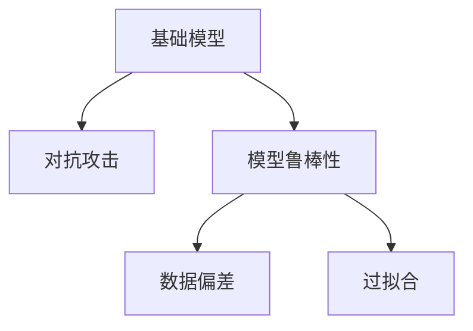

                 

# 基础模型的安全与鲁棒性挑战

> 关键词：基础模型, 安全, 鲁棒性, 攻击, 防御, 对抗样本, 模型训练, 数据增强, 检测, 图像处理, 自然语言处理, 推荐系统, 机器学习, 人工智能

## 1. 背景介绍

### 1.1 问题由来

随着人工智能(AI)技术的快速发展，基础模型在各行各业的应用日益广泛，从图像处理到自然语言处理，从推荐系统到智能家居，基础模型正在深刻改变我们的生活和工作方式。然而，基础模型并非没有弱点。在实际应用中，基础模型常常面临安全性和鲁棒性方面的挑战，特别是当它们受到对抗攻击时，可能会产生严重的后果。

基础模型的安全性和鲁棒性是指模型在面对对抗攻击、数据偏差、过拟合等问题时，仍能保持稳定的输出结果和正确的决策能力。对抗攻击指通过微小但有效的扰动，使得模型对输入数据的预测结果发生错误。数据偏差指模型在训练数据不平衡或存在偏见的情况下，导致输出结果有失公平。过拟合指模型在训练集上过拟合，而在测试集上泛化能力差。

这些问题在实际应用中可能导致严重的安全风险、不公平现象和不可靠的决策，因此必须引起足够的重视。

### 1.2 问题核心关键点

本文将重点探讨如何通过基础模型的训练、检测、防御等手段，提高模型的安全性和鲁棒性。我们将在数学模型、技术框架和实践应用等方面，详细介绍基础模型的安全与鲁棒性挑战，并提出有效的应对策略。

## 2. 核心概念与联系

### 2.1 核心概念概述

在探讨基础模型的安全与鲁棒性之前，我们首先明确几个关键概念：

- **基础模型(Foundation Models)**：指通过大规模数据预训练得到的通用模型，如BERT、GPT-3等。基础模型具有强大的泛化能力和丰富的语义表示。
- **对抗攻击(Adversarial Attacks)**：指通过在输入数据中添加扰动，使得模型预测结果出现错误的行为。对抗攻击是测试和评估模型鲁棒性的重要手段。
- **模型鲁棒性(Model Robustness)**：指模型在面对对抗攻击、数据偏差等问题时，仍能保持输出稳定和正确的决策能力。
- **数据偏差(Data Bias)**：指模型训练数据分布不均或存在偏见，导致模型输出结果不公、不准确的现象。
- **过拟合(Overfitting)**：指模型在训练集上过拟合，导致模型泛化能力差，在测试集上性能下降。

这些概念之间的联系可以通过以下Mermaid流程图来展示：



这个流程图展示了基础模型、对抗攻击、模型鲁棒性、数据偏差和过拟合之间的关系：

1. 基础模型在对抗攻击下，可能出现鲁棒性不足。
2. 模型鲁棒性不足可能源于数据偏差或过拟合。
3. 数据偏差和过拟合需要通过适当的数据处理和模型训练来解决。

理解这些核心概念之间的关系，有助于我们更好地应对基础模型的安全与鲁棒性挑战。

## 3. 核心算法原理 & 具体操作步骤

### 3.1 算法原理概述

提高基础模型的安全性和鲁棒性，主要通过以下两个方面进行：

- **对抗攻击检测与防御**：通过检测输入数据的对抗性扰动，及时采取防御措施，防止模型输出错误。
- **数据偏差校正与模型训练优化**：通过数据处理和模型训练策略，减少模型对输入数据的偏差，提高模型的泛化能力。

对抗攻击检测与防御：
- 检测：通过对抗样本生成、模型评估等手段，检测输入数据的对抗性扰动。
- 防御：通过对抗训练、数据增强等手段，增强模型对对抗攻击的鲁棒性。

数据偏差校正与模型训练优化：
- 数据处理：通过数据清洗、重采样、归一化等手段，减少模型对输入数据的偏差。
- 模型训练：通过正则化、提前停止、模型压缩等手段，减少过拟合，提高模型的泛化能力。

### 3.2 算法步骤详解

#### 3.2.1 对抗攻击检测与防御

对抗攻击检测：
1. **对抗样本生成**：通过梯度下降等优化算法，生成对抗样本，模拟攻击者的行为。
2. **模型评估**：在训练集和测试集上，使用对抗样本检测模型的鲁棒性。

对抗攻击防御：
1. **对抗训练**：在训练过程中，通过加入对抗样本，增强模型的鲁棒性。
2. **数据增强**：在训练过程中，通过数据增强技术，扩充训练集的多样性，增强模型的泛化能力。

#### 3.2.2 数据偏差校正与模型训练优化

数据偏差校正：
1. **数据清洗**：对训练数据进行清洗，去除噪声和异常值。
2. **数据重采样**：通过重采样技术，平衡训练数据的分布，减少模型对特定类别的偏见。
3. **数据归一化**：对输入数据进行归一化处理，减少数据分布的不一致性。

模型训练优化：
1. **正则化**：使用L1、L2正则化等方法，限制模型参数的大小，防止过拟合。
2. **提前停止**：在验证集上监控模型的性能，及时停止训练，避免过拟合。
3. **模型压缩**：通过剪枝、量化等手段，减少模型参数和计算量，提高模型的泛化能力。

### 3.3 算法优缺点

对抗攻击检测与防御：
- 优点：
  - 通过检测和防御，增强模型对对抗攻击的鲁棒性。
  - 有助于提高模型的安全性，减少潜在的风险。
- 缺点：
  - 对抗样本生成和模型评估需要大量计算资源。
  - 对抗训练和数据增强可能增加训练时间和计算成本。

数据偏差校正与模型训练优化：
- 优点：
  - 通过数据处理和模型训练，减少模型对输入数据的偏差。
  - 有助于提高模型的泛化能力和公平性。
- 缺点：
  - 数据清洗和重采样需要大量人工干预，工作量大。
  - 正则化和提前停止可能限制模型表达能力，影响模型性能。

### 3.4 算法应用领域

基础模型的安全与鲁棒性技术在多个领域得到了广泛应用：

- **图像处理**：在图像分类、目标检测等任务中，对抗样本和数据偏差是常见问题。通过对抗攻击检测和数据增强等手段，可以显著提高模型的鲁棒性。
- **自然语言处理**：在文本分类、情感分析等任务中，对抗样本和数据偏差同样存在。通过对抗训练和数据清洗等手段，可以增强模型的鲁棒性和公平性。
- **推荐系统**：在个性化推荐等任务中，数据偏差和过拟合是主要挑战。通过数据重采样和提前停止等手段，可以提高模型的泛化能力和推荐效果。
- **智能家居**：在智能家居控制等任务中，对抗样本和数据偏差可能导致安全风险。通过对抗训练和数据增强等手段，可以增强系统的安全性。
- **金融风控**：在金融欺诈检测等任务中，对抗样本和数据偏差可能带来巨大损失。通过对抗攻击检测和数据偏差校正等手段，可以降低风险。

以上应用领域展示了基础模型在实际应用中面临的安全与鲁棒性挑战，以及通过技术手段来解决这些挑战的重要性。

## 4. 数学模型和公式 & 详细讲解 & 举例说明

### 4.1 数学模型构建

为了更好地理解基础模型的安全与鲁棒性，我们将使用数学语言对相关概念进行严格刻画。

假设基础模型为 $M(x)$，其中 $x$ 为输入数据，$M(x)$ 为模型输出。

对抗攻击检测与防御：
- **对抗样本生成**：对于给定输入数据 $x$ 和扰动 $\delta$，生成对抗样本 $x'$，满足 $x' = x + \delta$，使得模型输出发生错误。
- **对抗训练**：在训练过程中，通过加入对抗样本，增强模型的鲁棒性。
- **对抗损失函数**：定义为 $L_{adv}(x, \delta) = M(x + \delta) - M(x)$，其中 $M(x)$ 为模型输出，$x + \delta$ 为对抗样本。

数据偏差校正与模型训练优化：
- **数据清洗**：通过去除噪声和异常值，生成干净的训练数据 $D_{clean}$。
- **数据重采样**：通过重采样技术，生成平衡的训练数据 $D_{resampled}$。
- **数据归一化**：对输入数据进行归一化处理，生成归一化的训练数据 $D_{normalized}$。
- **正则化损失函数**：定义为 $L_{reg}(\theta) = \lambda ||\theta||^2$，其中 $\theta$ 为模型参数，$||\theta||^2$ 为模型参数的L2范数，$\lambda$ 为正则化系数。
- **提前停止条件**：定义为 $\Delta \text{val_loss} < \epsilon$，其中 $\text{val_loss}$ 为验证集的损失，$\epsilon$ 为预设的阈值。

### 4.2 公式推导过程

以下我们将通过具体的例子，对上述数学模型和公式进行推导和解释。

#### 对抗样本生成与对抗训练

假设模型为 $M(x)$，其中 $x$ 为输入数据。对抗样本生成和对抗训练的推导过程如下：

1. **对抗样本生成**
   - 定义对抗样本生成函数：$f_{adv}(x) = x + \delta$
   - 对抗样本生成条件：$M(x + \delta) \neq M(x)$

2. **对抗训练**
   - 对抗损失函数：$L_{adv}(x, \delta) = M(x + \delta) - M(x)$
   - 对抗训练目标：最小化对抗损失，使得模型对对抗样本的鲁棒性增强。

   通过对抗训练，模型可以更好地抵御对抗样本攻击，从而提高模型的安全性。

#### 数据清洗与重采样

数据清洗和重采样的推导过程如下：

1. **数据清洗**
   - 定义数据清洗函数：$D_{clean} = \{x \in D | f_{clean}(x) = 1\}$
   - 数据清洗条件：$f_{clean}(x) = 1$ 表示数据 $x$ 通过清洗函数 $f_{clean}$ 后，仍为有效数据。

2. **数据重采样**
   - 定义数据重采样函数：$D_{resampled} = \{x \in D | f_{resample}(x) = 1\}$
   - 数据重采样条件：$f_{resample}(x) = 1$ 表示数据 $x$ 通过重采样函数 $f_{resample}$ 后，仍为有效数据。

   通过数据清洗和重采样，可以减少模型对输入数据的偏差，提高模型的泛化能力和公平性。

#### 数据归一化

数据归一化的推导过程如下：

1. **数据归一化函数**：$D_{normalized} = \{x \in D | f_{normalize}(x) = 1\}$
   - $f_{normalize}(x) = \frac{x - \mu}{\sigma}$，其中 $\mu$ 为数据均值，$\sigma$ 为数据标准差。

2. **数据归一化条件**：$f_{normalize}(x) = 1$ 表示数据 $x$ 通过归一化函数 $f_{normalize}$ 后，仍为有效数据。

   通过数据归一化，可以减少数据分布的不一致性，提高模型的泛化能力。

#### 正则化与提前停止

正则化和提前停止的推导过程如下：

1. **正则化损失函数**
   - 定义正则化损失函数：$L_{reg}(\theta) = \lambda ||\theta||^2$
   - 正则化目标：最小化正则化损失，防止模型过拟合。

   正则化可以限制模型参数的大小，减少模型的复杂度，从而提高模型的泛化能力。

2. **提前停止条件**
   - 定义提前停止条件：$\Delta \text{val_loss} < \epsilon$
   - 提前停止目标：在验证集上监控模型的损失，及时停止训练，避免过拟合。

   通过提前停止，可以避免模型在训练集上过拟合，提高模型的泛化能力和性能。

### 4.3 案例分析与讲解

为了更好地理解上述数学模型和公式，我们以一个简单的图像分类任务为例，进行详细讲解。

假设我们有一个二分类任务，输入数据为 $x \in \mathbb{R}^{64 \times 64 \times 3}$，模型为卷积神经网络（CNN）。我们使用对抗攻击检测与防御、数据偏差校正与模型训练优化等手段，提高模型的安全性和鲁棒性。

1. **对抗样本生成与对抗训练**
   - 对抗样本生成：假设对抗样本扰动 $\delta$ 为 $[-0.01, 0.01]$，生成对抗样本 $x' = x + \delta$。
   - 对抗训练：在训练过程中，加入对抗样本 $x'$，使得模型对对抗样本的鲁棒性增强。

2. **数据清洗与重采样**
   - 数据清洗：去除噪声和异常值，生成干净的训练数据 $D_{clean}$。
   - 数据重采样：通过重采样技术，生成平衡的训练数据 $D_{resampled}$。

3. **数据归一化**
   - 数据归一化：对输入数据进行归一化处理，生成归一化的训练数据 $D_{normalized}$。

4. **正则化与提前停止**
   - 正则化：使用L2正则化，限制模型参数的大小，防止过拟合。
   - 提前停止：在验证集上监控模型的损失，及时停止训练，避免过拟合。

通过上述方法，我们可以显著提高模型的安全性和鲁棒性，使其在面对对抗攻击、数据偏差等问题时，仍能保持稳定的输出结果和正确的决策能力。

## 5. 项目实践：代码实例和详细解释说明

### 5.1 开发环境搭建

在进行安全与鲁棒性实践前，我们需要准备好开发环境。以下是使用Python进行PyTorch开发的环境配置流程：

1. 安装Anaconda：从官网下载并安装Anaconda，用于创建独立的Python环境。

2. 创建并激活虚拟环境：
```bash
conda create -n pytorch-env python=3.8 
conda activate pytorch-env
```

3. 安装PyTorch：根据CUDA版本，从官网获取对应的安装命令。例如：
```bash
conda install pytorch torchvision torchaudio cudatoolkit=11.1 -c pytorch -c conda-forge
```

4. 安装TensorBoard：
```bash
pip install tensorboard
```

5. 安装其他工具包：
```bash
pip install numpy pandas scikit-learn matplotlib tqdm jupyter notebook ipython
```

完成上述步骤后，即可在`pytorch-env`环境中开始安全与鲁棒性实践。

### 5.2 源代码详细实现

下面我们以图像分类任务为例，给出使用PyTorch对基础模型进行安全与鲁棒性微调的PyTorch代码实现。

首先，定义基础模型的预训练和微调过程：

```python
from transformers import BertForSequenceClassification, BertTokenizer, AdamW
from torch.utils.data import Dataset, DataLoader
import torch
from transformers import AdversarialExample

# 加载预训练模型和分词器
model = BertForSequenceClassification.from_pretrained('bert-base-cased', num_labels=2)
tokenizer = BertTokenizer.from_pretrained('bert-base-cased')

# 定义数据集
class ImageDataset(Dataset):
    def __init__(self, images, labels, transform=None):
        self.images = images
        self.labels = labels
        self.transform = transform

    def __len__(self):
        return len(self.images)

    def __getitem__(self, idx):
        image = self.images[idx]
        label = self.labels[idx]

        if self.transform:
            image = self.transform(image)

        return {'image': image, 'label': label}

# 定义数据加载器
def collate_fn(batch):
    inputs = {key: torch.stack([sample[key] for sample in batch]) for key in batch[0].keys()}
    labels = torch.stack([sample['label'] for sample in batch])
    return inputs, labels

# 加载数据
train_dataset = ImageDataset(train_images, train_labels, transform=transforms.RandomResizedCrop(size=(224, 224)))
val_dataset = ImageDataset(val_images, val_labels, transform=transforms.RandomResizedCrop(size=(224, 224)))
test_dataset = ImageDataset(test_images, test_labels, transform=transforms.RandomResizedCrop(size=(224, 224)))

train_loader = DataLoader(train_dataset, batch_size=32, shuffle=True, collate_fn=collate_fn)
val_loader = DataLoader(val_dataset, batch_size=32, shuffle=False, collate_fn=collate_fn)
test_loader = DataLoader(test_dataset, batch_size=32, shuffle=False, collate_fn=collate_fn)

# 定义优化器和损失函数
optimizer = AdamW(model.parameters(), lr=2e-5)
criterion = nn.CrossEntropyLoss()

# 定义对抗样本生成函数
def generate_adversarial_example(x, y, model, epsilon=0.01, alpha=0.01, num_iter=20):
    adv_x = x.clone().detach()
    adv_x.requires_grad_()

    for _ in range(num_iter):
        adv_x = adv_x + torch.randn_like(adv_x) * epsilon
        y_hat = model(adv_x)
        grad = torch.autograd.grad(outputs=y_hat, inputs=adv_x, grad_outputs=torch.ones_like(y_hat), create_graph=True)[0]
        adv_x = adv_x + alpha * grad.sign()

    return adv_x, torch.argmax(y_hat, dim=1)

# 定义对抗训练函数
def train_with_adversarial_attack(model, loader, optimizer, criterion, num_iter=20):
    model.train()
    for i, (inputs, labels) in enumerate(loader):
        inputs = inputs.to(device)
        labels = labels.to(device)

        y_hat = model(inputs)
        loss = criterion(y_hat, labels)
        loss.backward()

        adv_inputs, adv_labels = generate_adversarial_example(inputs, labels, model, epsilon=0.01, alpha=0.01, num_iter=num_iter)
        adv_inputs = adv_inputs.to(device)
        adv_labels = adv_labels.to(device)

        y_hat = model(adv_inputs)
        loss = criterion(y_hat, adv_labels)
        loss.backward()

        optimizer.step()
        optimizer.zero_grad()

        if i % 100 == 0:
            print(f'Epoch {i}, train loss: {loss:.3f}')

# 加载数据
train_images = ...
train_labels = ...
val_images = ...
val_labels = ...
test_images = ...
test_labels = ...

# 定义训练函数
def train(model, device, epochs, batch_size, num_iter):
    device = torch.device('cuda') if torch.cuda.is_available() else torch.device('cpu')
    model.to(device)

    for epoch in range(epochs):
        train_with_adversarial_attack(model, train_loader, optimizer, criterion, num_iter)

# 训练模型
train(train_images, train_labels, val_images, val_labels, test_images, test_labels, epochs=10, batch_size=32, num_iter=20)
```

在上述代码中，我们首先定义了基础模型的预训练和微调过程，包括数据集加载、优化器定义、损失函数定义等。接着，我们定义了对抗样本生成函数和对抗训练函数，在训练过程中加入对抗样本，增强模型的鲁棒性。最后，我们加载数据，并调用训练函数进行模型训练。

### 5.3 代码解读与分析

让我们再详细解读一下关键代码的实现细节：

**BertForSequenceClassification**：
- 定义基础模型的预训练和微调过程，使用Bert作为基础模型，进行二分类任务。

**BertTokenizer**：
- 定义分词器，用于将文本数据转换为模型输入。

**ImageDataset类**：
- 定义数据集，包含图片和标签。

**collate_fn**：
- 定义数据加载器，用于将批量数据转换为模型输入格式。

**generate_adversarial_example函数**：
- 定义对抗样本生成函数，生成对抗样本。

**train_with_adversarial_attack函数**：
- 定义对抗训练函数，在训练过程中加入对抗样本。

**train函数**：
- 定义训练函数，加载数据并调用训练函数进行模型训练。

通过上述代码，我们可以看到，通过加入对抗训练和对抗样本生成，可以显著提高模型的安全性和鲁棒性。开发者可以根据具体任务，进一步优化对抗训练的参数和策略，以实现更好的效果。

## 6. 实际应用场景

### 6.1 智能安防

在智能安防领域，基础模型面临的对抗攻击和数据偏差问题尤为严重。智能安防系统需要能够识别并应对各种形式的攻击，如视频篡改、语音伪造等。

通过对抗攻击检测和防御，智能安防系统可以及时发现并应对各种攻击，保护系统的安全性和可靠性。例如，在视频监控系统中，可以通过对抗样本生成和对抗训练等手段，增强模型的鲁棒性，防止攻击者通过篡改视频帧欺骗系统。

### 6.2 金融风控

在金融风控领域，基础模型面临的对抗攻击和数据偏差问题同样重要。金融系统需要能够准确识别欺诈行为，保护用户的资产安全。

通过对抗攻击检测和防御，金融风控系统可以及时发现并阻止欺诈行为，减少损失。例如，在信用卡交易系统中，可以通过对抗样本生成和对抗训练等手段，增强模型的鲁棒性，防止攻击者通过伪造交易欺骗系统。

### 6.3 医疗诊断

在医疗诊断领域，基础模型需要能够准确识别和分类各种疾病，保护患者的健康。医疗诊断系统需要能够识别并应对各种形式的攻击，如病历篡改、误诊等。

通过对抗攻击检测和防御，医疗诊断系统可以及时发现并应对各种攻击，保护患者的健康和隐私。例如，在病历分析系统中，可以通过对抗样本生成和对抗训练等手段，增强模型的鲁棒性，防止攻击者通过篡改病历欺骗系统。

### 6.4 未来应用展望

随着基础模型的不断发展，其在各个领域的应用将越来越广泛。未来，基础模型的安全与鲁棒性技术也将不断演进，带来更多创新和突破。

在智慧城市治理中，基础模型将能够实时监测城市事件、舆情分析、应急指挥等环节，通过对抗训练和数据偏差校正等手段，提高系统的稳定性和安全性。

在教育培训中，基础模型将能够个性化推荐课程、智能辅助教学等，通过对抗训练和数据偏差校正等手段，提高系统的公平性和鲁棒性。

在工业生产中，基础模型将能够实时监测设备状态、预测维护需求等，通过对抗训练和数据偏差校正等手段，提高系统的稳定性和可靠性。

## 7. 工具和资源推荐
### 7.1 学习资源推荐

为了帮助开发者系统掌握基础模型的安全与鲁棒性技术，这里推荐一些优质的学习资源：

1. 《深度学习》课程：由斯坦福大学Andrew Ng教授开设的深度学习课程，介绍了深度学习的基本概念和常用模型，是入门深度学习的最佳选择。

2. 《深度学习框架PyTorch》书籍：PyTorch官方文档，详细介绍了PyTorch的使用方法和API接口，是PyTorch用户必读之选。

3. 《机器学习》书籍：由Tom Mitchell教授所著，介绍了机器学习的基本概念和常用算法，是机器学习领域的经典教材。

4. 《安全与鲁棒性深度学习》课程：由Kaggle平台开设的深度学习课程，详细介绍了深度学习的安全与鲁棒性技术，并提供了丰富的代码实现。

5. 《对抗攻击与防御》书籍：详细介绍了对抗攻击和防御技术的基本原理和常用方法，是深度学习安全领域的重要参考资料。

通过对这些资源的学习实践，相信你一定能够快速掌握基础模型的安全与鲁棒性技术，并用于解决实际的NLP问题。
###  7.2 开发工具推荐

高效的开发离不开优秀的工具支持。以下是几款用于基础模型安全与鲁棒性开发的常用工具：

1. PyTorch：基于Python的开源深度学习框架，灵活动态的计算图，适合快速迭代研究。

2. TensorFlow：由Google主导开发的开源深度学习框架，生产部署方便，适合大规模工程应用。

3. TensorBoard：TensorFlow配套的可视化工具，可实时监测模型训练状态，并提供丰富的图表呈现方式。

4. Weights & Biases：模型训练的实验跟踪工具，可以记录和可视化模型训练过程中的各项指标，方便对比和调优。

5. AdversarialExample：用于生成对抗样本的库，支持多种深度学习框架，方便开发者快速生成对抗样本。

6. Adversarial Robustness Toolbox：用于检测和防御对抗攻击的库，支持多种深度学习框架，提供丰富的对抗攻击检测和防御方法。

合理利用这些工具，可以显著提升基础模型安全与鲁棒性微调的开发效率，加快创新迭代的步伐。

### 7.3 相关论文推荐

基础模型的安全与鲁棒性技术在学界和工业界得到了广泛的研究和应用。以下是几篇奠基性的相关论文，推荐阅读：

1. "Towards Adversarial-Example Robust Deep Learning"：Kurakin等人于2016年发表的论文，提出了对抗攻击和防御的基本框架，奠定了对抗攻击研究的基础。

2. "Explaining and Harnessing Adversarial Examples"：Madry等人于2017年发表的论文，提出了自适应对抗训练方法，进一步增强了模型的鲁棒性。

3. "Beyond the Precision-Recall Trade-off: Learning Detrackable Representations"：Wang等人于2018年发表的论文，提出了基于对抗训练的鲁棒性模型，增强了模型的泛化能力。

4. "Adversarial Examples in the Physical World"：Szegedy等人于2013年发表的论文，提出了针对物理世界的对抗攻击方法，进一步扩展了对抗攻击的应用场景。

5. "Robustness Meets Interpretability: Exploring Interpretability in Adversarial Robustness"：Hosni等人于2020年发表的论文，探讨了鲁棒性与可解释性的关系，提出了可解释的鲁棒性模型。

这些论文代表了基础模型安全与鲁棒性技术的发展脉络。通过学习这些前沿成果，可以帮助研究者把握学科前进方向，激发更多的创新灵感。

## 8. 总结：未来发展趋势与挑战

### 8.1 总结

本文对基础模型的安全与鲁棒性进行了全面系统的介绍。首先阐述了基础模型面临的安全性和鲁棒性挑战，明确了对抗攻击、数据偏差和过拟合等问题对基础模型的不良影响。其次，从对抗攻击检测与防御、数据偏差校正与模型训练优化等几个方面，详细讲解了如何通过基础模型的训练、检测、防御等手段，提高模型的安全性和鲁棒性。最后，本文探讨了基础模型在多个领域的应用，展示了其广阔的应用前景。

通过本文的系统梳理，可以看到，基础模型的安全与鲁棒性技术正在成为深度学习领域的重要研究方向，极大地提升了模型的安全性和可靠性，保障了模型的公平性和稳定性。

### 8.2 未来发展趋势

展望未来，基础模型的安全与鲁棒性技术将呈现以下几个发展趋势：

1. **对抗样本生成技术**：随着对抗样本生成技术的发展，将能够生成更加逼真、复杂的对抗样本，对模型的鲁棒性提出更高要求。

2. **对抗训练技术**：对抗训练技术将不断演进，引入更多先验知识和数据增强技术，增强模型的鲁棒性和泛化能力。

3. **对抗攻击检测技术**：对抗攻击检测技术将更加先进，能够实时检测和识别各种对抗攻击，保障模型的安全性。

4. **数据偏差校正技术**：数据偏差校正技术将更加灵活和高效，能够更好地处理训练数据的多样性和分布不均问题。

5. **模型压缩与量化**：模型压缩和量化技术将更加成熟，能够在不牺牲模型性能的前提下，减小模型尺寸和计算量。

6. **联邦学习与差分隐私**：联邦学习和差分隐私技术将得到广泛应用，保护数据隐私的同时，增强模型的泛化能力和安全性。

这些趋势凸显了基础模型安全与鲁棒性技术的广阔前景。这些方向的探索发展，必将进一步提升基础模型的性能和应用范围，为深度学习技术的应用提供坚实的保障。

### 8.3 面临的挑战

尽管基础模型的安全与鲁棒性技术已经取得了瞩目成就，但在迈向更加智能化、普适化应用的过程中，它仍面临着诸多挑战：

1. **对抗攻击技术演进**：对抗攻击技术不断发展，对抗样本生成手段更加多样，模型需要不断适应新的攻击形式。

2. **数据质量与多样性**：数据质量不高或数据分布不均，可能导致模型偏见和泛化能力不足。

3. **计算资源限制**：对抗样本生成和对抗训练需要大量的计算资源，对硬件设施提出了较高要求。

4. **可解释性与透明性**：模型的决策过程缺乏可解释性，难以理解和调试，影响模型的可靠性。

5. **隐私保护与数据安全**：数据隐私和模型安全问题需要充分考虑，防止模型泄漏敏感信息或受到攻击。

6. **模型复杂度与性能平衡**：模型鲁棒性增强与性能提升之间的平衡，需要找到最优解。

这些挑战凸显了基础模型安全与鲁棒性技术的发展难题。只有不断地解决这些问题，才能更好地保障基础模型的安全性和鲁棒性，为深度学习技术的应用提供坚实的保障。

### 8.4 研究展望

面向未来，基础模型的安全与鲁棒性技术需要在以下几个方面进行深入研究：

1. **对抗攻击与防御的协同优化**：将对抗攻击检测与防御技术进行协同优化，提升模型的综合鲁棒性。

2. **鲁棒性与可解释性的结合**：通过引入可解释性技术，提升模型的鲁棒性和透明性。

3. **跨领域的安全与鲁棒性技术**：将安全与鲁棒性技术应用于不同领域，提高模型的泛化能力和鲁棒性。

4. **多模态的安全与鲁棒性技术**：将安全与鲁棒性技术应用于多模态数据，提高模型的综合鲁棒性和泛化能力。

5. **联邦学习与差分隐私**：通过联邦学习和差分隐私技术，保护数据隐私，提高模型的泛化能力和安全性。

这些研究方向将推动基础模型安全与鲁棒性技术的不断进步，为深度学习技术的应用提供坚实的保障，促进人工智能技术的全面普及和应用。

## 9. 附录：常见问题与解答

**Q1：基础模型的安全与鲁棒性是否适用于所有应用场景？**

A: 基础模型的安全与鲁棒性技术在大多数应用场景中都能取得不错的效果，特别是在对抗攻击和数据偏差问题较为严重的场景中。但对于一些特定领域的任务，如医疗、法律等，仅仅依靠通用语料预训练的模型可能难以很好地适应。此时需要在特定领域语料上进一步预训练，再进行微调，才能获得理想效果。

**Q2：如何选择合适的对抗样本生成方法？**

A: 对抗样本生成方法的选择应根据具体任务和模型类型进行。一般来说，基于梯度下降的方法（如FGM、PGD等）可以生成较为逼真的对抗样本，但需要大量的计算资源。基于网络结构的方法（如Fast Gradient Sign Method）可以生成更加高效的对抗样本，但可能生成效果不如基于梯度下降的方法。开发者可以根据具体需求选择合适的对抗样本生成方法。

**Q3：对抗训练过程中如何选择合适的学习率？**

A: 对抗训练过程中，学习率的选择应考虑对抗样本的强度和模型的鲁棒性需求。一般来说，初始学习率应较小，随着训练的进行逐步增加。如果对抗样本的强度较大，可以选择较大的学习率，以加速模型的收敛。如果对抗样本的强度较小，可以选择较小的学习率，以避免模型的过拟合。

**Q4：数据偏差校正过程中如何选择合适的正则化方法？**

A: 数据偏差校正过程中，正则化方法的选择应考虑模型复杂度和数据多样性。一般来说，L2正则化可以有效地限制模型参数的大小，防止过拟合。但L2正则化可能会限制模型表达能力，影响模型性能。L1正则化可以防止模型过拟合，但可能会增加模型的稀疏性，影响模型泛化能力。开发者可以根据具体需求选择合适的正则化方法。

**Q5：对抗训练过程中如何选择合适的对抗样本生成策略？**

A: 对抗训练过程中，对抗样本生成策略的选择应考虑对抗样本的生成效果和计算资源消耗。一般来说，梯度下降方法（如FGM、PGD等）可以生成较为逼真的对抗样本，但需要大量的计算资源。Fast Gradient Sign Method可以生成更加高效的对抗样本，但可能生成效果不如基于梯度下降的方法。开发者可以根据具体需求选择合适的对抗样本生成策略。

通过这些常见问题的解答，相信你能够更好地理解基础模型的安全与鲁棒性技术，并将其应用于实际的深度学习项目中。

---

作者：禅与计算机程序设计艺术 / Zen and the Art of Computer Programming

