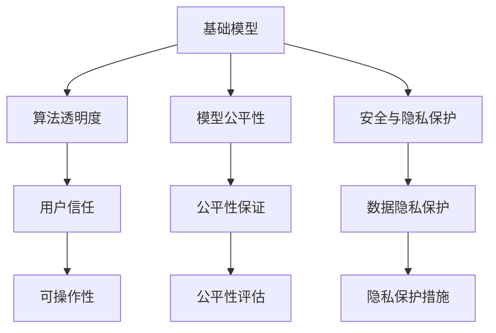

                 

# 基础模型的经济激励与技术发展

> 关键词：基础模型,经济激励,技术发展,AI治理,算法透明度,创新驱动,经济模型,金融分析,数据挖掘,策略制定

## 1. 背景介绍

### 1.1 问题由来
在过去十年中，人工智能(AI)尤其是深度学习在经济领域的应用引起了广泛关注。金融机构、企业、政府机构纷纷引入AI技术，以提升决策效率、优化资源配置、增强风险管理能力。然而，AI技术的快速发展也带来了一系列挑战，如算法透明度、公平性、安全性和治理问题，以及如何平衡技术创新与经济利益的关系。

这些问题引发了学术界和工业界对于AI技术在经济领域应用的深刻思考。基础模型的经济激励与技术发展成为近年来的研究热点。本文旨在探讨基础模型在经济领域的应用，分析经济激励与技术发展之间的关系，为AI技术在经济领域的应用提供指导。

### 1.2 问题核心关键点
基础模型的经济激励与技术发展主要涉及以下几个核心问题：

1. **算法透明度与可解释性**：如何确保AI模型的决策过程和结果可以被理解和解释，以增强用户的信任。

2. **模型公平性与偏见控制**：如何设计AI模型以避免偏见和歧视，确保不同群体的公平待遇。

3. **安全与隐私保护**：如何保护数据隐私，确保AI模型的安全性和鲁棒性。

4. **经济激励与模型训练**：如何设计经济模型以激励开发者和使用者，促进AI技术的健康发展。

5. **创新驱动与策略制定**：如何通过创新驱动，制定有效的政策策略，推动AI技术的广泛应用和深入发展。

本文将围绕这些问题展开探讨，分析基础模型在经济领域的应用现状、存在问题及未来发展方向。

## 2. 核心概念与联系

### 2.1 核心概念概述

为更好地理解基础模型在经济领域的应用，本节将介绍几个关键概念：

- **基础模型(Fundamental Model)**：指用于处理经济数据分析、决策支持、风险评估等任务的基础AI模型。包括但不限于线性回归、逻辑回归、支持向量机(SVM)、深度学习模型等。

- **经济激励(Economic Incentive)**：指通过各种经济手段，如奖金、补贴、知识产权保护等，激励开发者和使用者参与基础模型的开发和应用。

- **技术发展(Technological Development)**：指通过不断的技术革新，提高基础模型的准确性、效率和适应性，推动经济领域的数字化转型。

- **算法透明度(Algorithmic Transparency)**：指AI模型的决策过程和结果可以被解释和理解，增强用户信任和模型可操作性。

- **模型公平性(Model Fairness)**：指AI模型在处理不同群体数据时，不产生偏见和歧视，确保公平性。

- **安全与隐私保护(Security and Privacy Protection)**：指在数据处理和模型训练过程中，保护数据隐私和模型安全，防止数据泄露和模型滥用。

这些核心概念之间的关系可以通过以下Mermaid流程图来展示：



这个流程图展示了一系列概念之间的逻辑关系：

1. 基础模型通过算法透明度、模型公平性和安全与隐私保护等机制，增强用户信任和可操作性。
2. 用户信任和公平性评估进一步推动基础模型的应用和优化。
3. 数据隐私保护措施确保了模型的安全性和合规性。

这些概念共同构成了基础模型在经济领域应用的基础，为推动技术发展提供了方向。

## 3. 核心算法原理 & 具体操作步骤

### 3.1 算法原理概述

基础模型在经济领域的应用主要基于以下几个算法原理：

- **线性回归(Linear Regression)**：通过最小化残差平方和，拟合一条直线来预测经济指标。广泛应用于经济预测、金融分析等领域。

- **逻辑回归(Logistic Regression)**：通过sigmoid函数将输入映射到[0,1]区间，适用于分类问题，如信用评分、股票市场预测等。

- **支持向量机(Support Vector Machine, SVM)**：通过最大化边界间隔，构建分类或回归模型，适用于处理非线性数据。

- **深度学习(Deep Learning)**：通过多层神经网络，从大量数据中学习非线性特征，适用于处理复杂的数据结构，如图像、文本等。

### 3.2 算法步骤详解

基础模型在经济领域的应用步骤包括数据预处理、模型训练、模型评估和模型应用等。以下以线性回归为例，详细说明算法步骤：

**Step 1: 数据预处理**
- 收集经济数据，如GDP增长率、通货膨胀率、失业率等。
- 对数据进行清洗、去重和归一化处理，确保数据质量。
- 使用时间序列分析方法，如ARIMA、LSTM等，对数据进行预处理。

**Step 2: 模型训练**
- 选择线性回归模型，设定目标变量和经济变量的关系。
- 将数据分为训练集和测试集，使用训练集训练模型。
- 调整模型参数，如学习率、正则化系数等，确保模型泛化能力。
- 使用交叉验证等方法，评估模型性能。

**Step 3: 模型评估**
- 使用测试集对模型进行评估，计算R²、MAE等指标。
- 进行模型诊断，如残差分析、自相关分析等。
- 调整模型结构或参数，进一步优化模型性能。

**Step 4: 模型应用**
- 将模型应用到实际经济分析中，如预测GDP增长、评估信贷风险等。
- 定期更新模型，确保模型与时俱进。
- 结合其他经济指标和专家知识，综合判断经济趋势。

### 3.3 算法优缺点

基础模型在经济领域的应用具有以下优点：

- **可解释性强**：模型参数和决策过程透明，便于用户理解和信任。
- **泛化能力强**：适用于多种经济问题，如预测、分类、聚类等。
- **算法成熟**：已有丰富的理论和实践经验，易于实现和优化。

但同时，基础模型也存在一些缺点：

- **数据依赖度高**：对数据质量、数量和特征工程要求较高。
- **模型复杂度低**：可能无法处理复杂非线性问题，限制了应用范围。
- **鲁棒性差**：对异常值和噪声数据敏感，需要额外的预处理。

### 3.4 算法应用领域

基础模型在经济领域的应用非常广泛，包括但不限于以下几个方面：

- **经济预测**：如GDP增长率预测、通货膨胀率预测、股市指数预测等。
- **金融分析**：如信用评分、贷款风险评估、股票市场分析等。
- **风险管理**：如信用风险评估、市场风险控制、操作风险管理等。
- **决策支持**：如投资决策、政策制定、资源配置等。
- **数据挖掘**：如异常检测、模式识别、关联规则挖掘等。

## 4. 数学模型和公式 & 详细讲解 & 举例说明

### 4.1 数学模型构建

基础模型在经济领域的应用通常基于以下数学模型：

- **线性回归模型**：
  $$
  y = \beta_0 + \beta_1 x_1 + \beta_2 x_2 + \ldots + \beta_n x_n + \epsilon
  $$
  其中，$y$为目标变量，$x_i$为经济变量，$\beta_i$为模型参数，$\epsilon$为误差项。

- **逻辑回归模型**：
  $$
  p(y=1|x) = \frac{1}{1 + \exp(-z)}, \quad z = \sum_{i=1}^n \beta_i x_i + \epsilon
  $$
  其中，$p(y=1|x)$为预测概率，$x_i$为经济变量，$\beta_i$为模型参数，$\epsilon$为误差项。

- **支持向量机模型**：
  $$
  \min_{\alpha, \beta} \frac{1}{2} \alpha^T Q \alpha - y^T \alpha, \quad \text{s.t.} \quad Ax \leq b
  $$
  其中，$\alpha$和$\beta$为拉格朗日乘子，$Q$为核矩阵，$y$为输出变量，$A$和$b$为支持向量。

### 4.2 公式推导过程

以线性回归模型为例，推导最小二乘法(Ordinary Least Squares, OLS)的参数估计过程。

假设有一个样本数据集$(x_i, y_i)$，$i=1,2,\ldots,N$，其中$x_i=(x_{i1}, x_{i2}, \ldots, x_{in})$为经济变量，$y_i$为目标变量。

最小二乘法的目标是最小化预测误差，即：
$$
\min_{\beta} \sum_{i=1}^N (y_i - \beta_0 - \beta_1 x_{i1} - \ldots - \beta_n x_{in})^2
$$

根据偏微分，可得：
$$
\frac{\partial}{\partial \beta_0} \sum_{i=1}^N (y_i - \beta_0 - \beta_1 x_{i1} - \ldots - \beta_n x_{in})^2 = 0
$$
$$
\frac{\partial}{\partial \beta_1} \sum_{i=1}^N (y_i - \beta_0 - \beta_1 x_{i1} - \ldots - \beta_n x_{in})^2 = 0
$$
$$
\ldots
$$
$$
\frac{\partial}{\partial \beta_n} \sum_{i=1}^N (y_i - \beta_0 - \beta_1 x_{i1} - \ldots - \beta_n x_{in})^2 = 0
$$

整理后可得：
$$
\beta_0 = \frac{1}{N} \sum_{i=1}^N y_i - \beta_1 \frac{1}{N} \sum_{i=1}^N x_{i1} - \ldots - \beta_n \frac{1}{N} \sum_{i=1}^N x_{in}
$$
$$
\beta_1 = \frac{1}{N} \sum_{i=1}^N (y_i - \frac{1}{N} \sum_{i=1}^N y_i) x_{i1}
$$
$$
\ldots
$$
$$
\beta_n = \frac{1}{N} \sum_{i=1}^N (y_i - \frac{1}{N} \sum_{i=1}^N y_i) x_{in}
$$

通过求解上述方程组，即可得到线性回归模型的参数估计值。

### 4.3 案例分析与讲解

以线性回归模型应用于GDP增长率预测为例，分析模型构建和应用过程。

**数据集准备**：
- 收集美国近20年的GDP数据。
- 对数据进行预处理，如去重、归一化、时间序列分析等。
- 将数据分为训练集和测试集。

**模型训练**：
- 选择线性回归模型，设定目标变量和解释变量之间的关系。
- 使用训练集数据拟合模型，设定正则化系数，防止过拟合。
- 使用交叉验证评估模型性能，调整模型参数。

**模型评估**：
- 使用测试集数据评估模型性能，计算R²、MAE等指标。
- 进行残差分析，检查模型假设和数据质量。
- 使用历史数据更新模型，定期评估和调整。

**模型应用**：
- 将模型应用于未来GDP增长率的预测。
- 结合其他经济指标和专家知识，综合判断经济趋势。
- 定期更新模型，确保模型与时俱进。

## 5. 项目实践：代码实例和详细解释说明

### 5.1 开发环境搭建

在进行经济领域基础模型的开发实践前，我们需要准备好开发环境。以下是使用Python进行Pandas和Scikit-learn开发的环境配置流程：

1. 安装Anaconda：从官网下载并安装Anaconda，用于创建独立的Python环境。

2. 创建并激活虚拟环境：
```bash
conda create -n econ-env python=3.8 
conda activate econ-env
```

3. 安装Pandas和Scikit-learn：
```bash
pip install pandas scikit-learn
```

4. 安装各类工具包：
```bash
pip install numpy matplotlib jupyter notebook ipython
```

完成上述步骤后，即可在`econ-env`环境中开始经济模型开发实践。

### 5.2 源代码详细实现

下面我们以线性回归模型应用于GDP增长率预测为例，给出使用Pandas和Scikit-learn进行模型开发的Python代码实现。

首先，定义数据处理函数：

```python
import pandas as pd
from sklearn.preprocessing import StandardScaler
from sklearn.linear_model import LinearRegression

def preprocess_data(data_path):
    data = pd.read_csv(data_path)
    # 处理缺失值
    data = data.dropna()
    # 特征工程
    data['GDP_growth'] = data['GDP_growth'] - data['GDP_growth'].mean()
    data = StandardScaler().fit_transform(data)
    return data

# 加载数据
data_path = 'gdp_data.csv'
data = preprocess_data(data_path)
```

然后，定义模型训练和评估函数：

```python
from sklearn.model_selection import train_test_split
from sklearn.metrics import r2_score, mean_absolute_error

def train_model(X, y, test_size=0.2, random_state=42):
    X_train, X_test, y_train, y_test = train_test_split(X, y, test_size=test_size, random_state=random_state)
    model = LinearRegression()
    model.fit(X_train, y_train)
    y_pred = model.predict(X_test)
    r2 = r2_score(y_test, y_pred)
    mae = mean_absolute_error(y_test, y_pred)
    return r2, mae

# 训练模型
X = data[:, :-1]
y = data[:, -1]
r2, mae = train_model(X, y)
print(f'R²: {r2:.2f}, MAE: {mae:.2f}')
```

最后，启动模型训练并输出评估结果：

```python
# 训练模型
r2, mae = train_model(X, y)
print(f'R²: {r2:.2f}, MAE: {mae:.2f}')
```

以上就是使用Pandas和Scikit-learn进行线性回归模型应用于GDP增长率预测的完整代码实现。可以看到，借助这些工具，可以轻松构建和评估经济模型。

### 5.3 代码解读与分析

让我们再详细解读一下关键代码的实现细节：

**preprocess_data函数**：
- 对数据进行缺失值处理和归一化。
- 对GDP增长率进行标准化处理。
- 返回预处理后的数据。

**train_model函数**：
- 使用train_test_split函数将数据分为训练集和测试集。
- 使用LinearRegression模型拟合训练数据。
- 使用R²和MAE评估模型性能。
- 返回R²和MAE值。

**主程序**：
- 加载数据集。
- 调用preprocess_data函数进行数据预处理。
- 调用train_model函数进行模型训练和评估。
- 输出评估结果。

通过上述代码，可以看到Pandas和Scikit-learn在数据处理和模型训练中的高效性和易用性。这些工具提供了丰富的API，使得开发者可以专注于模型设计和优化，而不必过多关注数据加载和处理等底层细节。

当然，工业级的系统实现还需考虑更多因素，如模型的保存和部署、超参数的自动搜索、更灵活的模型评估等。但核心的模型构建和评估过程基本与此类似。

## 6. 实际应用场景

### 6.1 金融风险管理

基础模型在金融领域的应用非常广泛，尤其在风险管理方面。通过基础模型，金融机构可以更准确地评估信贷风险、市场风险和操作风险，从而提升风险管理能力。

例如，使用线性回归模型预测信用风险，可以构建一个预测模型，输入特征如收入、负债、信用记录等，预测客户的违约概率。通过模型评估，可以设定阈值，将高风险客户标记出来，进行更严格的风险控制。

### 6.2 投资组合优化

在投资领域，基础模型可以帮助投资者进行资产配置和组合优化。通过构建多变量线性回归模型，投资者可以预测不同资产的价格变动，评估投资组合的风险和收益。

例如，使用线性回归模型预测股票价格，可以构建一个预测模型，输入特征如行业指数、公司财务数据、宏观经济指标等，预测股票价格变化。通过模型评估，可以优化投资组合，实现风险最小化和收益最大化。

### 6.3 经济政策制定

政府机构在制定经济政策时，需要大量数据和分析模型支持。通过基础模型，政府可以预测经济指标，评估政策效果，进行模拟和优化。

例如，使用支持向量机模型预测通货膨胀率，可以构建一个预测模型，输入特征如货币供应量、消费者信心指数、生产者价格指数等，预测通货膨胀率变化。通过模型评估，可以评估政策效果，优化政策参数。

## 7. 工具和资源推荐

### 7.1 学习资源推荐

为了帮助开发者系统掌握基础模型在经济领域的应用，这里推荐一些优质的学习资源：

1. 《Python for Data Analysis》：Wes McKinney所著，详细介绍Pandas库的数据处理功能，是数据处理领域的经典之作。

2. 《Hands-On Machine Learning with Scikit-Learn, Keras, and TensorFlow》：Aurélien Géron所著，全面介绍Scikit-learn、Keras和TensorFlow等工具库，是机器学习入门的优秀教材。

3. Coursera《Machine Learning》课程：由Andrew Ng教授主讲，系统讲解机器学习理论和应用，涵盖多种模型和算法。

4. Kaggle平台：提供大量经济领域的数据集和竞赛，帮助你学习和实践数据挖掘和模型构建。

5. Arxiv预印本平台：汇集了大量经济领域的最新研究论文，可供学习和借鉴。

通过对这些资源的学习实践，相信你一定能够快速掌握基础模型在经济领域的应用，并用于解决实际的经济问题。

### 7.2 开发工具推荐

高效的工具是成功的基础模型开发的关键。以下是几款用于经济模型开发的常用工具：

1. Jupyter Notebook：支持Python和R等多种语言，提供交互式编程环境，方便开发和调试。

2. Scikit-learn：提供丰富的机器学习算法和模型，支持数据预处理、模型训练、评估等全流程操作。

3. Pandas：支持数据导入、处理、清洗、分析等多种操作，是经济数据处理的重要工具。

4. NumPy：支持大规模数值计算，是SciPy、Scikit-learn等工具库的基础。

5. TensorFlow：提供深度学习模型的构建和训练，适用于复杂的数据结构和模型。

合理利用这些工具，可以显著提升基础模型开发的效率，加快创新迭代的步伐。

### 7.3 相关论文推荐

基础模型在经济领域的应用源于学界的持续研究。以下是几篇奠基性的相关论文，推荐阅读：

1. Angrist, J. D., & Pischke, J.-S. (2008). *Mostly Harmless Econometrics: An Empiricist's Companion*：Angrist和Pischke的经典著作，详细介绍经济计量学和统计分析方法。

2. Axtell, R. M. (2001). Why is there no non-arbitrage pricing model? The American Economic Review, 91(2), 337-362：探讨无套利定价模型的局限性和经济模型的不确定性。

3. Fama, E. F., & French, K. R. (2004). The capital asset pricing model: Theory and evidence. The Journal of Economic Perspectives, 18(3), 25-46：介绍资本资产定价模型及其在金融中的应用。

4. Granger, C. W. J. (1969). Investigating causal relations by econometric models and cross-spectral methods. Econometrica: Journal of the Econometric Society, 37(3), 424-438：介绍时间序列分析方法及其在经济预测中的应用。

5. Ljung, G. M. (1978). On the empirical formation of auto-correlation coefficients of time series at different lags. Biometrika, 65(2), 297-303：探讨时间序列分析中的滞后效应及其影响。

这些论文代表了大模型在经济领域应用的理论基础，通过学习这些前沿成果，可以帮助研究者把握学科前进方向，激发更多的创新灵感。

## 8. 总结：未来发展趋势与挑战

### 8.1 总结

本文对基础模型在经济领域的应用进行了全面系统的介绍。首先阐述了基础模型在经济领域的应用现状和重要性，明确了经济激励与技术发展之间的关系，为AI技术在经济领域的应用提供指导。其次，从原理到实践，详细讲解了基础模型的构建和应用过程，给出了模型开发的完整代码实例。同时，本文还广泛探讨了基础模型在金融风险管理、投资组合优化、经济政策制定等实际应用场景中的应用前景，展示了基础模型的巨大潜力。最后，本文精选了基础模型的学习资源，力求为开发者提供全方位的技术指引。

通过本文的系统梳理，可以看到，基础模型在经济领域的应用已经成为推动经济数字化转型的重要力量。AI技术在经济领域的应用不仅提升了决策效率和资源配置能力，还增强了风险管理能力和政策制定水平，推动了经济发展的智能化和精细化。

### 8.2 未来发展趋势

展望未来，基础模型在经济领域的应用将呈现以下几个发展趋势：

1. **大数据驱动**：随着数据采集和存储技术的进步，经济数据量将不断增加，基础模型将更多地依赖大数据，进行更准确的经济预测和决策支持。

2. **深度学习普及**：深度学习模型在经济领域的应用将更加广泛，如图像识别、自然语言处理等，提升模型的复杂度和适应性。

3. **多模态融合**：将不同类型的数据（如文本、图像、声音等）进行多模态融合，提升模型的综合分析能力，拓展应用场景。

4. **实时分析**：通过实时数据处理和模型更新，基础模型将更好地适应经济环境的变化，提供动态的经济分析和预测。

5. **跨学科融合**：将经济学、金融学、计算机科学等学科进行跨学科融合，构建更加全面和智能的经济分析模型。

6. **隐私保护**：在数据隐私保护方面，将更多地采用差分隐私、联邦学习等技术，确保数据安全和个人隐私。

以上趋势凸显了基础模型在经济领域应用的广阔前景。这些方向的探索发展，必将进一步提升经济系统的智能化和精准化，为经济决策提供更科学的依据。

### 8.3 面临的挑战

尽管基础模型在经济领域的应用已经取得了显著成果，但在迈向更加智能化、普适化应用的过程中，它仍面临诸多挑战：

1. **数据质量与数量**：经济数据通常存在缺失、噪声等问题，如何提高数据质量，获取更多高质量的经济数据，是一大难题。

2. **模型复杂性**：深度学习模型虽然性能优异，但在解释性和鲁棒性方面仍存在不足，如何平衡复杂性与可解释性，是未来研究的重要方向。

3. **算法透明度**：基础模型尤其是深度学习模型的决策过程难以解释，如何增强模型的透明度，提高用户的信任度，是未来研究的重要课题。

4. **公平性与偏见控制**：基础模型在处理不同群体数据时，可能产生偏见和歧视，如何设计公平的模型，确保不同群体的公平待遇，是一大挑战。

5. **隐私保护**：经济数据通常涉及个人隐私，如何保护数据隐私，防止数据泄露和滥用，是基础模型应用的重要保障。

6. **模型鲁棒性**：基础模型对异常值和噪声数据敏感，如何提高模型的鲁棒性，增强模型的抗干扰能力，是未来研究的重要方向。

7. **计算资源**：经济模型的训练和推理通常需要大量计算资源，如何优化计算资源，提高模型效率，是未来研究的重要方向。

这些挑战凸显了基础模型在经济领域应用的复杂性。研究者需要积极应对并寻求突破，才能进一步推动经济领域的技术进步和应用发展。

### 8.4 研究展望

面对基础模型在经济领域面临的挑战，未来的研究需要在以下几个方面寻求新的突破：

1. **数据清洗与预处理**：开发更加高效的数据清洗和预处理方法，提高数据质量和数量。

2. **模型简化与可解释性**：通过简化模型结构和设计，提高模型的可解释性和鲁棒性。

3. **隐私保护技术**：采用差分隐私、联邦学习等技术，保护数据隐私和用户隐私。

4. **公平性与偏见控制**：设计公平性指标和评估方法，确保不同群体的公平待遇。

5. **实时分析与动态更新**：开发实时数据处理和模型更新机制，提升模型的动态分析能力。

6. **跨学科融合**：将经济学、金融学、计算机科学等学科进行跨学科融合，构建更加全面和智能的经济分析模型。

7. **算法透明度与可解释性**：引入解释性分析工具，增强模型的透明度和可解释性。

这些研究方向的探索，必将引领基础模型在经济领域的应用走向更高的台阶，为经济系统的智能化和精准化提供更强大的技术支持。面向未来，基础模型需要与其他人工智能技术进行更深入的融合，如知识表示、因果推理、强化学习等，共同推动经济领域的技术进步和应用发展。只有勇于创新、敢于突破，才能不断拓展基础模型的应用边界，让智能技术更好地服务于经济决策和社会发展。

## 9. 附录：常见问题与解答

**Q1：基础模型在经济领域的应用有哪些优势？**

A: 基础模型在经济领域的应用具有以下优势：

1. **准确性高**：通过大量历史数据训练，模型可以较为准确地预测经济指标和评估风险。
2. **易于实现**：相比复杂的深度学习模型，基础模型实现较为简单，易于部署和维护。
3. **可解释性强**：模型参数和决策过程透明，便于用户理解和信任。
4. **适用性广**：适用于多种经济问题，如图像识别、自然语言处理、时间序列分析等。

**Q2：如何设计基础模型的公平性？**

A: 设计公平性的基础模型，可以从以下几个方面入手：

1. **数据集设计**：确保训练数据集具有代表性，涵盖不同群体的数据。
2. **算法选择**：选择公平性指标和评估方法，如均值差、均等误差等，评估模型性能。
3. **特征工程**：引入特征选择和特征变换，减少模型对某些特征的依赖，避免偏见。
4. **模型优化**：通过调整模型参数和优化算法，提升模型的公平性和鲁棒性。

**Q3：如何提高基础模型的可解释性？**

A: 提高基础模型的可解释性，可以从以下几个方面入手：

1. **特征选择**：选择易于解释的特征，减少复杂性。
2. **模型简化**：通过简化模型结构和设计，提高模型的可解释性。
3. **可视化分析**：使用可视化工具，展示模型决策过程和特征重要性。
4. **解释性模型**：选择可解释性强的模型，如决策树、线性回归等。

**Q4：基础模型在经济领域的应用面临哪些挑战？**

A: 基础模型在经济领域的应用面临以下挑战：

1. **数据质量与数量**：经济数据通常存在缺失、噪声等问题，如何提高数据质量，获取更多高质量的经济数据，是一大难题。
2. **模型复杂性**：深度学习模型虽然性能优异，但在解释性和鲁棒性方面仍存在不足，如何平衡复杂性与可解释性，是未来研究的重要方向。
3. **算法透明度**：基础模型尤其是深度学习模型的决策过程难以解释，如何增强模型的透明度，提高用户的信任度，是未来研究的重要课题。
4. **公平性与偏见控制**：基础模型在处理不同群体数据时，可能产生偏见和歧视，如何设计公平的模型，确保不同群体的公平待遇，是一大挑战。
5. **隐私保护**：经济数据通常涉及个人隐私，如何保护数据隐私，防止数据泄露和滥用，是基础模型应用的重要保障。
6. **模型鲁棒性**：基础模型对异常值和噪声数据敏感，如何提高模型的鲁棒性，增强模型的抗干扰能力，是未来研究的重要方向。
7. **计算资源**：经济模型的训练和推理通常需要大量计算资源，如何优化计算资源，提高模型效率，是未来研究的重要方向。

**Q5：基础模型在经济领域的应用前景如何？**

A: 基础模型在经济领域的应用前景非常广阔，主要体现在以下几个方面：

1. **经济预测**：通过基础模型，可以预测GDP增长、通货膨胀率、股市指数等经济指标，帮助政策制定和经济决策。
2. **风险管理**：通过基础模型，可以评估信贷风险、市场风险和操作风险，提升风险管理能力。
3. **投资组合优化**：通过基础模型，可以进行资产配置和组合优化，实现风险最小化和收益最大化。
4. **经济政策制定**：通过基础模型，可以预测政策效果，评估政策参数，优化政策设计。
5. **经济分析与决策支持**：通过基础模型，可以进行经济分析和决策支持，提升决策智能化水平。

总之，基础模型在经济领域的应用将为经济决策和经济分析提供强大的技术支持，推动经济系统的智能化和精准化。

---

作者：禅与计算机程序设计艺术 / Zen and the Art of Computer Programming

