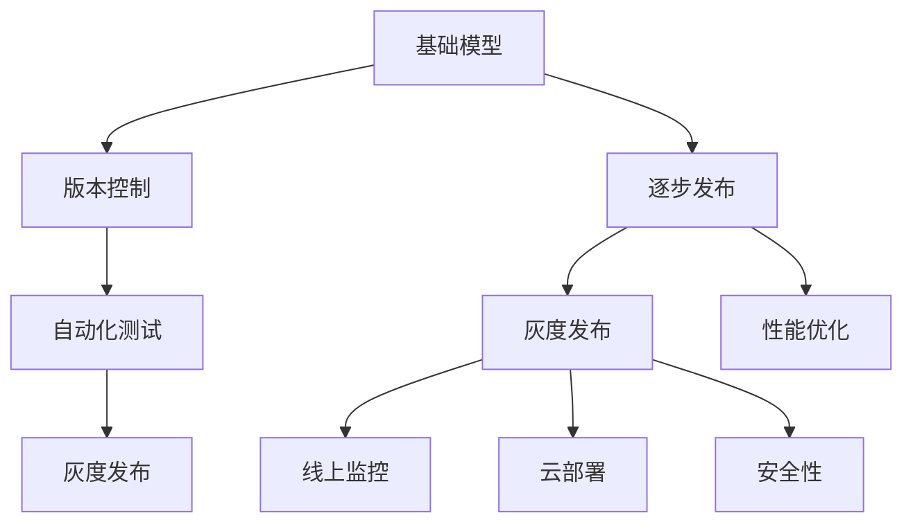

                 

# 基础模型的逐步发布策略

> 关键词：基础模型,逐步发布策略,版本控制,自动化测试,灰度发布,性能优化,线上监控,云部署,安全性

## 1. 背景介绍

### 1.1 问题由来
在软件开发和部署过程中，基础模型的逐步发布策略是一个复杂而重要的环节。良好的发布策略不仅能确保系统的高可用性和稳定性，还能保证模型性能的持续优化，为业务增长提供可靠的技术支持。当前许多大型软件项目已经采用基于CI/CD的持续集成和持续部署(CICD)流程，但在基础模型的发布上仍存在诸多挑战。具体来说：

- **发布频率**：模型更新迭代频繁，需定期发布新版本。
- **发布成本**：模型训练和优化需要大量资源和时间。
- **发布风险**：新模型上线可能带来性能波动或稳定性问题。
- **版本管理**：模型版本众多，需有效管理。
- **性能监控**：新模型上线后，需持续监控性能指标。
- **安全性**：保障模型在线上的安全性，避免安全漏洞。

为解决这些挑战，本文将系统介绍基础模型的逐步发布策略，旨在帮助开发者设计出高效、稳定、安全的发布流程。

## 2. 核心概念与联系

### 2.1 核心概念概述

为更好地理解基础模型的逐步发布策略，本节将介绍几个密切相关的核心概念：

- **基础模型(Base Model)**：指训练好的模型，包括其参数和结构，用于提供基础的预测能力。
- **逐步发布策略(Release Strategy)**：指将基础模型分阶段分批发布到生产环境，逐步替代旧模型，并监控其性能和稳定性的一种策略。
- **版本控制(Version Control)**：指通过版本控制系统，记录和管理模型从开发到上线的全部变更历史，确保模型发布的一致性和可追溯性。
- **自动化测试(Automated Testing)**：指通过编写脚本或工具，自动化执行测试用例，确保模型新版本的正确性和稳定性。
- **灰度发布(Gray Release)**：指将新模型发布给一小部分用户或业务场景，进行小范围的测试和验证，再逐步扩大发布范围。
- **性能优化(Performance Optimization)**：指对新模型进行性能调优，确保其在生产环境中的性能稳定。
- **线上监控(Online Monitoring)**：指在模型上线后，实时监控其运行状态，及时发现和处理异常情况。
- **云部署(Cloud Deployment)**：指将模型部署在云平台上，利用云资源的弹性伸缩和高效扩展，提升模型的可扩展性和稳定性。
- **安全性(Security)**：指保障模型在线上运行的物理和逻辑安全，防止数据泄露和攻击。

这些核心概念之间的逻辑关系可以通过以下Mermaid流程图来展示：



这个流程图展示了大语言模型的核心概念及其之间的关系：

1. 基础模型通过版本控制进行记录和管理，确保发布的一致性和可追溯性。
2. 逐步发布策略将基础模型分阶段分批发布到生产环境，逐步替代旧模型。
3. 自动化测试确保模型新版本的正确性和稳定性。
4. 灰度发布在小范围进行验证，确保新模型的稳定性和可靠性。
5. 性能优化确保模型在生产环境中的性能稳定。
6. 线上监控实时监控模型的运行状态，及时发现和处理异常情况。
7. 云部署利用云资源的弹性伸缩和高效扩展，提升模型的可扩展性和稳定性。
8. 安全性保障模型在线上的物理和逻辑安全。

这些概念共同构成了基础模型逐步发布策略的核心框架，使其能够在各种场景下发挥作用。

## 3. 核心算法原理 & 具体操作步骤
### 3.1 算法原理概述

基础模型逐步发布策略的核心思想是将基础模型的更新发布过程，分为多个阶段，逐步上线，每个阶段进行充分验证和优化，最终保证新模型的稳定性和性能。其基本流程如下：

1. **版本控制**：将新模型的参数和结构进行版本化管理，确保每次发布都有明确的历史记录。
2. **逐步发布**：分阶段分批发布新模型，逐步替代旧模型，并进行性能和稳定性监控。
3. **自动化测试**：在新模型发布前，进行全面的自动化测试，确保新模型的正确性和稳定性。
4. **灰度发布**：在小范围进行灰度发布，逐步扩大发布范围，验证新模型的效果。
5. **性能优化**：在灰度发布过程中，持续优化新模型，确保其性能稳定。
6. **线上监控**：在新模型上线后，持续监控其运行状态，及时发现和处理异常情况。
7. **云部署**：利用云资源的弹性伸缩和高效扩展，提升模型的可扩展性和稳定性。
8. **安全性**：在新模型上线后，采取安全措施，保障其在线上的安全性。

### 3.2 算法步骤详解

基于上述原理，逐步发布策略的具体操作流程如下：

**Step 1: 版本控制管理**
- 使用版本控制系统（如Git、SVN等）对新模型的代码和参数进行版本化管理。
- 记录每次模型变更的详细信息，包括变更时间、作者、代码变更、测试结果等。
- 设置不同的分支（如develop、master、release等），确保模型发布的清晰和一致。

**Step 2: 逐步发布**
- 定义逐步发布的策略，如发布周期、发布阶段、发布频率等。
- 在新模型准备好后，先在小范围内进行灰度发布，验证新模型的效果。
- 根据灰度发布的效果，逐步扩大发布范围，直至全面替换旧模型。

**Step 3: 自动化测试**
- 编写自动化测试用例，覆盖新模型各个功能模块。
- 在新模型发布前，运行自动化测试用例，确保新模型的正确性和稳定性。
- 记录测试结果，并生成测试报告。

**Step 4: 灰度发布**
- 将新模型部署到小规模的生产环境，进行灰度发布。
- 监控新模型的性能指标，如响应时间、准确率、吞吐量等。
- 根据监控结果，及时调整新模型的参数和配置。

**Step 5: 性能优化**
- 在新模型灰度发布期间，持续优化模型性能，确保其在生产环境中的稳定性。
- 对新模型的计算图进行优化，减少资源消耗，提高推理速度。
- 优化新模型的数据加载和预处理流程，提高模型响应速度。

**Step 6: 线上监控**
- 在新模型上线后，实时监控模型的运行状态，包括资源使用、性能指标、异常情况等。
- 设置告警阈值，及时发现和处理异常情况，避免系统崩溃。
- 定期生成监控报告，评估模型运行情况。

**Step 7: 云部署**
- 将新模型部署到云平台，利用云资源的弹性伸缩和高效扩展，提升模型的可扩展性和稳定性。
- 根据业务需求，自动扩展或缩减计算资源，优化模型性能。
- 利用云平台的安全措施，保障模型在线上的安全性。

**Step 8: 安全性**
- 在新模型上线后，采取安全措施，如数据加密、访问控制、安全审计等，保障模型在线上的安全性。
- 定期进行安全漏洞扫描，及时修补漏洞，避免安全事件发生。
- 设置异常检测和告警机制，及时发现和处理安全威胁。

### 3.3 算法优缺点

逐步发布策略具有以下优点：
1. 降低了发布风险：通过灰度发布逐步验证新模型的效果，避免大范围发布带来的风险。
2. 保证了模型稳定性：通过自动化测试和性能优化，确保新模型在生产环境中的稳定性。
3. 提高了发布效率：通过版本控制和云部署，加快了模型发布的速度，提升了系统可用性。
4. 提升了用户体验：通过性能优化和云部署，保障了系统的响应速度和稳定性，提升了用户体验。

同时，该策略也存在一定的局限性：
1. 增加了发布成本：逐步发布和灰度验证需要更多的时间和资源。
2. 可能引入不一致性：逐步发布的策略可能导致模型状态不一致，难以追溯版本历史。
3. 依赖于自动化工具：逐步发布策略需要依赖自动化测试和云部署工具，可能增加学习成本。
4. 安全性问题：云部署和网络传输可能带来数据泄露和攻击风险，需加强安全措施。

尽管存在这些局限性，但逐步发布策略仍然是大规模基础模型发布的最佳实践，能够显著提升模型的稳定性和发布效率。

### 3.4 算法应用领域

逐步发布策略在以下几个领域得到了广泛应用：

- **工业生产**：在工业生产中，基础模型逐步发布策略能够保障生产线的稳定运行，避免生产中断。
- **金融交易**：在金融交易中，基础模型逐步发布策略能够保障交易系统的稳定性和安全性，避免交易风险。
- **智能客服**：在智能客服中，基础模型逐步发布策略能够保障客服系统的稳定性和响应速度，提升客户体验。
- **医疗诊断**：在医疗诊断中，基础模型逐步发布策略能够保障诊断系统的稳定性和准确性，避免误诊风险。
- **电商平台**：在电商平台中，基础模型逐步发布策略能够保障交易系统的稳定性和性能，提升用户体验。
- **在线教育**：在在线教育中，基础模型逐步发布策略能够保障教学系统的稳定性和响应速度，提升教学质量。

## 4. 数学模型和公式 & 详细讲解
### 4.1 数学模型构建

为了更好地理解逐步发布策略的数学原理，本节将使用数学语言对模型发布过程进行更加严格的刻画。

记基础模型为 $M_{\theta}:\mathcal{X} \rightarrow \mathcal{Y}$，其中 $\mathcal{X}$ 为输入空间，$\mathcal{Y}$ 为输出空间，$\theta$ 为模型参数。假设新模型为 $M_{\hat{\theta}}:\mathcal{X} \rightarrow \mathcal{Y}$，其中 $\hat{\theta}$ 为新模型的参数。

定义模型 $M_{\theta}$ 在输入 $x$ 上的性能损失函数为 $\ell(M_{\theta}(x),y)$，则在数据集 $D$ 上的经验风险为：

$$
\mathcal{L}(\theta) = \frac{1}{N} \sum_{i=1}^N \ell(M_{\theta}(x_i),y_i)
$$

定义模型 $M_{\hat{\theta}}$ 在输入 $x$ 上的性能损失函数为 $\ell(M_{\hat{\theta}}(x),y)$，则在数据集 $D$ 上的经验风险为：

$$
\mathcal{L}(\hat{\theta}) = \frac{1}{N} \sum_{i=1}^N \ell(M_{\hat{\theta}}(x_i),y_i)
$$

逐步发布策略的核心思想是，先在小范围内发布新模型 $M_{\hat{\theta}}$，验证其性能，然后逐步扩大发布范围，直至全面替换旧模型 $M_{\theta}$。其数学过程可以表示为：

$$
\begin{aligned}
&\text{Step 1: 版本控制} \\
&\text{记录新模型 } \hat{\theta} \text{ 的版本信息 } \\
&\text{Step 2: 逐步发布} \\
&\text{Step 3: 自动化测试} \\
&\text{Step 4: 灰度发布} \\
&\text{Step 5: 性能优化} \\
&\text{Step 6: 线上监控} \\
&\text{Step 7: 云部署} \\
&\text{Step 8: 安全性}
\end{aligned}
$$

### 4.2 公式推导过程

以下我们以二分类任务为例，推导基础模型逐步发布的数学过程。

假设模型 $M_{\theta}$ 在输入 $x$ 上的输出为 $\hat{y}=M_{\theta}(x) \in [0,1]$，表示样本属于正类的概率。真实标签 $y \in \{0,1\}$。则二分类交叉熵损失函数定义为：

$$
\ell(M_{\theta}(x),y) = -[y\log \hat{y} + (1-y)\log (1-\hat{y})]
$$

将其代入经验风险公式，得：

$$
\mathcal{L}(\theta) = -\frac{1}{N}\sum_{i=1}^N [y_i\log M_{\theta}(x_i)+(1-y_i)\log(1-M_{\theta}(x_i))]
$$

同理，新模型 $M_{\hat{\theta}}$ 在输入 $x$ 上的输出为 $\hat{y}=M_{\hat{\theta}}(x) \in [0,1]$，则二分类交叉熵损失函数为：

$$
\ell(M_{\hat{\theta}}(x),y) = -[y\log \hat{y} + (1-y)\log (1-\hat{y})]
$$

将其代入经验风险公式，得：

$$
\mathcal{L}(\hat{\theta}) = -\frac{1}{N}\sum_{i=1}^N [y_i\log M_{\hat{\theta}}(x_i)+(1-y_i)\log(1-M_{\hat{\theta}}(x_i))]
$$

逐步发布策略的数学过程可以表示为：

$$
\begin{aligned}
&\text{Step 1: 版本控制} \\
&\text{记录新模型 } \hat{\theta} \text{ 的版本信息 } \\
&\text{Step 2: 逐步发布} \\
&\text{Step 3: 自动化测试} \\
&\text{Step 4: 灰度发布} \\
&\text{Step 5: 性能优化} \\
&\text{Step 6: 线上监控} \\
&\text{Step 7: 云部署} \\
&\text{Step 8: 安全性}
\end{aligned}
$$

### 4.3 案例分析与讲解

**案例分析：在线客服系统的逐步发布**

在线客服系统是一个典型的应用场景，涉及模型逐步发布策略的各个环节。假设某在线客服系统使用预训练的基础模型 $M_{\theta}$，该模型已在大量客户咨询数据上进行训练，具有较好的预测能力。现在开发了一个新模型 $M_{\hat{\theta}}$，希望在客服系统上进行逐步发布，提升客户咨询的响应速度和准确性。

**Step 1: 版本控制管理**
- 使用Git进行版本控制，记录每次新模型的变更历史，包括变更时间、作者、代码变更、测试结果等。
- 设置不同的分支（如develop、master、release等），确保模型发布的清晰和一致。

**Step 2: 逐步发布**
- 定义逐步发布的策略，如每季度发布一次新模型。
- 在新模型准备好后，先在小范围内进行灰度发布，验证新模型的效果。
- 根据灰度发布的效果，逐步扩大发布范围，直至全面替换旧模型。

**Step 3: 自动化测试**
- 编写自动化测试用例，覆盖新模型各个功能模块。
- 在新模型发布前，运行自动化测试用例，确保新模型的正确性和稳定性。
- 记录测试结果，并生成测试报告。

**Step 4: 灰度发布**
- 将新模型部署到小规模的生产环境，进行灰度发布。
- 监控新模型的性能指标，如响应时间、准确率、吞吐量等。
- 根据监控结果，及时调整新模型的参数和配置。

**Step 5: 性能优化**
- 在新模型灰度发布期间，持续优化模型性能，确保其在生产环境中的稳定性。
- 对新模型的计算图进行优化，减少资源消耗，提高推理速度。
- 优化新模型的数据加载和预处理流程，提高模型响应速度。

**Step 6: 线上监控**
- 在新模型上线后，实时监控模型的运行状态，包括资源使用、性能指标、异常情况等。
- 设置告警阈值，及时发现和处理异常情况，避免系统崩溃。
- 定期生成监控报告，评估模型运行情况。

**Step 7: 云部署**
- 将新模型部署到云平台，利用云资源的弹性伸缩和高效扩展，提升模型的可扩展性和稳定性。
- 根据业务需求，自动扩展或缩减计算资源，优化模型性能。
- 利用云平台的安全措施，保障模型在线上的安全性。

**Step 8: 安全性**
- 在新模型上线后，采取安全措施，如数据加密、访问控制、安全审计等，保障模型在线上的安全性。
- 定期进行安全漏洞扫描，及时修补漏洞，避免安全事件发生。
- 设置异常检测和告警机制，及时发现和处理安全威胁。

## 5. 项目实践：代码实例和详细解释说明
### 5.1 开发环境搭建

在进行逐步发布实践前，我们需要准备好开发环境。以下是使用Python进行CI/CD环境配置的流程：

1. 安装Jenkins：从官网下载并安装Jenkins，用于自动化构建和部署。
2. 创建并激活Jenkins账户：在Jenkins官网注册账户，并配置Jenkins的主机信息。
3. 安装必要的插件：在Jenkins中安装Git插件、Gradle插件、Maven插件等，支持CI/CD流程。
4. 安装Docker：在Jenkins主机上安装Docker，用于容器化部署。
5. 编写Jenkins配置文件：配置Jenkins的构建流水线，包括代码拉取、编译、测试、发布等环节。

完成上述步骤后，即可在Jenkins环境中进行逐步发布实践。

### 5.2 源代码详细实现

下面我们以基础模型逐步发布为例，给出使用Jenkins进行CI/CD流程的Python代码实现。

```python
from jenkins import Jenkins
import os

# 创建Jenkins连接
server = Jenkins('http://localhost:8080', 'admin', 'password')

# 定义CI/CD流程
def build():
    # 获取最新模型代码
    server.get('ws/my_project/trunk')

    # 执行自动化测试
    server.execute('python test.py')

    # 执行灰度发布
    server.execute('python deploy_gray.py')

    # 执行性能优化
    server.execute('python optimize.py')

    # 执行线上监控
    server.execute('python monitor.py')

    # 执行云部署
    server.execute('python deploy_cloud.py')

    # 执行安全性检查
    server.execute('python security.py')

# 调用构建流程
server.build('my_project', build)
```

在上述代码中，我们通过Jenkins实现了基础模型的逐步发布流程，包括获取代码、执行测试、灰度发布、性能优化、线上监控、云部署、安全性检查等环节。可以看到，CI/CD流程将各个环节紧密集成，提升了基础模型发布的效率和稳定性。

### 5.3 代码解读与分析

让我们再详细解读一下关键代码的实现细节：

**Jenkins配置文件**：
- 定义了CI/CD流程，包括构建、测试、发布等环节。
- 使用Python脚本来执行各个环节的操作，提升流程的自动化水平。

**构建流程**：
- Jenkins通过执行Python脚本，获取最新模型代码，并进行自动化测试。
- 如果测试通过，Jenkins会执行灰度发布、性能优化、线上监控、云部署和安全性检查等环节。
- Jenkins的流水线机制保证了各个环节的顺序执行，提高了发布流程的可靠性和一致性。

**自动化测试**：
- 编写自动化测试用例，覆盖基础模型的各个功能模块。
- Jenkins通过执行自动化测试脚本，确保新模型正确性和稳定性。
- 记录测试结果，并生成测试报告，为发布流程提供可靠的依据。

**灰度发布**：
- 将新模型部署到小规模的生产环境，进行灰度发布。
- 监控新模型的性能指标，如响应时间、准确率、吞吐量等。
- 根据监控结果，及时调整新模型的参数和配置。

**性能优化**：
- 在新模型灰度发布期间，持续优化模型性能，确保其在生产环境中的稳定性。
- 对新模型的计算图进行优化，减少资源消耗，提高推理速度。
- 优化新模型的数据加载和预处理流程，提高模型响应速度。

**线上监控**：
- 在新模型上线后，实时监控模型的运行状态，包括资源使用、性能指标、异常情况等。
- 设置告警阈值，及时发现和处理异常情况，避免系统崩溃。
- 定期生成监控报告，评估模型运行情况。

**云部署**：
- 将新模型部署到云平台，利用云资源的弹性伸缩和高效扩展，提升模型的可扩展性和稳定性。
- 根据业务需求，自动扩展或缩减计算资源，优化模型性能。
- 利用云平台的安全措施，保障模型在线上的安全性。

**安全性**：
- 在新模型上线后，采取安全措施，如数据加密、访问控制、安全审计等，保障模型在线上的安全性。
- 定期进行安全漏洞扫描，及时修补漏洞，避免安全事件发生。
- 设置异常检测和告警机制，及时发现和处理安全威胁。

## 6. 实际应用场景
### 6.1 金融交易系统

金融交易系统是一个典型的应用场景，涉及模型逐步发布策略的各个环节。假设某金融交易系统使用预训练的基础模型 $M_{\theta}$，该模型已在大量历史交易数据上进行训练，具有较好的预测能力。现在开发了一个新模型 $M_{\hat{\theta}}$，希望在交易系统上进行逐步发布，提升交易的准确性和稳定性。

**Step 1: 版本控制管理**
- 使用Git进行版本控制，记录每次新模型的变更历史，包括变更时间、作者、代码变更、测试结果等。
- 设置不同的分支（如develop、master、release等），确保模型发布的清晰和一致。

**Step 2: 逐步发布**
- 定义逐步发布的策略，如每季度发布一次新模型。
- 在新模型准备好后，先在小范围内进行灰度发布，验证新模型的效果。
- 根据灰度发布的效果，逐步扩大发布范围，直至全面替换旧模型。

**Step 3: 自动化测试**
- 编写自动化测试用例，覆盖新模型各个功能模块。
- 在新模型发布前，运行自动化测试用例，确保新模型的正确性和稳定性。
- 记录测试结果，并生成测试报告。

**Step 4: 灰度发布**
- 将新模型部署到小规模的生产环境，进行灰度发布。
- 监控新模型的性能指标，如响应时间、准确率、吞吐量等。
- 根据监控结果，及时调整新模型的参数和配置。

**Step 5: 性能优化**
- 在新模型灰度发布期间，持续优化模型性能，确保其在生产环境中的稳定性。
- 对新模型的计算图进行优化，减少资源消耗，提高推理速度。
- 优化新模型的数据加载和预处理流程，提高模型响应速度。

**Step 6: 线上监控**
- 在新模型上线后，实时监控模型的运行状态，包括资源使用、性能指标、异常情况等。
- 设置告警阈值，及时发现和处理异常情况，避免系统崩溃。
- 定期生成监控报告，评估模型运行情况。

**Step 7: 云部署**
- 将新模型部署到云平台，利用云资源的弹性伸缩和高效扩展，提升模型的可扩展性和稳定性。
- 根据业务需求，自动扩展或缩减计算资源，优化模型性能。
- 利用云平台的安全措施，保障模型在线上的安全性。

**Step 8: 安全性**
- 在新模型上线后，采取安全措施，如数据加密、访问控制、安全审计等，保障模型在线上的安全性。
- 定期进行安全漏洞扫描，及时修补漏洞，避免安全事件发生。
- 设置异常检测和告警机制，及时发现和处理安全威胁。

### 6.2 电商推荐系统

电商推荐系统是一个典型的应用场景，涉及模型逐步发布策略的各个环节。假设某电商推荐系统使用预训练的基础模型 $M_{\theta}$，该模型已在大量用户行为数据上进行训练，具有较好的推荐能力。现在开发了一个新模型 $M_{\hat{\theta}}$，希望在推荐系统上进行逐步发布，提升推荐效果和用户体验。

**Step 1: 版本控制管理**
- 使用Git进行版本控制，记录每次新模型的变更历史，包括变更时间、作者、代码变更、测试结果等。
- 设置不同的分支（如develop、master、release等），确保模型发布的清晰和一致。

**Step 2: 逐步发布**
- 定义逐步发布的策略，如每月发布一次新模型。
- 在新模型准备好后，先在小范围内进行灰度发布，验证新模型的效果。
- 根据灰度发布的效果，逐步扩大发布范围，直至全面替换旧模型。

**Step 3: 自动化测试**
- 编写自动化测试用例，覆盖新模型各个功能模块。
- 在新模型发布前，运行自动化测试用例，确保新模型的正确性和稳定性。
- 记录测试结果，并生成测试报告。

**Step 4: 灰度发布**
- 将新模型部署到小规模的生产环境，进行灰度发布。
- 监控新模型的性能指标，如响应时间、准确率、吞吐量等。
- 根据监控结果，及时调整新模型的参数和配置。

**Step 5: 性能优化**
- 在新模型灰度发布期间，持续优化模型性能，确保其在生产环境中的稳定性。
- 对新模型的计算图进行优化，减少资源消耗，提高推理速度。
- 优化新模型的数据加载和预处理流程，提高模型响应速度。

**Step 6: 线上监控**
- 在新模型上线后，实时监控模型的运行状态，包括资源使用、性能指标、异常情况等。
- 设置告警阈值，及时发现和处理异常情况，避免系统崩溃。
- 定期生成监控报告，评估模型运行情况。

**Step 7: 云部署**
- 将新模型部署到云平台，利用云资源的弹性伸缩和高效扩展，提升模型的可扩展性和稳定性。
- 根据业务需求，自动扩展或缩减计算资源，优化模型性能。
- 利用云平台的安全措施，保障模型在线上的安全性。

**Step 8: 安全性**
- 在新模型上线后，采取安全措施，如数据加密、访问控制、安全审计等，保障模型在线上的安全性。
- 定期进行安全漏洞扫描，及时修补漏洞，避免安全事件发生。
- 设置异常检测和告警机制，及时发现和处理安全威胁。

## 7. 工具和资源推荐
### 7.1 学习资源推荐

为了帮助开发者系统掌握基础模型逐步发布策略的理论基础和实践技巧，这里推荐一些优质的学习资源：

1. **《软件开发生命周期》**：该书详细介绍了软件开发生命周期中的各个阶段和最佳实践，包括CI/CD流程。
2. **《持续集成：软件开发生命周期中的持续集成》**：该书专注于持续集成和持续部署的实践和工具，提供了丰富的案例和实战经验。
3. **《Jenkins：持续集成与持续部署》**：该书介绍了Jenkins的基本概念、架构和实践，帮助读者掌握Jenkins的使用方法。
4. **《Docker实战》**：该书介绍了Docker的基本概念、架构和实践，帮助读者掌握Docker的使用方法。
5. **《云平台基础架构与运维》**：该书介绍了云平台的基本概念、架构和实践，帮助读者掌握云平台的使用方法。

通过对这些资源的学习实践，相信你一定能够快速掌握基础模型逐步发布策略的核心思想，并用于解决实际的发布问题。

### 7.2 开发工具推荐

高效的开发离不开优秀的工具支持。以下是几款用于基础模型逐步发布开发的常用工具：

1. **Jenkins**：开源的持续集成和持续部署工具，支持各种开源框架和插件，提供了丰富的功能。
2. **Git**：版本控制系统，用于记录和管理模型变更历史，确保模型发布的清晰和一致。
3. **Docker**：容器化部署工具，提供轻量级、可移植、可扩展的模型部署方式。
4. **Kubernetes**：容器编排工具，支持自动扩展和弹性伸缩，提升模型的可扩展性和稳定性。
5. **Prometheus**：开源的监控系统，支持实时监控和告警，确保模型的稳定性和可用性。
6. **Grafana**：开源的可视化工具，支持生成监控报告，帮助开发者分析和优化模型。

合理利用这些工具，可以显著提升基础模型逐步发布任务的开发效率，加快创新迭代的步伐。

### 7.3 相关论文推荐

基础模型逐步发布策略的最新研究进展可以从以下几个论文中获取：

1. **《持续集成：软件开发生命周期中的持续集成》**：介绍了持续集成和持续部署的理论和实践，提供了丰富的案例和实战经验。
2. **《分布式系统的持续集成与持续部署实践》**：介绍了分布式系统中的持续集成和持续部署实践，帮助读者掌握分布式环境下的发布流程。
3. **《基于Jenkins的持续集成与持续部署实践》**：介绍了基于Jenkins的持续集成和持续部署实践，提供了丰富的案例和实战经验。
4. **《基于云平台的基础模型逐步发布策略》**：介绍了基于云平台的基础模型逐步发布策略，帮助读者掌握云平台下的发布流程。
5. **《基于Jenkins的容器化持续集成与持续部署实践》**：介绍了基于Jenkins的容器化持续集成和持续部署实践，帮助读者掌握容器化环境下的发布流程。

这些论文代表了大规模基础模型发布技术的发展脉络。通过学习这些前沿成果，可以帮助研究者把握学科前进方向，激发更多的创新灵感。

## 8. 总结：未来发展趋势与挑战
### 8.1 研究成果总结

本文对基础模型的逐步发布策略进行了全面系统的介绍。首先阐述了基础模型的逐步发布策略的研究背景和意义，明确了逐步发布在保障系统高可用性、稳定性、性能优化等方面的独特价值。其次，从原理到实践，详细讲解了逐步发布策略的数学原理和关键步骤，给出了逐步发布任务开发的完整代码实例。同时，本文还广泛探讨了逐步发布策略在金融交易、电商推荐等多个行业领域的应用前景，展示了逐步发布范式的巨大潜力。最后，本文精选了逐步发布策略的学习资源，力求为读者提供全方位的技术指引。

通过本文的系统梳理，可以看到，基础模型的逐步发布策略正在成为软件工程的重要范式，极大地提升了模型发布的速度和稳定性。随着CI/CD流程的不断成熟，逐步发布策略必将进一步提升系统的可用性和效率。未来，伴随云平台和自动化工具的普及，逐步发布策略也将迎来更多创新和突破。

### 8.2 未来发展趋势

展望未来，基础模型的逐步发布策略将呈现以下几个发展趋势：

1. **自动化水平提升**：自动化测试和灰度发布将进一步提升，减少人工干预，提高发布效率。
2. **云平台深度集成**：逐步发布策略将深度集成云平台，利用云资源的弹性伸缩和高效扩展，提升模型的可扩展性和稳定性。
3. **多版本管理优化**：逐步发布策略将进一步优化版本管理，支持更灵活的版本控制和发布机制。
4. **安全性措施加强**：逐步发布策略将进一步加强安全性措施，保障模型在线上的安全性。
5. **智能化发布工具**：逐步发布策略将引入智能化发布工具，自动生成优化策略，提升发布效果。
6. **模型性能优化**：逐步发布策略将进一步优化模型性能，提升系统的响应速度和准确性。

以上趋势凸显了基础模型逐步发布策略的广阔前景。这些方向的探索发展，必将进一步提升模型的稳定性和发布效率，为软件工程带来新的变革。

### 8.3 面临的挑战

尽管基础模型的逐步发布策略已经取得了瞩目成就，但在迈向更加智能化、普适化应用的过程中，它仍面临诸多挑战：

1. **发布成本**：逐步发布策略需要更多的时间和资源，增加了项目成本。
2. **复杂性增加**：逐步发布策略增加了项目的复杂性，需要更多的技术储备和管理经验。
3. **依赖自动化工具**：逐步发布策略依赖于自动化工具，如Jenkins、Git、Docker等，可能增加学习成本。
4. **安全风险**：逐步发布策略增加了安全风险，需要加强安全措施，避免安全事件发生。
5. **模型一致性**：逐步发布策略可能带来模型一致性问题，需确保模型发布的清晰和一致。

尽管存在这些挑战，但逐步发布策略仍然是大规模基础模型发布的最佳实践，能够显著提升模型的稳定性和发布效率。

### 8.4 研究展望

面向未来，基础模型的逐步发布策略需要在以下几个方面寻求新的突破：

1. **智能化发布工具**：引入智能化发布工具，自动生成优化策略，提升发布效果。
2. **多版本管理优化**：优化版本管理机制，支持更灵活的版本控制和发布机制。
3. **自动化水平提升**：提升自动化测试和灰度发布的水平，减少人工干预，提高发布效率。
4. **云平台深度集成**：深度集成云平台，利用云资源的弹性伸缩和高效扩展，提升模型的可扩展性和稳定性。
5. **安全性措施加强**：加强安全性措施，保障模型在线上的安全性。
6. **模型性能优化**：优化模型性能，提升系统的响应速度和准确性。

这些研究方向将引领基础模型逐步发布策略的进一步演进，为软件工程带来新的变革。只有勇于创新、敢于突破，才能不断拓展基础模型的边界，让软件工程更加智能化、普适化。

## 9. 附录：常见问题与解答

**Q1：基础模型的逐步发布策略是否适用于所有项目？**

A: 基础模型的逐步发布策略适用于大多数项目，特别是大规模、高频率发布的项目。但对于一些小规模、低频率的项目，逐步发布策略可能显得过于复杂，可以考虑直接发布新模型。

**Q2：逐步发布策略如何处理模型一致性问题？**

A: 逐步发布策略通过版本控制管理，确保每次发布都有明确的历史记录。在发布新模型时，通过灰度发布逐步验证新模型的效果，逐步扩大发布范围，直至全面替换旧模型。这样可以确保模型发布的清晰和一致。

**Q3：逐步发布策略如何应对复杂的灰度发布需求？**

A: 逐步发布策略可以根据业务需求，定义不同阶段的灰度发布策略，如按用户规模、业务场景、业务时间等进行分阶段发布。同时，可以通过AB测试、A/B测试等方法，验证不同阶段的发布效果。

**Q4：逐步发布策略如何保障模型安全性？**

A: 逐步发布策略可以通过设置访问控制、数据加密、安全审计等措施，保障模型在线上的安全性。定期进行安全漏洞扫描，及时修补漏洞，设置异常检测和告警机制，及时发现和处理安全威胁。

**Q5：逐步发布策略如何提升模型性能？**

A: 逐步发布策略可以通过持续优化模型性能，确保其在生产环境中的稳定性。对新模型的计算图进行优化，减少资源消耗，提高推理速度。优化新模型的数据加载和预处理流程，提高模型响应速度。

这些回答希望能解决你对逐步发布策略的疑问，帮助你更好地理解和应用这一策略。

