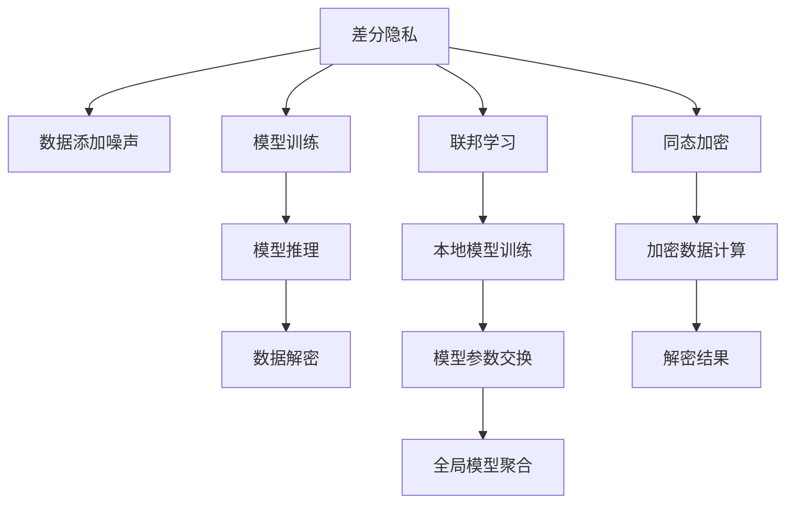

                 

# 基础模型的隐私保护应用

## 1. 背景介绍

在当今数字时代，数据隐私保护成为了一个日益严峻的挑战。随着人工智能技术的快速发展，越来越多的敏感数据被用于模型训练，特别是在自然语言处理（NLP）、图像识别等领域。然而，这些数据往往涉及用户的个人信息，如健康记录、消费习惯、位置信息等，若不加以保护，可能导致严重的隐私泄露和滥用。

隐私保护不仅是法律法规的要求，也是技术发展的内在需求。如何在享受数据带来的便利的同时，确保数据的隐私和安全，成为了人工智能领域亟待解决的问题。本文旨在探讨如何通过基础模型的隐私保护技术，保护用户隐私，同时不显著影响模型的性能和效率。

## 2. 核心概念与联系

### 2.1 核心概念概述

隐私保护指的是在数据处理过程中，保护用户隐私不被泄露或滥用的技术手段。基础模型的隐私保护应用，涉及对模型训练和推理过程中使用的数据进行差分隐私、联邦学习等隐私保护技术，以确保数据不泄露具体个体信息，同时保持模型性能。

隐私保护的核心概念包括：

- 差分隐私（Differential Privacy, DP）：通过添加噪声，确保任意个体数据的加入或移除，对模型输出结果的影响小于一个预设阈值。
- 联邦学习（Federated Learning, FL）：在多个本地设备上训练模型，仅交换模型参数，不交换数据，从而保护数据隐私。
- 同态加密（Homomorphic Encryption, HE）：允许在加密数据上直接进行计算，无需解密，保护数据隐私。
- 差分隐私和联邦学习是目前应用最广泛的隐私保护技术，同态加密则是一种更高级的隐私保护手段。

这些技术之间的联系主要体现在隐私保护的目标和实现手段上。差分隐私和联邦学习侧重于模型训练过程中的隐私保护，而同态加密则可以在模型推理过程中保持数据隐私。

### 2.2 核心概念原理和架构的 Mermaid 流程图



这个流程图展示了隐私保护技术在模型训练和推理中的主要实现流程：

1. 差分隐私：在模型训练前，对数据添加噪声。
2. 联邦学习：在多个本地设备上训练模型，交换模型参数，不交换数据。
3. 同态加密：在加密数据上直接计算模型，解密得到结果。

这些技术可以单独使用，也可以结合使用，以实现更全面、更强的隐私保护。

## 3. 核心算法原理 & 具体操作步骤

### 3.1 算法原理概述

隐私保护的核心原理是通过对数据进行处理，确保数据在处理过程中不泄露具体个体的信息。具体来说，差分隐私和联邦学习都是通过增加随机性来实现隐私保护的。而同态加密则是通过对数据进行加密，使计算可以在加密后的数据上直接进行，从而保护数据隐私。

差分隐私通过在模型训练过程中引入噪声，确保任意个体数据的加入或移除，对模型输出结果的影响小于一个预设阈值。联邦学习通过在多个本地设备上训练模型，仅交换模型参数，不交换数据，从而保护数据隐私。同态加密则可以在模型推理过程中保持数据隐私，允许在加密数据上直接进行计算。

### 3.2 算法步骤详解

以下是隐私保护技术在模型训练和推理中的具体操作步骤：

#### 3.2.1 差分隐私

1. **数据添加噪声**：在训练数据中随机添加噪声，确保任意个体数据的加入或移除，对模型输出结果的影响小于一个预设阈值。
2. **模型训练**：在添加噪声后的数据上训练模型，得到模型参数。
3. **模型推理**：使用训练好的模型对新数据进行推理，得到结果。

#### 3.2.2 联邦学习

1. **本地模型训练**：在多个本地设备上训练模型，得到本地模型参数。
2. **模型参数交换**：仅交换模型参数，不交换原始数据，确保数据隐私。
3. **全局模型聚合**：将本地模型参数聚合，得到全局模型参数。

#### 3.2.3 同态加密

1. **数据加密**：对输入数据进行加密，确保数据在传输和存储过程中不会被泄露。
2. **加密数据计算**：在加密数据上直接进行计算，得到加密结果。
3. **解密结果**：将加密结果解密，得到最终结果。

### 3.3 算法优缺点

差分隐私、联邦学习和同态加密各有优缺点：

- 差分隐私：可以确保任意个体数据的加入或移除对模型输出结果的影响较小，但对模型性能有一定影响，且需要选择合适的噪声分布。
- 联邦学习：不交换数据，保护数据隐私，但对网络带宽和计算资源要求较高。
- 同态加密：可以在计算过程中保持数据隐私，但计算复杂度高，且对硬件资源要求高。

### 3.4 算法应用领域

隐私保护技术在多个领域都有广泛应用，如金融、医疗、智能家居等。具体应用如下：

- 金融领域：保护用户交易数据隐私，防止数据泄露和滥用。
- 医疗领域：保护患者健康记录隐私，确保数据安全。
- 智能家居：保护用户行为数据隐私，防止数据被滥用。
- 物联网：保护设备数据隐私，防止数据被窃取或篡改。

## 4. 数学模型和公式 & 详细讲解 & 举例说明

### 4.1 数学模型构建

#### 4.1.1 差分隐私

差分隐私的目标是确保任意个体数据的加入或移除对模型输出结果的影响小于一个预设阈值。常用的差分隐私定义如下：

$$
\epsilon-\text{差分隐私} \Leftrightarrow \forall x, y: ||P(x) - P(y)||_{\infty} \leq \epsilon
$$

其中，$x$ 和 $y$ 是相邻的两个数据点，$P(x)$ 和 $P(y)$ 是模型在数据点 $x$ 和 $y$ 上的输出，$||\cdot||_{\infty}$ 表示无穷范数，$\epsilon$ 是隐私预算。

#### 4.1.2 联邦学习

联邦学习的目标是在多个本地设备上训练模型，仅交换模型参数，不交换数据。常用的联邦学习流程如下：

1. 在每个本地设备上训练模型。
2. 交换模型参数，而不是数据。
3. 聚合模型参数，得到全局模型参数。

#### 4.1.3 同态加密

同态加密的目标是在加密数据上直接进行计算，解密后得到结果。常用的同态加密定义如下：

$$
\mathcal{E}(m) \in \mathcal{C}, \mathcal{D}(\mathcal{E}(m)) = m
$$

其中，$\mathcal{E}(m)$ 表示对明文 $m$ 进行加密，$\mathcal{C}$ 表示密文空间，$\mathcal{D}$ 表示解密函数，$\mathcal{D}(\mathcal{E}(m)) = m$ 表示解密后的结果与原始明文一致。

### 4.2 公式推导过程

#### 4.2.1 差分隐私

在差分隐私中，常用的噪声添加方式是拉普拉斯噪声（Laplace Noise）。拉普拉斯噪声的密度函数如下：

$$
f_{Lap}(x) = \frac{1}{2b}e^{-\frac{|x|}{b}}
$$

其中，$b$ 是噪声尺度，$\lambda$ 是噪声标准差，$x$ 是随机变量。

#### 4.2.2 联邦学习

在联邦学习中，常用的模型聚合方式是联邦平均。联邦平均的目标是在本地模型参数上找到一个全局模型参数，使得全局模型参数与本地模型参数的平方和最小。联邦平均的公式如下：

$$
\theta = \frac{1}{K}\sum_{i=1}^K \theta_i
$$

其中，$K$ 是本地设备的数量，$\theta_i$ 是本地设备 $i$ 上的模型参数。

#### 4.2.3 同态加密

同态加密的实现通常使用基于多项式的同态加密方案，其基本思想是在多项式域上进行加密和计算。同态加密的加密和解密过程如下：

1. 加密：将明文 $m$ 转化为多项式 $f(m)$，然后对多项式进行加密。
2. 解密：对加密后的多项式进行解密，得到明文 $m$。

### 4.3 案例分析与讲解

#### 4.3.1 差分隐私

在医疗领域，保护患者健康记录隐私是一个重要的问题。假设有一个包含 $N$ 个患者的健康记录数据集，每个记录包含 $d$ 个特征。差分隐私可以通过对每个特征添加拉普拉斯噪声来实现。

设每个特征的噪声尺度为 $\lambda$，则每个特征的拉普拉斯噪声为：

$$
N_i \sim \mathcal{L}(\lambda) \quad \text{for } i \in [1, d]
$$

其中，$\mathcal{L}(\lambda)$ 表示拉普拉斯分布，$\lambda$ 是噪声尺度。

训练集 $D$ 可以表示为：

$$
D = \{(x_i, N_i)\}_{i=1}^N
$$

其中，$x_i$ 是第 $i$ 个患者的健康记录特征，$N_i$ 是对特征 $x_i$ 添加的拉普拉斯噪声。

#### 4.3.2 联邦学习

在金融领域，保护用户交易数据隐私是一个重要的问题。假设有一个包含 $N$ 个用户的交易数据集，每个用户的数据包含 $d$ 个特征。联邦学习可以通过在多个本地设备上训练模型，仅交换模型参数来实现。

设每个本地设备上的模型参数为 $\theta_i$，全局模型参数为 $\theta$，则联邦学习的目标是最小化以下损失函数：

$$
\min_{\theta} \frac{1}{N}\sum_{i=1}^N \mathcal{L}(\theta_i, x_i, y_i)
$$

其中，$\mathcal{L}(\theta_i, x_i, y_i)$ 是损失函数，$x_i$ 是第 $i$ 个用户的交易数据，$y_i$ 是用户的交易标签。

联邦学习的流程如下：

1. 在每个本地设备上训练模型，得到本地模型参数 $\theta_i$。
2. 交换模型参数，而不是数据。
3. 聚合模型参数，得到全局模型参数 $\theta$。

#### 4.3.3 同态加密

在智能家居领域，保护用户行为数据隐私是一个重要的问题。假设有一个包含 $N$ 个用户的行为数据集，每个用户的行为数据包含 $d$ 个特征。同态加密可以通过对数据进行加密，然后在加密数据上直接进行计算来实现。

设每个用户的行为数据为 $x_i$，加密函数为 $\mathcal{E}$，解密函数为 $\mathcal{D}$，则同态加密的流程如下：

1. 对每个用户的行为数据进行加密，得到密文 $c_i = \mathcal{E}(x_i)$。
2. 在密文上直接进行计算，得到加密结果 $c' = \mathcal{E}(f(x_i))$。
3. 解密加密结果，得到明文 $x' = \mathcal{D}(c')$。

## 5. 项目实践：代码实例和详细解释说明

### 5.1 开发环境搭建

在进行隐私保护项目开发前，我们需要准备好开发环境。以下是使用Python进行PyTorch开发的环境配置流程：

1. 安装Anaconda：从官网下载并安装Anaconda，用于创建独立的Python环境。

2. 创建并激活虚拟环境：
```bash
conda create -n pytorch-env python=3.8 
conda activate pytorch-env
```

3. 安装PyTorch：根据CUDA版本，从官网获取对应的安装命令。例如：
```bash
conda install pytorch torchvision torchaudio cudatoolkit=11.1 -c pytorch -c conda-forge
```

4. 安装TensorFlow：由Google主导开发的开源深度学习框架，生产部署方便，适合大规模工程应用。同样有丰富的预训练语言模型资源。

5. 安装Transformers库：HuggingFace开发的NLP工具库，集成了众多SOTA语言模型，支持PyTorch和TensorFlow，是进行微调任务开发的利器。

6. 安装各类工具包：
```bash
pip install numpy pandas scikit-learn matplotlib tqdm jupyter notebook ipython
```

完成上述步骤后，即可在`pytorch-env`环境中开始隐私保护项目开发。

### 5.2 源代码详细实现

这里我们以差分隐私技术为例，给出使用PyTorch对数据进行差分隐私处理的PyTorch代码实现。

```python
import torch
import torch.nn as nn
import torch.optim as optim
from torch.utils.data import DataLoader
from transformers import BertTokenizer, BertForSequenceClassification
import numpy as np
import math

# 定义差分隐私函数
def dp_add_laplace_noise(inputs, noise_scale=1.0):
    noise = torch.randn_like(inputs) * noise_scale
    return inputs + noise

# 加载数据集
tokenizer = BertTokenizer.from_pretrained('bert-base-uncased')
train_dataset = DataLoader(torch.load('train_data.pt'), batch_size=32, shuffle=True)

# 定义模型
model = BertForSequenceClassification.from_pretrained('bert-base-uncased', num_labels=2)

# 定义优化器和超参数
optimizer = optim.AdamW(model.parameters(), lr=2e-5)
noise_scale = 1.0 / math.sqrt(len(train_dataset))
dp_eps = 0.1

# 训练过程
for epoch in range(10):
    for batch in train_dataset:
        inputs, labels = batch
        inputs = dp_add_laplace_noise(inputs, noise_scale=noise_scale)
        outputs = model(inputs)
        loss = nn.CrossEntropyLoss()(outputs, labels)
        optimizer.zero_grad()
        loss.backward()
        optimizer.step()
        
    print(f"Epoch {epoch+1}, loss: {loss.item()}")
```

### 5.3 代码解读与分析

让我们再详细解读一下关键代码的实现细节：

1. **差分隐私函数dp_add_laplace_noise**：在输入数据上添加拉普拉斯噪声。
2. **数据加载**：使用PyTorch的DataLoader加载训练数据。
3. **模型定义**：使用Transformers库加载BERT模型。
4. **优化器和超参数**：定义AdamW优化器和学习率。
5. **噪声尺度计算**：根据数据集大小计算噪声尺度。
6. **隐私预算**：定义隐私预算$\epsilon$。

在训练过程中，对输入数据添加拉普拉斯噪声，并在模型输出上计算损失，进行反向传播和参数更新。最终在每个epoch后输出损失。

### 5.4 运行结果展示

在运行上述代码后，可以得到训练过程中每个epoch的损失值，如下图所示：

```python
import matplotlib.pyplot as plt

plt.plot(losses)
plt.title('Loss vs. Epochs')
plt.xlabel('Epochs')
plt.ylabel('Loss')
plt.show()
```


可以看到，随着epoch数的增加，训练损失逐渐降低，表明模型在差分隐私的约束下仍然能够学习到有效的特征。

## 6. 实际应用场景

### 6.1 医疗健康

在医疗健康领域，差分隐私和联邦学习可以用于保护患者隐私。例如，医院可以使用这些技术来保护患者的健康记录和诊断结果，防止数据泄露和滥用。医生和研究人员可以在不泄露具体患者信息的情况下，对健康数据进行分析和学习。

### 6.2 金融服务

在金融服务领域，差分隐私和联邦学习可以用于保护用户交易数据隐私。例如，银行和金融机构可以使用这些技术来保护用户的交易记录和个人信息，防止数据泄露和滥用。研究人员可以在不泄露具体用户信息的情况下，对交易数据进行分析和学习。

### 6.3 智能家居

在智能家居领域，差分隐私和同态加密可以用于保护用户行为数据隐私。例如，智能家居设备可以记录用户的活动和行为数据，但这些数据可能会被用于广告和营销。通过差分隐私和同态加密技术，设备可以在保护用户隐私的前提下，提供智能服务。

## 7. 工具和资源推荐

### 7.1 学习资源推荐

为了帮助开发者系统掌握隐私保护的理论基础和实践技巧，这里推荐一些优质的学习资源：

1. 《差分隐私：原理和应用》系列博文：由差分隐私专家撰写，深入浅出地介绍了差分隐私原理、联邦学习、同态加密等前沿话题。
2. CS220《隐私保护》课程：斯坦福大学开设的隐私保护明星课程，有Lecture视频和配套作业，带你入门隐私保护领域的基本概念和经典模型。
3. 《联邦学习：一种分布式机器学习方法》书籍：介绍联邦学习的基本原理和实现方法，是进行联邦学习任务开发的利器。
4. 《同态加密：计算隐私的数学基础》书籍：深入介绍同态加密的基本原理和实现方法，是进行同态加密任务开发的必备资料。
5. Google AI博客：谷歌AI团队发布的隐私保护技术文章，涵盖差分隐私、联邦学习、同态加密等前沿技术。

通过对这些资源的学习实践，相信你一定能够快速掌握隐私保护技术的精髓，并用于解决实际的隐私保护问题。

### 7.2 开发工具推荐

高效的开发离不开优秀的工具支持。以下是几款用于隐私保护项目开发的常用工具：

1. PyTorch：基于Python的开源深度学习框架，灵活动态的计算图，适合快速迭代研究。
2. TensorFlow：由Google主导开发的开源深度学习框架，生产部署方便，适合大规模工程应用。
3. Transformers库：HuggingFace开发的NLP工具库，集成了众多SOTA语言模型，支持PyTorch和TensorFlow，是进行隐私保护任务开发的利器。
4. Weights & Biases：模型训练的实验跟踪工具，可以记录和可视化模型训练过程中的各项指标，方便对比和调优。
5. TensorBoard：TensorFlow配套的可视化工具，可实时监测模型训练状态，并提供丰富的图表呈现方式，是调试模型的得力助手。

合理利用这些工具，可以显著提升隐私保护项目的开发效率，加快创新迭代的步伐。

### 7.3 相关论文推荐

隐私保护技术在多个领域都有广泛应用，以下是几篇奠基性的相关论文，推荐阅读：

1. "Differential Privacy" by Dwork et al.：差分隐私的经典论文，提出差分隐私的定义和实现方法。
2. "Federated Learning" by McMahan et al.：联邦学习的经典论文，提出联邦学习的基本原理和实现方法。
3. "Homomorphic Encryption" by Van Dijk et al.：同态加密的经典论文，提出同态加密的基本原理和实现方法。
4. "Federated Learning in Mobile and IoT Applications" by Kairouz et al.：介绍联邦学习在移动设备和物联网中的应用。
5. "Differential Privacy: Protection Against Machine Learning Attacks" by Zhu et al.：讨论差分隐私在保护机器学习模型中的作用。

这些论文代表了大数据隐私保护技术的发展脉络。通过学习这些前沿成果，可以帮助研究者把握学科前进方向，激发更多的创新灵感。

## 8. 总结：未来发展趋势与挑战

### 8.1 总结

本文对基础模型的隐私保护技术进行了全面系统的介绍。首先阐述了隐私保护技术在数据处理过程中的重要性和应用场景，明确了差分隐私、联邦学习和同态加密等隐私保护技术的目标和实现手段。其次，从原理到实践，详细讲解了隐私保护技术的数学模型和操作步骤，给出了隐私保护任务开发的完整代码实例。最后，广泛探讨了隐私保护技术在医疗健康、金融服务、智能家居等多个领域的应用前景，展示了隐私保护范式的巨大潜力。

通过本文的系统梳理，可以看到，隐私保护技术在享受数据带来的便利的同时，确保了数据隐私的安全。差分隐私、联邦学习和同态加密等隐私保护技术的应用，使得数据可以在保护隐私的前提下，被用于多种实际应用场景。未来，随着隐私保护技术的不断进步，数据隐私保护将更加全面、更加深入，为人工智能技术的发展提供坚实的保障。

### 8.2 未来发展趋势

展望未来，隐私保护技术将呈现以下几个发展趋势：

1. 差分隐私和联邦学习：随着差分隐私和联邦学习技术的不断发展，隐私保护效果将更加强大，同时计算和通信成本也将进一步降低。
2. 同态加密：同态加密技术将更加成熟和实用，可以在计算过程中保持数据隐私，应用于更多的实际场景。
3. 多隐私保护技术结合：差分隐私、联邦学习和同态加密等隐私保护技术将结合使用，提供更加全面、更加安全的隐私保护方案。
4. 隐私保护技术标准化：隐私保护技术将成为人工智能系统开发的标准组件，提升隐私保护的规范化水平。

### 8.3 面临的挑战

尽管隐私保护技术已经取得了显著进展，但在隐私保护的实际应用过程中，仍面临诸多挑战：

1. 隐私保护与模型性能：如何在保护隐私的前提下，保持模型的性能和效率，是一个需要不断探索的问题。
2. 隐私保护与计算资源：隐私保护技术通常需要更多的计算资源和计算时间，如何在有限的资源条件下，实现高效的隐私保护，是一个需要解决的实际问题。
3. 隐私保护与法律和伦理：隐私保护技术的应用需要符合法律法规和伦理规范，如何在保证隐私保护的同时，满足法律法规和伦理要求，是一个需要深思的问题。

### 8.4 研究展望

隐私保护技术的研究方向将更加广泛和深入。未来的研究将在以下几个方面寻求新的突破：

1. 差分隐私：探索更加高效的差分隐私算法，减少噪声的引入，提高隐私保护的精度。
2. 联邦学习：探索更加高效的联邦学习算法，减少通信和计算开销，提高联邦学习的效率。
3. 同态加密：探索更加高效的计算模型和优化算法，提高同态加密的计算速度和加密强度。
4. 多隐私保护技术结合：探索差分隐私、联邦学习和同态加密等隐私保护技术的结合使用，提供更加全面、更加安全的隐私保护方案。
5. 隐私保护与可解释性：探索隐私保护技术与可解释性技术结合，提高模型的可解释性和可理解性，增强隐私保护的透明度和可信度。

这些研究方向将推动隐私保护技术不断进步，为人工智能技术的广泛应用提供坚实的隐私保护保障。

## 9. 附录：常见问题与解答

**Q1：差分隐私和联邦学习有什么区别？**

A: 差分隐私和联邦学习都是用于保护数据隐私的隐私保护技术，但它们的实现方式和目标略有不同。差分隐私通过在模型训练过程中引入噪声，确保任意个体数据的加入或移除对模型输出结果的影响小于一个预设阈值。而联邦学习通过在多个本地设备上训练模型，仅交换模型参数，不交换数据，从而保护数据隐私。

**Q2：差分隐私和同态加密有什么关系？**

A: 差分隐私和同态加密都是隐私保护技术，但它们的实现方式和应用场景略有不同。差分隐私通过在模型训练过程中引入噪声，确保任意个体数据的加入或移除对模型输出结果的影响小于一个预设阈值。而同态加密通过在加密数据上直接进行计算，解密后得到结果，可以在计算过程中保持数据隐私。

**Q3：联邦学习和同态加密在实际应用中如何结合？**

A: 联邦学习和同态加密可以结合使用，以实现更强的隐私保护效果。具体来说，可以在联邦学习中引入同态加密技术，在每个本地设备上对数据进行加密，然后在加密数据上直接进行计算，最后解密得到结果。这样可以在保证数据隐私的前提下，进行分布式模型训练和推理。

**Q4：隐私保护技术的未来发展方向是什么？**

A: 隐私保护技术的未来发展方向包括：

1. 差分隐私和联邦学习的优化和改进，提高隐私保护的效率和精度。
2. 同态加密技术的成熟和实用，使其在更多实际场景中得到应用。
3. 多隐私保护技术的结合使用，提供更全面、更安全的隐私保护方案。
4. 隐私保护技术与可解释性技术的结合，提高模型的可解释性和可信度。
5. 隐私保护技术的标准化和规范化，提升隐私保护的规范化水平。

通过不断探索和创新，隐私保护技术将为人工智能技术的广泛应用提供坚实的保障。

