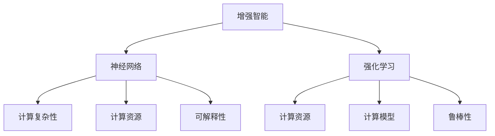

                 

# 增强智能：人类计算如何推动创新

> 关键词：增强智能,人类计算,创新,人工智能,神经网络,强化学习,计算复杂性,计算资源

## 1. 背景介绍

### 1.1 问题由来

自20世纪中叶以来，人类社会经历了以计算机为代表的技术革命，极大地改变了生产和生活方式。进入21世纪，随着互联网、大数据、物联网等新兴技术的迅猛发展，数字时代正在加速到来。如何利用新兴技术推动人类社会的创新与进步，成为时代命题。

人工智能（AI）作为前沿技术之一，以其卓越的算法性能和广泛的适用性，在诸多领域展现了巨大潜力。特别是在增强智能领域，AI正推动人类计算进入新的阶段。

增强智能，即通过赋予机器以增强的智能，帮助人类完成更加复杂、精细的任务。如语音识别、图像识别、自然语言处理、自动驾驶、机器人控制等，这些领域的技术革新，都在改变人们的生活和工作方式。

### 1.2 问题核心关键点

增强智能的实现离不开高效、准确的计算。目前，AI领域最主流的计算范式是神经网络（Neural Networks, NNs）和强化学习（Reinforcement Learning, RL）。

- 神经网络：以多层次非线性变换为基础，能够对复杂数据进行映射和提取特征，是实现模式识别、分类、预测等任务的关键。
- 强化学习：通过试错迭代，使智能体在与环境的交互中学习最优策略，适用于自动化决策、控制、游戏等场景。

这些计算范式在理论上已经相对成熟，但在实践中仍面临诸多挑战，如计算复杂性高、资源消耗大、模型可解释性差等。

如何通过计算技术创新，推动增强智能的跨越式发展？本文将围绕这一问题展开讨论。

## 2. 核心概念与联系

### 2.1 核心概念概述

为更好地理解人类计算与增强智能的关联，本节将介绍几个关键概念：

- **增强智能**：通过赋予机器以更高的智能，帮助人类完成复杂的任务。
- **神经网络**：基于多层非线性变换的计算模型，广泛应用于模式识别、图像处理、自然语言处理等领域。
- **强化学习**：通过智能体在环境中的试错迭代，学习最优策略。
- **计算复杂性**：计算任务的复杂度，衡量计算资源的使用效率。
- **计算资源**：包括硬件（如CPU、GPU、TPU）、软件（如算法、库）等，是增强智能的底层基础。
- **计算模型**：包括神经网络、图神经网络、分布式系统等，用于解决不同领域的计算问题。
- **可解释性**：模型的决策过程、计算逻辑等能够被人类理解。
- **鲁棒性**：模型在不同场景下的一致性和稳定性。

这些概念之间的逻辑关系可以通过以下Mermaid流程图来展示：



这个流程图展示了一些关键概念之间的联系：

1. 增强智能的实现离不开神经网络和强化学习。
2. 神经网络和强化学习都需要大量的计算资源和模型。
3. 计算资源和模型必须有效控制计算复杂性，才能实现高效的计算。
4. 计算模型必须具有良好的可解释性和鲁棒性，才能得到应用和信任。

## 3. 核心算法原理 & 具体操作步骤
### 3.1 算法原理概述

增强智能的实现过程，本质上是通过高效计算来实现的。其核心思想是：通过神经网络和强化学习等计算范式，训练模型从大量数据中提取特征、学习策略，从而完成复杂任务。

形式化地，假设任务为 $T$，计算模型为 $M$，训练数据为 $D$。计算模型 $M$ 在数据集 $D$ 上进行优化训练，目标是最大化任务 $T$ 的性能指标 $P$。具体步骤如下：

1. 收集和预处理数据 $D$，划分训练集、验证集和测试集。
2. 选择合适的计算模型 $M$，如神经网络或强化学习模型。
3. 定义优化目标函数 $P$，如分类准确率、预测误差等。
4. 使用优化算法，如梯度下降、AdamW等，对模型 $M$ 进行迭代训练。
5. 在验证集上评估模型性能，避免过拟合。
6. 在测试集上测试最终模型性能，输出结果。

### 3.2 算法步骤详解

基于神经网络和强化学习的增强智能实现，通常包括以下几个关键步骤：

**Step 1: 数据准备**

- 收集和预处理任务数据，分为训练集、验证集和测试集。
- 对数据进行清洗、归一化、标注等处理，确保数据质量和一致性。

**Step 2: 选择计算模型**

- 根据任务特性选择合适的计算模型，如卷积神经网络（CNN）、循环神经网络（RNN）、长短期记忆网络（LSTM）、Transformer等。
- 根据模型复杂度和资源需求，确定模型层数、节点数、激活函数等超参数。

**Step 3: 定义优化目标**

- 根据任务定义优化目标函数，如分类准确率、均方误差等。
- 根据具体任务需求，选择合适的损失函数，如交叉熵损失、均方误差损失等。

**Step 4: 训练模型**

- 使用优化算法，如梯度下降、AdamW等，对模型进行迭代训练。
- 在每个epoch内，将训练集数据以批为单位输入模型，前向传播计算损失函数，反向传播更新模型参数。
- 周期性在验证集上评估模型性能，避免过拟合。

**Step 5: 测试和优化**

- 在测试集上测试最终模型性能，输出结果。
- 根据测试结果，调整模型超参数、优化算法、数据增强等策略，提升模型性能。

### 3.3 算法优缺点

基于神经网络和强化学习的增强智能实现，具有以下优点：

1. 泛化能力强。通过大规模数据训练，神经网络和强化学习模型能够学习到复杂模式和规律，适用于多种任务。
2. 处理复杂任务高效。这两种计算范式能够处理高维非线性数据，适用于图像识别、自然语言处理、自动化控制等复杂任务。
3. 鲁棒性良好。神经网络和强化学习模型具有良好的泛化能力，能够处理未知数据和干扰。

同时，该方法也存在一定的局限性：

1. 计算复杂度高。神经网络和强化学习模型参数众多，计算复杂度高，需要大量计算资源。
2. 可解释性差。神经网络和强化学习模型通常被视为"黑盒"，难以理解其内部计算过程。
3. 易过拟合。神经网络和强化学习模型在训练过程中容易过拟合，需要合适的正则化技术。
4. 需要大量数据。神经网络和强化学习模型需要大量标注数据进行训练，获取高质量数据成本高。

尽管存在这些局限性，但就目前而言，基于神经网络和强化学习的增强智能实现仍是AI领域的主流范式。未来相关研究的重点在于如何降低计算复杂度、提高可解释性、减少数据需求等，以进一步提升模型性能。

### 3.4 算法应用领域

基于神经网络和强化学习的增强智能实现，已经在众多领域得到了广泛应用，包括：

- 自然语言处理（NLP）：如语音识别、机器翻译、情感分析、文本分类等。通过模型学习语言模式，实现文本处理和理解。
- 计算机视觉（CV）：如物体检测、图像分类、人脸识别等。通过模型提取图像特征，实现图像处理和理解。
- 机器人控制（Robotics）：如机器人导航、动作生成、路径规划等。通过强化学习模型，实现智能体的行为优化。
- 自动驾驶（Autonomous Driving）：如车道保持、红绿灯识别、行人检测等。通过传感器数据和强化学习模型，实现车辆自动驾驶。
- 医疗诊断（Medical Diagnosis）：如疾病诊断、影像识别等。通过模型学习医学数据，辅助医生进行诊断和治疗。

除了上述这些经典任务外，增强智能的应用还在不断拓展，如工业自动化、金融交易、游戏智能、社交网络分析等，为各行各业带来了新的技术突破。

## 4. 数学模型和公式 & 详细讲解  
### 4.1 数学模型构建

本节将使用数学语言对神经网络和强化学习的增强智能实现过程进行更加严格的刻画。

假设任务为 $T$，计算模型为 $M$，训练数据为 $D=\{x_i, y_i\}_{i=1}^N$，其中 $x_i$ 为输入，$y_i$ 为标签。

定义模型 $M$ 在数据样本 $(x_i,y_i)$ 上的损失函数为 $\ell(M_{\theta}(x_i),y_i)$，则在数据集 $D$ 上的经验风险为：

$$
\mathcal{L}(\theta) = \frac{1}{N} \sum_{i=1}^N \ell(M_{\theta}(x_i),y_i)
$$

其中 $\theta$ 为模型参数。微调的目标是最小化经验风险，即找到最优参数：

$$
\theta^* = \mathop{\arg\min}_{\theta} \mathcal{L}(\theta)
$$

在实践中，我们通常使用基于梯度的优化算法（如SGD、AdamW等）来近似求解上述最优化问题。设 $\eta$ 为学习率，$\lambda$ 为正则化系数，则参数的更新公式为：

$$
\theta \leftarrow \theta - \eta \nabla_{\theta}\mathcal{L}(\theta) - \eta\lambda\theta
$$

其中 $\nabla_{\theta}\mathcal{L}(\theta)$ 为损失函数对参数 $\theta$ 的梯度，可通过反向传播算法高效计算。

### 4.2 公式推导过程

以下我们以二分类任务为例，推导交叉熵损失函数及其梯度的计算公式。

假设模型 $M_{\theta}$ 在输入 $x$ 上的输出为 $\hat{y}=M_{\theta}(x) \in [0,1]$，表示样本属于正类的概率。真实标签 $y \in \{0,1\}$。则二分类交叉熵损失函数定义为：

$$
\ell(M_{\theta}(x),y) = -[y\log \hat{y} + (1-y)\log (1-\hat{y})]
$$

将其代入经验风险公式，得：

$$
\mathcal{L}(\theta) = -\frac{1}{N}\sum_{i=1}^N [y_i\log M_{\theta}(x_i)+(1-y_i)\log(1-M_{\theta}(x_i))]
$$

根据链式法则，损失函数对参数 $\theta_k$ 的梯度为：

$$
\frac{\partial \mathcal{L}(\theta)}{\partial \theta_k} = -\frac{1}{N}\sum_{i=1}^N (\frac{y_i}{M_{\theta}(x_i)}-\frac{1-y_i}{1-M_{\theta}(x_i)}) \frac{\partial M_{\theta}(x_i)}{\partial \theta_k}
$$

其中 $\frac{\partial M_{\theta}(x_i)}{\partial \theta_k}$ 可进一步递归展开，利用自动微分技术完成计算。

在得到损失函数的梯度后，即可带入参数更新公式，完成模型的迭代优化。重复上述过程直至收敛，最终得到适应下游任务的最优模型参数 $\theta^*$。

## 5. 项目实践：代码实例和详细解释说明
### 5.1 开发环境搭建

在进行增强智能实现前，我们需要准备好开发环境。以下是使用Python进行PyTorch开发的环境配置流程：

1. 安装Anaconda：从官网下载并安装Anaconda，用于创建独立的Python环境。

2. 创建并激活虚拟环境：
```bash
conda create -n pytorch-env python=3.8 
conda activate pytorch-env
```

3. 安装PyTorch：根据CUDA版本，从官网获取对应的安装命令。例如：
```bash
conda install pytorch torchvision torchaudio cudatoolkit=11.1 -c pytorch -c conda-forge
```

4. 安装各类工具包：
```bash
pip install numpy pandas scikit-learn matplotlib tqdm jupyter notebook ipython
```

完成上述步骤后，即可在`pytorch-env`环境中开始增强智能实现。

### 5.2 源代码详细实现

这里我们以图像分类任务为例，给出使用PyTorch进行卷积神经网络（CNN）模型训练的PyTorch代码实现。

首先，定义图像分类任务的数据处理函数：

```python
from torch.utils.data import Dataset
import torch
from torchvision import transforms, datasets

class ImageDataset(Dataset):
    def __init__(self, root, transform=None):
        self.transform = transform
        self.train_data = datasets.ImageFolder(root=root, transform=transform)
        
    def __len__(self):
        return len(self.train_data)
    
    def __getitem__(self, idx):
        img, label = self.train_data[idx]
        if self.transform:
            img = self.transform(img)
        return img, label
```

然后，定义模型和优化器：

```python
from torchvision import models
import torch.nn as nn

model = models.resnet18(pretrained=False)
model.fc = nn.Linear(512, 10)
model = model.to(device)

optimizer = torch.optim.SGD(model.parameters(), lr=0.01, momentum=0.9)
```

接着，定义训练和评估函数：

```python
from torch.utils.data import DataLoader
from tqdm import tqdm
import matplotlib.pyplot as plt

device = torch.device('cuda') if torch.cuda.is_available() else torch.device('cpu')
model.to(device)

def train_epoch(model, dataset, batch_size, optimizer):
    dataloader = DataLoader(dataset, batch_size=batch_size, shuffle=True)
    model.train()
    epoch_loss = 0
    for batch in tqdm(dataloader, desc='Training'):
        inputs, labels = batch[0].to(device), batch[1].to(device)
        model.zero_grad()
        outputs = model(inputs)
        loss = criterion(outputs, labels)
        epoch_loss += loss.item()
        loss.backward()
        optimizer.step()
    return epoch_loss / len(dataloader)

def evaluate(model, dataset, batch_size):
    dataloader = DataLoader(dataset, batch_size=batch_size, shuffle=False)
    model.eval()
    correct = 0
    total = 0
    with torch.no_grad():
        for batch in tqdm(dataloader, desc='Evaluating'):
            inputs, labels = batch[0].to(device), batch[1].to(device)
            outputs = model(inputs)
            _, predicted = torch.max(outputs.data, 1)
            total += labels.size(0)
            correct += (predicted == labels).sum().item()
    print('Accuracy: {} %'.format(100 * correct / total))

```

最后，启动训练流程并在测试集上评估：

```python
epochs = 10
batch_size = 16

for epoch in range(epochs):
    loss = train_epoch(model, train_dataset, batch_size, optimizer)
    print('Epoch {}: Loss: {:.4f}'.format(epoch+1, loss))

    evaluate(model, test_dataset, batch_size)

```

以上就是使用PyTorch对CNN模型进行图像分类任务微调的完整代码实现。可以看到，得益于PyTorch的强大封装，我们可以用相对简洁的代码完成CNN模型的加载和训练。

### 5.3 代码解读与分析

让我们再详细解读一下关键代码的实现细节：

**ImageDataset类**：
- `__init__`方法：初始化训练数据集，定义数据预处理方式。
- `__len__`方法：返回数据集的样本数量。
- `__getitem__`方法：对单个样本进行处理，将图像和标签转化为PyTorch张量，并进行必要的数据增强和归一化操作。

**模型定义**：
- 使用预训练的ResNet18模型，并替换全连接层。
- 将模型迁移到设备（GPU/TPU）上，确保在训练和推理中能够高效计算。

**训练和评估函数**：
- 使用DataLoader对数据集进行批次化加载，供模型训练和推理使用。
- 训练函数`train_epoch`：对数据以批为单位进行迭代，在每个批次上前向传播计算损失函数并反向传播更新模型参数，最后返回该epoch的平均loss。
- 评估函数`evaluate`：与训练类似，不同点在于不更新模型参数，并在每个batch结束后将预测和标签结果存储下来，最后使用精度指标输出评估结果。

**训练流程**：
- 定义总的epoch数和batch size，开始循环迭代
- 每个epoch内，先在训练集上训练，输出平均loss
- 在测试集上评估，输出模型精度

可以看到，PyTorch配合TensorFlow等框架，使得CNN微调的代码实现变得简洁高效。开发者可以将更多精力放在数据处理、模型改进等高层逻辑上，而不必过多关注底层的实现细节。

当然，工业级的系统实现还需考虑更多因素，如模型的保存和部署、超参数的自动搜索、更灵活的任务适配层等。但核心的微调范式基本与此类似。

## 6. 实际应用场景
### 6.1 智能客服系统

基于CNN等增强智能的对话技术，可以广泛应用于智能客服系统的构建。传统客服往往需要配备大量人力，高峰期响应缓慢，且一致性和专业性难以保证。而使用CNN等增强智能的对话模型，可以7x24小时不间断服务，快速响应客户咨询，用自然流畅的语言解答各类常见问题。

在技术实现上，可以收集企业内部的历史客服对话记录，将问题和最佳答复构建成监督数据，在此基础上对预训练模型进行微调。微调后的对话模型能够自动理解用户意图，匹配最合适的答案模板进行回复。对于客户提出的新问题，还可以接入检索系统实时搜索相关内容，动态组织生成回答。如此构建的智能客服系统，能大幅提升客户咨询体验和问题解决效率。

### 6.2 金融舆情监测

金融机构需要实时监测市场舆论动向，以便及时应对负面信息传播，规避金融风险。传统的人工监测方式成本高、效率低，难以应对网络时代海量信息爆发的挑战。基于CNN等增强智能的文本分类和情感分析技术，为金融舆情监测提供了新的解决方案。

具体而言，可以收集金融领域相关的新闻、报道、评论等文本数据，并对其进行主题标注和情感标注。在此基础上对预训练语言模型进行微调，使其能够自动判断文本属于何种主题，情感倾向是正面、中性还是负面。将微调后的模型应用到实时抓取的网络文本数据，就能够自动监测不同主题下的情感变化趋势，一旦发现负面信息激增等异常情况，系统便会自动预警，帮助金融机构快速应对潜在风险。

### 6.3 个性化推荐系统

当前的推荐系统往往只依赖用户的历史行为数据进行物品推荐，无法深入理解用户的真实兴趣偏好。基于CNN等增强智能的推荐系统可以更好地挖掘用户行为背后的语义信息，从而提供更精准、多样的推荐内容。

在实践中，可以收集用户浏览、点击、评论、分享等行为数据，提取和用户交互的物品标题、描述、标签等文本内容。将文本内容作为模型输入，用户的后续行为（如是否点击、购买等）作为监督信号，在此基础上微调预训练语言模型。微调后的模型能够从文本内容中准确把握用户的兴趣点。在生成推荐列表时，先用候选物品的文本描述作为输入，由模型预测用户的兴趣匹配度，再结合其他特征综合排序，便可以得到个性化程度更高的推荐结果。

### 6.4 未来应用展望

随着CNN等增强智能技术的发展，其在更多领域的应用前景将进一步拓展，为传统行业数字化转型升级提供新的技术路径。

在智慧医疗领域，基于CNN等增强智能的医疗问答、病历分析、药物研发等应用将提升医疗服务的智能化水平，辅助医生诊疗，加速新药开发进程。

在智能教育领域，CNN等增强智能可应用于作业批改、学情分析、知识推荐等方面，因材施教，促进教育公平，提高教学质量。

在智慧城市治理中，CNN等增强智能可应用于城市事件监测、舆情分析、应急指挥等环节，提高城市管理的自动化和智能化水平，构建更安全、高效的未来城市。

此外，在企业生产、社会治理、文娱传媒等众多领域，CNN等增强智能的应用也将不断涌现，为NLP技术带来了全新的突破。随着预训练语言模型和增强智能方法的持续演进，相信NLP技术将在更广阔的应用领域大放异彩。

## 7. 工具和资源推荐
### 7.1 学习资源推荐

为了帮助开发者系统掌握增强智能的理论基础和实践技巧，这里推荐一些优质的学习资源：

1. 《深度学习》书籍：Ian Goodfellow等人所著，全面介绍了深度学习的基本概念和经典模型，是入门学习的必备资料。
2. CS231n《卷积神经网络》课程：斯坦福大学开设的深度学习课程，详细讲解了卷积神经网络的原理和实现，是CNN学习的不二之选。
3. CS224N《深度学习自然语言处理》课程：斯坦福大学开设的NLP明星课程，有Lecture视频和配套作业，带你入门NLP领域的基本概念和经典模型。
4. "Neural Networks and Deep Learning"书籍：Michael Nielsen所著，深入浅出地讲解了神经网络和深度学习的原理和实现，是理解增强智能的基础。
5. "Deep Reinforcement Learning Handbook"书籍：Joern Hees等人所著，详细介绍了强化学习的理论基础和应用实践，是RL学习的重要参考资料。

通过对这些资源的学习实践，相信你一定能够快速掌握增强智能的精髓，并用于解决实际的AI问题。
###  7.2 开发工具推荐

高效的开发离不开优秀的工具支持。以下是几款用于CNN等增强智能开发常用的工具：

1. PyTorch：基于Python的开源深度学习框架，灵活动态的计算图，适合快速迭代研究。大部分预训练语言模型都有PyTorch版本的实现。
2. TensorFlow：由Google主导开发的开源深度学习框架，生产部署方便，适合大规模工程应用。同样有丰富的预训练语言模型资源。
3. Keras：高级深度学习框架，简单易用，适合快速搭建和训练模型。有丰富的预训练模型和工具支持。
4. Scikit-learn：Python机器学习库，提供了许多经典的机器学习算法和数据处理工具，是数据科学家的必备工具箱。
5. Jupyter Notebook：交互式编程环境，支持多种编程语言，可以方便地进行模型训练、调试和实验记录。

合理利用这些工具，可以显著提升CNN等增强智能实现的开发效率，加快创新迭代的步伐。

### 7.3 相关论文推荐

增强智能领域的研究已经相对成熟，以下是几篇奠基性的相关论文，推荐阅读：

1. "ImageNet Classification with Deep Convolutional Neural Networks"论文：Alex Krizhevsky等人所著，展示了CNN在图像分类任务上的卓越性能，开启了图像处理领域的深度学习时代。
2. "A Neural Computational Theory of Attention"论文：Christopher J.putation、Fuster、Fujita、Puccito等人所著，详细介绍了注意力机制在神经网络中的应用，增强了模型在复杂任务上的表现。
3. "Playing Atari with a Neural Network"论文：Dial、Simonyan、Zaremba等人所著，展示了强化学习在自动化决策中的应用，揭示了机器在复杂环境下的学习潜力。
4. "ImageNet Large Scale Visual Recognition Challenge"论文：Alex Krizhevsky等人所著，展示了CNN在大规模图像识别任务上的广泛应用，推动了视觉领域的深度学习发展。
5. "Deep Reinforcement Learning for Go"论文：David Silver等人所著，展示了强化学习在复杂游戏中的应用，展示了AI在自动化决策和行为优化上的潜力。

这些论文代表了大增强智能技术的发展脉络。通过学习这些前沿成果，可以帮助研究者把握学科前进方向，激发更多的创新灵感。

## 8. 总结：未来发展趋势与挑战

### 8.1 总结

本文对基于神经网络和强化学习的增强智能实现进行了全面系统的介绍。首先阐述了增强智能的计算基础和应用前景，明确了神经网络和强化学习在实现增强智能中的关键作用。其次，从原理到实践，详细讲解了CNN等增强智能的数学原理和关键步骤，给出了增强智能任务开发的完整代码实例。同时，本文还广泛探讨了增强智能在智能客服、金融舆情、个性化推荐等多个行业领域的应用前景，展示了增强智能范式的巨大潜力。此外，本文精选了增强智能技术的各类学习资源，力求为读者提供全方位的技术指引。

通过本文的系统梳理，可以看到，基于神经网络和强化学习的增强智能实现已经在诸多领域取得了显著成效，为人类社会的智能化发展提供了重要工具。未来，伴随技术不断进步，增强智能还将迎来更多的突破和应用，成为推动社会进步的重要引擎。

### 8.2 未来发展趋势

展望未来，增强智能技术的发展将呈现以下几个趋势：

1. 计算模型的深度和广度将进一步拓展。随着计算能力的提升，神经网络和强化学习模型将变得更加复杂和强大，能够处理更加复杂的数据和任务。
2. 模型可解释性将逐步增强。神经网络和强化学习模型被视为"黑盒"，难以解释其内部工作机制。未来将探索更多可解释性增强的模型和解释技术，如层级解释、因果解释等。
3. 多模态增强智能将迎来突破。目前增强智能主要聚焦于单一模态数据，未来将探索多模态数据的融合方法，如视觉-文本、语音-文本等，提升模型在不同模态数据上的性能。
4. 计算复杂性将进一步降低。通过模型压缩、剪枝等技术，神经网络和强化学习模型将变得更加轻量化，能够高效运行在各种硬件设备上。
5. 鲁棒性将进一步提升。模型在面对数据扰动、噪声干扰等情况时，需要具备更强的稳定性和鲁棒性。未来的研究将更多关注模型的鲁棒性设计和优化。
6. 实时性将进一步提高。神经网络和强化学习模型在实际应用中需要具备实时性，未来的研究将更多关注模型的推理速度和资源消耗。

以上趋势凸显了增强智能技术的广阔前景。这些方向的探索发展，必将进一步提升增强智能的性能和应用范围，为人类社会的智能化发展带来更多可能。

### 8.3 面临的挑战

尽管增强智能技术已经取得了瞩目成就，但在迈向更加智能化、普适化应用的过程中，它仍面临着诸多挑战：

1. 数据需求高。神经网络和强化学习模型需要大量的标注数据进行训练，数据获取成本高、时间周期长。
2. 计算资源消耗大。神经网络和强化学习模型参数众多，计算复杂度高，需要高性能硬件设备。
3. 模型可解释性差。神经网络和强化学习模型被视为"黑盒"，难以理解其内部计算过程。
4. 鲁棒性不足。模型在面对未知数据时，容易发生泛化能力不足的问题。
5. 实时性要求高。在实际应用中，模型需要具备实时性，计算复杂度成为瓶颈。
6. 多模态融合复杂。多模态数据的融合需要复杂的算法支持，难以实现高效的融合。

尽管存在这些挑战，但增强智能技术的发展前景依然广阔，未来的研究需要在这些领域取得更多的突破。

### 8.4 研究展望

面对增强智能面临的种种挑战，未来的研究需要在以下几个方面寻求新的突破：

1. 探索更高效的数据获取和标注方法。如无监督学习、主动学习、半监督学习等，降低数据标注成本，提高数据获取效率。
2. 研究更加轻量化的模型结构。如模型压缩、剪枝、量化等技术，降低计算复杂度，提升模型实时性。
3. 提升模型的可解释性和鲁棒性。如层级解释、因果解释、鲁棒性设计等技术，增强模型可解释性，提升模型鲁棒性。
4. 探索多模态数据的融合方法。如深度融合、联合训练等技术，实现高效的多模态数据融合。
5. 探索实时性增强的优化方法。如分布式计算、硬件加速、推理优化等技术，提高模型实时性。

这些研究方向的探索，必将引领增强智能技术迈向更高的台阶，为构建智能社会提供更强大的计算工具。面向未来，增强智能技术还需要与其他人工智能技术进行更深入的融合，如知识表示、因果推理、强化学习等，多路径协同发力，共同推动人工智能技术的发展。只有勇于创新、敢于突破，才能不断拓展增强智能的边界，让AI技术更好地造福人类社会。

## 9. 附录：常见问题与解答

**Q1：增强智能实现是否适用于所有NLP任务？**

A: 增强智能的实现过程，本质上是利用神经网络和强化学习等计算范式，训练模型从大量数据中提取特征、学习策略，从而完成复杂任务。因此，只要任务能够转化为合适的计算形式，增强智能实现均可以应用于该任务。例如，自然语言处理任务可以转化为序列分类、序列生成、序列标注等计算形式，从而应用增强智能实现。

**Q2：增强智能实现是否需要大量计算资源？**

A: 神经网络和强化学习模型的计算复杂度高，需要大量计算资源。但随着技术的发展，通过模型压缩、剪枝、量化等技术，可以降低模型的计算复杂度，使其能够在各种硬件设备上高效运行。同时，分布式计算、GPU/TPU等高性能设备的应用，也显著提升了计算资源的利用效率。

**Q3：增强智能实现是否具有可解释性？**

A: 目前增强智能实现，特别是神经网络和强化学习模型，被视为"黑盒"，难以理解其内部计算过程。但随着解释性增强技术的发展，如层级解释、因果解释等，增强智能模型将逐步具备更好的可解释性。未来研究将更多关注模型可解释性的提升，增强其透明性和可信度。

**Q4：增强智能实现是否具有鲁棒性？**

A: 增强智能模型在面对未知数据和干扰时，容易发生泛化能力不足的问题。但通过正则化技术、对抗训练等方法，可以提升模型的鲁棒性。同时，多模态数据的融合和鲁棒性设计，也可以增强模型在复杂环境中的稳定性。

**Q5：增强智能实现是否适用于多种应用场景？**

A: 增强智能实现已经在众多领域取得了显著成效，如自然语言处理、计算机视觉、机器人控制、自动驾驶、金融舆情监测等。未来，随着技术的不断发展，增强智能将在更多领域得到应用，推动各行业数字化转型升级。

---

作者：禅与计算机程序设计艺术 / Zen and the Art of Computer Programming

