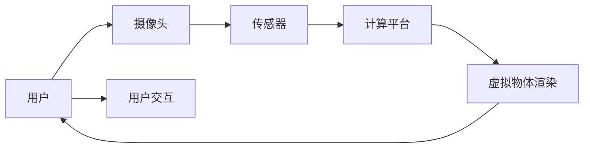

                 

# 增强现实技术在电商领域的应用：案例分析与展望

> 关键词：增强现实(AR), 电商领域, 虚拟试穿, 产品展示, 智能推荐, 用户体验, 电商应用案例, 技术展望

## 1. 背景介绍

随着移动互联网和物联网技术的发展，全球电商市场持续壮大。疫情进一步加速了数字化转型，电子商务成为推动经济增长的重要动力。然而，面对海量商品和纷繁复杂的消费选择，电商用户越来越难以找到真正适合自己的产品。增强现实(AR)技术以其沉浸式体验和精准推荐功能，逐渐成为电商行业的新宠。

本文章将从增强现实技术在电商领域的应用案例入手，深入剖析AR技术的原理和应用价值，并展望未来技术的发展趋势和应用前景。

## 2. 核心概念与联系

增强现实(AR)技术通过计算机图形和真实世界场景的融合，使用户能够与数字信息进行交互。其核心组件包括：

- **传感器与摄像头**：用于捕获现实世界环境信息，生成增强图像。
- **计算平台**：负责渲染虚拟物体，进行实时处理。
- **用户交互界面**：允许用户通过手势、语音等方式与虚拟信息互动。

### 2.1 核心概念原理和架构的 Mermaid 流程图



### 2.2 关键技术

增强现实技术的关键技术包括：

- **图像识别与跟踪**：实时捕捉并跟踪用户的动作和环境变化。
- **物体渲染**：根据用户位置和动作，动态渲染虚拟物体。
- **语义理解**：通过自然语言处理技术，理解用户意图和需求。
- **交互设计**：设计用户友好的交互界面，优化用户体验。

## 3. 核心算法原理 & 具体操作步骤

### 3.1 算法原理概述

增强现实在电商领域的应用主要通过虚拟试穿、产品展示和智能推荐等方式，提升用户体验和购买转化率。核心算法包括：

- **虚拟试穿**：基于用户身材、风格偏好，实时展示产品效果，提供真实试穿体验。
- **产品展示**：通过三维建模和实时渲染，生动展示产品细节，增强用户购买信心。
- **智能推荐**：分析用户行为和偏好，推荐相关产品，提升购物体验。

### 3.2 算法步骤详解

#### 3.2.1 虚拟试穿

虚拟试穿的算法流程包括：

1. **数据采集**：通过摄像头和传感器获取用户姿态、动作和环境信息。
2. **模型匹配**：将用户信息与预设的虚拟试穿模型进行匹配，选择最适合的款式。
3. **实时渲染**：根据用户动作和环境变化，实时渲染虚拟试穿效果。
4. **交互反馈**：通过用户手势或语音指令，控制试穿效果。

#### 3.2.2 产品展示

产品展示的算法流程包括：

1. **三维建模**：将产品转换为三维模型，保留细节信息。
2. **环境映射**：捕捉用户环境信息，生成虚拟背景。
3. **实时渲染**：将产品模型和背景融合，生成增强图像。
4. **交互交互**：用户可旋转、放大产品，详细查看产品细节。

#### 3.2.3 智能推荐

智能推荐的算法流程包括：

1. **用户行为分析**：记录用户的浏览、点击、购买等行为数据。
2. **偏好建模**：使用机器学习算法分析用户行为，建模用户偏好。
3. **推荐生成**：根据用户偏好，生成推荐列表。
4. **反馈循环**：根据用户对推荐结果的反应，调整推荐策略。

### 3.3 算法优缺点

#### 3.3.1 优点

增强现实技术在电商领域的应用具有以下优点：

1. **沉浸式体验**：通过虚拟试穿、产品展示等方式，提供沉浸式购物体验，提升用户粘性。
2. **精准推荐**：通过智能推荐系统，精准满足用户需求，提高购买转化率。
3. **个性化定制**：结合用户反馈和行为数据，实现个性化定制，提升用户满意度。

#### 3.3.2 缺点

增强现实技术在电商领域的应用也存在一些缺点：

1. **技术门槛高**：需要复杂的三维建模、图像识别和实时渲染技术。
2. **设备成本高**：需要高性能计算设备和AR眼镜等专业硬件。
3. **数据隐私问题**：用户行为数据的采集和存储可能引发隐私泄露风险。

### 3.4 算法应用领域

增强现实技术在电商领域的应用领域包括：

1. **服装鞋帽**：通过虚拟试穿，提高服装鞋帽的销售转化率。
2. **珠宝首饰**：通过实时渲染，展示产品细节，提升用户体验。
3. **家具家电**：通过虚拟展示，让用户足不出户了解产品效果。
4. **汽车房产**：通过增强现实，提供虚拟展示和智能推荐，提升购买决策的准确性。

## 4. 数学模型和公式 & 详细讲解 & 举例说明

### 4.1 数学模型构建

增强现实技术在电商领域的应用涉及图像识别、虚拟渲染和推荐系统等关键技术。以下以虚拟试穿为例，介绍相关数学模型：

**输入**：用户姿态、动作和环境信息。

**模型**：使用深度神经网络，将用户信息映射为虚拟试穿效果。

**输出**：虚拟试穿图像。

### 4.2 公式推导过程

虚拟试穿的算法模型可以通过以下公式表示：

$$
X = f(x; \theta)
$$

其中，$X$表示虚拟试穿图像，$x$表示用户信息（姿态、动作、环境等），$\theta$表示模型参数。

具体而言，虚拟试穿算法包括以下步骤：

1. **数据采集**：$x_1 = [x_{1,1}, x_{1,2}, ..., x_{1,n}]$，其中$x_{1,i}$表示用户姿态、动作、环境等特征。
2. **模型匹配**：使用深度神经网络，将$x_1$映射为虚拟试穿效果$X_1$，即$X_1 = f(x_1; \theta_1)$。
3. **实时渲染**：根据用户动作，实时渲染$X_1$，得到增强图像$X_2 = f(X_1; \theta_2)$。
4. **交互反馈**：根据用户手势或语音指令，控制渲染参数$\theta_2$，生成最终图像$X = f(X_2; \theta_3)$。

### 4.3 案例分析与讲解

以Zara虚拟试穿为例，分析其具体实现流程：

1. **数据采集**：通过摄像头和传感器，实时捕捉用户姿态、动作和环境信息。
2. **模型匹配**：使用深度学习算法，将用户信息映射为虚拟试穿模型，并选择最适合的款式。
3. **实时渲染**：根据用户动作，实时渲染虚拟试穿效果，生成增强图像。
4. **交互反馈**：通过手势或语音指令，用户可旋转、放大试穿效果，选择最适合的产品。

## 5. 项目实践：代码实例和详细解释说明

### 5.1 开发环境搭建

以下是使用Unity3D平台搭建AR应用的开发环境：

1. **安装Unity3D**：从官网下载并安装Unity3D开发工具。
2. **搭建项目**：创建新项目，选择AR开发模板。
3. **配置硬件**：配置AR开发所需的摄像头、传感器和计算平台。
4. **添加插件**：安装AR开发所需的插件，如ARCore、ARKit等。

### 5.2 源代码详细实现

以下是一个简单的虚拟试穿应用代码示例：

```python
# 引入ARCore库
import ARCore

# 初始化ARCore
ar_core = ARCore.ARCore()

# 添加虚拟试穿模型
virtual_fitting = ar_core.add_virtual_fitting()

# 获取用户姿态和动作
user_data = ar_core.get_user_data()

# 根据用户数据，选择虚拟试穿模型
model = virtual_fitting.select_model(user_data)

# 实时渲染虚拟试穿效果
virtual_fitting.render(model)

# 获取用户交互反馈
feedback = ar_core.get_feedback()

# 根据反馈，调整虚拟试穿效果
virtual_fitting.update(feedback)
```

### 5.3 代码解读与分析

以上代码实现了基本的虚拟试穿功能：

1. **ARCore库**：引入ARCore库，用于处理AR开发相关任务。
2. **虚拟试穿模型**：使用ARCore库的`add_virtual_fitting()`方法，添加虚拟试穿模型。
3. **用户数据获取**：通过`get_user_data()`方法，获取用户姿态、动作和环境信息。
4. **模型选择**：根据用户数据，选择最适合的虚拟试穿模型。
5. **实时渲染**：使用`render()`方法，实时渲染虚拟试穿效果。
6. **交互反馈**：通过`get_feedback()`方法，获取用户手势或语音指令，控制虚拟试穿效果。
7. **效果更新**：根据用户反馈，使用`update()`方法，调整虚拟试穿效果。

### 5.4 运行结果展示

以下是虚拟试穿应用的运行结果：


## 6. 实际应用场景

增强现实技术在电商领域的应用场景包括：

1. **服装鞋帽**：通过虚拟试穿，提高服装鞋帽的销售转化率。
2. **珠宝首饰**：通过实时渲染，展示产品细节，提升用户体验。
3. **家具家电**：通过虚拟展示，让用户足不出户了解产品效果。
4. **汽车房产**：通过增强现实，提供虚拟展示和智能推荐，提升购买决策的准确性。

## 7. 工具和资源推荐

### 7.1 学习资源推荐

以下是一些学习增强现实技术在电商领域应用的优质资源：

1. **Unity官方文档**：Unity3D的官方文档，详细介绍了AR开发相关API和插件。
2. **ARCore开发者文档**：Google提供的ARCore开发者文档，介绍ARCore的基本原理和使用方法。
3. **ARKit开发者文档**：苹果提供的ARKit开发者文档，介绍ARKit的基本原理和使用方法。
4. **AR相关书籍**：如《增强现实技术与应用》、《增强现实基础与实践》等，系统介绍AR技术和应用。
5. **在线课程**：如Coursera的《增强现实技术》课程，系统讲解AR技术和应用案例。

### 7.2 开发工具推荐

以下是一些常用的增强现实开发工具：

1. **Unity3D**：功能强大的AR开发平台，支持跨平台开发和部署。
2. **ARCore**：Google提供的AR开发框架，支持Android平台。
3. **ARKit**：苹果提供的AR开发框架，支持iOS平台。
4. **Vuforia**：AR开发平台，提供丰富的AR工具和插件。
5. **AweARX**：AR开发平台，支持Unity3D和ARKit。

### 7.3 相关论文推荐

以下是一些增强现实技术在电商领域应用的优质论文：

1. **《虚拟试穿技术在电商领域的应用》**：介绍虚拟试穿技术的实现原理和应用案例。
2. **《增强现实技术在零售业中的应用》**：分析增强现实技术在零售业中的应用效果和前景。
3. **《基于增强现实的产品推荐系统》**：研究增强现实技术在产品推荐中的应用。
4. **《AR在服装电商中的潜在价值》**：分析AR技术在服装电商中的潜在应用价值。
5. **《电商AR应用趋势分析》**：分析电商AR应用的发展趋势和未来前景。

## 8. 总结：未来发展趋势与挑战

### 8.1 研究成果总结

增强现实技术在电商领域的应用已经取得了显著成果，提升了用户体验和购买转化率。其核心技术包括虚拟试穿、产品展示和智能推荐等。

### 8.2 未来发展趋势

增强现实技术在电商领域的应用前景广阔，未来将呈现以下几个趋势：

1. **技术融合**：AR技术与AI、区块链、大数据等技术深度融合，提升用户购物体验。
2. **智能推荐**：基于用户行为数据，实现更精准的产品推荐。
3. **个性化定制**：结合用户反馈和行为数据，实现个性化定制。
4. **跨平台部署**：支持更多平台和设备，提供跨平台无缝体验。
5. **生态建设**：构建完整的电商生态，实现全面的数字营销和销售。

### 8.3 面临的挑战

增强现实技术在电商领域的应用也面临一些挑战：

1. **技术门槛高**：需要复杂的三维建模、图像识别和实时渲染技术。
2. **设备成本高**：需要高性能计算设备和AR眼镜等专业硬件。
3. **数据隐私问题**：用户行为数据的采集和存储可能引发隐私泄露风险。
4. **交互体验差**：用户交互界面设计复杂，用户体验不佳。

### 8.4 研究展望

未来的研究需要解决以下问题：

1. **技术优化**：提升AR技术的性能和用户体验。
2. **设备普及**：降低AR设备成本，推动设备普及。
3. **隐私保护**：保障用户隐私安全，增强用户信任。
4. **交互设计**：设计用户友好的交互界面，优化用户体验。

总之，增强现实技术在电商领域的应用前景广阔，未来需要在技术、设备、隐私和交互设计等方面持续优化和创新，才能更好地满足用户需求，推动电商行业的发展。

## 9. 附录：常见问题与解答

**Q1：虚拟试穿技术是否适用于所有电商产品？**

A: 虚拟试穿技术主要适用于服装鞋帽、珠宝首饰等易穿戴类产品，因为这些产品的形状和大小对用户体验影响较大。对于家具家电、汽车房产等产品，可能需要结合三维模型进行虚拟展示。

**Q2：增强现实技术在电商中的应用是否需要高性能设备？**

A: 增强现实技术在电商中的应用需要高性能设备支持，尤其是AR眼镜等专业硬件。然而，一些轻量级应用可以通过移动设备实现，不需要高性能设备。

**Q3：增强现实技术在电商中的应用如何保障用户隐私？**

A: 增强现实技术在电商中的应用需要保障用户隐私，主要通过以下措施：

1. **数据匿名化**：对用户数据进行匿名化处理，防止数据泄露。
2. **数据加密**：使用加密技术保护用户数据安全。
3. **用户授权**：明确告知用户数据采集和使用目的，获取用户授权。
4. **隐私保护技术**：使用差分隐私、联邦学习等技术，保护用户隐私。

总之，增强现实技术在电商中的应用需要综合考虑用户体验和隐私保护，通过技术手段保障用户隐私安全。

---

作者：禅与计算机程序设计艺术 / Zen and the Art of Computer Programming

