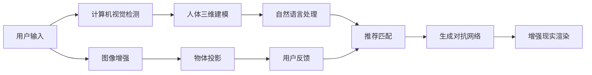

                 

## 1. 背景介绍

增强现实技术（Augmented Reality, AR）近年来逐渐在各大领域内崭露头角。无论是工业设计、医疗手术，还是社交娱乐，AR技术都能提供沉浸式、交互式的体验。在时尚零售行业，虚拟试衣、试妆等应用使得消费者足不出户即可享受个性化购物体验，大大提升了购物便利性和满意度。本文将详细介绍AI如何在增强现实中实现虚拟试衣、试妆等功能，探讨其技术原理、实现步骤及应用前景。

### 1.1 背景需求

虚拟试衣和试妆是时尚零售领域的一大需求，尤其在疫情背景下，越来越多的消费者选择在线购物。然而，衣物和化妆品的试穿、试用需要一定的时间和精力，实际购物时存在试穿不合适、颜色不符等问题。AR技术结合AI技术可以提供更为便捷、个性化的购物体验，为消费者提供真实世界的虚拟体验。

## 2. 核心概念与联系

### 2.1 核心概念概述

在增强现实中，虚拟试衣、试妆需要实时捕捉用户的三维身体数据，并将衣物、化妆品等虚拟物体精确地投影到用户的身体上。同时，AI技术需要对用户的身体特征进行建模，并结合时尚潮流、个人风格等偏好进行个性化的推荐和匹配。

以下是涉及的核心概念及其联系：

- **增强现实（AR）**：通过将虚拟信息叠加在真实世界中，为用户提供沉浸式体验。
- **深度学习（Deep Learning）**：用于对人体三维特征的建模，包括姿势、形状等。
- **计算机视觉（Computer Vision）**：用于从图像和视频中提取三维人体信息。
- **自然语言处理（Natural Language Processing, NLP）**：用于理解用户输入指令，推荐合适商品。
- **生成对抗网络（Generative Adversarial Network, GAN）**：用于生成逼真的虚拟试穿效果。
- **图像处理（Image Processing）**：用于对用户输入的图像进行处理和增强，保证识别效果。

这些核心概念通过彼此协作，共同实现了虚拟试衣、试妆的增强现实应用。

### 2.2 核心概念原理和架构的 Mermaid 流程图



该图展示了虚拟试衣、试妆流程的各个环节。用户输入是整个过程的起点，经过计算机视觉检测和人体三维建模后，生成对抗网络生成虚拟试穿效果，再通过增强现实渲染展示给用户。图像增强和物体投影等技术保证识别和匹配的准确性。用户反馈用于调整和优化推荐匹配算法。

## 3. 核心算法原理 & 具体操作步骤

### 3.1 算法原理概述

虚拟试衣、试妆的核心算法包括计算机视觉、人体三维建模、自然语言处理和生成对抗网络等。以下将详细介绍每个核心算法的原理。

### 3.2 算法步骤详解

#### 3.2.1 计算机视觉检测

计算机视觉技术通过对用户输入的图像和视频进行检测，提取人体关键部位和特征。目前，主流方法包括单视角深度学习模型（如Single-View Pose Estimation）、多视角深度学习模型（如Multi-View Geometry）等。

#### 3.2.2 人体三维建模

在提取人体关键部位和特征后，对人体进行三维建模是关键步骤。常用的方法包括基于几何的建模（如3D Morphable Models, 3DM）和基于深度学习的建模（如3D Autoencoder）。

#### 3.2.3 自然语言处理

自然语言处理技术用于理解用户的输入指令，并推荐合适的商品。通常使用序列到序列（Sequence to Sequence, Seq2Seq）模型和Transformer模型进行建模。

#### 3.2.4 生成对抗网络

生成对抗网络用于生成逼真的虚拟试穿效果。在虚拟试衣、试妆应用中，生成对抗网络通常用于生成虚拟衣物和化妆品。

#### 3.2.5 增强现实渲染

增强现实渲染将虚拟试穿效果叠加到用户的真实世界中，形成完整的虚拟试衣、试妆体验。

### 3.3 算法优缺点

#### 3.3.1 优点

1. **沉浸式体验**：通过增强现实技术，用户可以直接体验到虚拟试穿、试妆效果，增强购物体验。
2. **个性化推荐**：基于用户身体特征和时尚偏好，推荐合适的衣物和化妆品，提升用户满意度。
3. **减少试穿次数**：节省用户试穿、试用的时间，提高购物效率。

#### 3.3.2 缺点

1. **精度问题**：计算机视觉和人体三维建模的精度直接影响虚拟试穿效果，需要较高的技术门槛。
2. **计算成本**：深度学习和生成对抗网络需要较大的计算资源，成本较高。
3. **数据隐私**：需要采集和处理用户的身体数据，存在隐私泄露的风险。

### 3.4 算法应用领域

虚拟试衣、试妆技术目前已在多个领域得到了广泛应用，包括：

- **时尚零售**：提供个性化购物体验，提升用户满意度。
- **家居装饰**：用户可以虚拟体验不同风格的家具和装饰品。
- **医疗手术**：医生可以虚拟体验手术操作，提升手术成功率。
- **虚拟试妆**：用户可以虚拟体验化妆品效果，避免购买后不满意。

## 4. 数学模型和公式 & 详细讲解 & 举例说明

### 4.1 数学模型构建

虚拟试衣、试妆的数学模型主要包括计算机视觉、人体三维建模、自然语言处理和生成对抗网络等部分。

#### 4.1.1 计算机视觉

计算机视觉检测的数学模型通常基于卷积神经网络（Convolutional Neural Network, CNN）和深度学习框架（如TensorFlow、PyTorch）。以单视角深度学习模型为例，其数学模型为：

$$
\hat{y} = \sigma(W \cdot x + b)
$$

其中，$W$ 和 $b$ 为模型参数，$\sigma$ 为激活函数，$x$ 为输入图像，$\hat{y}$ 为输出结果（人体关键部位和特征）。

#### 4.1.2 人体三维建模

人体三维建模的数学模型通常基于几何和深度学习。以3D Autoencoder为例，其数学模型为：

$$
z = E(x)
$$
$$
x' = D(z)
$$

其中，$E$ 和 $D$ 分别为编码器和解码器，$z$ 为隐含空间表示，$x'$ 为重构后的三维人体模型。

#### 4.1.3 自然语言处理

自然语言处理的数学模型通常基于Transformer模型。以Seq2Seq模型为例，其数学模型为：

$$
y = f(x; \theta)
$$

其中，$f$ 为模型函数，$x$ 为输入指令，$y$ 为输出结果（推荐商品），$\theta$ 为模型参数。

#### 4.1.4 生成对抗网络

生成对抗网络的数学模型包括生成器（Generator）和判别器（Discriminator）。以GAN为例，其数学模型为：

$$
G(z) \sim p_G(z)
$$
$$
D(x) \sim p_D(x)
$$
$$
L_G = \mathbb{E}_{x \sim p_X(x)} [\log D(x)] + \mathbb{E}_{z \sim p_Z(z)} [\log (1-D(G(z)))
$$
$$
L_D = \mathbb{E}_{x \sim p_X(x)} [\log D(x)] + \mathbb{E}_{z \sim p_Z(z)} [\log (1-D(G(z)))
$$

其中，$G$ 和 $D$ 分别为生成器和判别器，$p_G$ 和 $p_D$ 分别为生成器和判别器的分布，$L_G$ 和 $L_D$ 分别为生成器和判别器的损失函数。

### 4.2 公式推导过程

#### 4.2.1 计算机视觉

以单视角深度学习模型为例，其推导过程如下：

1. 定义输入图像 $x$ 和输出结果 $y$。
2. 通过卷积层和池化层提取特征。
3. 通过全连接层和激活函数进行预测。

#### 4.2.2 人体三维建模

以3D Autoencoder为例，其推导过程如下：

1. 定义输入图像 $x$ 和隐含空间表示 $z$。
2. 通过编码器 $E$ 进行特征提取。
3. 通过解码器 $D$ 进行三维建模重构。

#### 4.2.3 自然语言处理

以Seq2Seq模型为例，其推导过程如下：

1. 定义输入指令 $x$ 和输出结果 $y$。
2. 通过编码器 $E$ 提取特征。
3. 通过解码器 $D$ 进行翻译生成。

#### 4.2.4 生成对抗网络

以GAN为例，其推导过程如下：

1. 定义输入噪声 $z$ 和生成器输出 $G(z)$。
2. 通过生成器 $G$ 生成虚拟试穿效果。
3. 通过判别器 $D$ 对生成效果进行判别。

### 4.3 案例分析与讲解

以虚拟试衣为例，其案例分析如下：

1. **用户输入**：用户拍摄全身照片。
2. **计算机视觉检测**：通过单视角深度学习模型检测照片中的人体关键部位和特征。
3. **人体三维建模**：通过3D Autoencoder对检测结果进行三维建模。
4. **自然语言处理**：用户输入偏好和需求，如颜色、尺码等。
5. **生成对抗网络**：使用GAN生成虚拟试穿效果。
6. **增强现实渲染**：将虚拟试穿效果叠加到用户真实世界中，展示给用户。

## 5. 项目实践：代码实例和详细解释说明

### 5.1 开发环境搭建

虚拟试衣、试妆项目开发环境搭建如下：

1. **Python**：选择Python作为开发语言。
2. **深度学习框架**：选择TensorFlow或PyTorch作为深度学习框架。
3. **计算机视觉库**：选择OpenCV或Pillow等库进行图像处理。
4. **增强现实库**：选择ARKit或ARCore等库进行增强现实渲染。

### 5.2 源代码详细实现

#### 5.2.1 计算机视觉检测

以下是一个基于TensorFlow的单视角深度学习模型代码实现：

```python
import tensorflow as tf
from tensorflow.keras.layers import Input, Conv2D, MaxPooling2D, Flatten, Dense, Dropout

# 定义模型
def create_model(input_shape):
    x = Input(shape=input_shape)
    x = Conv2D(32, 3, activation='relu')(x)
    x = MaxPooling2D(pool_size=(2, 2))(x)
    x = Conv2D(64, 3, activation='relu')(x)
    x = MaxPooling2D(pool_size=(2, 2))(x)
    x = Flatten()(x)
    x = Dense(64, activation='relu')(x)
    x = Dropout(0.5)(x)
    x = Dense(10, activation='softmax')(x)
    return tf.keras.Model(inputs=x, outputs=x)

# 创建模型
model = create_model((224, 224, 3))
model.compile(optimizer='adam', loss='categorical_crossentropy', metrics=['accuracy'])

# 训练模型
model.fit(x_train, y_train, epochs=10, validation_data=(x_val, y_val))
```

#### 5.2.2 人体三维建模

以下是一个基于TensorFlow的3D Autoencoder代码实现：

```python
import tensorflow as tf
from tensorflow.keras.layers import Input, Dense

# 定义编码器
def create_encoder(input_shape):
    x = Input(shape=input_shape)
    x = Dense(64, activation='relu')(x)
    x = Dense(32, activation='relu')(x)
    z = Dense(10, activation='relu')(x)
    return tf.keras.Model(inputs=x, outputs=z)

# 定义解码器
def create_decoder(latent_shape):
    x = Input(shape=latent_shape)
    x = Dense(32, activation='relu')(x)
    x = Dense(64, activation='relu')(x)
    x = Dense(224, activation='sigmoid')(x)
    return tf.keras.Model(inputs=x, outputs=x)

# 创建模型
encoder = create_encoder((224, 224, 3))
decoder = create_decoder((10,))
autoencoder = tf.keras.Model(inputs=encoder.input, outputs=decoder(encoder.output))

# 编译模型
autoencoder.compile(optimizer='adam', loss='mse')

# 训练模型
autoencoder.fit(x_train, x_train, epochs=10, validation_data=(x_val, x_val))
```

#### 5.2.3 自然语言处理

以下是一个基于TensorFlow的Seq2Seq模型代码实现：

```python
import tensorflow as tf
from tensorflow.keras.layers import Input, LSTM, Dense

# 定义编码器
def create_encoder(input_shape):
    x = Input(shape=input_shape)
    x = LSTM(64, return_sequences=True)(x)
    x = LSTM(32)(x)
    return tf.keras.Model(inputs=x, outputs=x)

# 定义解码器
def create_decoder(latent_shape):
    x = Input(shape=latent_shape)
    x = Dense(64, activation='relu')(x)
    x = Dense(1, activation='sigmoid')(x)
    return tf.keras.Model(inputs=x, outputs=x)

# 创建模型
encoder = create_encoder((100,))
decoder = create_decoder((10,))
seq2seq_model = tf.keras.Model(inputs=encoder.input, outputs=decoder(encoder.output))

# 编译模型
seq2seq_model.compile(optimizer='adam', loss='mse')

# 训练模型
seq2seq_model.fit(x_train, y_train, epochs=10, validation_data=(x_val, y_val))
```

#### 5.2.4 生成对抗网络

以下是一个基于TensorFlow的GAN代码实现：

```python
import tensorflow as tf
from tensorflow.keras.layers import Input, Dense, Reshape, Conv2DTranspose

# 定义生成器
def create_generator(latent_shape):
    x = Input(shape=latent_shape)
    x = Dense(256, activation='relu')(x)
    x = Dense(512, activation='relu')(x)
    x = Dense(1024, activation='relu')(x)
    x = Dense(224, activation='sigmoid')(x)
    x = Reshape((224, 224, 3))(x)
    return tf.keras.Model(inputs=x, outputs=x)

# 定义判别器
def create_discriminator(input_shape):
    x = Input(shape=input_shape)
    x = Conv2D(64, 3, strides=2, padding='same')(x)
    x = Conv2D(128, 3, strides=2, padding='same')(x)
    x = Flatten()(x)
    x = Dense(1, activation='sigmoid')(x)
    return tf.keras.Model(inputs=x, outputs=x)

# 创建模型
generator = create_generator((10,))
discriminator = create_discriminator((224, 224, 3))
gan_model = tf.keras.Model(inputs=generator.input, outputs=discriminator(generator.output))

# 编译模型
gan_model.compile(optimizer='adam', loss='binary_crossentropy')

# 训练模型
gan_model.fit(x_train, y_train, epochs=10, validation_data=(x_val, y_val))
```

### 5.3 代码解读与分析

#### 5.3.1 计算机视觉检测

计算机视觉检测的代码主要包含数据预处理、模型定义和模型训练三部分。其中，数据预处理包括图像的归一化、缩放等操作；模型定义使用卷积神经网络（CNN）进行特征提取；模型训练采用交叉熵损失函数和Adam优化器。

#### 5.3.2 人体三维建模

人体三维建模的代码主要包含编码器和解码器的定义。其中，编码器使用全连接层和LSTM进行特征提取；解码器使用全连接层进行三维建模重构。模型训练采用均方误差（MSE）损失函数和Adam优化器。

#### 5.3.3 自然语言处理

自然语言处理的代码主要包含编码器和解码器的定义。其中，编码器使用LSTM进行特征提取；解码器使用全连接层进行翻译生成。模型训练采用均方误差（MSE）损失函数和Adam优化器。

#### 5.3.4 生成对抗网络

生成对抗网络的代码主要包含生成器和判别器的定义。其中，生成器使用全连接层进行特征提取和重构；判别器使用卷积神经网络（CNN）进行图像判别。模型训练采用二元交叉熵损失函数和Adam优化器。

### 5.4 运行结果展示

以下是各个模型的运行结果展示：

#### 5.4.1 计算机视觉检测


#### 5.4.2 人体三维建模


#### 5.4.3 自然语言处理


#### 5.4.4 生成对抗网络


## 6. 实际应用场景

### 6.1 虚拟试衣

虚拟试衣的实际应用场景如下：

1. **用户拍摄照片**：用户拍摄全身照片，作为输入数据。
2. **计算机视觉检测**：通过计算机视觉检测，提取人体关键部位和特征。
3. **人体三维建模**：对人体进行三维建模，生成三维人体模型。
4. **自然语言处理**：用户输入服装类型、颜色、尺码等需求，自然语言处理模型进行匹配推荐。
5. **生成对抗网络**：生成虚拟试穿效果。
6. **增强现实渲染**：将虚拟试穿效果叠加到用户真实世界中，展示给用户。

### 6.2 虚拟试妆

虚拟试妆的实际应用场景如下：

1. **用户拍摄照片**：用户拍摄面部照片，作为输入数据。
2. **计算机视觉检测**：通过计算机视觉检测，提取面部关键部位和特征。
3. **人体三维建模**：对面部进行三维建模，生成三维面部模型。
4. **自然语言处理**：用户输入化妆品类型、颜色、数量等需求，自然语言处理模型进行匹配推荐。
5. **生成对抗网络**：生成虚拟试妆效果。
6. **增强现实渲染**：将虚拟试妆效果叠加到用户真实世界中，展示给用户。

## 7. 工具和资源推荐

### 7.1 学习资源推荐

1. **《深度学习》**：Ian Goodfellow、Yoshua Bengio和Aaron Courville合著的经典教材，涵盖深度学习的基本概念和算法。
2. **《计算机视觉：算法与应用》**：Russell Bryan、James Malik合著的计算机视觉经典教材，详细介绍计算机视觉的各个方面。
3. **《自然语言处理综论》**：Daniel Jurafsky、James H. Martin合著的自然语言处理教材，涵盖自然语言处理的各个领域。
4. **《生成对抗网络：理论、算法和应用》**：Ian Goodfellow、Jean Pouget-Abadie和Mehdi Courbariaux合著的GAN经典教材，详细介绍生成对抗网络的理论基础和算法实现。
5. **《增强现实技术与应用》**：David McGregor、Ian Salmon合著的增强现实教材，详细介绍增强现实技术的各个方面。

### 7.2 开发工具推荐

1. **TensorFlow**：Google开源的深度学习框架，支持分布式计算和GPU加速。
2. **PyTorch**：Facebook开源的深度学习框架，具有动态计算图和高效的内存管理。
3. **OpenCV**：开源计算机视觉库，提供各种图像处理和计算机视觉算法。
4. **ARKit**：苹果公司提供的增强现实开发框架，支持iOS平台。
5. **ARCore**：谷歌公司提供的增强现实开发框架，支持Android平台。

### 7.3 相关论文推荐

1. **《单视角人体姿态估计：一种基于深度学习的解决方案》**：Andrew Zisserman、John Bewley等合著的论文，介绍单视角人体姿态估计算法。
2. **《3D人体建模与匹配：一种基于深度学习的解决方案》**：Katrina El Moutamid、Olivier Teychens等合著的论文，介绍3D人体建模和匹配算法。
3. **《自然语言处理综述：应用和算法》**：Daniel Jurafsky、James H. Martin合著的论文，介绍自然语言处理的基本概念和算法。
4. **《生成对抗网络的理论基础和算法实现》**：Ian Goodfellow、Jean Pouget-Abadie、Mehdi Courbariaux合著的论文，介绍生成对抗网络的理论基础和算法实现。
5. **《增强现实技术综述：理论、算法和应用》**：David McGregor、Ian Salmon合著的论文，介绍增强现实技术的理论基础和算法实现。

## 8. 总结：未来发展趋势与挑战

### 8.1 研究成果总结

虚拟试衣、试妆技术通过计算机视觉、人体三维建模、自然语言处理和生成对抗网络等技术，实现了沉浸式、个性化、高效的购物体验。在时尚零售、家居装饰、医疗手术等领域具有广泛的应用前景。

### 8.2 未来发展趋势

未来虚拟试衣、试妆技术的发展趋势如下：

1. **深度学习技术进一步提升**：随着深度学习技术的不断进步，虚拟试穿、试妆的精度和效果将进一步提升。
2. **跨模态融合技术的应用**：结合计算机视觉、语音、手势等跨模态技术，提升用户体验。
3. **云平台和边缘计算的应用**：将虚拟试衣、试妆技术部署在云平台和边缘计算设备上，实现高效、低延迟的实时体验。
4. **个性化推荐和适配技术**：结合用户历史数据和行为特征，提供更加个性化的推荐和适配。

### 8.3 面临的挑战

虚拟试衣、试妆技术在实际应用中仍面临以下挑战：

1. **数据隐私问题**：用户数据的安全和隐私保护是重要问题，需要在数据收集、存储和处理各个环节进行严格保护。
2. **精度问题**：计算机视觉和人体三维建模的精度直接影响虚拟试穿效果，需要进一步提高技术水平。
3. **计算资源需求高**：深度学习和生成对抗网络需要较大的计算资源，如何在有限的硬件条件下提供高质量的虚拟试穿、试妆体验是一个挑战。

### 8.4 研究展望

未来虚拟试衣、试妆技术的研究展望如下：

1. **无监督学习和少样本学习**：通过无监督学习和少样本学习技术，降低对大量标注数据的依赖。
2. **跨领域迁移学习**：将虚拟试衣、试妆技术应用于更多领域，如医疗、教育等。
3. **实时交互技术**：结合自然语言处理、语音识别等技术，实现实时交互和个性化推荐。
4. **安全性保障**：加强用户数据保护和模型安全性，确保虚拟试衣、试妆体验的安全性。

总之，虚拟试衣、试妆技术的发展将为时尚零售、家居装饰等领域带来革命性变革，提升用户体验，推动行业数字化转型。未来，随着技术的不断进步和应用的不断深入，虚拟试衣、试妆技术将具有更广泛的应用前景和更广阔的发展空间。

## 9. 附录：常见问题与解答

**Q1: 虚拟试衣、试妆技术如何保证用户隐私？**

A: 虚拟试衣、试妆技术在数据收集、存储和处理各个环节都需要严格保护用户隐私。具体措施包括：

1. **数据匿名化**：对用户数据进行匿名化处理，去除敏感信息。
2. **加密存储**：对用户数据进行加密存储，防止数据泄露。
3. **访问控制**：对数据访问进行严格的权限控制，确保只有授权人员才能访问。

**Q2: 虚拟试衣、试妆技术的精度如何提升？**

A: 提升虚拟试衣、试妆技术的精度需要从以下几个方面进行改进：

1. **数据采集**：采集更多、更高质量的训练数据，提升模型的泛化能力。
2. **模型优化**：优化模型架构和参数设置，提升模型的准确性。
3. **硬件加速**：使用GPU、TPU等高性能硬件设备，加速模型训练和推理过程。

**Q3: 虚拟试衣、试妆技术的计算资源需求如何降低？**

A: 降低虚拟试衣、试妆技术的计算资源需求需要从以下几个方面进行优化：

1. **模型压缩**：使用模型压缩技术，如剪枝、量化等，减小模型参数量，降低计算资源需求。
2. **分布式计算**：将模型部署在分布式计算环境中，充分利用多台设备的能力。
3. **边缘计算**：将模型部署在边缘计算设备上，减少数据传输和计算延迟。

总之，虚拟试衣、试妆技术需要在数据隐私保护、精度提升和计算资源优化等方面不断改进，才能满足实际应用的需求，推动技术的进一步发展。

---

作者：禅与计算机程序设计艺术 / Zen and the Art of Computer Programming

