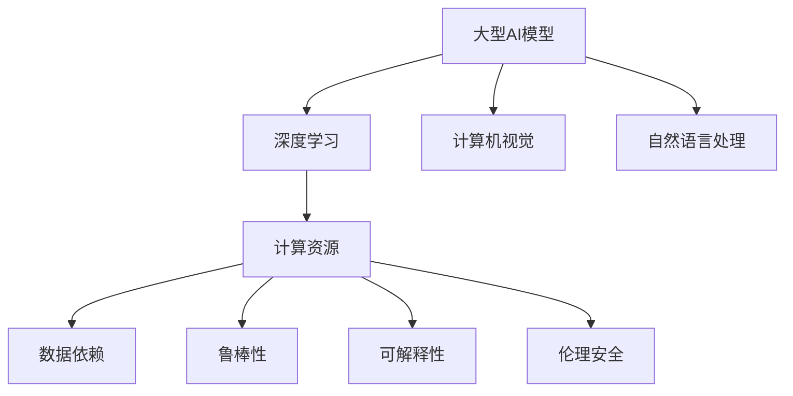

                 

# 大型AI模型的优势与局限性分析

> 关键词：大型AI模型,优势,局限性,深度学习,计算机视觉,自然语言处理

## 1. 背景介绍

### 1.1 问题由来
随着深度学习技术的迅猛发展，大型AI模型（Large AI Models）在计算机视觉、自然语言处理（NLP）等领域取得了巨大成功。这些模型通常由数亿甚至数十亿个参数组成，具备强大的数据拟合能力，可以应用于复杂多变的应用场景。然而，大型AI模型在实际应用中也暴露出了诸多局限性，这些问题不仅影响模型的性能，也带来了伦理和安全上的隐患。

### 1.2 问题核心关键点
本文将从模型的优势和局限性两方面对大型AI模型进行分析，探讨其在实际应用中的表现及其背后的原因。主要包括以下几个核心问题：

1. **优势**：大型AI模型在数据拟合能力、泛化性能、通用性等方面的优势。
2. **局限性**：计算资源消耗、数据依赖、鲁棒性、可解释性、伦理安全等方面的挑战。

## 2. 核心概念与联系

### 2.1 核心概念概述

为更好地理解大型AI模型，本节将介绍几个核心概念及其相互联系：

- **大型AI模型**：指具有数亿至数十亿个参数的深度神经网络模型，如ResNet、BERT、GPT等。这些模型通过大规模数据训练，能够学习到丰富的特征表示，具备强大的数据拟合和泛化能力。

- **深度学习**：一种利用多层次非线性变换构建复杂模型的机器学习方法，通过反向传播算法优化模型参数，从而提升模型的拟合能力。

- **计算机视觉**：指使用AI模型处理和理解图像和视频数据，包括目标检测、图像分割、人脸识别等任务。

- **自然语言处理**：指使用AI模型处理和理解文本数据，包括语言模型、文本分类、机器翻译、情感分析等任务。

- **计算资源**：指模型训练和推理所需的硬件资源，包括CPU、GPU、TPU等。

- **数据依赖**：指模型性能高度依赖于训练数据的质量和数量，缺乏泛化能力的数据会导致模型性能下降。

- **鲁棒性**：指模型对输入数据微小变化的不变性和稳定性，鲁棒性差的模型容易受到噪声或对抗样本的影响。

- **可解释性**：指模型的决策过程是否可理解、可解释，有助于增强模型的可信度和安全性。

- **伦理安全**：指模型在决策过程中的公平性、透明性和安全性，避免算法偏见和有害输出。

这些概念之间的逻辑关系可以通过以下Mermaid流程图来展示：



这个流程图展示了大型AI模型的核心概念及其相互关联，有助于理解其在实际应用中的表现和局限性。

## 3. 核心算法原理 & 具体操作步骤
### 3.1 算法原理概述

大型AI模型的优势在于其强大的数据拟合能力和泛化性能，主要依赖于以下几个方面：

1. **参数量**：模型通过大量的参数拟合输入数据的复杂结构，从而能够捕捉数据中的细微特征。
2. **深度结构**：通过多层次的深度结构，模型能够处理复杂的多维度输入数据。
3. **大规模训练**：通过在大量数据上的训练，模型能够学习到广泛的特征表示，从而提高泛化能力。

### 3.2 算法步骤详解

大型AI模型的训练过程主要包括以下步骤：

1. **数据准备**：收集和清洗大量标注数据，作为模型的训练集。
2. **模型选择**：选择合适的模型架构，如卷积神经网络（CNN）、循环神经网络（RNN）、Transformer等。
3. **模型训练**：使用反向传播算法优化模型参数，最小化损失函数。
4. **模型评估**：在验证集上评估模型性能，避免过拟合。
5. **模型优化**：根据评估结果调整模型超参数，如学习率、批大小等。
6. **模型部署**：将训练好的模型部署到实际应用中，进行推理和预测。

### 3.3 算法优缺点

#### 优点

- **强大的数据拟合能力**：大型AI模型通过大量参数能够捕捉数据中的细微特征，从而提高模型的拟合能力。
- **泛化性能**：通过在大量数据上的训练，模型能够学习到广泛的特征表示，从而提高泛化能力。
- **通用性**：大型AI模型可以应用于多种任务，如计算机视觉、自然语言处理、语音识别等。
- **自动化**：模型训练过程自动化程度高，可以减少人工干预，提高效率。

#### 缺点

- **计算资源消耗大**：模型参数量庞大，需要大量的计算资源进行训练和推理。
- **数据依赖性强**：模型性能高度依赖于训练数据的质量和数量，缺乏泛化能力的数据会导致模型性能下降。
- **鲁棒性差**：模型容易受到噪声和对抗样本的影响，泛化能力不足。
- **可解释性差**：大型AI模型的决策过程复杂，难以理解和解释。
- **伦理安全问题**：模型可能存在偏见和有害输出，引发伦理和法律问题。

### 3.4 算法应用领域

大型AI模型在计算机视觉、自然语言处理、语音识别、推荐系统等多个领域都有广泛应用，具体如下：

- **计算机视觉**：如目标检测、图像分割、人脸识别等。
- **自然语言处理**：如语言模型、文本分类、机器翻译、情感分析等。
- **语音识别**：如语音转文本、语音合成等。
- **推荐系统**：如电商推荐、内容推荐等。

## 4. 数学模型和公式 & 详细讲解 & 举例说明

### 4.1 数学模型构建

假设我们有一个大型AI模型 $M$，其结构如图1所示：


图1: 大型AI模型结构图

模型 $M$ 可以表示为：

$$ M(x) = \sum_i a_i \cdot g(\sum_j w_{ij} \cdot x_j + b_i) $$

其中 $x$ 是输入数据，$a_i$ 是第 $i$ 层的激活值，$w_{ij}$ 是连接第 $i$ 层和第 $j$ 层的权重矩阵，$b_i$ 是第 $i$ 层的偏置项，$g$ 是激活函数，如ReLU、Sigmoid等。

### 4.2 公式推导过程

以一个简单的图像分类任务为例，模型的目标是最小化损失函数 $L$，如图2所示：


图2: 损失函数图

损失函数 $L$ 可以表示为：

$$ L = -\sum_i y_i \log M(x_i) - (1-y_i) \log (1-M(x_i)) $$

其中 $y_i$ 是第 $i$ 个样本的标签，$M(x_i)$ 是模型对输入 $x_i$ 的预测。

模型 $M$ 的参数优化过程可以通过梯度下降算法实现：

$$ \theta \leftarrow \theta - \eta \nabla_{\theta}L(\theta) $$

其中 $\eta$ 是学习率，$\nabla_{\theta}L(\theta)$ 是损失函数对模型参数 $\theta$ 的梯度。

### 4.3 案例分析与讲解

以BERT模型为例，分析其在NLP任务中的应用：

BERT模型是一种预训练语言模型，通过在大规模无标签文本数据上进行预训练，学习到丰富的语言知识。其核心在于将输入数据分成多个位置向量，通过多个层级进行编码，得到每个位置的表示向量。

以文本分类任务为例，将文本输入BERT模型，通过多个层级的编码，最终得到文本的表示向量。然后通过线性分类器对向量进行分类，如图3所示：


图3: BERT模型结构图

## 5. 项目实践：代码实例和详细解释说明

### 5.1 开发环境搭建

在进行大型AI模型实践前，我们需要准备好开发环境。以下是使用Python进行TensorFlow开发的环境配置流程：

1. 安装Anaconda：从官网下载并安装Anaconda，用于创建独立的Python环境。

2. 创建并激活虚拟环境：
```bash
conda create -n tf-env python=3.8 
conda activate tf-env
```

3. 安装TensorFlow：根据CUDA版本，从官网获取对应的安装命令。例如：
```bash
conda install tensorflow -c pytorch
```

4. 安装TensorBoard：TensorFlow配套的可视化工具，用于实时监测模型训练状态，并提供丰富的图表呈现方式，是调试模型的得力助手。

5. 安装Keras：Keras是一个高级神经网络API，可用于构建和训练各种深度学习模型。

6. 安装其它依赖：
```bash
pip install numpy pandas scikit-learn matplotlib tqdm jupyter notebook ipython
```

完成上述步骤后，即可在`tf-env`环境中开始大型AI模型的实践。

### 5.2 源代码详细实现

以下是使用TensorFlow实现大型AI模型的简单代码示例：

```python
import tensorflow as tf
from tensorflow.keras import layers

# 定义模型结构
model = tf.keras.Sequential([
    layers.Dense(64, activation='relu', input_shape=(784,)),
    layers.Dense(10)
])

# 编译模型
model.compile(optimizer=tf.keras.optimizers.Adam(0.001), loss=tf.keras.losses.CategoricalCrossentropy(), metrics=['accuracy'])

# 训练模型
model.fit(x_train, y_train, epochs=10, batch_size=32, validation_data=(x_test, y_test))
```

### 5.3 代码解读与分析

**Sequential模型**：
- `layers.Dense(64, activation='relu', input_shape=(784,))`：定义一个全连接层，输入维度为784，输出维度为64，激活函数为ReLU。
- `layers.Dense(10)`：定义输出层，输出维度为10。

**编译模型**：
- `model.compile(optimizer=tf.keras.optimizers.Adam(0.001), loss=tf.keras.losses.CategoricalCrossentropy(), metrics=['accuracy'])`：编译模型，指定优化器为Adam，损失函数为CategoricalCrossentropy，评估指标为准确率。

**训练模型**：
- `model.fit(x_train, y_train, epochs=10, batch_size=32, validation_data=(x_test, y_test))`：训练模型，指定训练集和验证集，迭代10次，每次迭代批量大小为32。

## 6. 实际应用场景

### 6.1 计算机视觉

大型AI模型在计算机视觉领域有广泛应用，如图像分类、目标检测、人脸识别等。

- **图像分类**：如ResNet、Inception等模型，通过多层次卷积结构，学习图像的复杂特征表示。
- **目标检测**：如Faster R-CNN、YOLO等模型，通过多尺度卷积和锚点机制，检测图像中的目标物体。
- **人脸识别**：如FaceNet、DeepFace等模型，通过人脸编码和特征比对，实现人脸识别和验证。

### 6.2 自然语言处理

大型AI模型在自然语言处理领域也有广泛应用，如语言模型、文本分类、机器翻译、情感分析等。

- **语言模型**：如BERT、GPT等模型，通过预训练和微调，学习语言的深度表示。
- **文本分类**：如TextCNN、LSTM等模型，通过多层次结构，分类文本的情感极性。
- **机器翻译**：如Seq2Seq模型、Transformer等模型，通过编码器-解码器结构，实现文本的翻译。
- **情感分析**：如BERT-Emotion等模型，通过情感标注数据，训练情感分类器。

### 6.3 语音识别

大型AI模型在语音识别领域也有广泛应用，如语音转文本、语音合成等。

- **语音转文本**：如WaveNet、Tacotron等模型，通过卷积和RNN结构，实现语音的特征提取和转录。
- **语音合成**：如TTS模型，通过生成对抗网络（GAN）等结构，实现语音的合成和生成。

### 6.4 未来应用展望

随着大型AI模型的不断发展，其在多个领域的应用也将不断拓展，具体如下：

- **自动驾驶**：通过计算机视觉和深度学习技术，实现自动驾驶中的目标检测、车道识别、交通信号灯识别等。
- **医疗诊断**：通过医学影像处理和深度学习技术，实现疾病的早期诊断、影像分析等。
- **金融风控**：通过自然语言处理和深度学习技术，实现风险评估、信用评分等。
- **智能家居**：通过语音识别和自然语言处理技术，实现智能家居的语音控制、场景识别等。

## 7. 工具和资源推荐

### 7.1 学习资源推荐

为了帮助开发者系统掌握大型AI模型的理论基础和实践技巧，这里推荐一些优质的学习资源：

1. **《深度学习》书籍**：由Ian Goodfellow、Yoshua Bengio、Aaron Courville等作者合著，全面介绍了深度学习的理论基础和实践应用。
2. **Coursera深度学习课程**：由Andrew Ng教授主讲，涵盖深度学习的各个方面，包括神经网络、卷积神经网络、循环神经网络等。
3. **PyTorch官方文档**：PyTorch的官方文档，提供了详细的API和代码示例，是PyTorch学习的必备资料。
4. **TensorFlow官方文档**：TensorFlow的官方文档，提供了详细的API和代码示例，是TensorFlow学习的必备资料。
5. **Keras官方文档**：Keras的官方文档，提供了详细的API和代码示例，是Keras学习的必备资料。

通过对这些资源的学习实践，相信你一定能够快速掌握大型AI模型的精髓，并用于解决实际的AI问题。

### 7.2 开发工具推荐

高效的开发离不开优秀的工具支持。以下是几款用于大型AI模型开发的工具：

1. **PyTorch**：基于Python的开源深度学习框架，灵活动态的计算图，适合快速迭代研究。
2. **TensorFlow**：由Google主导开发的开源深度学习框架，生产部署方便，适合大规模工程应用。
3. **Keras**：高级神经网络API，可用于构建和训练各种深度学习模型，简单易用。
4. **TensorBoard**：TensorFlow配套的可视化工具，可实时监测模型训练状态，并提供丰富的图表呈现方式。
5. **MXNet**：由Amazon开发的开源深度学习框架，支持多种编程语言，高效灵活。
6. **Caffe**：由Berkeley Vision and Learning Center开发的深度学习框架，适合图像处理和计算机视觉应用。

合理利用这些工具，可以显著提升大型AI模型开发效率，加快创新迭代的步伐。

### 7.3 相关论文推荐

大型AI模型和深度学习的研究源于学界的持续研究。以下是几篇奠基性的相关论文，推荐阅读：

1. **ImageNet Classification with Deep Convolutional Neural Networks**：Alex Krizhevsky等作者，提出卷积神经网络（CNN）在ImageNet数据集上取得优异成绩，奠定了计算机视觉的基础。
2. **BERT: Pre-training of Deep Bidirectional Transformers for Language Understanding**：Jacob Devlin等作者，提出BERT模型，引入基于掩码的自监督预训练任务，刷新了多项NLP任务SOTA。
3. **Google's Automatic Speech Recognition System**：John Denyseau等作者，提出使用深度学习实现语音识别，显著提升识别准确率。
4. **Attention Is All You Need**：Ashish Vaswani等作者，提出Transformer结构，开启NLP领域的预训练大模型时代。
5. **Natural Language Processing (almost) for Free**：Andrew Ng等作者，提出使用深度学习实现自然语言处理任务，推动NLP技术的发展。

这些论文代表了大AI模型和深度学习的发展脉络。通过学习这些前沿成果，可以帮助研究者把握学科前进方向，激发更多的创新灵感。

## 8. 总结：未来发展趋势与挑战

### 8.1 总结

本文对大型AI模型的优势与局限性进行了全面系统的分析。首先从模型的优势和局限性两方面，阐述了大型AI模型在数据拟合能力、泛化性能、通用性等方面的表现，以及计算资源消耗、数据依赖、鲁棒性、可解释性、伦理安全等方面的挑战。其次，从原理到实践，详细讲解了大型AI模型的训练过程和具体步骤，给出了大型AI模型的代码实现和解释分析。最后，探讨了大型AI模型在计算机视觉、自然语言处理、语音识别等领域的实际应用，以及未来的发展趋势和挑战。

通过本文的系统梳理，可以看到，大型AI模型在实际应用中有着巨大的优势和潜力，但也面临着诸多局限性和挑战。未来需要结合计算资源、数据质量、模型架构、训练策略等多方面因素，不断改进和优化大型AI模型的性能和可靠性。

### 8.2 未来发展趋势

展望未来，大型AI模型将呈现以下几个发展趋势：

1. **参数量持续增大**：随着算力成本的下降和数据规模的扩张，大型AI模型的参数量还将持续增长，带来更强的数据拟合能力和泛化性能。
2. **模型架构不断改进**：模型架构将更加复杂和多样化，引入更多的模块化和可解释性，提升模型的可维护性和可解释性。
3. **数据质量提升**：数据标注和处理技术的进步，将提高数据的质量和多样性，进一步提升模型的性能。
4. **计算资源优化**：计算资源的优化技术，如模型压缩、分布式训练、混合精度训练等，将提升模型的训练和推理效率。
5. **模型可解释性增强**：模型的可解释性将得到更多重视，引入更多的解释性技术和方法，提升模型的可信度和安全性。
6. **伦理安全性保障**：模型的伦理安全性将得到更多关注，引入更多的公平性、透明性技术，确保模型的公平性和安全性。

这些趋势将推动大型AI模型向更高的性能和可靠性迈进，为人类认知智能的进化带来深刻影响。

### 8.3 面临的挑战

尽管大型AI模型在多个领域取得了巨大成功，但在迈向更加智能化、普适化应用的过程中，仍面临诸多挑战：

1. **计算资源瓶颈**：模型参数量庞大，需要大量的计算资源进行训练和推理。如何优化计算资源，提升模型效率，是未来的一个重要挑战。
2. **数据依赖性强**：模型性能高度依赖于训练数据的质量和数量，缺乏泛化能力的数据会导致模型性能下降。如何提高数据质量，减少数据依赖，是未来的一个关键问题。
3. **鲁棒性不足**：模型容易受到噪声和对抗样本的影响，泛化能力不足。如何提高模型的鲁棒性，避免灾难性遗忘，是未来的一个重要研究方向。
4. **可解释性差**：大型AI模型的决策过程复杂，难以理解和解释。如何提升模型的可解释性，增强模型的可信度和安全性，是未来的一个重要研究方向。
5. **伦理安全问题**：模型可能存在偏见和有害输出，引发伦理和法律问题。如何确保模型的公平性、透明性，避免算法偏见和有害输出，是未来的一个重要研究方向。

这些挑战将伴随着大型AI模型的发展不断出现，需要学术界和产业界共同努力，才能推动大型AI模型向更高的性能和可靠性迈进。

### 8.4 研究展望

面向未来，大型AI模型的研究可以从以下几个方向进行探索：

1. **无监督和半监督学习**：探索无监督和半监督学习方法，摆脱对大规模标注数据的依赖，利用自监督学习、主动学习等方法，提高模型的泛化能力和数据利用率。
2. **参数高效和计算高效的微调方法**：开发更加参数高效的微调方法，如Prefix-Tuning、LoRA等，在固定大部分预训练参数的同时，只更新极少量的任务相关参数，提高模型的效率。
3. **融合因果和对比学习范式**：引入因果推断和对比学习思想，增强模型的因果关系能力和泛化能力，学习更加普适、鲁棒的语言表征。
4. **引入更多先验知识**：将符号化的先验知识，如知识图谱、逻辑规则等，与神经网络模型进行融合，提升模型的知识和推理能力。
5. **结合因果分析和博弈论工具**：将因果分析方法引入模型，识别出模型决策的关键特征，增强输出解释的因果性和逻辑性。借助博弈论工具刻画人机交互过程，主动探索并规避模型的脆弱点，提高系统稳定性。
6. **纳入伦理道德约束**：在模型训练目标中引入伦理导向的评估指标，过滤和惩罚有偏见、有害的输出倾向。加强人工干预和审核，建立模型行为的监管机制，确保输出符合人类价值观和伦理道德。

这些研究方向将推动大型AI模型向更高的性能和可靠性迈进，为构建安全、可靠、可解释、可控的智能系统铺平道路。

## 9. 附录：常见问题与解答

**Q1：大型AI模型在实际应用中需要考虑哪些因素？**

A: 大型AI模型在实际应用中需要考虑以下因素：

1. **计算资源**：模型参数量庞大，需要大量的计算资源进行训练和推理。
2. **数据依赖性**：模型性能高度依赖于训练数据的质量和数量，缺乏泛化能力的数据会导致模型性能下降。
3. **鲁棒性**：模型容易受到噪声和对抗样本的影响，泛化能力不足。
4. **可解释性**：大型AI模型的决策过程复杂，难以理解和解释。
5. **伦理安全性**：模型可能存在偏见和有害输出，引发伦理和法律问题。

**Q2：如何优化大型AI模型的训练过程？**

A: 优化大型AI模型的训练过程可以从以下几个方面进行：

1. **数据预处理**：对输入数据进行清洗、增强和标准化处理，提高数据质量。
2. **模型架构设计**：选择合适的模型架构，引入更多的模块化和可解释性，提升模型的可维护性和可解释性。
3. **超参数调优**：调整模型的超参数，如学习率、批大小、优化器等，优化模型的训练过程。
4. **计算资源优化**：使用计算资源优化技术，如模型压缩、分布式训练、混合精度训练等，提升模型的训练和推理效率。
5. **模型验证**：在训练过程中进行模型验证，及时发现和解决模型的过拟合和欠拟合问题。
6. **模型部署**：将训练好的模型部署到实际应用中，进行推理和预测，优化模型的部署效率。

**Q3：如何提高大型AI模型的泛化能力？**

A: 提高大型AI模型的泛化能力可以从以下几个方面进行：

1. **数据多样性**：收集和处理更多样化的数据，提高模型的泛化能力。
2. **数据增强**：通过对训练数据进行扩充、增强和变换，提高模型的泛化能力。
3. **模型正则化**：使用L2正则、Dropout等技术，防止模型过拟合，提高模型的泛化能力。
4. **模型集成**：将多个模型的预测结果进行集成，提高模型的泛化能力。
5. **模型迁移学习**：将模型在一种任务上学习到的知识，迁移到其他任务上，提高模型的泛化能力。

**Q4：如何提升大型AI模型的可解释性？**

A: 提升大型AI模型的可解释性可以从以下几个方面进行：

1. **模型可视化**：使用可视化工具，展示模型的内部结构和特征表示。
2. **特征重要性分析**：通过特征重要性分析技术，评估模型中各个特征的贡献度。
3. **模型简化**：通过模型简化技术，减少模型参数和结构复杂度，提高模型的可解释性。
4. **解释性模型**：引入解释性模型，如决策树、规则模型等，提高模型的可解释性。
5. **交互式解释**：使用交互式解释技术，让用户能够动态查询和理解模型的预测过程。

**Q5：如何确保大型AI模型的伦理安全性？**

A: 确保大型AI模型的伦理安全性可以从以下几个方面进行：

1. **公平性分析**：使用公平性分析技术，评估模型中存在的不公平性。
2. **透明性评估**：使用透明性评估技术，评估模型的决策过程和结果的可解释性。
3. **算法偏见检测**：使用算法偏见检测技术，检测模型中的偏见和歧视性。
4. **隐私保护**：使用隐私保护技术，保护用户数据隐私和模型训练数据的安全。
5. **伦理监管**：建立模型行为的监管机制，确保模型的公平性、透明性和安全性。

**Q6：如何优化大型AI模型的推理效率？**

A: 优化大型AI模型的推理效率可以从以下几个方面进行：

1. **模型剪枝**：使用模型剪枝技术，去除不必要的参数和结构，提高模型的推理效率。
2. **量化加速**：将浮点模型转为定点模型，压缩存储空间，提高计算效率。
3. **推理优化**：使用推理优化技术，如快速索引、数据加载优化等，提升模型的推理速度。
4. **分布式推理**：使用分布式推理技术，将推理任务分配到多个设备上，提高推理效率。
5. **模型压缩**：使用模型压缩技术，如知识蒸馏、剪枝、量化等，提高模型的推理效率。

这些研究方向将推动大型AI模型向更高的性能和可靠性迈进，为构建安全、可靠、可解释、可控的智能系统铺平道路。

---

作者：禅与计算机程序设计艺术 / Zen and the Art of Computer Programming

