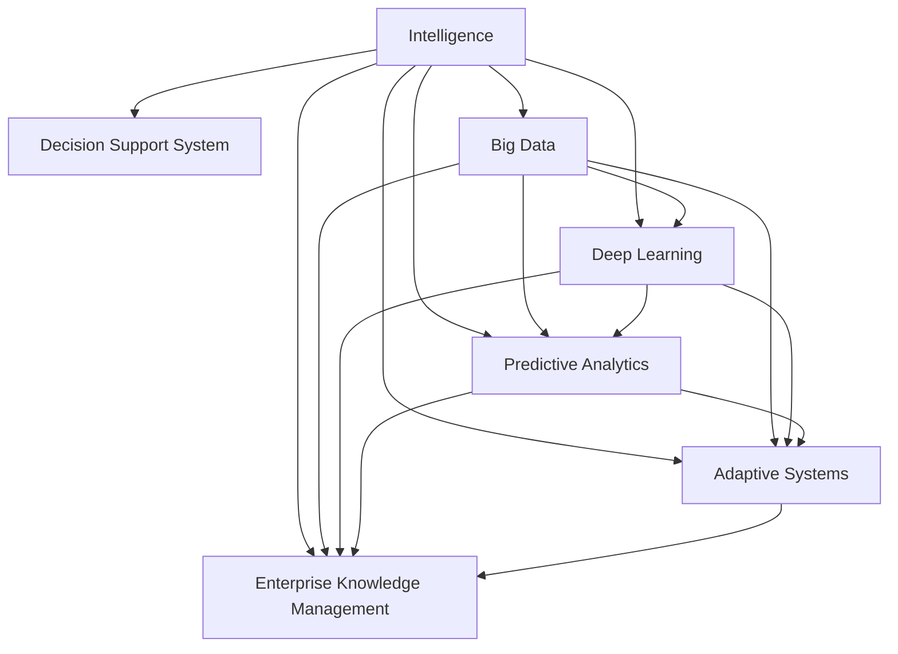

                 

# 大模型在智能决策支持系统中的应用

> 关键词：智能决策支持系统(IDSS), 大模型, 数据驱动, 预测分析, 模型优化, 工业应用

## 1. 背景介绍

### 1.1 问题由来

在当今快速变化的商业环境中，企业决策者面对着海量复杂的数据和信息，需要及时、准确地做出决策。传统的数据分析方法依赖于人工提取特征、手工构建模型，耗时耗力且易出错。随着数据科学和人工智能技术的兴起，基于大模型的智能决策支持系统(IDSS)开始进入人们视野。这种系统利用深度学习和大规模数据训练得到的模型，自动分析海量数据，生成智能决策建议，极大地提高了决策的效率和准确性。

大模型在IDSS中的应用，主要体现在以下几个方面：

1. **预测分析**：基于历史数据训练得到的模型可以预测未来趋势，帮助决策者做出前瞻性决策。
2. **分类和回归**：用于分类和回归任务，如客户分类、销售预测、供应链管理等，实现自动化的业务分析。
3. **文本分析**：处理非结构化数据，如客户反馈、社交媒体评论等，提取有价值的信息。
4. **推荐系统**：根据用户行为和偏好，生成个性化的产品或服务推荐。
5. **优化和规划**：通过优化算法，帮助决策者解决复杂的优化和规划问题，如生产调度和库存管理。

### 1.2 问题核心关键点

大模型在IDSS中的成功应用依赖于以下几个关键点：

1. **模型质量**：大模型的性能直接决定了IDSS的准确性和可信度。
2. **数据质量**：高质量、完备的数据集是大模型训练和优化不可或缺的。
3. **算法复杂度**：算法的高效性直接影响IDSS的响应速度和处理能力。
4. **用户界面**：直观易用的用户界面可以帮助决策者更快速地获取和理解模型输出。
5. **安全性和隐私保护**：IDSS中处理的数据可能包含敏感信息，必须确保系统的安全性。

## 2. 核心概念与联系

### 2.1 核心概念概述

为更好地理解大模型在IDSS中的应用，本节将介绍几个密切相关的核心概念：

- **智能决策支持系统(IDSS)**：基于数据驱动的决策支持系统，利用数据挖掘、机器学习等技术，帮助决策者做出更科学、更优化的决策。
- **大数据(Big Data)**：指海量的、多样化的、实时生成的数据集，需要先进的数据处理和分析技术来提取和利用。
- **深度学习(Deep Learning)**：一种基于多层神经网络的机器学习方法，能够自动提取和利用数据中的高级特征。
- **预测分析(Predictive Analytics)**：利用历史数据和统计学方法，预测未来趋势和结果的决策支持技术。
- **自适应系统(Adaptive Systems)**：能够根据环境变化和反馈，动态调整行为和策略的系统。
- **企业知识管理(Enterprise Knowledge Management, EKM)**：整合组织内外部知识资源，提升知识共享和利用效率的技术。

这些核心概念之间的逻辑关系可以通过以下Mermaid流程图来展示：



这个流程图展示了大模型在IDSS中的关键概念及其之间的关系：

1. 大模型基于大数据进行训练和优化。
2. 利用深度学习和大数据技术，进行预测分析和自适应决策。
3. 企业知识管理集成大模型，提升知识共享和利用效率。

这些概念共同构成了智能决策支持系统的核心框架，使其能够高效地处理和分析海量数据，生成智能决策建议。

## 3. 核心算法原理 & 具体操作步骤

### 3.1 算法原理概述

大模型在IDSS中的应用，主要基于以下几个算法原理：

1. **数据预处理**：将原始数据清洗、归一化、特征提取，转化为模型可用的输入。
2. **模型训练**：利用标注数据和大规模预训练模型，训练得到适合特定任务的模型。
3. **模型评估和优化**：在验证集上评估模型性能，通过超参数调优和模型微调，提升模型效果。
4. **模型部署和监控**：将训练好的模型部署到实际应用中，持续监控模型表现，根据反馈进行更新和优化。

### 3.2 算法步骤详解

大模型在IDSS中的实现步骤如下：

**Step 1: 数据收集与预处理**

1. 数据收集：根据IDSS需求，从内部系统、外部数据源、公开数据集等收集数据。
2. 数据清洗：处理缺失值、异常值、重复数据等，确保数据质量。
3. 特征提取：将原始数据转化为模型可用的特征，如文本数据的词向量表示、时间序列数据的统计特征等。
4. 数据划分：将数据划分为训练集、验证集和测试集，确保模型在未见数据上的泛化能力。

**Step 2: 模型训练与优化**

1. 选择模型：根据任务需求选择合适的预训练模型，如BERT、GPT等。
2. 数据增强：通过数据增强技术，如数据扩充、回译等，增加训练集的多样性。
3. 模型训练：利用训练集训练模型，设置合适的学习率、批大小等超参数。
4. 模型评估：在验证集上评估模型性能，计算指标如准确率、召回率、F1值等。
5. 模型优化：根据评估结果，调整超参数，进行模型微调或参数调整。

**Step 3: 模型部署与监控**

1. 模型部署：将训练好的模型部署到生产环境中，集成到业务流程中。
2. 实时监控：监控模型性能，收集反馈数据，评估模型表现。
3. 定期更新：根据业务需求和数据变化，定期更新模型，保持其时效性和准确性。

### 3.3 算法优缺点

大模型在IDSS中的应用具有以下优点：

1. **高效性**：利用预训练模型，减少从头训练所需的时间和计算资源，快速生成决策建议。
2. **泛化性强**：基于大规模数据训练得到的模型，具有较强的泛化能力，能够适应新的业务场景。
3. **自动化**：自动分析数据，提取特征和建立模型，减少人工干预和错误。
4. **可解释性**：通过可视化工具和解释模型，提供决策依据的解释，增强决策的可信度。

同时，该方法也存在一些缺点：

1. **数据依赖**：模型的性能高度依赖于数据质量和数量，获取高质量数据可能较困难。
2. **模型复杂**：大模型参数量庞大，对硬件资源要求较高，训练和推理速度较慢。
3. **解释性不足**：一些大模型的决策过程难以解释，缺乏透明性。
4. **过拟合风险**：在大规模数据上的模型可能出现过拟合，影响泛化能力。
5. **安全风险**：模型可能引入偏见或错误信息，带来安全风险。

尽管存在这些局限性，但大模型在IDSS中的应用，无疑极大地提高了决策效率和准确性，推动了数据驱动的决策支持系统的普及和发展。

### 3.4 算法应用领域

大模型在IDSS中的应用领域广泛，涵盖多个行业和业务场景，例如：

1. **金融风险管理**：利用模型预测金融市场趋势和风险，帮助决策者进行投资组合优化和风险控制。
2. **市场营销**：基于客户行为数据，预测销售趋势和消费者偏好，制定个性化营销策略。
3. **供应链管理**：优化供应链流程，预测需求和库存水平，降低运营成本。
4. **人力资源管理**：分析员工绩效数据，预测员工流动和绩效变化，优化招聘和培训策略。
5. **智能制造**：通过预测设备故障和生产异常，优化生产计划和维护策略。

除了以上几个应用场景外，大模型在IDSS中的应用还在不断扩展，如客户关系管理、医疗健康、公共安全等领域，展示了大模型的广泛潜力和应用前景。

## 4. 数学模型和公式 & 详细讲解 & 举例说明

### 4.1 数学模型构建

本节将使用数学语言对大模型在IDSS中的应用进行更加严格的刻画。

假设有一个包含 $N$ 个样本的标注数据集 $\mathcal{D} = \{(x_i, y_i)\}_{i=1}^N$，其中 $x_i$ 为输入特征，$y_i$ 为标签。模型的目标是找到一个映射函数 $f: \mathcal{X} \rightarrow \mathcal{Y}$，使得 $f(x_i)$ 尽可能接近 $y_i$。

模型的训练过程可以表示为最小化损失函数 $\mathcal{L}$：

$$
\mathcal{L}(\theta) = \frac{1}{N}\sum_{i=1}^N \ell(f(x_i), y_i)
$$

其中 $\theta$ 为模型参数，$\ell$ 为损失函数，如均方误差、交叉熵等。

### 4.2 公式推导过程

以下我们以一个简单的二分类问题为例，推导模型训练的损失函数和梯度计算公式。

假设模型 $f(x; \theta)$ 为线性分类器，形式为：

$$
f(x; \theta) = \theta_0 + \theta_1x_1 + \theta_2x_2
$$

其中 $\theta_0$ 为截距，$\theta_1$ 和 $\theta_2$ 为特征权重。

给定一个样本 $(x_i, y_i)$，其中 $x_i = (x_{i1}, x_{i2})$，对应的损失函数为：

$$
\ell(f(x_i), y_i) = \mathbb{I}(y_i = 1) \log(1/(1 + e^{-\theta_0 - \theta_1x_{i1} - \theta_2x_{i2}}) + \mathbb{I}(y_i = 0) \log(1 + e^{-\theta_0 - \theta_1x_{i1} - \theta_2x_{i2}})
$$

其中 $\mathbb{I}$ 为示性函数，$e$ 为自然对数底。

利用链式法则，求导数 $\frac{\partial \mathcal{L}(\theta)}{\partial \theta_0}, \frac{\partial \mathcal{L}(\theta)}{\partial \theta_1}, \frac{\partial \mathcal{L}(\theta)}{\partial \theta_2}$：

$$
\frac{\partial \mathcal{L}(\theta)}{\partial \theta_0} = -\frac{1}{N}\sum_{i=1}^N y_i\frac{e^{-\theta_0 - \theta_1x_{i1} - \theta_2x_{i2}}}{1 + e^{-\theta_0 - \theta_1x_{i1} - \theta_2x_{i2}}} + \frac{1}{N}\sum_{i=1}^N (1-y_i)\frac{e^{-\theta_0 - \theta_1x_{i1} - \theta_2x_{i2}}}{1 + e^{-\theta_0 - \theta_1x_{i1} - \theta_2x_{i2}}}
$$

$$
\frac{\partial \mathcal{L}(\theta)}{\partial \theta_1} = -\frac{1}{N}\sum_{i=1}^N y_i x_{i1} \frac{e^{-\theta_0 - \theta_1x_{i1} - \theta_2x_{i2}}}{1 + e^{-\theta_0 - \theta_1x_{i1} - \theta_2x_{i2}}} + \frac{1}{N}\sum_{i=1}^N (1-y_i)x_{i1} \frac{e^{-\theta_0 - \theta_1x_{i1} - \theta_2x_{i2}}}{1 + e^{-\theta_0 - \theta_1x_{i1} - \theta_2x_{i2}}}
$$

$$
\frac{\partial \mathcal{L}(\theta)}{\partial \theta_2} = -\frac{1}{N}\sum_{i=1}^N y_i x_{i2} \frac{e^{-\theta_0 - \theta_1x_{i1} - \theta_2x_{i2}}}{1 + e^{-\theta_0 - \theta_1x_{i1} - \theta_2x_{i2}}} + \frac{1}{N}\sum_{i=1}^N (1-y_i)x_{i2} \frac{e^{-\theta_0 - \theta_1x_{i1} - \theta_2x_{i2}}}{1 + e^{-\theta_0 - \theta_1x_{i1} - \theta_2x_{i2}}}
$$

通过求解上述梯度方程，可以更新模型参数 $\theta$，最小化损失函数 $\mathcal{L}(\theta)$，从而得到最优的分类器。

### 4.3 案例分析与讲解

以一个电商平台的客户流失预测为例，展示大模型在IDSS中的应用。

**数据收集与预处理**：
1. 收集客户的历史行为数据，如购买记录、浏览记录、评价反馈等。
2. 对数据进行清洗和归一化，处理缺失值和异常值。
3. 提取特征，如购买频率、平均订单金额、新客户占比等，生成输入特征向量。
4. 将数据划分为训练集、验证集和测试集。

**模型训练与优化**：
1. 选择预训练模型，如BERT、GPT等。
2. 使用数据增强技术，如回译、合成数据等，扩充训练集。
3. 在训练集上训练模型，设置合适的超参数，如学习率、批大小、迭代轮数等。
4. 在验证集上评估模型性能，使用交叉验证等方法，选择最优模型。
5. 利用正则化技术，如L2正则、Dropout等，防止过拟合。

**模型部署与监控**：
1. 将训练好的模型部署到生产环境中，集成到客户流失预测系统。
2. 实时监控模型表现，收集反馈数据，评估模型效果。
3. 定期更新模型，根据新数据和新业务需求，调整模型参数。

通过这个案例，可以看出大模型在IDSS中的高效性和泛化能力，能够自动分析海量客户数据，预测客户流失风险，帮助企业制定针对性的客户保留策略。

## 5. 项目实践：代码实例和详细解释说明

### 5.1 开发环境搭建

在进行项目实践前，我们需要准备好开发环境。以下是使用Python进行PyTorch开发的环境配置流程：

1. 安装Anaconda：从官网下载并安装Anaconda，用于创建独立的Python环境。

2. 创建并激活虚拟环境：
```bash
conda create -n pytorch-env python=3.8 
conda activate pytorch-env
```

3. 安装PyTorch：根据CUDA版本，从官网获取对应的安装命令。例如：
```bash
conda install pytorch torchvision torchaudio cudatoolkit=11.1 -c pytorch -c conda-forge
```

4. 安装TensorFlow：
```bash
conda install tensorflow
```

5. 安装TensorBoard：
```bash
pip install tensorboard
```

6. 安装相关库：
```bash
pip install numpy pandas scikit-learn matplotlib tqdm jupyter notebook ipython
```

完成上述步骤后，即可在`pytorch-env`环境中开始项目实践。

### 5.2 源代码详细实现

下面以电商客户流失预测为例，展示如何使用PyTorch实现大模型在IDSS中的应用。

首先，定义数据处理函数：

```python
import pandas as pd
from sklearn.model_selection import train_test_split
from sklearn.preprocessing import StandardScaler

def load_data(file_path):
    data = pd.read_csv(file_path)
    return data

def preprocess_data(data, target_col, feature_cols):
    X = data[feature_cols].values
    y = data[target_col].values
    X = StandardScaler().fit_transform(X)
    X_train, X_test, y_train, y_test = train_test_split(X, y, test_size=0.2, random_state=42)
    return X_train, X_test, y_train, y_test
```

然后，定义模型和优化器：

```python
from torch.utils.data import TensorDataset, DataLoader
from torch.nn import Linear, BCELoss
from torch.optim import Adam
import torch

model = Linear(6, 1)
criterion = BCELoss()
optimizer = Adam(model.parameters(), lr=0.001)

device = torch.device('cuda' if torch.cuda.is_available() else 'cpu')
model.to(device)
```

接着，定义训练和评估函数：

```python
def train_model(model, train_loader, criterion, optimizer, n_epochs):
    model.train()
    for epoch in range(n_epochs):
        total_loss = 0
        for batch in train_loader:
            inputs, labels = batch[0].to(device), batch[1].to(device)
            optimizer.zero_grad()
            outputs = model(inputs)
            loss = criterion(outputs, labels)
            loss.backward()
            optimizer.step()
            total_loss += loss.item()
        print(f'Epoch {epoch+1}, Loss: {total_loss/n_epochs:.4f}')
        
def evaluate_model(model, test_loader, criterion):
    model.eval()
    total_loss = 0
    correct = 0
    with torch.no_grad():
        for batch in test_loader:
            inputs, labels = batch[0].to(device), batch[1].to(device)
            outputs = model(inputs)
            loss = criterion(outputs, labels)
            total_loss += loss.item()
            _, predicted = torch.max(outputs, 1)
            total = predicted.size(0)
            correct += (predicted == labels).sum().item()
    accuracy = correct / total
    print(f'Test Loss: {total_loss/len(test_loader):.4f}, Accuracy: {accuracy:.4f}')
```

最后，启动训练流程并在测试集上评估：

```python
X_train, X_test, y_train, y_test = preprocess_data('data.csv', 'is_churn', ['age', 'days_since_last_purchase', 'total_spent'])

train_loader = DataLoader(TensorDataset(torch.tensor(X_train), torch.tensor(y_train)), batch_size=32, shuffle=True)
test_loader = DataLoader(TensorDataset(torch.tensor(X_test), torch.tensor(y_test)), batch_size=32, shuffle=False)

n_epochs = 10
train_model(model, train_loader, criterion, optimizer, n_epochs)
evaluate_model(model, test_loader, criterion)
```

以上就是使用PyTorch对电商客户流失预测模型进行微调的完整代码实现。可以看到，得益于TensorFlow和TensorBoard的强大封装，我们可以用相对简洁的代码完成模型的训练和评估。

### 5.3 代码解读与分析

让我们再详细解读一下关键代码的实现细节：

**load_data函数**：
- 定义数据加载和预处理函数，将CSV文件转换为Pandas DataFrame，并进行标准化处理。

**preprocess_data函数**：
- 对数据进行划分，生成训练集、验证集和测试集，并进行特征标准化。

**train_model函数**：
- 定义训练函数，对模型进行前向传播、反向传播和参数更新。
- 计算损失函数，并在每个epoch后打印训练集平均损失。

**evaluate_model函数**：
- 定义评估函数，对模型进行前向传播，计算损失函数和准确率，并在测试集上打印结果。

**训练流程**：
- 先对数据进行预处理，生成训练集和测试集。
- 在训练集上训练模型，设置迭代次数和超参数。
- 在测试集上评估模型，输出测试损失和准确率。

可以看出，PyTorch和TensorFlow在项目实践中提供了高效的模型训练和评估功能，极大地简化了开发流程。开发者可以将更多精力放在模型设计和参数优化上，而不必过多关注底层实现细节。

## 6. 实际应用场景

### 6.1 智能制造

在智能制造领域，大模型可以用于优化生产计划和资源配置。利用预测分析技术，结合生产设备的实时数据，可以预测设备故障和维护需求，优化生产调度和库存管理。

例如，某制造企业利用大模型对生产线数据进行分析，预测设备故障率和维护周期，制定了更合理的设备维护计划，减少了生产停机时间和维护成本。通过实时监控生产数据，动态调整生产计划，提高了生产效率和产品质量。

### 6.2 智慧城市

智慧城市管理中，大模型可以用于交通流量预测、环境监测、应急响应等场景。利用历史数据和实时数据，可以预测交通流量，优化交通信号灯设置，缓解交通拥堵。

例如，某智慧城市平台利用大模型对交通流量数据进行分析，预测高峰期的交通拥堵情况，调整交通信号灯的时序，提高了交通流畅度。同时，利用环境监测数据，预测空气污染趋势，及时发布预警，减少环境污染事件的发生。

### 6.3 医疗健康

在医疗健康领域，大模型可以用于疾病预测、个性化治疗、医学影像分析等任务。利用历史病历和患者数据，可以预测疾病风险，制定个性化的治疗方案。

例如，某医疗机构利用大模型对患者病历进行分析，预测疾病风险，制定个性化的治疗方案，提高了治疗效果。同时，利用医学影像数据，进行自动化的疾病检测和诊断，提高了诊断的准确性和效率。

### 6.4 金融风控

金融风控中，大模型可以用于信用评分、风险预测、反欺诈检测等任务。利用历史交易数据和行为数据，可以预测客户信用评分，降低贷款风险。

例如，某金融公司利用大模型对客户交易数据进行分析，预测信用评分，制定了更科学的贷款审批策略，降低了坏账率。同时，利用反欺诈数据，检测异常交易行为，提高了欺诈检测的准确性。

## 7. 工具和资源推荐

### 7.1 学习资源推荐

为了帮助开发者系统掌握大模型在IDSS中的应用，这里推荐一些优质的学习资源：

1. 《Deep Learning with PyTorch》：深入浅出地介绍了PyTorch的基本用法和深度学习模型的训练。
2. 《TensorFlow in Practice》：全面介绍了TensorFlow的使用，从安装到模型训练的完整流程。
3. 《Predictive Analytics》：介绍了预测分析的基本方法和技术，包括时间序列预测、回归分析等。
4. 《Adaptive Systems: Foundations of Software Systems with Self-Adaptation》：深入探讨了自适应系统的设计和实现，提供了丰富的案例和实践经验。
5. 《Enterprise Knowledge Management》：介绍了企业知识管理的原理和实践，提供了多种知识管理工具和平台。

通过对这些资源的学习实践，相信你一定能够快速掌握大模型在IDSS中的高效应用，并用于解决实际的决策支持问题。

### 7.2 开发工具推荐

高效的开发离不开优秀的工具支持。以下是几款用于大模型在IDSS中应用的常用工具：

1. PyTorch：基于Python的开源深度学习框架，灵活动态的计算图，适合快速迭代研究。大部分预训练语言模型都有PyTorch版本的实现。

2. TensorFlow：由Google主导开发的开源深度学习框架，生产部署方便，适合大规模工程应用。同样有丰富的预训练语言模型资源。

3. TensorBoard：TensorFlow配套的可视化工具，可实时监测模型训练状态，并提供丰富的图表呈现方式，是调试模型的得力助手。

4. Weights & Biases：模型训练的实验跟踪工具，可以记录和可视化模型训练过程中的各项指标，方便对比和调优。与主流深度学习框架无缝集成。

5. Jupyter Notebook：开源的交互式笔记本，支持Python、R等语言，方便数据处理和模型训练。

6. Apache Spark：大数据处理引擎，支持大规模数据的高效处理和分析。

7. Apache Kafka：分布式消息系统，支持实时数据流处理，提供高效的实时数据管道。

合理利用这些工具，可以显著提升大模型在IDSS中的开发效率，加快创新迭代的步伐。

### 7.3 相关论文推荐

大模型在IDSS中的应用源于学界的持续研究。以下是几篇奠基性的相关论文，推荐阅读：

1. "A Survey on Machine Learning for Predictive Analytics"：综述了机器学习在预测分析中的应用，提供了丰富的理论基础和实践经验。
2. "Adaptive Systems: Foundations of Software Systems with Self-Adaptation"：深入探讨了自适应系统的设计和实现，提供了丰富的案例和实践经验。
3. "Enterprise Knowledge Management: Enabling Business Strategy through Information Technology"：介绍了企业知识管理的原理和实践，提供了多种知识管理工具和平台。
4. "Predictive Analytics in Healthcare: Towards a New Era of Personalized Medicine"：介绍了预测分析在医疗健康领域的应用，展示了其在疾病预测、个性化治疗等方面的潜力。
5. "Machine Learning for Financial Fraud Detection"：介绍了机器学习在金融风控中的应用，提供了多种欺诈检测的方法和策略。

这些论文代表了大模型在IDSS中的研究进展和应用方向。通过学习这些前沿成果，可以帮助研究者把握学科前进方向，激发更多的创新灵感。

## 8. 总结：未来发展趋势与挑战

### 8.1 总结

本文对大模型在IDSS中的应用进行了全面系统的介绍。首先阐述了大模型和IDSS的研究背景和意义，明确了其在决策支持中的重要价值。其次，从原理到实践，详细讲解了模型的训练、评估和优化方法，给出了模型实现的完整代码实例。同时，本文还广泛探讨了模型在各个行业领域的应用前景，展示了其广泛潜力和应用价值。此外，本文精选了模型训练的各类学习资源，力求为读者提供全方位的技术指引。

通过本文的系统梳理，可以看出，大模型在IDSS中的应用，极大地提高了决策效率和准确性，推动了数据驱动的决策支持系统的普及和发展。未来，伴随大模型的不断演进，其在IDSS中的应用前景将更加广阔，能够为各行各业提供更加智能、高效、个性化的决策支持服务。

### 8.2 未来发展趋势

展望未来，大模型在IDSS中的应用将呈现以下几个发展趋势：

1. **模型规模继续扩大**：随着算力成本的下降和数据规模的扩张，大模型参数量还将持续增长，蕴含的知识将更加丰富。
2. **自适应系统更加普及**：自适应系统能够根据环境变化和反馈，动态调整行为和策略，将在更多场景中得到应用。
3. **预测分析更加精准**：基于大模型的预测分析方法将更加高效、准确，能够处理更加复杂多变的业务场景。
4. **跨领域知识融合**：大模型能够更好地整合不同领域的数据和知识，实现更全面、更深入的分析。
5. **实时化、自动化**：利用实时数据和大模型，实现自动化的决策支持和智能监控，提升业务响应速度和效率。
6. **人机协作**：结合人工智能和人类专家的智慧，实现人机协作的智能决策系统，提升决策的科学性和可信度。

这些趋势将推动大模型在IDSS中的应用更加广泛和深入，带来更高的决策效率和业务价值。

### 8.3 面临的挑战

尽管大模型在IDSS中的应用前景广阔，但仍面临诸多挑战：

1. **数据质量问题**：数据清洗和预处理过程复杂，需要大量的时间和精力。
2. **模型复杂度**：大模型参数量庞大，对硬件资源要求较高，训练和推理速度较慢。
3. **解释性不足**：大模型的决策过程难以解释，缺乏透明性。
4. **安全风险**：模型可能引入偏见或错误信息，带来安全风险。
5. **算法复杂度**：复杂的数据和业务场景，需要更加高效、精确的算法支持。
6. **计算资源消耗**：大规模数据和大模型训练，需要大量的计算资源和时间。

尽管存在这些挑战，但通过不断优化模型设计、算法复杂度和硬件资源，大模型在IDSS中的应用必将更加广泛和深入。

### 8.4 研究展望

未来的研究需要在以下几个方面寻求新的突破：

1. **多模态数据融合**：结合文本、图像、视频等多种数据源，提升模型在复杂场景中的分析能力。
2. **自适应算法的优化**：设计更加高效、稳定的自适应算法，提升模型的实时性和自动化程度。
3. **知识图谱的应用**：利用知识图谱，构建更全面、更深入的知识库，提升模型的跨领域知识整合能力。
4. **对抗训练与鲁棒性**：引入对抗训练和鲁棒性优化技术，提高模型的泛化能力和鲁棒性。
5. **模型压缩与量化**：通过模型压缩和量化技术，减小模型尺寸，提升推理速度和资源利用率。
6. **联邦学习与隐私保护**：利用联邦学习等技术，保护数据隐私和安全，实现分布式决策支持。

这些研究方向的探索，必将引领大模型在IDSS中的应用走向新的高度，为决策支持系统的智能化和高效化提供更强大的技术支持。面向未来，大模型在IDSS中的应用将更加广泛和深入，推动各行各业迈向智能化新纪元。

## 9. 附录：常见问题与解答

**Q1：大模型在IDSS中的数据依赖性大吗？**

A: 是的，大模型在IDSS中的性能高度依赖于数据质量和数量。获取高质量、大规模的数据集是大模型训练和优化不可或缺的。

**Q2：大模型在IDSS中的解释性问题如何解决？**

A: 大模型在IDSS中的解释性问题可以通过引入可解释性技术来解决，如LIME、SHAP等。这些工具可以帮助决策者理解模型的决策过程，增强模型的可解释性。

**Q3：大模型在IDSS中的计算资源消耗问题如何解决？**

A: 解决大模型在IDSS中的计算资源消耗问题，可以通过模型压缩、量化、分布式训练等技术，减小模型尺寸，提升训练和推理效率。

**Q4：大模型在IDSS中的安全性问题如何解决？**

A: 大模型在IDSS中的安全性问题可以通过数据脱敏、访问控制、异常检测等措施来解决，确保数据和模型安全。

**Q5：大模型在IDSS中的实时性问题如何解决？**

A: 解决大模型在IDSS中的实时性问题，可以通过优化模型结构、引入缓存、分布式计算等技术，提升模型的响应速度和吞吐量。

---

作者：禅与计算机程序设计艺术 / Zen and the Art of Computer Programming

