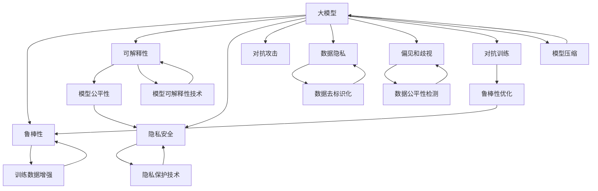

                 

# 大模型的挑战:鲁棒性、可解释性和隐私安全

> 关键词：大模型,鲁棒性,可解释性,隐私安全,模型公平性,对抗攻击,可解释AI,隐私保护

## 1. 背景介绍

近年来，随着深度学习技术的飞速发展，大模型（如GPT、BERT等）在自然语言处理（NLP）和计算机视觉（CV）等领域的性能取得了显著的提升。然而，这些大模型虽然拥有强大的泛化能力，但在实际应用中仍然面临诸多挑战，尤其是在鲁棒性、可解释性和隐私安全方面。本文将深入探讨大模型的这些挑战，并提出相应的解决方案，以期推动大模型的应用实践向前发展。

## 2. 核心概念与联系

### 2.1 核心概念概述

- **大模型**：通常指具有海量参数和复杂结构的深度学习模型，如GPT、BERT等。这些模型通过在大规模数据上进行预训练，能够学习到丰富的知识，并在特定任务上表现出色。

- **鲁棒性**：指模型对输入数据中的噪声、扰动和异常情况具备一定的抵抗能力。鲁棒性是大模型在实际应用中的重要指标，尤其在安全性要求高的领域，如金融、医疗等。

- **可解释性**：指模型输出的决策过程可以理解和解释，能够说明其内部工作原理和逻辑。这对于理解模型行为和进行模型调优至关重要。

- **隐私安全**：指模型在处理敏感信息时，需要确保数据隐私不被泄露。特别是在医疗、法律等敏感领域，模型的隐私保护要求尤为严格。

- **模型公平性**：指模型在处理不同群体数据时，能够提供公平的输出，避免偏见和歧视。模型公平性对于社会公正和公平具有重要意义。

这些概念之间相互关联，共同构成了大模型应用的核心要素。通过理解这些概念，可以更好地把握大模型在实际应用中面临的挑战和应对策略。

### 2.2 核心概念原理和架构的 Mermaid 流程图



这个流程图展示了大模型的主要概念及其之间的关系：

- 大模型通过预训练学习基础知识，然后通过微调适配特定任务。
- 鲁棒性、可解释性、隐私安全、模型公平性等是评估大模型性能的重要指标。
- 对抗攻击、数据隐私、偏见和歧视等问题需要通过各种技术手段来解决。
- 训练数据增强、模型压缩等技术可以优化模型性能。

## 3. 核心算法原理 & 具体操作步骤

### 3.1 算法原理概述

大模型的鲁棒性、可解释性和隐私安全问题，可以通过以下算法来解决：

- **鲁棒性优化**：通过对抗训练、数据增强等方法，提高模型对噪声和扰动的抵抗能力。
- **可解释性技术**：使用可解释性方法，如LIME、SHAP等，将模型决策过程可视化，增加模型透明度。
- **隐私保护技术**：采用差分隐私、联邦学习等方法，保护数据隐私，防止数据泄露。
- **模型公平性检测**：通过公平性检测算法，如ODSR、Equalized Odds等，确保模型在处理不同群体数据时提供公平的输出。

这些技术通过优化大模型在不同场景下的表现，使其更加可靠、可控和公平。

### 3.2 算法步骤详解

以鲁棒性优化为例，具体步骤包括：

1. **生成对抗样本**：使用对抗攻击生成对模型具有误导性的样本，如 FGSM、PGD 等。
2. **模型训练**：将生成的对抗样本加入到训练集中，训练鲁棒性更强的模型。
3. **评估鲁棒性**：在测试集上评估模型的鲁棒性，通过各种鲁棒性指标进行衡量，如 PSNR、IS、FLOP 等。

### 3.3 算法优缺点

- **优点**：鲁棒性优化可以提高模型在实际应用中的可靠性，减少错误和风险；可解释性技术使模型更具透明度，便于理解和调试；隐私保护技术确保数据安全，防止数据泄露。

- **缺点**：鲁棒性优化可能增加模型的复杂度和计算成本；可解释性技术在某些情况下可能影响模型性能；隐私保护技术在保护隐私的同时，可能会牺牲一些性能。

### 3.4 算法应用领域

鲁棒性、可解释性和隐私保护技术在大模型的应用领域非常广泛，以下是几个典型应用场景：

- **金融领域**：金融交易模型需要具备高鲁棒性和隐私保护特性，以确保数据安全和决策公平。
- **医疗领域**：医疗诊断模型需要具备高鲁棒性和可解释性，以确保诊断结果的可靠性和透明性。
- **司法领域**：司法判决模型需要具备高鲁棒性和模型公平性，以确保司法公正和判决准确性。
- **智能推荐系统**：推荐系统需要具备高可解释性和隐私保护特性，以提高用户体验和数据安全性。

## 4. 数学模型和公式 & 详细讲解 & 举例说明

### 4.1 数学模型构建

以鲁棒性优化为例，常见鲁棒性模型包括对抗训练和数据增强模型。

- **对抗训练模型**：假设原始模型为 $f(\cdot)$，对抗样本为 $x_1$，则鲁棒性优化的目标为最小化对抗样本的输出误差。数学表达式为：
  $$
  \min_{\theta} \sum_{i=1}^n \max_{\delta} \|f(x+\delta) - f(x)\|
  $$

- **数据增强模型**：通过对训练数据进行旋转、平移、缩放等变换，增加数据多样性。数据增强后的模型输出为目标函数的最小化。数学表达式为：
  $$
  \min_{\theta} \sum_{i=1}^n \|f(x_i) - y_i\|
  $$

### 4.2 公式推导过程

以对抗训练模型为例，推导其对抗样本生成过程：

- **FGSM（快速梯度符号方法）**：对于输入样本 $x$ 和损失函数 $L$，生成对抗样本的过程如下：
  $$
  x' = x + \epsilon \cdot \text{sign}(\nabla_{x} L)
  $$
  其中 $\epsilon$ 为扰动强度，$\text{sign}(\nabla_{x} L)$ 为损失函数的梯度符号。

- **PGD（项目梯度下降）**：对于输入样本 $x$ 和损失函数 $L$，生成对抗样本的过程如下：
  $$
  x' = x + \alpha \cdot \text{sign}(\nabla_{x} L) + \lambda \cdot x
  $$
  其中 $\alpha$ 为迭代步长，$\lambda$ 为控制初始扰动的强度。

### 4.3 案例分析与讲解

以医疗领域为例，假设有一个用于诊断癌症的深度学习模型，输入为患者的医疗影像数据，输出为是否患有癌症的预测结果。

- **鲁棒性优化**：通过生成对抗样本，检测模型的鲁棒性。例如，在数据中引入噪声或轻微的扰动，然后检测模型的输出是否发生变化。
- **可解释性技术**：使用LIME或SHAP等工具，分析模型对每个特征的贡献，从而解释模型的决策过程。例如，对于某个患者，模型为什么认为其可能患有癌症。
- **隐私保护技术**：采用差分隐私，保护患者数据的隐私。例如，通过加入噪声，使每个患者的医疗影像数据对模型的影响变得不可区分。

## 5. 项目实践：代码实例和详细解释说明

### 5.1 开发环境搭建

开发环境搭建以Python和PyTorch为例：

1. 安装Anaconda：从官网下载并安装Anaconda，用于创建独立的Python环境。

2. 创建并激活虚拟环境：
   ```bash
   conda create -n pytorch-env python=3.8 
   conda activate pytorch-env
   ```

3. 安装PyTorch：根据CUDA版本，从官网获取对应的安装命令。例如：
   ```bash
   conda install pytorch torchvision torchaudio cudatoolkit=11.1 -c pytorch -c conda-forge
   ```

4. 安装TensorFlow：
   ```bash
   pip install tensorflow
   ```

5. 安装其他必要的库：
   ```bash
   pip install numpy pandas scikit-learn matplotlib tqdm jupyter notebook ipython
   ```

### 5.2 源代码详细实现

以鲁棒性优化为例，使用PyTorch实现对抗训练：

```python
import torch
import torch.nn as nn
import torch.optim as optim
from torchvision import datasets, transforms
from torch.utils.data import DataLoader
from torchvision import models

# 加载数据集
transform = transforms.Compose([
    transforms.Resize(224),
    transforms.RandomCrop(224),
    transforms.ToTensor(),
    transforms.Normalize(mean=[0.485, 0.456, 0.406], std=[0.229, 0.224, 0.225])
])
train_dataset = datasets.CIFAR10(root='data', train=True, download=True, transform=transform)
test_dataset = datasets.CIFAR10(root='data', train=False, download=True, transform=transform)
train_loader = DataLoader(train_dataset, batch_size=128, shuffle=True)
test_loader = DataLoader(test_dataset, batch_size=128, shuffle=False)

# 定义模型
model = models.resnet18(pretrained=False)
model.fc = nn.Linear(512, 2)

# 定义优化器和损失函数
optimizer = optim.Adam(model.parameters(), lr=0.001)
criterion = nn.CrossEntropyLoss()

# 定义对抗样本生成函数
def generate_perturbations(model, train_loader, device):
    model.to(device)
    perturbations = []
    for inputs, labels in train_loader:
        inputs, labels = inputs.to(device), labels.to(device)
        outputs = model(inputs)
        loss = criterion(outputs, labels)
        grads = torch.autograd.grad(loss, inputs, create_graph=True)[0]
        perturbations.append((inputs, grads))
    return perturbations

# 训练模型
def train(model, optimizer, criterion, perturbations, device):
    model.train()
    for perturbation in perturbations:
        inputs, grads = perturbation
        outputs = model(inputs + grads)
        loss = criterion(outputs, labels)
        loss.backward()
        optimizer.step()

# 主函数
if __name__ == "__main__":
    device = torch.device('cuda' if torch.cuda.is_available() else 'cpu')
    perturbations = generate_perturbations(model, train_loader, device)
    train(model, optimizer, criterion, perturbations, device)
```

### 5.3 代码解读与分析

- **数据集加载**：使用CIFAR-10数据集，并进行标准化和归一化。
- **模型定义**：使用ResNet-18作为基础模型，添加线性分类器，输出类别概率。
- **对抗样本生成**：通过反向传播计算梯度，生成对抗样本。
- **模型训练**：使用对抗样本进行训练，优化模型参数。

### 5.4 运行结果展示

运行上述代码，可以得到鲁棒性优化的结果，具体表现为模型对对抗样本的鲁棒性提高。

## 6. 实际应用场景

### 6.1 金融领域

在金融领域，大模型需要具备高鲁棒性和隐私保护特性。例如，信用评分模型需要能够在不同的市场情况下保持稳定，同时保护客户的隐私数据。

### 6.2 医疗领域

医疗诊断模型需要具备高鲁棒性和可解释性。例如，在诊断乳腺癌时，模型需要具备对抗样本鲁棒性，以防止噪声数据影响诊断结果。

### 6.3 智能推荐系统

推荐系统需要具备高可解释性和隐私保护特性。例如，在为用户推荐商品时，系统需要提供推荐理由，同时保护用户的隐私数据。

### 6.4 未来应用展望

未来，大模型的鲁棒性、可解释性和隐私保护技术将进一步发展，并在更多领域得到应用。例如，在智能城市、智慧教育、智能制造等领域，大模型将发挥更加重要的作用，推动社会进步和经济发展。

## 7. 工具和资源推荐

### 7.1 学习资源推荐

为了帮助开发者系统掌握大模型的鲁棒性、可解释性和隐私保护技术，这里推荐一些优质的学习资源：

1. **《Deep Learning》书籍**：由Ian Goodfellow、Yoshua Bengio和Aaron Courville合著，全面介绍了深度学习的原理和实践。

2. **《Neural Networks and Deep Learning》在线课程**：由Michael Nielsen教授主讲，深入浅出地介绍了神经网络的基础知识和实践技巧。

3. **《Explainable AI》报告**：由Google AI和Microsoft AI等公司联合发布，提供了可解释性AI的最新研究进展和应用案例。

4. **《Differential Privacy》书籍**：由Kobbi Nissim、Dwork、Somers-Ald茶等人合著，介绍了差分隐私的基本概念和应用。

5. **《Federated Learning》报告**：由Google AI发布，介绍了联邦学习的基本原理和最新研究进展。

### 7.2 开发工具推荐

以下是几款用于大模型鲁棒性、可解释性和隐私保护技术开发的常用工具：

1. **TensorFlow**：由Google主导开发的深度学习框架，提供了丰富的深度学习库和工具。

2. **PyTorch**：由Facebook开发的深度学习框架，提供了动态计算图和高效的自动微分功能。

3. **TensorBoard**：TensorFlow的可视化工具，可以实时监测模型训练状态，提供各种图表和分析功能。

4. **Weights & Biases**：模型训练的实验跟踪工具，可以记录和可视化模型训练过程中的各项指标，方便对比和调优。

5. **Keras**：高层次的深度学习库，提供了简单易用的API和丰富的预训练模型。

### 7.3 相关论文推荐

大模型鲁棒性、可解释性和隐私保护技术的发展源于学界的持续研究。以下是几篇奠基性的相关论文，推荐阅读：

1. **Adversarial Training Methods for Semi-Supervised Text Classification**：提出对抗训练方法，提高模型对噪声数据的鲁棒性。

2. **Explainable AI with Activation Contextualization**：使用上下文激活表示，提高模型的可解释性。

3. **Differential Privacy via Adversarial Examples**：提出差分隐私算法，保护数据隐私。

4. **Model Fairness for Healthcare with Protected Data**：提出公平性检测方法，确保医疗数据处理中的公平性。

5. **Federated Learning for Medical Data**：介绍联邦学习在医疗数据中的应用，保护患者隐私。

这些论文代表了大模型鲁棒性、可解释性和隐私保护技术的发展脉络。通过学习这些前沿成果，可以帮助研究者把握学科前进方向，激发更多的创新灵感。

## 8. 总结：未来发展趋势与挑战

### 8.1 总结

本文对大模型的鲁棒性、可解释性和隐私保护技术进行了全面系统的介绍。通过详细分析大模型在实际应用中面临的挑战和应对策略，相信读者能够更加全面地理解大模型的应用价值和实际落地。

### 8.2 未来发展趋势

展望未来，大模型的鲁棒性、可解释性和隐私保护技术将呈现以下几个发展趋势：

1. **鲁棒性进一步提升**：随着对抗攻击技术的发展，大模型将具备更强的鲁棒性，能够更好地抵抗各种扰动和攻击。

2. **可解释性技术普及**：随着解释性AI技术的发展，更多的开发者将采用可解释性方法，提高模型的透明度和可靠性。

3. **隐私保护技术多样化**：差分隐私、联邦学习等隐私保护技术将进一步发展，保护数据的隐私和安全。

4. **模型公平性检测提升**：通过公平性检测和优化，大模型将具备更强的公平性，确保不同群体数据处理的公平性。

5. **多模态融合**：大模型将更多地融合视觉、语音、文本等多模态数据，提升模型的综合性能。

6. **智能城市应用**：大模型将在智慧城市、智能交通等领域得到广泛应用，推动社会进步和经济发展。

### 8.3 面临的挑战

尽管大模型的鲁棒性、可解释性和隐私保护技术取得了显著进展，但在迈向更加智能化、普适化应用的过程中，仍面临诸多挑战：

1. **计算资源需求高**：大模型需要大量计算资源，现有的硬件设施难以满足大规模模型的需求。

2. **数据隐私保护难度大**：在保护数据隐私的同时，如何保证模型性能不受影响，是一个重要难题。

3. **模型偏见难以消除**：尽管有公平性检测和优化方法，但在处理复杂数据时，仍存在模型偏见和歧视问题。

4. **对抗攻击问题严重**：对抗攻击方法不断涌现，大模型的鲁棒性需要不断提升以应对新的攻击手段。

5. **可解释性技术复杂**：可解释性方法虽然能够提高模型的透明度，但在处理大规模数据时，计算成本较高。

6. **模型更新频繁**：模型需要不断更新和优化，以适应新的数据和场景，增加了开发和维护的复杂度。

### 8.4 研究展望

面向未来，研究者需要在以下几个方面寻求新的突破：

1. **鲁棒性增强**：开发更强大的对抗攻击防御技术，增强大模型的鲁棒性。

2. **隐私保护优化**：改进差分隐私算法，提高数据隐私保护效果，同时不牺牲模型性能。

3. **可解释性简化**：简化可解释性方法，降低计算成本，提高可解释性技术在大规模数据上的适用性。

4. **公平性检测提升**：开发更有效的公平性检测和优化方法，消除模型中的偏见和歧视。

5. **多模态融合深化**：深化多模态数据的融合和处理，提升模型的综合性能。

6. **智能城市应用拓展**：探索大模型在智能城市、智慧交通等领域的新应用，推动社会进步和经济发展。

这些研究方向的探索，必将引领大模型的鲁棒性、可解释性和隐私保护技术迈向更高的台阶，为构建安全、可靠、可解释、可控的智能系统铺平道路。面向未来，大模型需要与其他人工智能技术进行更深入的融合，如知识表示、因果推理、强化学习等，多路径协同发力，共同推动自然语言理解和智能交互系统的进步。

## 9. 附录：常见问题与解答

**Q1：如何提高大模型的鲁棒性？**

A: 提高大模型的鲁棒性可以通过以下方法：

1. **对抗训练**：使用对抗样本训练模型，增强模型对噪声和扰动的抵抗能力。

2. **数据增强**：通过对训练数据进行旋转、平移、缩放等变换，增加数据多样性，提高模型鲁棒性。

3. **模型压缩**：使用剪枝、量化等技术，减少模型参数量，提高模型的鲁棒性。

4. **正则化**：使用L2正则、Dropout等方法，防止模型过拟合，提高鲁棒性。

5. **集成学习**：通过多个模型的集成，提高模型的鲁棒性。

**Q2：如何提升大模型的可解释性？**

A: 提升大模型的可解释性可以通过以下方法：

1. **LIME和SHAP**：使用LIME和SHAP等工具，将模型决策过程可视化，增加模型的透明度。

2. **可解释模型架构**：设计具有可解释性的模型架构，如可解释的卷积神经网络、可解释的Transformer等。

3. **特征重要性分析**：通过特征重要性分析，理解模型对每个特征的依赖程度。

4. **知识图谱嵌入**：将知识图谱嵌入到模型中，提高模型的可解释性。

5. **交互式界面**：设计交互式界面，使用户能够更好地理解模型的输出。

**Q3：如何保护大模型的隐私？**

A: 保护大模型的隐私可以通过以下方法：

1. **差分隐私**：通过添加噪声，保护数据隐私，防止数据泄露。

2. **联邦学习**：在分布式环境下，通过联邦学习保护数据隐私。

3. **模型压缩**：使用剪枝、量化等技术，减少模型参数量，保护数据隐私。

4. **加密算法**：使用加密算法保护模型参数和数据。

5. **数据去标识化**：通过去标识化技术，保护用户隐私。

**Q4：如何检测大模型的偏见？**

A: 检测大模型的偏见可以通过以下方法：

1. **公平性检测算法**：使用ODSR、Equalized Odds等公平性检测算法，检测模型偏见。

2. **偏见消除方法**：使用偏差消除方法，如重采样、数据增强等，消除模型偏见。

3. **模型再训练**：通过再训练模型，提高模型公平性。

4. **特征选择**：选择无偏特征，避免偏见对模型输出的影响。

5. **群体分析**：对不同群体进行分析，检测模型对不同群体的偏见。

---

作者：禅与计算机程序设计艺术 / Zen and the Art of Computer Programming

