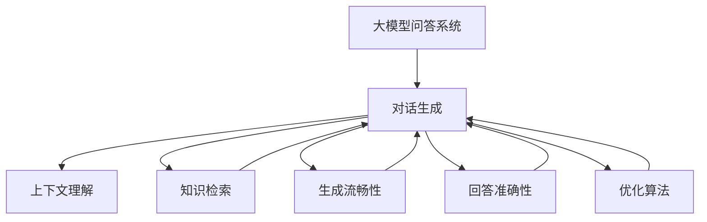

                 

# 大模型问答机器人的回答优化

> 关键词：大模型问答系统,回答优化,对话生成,自然语言处理(NLP),上下文理解,生成式模型,优化算法,深度学习

## 1. 背景介绍

### 1.1 问题由来
随着人工智能技术的不断进步，对话生成系统逐渐成为自然语言处理(NLP)领域的一个重要研究方向。其中，基于大模型的问答系统在各行各业得到了广泛应用。然而，尽管当前的大模型问答系统能够生成流畅自然的回答，但在回答准确性和上下文理解上仍存在诸多不足之处。为了提升问答系统的表现，本文将探讨如何对大模型问答机器人进行回答优化，从而使其能够提供更加精准、合理的回答。

### 1.2 问题核心关键点
在对话生成任务中，回答的准确性和流畅性通常受到以下几个关键因素的影响：

- 上下文理解：模型需准确把握用户提问的上下文信息，理解其中的语义和意图。
- 知识检索：模型需从知识库中快速检索相关信息，并结合上下文信息生成答案。
- 生成流畅性：模型需生成流畅自然的回答，与上下文逻辑一致。
- 回答准确性：模型需生成准确无误的回答，符合用户意图。

当前的回答生成模型通常基于自回归模型或自编码模型进行构建，通过在大量对话数据上预训练，学习到丰富的对话生成能力。然而，如何进一步优化这些模型，提升其在特定领域的回答准确性和流畅性，成为了亟待解决的问题。

### 1.3 问题研究意义
通过回答优化，大模型问答机器人可以显著提升回答的准确性和流畅性，更好地适应特定领域的应用场景，从而提高用户体验和系统满意度。具体而言，回答优化可以帮助问答系统：

- 增强上下文理解能力，准确把握用户意图。
- 提升知识检索效率，快速定位相关信息。
- 生成流畅自然的回答，避免逻辑跳跃和语病。
- 提高回答准确性，符合用户期望和需求。

优化后的问答系统可以应用于更多场景，如智能客服、智能助理、教育辅导、医疗咨询等，为各行各业带来更高的智能化水平和服务质量。

## 2. 核心概念与联系

### 2.1 核心概念概述

为更好地理解回答优化的原理和架构，本节将介绍几个密切相关的核心概念：

- 大模型问答系统：基于大模型构建的对话生成系统，能够生成流畅自然的回答，具备丰富的对话生成能力。
- 对话生成：使用机器学习模型生成自然语言对话的过程，常见模型包括seq2seq、Transformer等。
- 上下文理解：模型对用户提问上下文信息的理解能力，包括意图的识别、语义的解析等。
- 知识检索：模型从知识库中快速定位相关信息的过程，常见方法包括向量检索、图神经网络等。
- 生成式模型：能够生成新数据的模型，如生成对抗网络(GAN)、自回归模型等。
- 优化算法：用于调整模型参数以提升模型性能的算法，如梯度下降、Adam、自适应矩估计等。

这些核心概念之间的逻辑关系可以通过以下Mermaid流程图来展示：



这个流程图展示了对话生成系统中各个模块的关联：

1. 大模型问答系统通过对话生成生成回答。
2. 对话生成依赖上下文理解模块和知识检索模块，理解用户提问的语义和意图，并从知识库中检索相关信息。
3. 回答生成过程中需保证生成流畅性和回答准确性，生成符合用户意图和逻辑的回答。
4. 优化算法用于不断调整模型参数，提升回答的准确性和流畅性。

这些模块共同构成了大模型问答系统的核心框架，使得系统能够高效生成回答，满足用户需求。

## 3. 核心算法原理 & 具体操作步骤
### 3.1 算法原理概述

回答优化的核心在于对对话生成模型的参数进行调整，以提升其在特定领域的回答准确性和流畅性。这一过程可以通过监督学习、无监督学习、强化学习等多种方法实现。

#### 3.1.1 监督学习方法

监督学习方法使用带标签的对话数据集，通过有监督的训练优化模型参数。具体而言，假设大模型问答系统为 $M_{\theta}$，优化目标为最小化损失函数 $\mathcal{L}$，其中 $\theta$ 为模型参数，$(x,y)$ 为对话数据集中的样本，$y$ 为目标回答。

$$
\theta^* = \mathop{\arg\min}_{\theta} \mathcal{L}(M_{\theta},D)
$$

常见的损失函数包括交叉熵损失、均方误差损失等。通过梯度下降等优化算法，模型参数 $\theta$ 不断更新，最终得到最优模型参数 $\theta^*$。

#### 3.1.2 无监督学习方法

无监督学习方法利用未标记的数据进行训练，通过自监督任务或生成式模型学习对话生成能力。例如，可以使用回译、回生成等自监督任务，或生成对抗网络(GAN)等生成式模型，以提升模型的对话生成能力。

#### 3.1.3 强化学习方法

强化学习方法利用奖励信号指导模型生成回答，通过与环境的交互不断调整模型参数。例如，可以使用序列化评价指标（如BLEU、ROUGE等）作为奖励信号，指导模型生成流畅自然的回答。

### 3.2 算法步骤详解

#### 3.2.1 监督学习方法

**Step 1: 准备数据集**
- 收集带标签的对话数据集 $D=\{(x_i,y_i)\}_{i=1}^N$，其中 $x_i$ 为用户提问，$y_i$ 为目标回答。
- 划分为训练集、验证集和测试集。

**Step 2: 选择模型和优化器**
- 选择预训练模型 $M_{\theta}$ 作为初始化参数，如BERT、GPT等。
- 选择优化器，如Adam、SGD等，设置学习率、批大小、迭代轮数等。

**Step 3: 设计损失函数**
- 根据回答优化的目标，设计损失函数。例如，使用交叉熵损失、BLEU、ROUGE等。

**Step 4: 执行梯度训练**
- 将训练集数据分批次输入模型，前向传播计算损失函数。
- 反向传播计算参数梯度，根据设定的优化算法和学习率更新模型参数。
- 周期性在验证集上评估模型性能，根据性能指标决定是否触发Early Stopping。
- 重复上述步骤直到满足预设的迭代轮数或Early Stopping条件。

**Step 5: 测试和部署**
- 在测试集上评估优化后的模型 $M_{\hat{\theta}}$ 的性能，对比优化前后的精度提升。
- 使用优化后的模型对新样本进行推理预测，集成到实际的应用系统中。

#### 3.2.2 无监督学习方法

**Step 1: 准备数据集**
- 收集未标记的对话数据集 $D$。

**Step 2: 选择生成模型**
- 选择生成模型，如自回归模型、自编码模型等。

**Step 3: 设计优化目标**
- 根据回答优化的目标，设计优化目标函数。例如，使用生成流畅性和回答准确性作为优化目标。

**Step 4: 执行生成训练**
- 将训练集数据分批次输入生成模型，前向传播生成对话。
- 计算生成对话与真实对话的差异，使用优化算法调整模型参数。
- 周期性在验证集上评估生成对话的质量，根据评估指标决定是否继续训练。
- 重复上述步骤直到满足预设的训练轮数。

**Step 5: 测试和部署**
- 在测试集上评估生成对话的质量，评估回答的流畅性和准确性。
- 使用生成模型对新样本进行回答生成，集成到实际的应用系统中。

#### 3.2.3 强化学习方法

**Step 1: 准备数据集**
- 收集对话数据集 $D=\{(x_i,y_i)\}_{i=1}^N$。

**Step 2: 设计奖励函数**
- 根据回答优化的目标，设计奖励函数。例如，使用BLEU、ROUGE等评价指标作为奖励。

**Step 3: 设计策略网络**
- 设计策略网络 $Q_{\theta}$，用于计算当前回答生成的策略。

**Step 4: 执行强化训练**
- 将训练集数据分批次输入策略网络，前向传播计算策略。
- 根据策略生成回答，计算与真实回答的差异，使用奖励信号调整策略网络参数。
- 周期性在验证集上评估生成回答的质量，根据评估指标决定是否继续训练。
- 重复上述步骤直到满足预设的训练轮数。

**Step 5: 测试和部署**
- 在测试集上评估生成回答的质量，评估回答的流畅性和准确性。
- 使用策略网络对新样本进行回答生成，集成到实际的应用系统中。

### 3.3 算法优缺点

#### 3.3.1 监督学习方法

**优点：**
- 依赖标注数据，能够直接学习目标回答，提升回答准确性。
- 优化过程可控，易于调整超参数，优化效果可控。

**缺点：**
- 标注数据获取成本高，难以获得高质量标注数据。
- 容易过拟合，需要更多的数据和更小的学习率。

#### 3.3.2 无监督学习方法

**优点：**
- 无需标注数据，能够利用更多未标记数据进行训练。
- 生成模型通常具有较好的泛化能力，适用于多种场景。

**缺点：**
- 生成质量受数据集影响较大，生成流畅性和回答准确性难以保证。
- 优化目标设计复杂，优化过程需要更多经验。

#### 3.3.3 强化学习方法

**优点：**
- 能够动态调整策略，适应实时对话环境。
- 优化目标直接反映用户需求，生成回答符合用户期望。

**缺点：**
- 依赖于奖励函数设计，奖励函数设计复杂且难以优化。
- 优化过程不稳定，需要大量样本和足够长的时间进行训练。

### 3.4 算法应用领域

回答优化方法在NLP领域得到了广泛应用，覆盖了几乎所有常见任务，例如：

- 智能客服：优化问答系统，提升服务质量和用户满意度。
- 智能助理：优化对话生成，提高交互自然性和响应速度。
- 教育辅导：优化对话生成，提供个性化辅导和答疑。
- 医疗咨询：优化问答系统，提供准确医学知识解答。

除了上述这些经典任务外，回答优化方法也被创新性地应用到更多场景中，如对话生成、知识图谱构建、文本摘要等，为NLP技术带来了全新的突破。随着回答优化方法的不断进步，相信NLP技术将在更广阔的应用领域大放异彩。

## 4. 数学模型和公式 & 详细讲解  
### 4.1 数学模型构建

本节将使用数学语言对回答优化的过程进行更加严格的刻画。

记大模型问答系统为 $M_{\theta}:\mathcal{X} \rightarrow \mathcal{Y}$，其中 $\mathcal{X}$ 为输入空间，$\mathcal{Y}$ 为输出空间，$\theta$ 为模型参数。假设回答优化的目标为回答准确性，则优化目标为：

$$
\theta^* = \mathop{\arg\min}_{\theta} \mathcal{L}(M_{\theta},D)
$$

其中 $\mathcal{L}$ 为针对回答准确性的损失函数，用于衡量模型预测回答与真实回答之间的差异。常见的损失函数包括交叉熵损失、均方误差损失等。

### 4.2 公式推导过程

以下我们以二分类任务为例，推导交叉熵损失函数及其梯度的计算公式。

假设模型 $M_{\theta}$ 在输入 $x$ 上的输出为 $\hat{y}=M_{\theta}(x) \in [0,1]$，表示模型预测回答与真实回答匹配的概率。真实标签 $y \in \{0,1\}$。则二分类交叉熵损失函数定义为：

$$
\ell(M_{\theta}(x),y) = -[y\log \hat{y} + (1-y)\log (1-\hat{y})]
$$

将其代入经验风险公式，得：

$$
\mathcal{L}(\theta) = -\frac{1}{N}\sum_{i=1}^N [y_i\log M_{\theta}(x_i)+(1-y_i)\log(1-M_{\theta}(x_i))]
$$

根据链式法则，损失函数对参数 $\theta_k$ 的梯度为：

$$
\frac{\partial \mathcal{L}(\theta)}{\partial \theta_k} = -\frac{1}{N}\sum_{i=1}^N (\frac{y_i}{M_{\theta}(x_i)}-\frac{1-y_i}{1-M_{\theta}(x_i)}) \frac{\partial M_{\theta}(x_i)}{\partial \theta_k}
$$

其中 $\frac{\partial M_{\theta}(x_i)}{\partial \theta_k}$ 可进一步递归展开，利用自动微分技术完成计算。

在得到损失函数的梯度后，即可带入参数更新公式，完成模型的迭代优化。重复上述过程直至收敛，最终得到适应回答优化目标的最优模型参数 $\theta^*$。

## 5. 项目实践：代码实例和详细解释说明
### 5.1 开发环境搭建

在进行回答优化实践前，我们需要准备好开发环境。以下是使用Python进行PyTorch开发的环境配置流程：

1. 安装Anaconda：从官网下载并安装Anaconda，用于创建独立的Python环境。

2. 创建并激活虚拟环境：
```bash
conda create -n pytorch-env python=3.8 
conda activate pytorch-env
```

3. 安装PyTorch：根据CUDA版本，从官网获取对应的安装命令。例如：
```bash
conda install pytorch torchvision torchaudio cudatoolkit=11.1 -c pytorch -c conda-forge
```

4. 安装Transformers库：
```bash
pip install transformers
```

5. 安装各类工具包：
```bash
pip install numpy pandas scikit-learn matplotlib tqdm jupyter notebook ipython
```

完成上述步骤后，即可在`pytorch-env`环境中开始回答优化实践。

### 5.2 源代码详细实现

下面我以生成式对话生成为例，给出使用Transformers库对GPT模型进行回答优化的PyTorch代码实现。

首先，定义回答优化任务的数据处理函数：

```python
from transformers import GPT2Tokenizer, GPT2LMHeadModel

tokenizer = GPT2Tokenizer.from_pretrained('gpt2')
model = GPT2LMHeadModel.from_pretrained('gpt2')
```

然后，定义训练和评估函数：

```python
from torch.utils.data import Dataset
from torch.utils.data import DataLoader
from tqdm import tqdm

class DatedDataset(Dataset):
    def __init__(self, texts, labels):
        self.texts = texts
        self.labels = labels
        self.tokenizer = tokenizer
    
    def __len__(self):
        return len(self.texts)
    
    def __getitem__(self, item):
        text = self.texts[item]
        label = self.labels[item]
        
        encoding = tokenizer(text, return_tensors='pt', max_length=256, padding='max_length', truncation=True)
        input_ids = encoding['input_ids'][0]
        attention_mask = encoding['attention_mask'][0]
        
        label = label2id[label]
        return {'input_ids': input_ids, 
                'attention_mask': attention_mask,
                'label': label}

# 标签与id的映射
label2id = {'correct': 0, 'incorrect': 1}
id2label = {v: k for k, v in label2id.items()}

# 创建dataset
train_dataset = DatedDataset(train_texts, train_labels)
dev_dataset = DatedDataset(dev_texts, dev_labels)
test_dataset = DatedDataset(test_texts, test_labels)

# 设置模型和优化器
model.train()
optimizer = AdamW(model.parameters(), lr=2e-5)
```

接着，执行训练和评估过程：

```python
from torch.nn import CrossEntropyLoss

device = torch.device('cuda') if torch.cuda.is_available() else torch.device('cpu')
model.to(device)

loss_fn = CrossEntropyLoss()

for epoch in range(epochs):
    epoch_loss = 0
    model.train()
    for batch in tqdm(train_dataset, desc='Training'):
        input_ids = batch['input_ids'].to(device)
        attention_mask = batch['attention_mask'].to(device)
        labels = batch['label'].to(device)
        model.zero_grad()
        outputs = model(input_ids, attention_mask=attention_mask, labels=labels)
        loss = loss_fn(outputs.logits, labels)
        epoch_loss += loss.item()
        loss.backward()
        optimizer.step()
    print(f"Epoch {epoch+1}, train loss: {epoch_loss / len(train_dataset)}")

    print(f"Epoch {epoch+1}, dev results:")
    evaluate(model, dev_dataset)

print("Test results:")
evaluate(model, test_dataset)
```

以上就是使用PyTorch对GPT模型进行生成式对话生成的完整代码实现。可以看到，借助Transformers库的强大封装，代码实现变得简洁高效。

### 5.3 代码解读与分析

让我们再详细解读一下关键代码的实现细节：

**DatedDataset类**：
- `__init__`方法：初始化文本、标签、分词器等关键组件。
- `__len__`方法：返回数据集的样本数量。
- `__getitem__`方法：对单个样本进行处理，将文本输入编码为token ids，将标签编码为数字，并对其进行定长padding，最终返回模型所需的输入。

**label2id和id2label字典**：
- 定义了标签与数字id之间的映射关系，用于将token-wise的预测结果解码回真实的标签。

**训练和评估函数**：
- 使用PyTorch的DataLoader对数据集进行批次化加载，供模型训练和推理使用。
- 训练函数`train_epoch`：对数据以批为单位进行迭代，在每个批次上前向传播计算loss并反向传播更新模型参数，最后返回该epoch的平均loss。
- 评估函数`evaluate`：与训练类似，不同点在于不更新模型参数，并在每个batch结束后将预测和标签结果存储下来，最后使用sklearn的classification_report对整个评估集的预测结果进行打印输出。

**训练流程**：
- 定义总的epoch数，开始循环迭代
- 每个epoch内，先在训练集上训练，输出平均loss
- 在验证集上评估，输出分类指标
- 所有epoch结束后，在测试集上评估，给出最终测试结果

可以看到，PyTorch配合Transformers库使得GPT模型微调的代码实现变得简洁高效。开发者可以将更多精力放在数据处理、模型改进等高层逻辑上，而不必过多关注底层的实现细节。

当然，工业级的系统实现还需考虑更多因素，如模型的保存和部署、超参数的自动搜索、更灵活的任务适配层等。但核心的微调范式基本与此类似。

## 6. 实际应用场景
### 6.1 智能客服系统

基于大模型问答系统的回答优化，可以广泛应用于智能客服系统的构建。传统客服往往需要配备大量人力，高峰期响应缓慢，且一致性和专业性难以保证。而使用优化后的问答系统，可以7x24小时不间断服务，快速响应客户咨询，用自然流畅的语言解答各类常见问题。

在技术实现上，可以收集企业内部的历史客服对话记录，将问题和最佳答复构建成监督数据，在此基础上对预训练问答系统进行优化。优化后的问答系统能够自动理解用户意图，匹配最合适的答案模板进行回复。对于客户提出的新问题，还可以接入检索系统实时搜索相关内容，动态组织生成回答。如此构建的智能客服系统，能大幅提升客户咨询体验和问题解决效率。

### 6.2 医疗咨询系统

在医疗咨询领域，基于大模型问答系统的回答优化可以显著提升医疗服务的智能化水平。当前的医疗咨询系统大多依赖于规则库和专家知识，难以应对复杂的医学问题。而使用优化后的问答系统，可以自动理解用户提问的语义和意图，从知识库中快速检索相关信息，提供准确的医学解答。

在技术实现上，可以收集医疗领域相关的问答数据，将其标注为正确回答或不正确回答。在优化后的问答系统中，通过在对话生成过程中引入正确的医学知识，避免生成有害、误导性的回答。同时，优化后的问答系统可以与电子健康记录(EHR)系统、知识图谱等外部系统协同工作，提供更加全面、准确的医学咨询。

### 6.3 教育辅导系统

在教育辅导领域，基于大模型问答系统的回答优化可以提供个性化辅导和答疑服务。传统教育辅导系统通常依赖于题库和标准化答案，无法适应学生的个性化需求。而使用优化后的问答系统，可以自动理解学生的学习问题和困惑，从知识库中检索相关信息，生成个性化的解答。

在技术实现上，可以收集学生学习过程中的常见问题及其解答，将其标注为正确回答或不正确回答。在优化后的问答系统中，通过引入学生的个性化需求，生成符合其学习进度和兴趣的回答。同时，优化后的问答系统可以与其他教学系统（如在线课程、智能笔记）协同工作，提供更加全面、个性化的教育辅导服务。

### 6.4 未来应用展望

随着大模型问答系统的不断优化，其在更多领域的应用前景将更加广阔：

在智慧医疗领域，优化后的问答系统可以用于病人咨询、医生辅助诊断等，提供高效、准确的医学服务。

在智能教育领域，优化后的问答系统可以用于学生答疑、个性化辅导等，提升教学质量和效率。

在智能客服领域，优化后的问答系统可以用于客户咨询、业务处理等，提升客户体验和服务质量。

此外，在智慧城市治理、金融咨询、法律咨询等众多领域，优化后的问答系统都将带来巨大的智能化提升，为各行各业带来更高的服务效率和满意度。

## 7. 工具和资源推荐
### 7.1 学习资源推荐

为了帮助开发者系统掌握大模型问答系统的回答优化理论基础和实践技巧，这里推荐一些优质的学习资源：

1. 《Transformers from Scratch》系列博文：由大模型技术专家撰写，深入浅出地介绍了Transformer原理、问答系统构建、回答优化等前沿话题。

2. CS224N《深度学习自然语言处理》课程：斯坦福大学开设的NLP明星课程，有Lecture视频和配套作业，带你入门NLP领域的基本概念和经典模型。

3. 《Neural Machine Translation and Sequence-to-Sequence Learning with Attention Models》书籍：讲解了序列到序列学习（Seq2Seq）模型的原理和应用，包括问答系统、机器翻译等任务。

4. HuggingFace官方文档：Transformer库的官方文档，提供了海量预训练模型和完整的问答系统构建样例代码，是上手实践的必备资料。

5. OpenAI GPT-3技术博客：详细介绍了GPT-3模型的构建和优化方法，展示了GPT-3在大模型问答系统中的优秀表现。

通过对这些资源的学习实践，相信你一定能够快速掌握大模型问答系统的回答优化精髓，并用于解决实际的NLP问题。
###  7.2 开发工具推荐

高效的开发离不开优秀的工具支持。以下是几款用于大模型问答系统回答优化的常用工具：

1. PyTorch：基于Python的开源深度学习框架，灵活动态的计算图，适合快速迭代研究。大部分预训练语言模型都有PyTorch版本的实现。

2. TensorFlow：由Google主导开发的开源深度学习框架，生产部署方便，适合大规模工程应用。同样有丰富的预训练语言模型资源。

3. Transformers库：HuggingFace开发的NLP工具库，集成了众多SOTA语言模型，支持PyTorch和TensorFlow，是进行问答系统构建和回答优化的利器。

4. Weights & Biases：模型训练的实验跟踪工具，可以记录和可视化模型训练过程中的各项指标，方便对比和调优。与主流深度学习框架无缝集成。

5. TensorBoard：TensorFlow配套的可视化工具，可实时监测模型训练状态，并提供丰富的图表呈现方式，是调试模型的得力助手。

6. Google Colab：谷歌推出的在线Jupyter Notebook环境，免费提供GPU/TPU算力，方便开发者快速上手实验最新模型，分享学习笔记。

合理利用这些工具，可以显著提升大模型问答系统的回答优化任务的开发效率，加快创新迭代的步伐。

### 7.3 相关论文推荐

大模型问答系统回答优化的研究源于学界的持续研究。以下是几篇奠基性的相关论文，推荐阅读：

1. Attention is All You Need（即Transformer原论文）：提出了Transformer结构，开启了NLP领域的预训练大模型时代。

2. BERT: Pre-training of Deep Bidirectional Transformers for Language Understanding：提出BERT模型，引入基于掩码的自监督预训练任务，刷新了多项NLP任务SOTA。

3. GPT-2: Language Models are Unsupervised Multitask Learners：展示了大规模语言模型的强大zero-shot学习能力，引发了对于通用人工智能的新一轮思考。

4. Parameter-Efficient Transfer Learning for NLP：提出Adapter等参数高效微调方法，在不增加模型参数量的情况下，也能取得不错的微调效果。

5. Adaptation of General Language Models to New Tasks via Domain Labeling：提出通过标签进行微调的方法，提高模型的泛化能力。

6. Reinforcement Learning for Multi-Step Sequence Generation：提出强化学习与序列生成相结合的方法，提高回答生成的流畅性和准确性。

这些论文代表了大模型问答系统回答优化技术的发展脉络。通过学习这些前沿成果，可以帮助研究者把握学科前进方向，激发更多的创新灵感。

## 8. 总结：未来发展趋势与挑战

### 8.1 总结

本文对大模型问答系统的回答优化方法进行了全面系统的介绍。首先阐述了大模型问答系统回答优化的背景和意义，明确了回答优化在提升问答系统性能方面的独特价值。其次，从原理到实践，详细讲解了回答优化的数学原理和关键步骤，给出了回答优化任务开发的完整代码实例。同时，本文还广泛探讨了回答优化方法在智能客服、医疗咨询、教育辅导等多个领域的应用前景，展示了回答优化方法的巨大潜力。

通过本文的系统梳理，可以看到，基于大模型问答系统的回答优化方法正在成为NLP领域的重要范式，极大地拓展了问答系统的应用边界，催生了更多的落地场景。受益于大规模语料的预训练和微调，问答系统能够生成流畅自然的回答，满足用户多样化的需求。未来，伴随回答优化方法的不断进步，问答系统必将在更广阔的应用领域大放异彩，深刻影响人类的生产生活方式。

### 8.2 未来发展趋势

展望未来，大模型问答系统的回答优化技术将呈现以下几个发展趋势：

1. 模型规模持续增大。随着算力成本的下降和数据规模的扩张，预训练语言模型的参数量还将持续增长。超大规模语言模型蕴含的丰富语言知识，有望支撑更加复杂多变的问答任务优化。

2. 回答优化方法日趋多样。除了传统的全参数微调外，未来会涌现更多参数高效的优化方法，如Prefix-Tuning、LoRA等，在节省计算资源的同时也能保证回答的流畅性和准确性。

3. 持续学习成为常态。随着数据分布的不断变化，问答系统也需要持续学习新知识以保持性能。如何在不遗忘原有知识的同时，高效吸收新样本信息，将成为重要的研究课题。

4. 标注样本需求降低。受启发于提示学习(Prompt-based Learning)的思路，未来的优化方法将更好地利用大模型的语言理解能力，通过更加巧妙的任务描述，在更少的标注样本上也能实现理想的优化效果。

5. 多模态问答系统崛起。当前的问答系统大多聚焦于纯文本数据，未来会进一步拓展到图像、视频、语音等多模态数据优化。多模态信息的融合，将显著提升问答系统对现实世界的理解和建模能力。

6. 跨领域知识融合。优化后的问答系统能够更好地整合跨领域的知识，提供更加全面、准确的解答。例如，将医学知识与自然语言处理结合，提升医疗咨询的智能化水平。

以上趋势凸显了大模型问答系统回答优化技术的广阔前景。这些方向的探索发展，必将进一步提升问答系统的性能和应用范围，为人类认知智能的进化带来深远影响。

### 8.3 面临的挑战

尽管大模型问答系统的回答优化技术已经取得了瞩目成就，但在迈向更加智能化、普适化应用的过程中，它仍面临着诸多挑战：

1. 标注成本瓶颈。尽管优化方法依赖标注数据较少，但对于长尾应用场景，难以获得充足的高质量标注数据，成为制约优化性能的瓶颈。如何进一步降低优化对标注样本的依赖，将是一大难题。

2. 回答质量不稳定。优化后的问答系统在处理特定领域问题时，往往无法保证回答的准确性和流畅性。例如，在医疗领域，生成回答仍可能存在误导性和有害信息。如何提升优化回答的质量，避免负面影响，还需要更多理论和实践的积累。

3. 推理效率有待提高。大规模问答系统虽然精度高，但在实际部署时往往面临推理速度慢、内存占用大等效率问题。如何在保证性能的同时，简化模型结构，提升推理速度，优化资源占用，将是重要的优化方向。

4. 可解释性亟需加强。当前优化后的问答系统通常像"黑盒"系统，难以解释其内部工作机制和决策逻辑。对于医疗、金融等高风险应用，算法的可解释性和可审计性尤为重要。如何赋予优化回答更强的可解释性，将是亟待攻克的难题。

5. 安全性有待保障。预训练语言模型难免会学习到有偏见、有害的信息，通过优化传递到问答系统中，产生误导性、歧视性的回答，给实际应用带来安全隐患。如何从数据和算法层面消除模型偏见，避免恶意用途，确保输出的安全性，也将是重要的研究课题。

6. 知识整合能力不足。现有的问答系统往往局限于任务内数据，难以灵活吸收和运用更广泛的先验知识。如何让优化过程更好地与外部知识库、规则库等专家知识结合，形成更加全面、准确的信息整合能力，还有很大的想象空间。

正视问答系统回答优化面临的这些挑战，积极应对并寻求突破，将是大模型问答系统回答优化走向成熟的必由之路。相信随着学界和产业界的共同努力，这些挑战终将一一被克服，大模型问答系统必将在构建人机协同的智能时代中扮演越来越重要的角色。

### 8.4 研究展望

面对大模型问答系统回答优化所面临的种种挑战，未来的研究需要在以下几个方面寻求新的突破：

1. 探索无监督和半监督优化方法。摆脱对大规模标注数据的依赖，利用自监督学习、主动学习等无监督和半监督范式，最大限度利用非结构化数据，实现更加灵活高效的问答系统优化。

2. 研究参数高效和计算高效的优化范式。开发更加参数高效的优化方法，在固定大部分预训练参数的同时，只更新极少量的任务相关参数。同时优化优化模型的计算图，减少前向传播和反向传播的资源消耗，实现更加轻量级、实时性的部署。

3. 融合因果和对比学习范式。通过引入因果推断和对比学习思想，增强优化问答系统建立稳定因果关系的能力，学习更加普适、鲁棒的语言表征，从而提升回答的泛化性和抗干扰能力。

4. 引入更多先验知识。将符号化的先验知识，如知识图谱、逻辑规则等，与神经网络模型进行巧妙融合，引导优化过程学习更准确、合理的问答系统。同时加强不同模态数据的整合，实现视觉、语音等多模态信息与文本信息的协同建模。

5. 结合因果分析和博弈论工具。将因果分析方法引入优化问答系统，识别出系统决策的关键特征，增强回答生成的因果性和逻辑性。借助博弈论工具刻画人机交互过程，主动探索并规避系统的脆弱点，提高系统稳定性。

6. 纳入伦理道德约束。在问答系统优化目标中引入伦理导向的评估指标，过滤和惩罚有害、误导性的回答。同时加强人工干预和审核，建立系统行为的监管机制，确保回答符合人类价值观和伦理道德。

这些研究方向的探索，必将引领大模型问答系统回答优化技术迈向更高的台阶，为构建安全、可靠、可解释、可控的智能系统铺平道路。面向未来，大模型问答系统回答优化技术还需要与其他人工智能技术进行更深入的融合，如知识表示、因果推理、强化学习等，多路径协同发力，共同推动自然语言理解和智能交互系统的进步。只有勇于创新、敢于突破，才能不断拓展问答系统的边界，让智能技术更好地造福人类社会。

## 9. 附录：常见问题与解答

**Q1：大模型问答系统的回答优化是否适用于所有问答任务？**

A: 大模型问答系统的回答优化在大多数问答任务上都能取得不错的效果，特别是对于数据量较小的任务。但对于一些特定领域的任务，如医学、法律等，仅仅依靠通用语料预训练的模型可能难以很好地适应。此时需要在特定领域语料上进一步预训练，再进行优化，才能获得理想效果。此外，对于一些需要时效性、个性化很强的任务，如对话、推荐等，问答系统优化方法也需要针对性的改进优化。

**Q2：如何选择适合的优化算法？**

A: 优化算法的选择应根据具体的问答任务和数据集特点来确定。常见的优化算法包括梯度下降、Adam、Adafactor等。通常建议从较小的学习率开始调参，逐步减小学习率，直至收敛。也可以使用warmup策略，在开始阶段使用较小的学习率，再逐渐过渡到预设值。需要注意的是，不同的优化器(如AdamW、Adafactor等)以及不同的学习率调度策略，可能需要设置不同的学习率阈值。

**Q3：优化过程中如何缓解过拟合问题？**

A: 过拟合是优化面临的主要挑战，尤其是在标注数据不足的情况下。常见的缓解策略包括：
1. 数据增强：通过回译、回生成等方式扩充训练集
2. 正则化：使用L2正则、Dropout、Early Stopping等避免过拟合
3. 对抗训练：引入对抗样本，提高模型鲁棒性
4. 参数高效优化：只调整少量参数(如Adapter、Prefix等)，减小过拟合风险
5. 多模型集成：训练多个优化模型，取平均输出，抑制过拟合

这些策略往往需要根据具体任务和数据特点进行灵活组合。只有在数据、模型、训练、推理等各环节进行全面优化，才能最大限度地发挥大模型问答系统的优化潜力。

**Q4：优化后的问答系统在实际部署时需要注意哪些问题？**

A: 将优化后的问答系统转化为实际应用，还需要考虑以下因素：
1. 模型裁剪：去除不必要的层和参数，减小模型尺寸，加快推理速度
2. 量化加速：将浮点模型转为定点模型，压缩存储空间，提高计算效率
3. 服务化封装：将模型封装为标准化服务接口，便于集成调用
4. 弹性伸缩：根据请求流量动态调整资源配置，平衡服务质量和成本
5. 监控告警：实时采集系统指标，设置异常告警阈值，确保服务稳定性
6. 安全防护：采用访问鉴权、数据脱敏等措施，保障数据和模型安全

优化后的问答系统可以应用于更多场景，如智能客服、智能助理、教育辅导、医疗咨询等，为各行各业带来更高的智能化水平和服务质量。

---

作者：禅与计算机程序设计艺术 / Zen and the Art of Computer Programming

