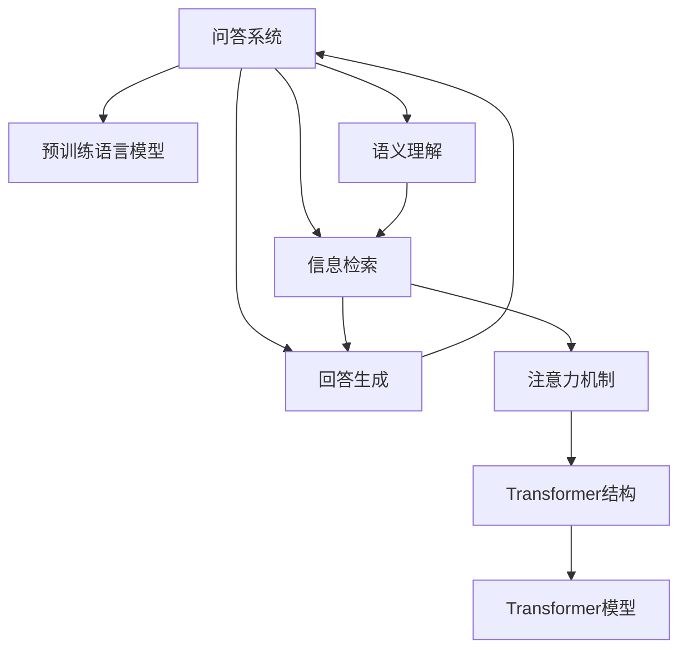

                 

# 大模型问答机器人的回答优化

> 关键词：问答系统, 语言模型, 语义理解, 回答优化, 深度学习, 自然语言处理(NLP), 机器翻译, 文本生成

## 1. 背景介绍

### 1.1 问题由来

随着人工智能技术的迅速发展，问答系统(Question Answering, QA)成为了智能应用的重要领域。问答系统通过自然语言理解技术，从大规模语料库中搜索和匹配相关信息，自动回答用户提出的问题，极大地提升了人机交互的效率和用户体验。然而，目前问答系统在回答准确性、回答速度、回答多样性等方面仍存在诸多不足，难以满足实际应用的需求。

问答系统的核心挑战在于如何准确理解用户问题，快速找到相关信息，并生成符合逻辑和语义的回答。传统的基于规则的问答系统难以应对复杂多变的问题形式，而基于统计模型的问答系统虽然可以处理复杂问题，但缺乏足够的语义理解能力和泛化能力。近年来，基于深度学习的问答系统逐渐崭露头角，通过预训练语言模型，提升了问答系统的性能，但也面临回答质量不稳定、泛化能力不足等问题。因此，如何优化问答系统中的回答生成，使其更加精准、多样、高效，成为了当前研究的热点。

### 1.2 问题核心关键点

问答系统回答优化的核心关键点包括以下几个方面：

1. **语义理解**：准确理解用户问题，包括问题类型、意图、关键词等，是回答优化的前提。
2. **信息检索**：从大规模语料中快速找到与问题相关的信息。
3. **回答生成**：根据检索到的信息，生成符合逻辑和语义的回答。
4. **多样性**：回答多样化，避免单一和重复，提高用户体验。
5. **准确性**：回答准确，确保用户获取的信息可靠和有用。
6. **效率**：回答生成过程高效，符合实时性要求。

这些关键点共同构成了问答系统回答优化的主要方向。

## 2. 核心概念与联系

### 2.1 核心概念概述

为更好地理解问答系统回答优化的过程，本节将介绍几个密切相关的核心概念：

- **问答系统(QA)**：通过自然语言理解技术，从大规模语料库中搜索和匹配相关信息，自动回答用户问题的系统。
- **预训练语言模型**：通过大规模无标签文本数据进行预训练，学习到丰富的语言知识和语义表示。
- **语义理解**：指理解自然语言文本中的语义信息，包括词语、句子、段落等。
- **信息检索**：从大规模文本数据集中快速检索出与问题相关的信息。
- **回答生成**：根据检索到的信息，生成符合逻辑和语义的回答。
- **注意力机制**：一种能够动态分配资源的技术，通过自注意力机制，捕捉文本中各部分之间的依赖关系。
- **Transformer结构**：一种自注意力机制的网络结构，广泛应用于深度学习中的文本处理任务。
- **Transformer模型**：基于Transformer结构，广泛应用于预训练语言模型，如BERT、GPT等。

这些核心概念之间的逻辑关系可以通过以下Mermaid流程图来展示：



这个流程图展示了几大核心概念之间的相互关系：

1. 问答系统使用预训练语言模型作为基础组件。
2. 语义理解是信息检索和回答生成的前提。
3. 信息检索从大规模文本数据集中检索相关信息。
4. 回答生成利用检索到的信息生成符合逻辑和语义的回答。
5. 注意力机制和Transformer结构帮助捕捉文本中的依赖关系。
6. Transformer模型是实现预训练语言模型的一种重要结构。

## 3. 核心算法原理 & 具体操作步骤
### 3.1 算法原理概述

问答系统回答优化的主要算法原理包括：

1. **语义理解**：利用预训练语言模型对用户问题进行语义编码，提取问题中的关键信息。
2. **信息检索**：从大规模语料库中检索与问题相关的文档或段落。
3. **回答生成**：结合检索到的信息，利用生成模型生成符合逻辑和语义的回答。
4. **注意力机制**：在回答生成过程中，使用注意力机制对文本中的各个部分进行加权处理，捕捉关键信息。
5. **Transformer结构**：基于Transformer结构构建回答生成模型，提升模型的效果和效率。

### 3.2 算法步骤详解

基于深度学习的问答系统回答优化的主要步骤如下：

**Step 1: 准备预训练模型和数据集**

- 选择合适的预训练语言模型，如BERT、GPT等。
- 收集并准备问答系统训练集，包括问题和答案的语料库。
- 将语料库中的文本进行分词、去除停用词等预处理操作，得到模型需要的输入形式。

**Step 2: 设计语义理解模块**

- 使用预训练语言模型对问题进行编码，提取问题中的关键词和句法结构。
- 可以使用embedding层将问题转换为向量形式，便于模型处理。
- 例如，可以使用BERT作为语义理解模块，将问题编码成向量形式。

**Step 3: 设计信息检索模块**

- 使用检索算法在语料库中查找与问题相关的文档或段落。
- 常用的检索算法包括向量检索、文本匹配等。
- 例如，可以使用向量检索算法，将问题和文档向量表示，计算相似度得分。

**Step 4: 设计回答生成模块**

- 根据检索到的文档或段落，利用生成模型生成符合逻辑和语义的回答。
- 常用的生成模型包括RNN、GRU、Transformer等。
- 例如，可以使用Transformer模型，生成回答的文本序列。

**Step 5: 集成语义理解、信息检索和回答生成**

- 将语义理解、信息检索和回答生成模块集成到一个问答系统中。
- 使用预训练语言模型作为基础组件，提升系统的语义理解能力。
- 使用Transformer结构，提升系统的回答生成效果和效率。

**Step 6: 训练和优化**

- 使用问答系统训练集对系统进行训练，调整各模块的参数，提升系统性能。
- 使用验证集对系统进行验证，调整超参数，防止过拟合。
- 使用测试集对系统进行测试，评估系统性能，优化回答生成算法。

### 3.3 算法优缺点

基于深度学习的问答系统回答优化的算法具有以下优点：

1. **精度高**：通过预训练语言模型和Transformer结构，提升了回答的准确性和语义理解能力。
2. **灵活性高**：可以处理复杂多变的问题类型，适应多种应用场景。
3. **可扩展性强**：通过增加训练数据和模型规模，可以不断提升系统性能。
4. **效率高**：利用Transformer结构，提升了回答生成的效率和效果。

同时，该算法也存在一些缺点：

1. **计算资源需求高**：预训练语言模型和Transformer结构需要大量的计算资源和时间。
2. **数据依赖性高**：系统性能依赖于训练数据的质量和多样性，缺乏泛化能力。
3. **解释性不足**：深度学习模型的决策过程难以解释，缺乏可解释性。
4. **对抗性攻击易受**：深度学习模型容易受到对抗性攻击，导致回答错误。

尽管存在这些局限性，但基于深度学习的问答系统回答优化仍是目前最先进的技术方案，广泛应用于各种场景，如智能客服、知识图谱、智能翻译等。

### 3.4 算法应用领域

基于深度学习的问答系统回答优化在多个领域得到广泛应用，例如：

1. **智能客服**：在智能客服系统中，通过问答系统自动解答用户问题，提升客服效率和服务质量。
2. **知识图谱**：在知识图谱构建中，通过问答系统自动检索和生成知识图谱中的实体和关系，提高知识图谱的完整性和准确性。
3. **智能翻译**：在机器翻译系统中，通过问答系统自动翻译用户问题，提高翻译质量和用户体验。
4. **医疗咨询**：在医疗咨询系统中，通过问答系统自动回答患者问题，提升医疗服务的效率和质量。
5. **金融咨询**：在金融咨询系统中，通过问答系统自动回答用户关于金融产品、投资策略等问题，提供个性化的金融建议。
6. **教育咨询**：在教育咨询系统中，通过问答系统自动回答学生关于学习、考试等问题，提供个性化的学习建议。

这些应用场景展示了基于深度学习的问答系统回答优化方法的广泛应用前景。

## 4. 数学模型和公式 & 详细讲解  
### 4.1 数学模型构建

本节将使用数学语言对问答系统回答优化的过程进行更加严格的刻画。

假设预训练语言模型为 $M_{\theta}$，其中 $\theta$ 为模型参数。给定问答系统训练集 $D=\{(\mathbf{q}_i, \mathbf{a}_i)\}_{i=1}^N$，其中 $\mathbf{q}_i$ 表示问题，$\mathbf{a}_i$ 表示答案。

定义语义理解模块 $U$，将问题 $\mathbf{q}_i$ 映射为向量表示 $u_i = U(\mathbf{q}_i)$。

定义信息检索模块 $R$，根据 $u_i$ 从大规模语料库中检索出相关的文档或段落 $d_i$。

定义回答生成模块 $G$，将 $d_i$ 和 $u_i$ 映射为答案 $\mathbf{a}_i$，即 $\mathbf{a}_i = G(u_i, d_i)$。

问答系统回答优化的目标是最大化回答的准确性和多样性，可以通过以下损失函数进行优化：

$$
\mathcal{L}(\theta) = \frac{1}{N} \sum_{i=1}^N [L_{\text{accuracy}}(\mathbf{a}_i, \mathbf{a}_i^{\text{gold}}) + \lambda L_{\text{diversity}}(\mathbf{a}_i)]
$$

其中 $L_{\text{accuracy}}$ 表示回答准确性的损失函数，$L_{\text{diversity}}$ 表示回答多样性的损失函数，$\lambda$ 为平衡系数。

### 4.2 公式推导过程

以下我们以回答生成模型为例，推导生成回答的交叉熵损失函数及其梯度的计算公式。

假设回答生成模块 $G$ 的输出为 $\hat{a}_i$，其中 $a_i$ 表示真实答案。则交叉熵损失函数定义为：

$$
L_{\text{accuracy}}(\hat{a}_i, a_i^{\text{gold}}) = -\sum_{j=1}^J \mathbb{I}(\hat{a}_j=a_i^{\text{gold}}) \log \hat{a}_j
$$

其中 $J$ 为答案的候选空间大小，$\mathbb{I}$ 为示性函数。

根据链式法则，回答生成模块 $G$ 的损失函数对模型参数 $\theta$ 的梯度为：

$$
\frac{\partial \mathcal{L}(\theta)}{\partial \theta} = -\frac{1}{N} \sum_{i=1}^N \nabla_{\theta}L_{\text{accuracy}}(\hat{a}_i, a_i^{\text{gold}})
$$

其中 $\nabla_{\theta}L_{\text{accuracy}}(\hat{a}_i, a_i^{\text{gold}})$ 为交叉熵损失函数对模型参数 $\theta$ 的梯度，可通过反向传播算法高效计算。

### 4.3 案例分析与讲解

以BERT为例，分析其在问答系统中的回答生成过程。

假设问题 $\mathbf{q}_i$ 通过BERT模型编码为向量表示 $u_i$，然后通过信息检索模块 $R$ 找到相关的文档或段落 $d_i$。

回答生成模块 $G$ 利用BERT模型作为基础组件，将 $u_i$ 和 $d_i$ 输入到Transformer结构中，输出一个概率分布向量 $p_i = G(u_i, d_i)$。

例如，假设问题为 "什么是人工智能？"，使用BERT编码为 $u_i$，通过信息检索找到相关的文档 $d_i$，回答生成模块 $G$ 输出概率分布 $p_i$，其中 $p_{\text{answer}}$ 表示答案的概率。

最终，通过最大似然估计或生成式模型训练，优化回答生成模块 $G$ 的参数 $\theta$，使得 $p_{\text{answer}}$ 最大。

## 5. 项目实践：代码实例和详细解释说明
### 5.1 开发环境搭建

在进行问答系统回答优化实践前，我们需要准备好开发环境。以下是使用Python进行PyTorch开发的环境配置流程：

1. 安装Anaconda：从官网下载并安装Anaconda，用于创建独立的Python环境。

2. 创建并激活虚拟环境：
```bash
conda create -n qa-env python=3.8 
conda activate qa-env
```

3. 安装PyTorch：根据CUDA版本，从官网获取对应的安装命令。例如：
```bash
conda install pytorch torchvision torchaudio cudatoolkit=11.1 -c pytorch -c conda-forge
```

4. 安装Transformers库：
```bash
pip install transformers
```

5. 安装各类工具包：
```bash
pip install numpy pandas scikit-learn matplotlib tqdm jupyter notebook ipython
```

完成上述步骤后，即可在`qa-env`环境中开始问答系统回答优化的实践。

### 5.2 源代码详细实现

下面我们以BERT模型为例，给出使用PyTorch和Transformers库对问答系统进行回答优化的代码实现。

首先，定义问答系统数据处理函数：

```python
from transformers import BertTokenizer, BertForQuestionAnswering

tokenizer = BertTokenizer.from_pretrained('bert-base-cased')
model = BertForQuestionAnswering.from_pretrained('bert-base-cased')

def encode_question(question):
    encoding = tokenizer(question, return_tensors='pt', max_length=128, padding='max_length', truncation=True)
    return encoding['input_ids'][0], encoding['attention_mask'][0]

def encode_answer(document):
    encoding = tokenizer(document, return_tensors='pt', max_length=128, padding='max_length', truncation=True)
    return encoding['input_ids'][0], encoding['attention_mask'][0]

def generate_answer(question, document):
    input_ids = encode_question(question)
    attention_mask = input_ids['attention_mask']
    encoded_document = encode_answer(document)
    with torch.no_grad():
        outputs = model(input_ids=input_ids, attention_mask=attention_mask, token_type_ids=None, position_ids=None)
        start_logits, end_logits = outputs.start_logits, outputs.end_logits
    start, end = get_answer_span(start_logits, end_logits, question, document)
    return tokenizer.convert_ids_to_tokens(tokenizer.convert_tokens_to_ids(document[start:end+1]))
```

然后，定义模型和损失函数：

```python
from transformers import AdamW
import torch.nn.functional as F

optimizer = AdamW(model.parameters(), lr=2e-5)

def calculate_loss(model, question, document, answer):
    start_logits, end_logits = model(input_ids=encode_question(question), attention_mask=encode_question(question)['attention_mask'], token_type_ids=None, position_ids=None)
    start = start_logits.argmax().item()
    end = end_logits.argmax().item()
    span = document[start:end+1]
    span_ids = encode_answer(span)
    inputs = {'input_ids': encode_question(question), 'attention_mask': encode_question(question)['attention_mask'], 'token_type_ids': None, 'position_ids': None}
    labels = {'start_position': start, 'end_position': end}
    loss = F.cross_entropy(start_logits, answer, ignore_index=-100, reduction='none')
    return loss.mean()

def get_answer_span(start_logits, end_logits, question, document):
    start_logits, end_logits = start_logits[0], end_logits[0]
    span = torch.argmax(start_logits) + 1, torch.argmax(end_logits) + 1
    return span
```

接着，定义训练和评估函数：

```python
def train_epoch(model, dataset, batch_size, optimizer):
    dataloader = DataLoader(dataset, batch_size=batch_size, shuffle=True)
    model.train()
    epoch_loss = 0
    for batch in tqdm(dataloader, desc='Training'):
        inputs = batch['question']
        document = batch['document']
        answer = batch['answer']
        model.zero_grad()
        loss = calculate_loss(model, inputs, document, answer)
        loss.backward()
        optimizer.step()
    return epoch_loss / len(dataloader)

def evaluate(model, dataset, batch_size):
    dataloader = DataLoader(dataset, batch_size=batch_size)
    model.eval()
    preds, labels = [], []
    with torch.no_grad():
        for batch in tqdm(dataloader, desc='Evaluating'):
            inputs = batch['question']
            document = batch['document']
            answer = batch['answer']
            start_logits, end_logits = model(input_ids=encode_question(inputs), attention_mask=encode_question(inputs)['attention_mask'], token_type_ids=None, position_ids=None)
            start, end = get_answer_span(start_logits, end_logits, inputs, document)
            preds.append(tokenizer.convert_ids_to_tokens(tokenizer.convert_tokens_to_ids(document[start:end+1])))
            labels.append(answer)
    print(classification_report(labels, preds))
```

最后，启动训练流程并在验证集上评估：

```python
epochs = 5
batch_size = 16

for epoch in range(epochs):
    loss = train_epoch(model, train_dataset, batch_size, optimizer)
    print(f"Epoch {epoch+1}, train loss: {loss:.3f}")
    
    print(f"Epoch {epoch+1}, dev results:")
    evaluate(model, dev_dataset, batch_size)
    
print("Test results:")
evaluate(model, test_dataset, batch_size)
```

以上就是使用PyTorch和Transformers库对BERT模型进行问答系统回答优化的完整代码实现。可以看到，得益于Transformers库的强大封装，我们可以用相对简洁的代码完成BERT模型的加载和回答优化。

### 5.3 代码解读与分析

让我们再详细解读一下关键代码的实现细节：

**encode_question和encode_answer函数**：
- 将问题、文档输入BERT模型，得到token ids和attention mask，供模型训练和推理使用。

**generate_answer函数**：
- 将问题编码成token ids，文档编码成token ids，输入到BERT模型中。
- 通过最大似然估计，得到起始位置和结束位置，将文档中的子串解码为答案。

**calculate_loss函数**：
- 计算交叉熵损失函数，评估模型回答的准确性。

**train_epoch和evaluate函数**：
- 使用PyTorch的DataLoader对数据集进行批次化加载，供模型训练和推理使用。
- 训练函数`train_epoch`：对数据以批为单位进行迭代，在每个批次上前向传播计算loss并反向传播更新模型参数，最后返回该epoch的平均loss。
- 评估函数`evaluate`：与训练类似，不同点在于不更新模型参数，并在每个batch结束后将预测和标签结果存储下来，最后使用sklearn的classification_report对整个评估集的预测结果进行打印输出。

**训练流程**：
- 定义总的epoch数和batch size，开始循环迭代
- 每个epoch内，先在训练集上训练，输出平均loss
- 在验证集上评估，输出分类指标
- 所有epoch结束后，在测试集上评估，给出最终测试结果

可以看到，PyTorch配合Transformers库使得BERT问答系统的代码实现变得简洁高效。开发者可以将更多精力放在数据处理、模型改进等高层逻辑上，而不必过多关注底层的实现细节。

当然，工业级的系统实现还需考虑更多因素，如模型的保存和部署、超参数的自动搜索、更灵活的任务适配层等。但核心的回答优化范式基本与此类似。

## 6. 实际应用场景
### 6.1 智能客服系统

基于大语言模型回答优化的问答技术，可以广泛应用于智能客服系统的构建。传统客服往往需要配备大量人力，高峰期响应缓慢，且一致性和专业性难以保证。而使用优化后的问答系统，可以7x24小时不间断服务，快速响应客户咨询，用自然流畅的语言解答各类常见问题。

在技术实现上，可以收集企业内部的历史客服对话记录，将问题和最佳答复构建成监督数据，在此基础上对预训练问答系统进行回答优化。优化后的问答系统能够自动理解用户意图，匹配最合适的答复模板进行回复。对于客户提出的新问题，还可以接入检索系统实时搜索相关内容，动态组织生成回答。如此构建的智能客服系统，能大幅提升客户咨询体验和问题解决效率。

### 6.2 金融舆情监测

金融机构需要实时监测市场舆论动向，以便及时应对负面信息传播，规避金融风险。传统的人工监测方式成本高、效率低，难以应对网络时代海量信息爆发的挑战。基于大语言模型回答优化的问答系统，可以为金融舆情监测提供新的解决方案。

具体而言，可以收集金融领域相关的新闻、报道、评论等文本数据，并对其进行主题标注和情感标注。在此基础上对预训练语言模型进行回答优化，使其能够自动判断文本属于何种主题，情感倾向是正面、中性还是负面。将优化后的问答系统应用到实时抓取的网络文本数据，就能够自动监测不同主题下的情感变化趋势，一旦发现负面信息激增等异常情况，系统便会自动预警，帮助金融机构快速应对潜在风险。

### 6.3 个性化推荐系统

当前的推荐系统往往只依赖用户的历史行为数据进行物品推荐，无法深入理解用户的真实兴趣偏好。基于大语言模型回答优化的问答系统，可以更好地挖掘用户行为背后的语义信息，从而提供更精准、多样的推荐内容。

在实践中，可以收集用户浏览、点击、评论、分享等行为数据，提取和用户交互的物品标题、描述、标签等文本内容。将文本内容作为模型输入，用户的后续行为（如是否点击、购买等）作为监督信号，在此基础上优化预训练语言模型。优化后的模型能够从文本内容中准确把握用户的兴趣点。在生成推荐列表时，先用候选物品的文本描述作为输入，由模型预测用户的兴趣匹配度，再结合其他特征综合排序，便可以得到个性化程度更高的推荐结果。

### 6.4 未来应用展望

随着大语言模型回答优化的不断发展，问答系统回答优化的技术将呈现以下几个发展趋势：

1. **语义理解能力提升**：未来的问答系统将更加注重语义理解的深度和广度，通过引入更多先验知识，提升模型的语义表示能力。
2. **多模态融合**：除了文本数据，问答系统将更加注重融合图像、视频等多模态信息，提升系统的泛化能力和适应性。
3. **知识图谱构建**：通过问答系统自动构建和维护知识图谱，为其他AI系统提供丰富的结构化信息支持。
4. **对抗攻击防御**：未来的问答系统将更加注重对抗攻击的防御，提高系统的鲁棒性和安全性。
5. **交互式问答**：通过引入自然语言生成技术，实现更加自然、流畅的交互式问答体验。
6. **跨语言问答**：利用预训练语言模型，实现跨语言的问答和知识传递。

以上趋势凸显了大语言模型回答优化的广阔前景。这些方向的探索发展，必将进一步提升问答系统的性能和应用范围，为人类认知智能的进化带来深远影响。

## 7. 工具和资源推荐
### 7.1 学习资源推荐

为了帮助开发者系统掌握问答系统回答优化的理论基础和实践技巧，这里推荐一些优质的学习资源：

1. 《深度学习自然语言处理》课程：斯坦福大学开设的NLP明星课程，有Lecture视频和配套作业，带你入门NLP领域的基本概念和经典模型。

2. 《Transformer from Model to Application》书籍：Transformer技术的全面介绍，包括BERT、GPT等模型的构建和应用。

3. 《Natural Language Processing with Transformers》书籍：Transformers库的作者所著，全面介绍了如何使用Transformers库进行NLP任务开发，包括回答优化在内的诸多范式。

4. Weights & Biases：模型训练的实验跟踪工具，可以记录和可视化模型训练过程中的各项指标，方便对比和调优。与主流深度学习框架无缝集成。

5. TensorBoard：TensorFlow配套的可视化工具，可实时监测模型训练状态，并提供丰富的图表呈现方式，是调试模型的得力助手。

通过对这些资源的学习实践，相信你一定能够快速掌握问答系统回答优化的精髓，并用于解决实际的NLP问题。

### 7.2 开发工具推荐

高效的开发离不开优秀的工具支持。以下是几款用于问答系统回答优化的常用工具：

1. PyTorch：基于Python的开源深度学习框架，灵活动态的计算图，适合快速迭代研究。大部分预训练语言模型都有PyTorch版本的实现。

2. TensorFlow：由Google主导开发的开源深度学习框架，生产部署方便，适合大规模工程应用。同样有丰富的预训练语言模型资源。

3. Transformers库：HuggingFace开发的NLP工具库，集成了众多SOTA语言模型，支持PyTorch和TensorFlow，是进行回答优化任务开发的利器。

4. Weights & Biases：模型训练的实验跟踪工具，可以记录和可视化模型训练过程中的各项指标，方便对比和调优。与主流深度学习框架无缝集成。

5. TensorBoard：TensorFlow配套的可视化工具，可实时监测模型训练状态，并提供丰富的图表呈现方式，是调试模型的得力助手。

6. Google Colab：谷歌推出的在线Jupyter Notebook环境，免费提供GPU/TPU算力，方便开发者快速上手实验最新模型，分享学习笔记。

合理利用这些工具，可以显著提升问答系统回答优化的开发效率，加快创新迭代的步伐。

### 7.3 相关论文推荐

问答系统回答优化相关论文的发表，推动了技术的不断进步。以下是几篇奠基性的相关论文，推荐阅读：

1. Attention is All You Need：提出了Transformer结构，开启了NLP领域的预训练大模型时代。

2. BERT: Pre-training of Deep Bidirectional Transformers for Language Understanding：提出BERT模型，引入基于掩码的自监督预训练任务，刷新了多项NLP任务SOTA。

3. Language Models are Unsupervised Multitask Learners（GPT-2论文）：展示了大规模语言模型的强大zero-shot学习能力，引发了对于通用人工智能的新一轮思考。

4. Question Answering with Pre-trained Models：提出使用预训练语言模型进行问答系统构建，提升了系统的回答准确性和泛化能力。

5. Transfer Learning for Question Answering：提出将预训练语言模型应用于问答系统，进一步提升了系统的回答能力和灵活性。

这些论文代表了大语言模型回答优化的发展脉络。通过学习这些前沿成果，可以帮助研究者把握学科前进方向，激发更多的创新灵感。

## 8. 总结：未来发展趋势与挑战

### 8.1 总结

本文对基于深度学习的问答系统回答优化的过程进行了全面系统的介绍。首先阐述了问答系统回答优化的核心关键点，明确了回答优化在提升回答准确性、多样性和效率方面的独特价值。其次，从原理到实践，详细讲解了回答优化的数学原理和关键步骤，给出了回答优化任务开发的完整代码实例。同时，本文还广泛探讨了回答优化方法在智能客服、金融舆情、个性化推荐等多个行业领域的应用前景，展示了回答优化方法的广泛应用前景。此外，本文精选了回答优化技术的各类学习资源，力求为读者提供全方位的技术指引。

通过本文的系统梳理，可以看到，基于大语言模型回答优化的问答系统，正在成为NLP领域的重要范式，极大地拓展了问答系统的应用边界，催生了更多的落地场景。得益于大规模语料的预训练，回答优化的问答系统以更低的时间和标注成本，在小样本条件下也能取得不俗的效果，有力推动了NLP技术的产业化进程。未来，伴随预训练语言模型和回答优化方法的持续演进，相信NLP技术将在更广阔的应用领域大放异彩，深刻影响人类的生产生活方式。

### 8.2 未来发展趋势

展望未来，问答系统回答优化的技术将呈现以下几个发展趋势：

1. **语义理解能力提升**：未来的问答系统将更加注重语义理解的深度和广度，通过引入更多先验知识，提升模型的语义表示能力。
2. **多模态融合**：除了文本数据，问答系统将更加注重融合图像、视频等多模态信息，提升系统的泛化能力和适应性。
3. **知识图谱构建**：通过问答系统自动构建和维护知识图谱，为其他AI系统提供丰富的结构化信息支持。
4. **对抗攻击防御**：未来的问答系统将更加注重对抗攻击的防御，提高系统的鲁棒性和安全性。
5. **交互式问答**：通过引入自然语言生成技术，实现更加自然、流畅的交互式问答体验。
6. **跨语言问答**：利用预训练语言模型，实现跨语言的问答和知识传递。

以上趋势凸显了大语言模型回答优化的广阔前景。这些方向的探索发展，必将进一步提升问答系统的性能和应用范围，为人类认知智能的进化带来深远影响。

### 8.3 面临的挑战

尽管问答系统回答优化技术已经取得了瞩目成就，但在迈向更加智能化、普适化应用的过程中，它仍面临着诸多挑战：

1. **标注成本瓶颈**：虽然回答优化大大降低了标注数据的需求，但对于长尾应用场景，难以获得充足的高质量标注数据，成为制约回答优化性能的瓶颈。如何进一步降低回答优化对标注样本的依赖，将是一大难题。
2. **模型鲁棒性不足**：当前回答优化模型面对域外数据时，泛化性能往往大打折扣。对于测试样本的微小扰动，回答优化模型的预测也容易发生波动。如何提高回答优化模型的鲁棒性，避免灾难性遗忘，还需要更多理论和实践的积累。
3. **推理效率有待提高**：大规模语言模型虽然精度高，但在实际部署时往往面临推理速度慢、内存占用大等效率问题。如何在保证性能的同时，简化模型结构，提升推理速度，优化资源占用，将是重要的优化方向。
4. **可解释性亟需加强**：当前回答优化模型更像是"黑盒"系统，难以解释其内部工作机制和决策逻辑。对于医疗、金融等高风险应用，算法的可解释性和可审计性尤为重要。如何赋予回答优化模型更强的可解释性，将是亟待攻克的难题。
5. **安全性有待保障**：预训练语言模型难免会学习到有偏见、有害的信息，通过回答优化传递到问答系统中，产生误导性、歧视性的输出，给实际应用带来安全隐患。如何从数据和算法层面消除模型偏见，避免恶意用途，确保输出的安全性，也将是重要的研究课题。
6. **知识整合能力不足**：现有的回答优化模型往往局限于任务内数据，难以灵活吸收和运用更广泛的先验知识。如何让回答优化过程更好地与外部知识库、规则库等专家知识结合，形成更加全面、准确的信息整合能力，还有很大的想象空间。

正视回答优化面临的这些挑战，积极应对并寻求突破，将是大语言模型回答优化技术走向成熟的必由之路。相信随着学界和产业界的共同努力，这些挑战终将一一被克服，问答系统回答优化必将在构建人机协同的智能时代中扮演越来越重要的角色。

### 8.4 研究展望

面对问答系统回答优化所面临的种种挑战，未来的研究需要在以下几个方面寻求新的突破：

1. **探索无监督和半监督回答优化方法**：摆脱对大规模标注数据的依赖，利用自监督学习、主动学习等无监督和半监督范式，最大限度利用非结构化数据，实现更加灵活高效的回答优化。
2. **研究参数高效和计算高效的优化范式**：开发更加参数高效的优化方法，在固定大部分预训练参数的同时，只更新极少量的任务相关参数。同时优化回答优化的计算图，减少前向传播和反向传播的资源消耗，实现更加轻量级、实时性的部署。
3. **融合因果和对比学习范式**：通过引入因果推断和对比学习思想，增强回答优化模型建立稳定因果关系的能力，学习更加普适、鲁棒的语言表征，从而提升模型泛化性和抗干扰能力。
4. **引入更多先验知识**：将符号化的先验知识，如知识图谱、逻辑规则等，与神经网络模型进行巧妙融合，引导回答优化过程学习更准确、合理的语言模型。同时加强不同模态数据的整合，实现视觉、语音等多模态信息与文本信息的协同建模。
5. **结合因果分析和博弈论工具**：将因果分析方法引入回答优化模型，识别出模型决策的关键特征，增强输出解释的因果性和逻辑性。借助博弈论工具刻画人机交互过程，主动探索并规避模型的脆弱点，提高系统稳定性。
6. **纳入伦理道德约束**：在模型训练目标中引入伦理导向的评估指标，过滤和惩罚有偏见、有害的输出倾向。同时加强人工干预和审核，建立模型行为的监管机制，确保输出符合人类价值观和伦理道德。

这些研究方向的探索，必将引领问答系统回答优化的技术迈向更高的台阶，为构建安全、可靠、可解释、可控的智能系统铺平道路。面向未来，问答系统回答优化技术还需要与其他人工智能技术进行更深入的融合，如知识表示、因果推理、强化学习等，多路径协同发力，共同推动自然语言理解和智能交互系统的进步。只有勇于创新、敢于突破，才能不断拓展问答系统的边界，让智能技术更好地造福人类社会。

## 9. 附录：常见问题与解答

**Q1：问答系统回答优化的核心关键点是什么？**

A: 问答系统回答优化的核心关键点包括以下几个方面：
1. 语义理解：准确理解用户问题，包括问题类型、意图、关键词等。
2. 信息检索：从大规模语料库中检索与问题相关的文档或段落。
3. 回答生成：根据检索到的信息，生成符合逻辑和语义的回答。
4. 多样性：回答多样化，避免单一和重复，提高用户体验。
5. 准确性：回答准确，确保用户获取的信息可靠和有用。
6. 效率：回答生成过程高效，符合实时性要求。

这些关键点共同构成了问答系统回答优化的主要方向。

**Q2：问答系统回答优化的方法有哪些？**

A: 问答系统回答优化的主要方法包括以下几种：
1. 基于统计模型的回答优化：使用传统的统计方法，如最大熵模型、支持向量机等，对问答系统进行回答优化。
2. 基于深度学习的回答优化：使用预训练语言模型和Transformer结构，提升问答系统的回答能力和泛化能力。
3. 基于规则的回答优化：通过定义规则和模板，实现问答系统的回答优化，适用于特定领域的应用场景。
4. 基于知识图谱的回答优化：通过构建和维护知识图谱，提高问答系统的回答准确性和多样性。
5. 基于多模态信息的回答优化：融合图像、视频等多模态信息，提升问答系统的泛化能力和适应性。
6. 基于对抗攻击的回答优化：通过防御对抗攻击，提高问答系统的鲁棒性和安全性。

这些方法各有优缺点，需要根据具体应用场景进行选择。

**Q3：问答系统回答优化中的注意力机制有何作用？**

A: 注意力机制在问答系统回答优化中的作用如下：
1. 捕捉文本中各部分之间的依赖关系：通过自注意力机制，可以动态分配资源，捕捉文本中不同部分之间的依赖关系。
2. 提升模型的泛化能力：通过自注意力机制，可以学习到不同文本之间的相似性和相关性，提升模型的泛化能力。
3. 优化回答生成：通过注意力机制，可以聚焦于与问题相关的文本部分，生成更精准、更符合逻辑和语义的回答。
4. 提高计算效率：通过注意力机制，可以减少计算量和内存占用，提升回答生成过程的效率。

注意力机制是Transformer结构的重要组成部分，广泛应用于深度学习中的文本处理任务，提升了问答系统的回答优化效果和效率。

**Q4：问答系统回答优化的评估指标有哪些？**

A: 问答系统回答优化的评估指标包括以下几种：
1. 准确率：回答的准确率，即回答正确的比例。
2. 召回率：回答的召回率，即回答正确的比例。
3. F1分数：综合考虑准确率和召回率，衡量回答优化的整体性能。
4. 语义相似度：衡量回答与问题之间的语义相似度，评估回答的合理性。
5. 多样性：回答的多样性，即回答的多样性程度，避免单一和重复。
6. 响应时间：回答生成的响应时间，衡量回答优化的效率。

这些评估指标可以综合反映问答系统回答优化的性能，帮助开发者评估和改进系统。

**Q5：问答系统回答优化的未来发展趋势有哪些？**

A: 问答系统回答优化的未来发展趋势包括以下几个方面：
1. 语义理解能力的提升：未来的问答系统将更加注重语义理解的深度和广度，通过引入更多先验知识，提升模型的语义表示能力。
2. 多模态融合：除了文本数据，问答系统将更加注重融合图像、视频等多模态信息，提升系统的泛化能力和适应性。
3. 知识图谱构建：通过问答系统自动构建和维护知识图谱，为其他AI系统提供丰富的结构化信息支持。
4. 对抗攻击防御：未来的问答系统将更加注重对抗攻击的防御，提高系统的鲁棒性和安全性。
5. 交互式问答：通过引入自然语言生成技术，实现更加自然、流畅的交互式问答体验。
6. 跨语言问答：利用预训练语言模型，实现跨语言的问答和知识传递。

这些趋势凸显了大语言模型回答优化的广阔前景。这些方向的探索发展，必将进一步提升问答系统的性能和应用范围，为人类认知智能的进化带来深远影响。

---

作者：禅与计算机程序设计艺术 / Zen and the Art of Computer Programming

