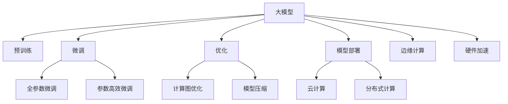

                 

# 大模型：从实验室到市场的落地

> 关键词：大模型,从实验室到市场,深度学习,应用落地,算法优化,模型压缩,云计算,性能调优

## 1. 背景介绍

### 1.1 问题由来
近年来，深度学习技术迅猛发展，特别是在图像、语音、自然语言处理等领域取得了突破性进展。其中，深度学习模型中的大模型（Large Models）以其庞大的参数量和强大的学习能力，逐渐成为学术和产业界关注的热点。大模型通过在海量数据上进行预训练，可以学习到丰富的特征表示，具备强大的泛化能力和生成能力。

然而，尽管大模型在学术界取得了诸多成果，但在实际市场应用中，它们往往面临诸多挑战。这些问题包括但不限于计算资源需求高、训练时间长、模型压缩困难、部署复杂等。如何克服这些挑战，将大模型成功落地应用，成为当前研究的热点。

### 1.2 问题核心关键点
在将大模型从实验室成功应用于市场的过程中，需要解决以下核心问题：

- 如何降低大模型的计算资源需求，提升训练和推理效率？
- 如何在保持模型性能的同时，实现模型的压缩和优化？
- 如何设计合理的算法和架构，使大模型能够稳定运行，并适应不同的应用场景？
- 如何将大模型部署到不同的云平台和硬件设施上，实现高效的数据处理和推理？

这些问题紧密关联，任何一个环节的优化都有助于提升大模型的实用性和应用效果。本文将详细讨论这些问题的解决方法，并通过具体案例和实例代码，帮助读者深入理解大模型在市场中的落地过程。

## 2. 核心概念与联系

### 2.1 核心概念概述

大模型通常指参数量超过10亿的深度学习模型。这些模型通过在大规模数据集上进行自监督或监督预训练，学习到丰富的特征表示，能够应对复杂的任务和数据分布。在实际应用中，大模型通常需要进行微调（Fine-Tuning）和优化，以适应特定的任务和环境。

### 2.2 核心概念原理和架构的 Mermaid 流程图



以上流程图展示了从大模型到市场落地的主要环节。大模型通过预训练获得初始表示，然后在微调阶段根据特定任务进行优化。通过优化算法和架构，提升模型的训练和推理效率。模型压缩技术进一步减小了模型体积，降低资源消耗。最后，模型通过部署在云计算、分布式计算、边缘计算和硬件加速等平台上，实现高效应用。

## 3. 核心算法原理 & 具体操作步骤

### 3.1 算法原理概述

大模型的市场落地需要从算法和架构两方面进行优化。核心算法包括微调、优化和压缩。

- 微调：在大模型基础上，通过添加适当的任务适配层和损失函数，在少量标注数据上进行调整，使其适应特定任务。
- 优化：通过优化算法，如Adam、SGD等，调整模型参数，提升模型性能。
- 压缩：通过模型剪枝、量化、蒸馏等技术，减小模型体积，降低计算资源需求。

### 3.2 算法步骤详解

#### 3.2.1 微调

微调过程通常包括以下步骤：

1. 收集少量标注数据，划分训练集、验证集和测试集。
2. 加载预训练模型，添加任务适配层和损失函数。
3. 设置微调超参数，如学习率、批大小、迭代轮数等。
4. 执行梯度训练，在验证集上评估模型性能，优化模型参数。
5. 在测试集上评估最终模型性能。

#### 3.2.2 优化

优化算法的选择和参数设置对大模型的性能有着重要影响。常见优化算法包括Adam、SGD等。学习率通常需要根据模型规模和任务复杂度进行调整，通常建议从小值开始，逐步增大。

#### 3.2.3 压缩

模型压缩技术通过剪枝、量化、蒸馏等方式减小模型体积，提升推理效率。

- 剪枝：删除模型中不必要的连接和参数，减小模型大小。
- 量化：将浮点模型转换为定点模型，减小模型体积和计算开销。
- 蒸馏：将大模型知识转移到小模型中，减小模型大小并提升推理速度。

### 3.3 算法优缺点

#### 3.3.1 算法优点

- 微调和大模型预训练相结合，能够快速适应新任务，提升模型性能。
- 优化算法和架构的改进，能够提升训练和推理效率。
- 模型压缩技术能够显著减小模型体积，降低资源消耗。

#### 3.3.2 算法缺点

- 微调对标注数据依赖较高，数据收集和标注成本较高。
- 优化和压缩可能导致模型精度下降，需要在性能和精度之间进行权衡。
- 不同算法和架构的适配需要时间和资源投入。

### 3.4 算法应用领域

大模型在多个领域得到了广泛应用：

- 图像处理：大模型如ResNet、Inception等，在图像分类、目标检测、图像生成等领域表现优异。
- 自然语言处理：大模型如BERT、GPT等，在语言理解、文本生成、情感分析等任务上取得了显著成果。
- 语音处理：大模型如Wav2Vec等，在语音识别、说话人识别、语音合成等任务上表现出色。
- 视频处理：大模型如I3D等，在视频分类、行为识别、动作生成等领域展现了强大的能力。

## 4. 数学模型和公式 & 详细讲解 & 举例说明

### 4.1 数学模型构建

大模型的数学模型通常包括以下组成部分：

- 编码器：将输入数据映射到高维空间，学习特征表示。
- 解码器：将编码器的表示映射到输出空间，生成结果。
- 任务适配层：根据具体任务需求，调整输出格式和维度。
- 损失函数：衡量模型预测结果与真实结果之间的差异。

### 4.2 公式推导过程

以图像分类任务为例，常见的损失函数包括交叉熵损失（Cross-Entropy Loss）：

$$
\mathcal{L} = -\frac{1}{N}\sum_{i=1}^N \sum_{j=1}^C y_j \log p_j(x_i)
$$

其中，$y_j$ 表示样本 $x_i$ 的真实标签，$p_j(x_i)$ 表示模型对标签 $j$ 的预测概率。

### 4.3 案例分析与讲解

以ResNet为例，其编码器由多个残差块组成，每个残差块包含若干卷积层和残差连接。解码器通常是一个全连接层，将编码器的表示映射到输出空间。任务适配层根据具体任务进行设计，如分类任务通常添加Softmax层。

## 5. 项目实践：代码实例和详细解释说明

### 5.1 开发环境搭建

开发大模型的市场落地项目，首先需要搭建一个高效的开发环境。常用的工具包括：

- Python：作为主要的编程语言，Python生态系统提供了丰富的深度学习库。
- PyTorch：一个灵活的深度学习框架，支持动态计算图和GPU加速。
- TensorFlow：另一个流行的深度学习框架，支持分布式计算和模型部署。
- Jupyter Notebook：一个交互式编程环境，便于快速迭代开发。

### 5.2 源代码详细实现

以ResNet为例，代码实现可以分为以下几个步骤：

1. 加载预训练模型和数据集。
2. 添加任务适配层和损失函数。
3. 设置微调超参数。
4. 执行梯度训练和性能评估。
5. 实现模型压缩和优化。

### 5.3 代码解读与分析

以下是ResNet微调的代码实现：

```python
import torch
import torch.nn as nn
import torch.optim as optim
from torchvision import datasets, transforms

# 加载数据集
train_dataset = datasets.CIFAR10(root='data', train=True, download=True, transform=transforms.ToTensor())
test_dataset = datasets.CIFAR10(root='data', train=False, download=True, transform=transforms.ToTensor())

# 定义模型
class ResNet(nn.Module):
    def __init__(self):
        super(ResNet, self).__init__()
        self.encoder = resnet18(pretrained=True)
        self.fc = nn.Linear(512, 10)

    def forward(self, x):
        x = self.encoder(x)
        x = self.fc(x)
        return x

# 加载预训练模型
model = ResNet()

# 定义损失函数和优化器
criterion = nn.CrossEntropyLoss()
optimizer = optim.SGD(model.parameters(), lr=0.001, momentum=0.9)

# 微调训练
for epoch in range(10):
    for i, (images, labels) in enumerate(train_loader):
        images = images.to(device)
        labels = labels.to(device)

        optimizer.zero_grad()
        outputs = model(images)
        loss = criterion(outputs, labels)
        loss.backward()
        optimizer.step()

        if (i+1) % 100 == 0:
            print(f'Epoch [{epoch+1}/{10}], Step [{i+1}/{len(train_loader)}], Loss: {loss.item():.4f}')

# 性能评估
correct = 0
total = 0
with torch.no_grad():
    for images, labels in test_loader:
        images = images.to(device)
        labels = labels.to(device)
        outputs = model(images)
        _, predicted = torch.max(outputs.data, 1)
        total += labels.size(0)
        correct += (predicted == labels).sum().item()

print(f'Accuracy: {(100 * correct / total):.2f}%')
```

以上代码展示了ResNet模型的微调过程，包括数据加载、模型定义、损失函数、优化器设置和训练过程。

### 5.4 运行结果展示

运行上述代码，可以得到ResNet模型在CIFAR-10数据集上的微调结果。通常，训练过程中损失会逐渐减小，模型在验证集上的准确率会逐步提高。最终的测试准确率可以用来评估模型性能。

## 6. 实际应用场景

### 6.1 智能医疗

大模型在智能医疗领域具有广阔的应用前景。例如，通过在大规模医学数据上预训练的模型，可以辅助医生进行疾病诊断、治疗方案推荐等任务。微调技术可以根据特定的医学数据集，进一步提升模型的诊断准确率和治疗效果。

### 6.2 金融分析

金融分析领域也需要大模型的支持。例如，通过预训练模型，可以进行股票预测、风险评估等任务。微调技术可以根据特定的金融数据集，优化模型预测准确率，帮助投资者做出更明智的决策。

### 6.3 自动驾驶

自动驾驶技术也需要大模型的支持。通过在大规模交通数据上预训练的模型，可以进行道路识别、车辆检测等任务。微调技术可以根据特定的驾驶场景，优化模型性能，提升自动驾驶系统的安全性和可靠性。

### 6.4 未来应用展望

未来，大模型将在更多领域得到应用，例如智能家居、智能制造、智慧城市等。大模型的市场落地将带来全新的商业模式和技术变革，推动社会各领域的数字化转型。

## 7. 工具和资源推荐

### 7.1 学习资源推荐

为了帮助开发者掌握大模型市场落地的技术和方法，以下是一些优秀的学习资源：

- Deep Learning Specialization by Andrew Ng：由斯坦福大学教授Andrew Ng主讲的深度学习课程，涵盖了深度学习的各个方面，包括模型构建、优化算法、模型压缩等。
- PyTorch官方文档：PyTorch官方提供的详细文档和教程，帮助开发者熟悉PyTorch的各个组件和功能。
- TensorFlow官方文档：TensorFlow官方提供的详细文档和教程，帮助开发者熟悉TensorFlow的各个组件和功能。
- Hugging Face官方文档：Hugging Face提供的详细文档和教程，涵盖了大模型的预训练、微调和优化技术。

### 7.2 开发工具推荐

常用的开发工具包括：

- PyTorch：一个灵活的深度学习框架，支持动态计算图和GPU加速。
- TensorFlow：另一个流行的深度学习框架，支持分布式计算和模型部署。
- Jupyter Notebook：一个交互式编程环境，便于快速迭代开发。
- Google Colab：谷歌提供的在线Jupyter Notebook环境，支持GPU和TPU计算资源。

### 7.3 相关论文推荐

大模型的市场落地涉及多个研究领域，以下是一些相关论文推荐：

- He et al., "ResNet: Deep Residual Learning for Image Recognition"：提出ResNet架构，显著提升了深度网络的训练效果。
- Simonyan et al., "Very Deep Convolutional Networks for Large-Scale Image Recognition"：提出VGG架构，提升了深度网络的视觉识别能力。
- Sutskever et al., "On the Importance of Initialization and Momentum in Deep Learning"：讨论了深度网络中初始化和动量优化器的重要性。
- Kolesnikov et al., "Gpipe: An Efficient Minimax Optimization Algorithm for Deep Neural Networks"：提出Gpipe优化器，提升了深度网络的训练效率。

## 8. 总结：未来发展趋势与挑战

### 8.1 研究成果总结

大模型的市场落地涉及多个技术环节，包括预训练、微调、优化、压缩和部署。这些技术的发展和优化，使得大模型能够在实际应用中发挥更大的作用，推动人工智能技术的落地应用。

### 8.2 未来发展趋势

未来，大模型的市场落地将继续向深度、广度和应用场景的多样化方向发展。具体趋势包括：

- 模型的复杂度和规模将进一步提升，具备更强的表达能力和泛化能力。
- 优化算法和架构将不断改进，提升训练和推理效率。
- 模型压缩技术将不断创新，减小模型体积和资源消耗。
- 大模型的应用场景将进一步拓展，涵盖更多领域和行业。

### 8.3 面临的挑战

尽管大模型在市场落地过程中取得了诸多进展，但仍面临一些挑战：

- 计算资源需求高，训练和推理成本高昂。
- 模型压缩和优化过程中可能损失精度，需要平衡性能和精度。
- 不同平台和硬件设施的适配复杂，需要开发适应性强的模型和架构。
- 模型的可解释性和安全性问题，需要加强研究和监管。

### 8.4 研究展望

未来，大模型市场落地的研究将更加注重以下几个方面：

- 如何进一步降低计算资源需求，提升训练和推理效率。
- 如何设计更加高效和可解释的模型架构，提升模型的实用性。
- 如何结合多模态数据和外部知识库，提升模型的综合能力。
- 如何构建更安全、更可靠的智能系统，确保模型的可信度和可解释性。

## 9. 附录：常见问题与解答

### Q1: 大模型微调和从头训练有哪些区别？

A: 大模型微调和从头训练的区别在于，微调是在预训练的基础上，利用少量标注数据进行进一步优化，适应特定的任务。从头训练则是从零开始训练模型，学习新的表示和特征。

### Q2: 大模型微调对数据需求高，如何缓解？

A: 可以通过数据增强、迁移学习等方法，缓解大模型微调对数据的需求。数据增强可以通过图像翻转、颜色变换等方式，扩充训练数据集。迁移学习则可以将大模型预训练的知识迁移到小模型中，提升微调效果。

### Q3: 大模型微调和优化过程中，如何平衡性能和精度？

A: 可以通过参数高效微调、模型压缩等技术，平衡大模型的性能和精度。参数高效微调可以在固定大部分预训练参数的情况下，只更新任务相关的参数，避免不必要的计算。模型压缩可以通过剪枝、量化等方法，减小模型体积，提升推理效率。

### Q4: 大模型市场落地过程中，如何保障数据和模型安全？

A: 可以通过数据脱敏、访问控制等措施，保障数据安全。同时，对模型的预测结果进行监督和验证，确保模型的可信度和安全性。

### Q5: 大模型在实际应用中，如何保证模型的可解释性？

A: 可以通过可视化工具，如梯度图、特征图等，直观展示模型的预测过程。同时，通过增加模型解释模块，提供对模型输出的解释和说明。

通过本文的介绍，相信读者对大模型从实验室到市场的落地过程有了更深入的了解。大模型的市场落地涉及多个技术环节和挑战，需要不断探索和创新。只有在技术、应用和商业模式等多个方面协同推进，才能实现大模型的成功落地，推动人工智能技术的广泛应用。

