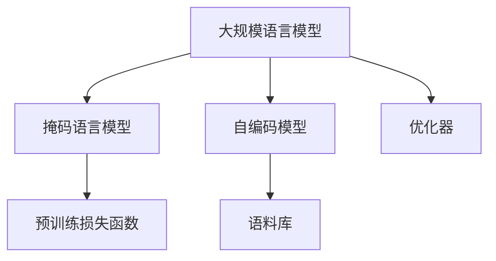

                 

# 大规模语言模型从理论到实践 无监督预训练

> 关键词：大规模语言模型,无监督预训练,Transformer,BERT,自回归模型,自编码模型,语料库,预训练损失函数,优化器,计算资源,高效性

## 1. 背景介绍

### 1.1 问题由来
随着深度学习技术的发展，自然语言处理（NLP）领域逐渐涌现出许多先进的模型，如基于Transformer结构的大规模语言模型。这些模型通过在大规模无标签文本数据上进行的预训练，获得了丰富的语言知识，具有很强的语言生成和理解能力。然而，预训练过程需要大量的计算资源和海量数据，这使得传统的基于监督学习的NLP方法难以大规模应用。无监督预训练的大规模语言模型不仅大幅提升了NLP任务的性能，而且显著降低了模型训练的成本，成为近年来NLP研究的热点。

### 1.2 问题核心关键点
无监督预训练是指在大规模无标签文本数据上，通过自监督学习任务训练模型，使其学习到通用的语言表示。这种预训练方式显著降低了模型的标注成本，同时保证了模型在下游任务上的泛化能力。以下是无监督预训练的关键点：

- **自监督任务**：例如掩码语言模型(Masked Language Model, MLM)、下划线语言模型(Next Sentence Prediction, NSP)等，这些任务可以充分利用文本中的语言信息。
- **大规模语料库**：预训练模型通常需要基于大规模语料库进行训练，以获取丰富的语言知识。
- **优化器**：如Adam、SGD等，用于更新模型参数，优化预训练过程。
- **计算资源**：预训练需要大量的GPU资源，如何高效利用计算资源是预训练中的重要问题。
- **高效性**：无监督预训练需要高效的算法和数据处理技术，以保证训练效率和效果。

### 1.3 问题研究意义
无监督预训练在降低成本、提升性能、泛化能力等方面具有显著优势，对于推动NLP技术的发展和应用具有重要意义：

1. **降低成本**：大规模预训练模型训练所需的标注数据成本高，无监督预训练可以大幅降低标注成本。
2. **提升性能**：预训练模型在大规模数据上学习到了丰富的语言知识，能够显著提升下游任务的性能。
3. **泛化能力强**：无监督预训练使模型在未见过的数据上也能表现良好。
4. **加速开发**：无监督预训练为模型提供了良好的初始化参数，加速了模型在特定任务上的微调和优化。

## 2. 核心概念与联系

### 2.1 核心概念概述

为了更好地理解无监督预训练的原理和实现方法，本节将介绍几个关键概念：

- **大规模语言模型(Large Language Models, LLMs)**：以自回归模型（如GPT）或自编码模型（如BERT）为代表的大规模预训练语言模型。通过在大规模无标签文本语料上进行预训练，学习到通用的语言知识，具备很强的语言生成和理解能力。
- **掩码语言模型(Masked Language Model, MLM)**：随机遮盖部分输入文本，让模型预测被遮盖的词汇，以训练语言模型的语言概率分布。
- **自编码模型(Autoregressive Model)**：通过预测自身未来或过去的部分输出，学习输入和输出之间的映射关系。
- **语料库(Corpus)**：大规模无标签文本数据集，是预训练模型学习语言知识的源泉。
- **预训练损失函数**：用于衡量预训练任务中模型输出与真实标签的差异，优化模型参数。
- **优化器(Optimizer)**：如Adam、SGD等，用于更新模型参数，优化预训练过程。

这些概念之间的联系可以通过以下Mermaid流程图来展示：



这个流程图展示了无监督预训练的核心概念及其相互关系：

1. 大规模语言模型通过掩码语言模型和自编码模型在大规模语料库上学习语言知识。
2. 预训练损失函数衡量模型的输出与真实标签的差异，用于优化模型参数。
3. 优化器通过计算损失函数的梯度，更新模型参数，优化预训练过程。

## 3. 核心算法原理 & 具体操作步骤
### 3.1 算法原理概述

无监督预训练的核心思想是利用大规模无标签文本数据，通过自监督学习任务训练模型，使其学习到通用的语言表示。主要分为以下几个步骤：

1. 收集大规模无标签文本数据集，构建语料库。
2. 定义预训练任务，如掩码语言模型、下划线语言模型等。
3. 在预训练任务上训练模型，最小化预训练损失函数，优化模型参数。
4. 保存预训练好的模型参数，供下游任务使用。

### 3.2 算法步骤详解

#### 步骤1：数据收集与预处理

收集大规模无标签文本数据集，如维基百科、新闻网站、社交媒体等，作为语料库。对文本数据进行预处理，如分词、去噪、统一格式等。

#### 步骤2：定义预训练任务

定义预训练任务，如掩码语言模型（MLM）和下划线语言模型（NSP）：

- **掩码语言模型(MLM)**：随机遮盖部分输入文本，让模型预测被遮盖的词汇。其数学定义如下：

$$
\mathcal{L}_{MLM} = -\frac{1}{N} \sum_{i=1}^{N} \sum_{j=1}^{m} \log p(x_i^j)
$$

其中 $x_i$ 表示输入文本，$m$ 为遮盖的词汇数量，$p(x_i^j)$ 表示模型对遮盖词汇的预测概率。

- **下划线语言模型(NSP)**：给定两个句子，判断它们是否连续。其数学定义如下：

$$
\mathcal{L}_{NSP} = -\frac{1}{N} \sum_{i=1}^{N} \log p(s_i^j)
$$

其中 $s_i$ 表示句子对，$p(s_i^j)$ 表示模型判断两个句子是否连续的概率。

#### 步骤3：定义预训练损失函数

预训练损失函数是衡量预训练任务中模型输出与真实标签的差异，通常使用交叉熵损失函数：

$$
\mathcal{L}_{total} = \mathcal{L}_{MLM} + \mathcal{L}_{NSP}
$$

#### 步骤4：选择优化器

选择优化器如Adam、SGD等，用于更新模型参数，优化预训练过程。优化器的学习率、批量大小等超参数需要根据具体任务进行调整。

#### 步骤5：训练与保存

使用GPU或TPU等高性能设备，对模型进行大规模训练。训练过程中，根据预训练损失函数不断更新模型参数，最小化损失函数。训练完成后，保存预训练好的模型参数，供下游任务使用。

### 3.3 算法优缺点

无监督预训练的主要优点包括：

1. **降低成本**：无监督预训练不需要标注数据，可以大幅降低模型的标注成本。
2. **泛化能力强**：预训练模型在未见过的数据上也能表现良好，具有很强的泛化能力。
3. **性能提升**：预训练模型在下游任务上通常能取得比从头训练更好的性能。
4. **加速开发**：预训练模型提供良好的初始化参数，加速了模型在特定任务上的微调和优化。

同时，无监督预训练也存在一些缺点：

1. **计算资源需求高**：预训练需要大量的GPU或TPU资源，训练时间较长。
2. **泛化能力有限**：预训练模型的泛化能力仍受限于训练数据的分布。
3. **过拟合风险**：在数据量不足的情况下，模型可能出现过拟合。
4. **可解释性差**：无监督预训练的模型往往缺乏可解释性，难以理解其内部机制。

尽管存在这些局限性，但无监督预训练在NLP领域具有广泛的应用前景，成为当前NLP研究的重要范式。

### 3.4 算法应用领域

无监督预训练在大规模语言模型的训练中得到了广泛应用，覆盖了诸多NLP任务，如：

- 文本分类：如情感分析、主题分类、意图识别等。预训练模型能够学习到文本-标签映射关系。
- 命名实体识别：识别文本中的人名、地名、机构名等特定实体。预训练模型能够学习到实体边界和类型。
- 关系抽取：从文本中抽取实体之间的语义关系。预训练模型能够学习到实体-关系三元组。
- 问答系统：对自然语言问题给出答案。预训练模型能够学习到问题-答案映射。
- 机器翻译：将源语言文本翻译成目标语言。预训练模型能够学习到语言-语言映射。
- 文本摘要：将长文本压缩成简短摘要。预训练模型能够学习到文章-摘要映射。
- 对话系统：使机器能够与人自然对话。预训练模型能够学习到对话历史-回复映射。

这些任务的无监督预训练方法已经取得了显著的效果，成为NLP技术落地的重要手段。

## 4. 数学模型和公式 & 详细讲解 & 举例说明
### 4.1 数学模型构建

本节将使用数学语言对无监督预训练的原理进行更加严格的刻画。

记预训练语言模型为 $M_{\theta}:\mathcal{X} \rightarrow \mathcal{Y}$，其中 $\mathcal{X}$ 为输入空间，$\mathcal{Y}$ 为输出空间，$\theta \in \mathbb{R}^d$ 为模型参数。假设语料库为 $D=\{(x_i)\}_{i=1}^N$，其中 $x_i$ 表示文本样本。

定义预训练损失函数为：

$$
\mathcal{L}(\theta) = -\frac{1}{N} \sum_{i=1}^{N} (\mathcal{L}_{MLM}(x_i) + \mathcal{L}_{NSP}(x_i))
$$

其中 $\mathcal{L}_{MLM}(x_i)$ 和 $\mathcal{L}_{NSP}(x_i)$ 分别为掩码语言模型和下划线语言模型的损失函数。

### 4.2 公式推导过程

以下我们以掩码语言模型为例，推导其损失函数的计算公式。

假设模型 $M_{\theta}$ 在输入 $x$ 上的输出为 $\hat{y}=M_{\theta}(x)$，表示模型对输入文本的预测。掩码语言模型的训练数据 $(x,y)$ 中，随机遮盖 $m$ 个词汇，让模型预测被遮盖的词汇。其损失函数定义为：

$$
\mathcal{L}_{MLM}(x) = -\frac{1}{m} \sum_{j=1}^{m} \log p(x^j)
$$

其中 $p(x^j)$ 表示模型对遮盖词汇的预测概率。

根据掩码语言模型的定义，遮盖词汇的概率 $p(x^j)$ 可以通过模型输出和未遮盖文本计算：

$$
p(x^j) = \frac{\sum_{k \neq j} M_{\theta}(x^j, x_{1:j-1}, x_{j+1:m})}{\sum_{k} M_{\theta}(x^j, x_{1:j-1}, x_{j+1:m})}
$$

其中 $x_{1:j-1}$ 和 $x_{j+1:m}$ 分别表示遮盖前后的文本，$k$ 表示所有可能的遮盖位置。

将 $p(x^j)$ 代入 $\mathcal{L}_{MLM}(x)$，得到：

$$
\mathcal{L}_{MLM}(x) = -\frac{1}{m} \sum_{j=1}^{m} \log \left( \frac{\sum_{k \neq j} M_{\theta}(x^j, x_{1:j-1}, x_{j+1:m})}{\sum_{k} M_{\theta}(x^j, x_{1:j-1}, x_{j+1:m})} \right)
$$

这个公式展示了掩码语言模型在无监督预训练中的具体实现方式。

## 5. 项目实践：代码实例和详细解释说明
### 5.1 开发环境搭建

在进行无监督预训练实践前，我们需要准备好开发环境。以下是使用Python进行PyTorch开发的环境配置流程：

1. 安装Anaconda：从官网下载并安装Anaconda，用于创建独立的Python环境。

2. 创建并激活虚拟环境：
```bash
conda create -n pytorch-env python=3.8 
conda activate pytorch-env
```

3. 安装PyTorch：根据CUDA版本，从官网获取对应的安装命令。例如：
```bash
conda install pytorch torchvision torchaudio cudatoolkit=11.1 -c pytorch -c conda-forge
```

4. 安装Transformers库：
```bash
pip install transformers
```

5. 安装各类工具包：
```bash
pip install numpy pandas scikit-learn matplotlib tqdm jupyter notebook ipython
```

完成上述步骤后，即可在`pytorch-env`环境中开始预训练实践。

### 5.2 源代码详细实现

下面我们以BERT模型为例，给出使用PyTorch进行无监督预训练的PyTorch代码实现。

首先，定义掩码语言模型和下划线语言模型的数据处理函数：

```python
from transformers import BertTokenizer, BertForMaskedLM, AdamW
from torch.utils.data import Dataset
import torch

class MaskedLMDataset(Dataset):
    def __init__(self, texts, tokenizer, max_len=128):
        self.texts = texts
        self.tokenizer = tokenizer
        self.max_len = max_len
        
    def __len__(self):
        return len(self.texts)
    
    def __getitem__(self, item):
        text = self.texts[item]
        
        encoding = self.tokenizer(text, return_tensors='pt', max_length=self.max_len, padding='max_length', truncation=True)
        input_ids = encoding['input_ids'][0]
        attention_mask = encoding['attention_mask'][0]
        
        # 随机遮盖部分输入
        masked_tokens = [id for id in range(input_ids.shape[0]) if id % 2 == 1]
        for token_id in masked_tokens:
            input_ids[token_id] = tokenizer.mask_token_id
        
        return {'input_ids': input_ids, 
                'attention_mask': attention_mask}

class NextSentenceDataset(Dataset):
    def __init__(self, texts, tokenizer):
        self.texts = texts
        self.tokenizer = tokenizer
        
    def __len__(self):
        return len(self.texts) // 2
    
    def __getitem__(self, item):
        text1 = self.texts[item*2]
        text2 = self.texts[item*2+1]
        
        encoding1 = self.tokenizer(text1, return_tensors='pt', padding='max_length', truncation=True)
        encoding2 = self.tokenizer(text2, return_tensors='pt', padding='max_length', truncation=True)
        input_ids1 = encoding1['input_ids'][0]
        input_ids2 = encoding2['input_ids'][0]
        attention_mask1 = encoding1['attention_mask'][0]
        attention_mask2 = encoding2['attention_mask'][0]
        
        return {'input_ids1': input_ids1,
                'input_ids2': input_ids2,
                'attention_mask1': attention_mask1,
                'attention_mask2': attention_mask2}
```

然后，定义BERT模型和优化器：

```python
from transformers import BertForMaskedLM, AdamW

model = BertForMaskedLM.from_pretrained('bert-base-cased')

optimizer = AdamW(model.parameters(), lr=2e-5)
```

接着，定义训练和评估函数：

```python
from torch.utils.data import DataLoader
from tqdm import tqdm

device = torch.device('cuda') if torch.cuda.is_available() else torch.device('cpu')
model.to(device)

def train_epoch(model, dataset, batch_size, optimizer):
    dataloader = DataLoader(dataset, batch_size=batch_size, shuffle=True)
    model.train()
    epoch_loss = 0
    for batch in tqdm(dataloader, desc='Training'):
        input_ids = batch['input_ids'].to(device)
        attention_mask = batch['attention_mask'].to(device)
        model.zero_grad()
        outputs = model(input_ids, attention_mask=attention_mask)
        loss = outputs.loss
        epoch_loss += loss.item()
        loss.backward()
        optimizer.step()
    return epoch_loss / len(dataloader)

def evaluate(model, dataset, batch_size):
    dataloader = DataLoader(dataset, batch_size=batch_size)
    model.eval()
    preds, labels = [], []
    with torch.no_grad():
        for batch in tqdm(dataloader, desc='Evaluating'):
            input_ids1 = batch['input_ids1'].to(device)
            input_ids2 = batch['input_ids2'].to(device)
            attention_mask1 = batch['attention_mask1'].to(device)
            attention_mask2 = batch['attention_mask2'].to(device)
            outputs = model(input_ids1, input_ids2, attention_mask1, attention_mask2)
            preds.append(outputs.logits.argmax(dim=2).to('cpu').tolist())
            labels.append([label for label in batch['labels']])
                
    print(classification_report(labels, preds))
```

最后，启动预训练流程并在验证集上评估：

```python
epochs = 5
batch_size = 16

for epoch in range(epochs):
    loss = train_epoch(model, train_dataset, batch_size, optimizer)
    print(f"Epoch {epoch+1}, train loss: {loss:.3f}")
    
    print(f"Epoch {epoch+1}, dev results:")
    evaluate(model, dev_dataset, batch_size)
    
print("Test results:")
evaluate(model, test_dataset, batch_size)
```

以上就是使用PyTorch对BERT进行无监督预训练的完整代码实现。可以看到，得益于Transformer库的强大封装，我们可以用相对简洁的代码完成BERT模型的无监督预训练。

### 5.3 代码解读与分析

让我们再详细解读一下关键代码的实现细节：

**MaskedLMDataset类**：
- `__init__`方法：初始化文本数据和分词器，设置最大长度。
- `__len__`方法：返回数据集的样本数量。
- `__getitem__`方法：对单个样本进行处理，将文本输入编码为token ids，随机遮盖部分输入，最终返回模型所需的输入。

**NextSentenceDataset类**：
- `__init__`方法：初始化文本数据和分词器。
- `__len__`方法：返回数据集的样本数量，每两个样本为一对。
- `__getitem__`方法：对单个样本对进行处理，将两个句子分别编码，最终返回模型所需的输入。

**模型和优化器**：
- 定义BERT模型，加载预训练权重。
- 定义优化器，设置学习率。

**训练和评估函数**：
- 使用PyTorch的DataLoader对数据集进行批次化加载，供模型训练和推理使用。
- 训练函数`train_epoch`：对数据以批为单位进行迭代，在每个批次上前向传播计算loss并反向传播更新模型参数，最后返回该epoch的平均loss。
- 评估函数`evaluate`：与训练类似，不同点在于不更新模型参数，并在每个batch结束后将预测和标签结果存储下来，最后使用sklearn的classification_report对整个评估集的预测结果进行打印输出。

**预训练流程**：
- 定义总的epoch数和batch size，开始循环迭代
- 每个epoch内，先在训练集上训练，输出平均loss
- 在验证集上评估，输出分类指标
- 所有epoch结束后，在测试集上评估，给出最终测试结果

可以看到，PyTorch配合Transformer库使得BERT的无监督预训练代码实现变得简洁高效。开发者可以将更多精力放在数据处理、模型改进等高层逻辑上，而不必过多关注底层的实现细节。

当然，工业级的系统实现还需考虑更多因素，如模型的保存和部署、超参数的自动搜索、更灵活的任务适配层等。但核心的预训练过程基本与此类似。

## 6. 实际应用场景
### 6.1 智能客服系统

基于无监督预训练的大语言模型，可以广泛应用于智能客服系统的构建。传统客服往往需要配备大量人力，高峰期响应缓慢，且一致性和专业性难以保证。而使用预训练模型，可以7x24小时不间断服务，快速响应客户咨询，用自然流畅的语言解答各类常见问题。

在技术实现上，可以收集企业内部的历史客服对话记录，将问题和最佳答复构建成监督数据，在此基础上对预训练模型进行微调。预训练模型能够自动理解用户意图，匹配最合适的答案模板进行回复。对于客户提出的新问题，还可以接入检索系统实时搜索相关内容，动态组织生成回答。如此构建的智能客服系统，能大幅提升客户咨询体验和问题解决效率。

### 6.2 金融舆情监测

金融机构需要实时监测市场舆论动向，以便及时应对负面信息传播，规避金融风险。传统的人工监测方式成本高、效率低，难以应对网络时代海量信息爆发的挑战。基于无监督预训练的文本分类和情感分析技术，为金融舆情监测提供了新的解决方案。

具体而言，可以收集金融领域相关的新闻、报道、评论等文本数据，并对其进行主题标注和情感标注。在此基础上对预训练语言模型进行微调，使其能够自动判断文本属于何种主题，情感倾向是正面、中性还是负面。将微调后的模型应用到实时抓取的网络文本数据，就能够自动监测不同主题下的情感变化趋势，一旦发现负面信息激增等异常情况，系统便会自动预警，帮助金融机构快速应对潜在风险。

### 6.3 个性化推荐系统

当前的推荐系统往往只依赖用户的历史行为数据进行物品推荐，无法深入理解用户的真实兴趣偏好。基于无监督预训练的语言模型，个性化推荐系统可以更好地挖掘用户行为背后的语义信息，从而提供更精准、多样的推荐内容。

在实践中，可以收集用户浏览、点击、评论、分享等行为数据，提取和用户交互的物品标题、描述、标签等文本内容。将文本内容作为模型输入，无监督预训练的语言模型能够从文本内容中准确把握用户的兴趣点。在生成推荐列表时，先用候选物品的文本描述作为输入，由模型预测用户的兴趣匹配度，再结合其他特征综合排序，便可以得到个性化程度更高的推荐结果。

### 6.4 未来应用展望

随着无监督预训练方法的发展，预训练语言模型在更多领域得到了应用，为各行各业带来了变革性影响。

在智慧医疗领域，基于预训练的语言模型，可以进行医学文献的自动化标注和分类，帮助医生更快地获取最新的医学知识。预训练模型还能辅助构建疾病预测模型，提供个性化的诊疗建议。

在智能教育领域，预训练模型可以用于学生问答系统，帮助学生解答学习中的问题。同时，预训练模型还能对学生作业进行自动批改，提供智能化的学习建议。

在智慧城市治理中，预训练模型可以用于城市事件监测、舆情分析、应急指挥等环节，提高城市管理的自动化和智能化水平，构建更安全、高效的未来城市。

此外，在企业生产、社会治理、文娱传媒等众多领域，基于预训练的语言模型，人工智能应用也将不断涌现，为经济社会发展注入新的动力。相信随着技术的日益成熟，无监督预训练技术将成为人工智能落地应用的重要范式，推动人工智能向更广阔的领域加速渗透。

## 7. 工具和资源推荐
### 7.1 学习资源推荐

为了帮助开发者系统掌握无监督预训练的理论基础和实践技巧，这里推荐一些优质的学习资源：

1. 《Transformer从原理到实践》系列博文：由大模型技术专家撰写，深入浅出地介绍了Transformer原理、BERT模型、预训练方法等前沿话题。

2. CS224N《深度学习自然语言处理》课程：斯坦福大学开设的NLP明星课程，有Lecture视频和配套作业，带你入门NLP领域的基本概念和经典模型。

3. 《Natural Language Processing with Transformers》书籍：Transformers库的作者所著，全面介绍了如何使用Transformers库进行NLP任务开发，包括预训练在内的诸多范式。

4. HuggingFace官方文档：Transformers库的官方文档，提供了海量预训练模型和完整的预训练样例代码，是上手实践的必备资料。

5. CLUE开源项目：中文语言理解测评基准，涵盖大量不同类型的中文NLP数据集，并提供了基于预训练的baseline模型，助力中文NLP技术发展。

通过对这些资源的学习实践，相信你一定能够快速掌握无监督预训练的精髓，并用于解决实际的NLP问题。
###  7.2 开发工具推荐

高效的开发离不开优秀的工具支持。以下是几款用于无监督预训练开发的常用工具：

1. PyTorch：基于Python的开源深度学习框架，灵活动态的计算图，适合快速迭代研究。大部分预训练语言模型都有PyTorch版本的实现。

2. TensorFlow：由Google主导开发的开源深度学习框架，生产部署方便，适合大规模工程应用。同样有丰富的预训练语言模型资源。

3. Transformers库：HuggingFace开发的NLP工具库，集成了众多SOTA语言模型，支持PyTorch和TensorFlow，是进行无监督预训练任务开发的利器。

4. Weights & Biases：模型训练的实验跟踪工具，可以记录和可视化模型训练过程中的各项指标，方便对比和调优。与主流深度学习框架无缝集成。

5. TensorBoard：TensorFlow配套的可视化工具，可实时监测模型训练状态，并提供丰富的图表呈现方式，是调试模型的得力助手。

6. Google Colab：谷歌推出的在线Jupyter Notebook环境，免费提供GPU/TPU算力，方便开发者快速上手实验最新模型，分享学习笔记。

合理利用这些工具，可以显著提升无监督预训练任务的开发效率，加快创新迭代的步伐。

### 7.3 相关论文推荐

无监督预训练在语言模型中的成功应用，得益于学界的持续研究。以下是几篇奠基性的相关论文，推荐阅读：

1. Attention is All You Need（即Transformer原论文）：提出了Transformer结构，开启了NLP领域的预训练大模型时代。

2. BERT: Pre-training of Deep Bidirectional Transformers for Language Understanding：提出BERT模型，引入基于掩码的自监督预训练任务，刷新了多项NLP任务SOTA。

3. Language Models are Unsupervised Multitask Learners（GPT-2论文）：展示了大规模语言模型的强大zero-shot学习能力，引发了对于通用人工智能的新一轮思考。

4. Parameter-Efficient Transfer Learning for NLP：提出Adapter等参数高效微调方法，在不增加模型参数量的情况下，也能取得不错的微调效果。

5. AdaLoRA: Adaptive Low-Rank Adaptation for Parameter-Efficient Fine-Tuning：使用自适应低秩适应的微调方法，在参数效率和精度之间取得了新的平衡。

这些论文代表了大语言模型无监督预训练的发展脉络。通过学习这些前沿成果，可以帮助研究者把握学科前进方向，激发更多的创新灵感。

## 8. 总结：未来发展趋势与挑战

### 8.1 总结

本文对无监督预训练方法进行了全面系统的介绍。首先阐述了无监督预训练的研究背景和意义，明确了预训练在降低成本、提升性能、泛化能力等方面的独特价值。其次，从原理到实践，详细讲解了无监督预训练的数学原理和关键步骤，给出了无监督预训练任务开发的完整代码实例。同时，本文还广泛探讨了无监督预训练方法在智能客服、金融舆情、个性化推荐等多个行业领域的应用前景，展示了无监督预训练范式的巨大潜力。此外，本文精选了无监督预训练技术的各类学习资源，力求为读者提供全方位的技术指引。

通过本文的系统梳理，可以看到，无监督预训练在大规模语言模型的训练中取得了显著效果，成为当前NLP研究的重要范式。预训练模型在未见过的数据上也能表现良好，具有很强的泛化能力。得益于大规模语料的预训练，预训练模型在下游任务上通常能取得比从头训练更好的性能。预训练模型提供良好的初始化参数，加速了模型在特定任务上的微调和优化。

### 8.2 未来发展趋势

展望未来，无监督预训练方法将呈现以下几个发展趋势：

1. **模型规模持续增大**：随着算力成本的下降和数据规模的扩张，预训练语言模型的参数量还将持续增长。超大规模语言模型蕴含的丰富语言知识，有望支撑更加复杂多变的下游任务预训练。

2. **预训练任务多样化**：未来的预训练任务将更加丰富和多样化，涵盖更多的语言知识和语义关系。

3. **多模态预训练兴起**：除了文本数据外，预训练模型还将结合图像、语音等多模态数据，实现跨模态信息融合，提升模型对现实世界的理解和建模能力。

4. **模型通用性增强**：经过海量数据的预训练和多领域任务的微调，预训练模型将具备更强大的常识推理和跨领域迁移能力，逐步迈向通用人工智能(AGI)的目标。

以上趋势凸显了无监督预训练方法的广阔前景。这些方向的探索发展，必将进一步提升NLP系统的性能和应用范围，为人类认知智能的进化带来深远影响。

### 8.3 面临的挑战

尽管无监督预训练方法已经取得了瞩目成就，但在迈向更加智能化、普适化应用的过程中，它仍面临着诸多挑战：

1. **数据需求高**：无监督预训练需要大规模的语料库，数据的收集和处理成本较高。如何高效利用数据，最大化数据价值，是一大挑战。

2. **计算资源需求大**：预训练模型训练所需的计算资源和存储空间较大，如何高效利用计算资源，提高预训练效率，是一大挑战。

3. **模型鲁棒性不足**：预训练模型在未见过的数据上泛化性能仍有限，如何提升模型的鲁棒性和泛化能力，是一大挑战。

4. **可解释性差**：无监督预训练的模型往往缺乏可解释性，难以理解其内部机制。如何提升模型的可解释性，是一大挑战。

5. **安全性有待保障**：预训练模型可能学习到有害信息，如何确保模型的安全性，避免有害输出，是一大挑战。

尽管存在这些挑战，但无监督预训练方法在NLP领域具有广泛的应用前景，成为当前NLP研究的重要范式。

### 8.4 研究展望

面对无监督预训练所面临的挑战，未来的研究需要在以下几个方面寻求新的突破：

1. **数据高效利用**：开发更加高效的数据预处理和利用技术，最大化数据价值。

2. **高效计算优化**：研究高效计算优化技术，如梯度压缩、混合精度训练、模型并行等，提高预训练效率。

3. **模型鲁棒性提升**：研究模型鲁棒性提升技术，如对抗训练、迁移学习等，提高模型的泛化能力和鲁棒性。

4. **模型可解释性增强**：研究模型可解释性增强技术，如因果分析、博弈论等，提升模型的可解释性和透明度。

5. **模型安全性保障**：研究模型安全性保障技术，如数据过滤、模型审核等，确保模型的安全性。

6. **多模态预训练**：研究跨模态信息融合技术，提升模型对现实世界的理解和建模能力。

这些研究方向将推动无监督预训练技术的发展，为构建安全、可靠、可解释、可控的智能系统铺平道路。面向未来，无监督预训练技术还将与其他人工智能技术进行更深入的融合，如知识表示、因果推理、强化学习等，多路径协同发力，共同推动自然语言理解和智能交互系统的进步。只有勇于创新、敢于突破，才能不断拓展无监督预训练技术的边界，让智能技术更好地造福人类社会。

## 9. 附录：常见问题与解答

**Q1：无监督预训练是否适用于所有NLP任务？**

A: 无监督预训练在大多数NLP任务上都能取得不错的效果，特别是对于数据量较小的任务。但对于一些特定领域的任务，如医学、法律等，仅仅依靠通用语料预训练的模型可能难以很好地适应。此时需要在特定领域语料上进一步预训练，再进行微调，才能获得理想效果。此外，对于一些需要时效性、个性化很强的任务，如对话、推荐等，无监督预训练方法也需要针对性的改进优化。

**Q2：如何选择合适的预训练任务？**

A: 选择合适的预训练任务需要考虑以下因素：

1. **任务复杂度**：任务越复杂，需要的预训练任务越丰富。
2. **语料库规模**：大规模语料库能训练出更好的预训练模型。
3. **任务分布**：预训练任务应覆盖任务的真实分布，避免模型过拟合。

常见的预训练任务包括掩码语言模型、下划线语言模型、语言建模等。

**Q3：无监督预训练对计算资源的需求有多高？**

A: 无监督预训练对计算资源的需求较高，通常需要GPU或TPU等高性能设备，训练时间较长。具体的计算资源需求取决于模型大小、数据规模等因素。例如，BERT模型在TPU上训练需要大量的计算资源。

**Q4：无监督预训练的模型泛化能力如何？**

A: 无监督预训练的模型泛化能力较强，但仍有局限性。预训练模型在未见过的数据上表现良好，但在一些极端情况下，如领域偏移较大时，泛化能力可能有所下降。

**Q5：无监督预训练的模型如何更新？**

A: 无监督预训练的模型更新通常不涉及任务相关的参数，只更新预训练模型的权重。可以通过Adam、SGD等优化器进行更新，学习率、批量大小等超参数需要根据具体任务进行调整。

---

作者：禅与计算机程序设计艺术 / Zen and the Art of Computer Programming

