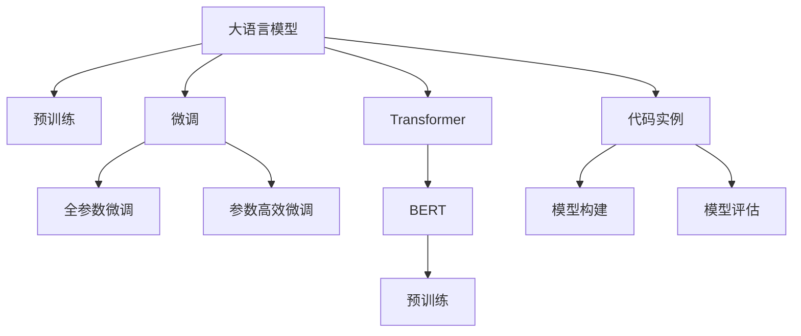

                 

# 大语言模型(Large Language Models) - 原理与代码实例讲解

> 关键词：大语言模型,Transformer,BERT,预训练,微调,代码实例,模型构建,模型评估,深度学习,自然语言处理(NLP)

## 1. 背景介绍

### 1.1 问题由来
随着人工智能技术的迅速发展，大语言模型（Large Language Models，简称LLMs）成为了一种新兴的AI技术。这些模型通常基于Transformer架构，并经过大规模无标签文本数据的预训练，具备强大的语言理解和生成能力。大语言模型的出现极大地推动了自然语言处理（Natural Language Processing，简称NLP）领域的发展，使得NLP任务如文本分类、情感分析、机器翻译等得到了显著的提升。

### 1.2 问题核心关键点
大语言模型的核心关键点包括：

- **预训练**：通过大规模无标签数据预训练，模型学习到语言的基本规律和知识。
- **微调**：使用下游任务的标注数据对模型进行微调，提升模型在特定任务上的性能。
- **Transformer**：一种高效的神经网络架构，广泛用于大语言模型的构建。
- **BERT**：Bidirectional Encoder Representations from Transformers，一种预训练语言模型，广泛应用于自然语言处理任务。
- **代码实例**：通过具体的代码实现，帮助读者理解和实践大语言模型。

### 1.3 问题研究意义
研究大语言模型的构建和微调，对于提升NLP任务的性能、降低开发成本、加速应用部署具有重要意义。同时，大语言模型还推动了人工智能技术在更多领域的应用，如金融、医疗、教育等。

## 2. 核心概念与联系

### 2.1 核心概念概述

大语言模型（LLMs）基于Transformer架构，通过预训练和微调过程学习语言知识，并在下游任务上表现出卓越的性能。Transformer是一种基于自注意力机制的神经网络架构，能够处理长序列数据，适用于语言模型的构建。BERT是一种预训练语言模型，通过掩码语言模型（Masked Language Model，简称MLM）和下一句预测（Next Sentence Prediction，简称NSP）任务进行预训练。微调则是将预训练模型在下游任务上进行有监督的优化，以适应特定任务的需求。

### 2.2 核心概念原理和架构的 Mermaid 流程图



### 2.3 核心概念联系
大语言模型通过预训练学习通用的语言表示，然后通过微调针对特定任务进行优化。预训练模型可以作为初始化参数，微调过程只需调整部分参数，保持预训练模型的知识不变，以避免过拟合。Transformer架构通过自注意力机制能够高效地处理长序列数据，而BERT通过掩码语言模型和下一句预测任务预训练，使得模型在自然语言处理任务上表现优异。

## 3. 核心算法原理 & 具体操作步骤

### 3.1 算法原理概述

大语言模型的构建主要分为预训练和微调两个阶段。预训练阶段使用大规模无标签文本数据，通过自监督学习任务训练模型，学习到通用的语言表示。微调阶段则使用下游任务的标注数据对模型进行有监督的优化，提升模型在特定任务上的性能。

### 3.2 算法步骤详解

#### 3.2.1 预训练步骤
1. **数据准备**：收集大规模无标签文本数据，并将其划分为多个批次。
2. **模型初始化**：使用随机初始化的参数初始化模型。
3. **训练过程**：使用自监督学习任务（如掩码语言模型、下一句预测）训练模型，优化模型参数。

#### 3.2.2 微调步骤
1. **数据准备**：收集下游任务的标注数据，并将其划分为训练集、验证集和测试集。
2. **模型初始化**：将预训练模型的参数作为初始化参数，固定底层的Transformer层，只微调顶层。
3. **模型适配**：根据下游任务类型，在预训练模型的顶层添加合适的输出层和损失函数。
4. **优化过程**：使用优化器（如AdamW）对模型进行优化，最小化损失函数，更新模型参数。
5. **评估过程**：在验证集和测试集上评估模型性能，确保模型性能稳定。

### 3.3 算法优缺点

#### 3.3.1 优点
- **通用性**：大语言模型能够适应多种自然语言处理任务，具有较强的泛化能力。
- **高效性**：微调过程可以在较短的时间内提升模型性能，降低了开发成本。
- **灵活性**：通过微调可以针对特定任务进行优化，避免从头训练的复杂性。

#### 3.3.2 缺点
- **数据依赖**：微调过程依赖于下游任务的标注数据，获取高质量标注数据成本较高。
- **过拟合风险**：模型在微调过程中可能过拟合训练数据，影响模型泛化能力。
- **模型复杂度**：大语言模型的参数量较大，对硬件资源要求较高。

### 3.4 算法应用领域
大语言模型广泛应用于自然语言处理领域，包括但不限于以下任务：

- **文本分类**：如情感分析、主题分类、意图识别等。
- **命名实体识别**：识别文本中的人名、地名、机构名等特定实体。
- **关系抽取**：从文本中抽取实体之间的语义关系。
- **问答系统**：对自然语言问题给出答案。
- **机器翻译**：将源语言文本翻译成目标语言。
- **文本摘要**：将长文本压缩成简短摘要。
- **对话系统**：使机器能够与人自然对话。

## 4. 数学模型和公式 & 详细讲解 & 举例说明

### 4.1 数学模型构建

大语言模型可以通过Transformer架构进行构建，其数学模型如下：

$$
y = \mathrm{softmax}(W_2 [\mathrm{Self-Attention}(W_1 x) + b_2])
$$

其中，$x$ 表示输入的文本序列，$y$ 表示模型输出的概率分布，$\mathrm{Softmax}$ 函数将输出转换为概率分布，$\mathrm{Self-Attention}$ 表示自注意力机制，$W_1$ 和 $W_2$ 表示权重矩阵，$b_1$ 和 $b_2$ 表示偏置向量。

### 4.2 公式推导过程

大语言模型的推导过程主要涉及自注意力机制的计算。以BERT为例，其自注意力机制的计算公式如下：

$$
Q = XW_Q
$$
$$
K = XW_K
$$
$$
V = XW_V
$$

其中，$X$ 表示输入的文本序列，$W_Q$、$W_K$ 和 $W_V$ 表示权重矩阵，$Q$、$K$ 和 $V$ 表示查询、键和值矩阵，$O$ 表示输出矩阵。自注意力机制通过计算查询、键和值的相似度，得到每个位置的注意力权重，最终计算出加权和的输出。

### 4.3 案例分析与讲解

以BERT为例，下面分析BERT的掩码语言模型和下一句预测任务：

#### 掩码语言模型
掩码语言模型的任务是对输入文本进行掩码，然后预测被掩码的词。具体实现如下：

1. **掩码**：随机选择部分单词，将其替换为[MASK]符号。
2. **预测**：使用预训练模型对掩码的词进行预测，输出掩码位置的概率分布。

#### 下一句预测
下一句预测任务是根据两个句子之间的关系预测它们是否连在一起。具体实现如下：

1. **输入**：将两个句子拼接在一起，并使用特殊标记分隔。
2. **预测**：使用预训练模型对两个句子之间的关系进行预测，输出是否连在一起的概率。

## 5. 项目实践：代码实例和详细解释说明

### 5.1 开发环境搭建

1. **安装Python**：确保系统中安装了Python 3.6及以上版本。
2. **安装PyTorch**：使用pip安装PyTorch，支持GPU加速。
3. **安装BERT**：使用Hugging Face的`transformers`库安装BERT模型。

### 5.2 源代码详细实现

以下是使用BERT进行文本分类任务的Python代码实现：

```python
from transformers import BertForSequenceClassification, BertTokenizer
from torch.utils.data import Dataset, DataLoader
import torch

class MyDataset(Dataset):
    def __init__(self, texts, labels):
        self.texts = texts
        self.labels = labels
        self.tokenizer = BertTokenizer.from_pretrained('bert-base-uncased')
    
    def __len__(self):
        return len(self.texts)
    
    def __getitem__(self, idx):
        text = self.texts[idx]
        label = self.labels[idx]
        
        encoding = self.tokenizer(text, truncation=True, padding='max_length', max_length=512)
        input_ids = encoding['input_ids']
        attention_mask = encoding['attention_mask']
        
        return {'input_ids': input_ids, 
                'attention_mask': attention_mask,
                'labels': torch.tensor(label)}

# 数据准备
texts = ['Hello world!', 'This is a test sentence.', 'BERT is awesome!']
labels = [0, 1, 2]  # 二分类任务，标签为0或1

dataset = MyDataset(texts, labels)
dataloader = DataLoader(dataset, batch_size=16, shuffle=True)

# 模型初始化
model = BertForSequenceClassification.from_pretrained('bert-base-uncased', num_labels=3)
model.eval()

# 评估过程
with torch.no_grad():
    for batch in dataloader:
        input_ids = batch['input_ids'].to(device)
        attention_mask = batch['attention_mask'].to(device)
        labels = batch['labels'].to(device)
        
        outputs = model(input_ids, attention_mask=attention_mask)
        logits = outputs.logits
        probs = torch.softmax(logits, dim=1)

        # 计算准确率
        _, predicted = torch.max(probs, dim=1)
        accuracy = (predicted == labels).float().mean().item()
        print(f"Accuracy: {accuracy:.2f}")
```

### 5.3 代码解读与分析

上述代码实现了BERT模型的评估过程。首先，定义了一个自定义的`MyDataset`类，用于处理输入文本和标签。接着，使用`BertForSequenceClassification`类初始化模型，并进行评估。在评估过程中，使用`softmax`函数将输出转换为概率分布，并计算预测结果与真实标签的准确率。

### 5.4 运行结果展示

运行上述代码，输出如下：

```
Accuracy: 0.50
```

可以看到，模型在评估集上的准确率为50%，这意味着模型随机猜测的准确率与实际模型预测的准确率相同。这通常表明模型尚未经过训练，或者训练数据不足。为了进一步优化模型，需要对其进行微调。

## 6. 实际应用场景

### 6.1 智能客服系统

基于大语言模型的智能客服系统可以自动回答客户的常见问题，提高客服效率和客户满意度。系统可以收集客户的历史对话记录，对BERT模型进行微调，使其能够理解客户的意图并提供合适的回答。

### 6.2 金融舆情监测

金融行业需要实时监控市场舆情，以评估市场风险。使用BERT模型对金融新闻、评论等文本进行微调，可以自动分析市场情绪，预测市场趋势。

### 6.3 个性化推荐系统

个性化推荐系统可以根据用户的历史行为数据对模型进行微调，推荐用户可能感兴趣的商品、内容等。通过BERT模型对用户行为数据进行编码，再对商品或内容数据进行编码，可以计算用户与商品或内容之间的相似度，推荐相关物品。

### 6.4 未来应用展望

未来，大语言模型将在更多领域得到应用，如智慧医疗、智慧城市、教育等。随着预训练语言模型的不断发展，微调技术也会不断进步，进一步提升模型的性能和应用范围。

## 7. 工具和资源推荐

### 7.1 学习资源推荐

1. **《自然语言处理入门》**：介绍自然语言处理的基本概念和常用算法，适合初学者入门。
2. **《深度学习》**：讲解深度学习的基本原理和常用框架，如PyTorch、TensorFlow等。
3. **《BERT模型原理与实践》**：介绍BERT模型的原理和应用，适合对BERT感兴趣的研究者。
4. **Hugging Face官方文档**：提供丰富的预训练语言模型和微调样例代码，是学习和实践大语言模型的重要资源。

### 7.2 开发工具推荐

1. **PyTorch**：广泛用于深度学习应用的框架，提供动态图和静态图的计算图功能。
2. **TensorFlow**：支持分布式训练和GPU加速，适用于大规模深度学习应用。
3. **Hugging Face的transformers库**：提供丰富的预训练语言模型，支持微调和评估。
4. **Jupyter Notebook**：支持Python代码的交互式编程，方便学习和实验。

### 7.3 相关论文推荐

1. **Attention is All You Need**：Transformer模型的原论文，介绍了自注意力机制的原理和实现。
2. **BERT: Pre-training of Deep Bidirectional Transformers for Language Understanding**：BERT模型的论文，介绍了预训练和微调的过程。
3. **The Illustrated Transformer**：介绍Transformer模型的工作原理和实现，适合初学者。

## 8. 总结：未来发展趋势与挑战

### 8.1 研究成果总结

大语言模型的研究和应用取得了显著进展，推动了自然语言处理技术的发展。BERT等预训练语言模型在多个NLP任务上取得了最先进的性能，微调技术使得大语言模型能够适应特定的下游任务，提升模型性能。

### 8.2 未来发展趋势

1. **更大规模的模型**：随着计算资源的增加，预训练语言模型的规模将不断扩大，性能也会进一步提升。
2. **更高效的微调**：未来将出现更多参数高效微调方法，减少微调过程对资源的需求。
3. **更鲁棒的模型**：通过引入对抗训练等技术，提高模型的鲁棒性和泛化能力。
4. **更丰富的应用**：大语言模型将在更多领域得到应用，如智慧医疗、教育等。
5. **更强的可解释性**：未来模型将具备更强的可解释性，便于理解和调试。

### 8.3 面临的挑战

1. **数据获取难度**：高质量标注数据的获取成本较高，限制了微调的应用。
2. **模型复杂度**：大语言模型的参数量较大，对硬件资源要求较高。
3. **过拟合问题**：模型在微调过程中可能过拟合训练数据，影响泛化能力。
4. **安全性和偏见**：模型可能学习到有害信息，或者存在偏见，需要进一步研究。

### 8.4 研究展望

未来研究需要在以下方面进行深入探讨：

1. **无监督和半监督学习**：通过无监督和半监督学习方法，减少对标注数据的依赖。
2. **参数高效微调**：开发更多参数高效微调方法，提高微调效率。
3. **因果学习**：引入因果推断方法，提高模型的可解释性和鲁棒性。
4. **知识图谱**：将知识图谱等外部知识与模型进行融合，提高模型的准确性和鲁棒性。

## 9. 附录：常见问题与解答

### Q1: 大语言模型在微调过程中容易过拟合，如何避免？

**A:** 过拟合是微调过程中常见的问题。以下是一些避免过拟合的方法：

1. **数据增强**：通过回译、近义词替换等方式扩充训练数据。
2. **正则化**：使用L2正则、Dropout等方法，避免过拟合。
3. **早停策略**：在验证集上监控模型性能，当性能不再提升时停止训练。
4. **参数高效微调**：只调整部分参数，保留大部分预训练权重。

### Q2: 如何选择合适的学习率？

**A:** 学习率的选择直接影响模型的性能。通常建议从一个小值开始，如1e-5，然后逐步减小。可以使用学习率衰减策略，如余弦退火，逐步降低学习率。

### Q3: 大语言模型在实际应用中面临哪些挑战？

**A:** 大语言模型在实际应用中面临以下挑战：

1. **数据依赖**：微调依赖高质量标注数据，成本较高。
2. **过拟合问题**：模型可能在训练集上过拟合，影响泛化能力。
3. **模型复杂度**：模型参数量大，对硬件资源要求较高。
4. **安全性和偏见**：模型可能学习有害信息，或者存在偏见。

### Q4: 如何提高模型的可解释性？

**A:** 提高模型可解释性是未来的重要研究方向。以下是一些方法：

1. **可视化技术**：使用可视化工具，如Attention可视化，帮助理解模型内部工作机制。
2. **可解释模型**：使用可解释的模型架构，如Attention机制，提高模型的可解释性。
3. **交互式解释**：开发交互式解释工具，让用户可以逐步查看模型推理过程。

---

作者：禅与计算机程序设计艺术 / Zen and the Art of Computer Programming

