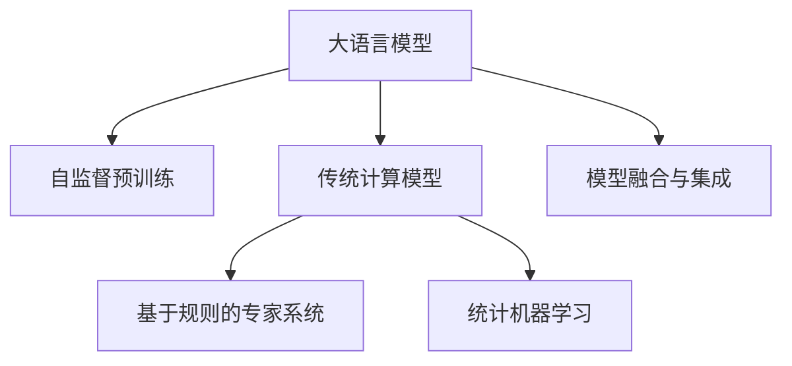

                 

# 大语言模型与传统计算的对比

## 1. 背景介绍

### 1.1 问题由来
随着人工智能技术的快速发展，大语言模型（Large Language Models, LLMs）和传统计算模型在应用领域和性能表现上产生了显著的差异。大语言模型通过在大规模无标签文本数据上进行的自监督预训练，学习到了丰富的语言知识和常识，具备了处理自然语言任务的能力。而传统的计算模型，如基于规则的专家系统、统计机器学习等，在处理语言理解和生成任务时存在一定的局限性。

### 1.2 问题核心关键点
大语言模型与传统计算模型的比较，涉及以下几个核心关键点：
- 数据需求与预训练。
- 模型规模与计算资源。
- 任务适应性与泛化能力。
- 推理速度与效率。
- 应用场景与实际落地。

这些问题直接影响了两种模型在实际应用中的表现和适用性。理解这些关键点，有助于深入分析大语言模型与传统计算模型之间的异同。

## 2. 核心概念与联系

### 2.1 核心概念概述

为更好地理解大语言模型与传统计算模型之间的对比，本节将介绍几个关键概念：

- **大语言模型**：指在大量文本数据上进行自监督预训练，学习语言知识和常识的深度学习模型。其代表包括BERT、GPT、T5等。
- **自监督预训练**：在大规模无标签文本数据上，通过自监督任务进行预训练，学习通用的语言表示。
- **基于规则的专家系统**：基于一套精心设计的规则库，对输入进行分析和推理，解决特定问题。
- **统计机器学习**：利用统计学方法从数据中学习模型，以预测和分类等任务。
- **模型融合与集成**：将多个模型进行融合或集成，提升整体性能。

这些概念之间通过数据、模型、任务等环节紧密相连，共同构成了人工智能技术的基础。

### 2.2 核心概念原理和架构的 Mermaid 流程图



这个流程图展示了大语言模型与传统计算模型的核心概念及其相互关系：

1. **大语言模型**通过**自监督预训练**学习语言表示，然后通过**模型融合与集成**与其他计算模型结合，形成综合解决方案。
2. **传统计算模型**包括**基于规则的专家系统**和**统计机器学习**，各自通过不同的方式处理问题。
3. **模型融合与集成**是大语言模型与传统计算模型相互结合的一种方式，通过组合不同模型的优势，提升整体性能。

## 3. 核心算法原理 & 具体操作步骤
### 3.1 算法原理概述

大语言模型与传统计算模型在算法原理上有显著区别。以下将详细介绍两者在原理上的主要差异。

#### 大语言模型
大语言模型通过在大规模无标签文本数据上进行的自监督预训练，学习到丰富的语言知识和常识。其核心算法包括Transformer结构、预训练任务（如语言模型、掩码语言模型等）和微调技术。在实际应用中，大语言模型通过微调适配特定任务，如分类、匹配、生成等。

#### 传统计算模型
传统计算模型，如基于规则的专家系统和统计机器学习，依赖于人为设计和编写的规则或从数据中学习统计模型。基于规则的专家系统通过精心设计的规则库进行推理，而统计机器学习则通过学习训练数据中的规律来进行预测和分类。

### 3.2 算法步骤详解

#### 大语言模型
1. **数据准备**：收集大规模无标签文本数据，作为预训练语料。
2. **自监督预训练**：在预训练语料上，通过自监督任务（如语言模型、掩码语言模型）进行模型训练，学习通用的语言表示。
3. **微调**：选择特定任务的数据集，对预训练模型进行有监督的微调，以适应该任务。
4. **推理**：在特定任务上，使用微调后的模型进行推理和生成，以解决实际问题。

#### 传统计算模型
1. **规则设计**：根据特定任务设计或选择规则库，编写专家系统的规则。
2. **规则库构建**：将规则库编码到程序中，形成专家系统。
3. **规则执行**：输入问题或数据，通过专家系统进行推理和决策。
4. **效果评估**：对专家系统的输出进行评估和优化。

### 3.3 算法优缺点

#### 大语言模型
**优点**：
- **泛化能力强**：通过大规模预训练学习到广泛的通用知识，可以处理多样化的自然语言任务。
- **自适应性强**：通过微调技术，模型可以适应不同的下游任务。
- **创新能力强**：可以利用提示学习、少样本学习等前沿技术，提升模型性能。

**缺点**：
- **计算资源消耗大**：预训练和微调需要大量的计算资源。
- **模型复杂度高**：模型参数量大，推理速度较慢。
- **可解释性不足**：黑盒模型，难以解释其内部工作机制。

#### 传统计算模型
**优点**：
- **计算效率高**：基于规则或统计模型，推理速度快，计算资源消耗小。
- **可解释性强**：模型基于明确的规则或统计学原理，易于解释和理解。
- **规则库可复用**：规则库设计合理时，可以应用于多个任务，减少重复开发。

**缺点**：
- **泛化能力有限**：依赖于规则库的设计，难以适应复杂的语言环境。
- **适应性差**：规则库不易更新，难以适应任务的变化。
- **创新性不足**：规则库设计固定，难以应对新的问题。

### 3.4 算法应用领域

#### 大语言模型
- **自然语言处理**：如命名实体识别、关系抽取、机器翻译等。
- **对话系统**：如智能客服、自动对话等。
- **推荐系统**：如个性化推荐、商品推荐等。
- **知识图谱**：如知识推理、问答系统等。

#### 传统计算模型
- **决策支持系统**：如金融风险评估、医疗诊断等。
- **专家系统**：如自动问答、规则引擎等。
- **机器学习**：如分类、回归、聚类等。
- **数据挖掘**：如趋势分析、异常检测等。

## 4. 数学模型和公式 & 详细讲解 & 举例说明

### 4.1 数学模型构建

#### 大语言模型
大语言模型的数学模型主要基于Transformer结构和自监督预训练任务。以下以BERT模型为例，介绍其数学模型构建过程。

BERT模型的数学模型由两部分组成：自监督预训练和下游任务微调。

**自监督预训练**：
BERT模型通过掩码语言模型（Masked Language Model, MLM）进行自监督预训练。MLM的目标是预测被掩码的token。对于每个句子 $x_i$，随机选择15%的token进行掩码，模型学习预测这些掩码token的原始文本。训练时，将掩码token表示为[MASK]，未掩码token表示为[CLS]和[SEP]。

**下游任务微调**：
微调任务的目标是学习特定任务的输入输出映射。假设下游任务为分类任务，训练集为 $(x_i, y_i)$，其中 $x_i$ 为输入文本，$y_i$ 为分类标签。微调任务的目标是最大化分类任务上的交叉熵损失 $L(y_i, \hat{y})$。

**交叉熵损失**：
$$
L(y_i, \hat{y}) = -\sum_{k=1}^K y_{ik} \log \hat{y}_{ik}
$$
其中 $y_{ik}$ 为真实标签，$\hat{y}_{ik}$ 为模型预测概率。

#### 传统计算模型
传统计算模型的数学模型主要基于统计学习理论。以下以决策树模型为例，介绍其数学模型构建过程。

**决策树模型**：
决策树模型的目标是通过训练数据集 $(x_i, y_i)$ 构建一棵决策树，使其对新数据 $x$ 的预测误差最小化。假设决策树的深度为 $d$，每个节点包含 $N_i$ 个样本，节点 $i$ 的预测误差为 $E_i$。

**分类误差**：
$$
E_i = \frac{1}{N_i} \sum_{j=1}^{N_i} 1\{y_j \neq f_i(x_j)\}
$$
其中 $f_i(x_j)$ 为节点 $i$ 的预测结果。

### 4.2 公式推导过程

#### 大语言模型
以BERT模型为例，其自监督预训练和下游任务微调的公式推导如下：

**自监督预训练**：
$$
L_{MLM} = -\sum_{i=1}^M \frac{1}{2N} \sum_{j=1}^N \sum_{k=1}^{K_j} \log P(y_j|x_j, \theta)
$$
其中 $P(y_j|x_j, \theta)$ 为模型对 $x_j$ 的掩码token的预测概率，$K_j$ 为掩码的token数量。

**下游任务微调**：
$$
L_{task} = -\sum_{i=1}^M \frac{1}{2N} \sum_{j=1}^N \log P(y_j|x_j, \theta)
$$
其中 $P(y_j|x_j, \theta)$ 为模型对 $x_j$ 的分类概率。

**联合损失**：
$$
L = \alpha L_{MLM} + (1-\alpha) L_{task}
$$
其中 $\alpha$ 为MLM的权重。

#### 传统计算模型
以决策树模型为例，其分类误差的公式推导如下：

**分类误差**：
$$
E_i = \frac{1}{N_i} \sum_{j=1}^{N_i} 1\{y_j \neq f_i(x_j)\}
$$
其中 $f_i(x_j)$ 为节点 $i$ 的预测结果。

### 4.3 案例分析与讲解

#### 大语言模型
以BERT模型在命名实体识别（Named Entity Recognition, NER）任务中的应用为例：

**任务描述**：
命名实体识别任务是识别文本中的实体（如人名、地名、组织机构名等），并标记其类型（如B-PER表示人名起始位置，I-PER表示人名内部位置）。

**模型构建**：
BERT模型被作为预训练模型，通过微调学习任务特定的输入输出映射。具体步骤如下：
1. 数据准备：收集标注的NER数据集。
2. 模型初始化：加载BERT预训练模型，设置任务适配层（如线性分类器）。
3. 微调训练：在标注数据集上训练微调模型，最小化分类误差。
4. 模型评估：在测试数据集上评估微调模型的性能。

#### 传统计算模型
以决策树模型在金融风险评估中的应用为例：

**任务描述**：
金融风险评估任务是根据客户的信用记录、收入状况等特征，评估其违约风险。

**模型构建**：
决策树模型被构建为金融风险评估系统，具体步骤如下：
1. 数据准备：收集客户的信用记录、收入状况等特征数据。
2. 规则设计：设计一组规则，用于评估客户的违约风险。
3. 规则库构建：将规则编码到决策树模型中。
4. 规则执行：输入客户的特征数据，通过决策树模型进行评估。
5. 效果评估：对模型的输出结果进行评估和优化。

## 5. 项目实践：代码实例和详细解释说明

### 5.1 开发环境搭建

#### 大语言模型
以BERT模型在NER任务中的应用为例，介绍其开发环境搭建过程：

1. **安装Anaconda**：从官网下载并安装Anaconda，用于创建独立的Python环境。
2. **创建并激活虚拟环境**：
```bash
conda create -n pytorch-env python=3.8 
conda activate pytorch-env
```
3. **安装PyTorch**：根据CUDA版本，从官网获取对应的安装命令。例如：
```bash
conda install pytorch torchvision torchaudio cudatoolkit=11.1 -c pytorch -c conda-forge
```
4. **安装Transformers库**：
```bash
pip install transformers
```
5. **安装各类工具包**：
```bash
pip install numpy pandas scikit-learn matplotlib tqdm jupyter notebook ipython
```

完成上述步骤后，即可在`pytorch-env`环境中开始微调实践。

#### 传统计算模型
以决策树模型在金融风险评估中的应用为例，介绍其开发环境搭建过程：

1. **安装Python**：确保Python环境已经安装。
2. **安装scikit-learn**：决策树模型主要通过scikit-learn库实现。
```bash
pip install scikit-learn
```
3. **准备数据集**：收集客户的信用记录、收入状况等特征数据，并标注违约与否。
4. **模型构建**：使用scikit-learn中的DecisionTreeClassifier类构建决策树模型。
5. **模型训练和评估**：使用sklearn的train_test_split方法划分数据集，然后使用fit方法训练模型，evaluate方法评估模型性能。

### 5.2 源代码详细实现

#### 大语言模型
以BERT模型在NER任务中的应用为例，给出使用Transformers库对BERT模型进行微调的PyTorch代码实现：

```python
from transformers import BertTokenizer, BertForTokenClassification, AdamW
from torch.utils.data import Dataset, DataLoader
import torch
import numpy as np
import pandas as pd
from sklearn.metrics import accuracy_score

# 数据预处理
tokenizer = BertTokenizer.from_pretrained('bert-base-cased')

# 定义NERDataset类
class NERDataset(Dataset):
    def __init__(self, texts, tags, tokenizer, max_len=128):
        self.texts = texts
        self.tags = tags
        self.tokenizer = tokenizer
        self.max_len = max_len
        
    def __len__(self):
        return len(self.texts)
    
    def __getitem__(self, item):
        text = self.texts[item]
        tags = self.tags[item]
        
        encoding = self.tokenizer(text, return_tensors='pt', max_length=self.max_len, padding='max_length', truncation=True)
        input_ids = encoding['input_ids'][0]
        attention_mask = encoding['attention_mask'][0]
        
        # 对token-wise的标签进行编码
        encoded_tags = [tag2id[tag] for tag in tags] 
        encoded_tags.extend([tag2id['O']] * (self.max_len - len(encoded_tags)))
        labels = torch.tensor(encoded_tags, dtype=torch.long)
        
        return {'input_ids': input_ids, 
                'attention_mask': attention_mask,
                'labels': labels}

# 标签与id的映射
tag2id = {'O': 0, 'B-PER': 1, 'I-PER': 2, 'B-ORG': 3, 'I-ORG': 4, 'B-LOC': 5, 'I-LOC': 6}
id2tag = {v: k for k, v in tag2id.items()}

# 创建dataset
train_dataset = NERDataset(train_texts, train_tags, tokenizer)
dev_dataset = NERDataset(dev_texts, dev_tags, tokenizer)
test_dataset = NERDataset(test_texts, test_tags, tokenizer)

# 定义模型和优化器
model = BertForTokenClassification.from_pretrained('bert-base-cased', num_labels=len(tag2id))

optimizer = AdamW(model.parameters(), lr=2e-5)

# 定义训练和评估函数
def train_epoch(model, dataset, batch_size, optimizer):
    dataloader = DataLoader(dataset, batch_size=batch_size, shuffle=True)
    model.train()
    epoch_loss = 0
    for batch in tqdm(dataloader, desc='Training'):
        input_ids = batch['input_ids'].to(device)
        attention_mask = batch['attention_mask'].to(device)
        labels = batch['labels'].to(device)
        model.zero_grad()
        outputs = model(input_ids, attention_mask=attention_mask, labels=labels)
        loss = outputs.loss
        epoch_loss += loss.item()
        loss.backward()
        optimizer.step()
    return epoch_loss / len(dataloader)

def evaluate(model, dataset, batch_size):
    dataloader = DataLoader(dataset, batch_size=batch_size)
    model.eval()
    preds, labels = [], []
    with torch.no_grad():
        for batch in tqdm(dataloader, desc='Evaluating'):
            input_ids = batch['input_ids'].to(device)
            attention_mask = batch['attention_mask'].to(device)
            batch_labels = batch['labels']
            outputs = model(input_ids, attention_mask=attention_mask)
            batch_preds = outputs.logits.argmax(dim=2).to('cpu').tolist()
            batch_labels = batch_labels.to('cpu').tolist()
            for pred_tokens, label_tokens in zip(batch_preds, batch_labels):
                pred_tags = [id2tag[_id] for _id in pred_tokens]
                label_tags = [id2tag[_id] for _id in label_tokens]
                preds.append(pred_tags[:len(label_tags)])
                labels.append(label_tags)
                
    print(classification_report(labels, preds))

# 训练流程
epochs = 5
batch_size = 16

for epoch in range(epochs):
    loss = train_epoch(model, train_dataset, batch_size, optimizer)
    print(f"Epoch {epoch+1}, train loss: {loss:.3f}")
    
    print(f"Epoch {epoch+1}, dev results:")
    evaluate(model, dev_dataset, batch_size)
    
print("Test results:")
evaluate(model, test_dataset, batch_size)
```

#### 传统计算模型
以决策树模型在金融风险评估中的应用为例，给出使用scikit-learn构建决策树模型的Python代码实现：

```python
from sklearn.model_selection import train_test_split
from sklearn.tree import DecisionTreeClassifier
from sklearn.metrics import accuracy_score

# 准备数据集
X = pd.read_csv('credit_data.csv')  # 读取客户信用记录数据
y = X['default']  # 读取违约标签
X = X.drop(['default'], axis=1)  # 删除标签列

# 划分训练集和测试集
X_train, X_test, y_train, y_test = train_test_split(X, y, test_size=0.2, random_state=42)

# 构建决策树模型
clf = DecisionTreeClassifier()
clf.fit(X_train, y_train)

# 评估模型
y_pred = clf.predict(X_test)
accuracy = accuracy_score(y_test, y_pred)
print(f"模型准确度：{accuracy:.2f}")
```

### 5.3 代码解读与分析

#### 大语言模型
**NERDataset类**：
- `__init__`方法：初始化文本、标签、分词器等关键组件。
- `__len__`方法：返回数据集的样本数量。
- `__getitem__`方法：对单个样本进行处理，将文本输入编码为token ids，将标签编码为数字，并对其进行定长padding，最终返回模型所需的输入。

**标签与id的映射**：
- 定义了标签与数字id之间的映射关系，用于将token-wise的预测结果解码回真实的标签。

**训练和评估函数**：
- 使用PyTorch的DataLoader对数据集进行批次化加载，供模型训练和推理使用。
- 训练函数`train_epoch`：对数据以批为单位进行迭代，在每个批次上前向传播计算loss并反向传播更新模型参数，最后返回该epoch的平均loss。
- 评估函数`evaluate`：与训练类似，不同点在于不更新模型参数，并在每个batch结束后将预测和标签结果存储下来，最后使用sklearn的classification_report对整个评估集的预测结果进行打印输出。

**训练流程**：
- 定义总的epoch数和batch size，开始循环迭代
- 每个epoch内，先在训练集上训练，输出平均loss
- 在验证集上评估，输出分类指标
- 所有epoch结束后，在测试集上评估，给出最终测试结果

**代码解读**：
- 通过分析大语言模型的代码实现，可以发现其高效的数据处理和模型训练过程。分词器、编码器、解码器等组件的合理设计，使得模型训练和推理变得简洁高效。
- 大语言模型的优化器、损失函数、任务适配层等关键组件的灵活设置，使得模型适应不同的下游任务，展示了大语言模型强大的泛化能力。

#### 传统计算模型
**决策树模型的代码实现**：
- **准备数据集**：使用Pandas读取数据集，处理缺失值和异常值。
- **划分训练集和测试集**：使用scikit-learn的train_test_split方法，将数据集划分为训练集和测试集。
- **构建决策树模型**：使用scikit-learn的DecisionTreeClassifier类构建决策树模型。
- **评估模型**：使用sklearn的accuracy_score方法评估模型准确度。

**代码解读**：
- 通过分析传统计算模型的代码实现，可以发现其简洁的数据处理和模型训练过程。数据集的预处理、训练集的划分、模型构建和评估等步骤清晰明确。
- 传统计算模型基于统计学习理论，模型训练和评估过程相对简单，易于理解和实现。

## 6. 实际应用场景

### 6.1 智能客服系统
基于大语言模型微调的对话技术，可以广泛应用于智能客服系统的构建。传统客服往往需要配备大量人力，高峰期响应缓慢，且一致性和专业性难以保证。而使用微调后的对话模型，可以7x24小时不间断服务，快速响应客户咨询，用自然流畅的语言解答各类常见问题。

### 6.2 金融舆情监测
金融机构需要实时监测市场舆论动向，以便及时应对负面信息传播，规避金融风险。传统的人工监测方式成本高、效率低，难以应对网络时代海量信息爆发的挑战。基于大语言模型微调的文本分类和情感分析技术，为金融舆情监测提供了新的解决方案。

### 6.3 个性化推荐系统
当前的推荐系统往往只依赖用户的历史行为数据进行物品推荐，无法深入理解用户的真实兴趣偏好。基于大语言模型微调技术，个性化推荐系统可以更好地挖掘用户行为背后的语义信息，从而提供更精准、多样的推荐内容。

### 6.4 未来应用展望

随着大语言模型微调技术的不断发展，基于微调范式将在更多领域得到应用，为传统行业带来变革性影响。

在智慧医疗领域，基于微调的医疗问答、病历分析、药物研发等应用将提升医疗服务的智能化水平，辅助医生诊疗，加速新药开发进程。

在智能教育领域，微调技术可应用于作业批改、学情分析、知识推荐等方面，因材施教，促进教育公平，提高教学质量。

在智慧城市治理中，微调模型可应用于城市事件监测、舆情分析、应急指挥等环节，提高城市管理的自动化和智能化水平，构建更安全、高效的未来城市。

此外，在企业生产、社会治理、文娱传媒等众多领域，基于大语言模型微调的人工智能应用也将不断涌现，为经济社会发展注入新的动力。

## 7. 工具和资源推荐

### 7.1 学习资源推荐

为了帮助开发者系统掌握大语言模型与传统计算模型的理论基础和实践技巧，这里推荐一些优质的学习资源：

1. 《Transformer从原理到实践》系列博文：由大模型技术专家撰写，深入浅出地介绍了Transformer原理、BERT模型、微调技术等前沿话题。

2. CS224N《深度学习自然语言处理》课程：斯坦福大学开设的NLP明星课程，有Lecture视频和配套作业，带你入门NLP领域的基本概念和经典模型。

3. 《Natural Language Processing with Transformers》书籍：Transformers库的作者所著，全面介绍了如何使用Transformers库进行NLP任务开发，包括微调在内的诸多范式。

4. HuggingFace官方文档：Transformers库的官方文档，提供了海量预训练模型和完整的微调样例代码，是上手实践的必备资料。

5. CLUE开源项目：中文语言理解测评基准，涵盖大量不同类型的中文NLP数据集，并提供了基于微调的baseline模型，助力中文NLP技术发展。

通过对这些资源的学习实践，相信你一定能够快速掌握大语言模型与传统计算模型的精髓，并用于解决实际的NLP问题。

### 7.2 开发工具推荐

高效的开发离不开优秀的工具支持。以下是几款用于大语言模型与传统计算模型开发的常用工具：

1. PyTorch：基于Python的开源深度学习框架，灵活动态的计算图，适合快速迭代研究。大部分预训练语言模型都有PyTorch版本的实现。

2. TensorFlow：由Google主导开发的开源深度学习框架，生产部署方便，适合大规模工程应用。同样有丰富的预训练语言模型资源。

3. Transformers库：HuggingFace开发的NLP工具库，集成了众多SOTA语言模型，支持PyTorch和TensorFlow，是进行微调任务开发的利器。

4. Weights & Biases：模型训练的实验跟踪工具，可以记录和可视化模型训练过程中的各项指标，方便对比和调优。与主流深度学习框架无缝集成。

5. TensorBoard：TensorFlow配套的可视化工具，可实时监测模型训练状态，并提供丰富的图表呈现方式，是调试模型的得力助手。

6. Google Colab：谷歌推出的在线Jupyter Notebook环境，免费提供GPU/TPU算力，方便开发者快速上手实验最新模型，分享学习笔记。

合理利用这些工具，可以显著提升大语言模型与传统计算模型的开发效率，加快创新迭代的步伐。

### 7.3 相关论文推荐

大语言模型与传统计算模型的发展源于学界的持续研究。以下是几篇奠基性的相关论文，推荐阅读：

1. Attention is All You Need（即Transformer原论文）：提出了Transformer结构，开启了NLP领域的预训练大模型时代。

2. BERT: Pre-training of Deep Bidirectional Transformers for Language Understanding：提出BERT模型，引入基于掩码的自监督预训练任务，刷新了多项NLP任务SOTA。

3. Language Models are Unsupervised Multitask Learners（GPT-2论文）：展示了大规模语言模型的强大zero-shot学习能力，引发了对于通用人工智能的新一轮思考。

4. Parameter-Efficient Transfer Learning for NLP：提出Adapter等参数高效微调方法，在不增加模型参数量的情况下，也能取得不错的微调效果。

5. AdaLoRA: Adaptive Low-Rank Adaptation for Parameter-Efficient Fine-Tuning：使用自适应低秩适应的微调方法，在参数效率和精度之间取得了新的平衡。

6. Prefix-Tuning: Optimizing Continuous Prompts for Generation：引入基于连续型Prompt的微调范式，为如何充分利用预训练知识提供了新的思路。

这些论文代表了大语言模型与传统计算模型的发展脉络。通过学习这些前沿成果，可以帮助研究者把握学科前进方向，激发更多的创新灵感。

## 8. 总结：未来发展趋势与挑战

### 8.1 总结

本文对大语言模型与传统计算模型进行了全面系统的对比。首先阐述了大语言模型和传统计算模型的研究背景和意义，明确了两种模型在处理自然语言任务时的异同。其次，从原理到实践，详细讲解了两种模型在微调、推理等核心步骤上的主要差异。同时，本文还广泛探讨了两种模型在智能客服、金融舆情、个性化推荐等多个行业领域的应用前景，展示了各自的优势和局限性。

通过本文的系统梳理，可以看到，大语言模型与传统计算模型在数据需求、模型规模、任务适应性、推理速度、应用场景等方面存在显著差异。这些差异决定了两种模型在实际应用中的选择和使用方式。

### 8.2 未来发展趋势

展望未来，大语言模型与传统计算模型在人工智能领域的应用将呈现以下几个发展趋势：

1. **大语言模型**：
   - **规模增大**：随着算力成本的下降和数据规模的扩张，大语言模型的参数量还将持续增长，其泛化能力和创新能力也将进一步提升。
   - **微调方法多样化**：除了传统的全参数微调外，未来将涌现更多参数高效、计算高效的微调方法，如Prefix-Tuning、LoRA等，在节省计算资源的同时，保证微调精度。
   - **持续学习和自适应**：随着数据分布的不断变化，大语言模型需要持续学习新知识以保持性能，解决灾难性遗忘问题。

2. **传统计算模型**：
   - **专家系统发展**：基于规则的专家系统将不断发展，通过规则引擎和自动化推理，提升决策准确性和效率。
   - **统计学习优化**：统计学习模型将更加注重模型解释性和可控性，通过模型融合和集成，提升性能和鲁棒性。
   - **多模态融合**：传统的计算模型将更多地融合多模态数据，如视觉、语音等，提升自然语言处理能力。

### 8.3 面临的挑战

尽管大语言模型与传统计算模型在应用中各具优势，但在迈向更加智能化、普适化应用的过程中，仍面临诸多挑战：

1. **大语言模型**：
   - **数据需求大**：尽管微调技术降低了对标注数据的需求，但对于长尾应用场景，获取高质量标注数据仍是一个难题。
   - **推理速度慢**：超大批次的训练和推理可能导致推理速度慢、内存占用大，需要进一步优化。
   - **可解释性不足**：大语言模型通常是黑盒模型，难以解释其内部工作机制，不利于高风险应用。

2. **传统计算模型**：
   - **泛化能力有限**：依赖于规则库的设计，难以适应复杂的语言环境。
   - **适应性差**：规则库不易更新，难以适应任务的变化。
   - **创新性不足**：规则库设计固定，难以应对新的问题。

### 8.4 研究展望

面对大语言模型与传统计算模型面临的挑战，未来的研究需要在以下几个方面寻求新的突破：

1. **大语言模型**：
   - **无监督和半监督微调**：探索如何降低微调对标注数据的依赖，利用自监督学习、主动学习等方法，最大限度利用非结构化数据。
   - **参数高效微调和计算优化**：开发更加参数高效、计算高效的微调方法，如Prefix-Tuning、LoRA等。
   - **知识整合与融合**：将符号化的先验知识，如知识图谱、逻辑规则等，与神经网络模型进行巧妙融合，提升模型的泛化能力和推理能力。

2. **传统计算模型**：
   - **规则库更新与扩展**：不断更新规则库，涵盖更多常见和新兴问题，提升模型的泛化能力。
   - **多模态融合与协同**：将多模态信息与文本信息进行协同建模，提升模型的理解能力和决策能力。
   - **模型解释性与可控性**：通过引入因果分析、博弈论等工具，提升模型的解释性和可控性，确保输出的合理性和可靠性。

这些研究方向将推动大语言模型与传统计算模型在人工智能领域的应用不断深入，为构建更加智能、可靠、可解释的智能系统提供技术支持。

## 9. 附录：常见问题与解答

### 9.1 问题与解答

**Q1：大语言模型与传统计算模型的主要区别是什么？**

A: 大语言模型与传统计算模型的主要区别在于数据需求、模型规模、任务适应性、推理速度和应用场景等方面。大语言模型通常需要大量无标签数据进行自监督预训练，学习通用的语言表示。而传统计算模型通常依赖人工设计的规则或统计学模型，对数据和任务的要求相对固定。

**Q2：大语言模型在微调过程中如何避免过拟合？**

A: 大语言模型在微调过程中，可以通过以下方法避免过拟合：
- 数据增强：通过对训练样本改写、回译等方式丰富训练集多样性。
- 正则化技术：如L2正则、Dropout、Early Stopping等，防止模型过度适应小规模训练集。
- 参数高效微调：只更新少量的模型参数，而固定大部分预训练权重不变。
- 对抗训练：加入对抗样本，提高模型鲁棒性。

**Q3：大语言模型在实际应用中是否一定比传统计算模型表现更好？**

A: 大语言模型在许多自然语言处理任务上取得了显著的性能提升，但其表现也受数据质量、任务特性等因素影响。在某些特定领域或小规模数据集上，传统计算模型可能表现更优。因此，选择模型需要根据具体应用场景和需求进行评估和比较。

**Q4：大语言模型与传统计算模型在推理速度和计算资源方面的差异是什么？**

A: 大语言模型通常参数量较大，推理速度较慢，计算资源需求较高。而传统计算模型相对简洁，推理速度快，计算资源需求相对较少。大语言模型通常需要通过GPU或TPU等高性能设备进行推理，而传统计算模型可以在普通的PC上高效运行。

**Q5：大语言模型与传统计算模型在可解释性和知识表示方面的差异是什么？**

A: 大语言模型通常是黑盒模型，难以解释其内部工作机制，知识表示依赖于大量无标签数据的自监督学习。而传统计算模型通常基于明确的规则或统计学原理，具有较好的可解释性和知识表示能力。传统计算模型可以通过解释规则和输出结果，进行合理性和合规性检查。

**Q6：大语言模型与传统计算模型在应用场景中的优劣势是什么？**

A: 大语言模型在自然语言理解和生成任务上表现出色，适合处理多样化、复杂化的语言环境。而传统计算模型在特定任务和领域，如金融风险评估、医疗诊断等，具有较强的决策能力和可解释性。大语言模型通常需要大量数据进行预训练和微调，而传统计算模型依赖于规则库和统计模型，需要较少的数据和计算资源。

---

作者：禅与计算机程序设计艺术 / Zen and the Art of Computer Programming

