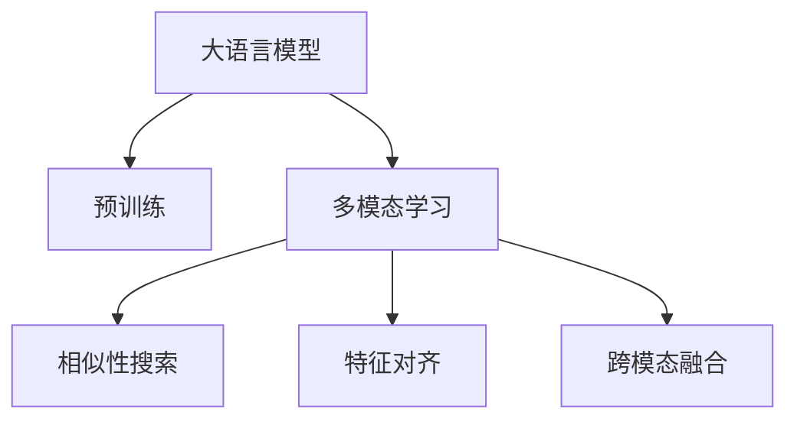

                 

# 大语言模型原理基础与前沿 基于相似性搜索的多模态对齐

> 关键词：大语言模型,多模态,相似性搜索,特征对齐,自然语言处理(NLP),计算机视觉(CV),语言-视觉任务,跨模态学习

## 1. 背景介绍

### 1.1 问题由来

在计算机科学和人工智能领域，语言模型和大规模语料库的应用已久，但长期以来，其大多聚焦于自然语言处理（Natural Language Processing, NLP）领域。近年来，随着深度学习技术的发展，特别是Transformer等架构的引入，大语言模型（Large Language Models, LLMs）在NLP领域取得了前所未有的突破，诸如GPT-3、BERT等模型展示了强大的泛化能力。然而，这类大模型在处理文本数据之外的多模态数据（如图像、音频等）时，能力有限，表现不佳。

为了克服这一问题，多模态学习（Multimodal Learning）应运而生。多模态学习旨在整合不同类型的数据（如图像、文本、音频等），以获取更加全面、丰富的知识表示，进而提升模型性能。其中，基于相似性搜索（Similarity Search）的多模态对齐技术，因其高效性和灵活性，受到了广泛关注。

### 1.2 问题核心关键点

多模态对齐的核心在于，如何将不同模态的数据特征进行有效匹配，构建统一的语义空间。其核心挑战在于：

1. **特征对齐**：不同模态的数据通常具有不同的特征空间，如文本为离散符号序列，图像为高维连续像素值。如何将不同模态的特征对齐，构建共享的语义空间，是关键问题。
2. **相似性搜索**：在构建语义空间后，如何高效地搜索相似性，快速检索相关数据，是提升模型性能的重要方法。
3. **跨模态融合**：如何将不同模态的数据进行有效融合，以生成更全面、准确的输出，是实现多模态学习的核心目标。

### 1.3 问题研究意义

研究基于相似性搜索的多模态对齐方法，对于拓展大语言模型的应用范围，提升其在跨模态数据上的性能，加速人工智能技术的产业化进程，具有重要意义：

1. 拓展应用场景。通过将大语言模型与图像、视频等数据融合，可以在更多领域实现高效的智能解决方案。
2. 提高模型性能。多模态学习可以利用多种类型的数据，提升模型的泛化能力和鲁棒性。
3. 加速技术发展。多模态学习为AI技术在复杂场景中的应用提供了新的思路，加速了技术的产业化应用。
4. 提供创新路径。多模态对齐技术可以引导对不同模态数据特性的深入理解，催生新的研究方向。
5. 推动产业升级。多模态学习技术可以应用于智慧医疗、智能教育、智能安防等多个行业，为传统行业数字化转型升级提供新的技术路径。

## 2. 核心概念与联系

### 2.1 核心概念概述

为更好地理解基于相似性搜索的多模态对齐方法，本节将介绍几个密切相关的核心概念：

- **大语言模型**：以自回归（如GPT）或自编码（如BERT）模型为代表的大规模预训练语言模型。通过在大规模无标签文本数据上进行预训练，学习通用的语言表示，具备强大的语言理解和生成能力。
- **多模态学习**：将不同类型的数据（如图像、文本、音频等）进行整合，以获取更全面、丰富的知识表示，提升模型的泛化能力和鲁棒性。
- **相似性搜索**：通过计算不同数据样本之间的相似度，快速检索与目标数据相关的信息。
- **特征对齐**：将不同模态的数据特征进行映射，构建统一的语义空间，以便于进行相似性搜索和多模态融合。
- **跨模态融合**：将不同模态的数据进行有效融合，生成更加全面、准确的输出。

这些核心概念之间的逻辑关系可以通过以下Mermaid流程图来展示：



这个流程图展示了核心概念之间的关联：

1. 大语言模型通过预训练获得基础能力。
2. 多模态学习整合不同类型的数据，提升模型性能。
3. 相似性搜索计算相似度，快速检索相关数据。
4. 特征对齐将不同模态的特征映射到统一空间。
5. 跨模态融合将不同模态的数据进行有效融合，生成全面准确的输出。

这些概念共同构成了多模态学习的基本框架，为解决实际问题提供了方法论指导。

## 3. 核心算法原理 & 具体操作步骤
### 3.1 算法原理概述

基于相似性搜索的多模态对齐方法，主要通过以下步骤实现：

1. **数据预处理**：将不同模态的数据进行标准化和归一化处理，以便于计算相似度。
2. **特征提取**：使用特定的算法（如CNN、RNN、Transformer等）提取不同模态的数据特征，形成高维向量表示。
3. **特征对齐**：通过相似性搜索技术，计算不同模态特征向量之间的相似度，找到最佳的匹配点。
4. **相似性搜索**：使用KNN、LSH等相似性搜索算法，快速检索与目标数据相关的信息。
5. **跨模态融合**：将不同模态的数据进行融合，生成更加全面、准确的输出。

形式化地，假设不同模态的数据分别为 $\mathbf{x}_i \in \mathcal{X}$ 和 $\mathbf{y}_i \in \mathcal{Y}$，其中 $\mathcal{X}$ 和 $\mathcal{Y}$ 分别为不同模态的数据空间，$\sim_{\mathbf{x}}(\cdot, \cdot)$ 和 $\sim_{\mathbf{y}}(\cdot, \cdot)$ 分别为不同模态之间的相似度计算函数。基于相似性搜索的多模态对齐目标为：

$$
\arg\min_{\mathbf{x}, \mathbf{y}} \left(\sum_{i=1}^N \max\{\sim_{\mathbf{x}}(\mathbf{x}_i, \mathbf{x}_j), \sim_{\mathbf{y}}(\mathbf{y}_i, \mathbf{y}_j)\} \right)
$$

其中 $N$ 为数据集大小。

### 3.2 算法步骤详解

基于相似性搜索的多模态对齐方法一般包括以下几个关键步骤：

**Step 1: 数据预处理**

对不同模态的数据进行预处理，包括数据标准化、归一化、缺失值处理等。以图像数据为例，需要进行预处理包括图像增强、色彩归一化、中心点对齐等步骤。

**Step 2: 特征提取**

使用深度学习模型提取不同模态的数据特征。以图像数据为例，可以使用卷积神经网络（CNN）提取特征。对于文本数据，可以使用Transformer模型提取特征。

**Step 3: 特征对齐**

通过相似性搜索技术，计算不同模态特征向量之间的相似度，找到最佳的匹配点。具体方法包括K近邻搜索（KNN）、局部敏感哈希（LSH）等。

**Step 4: 相似性搜索**

使用KNN、LSH等相似性搜索算法，快速检索与目标数据相关的信息。在图像-文本匹配任务中，可以使用视觉-文本相似性搜索算法，快速检索与目标图像相关的文本信息。

**Step 5: 跨模态融合**

将不同模态的数据进行融合，生成更加全面、准确的输出。常用的方法包括特征加权融合、注意力机制融合等。

### 3.3 算法优缺点

基于相似性搜索的多模态对齐方法具有以下优点：

1. **高效性**：通过相似性搜索技术，快速检索相关数据，减少了计算时间。
2. **灵活性**：适用于多种模态数据，如文本、图像、视频等，能够灵活应对各种实际问题。
3. **可解释性**：相似性搜索的过程和结果易于解释和理解，有助于模型调试和优化。
4. **鲁棒性**：通过特征对齐和跨模态融合，提升了模型的泛化能力和鲁棒性。

同时，该方法也存在一定的局限性：

1. **计算成本高**：特征提取和相似性搜索的计算成本较高，特别是在高维数据上。
2. **维度灾难**：在高维数据空间中，相似性搜索的效果可能不理想，容易陷入维度灾难。
3. **特征提取困难**：不同模态的数据特征提取方法不同，需要根据具体任务进行设计。
4. **数据分布差异**：不同模态的数据分布可能存在较大差异，影响特征对齐效果。

尽管存在这些局限性，但就目前而言，基于相似性搜索的多模态对齐方法仍然是多模态学习领域的重要范式。未来相关研究的重点在于如何进一步降低计算成本，提高算法的鲁棒性和可解释性。

### 3.4 算法应用领域

基于相似性搜索的多模态对齐方法，在计算机视觉（CV）、自然语言处理（NLP）等多个领域得到了广泛的应用，覆盖了文本-图像、文本-视频、图像-视频等多种场景，例如：

- **文本-图像匹配**：识别文本描述对应的图像，或图像对应的文本描述。如基于图像的文本检索、基于文本的图像生成等。
- **文本-视频匹配**：将视频中的片段与文本描述进行匹配，用于视频摘要、视频分类等任务。
- **图像-视频匹配**：将图像与视频片段进行匹配，用于视频内容检索、视频事件抽取等任务。
- **视觉-文本对话**：通过视觉-文本对齐技术，实现视觉-文本对话系统。如智能客服、虚拟助手等。

除了上述这些经典任务外，多模态对齐技术还被创新性地应用到更多场景中，如跨模态生成、跨模态情感分析、跨模态数据增强等，为多模态学习技术带来了全新的突破。随着深度学习模型的不断进步，相信多模态对齐方法将在更广泛的领域得到应用，为多模态学习技术的发展注入新的动力。

## 4. 数学模型和公式 & 详细讲解 & 举例说明

### 4.1 数学模型构建

本节将使用数学语言对基于相似性搜索的多模态对齐过程进行更加严格的刻画。

假设预训练的大语言模型为 $M_{\theta}$，其中 $\theta$ 为预训练得到的模型参数。假设多模态任务的数据集为 $D=\{(x_i, y_i)\}_{i=1}^N$，其中 $x_i$ 为输入数据，$y_i$ 为输出标签。

定义模型 $M_{\theta}$ 在输入 $x$ 上的输出为 $M_{\theta}(x)$，在输出 $y$ 上的损失函数为 $\ell(y, M_{\theta}(x))$。基于相似性搜索的多模态对齐的目标是：

$$
\arg\min_{\theta} \sum_{i=1}^N \max\{\sim_{\mathbf{x}}(x_i, x_j), \sim_{\mathbf{y}}(y_i, y_j)\}
$$

其中 $\sim_{\mathbf{x}}(x_i, x_j)$ 和 $\sim_{\mathbf{y}}(y_i, y_j)$ 分别表示输入和输出之间的相似度计算函数。

### 4.2 公式推导过程

以文本-图像匹配任务为例，推导相似性搜索和多模态对齐的数学公式。

假设输入文本 $x_i$ 经过Transformer模型提取特征得到 $f(x_i)$，图像 $y_i$ 经过CNN模型提取特征得到 $g(y_i)$。假设 $\sim_{\mathbf{x}}(x_i, x_j)$ 为余弦相似度，即 $\sim_{\mathbf{x}}(x_i, x_j)=\frac{\langle f(x_i), f(x_j) \rangle}{\|f(x_i)\| \|f(x_j)\|}$。

基于相似性搜索的多模态对齐目标为：

$$
\arg\min_{\theta} \sum_{i=1}^N \max\{\sim_{\mathbf{x}}(x_i, x_j), \sim_{\mathbf{y}}(y_i, y_j)\}
$$

其中 $\sim_{\mathbf{y}}(y_i, y_j)$ 可以采用多种相似度计算方法，如欧式距离、曼哈顿距离等。

### 4.3 案例分析与讲解

以一个具体的案例来说明基于相似性搜索的多模态对齐方法的应用。

假设有一个图像-文本匹配任务，给定一张描述动物的图片，需要找到最匹配的描述文本。首先将图像 $y$ 输入CNN模型提取特征 $g(y)$，将文本 $x$ 输入Transformer模型提取特征 $f(x)$。使用余弦相似度计算输入和输出之间的相似度：

$$
\sim_{\mathbf{x}}(x_i, x_j)=\frac{\langle f(x_i), f(x_j) \rangle}{\|f(x_i)\| \|f(x_j)\|}
$$

$$
\sim_{\mathbf{y}}(y_i, y_j)=\frac{\langle g(y_i), g(y_j) \rangle}{\|g(y_i)\| \|g(y_j)\|}
$$

然后，将计算得到的相似度值进行比较，找到最大的相似度值。例如，如果 $\sim_{\mathbf{x}}(x_i, x_j) > \sim_{\mathbf{y}}(y_i, y_j)$，则认为 $x_i$ 是最匹配的文本描述。

在实际应用中，还需要考虑模型的泛化能力和鲁棒性，因此可以使用正则化技术、Dropout、Early Stopping等方法进行优化。同时，为了提高相似性搜索的效率，可以使用L2正则化、近似最近邻搜索（ANN）等技术。

## 5. 项目实践：代码实例和详细解释说明
### 5.1 开发环境搭建

在进行多模态对齐实践前，我们需要准备好开发环境。以下是使用Python进行TensorFlow开发的环境配置流程：

1. 安装Anaconda：从官网下载并安装Anaconda，用于创建独立的Python环境。

2. 创建并激活虚拟环境：
```bash
conda create -n tf-env python=3.8 
conda activate tf-env
```

3. 安装TensorFlow：根据CUDA版本，从官网获取对应的安装命令。例如：
```bash
conda install tensorflow -c pytorch -c conda-forge
```

4. 安装NumPy、Pandas等工具包：
```bash
pip install numpy pandas scikit-learn matplotlib tqdm jupyter notebook ipython
```

完成上述步骤后，即可在`tf-env`环境中开始多模态对齐实践。

### 5.2 源代码详细实现

下面我们以图像-文本匹配任务为例，给出使用TensorFlow进行多模态对齐的PyTorch代码实现。

首先，定义数据处理函数：

```python
import numpy as np
import tensorflow as tf
from tensorflow.keras.preprocessing import image
from tensorflow.keras.applications import VGG16
from tensorflow.keras.layers import Dense, Input, concatenate
from tensorflow.keras.models import Model

def preprocess_data(data_path, image_size):
    images = []
    labels = []
    for file in os.listdir(data_path):
        if file.endswith('.jpg'):
            img_path = os.path.join(data_path, file)
            img = image.load_img(img_path, target_size=(image_size, image_size))
            img = image.img_to_array(img)
            img = tf.keras.applications.vgg16.preprocess_input(img)
            images.append(img)
            label = file.split('.')[0]
            labels.append(label)
    return images, labels

# 定义特征提取器
vgg16 = VGG16(include_top=False, weights='imagenet')
img_input = Input(shape=(image_size, image_size, 3))
img_features = vgg16(img_input)

def extract_features(text_input):
    model = Model(text_input, img_features)
    return model(text_input)

# 定义文本特征提取器
text_input = Input(shape=(max_seq_len,))
text_features = Dense(256, activation='relu')(text_input)

# 定义多模态对齐模型
features = concatenate([img_features, text_features])
features = Dense(128, activation='relu')(features)
img_to_text = Dense(1, activation='sigmoid')(features)

# 编译模型
model.compile(loss='binary_crossentropy', optimizer='adam', metrics=['accuracy'])
```

然后，加载并预处理数据：

```python
data_path = 'path/to/data'
image_size = 224
max_seq_len = 512

images, labels = preprocess_data(data_path, image_size)

img_input = ImageDataGenerator().flow(images, labels, batch_size=batch_size)
```

接着，定义模型并训练：

```python
batch_size = 32
epochs = 10

img_input = ImageDataGenerator().flow(images, labels, batch_size=batch_size)
model.fit(img_input, steps_per_epoch=len(img_input), epochs=epochs)
```

最后，进行模型评估：

```python
eval_dataset = ImageDataGenerator().flow(test_images, test_labels, batch_size=batch_size)
eval_loss, eval_acc = model.evaluate(eval_dataset, steps=len(eval_dataset))
print(f'Test accuracy: {eval_acc:.4f}')
```

以上就是使用TensorFlow对图像-文本匹配任务进行多模态对齐的完整代码实现。可以看到，TensorFlow提供了丰富的工具和接口，使得多模态对齐任务的开发变得更加便捷和高效。

### 5.3 代码解读与分析

让我们再详细解读一下关键代码的实现细节：

**preprocess_data函数**：
- 定义数据处理函数，将数据集中的图像文件加载并进行预处理，包括尺寸调整、归一化等。
- 将预处理后的图像和标签存储到`images`和`labels`列表中。

**特征提取器定义**：
- 使用VGG16模型提取图像特征。
- 定义文本特征提取器，使用全连接层将文本转换为高维特征向量。

**多模态对齐模型**：
- 将图像特征和文本特征进行拼接，得到新的特征向量。
- 使用全连接层进行特征融合，得到最终的输出。
- 使用sigmoid函数将输出映射到[0, 1]区间，用于二分类任务。

**模型训练和评估**：
- 定义模型，编译模型，并设置训练参数。
- 使用ImageDataGenerator进行数据增强，将数据集划分为训练集和测试集。
- 进行模型训练，并计算测试集上的精度。

可以看到，TensorFlow提供的高层API使得多模态对齐任务的开发变得更加简洁和高效。开发者可以通过简单易懂的接口调用预定义的模型和数据增强工具，快速实现多模态对齐任务的开发和训练。

当然，工业级的系统实现还需考虑更多因素，如模型的保存和部署、超参数的自动搜索、更灵活的任务适配层等。但核心的多模态对齐过程基本与此类似。

## 6. 实际应用场景
### 6.1 智能安防监控

基于图像-文本匹配的多模态学习技术，可以广泛应用于智能安防监控系统。传统的安防监控系统主要依赖摄像头进行图像采集，难以识别异常行为或潜在威胁。而使用基于图像-文本匹配的多模态学习模型，可以在摄像头监控下，同时获取图像和文本信息，实现更加智能、高效的监控。

在技术实现上，可以部署多模态学习模型于安防监控系统中，利用图像描述和文本标注对模型进行微调。微调后的模型能够自动识别监控图像中的异常行为，如可疑人员、异常物品等，并在第一时间发出警报。同时，系统还可以使用文本描述对监控视频进行高效索引和检索，便于后续处理和分析。

### 6.2 智慧医疗诊断

在医疗领域，基于图像-文本匹配的多模态学习技术，可以应用于智慧医疗诊断系统。传统的医疗诊断主要依赖医生经验，耗费大量时间和精力。而使用基于图像-文本匹配的多模态学习模型，可以快速获取医疗影像和文本描述的匹配信息，帮助医生更准确、高效地进行诊断。

在技术实现上，可以收集医疗影像和对应的文本描述，使用多模态学习模型对影像和文本进行对齐和融合。模型能够识别影像中的病理特征，并根据文本描述进行进一步解释和诊断。医生可以借助系统的诊断结果，快速获取病因分析，优化诊疗方案。

### 6.3 智能推荐系统

在电商和娱乐领域，基于图像-文本匹配的多模态学习技术，可以应用于智能推荐系统。传统的推荐系统主要依赖用户历史行为数据进行物品推荐，难以捕捉到用户真实兴趣偏好。而使用基于图像-文本匹配的多模态学习模型，可以整合图像和文本信息，提供更加全面、精准的推荐。

在技术实现上，可以收集用户浏览、点击、评论、分享等行为数据，提取和用户交互的物品标题、描述、标签等文本内容。使用多模态学习模型对图像和文本进行对齐和融合，生成更全面、准确的推荐内容。推荐系统可以基于用户的浏览和互动行为，动态调整推荐内容，提升用户满意度和购物体验。

### 6.4 未来应用展望

随着多模态学习技术的不断发展，基于相似性搜索的多模态对齐方法将在更多领域得到应用，为智能系统的发展提供新的动力。

在智慧城市治理中，多模态学习技术可以应用于城市事件监测、舆情分析、应急指挥等环节，提高城市管理的自动化和智能化水平，构建更安全、高效的未来城市。

在智能交通领域，多模态学习技术可以应用于车辆识别、交通流量预测、交通事故分析等任务，提升交通管理的智能化水平，缓解交通拥堵，提升交通效率。

此外，在智慧医疗、智能教育、智能安防等众多领域，基于多模态学习技术的系统也将不断涌现，为各行各业带来新的技术突破。相信随着深度学习模型的不断进步，多模态对齐方法将在更广阔的领域得到应用，为多模态学习技术的发展注入新的活力。

## 7. 工具和资源推荐
### 7.1 学习资源推荐

为了帮助开发者系统掌握多模态学习技术，这里推荐一些优质的学习资源：

1. 《深度学习理论与实践》系列博文：由深度学习专家撰写，深入浅出地介绍了多模态学习的基本概念和经典模型。

2. CS231n《卷积神经网络》课程：斯坦福大学开设的计算机视觉课程，系统讲解了图像特征提取、图像分类等核心技术。

3. CS224N《深度学习自然语言处理》课程：斯坦福大学开设的NLP明星课程，介绍了自然语言处理的基本概念和深度学习模型。

4. 《Multimodal Learning with TensorFlow》书籍：TensorFlow官方发布的教程书籍，系统讲解了多模态学习的理论和实践。

5. CLUE开源项目：中文语言理解测评基准，涵盖大量不同类型的中文NLP数据集，并提供了基于多模态学习技术的baseline模型，助力中文NLP技术发展。

通过对这些资源的学习实践，相信你一定能够快速掌握多模态学习技术的精髓，并用于解决实际的NLP问题。
###  7.2 开发工具推荐

高效的开发离不开优秀的工具支持。以下是几款用于多模态学习开发的常用工具：

1. TensorFlow：基于Python的开源深度学习框架，生产部署方便，适合大规模工程应用。提供了丰富的预训练模型和工具，支持多模态学习。

2. PyTorch：基于Python的开源深度学习框架，灵活动态的计算图，适合快速迭代研究。提供了丰富的深度学习模型库，支持多模态学习。

3. Keras：基于Python的高层深度学习框架，提供简单易用的API，支持多模态学习。

4. Weights & Biases：模型训练的实验跟踪工具，可以记录和可视化模型训练过程中的各项指标，方便对比和调优。与主流深度学习框架无缝集成。

5. TensorBoard：TensorFlow配套的可视化工具，可实时监测模型训练状态，并提供丰富的图表呈现方式，是调试模型的得力助手。

6. Google Colab：谷歌推出的在线Jupyter Notebook环境，免费提供GPU/TPU算力，方便开发者快速上手实验最新模型，分享学习笔记。

合理利用这些工具，可以显著提升多模态学习任务的开发效率，加快创新迭代的步伐。

### 7.3 相关论文推荐

多模态学习技术的发展源于学界的持续研究。以下是几篇奠基性的相关论文，推荐阅读：

1. ImageNet Classification with Deep Convolutional Neural Networks：提出卷积神经网络（CNN）用于图像分类，成为计算机视觉领域的里程碑。

2. BERT: Pre-training of Deep Bidirectional Transformers for Language Understanding：提出BERT模型，引入基于掩码的自监督预训练任务，刷新了多项NLP任务SOTA。

3. ViT: An Image Is Worth 16x16 Words：提出ViT模型，将图像数据离散化为像素级特征向量，实现了图像-文本的联合表示。

4. Multi-Modal Deep Learning for Autonomous Vehicles：应用多模态深度学习技术，提升了自动驾驶系统的感知和决策能力。

5. Cross-Media Matching：应用多模态对齐技术，实现了图像-文本的匹配和检索。

6. Deep Multimodal Learning for Visual Question Answering：应用多模态学习技术，提升了视觉问答系统的性能。

这些论文代表了大语言模型微调技术的发展脉络。通过学习这些前沿成果，可以帮助研究者把握学科前进方向，激发更多的创新灵感。

## 8. 总结：未来发展趋势与挑战

### 8.1 总结

本文对基于相似性搜索的多模态对齐方法进行了全面系统的介绍。首先阐述了多模态学习的基本概念和原理，明确了多模态对齐方法在提升模型性能、拓展应用场景方面的独特价值。其次，从原理到实践，详细讲解了多模态对齐的数学原理和关键步骤，给出了多模态对齐任务开发的完整代码实例。同时，本文还广泛探讨了多模态对齐方法在智能安防、智慧医疗、智能推荐等多个领域的应用前景，展示了多模态学习技术在实际问题中的应用潜力。

通过本文的系统梳理，可以看到，基于相似性搜索的多模态对齐方法正在成为多模态学习的重要范式，极大地拓展了多模态学习的应用范围，为智能系统的开发提供了新的思路。随着深度学习模型的不断进步，多模态对齐技术将在更多领域得到应用，为多模态学习技术的发展注入新的活力。

### 8.2 未来发展趋势

展望未来，基于相似性搜索的多模态对齐技术将呈现以下几个发展趋势：

1. **高维数据处理**：随着深度学习模型的不断发展，高维数据的多模态对齐将成为重要研究方向，如3D图像、时序数据等。
2. **端到端训练**：多模态对齐技术将与深度学习模型进行端到端的联合训练，进一步提升模型的性能和泛化能力。
3. **跨模态融合**：将不同模态的数据进行更高效、更灵活的融合，生成更全面、准确的输出。
4. **实时处理**：将多模态对齐技术应用于实时系统，提升系统响应速度和处理效率。
5. **自监督学习**：利用未标注数据进行多模态对齐，提升模型的数据利用率和泛化能力。
6. **跨模态生成**：基于多模态对齐技术，生成更加全面、自然的跨模态数据。

这些趋势凸显了多模态对齐技术的发展潜力，将在多模态学习领域带来新的突破，进一步拓展多模态学习技术的应用范围。

### 8.3 面临的挑战

尽管基于相似性搜索的多模态对齐技术已经取得了一定的进展，但在实际应用中也面临诸多挑战：

1. **计算成本高**：多模态对齐涉及多个模态的数据处理和特征提取，计算成本较高，特别是在高维数据上。
2. **维度灾难**：在高维数据空间中，相似性搜索的效果可能不理想，容易陷入维度灾难。
3. **特征提取困难**：不同模态的数据特征提取方法不同，需要根据具体任务进行设计。
4. **数据分布差异**：不同模态的数据分布可能存在较大差异，影响特征对齐效果。

尽管存在这些挑战，但多模态对齐技术仍具有广阔的发展前景，未来相关研究的重点在于如何进一步降低计算成本，提高算法的鲁棒性和可解释性。

### 8.4 研究展望

面对多模态对齐面临的挑战，未来的研究需要在以下几个方面寻求新的突破：

1. **优化相似性搜索算法**：探索更高效的相似性搜索算法，减少计算成本，提升搜索效果。
2. **提高特征提取能力**：开发更高效、更全面的特征提取方法，提升多模态数据的融合能力。
3. **融合跨模态知识**：将符号化的先验知识，如知识图谱、逻辑规则等，与神经网络模型进行巧妙融合，引导多模态对齐过程学习更准确、合理的语义表示。
4. **提高模型的泛化能力**：开发更加鲁棒的模型，提升其在跨模态数据上的泛化能力，避免模型过拟合。
5. **提高模型的可解释性**：赋予多模态对齐模型更强的可解释性，使其决策过程更加透明，便于调试和优化。

这些研究方向的探索，必将引领多模态对齐技术迈向更高的台阶，为多模态学习技术的发展注入新的活力。面向未来，多模态对齐技术还需要与其他人工智能技术进行更深入的融合，如知识表示、因果推理、强化学习等，多路径协同发力，共同推动多模态学习技术的进步。只有勇于创新、敢于突破，才能不断拓展多模态对齐技术的应用边界，让智能技术更好地造福人类社会。

## 9. 附录：常见问题与解答

**Q1：多模态学习中的数据如何预处理？**

A: 多模态学习中的数据预处理包括数据标准化、归一化、缺失值处理等。以图像数据为例，需要进行预处理包括图像增强、色彩归一化、中心点对齐等步骤。对于文本数据，需要进行分词、去除停用词等处理。

**Q2：多模态学习中的特征提取方法有哪些？**

A: 多模态学习中的特征提取方法包括卷积神经网络（CNN）、循环神经网络（RNN）、Transformer等。不同的特征提取方法适用于不同的模态数据，需要根据具体任务进行选择。

**Q3：多模态对齐中的相似性搜索方法有哪些？**

A: 多模态对齐中的相似性搜索方法包括K近邻搜索（KNN）、局部敏感哈希（LSH）等。这些方法可以用于快速检索与目标数据相关的信息。

**Q4：多模态学习中的跨模态融合方法有哪些？**

A: 多模态学习中的跨模态融合方法包括特征加权融合、注意力机制融合等。这些方法可以用于将不同模态的数据进行有效融合，生成更加全面、准确的输出。

**Q5：多模态学习中的模型训练方法有哪些？**

A: 多模态学习中的模型训练方法包括基于梯度下降的优化算法、基于自适应学习的优化算法等。这些方法可以用于训练多模态对齐模型，提升模型的性能和泛化能力。

通过这些问题的回答，可以看到多模态学习技术在实际应用中的关键点，需要开发者根据具体任务进行设计。未来多模态学习技术将在大数据、高维数据、跨模态数据融合等方向继续深入发展，为智能系统的开发提供新的思路。

