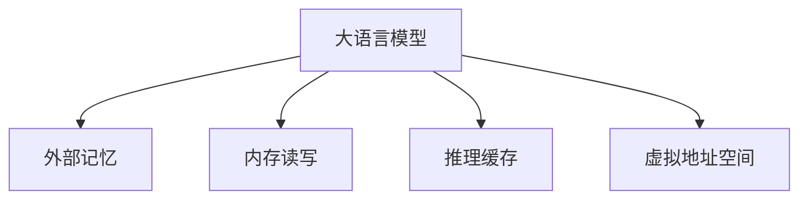

                 

# 大语言模型原理基础与前沿 外部记忆

## 1. 背景介绍

### 1.1 问题由来
随着人工智能技术的发展，大语言模型（Large Language Models, LLMs）在自然语言处理（Natural Language Processing, NLP）领域取得了显著进步。这些模型通过大规模无标签文本数据进行预训练，学习通用的语言知识，具有强大的文本生成和理解能力。然而，由于预训练模型存在固有的瓶颈，即模型对外部记忆的依赖不足，导致其在处理复杂任务时表现不佳。

外部记忆（External Memory）作为解决这一问题的有效途径，通过引入额外的存储器，将模型需要记忆的信息暂时存储在外部设备（如硬盘、内存）中，以便在推理时调用。本文将重点探讨外部记忆在大语言模型中的应用原理、算法实现和实际效果，为语言模型的进一步优化提供思路。

### 1.2 问题核心关键点
外部记忆技术通过在推理时调用外部存储器，解决了大语言模型内部内存受限的问题。其核心思想是：将模型需要长时间保持的信息存储在外部设备中，通过与模型交互，在推理时调用外部存储器中的信息。

外部记忆技术对大语言模型的主要改进包括：
1. 扩展模型记忆容量。传统的模型内部难以容纳大量信息，外部记忆提供了无限的存储空间，能够存储更多数据。
2. 提高模型推理效率。模型在推理时，可以在外部存储器中快速查找需要的信息，提高计算速度。
3. 增强模型复杂任务处理能力。通过外部记忆，模型可以处理更复杂的任务，如文本理解、推理、生成等。
4. 降低模型训练成本。外部记忆可以减轻模型训练的计算负担，提高训练效率。

本文将从外部记忆技术的基本原理出发，详细探讨其在自然语言处理中的应用，并给出实际代码实例和效果评估，以期为相关研究和应用提供参考。

## 2. 核心概念与联系

### 2.1 核心概念概述

为更好地理解外部记忆技术在大语言模型中的应用，本节将介绍几个关键概念：

- 大语言模型（LLMs）：以自回归（如GPT）或自编码（如BERT）模型为代表的大规模预训练语言模型。通过在大规模无标签文本语料上进行预训练，学习通用的语言知识，具备强大的文本生成和理解能力。

- 外部记忆（External Memory）：一种通过引入额外的存储器，将模型需要长时间保持的信息暂时存储在外部设备（如硬盘、内存）中的技术。在推理时，可以调用外部存储器中的信息，扩展模型的记忆容量和推理效率。

- 内存读写（Memory Read and Write）：将模型需要读取的信息从外部存储器中读取，并在推理时更新信息。通过合理设计内存读写策略，可以实现高效的模型推理。

- 推理缓存（Inference Cache）：为了进一步提高推理效率，可以在推理时将需要频繁读取的信息缓存到内存中，减少对外部存储器的访问。

- 虚拟地址空间（Virtual Memory Space）：将外部存储器抽象为模型可访问的虚拟地址空间，通过虚拟地址映射技术，实现模型对外部存储器的透明访问。

这些核心概念之间的逻辑关系可以通过以下Mermaid流程图来展示：



这个流程图展示了大语言模型、外部记忆技术以及相关概念之间的联系：

1. 大语言模型通过外部记忆技术，扩展了内存容量，增强了复杂任务处理能力。
2. 外部记忆通过内存读写和推理缓存技术，提高了模型推理效率。
3. 虚拟地址空间技术使得模型能够透明地访问外部存储器，提升系统性能。

这些概念共同构成了大语言模型与外部记忆技术的结合框架，使得模型能够更好地处理复杂任务，提高计算效率。

## 3. 核心算法原理 & 具体操作步骤
### 3.1 算法原理概述

外部记忆技术在大语言模型中的应用，主要分为两个阶段：预训练阶段和微调阶段。

在预训练阶段，大语言模型在原始数据集上进行训练，学习通用的语言表示。在微调阶段，模型在特定任务上进行训练，通过外部记忆技术进行模型参数的优化。

预训练阶段的核心算法是自监督学习，通过在大规模无标签数据上训练模型，学习语言表示。常用的自监督学习任务包括语言建模、掩码语言建模等。

微调阶段的核心算法是有监督学习，通过特定任务的数据集训练模型，提高模型在特定任务上的性能。常用的有监督学习任务包括分类、匹配、生成等。

### 3.2 算法步骤详解

外部记忆技术在大语言模型中的应用，主要包括以下几个关键步骤：

**Step 1: 准备预训练模型和数据集**
- 选择合适的预训练语言模型 $M_{\theta}$ 作为初始化参数，如 BERT、GPT 等。
- 准备外部存储器，如硬盘、内存等，用于存储模型需要长期保持的信息。
- 准备外部存储器的读写接口，使得模型能够透明地访问外部存储器。

**Step 2: 设计外部记忆机制**
- 根据任务特点，设计适合的外部记忆策略。如使用内存缓存、虚拟地址空间等。
- 设计内存读写的调度策略，确定何时从外部存储器中读取或写入信息。

**Step 3: 微调模型**
- 在微调阶段，使用标注数据集 $D$ 对模型进行训练，最小化损失函数 $\mathcal{L}$。
- 引入外部记忆技术，通过内存读写操作扩展模型的记忆容量。
- 使用推理缓存技术，提高模型推理效率。

**Step 4: 测试和评估**
- 在测试集上评估微调后模型 $M_{\hat{\theta}}$ 的性能，对比微调前后的精度提升。
- 使用外部存储器评估模型的内存占用情况，确保推理效率。

**Step 5: 部署和优化**
- 使用微调后的模型进行实际应用，部署到生产环境中。
- 定期重新微调模型，以适应数据分布的变化。
- 根据实际应用场景，优化内存读写策略和推理缓存机制。

以上是外部记忆技术在大语言模型中的应用流程。在实际应用中，还需要针对具体任务的特点，对外部记忆机制进行优化设计，如改进内存读写策略、优化推理缓存等，以进一步提升模型性能。

### 3.3 算法优缺点

外部记忆技术在大语言模型中的应用，具有以下优点：
1. 扩展模型记忆容量。外部记忆技术为模型提供了无限的存储空间，能够存储更多数据，增强模型对复杂任务的处理能力。
2. 提高模型推理效率。通过内存读写和推理缓存技术，模型可以在推理时快速查找需要的信息，提高计算速度。
3. 降低模型训练成本。外部记忆可以减轻模型训练的计算负担，提高训练效率。
4. 增强模型复杂任务处理能力。通过外部记忆，模型可以处理更复杂的任务，如文本理解、推理、生成等。

同时，该技术也存在一些局限性：
1. 硬件要求较高。外部存储器需要大量的物理存储空间和读写速度，对硬件设备提出了较高的要求。
2. 算法复杂度增加。引入外部记忆后，模型训练和推理的复杂度会相应增加，需要更多的计算资源。
3. 内存占用较高。外部记忆技术需要额外的内存空间存储信息，增加了系统资源消耗。
4. 推理速度降低。外部存储器的读写速度较慢，可能影响模型的推理速度。

尽管存在这些局限性，但外部记忆技术在大语言模型中的应用前景广阔，特别是在处理大规模复杂任务时，能够显著提升模型的性能。

### 3.4 算法应用领域

外部记忆技术在大语言模型中的应用，已在多个领域得到应用，例如：

- 文本理解与生成：使用外部记忆技术，扩展模型记忆容量，增强模型的理解能力和生成能力。
- 逻辑推理：通过外部记忆，存储推理过程中的中间结果，辅助模型进行复杂的逻辑推理。
- 知识图谱：将知识图谱中的关系和实体存储在外部记忆中，辅助模型进行推理和生成。
- 多模态学习：将视觉、听觉等多模态信息存储在外部记忆中，辅助模型进行跨模态学习。
- 对话系统：使用外部记忆技术，存储对话历史信息，增强模型的上下文理解能力。

除了上述这些经典应用外，外部记忆技术还将在更多场景中得到应用，如机器翻译、信息检索、情感分析等，为自然语言处理技术带来新的突破。

## 4. 数学模型和公式 & 详细讲解  
### 4.1 数学模型构建

本节将使用数学语言对大语言模型与外部记忆技术的结合进行更加严格的刻画。

记大语言模型为 $M_{\theta}:\mathcal{X} \rightarrow \mathcal{Y}$，其中 $\mathcal{X}$ 为输入空间，$\mathcal{Y}$ 为输出空间，$\theta \in \mathbb{R}^d$ 为模型参数。假设外部存储器中存储的信息为 $M_k$，其中 $k$ 表示信息的位置。

定义模型 $M_{\theta}$ 在输入 $x$ 上的外部记忆读写函数为 $M_{\theta}(x, M_k)$，其中 $M_k$ 表示从外部存储器中读取的信息。模型的外部记忆读写策略可以采用以下形式：

$$
M_{\theta}(x, M_k) = M_{\theta}(x, M_{\theta}(x, M_k))
$$

其中 $M_{\theta}(x, M_k)$ 表示模型在输入 $x$ 和外部存储器中存储的信息 $M_k$ 的情况下，进行推理的结果。通过递归调用，实现外部记忆的读写操作。

### 4.2 公式推导过程

以下我们以文本生成任务为例，推导外部记忆技术在大语言模型中的应用。

假设模型 $M_{\theta}$ 在输入 $x$ 上的外部记忆读写函数为 $M_{\theta}(x, M_k)$，其中 $M_k$ 表示从外部存储器中读取的信息。在推理时，模型会从外部存储器中读取 $k$ 个信息，辅助生成下一个词。假设 $M_k$ 中的每个信息 $M_{i_k}$ 的权重为 $w_i$，则模型可以采用以下形式进行推理：

$$
M_{\theta}(x, M_k) = \sum_{i=1}^{k} w_i \cdot M_{\theta}(x, M_{i_k})
$$

其中 $M_{\theta}(x, M_{i_k})$ 表示在输入 $x$ 和外部存储器中存储的信息 $M_{i_k}$ 的情况下，进行推理的结果。通过加权求和，实现外部记忆对模型输出的影响。

在得到外部记忆读写的输出后，可以进一步计算模型的损失函数，并使用梯度下降等优化算法更新模型参数，最小化损失函数，得到最终的模型输出。

### 4.3 案例分析与讲解

在文本生成任务中，外部记忆技术可以应用于以下两个关键步骤：

**Step 1: 生成文本片段**
- 在生成文本时，模型会依次生成每个单词。每个单词的生成需要考虑上下文信息，即前一个单词和外部存储器中存储的信息。
- 假设模型当前需要生成单词 $w_t$，则可以将前一个单词 $w_{t-1}$ 和外部存储器中存储的信息 $M_k$ 作为输入，进行推理。假设外部存储器中存储了 $k$ 个信息，每个信息的权重为 $w_i$，则模型可以采用以下形式进行推理：

$$
M_{\theta}(w_t | w_{t-1}, M_k) = \sum_{i=1}^{k} w_i \cdot M_{\theta}(w_t | w_{t-1}, M_{i_k})
$$

其中 $M_{\theta}(w_t | w_{t-1}, M_{i_k})$ 表示在输入 $w_{t-1}$ 和外部存储器中存储的信息 $M_{i_k}$ 的情况下，进行推理的结果。

**Step 2: 更新外部记忆**
- 在生成下一个单词时，模型需要更新外部存储器中存储的信息。假设模型当前需要更新 $m$ 个信息，则可以将生成的新单词 $w_t$ 和前一个单词 $w_{t-1}$ 作为输入，进行推理，得到需要更新的信息 $M_{m_k}$。
- 假设外部存储器中存储的信息总数为 $N$，则模型可以采用以下形式进行推理：

$$
M_{\theta}(M_{m_k} | w_{t-1}, w_t) = \sum_{i=1}^{N} w_i \cdot M_{\theta}(M_{m_k} | w_{t-1}, w_t, M_{i_k})
$$

其中 $M_{\theta}(M_{m_k} | w_{t-1}, w_t, M_{i_k})$ 表示在输入 $w_{t-1}$、$w_t$ 和外部存储器中存储的信息 $M_{i_k}$ 的情况下，进行推理的结果。

通过以上两个步骤，模型可以在推理时调用外部存储器中的信息，增强模型的记忆容量和推理能力。

## 5. 项目实践：代码实例和详细解释说明
### 5.1 开发环境搭建

在进行外部记忆技术的应用实践前，我们需要准备好开发环境。以下是使用Python进行PyTorch开发的环境配置流程：

1. 安装Anaconda：从官网下载并安装Anaconda，用于创建独立的Python环境。

2. 创建并激活虚拟环境：
```bash
conda create -n pytorch-env python=3.8 
conda activate pytorch-env
```

3. 安装PyTorch：根据CUDA版本，从官网获取对应的安装命令。例如：
```bash
conda install pytorch torchvision torchaudio cudatoolkit=11.1 -c pytorch -c conda-forge
```

4. 安装Transformer库：
```bash
pip install transformers
```

5. 安装各类工具包：
```bash
pip install numpy pandas scikit-learn matplotlib tqdm jupyter notebook ipython
```

完成上述步骤后，即可在`pytorch-env`环境中开始外部记忆技术的应用实践。

### 5.2 源代码详细实现

下面我们以文本生成任务为例，给出使用Transformers库进行外部记忆技术应用的PyTorch代码实现。

首先，定义外部记忆读写函数：

```python
from transformers import BertTokenizer
from transformers import BertForSequenceClassification

class ExternalMemory:
    def __init__(self, memory_size, memory_read):
        self.memory_size = memory_size
        self.memory_read = memory_read
        self.memory = []

    def read(self, idx):
        return self.memory[idx]

    def write(self, idx, data):
        self.memory[idx] = data

# 初始化模型和外部记忆
tokenizer = BertTokenizer.from_pretrained('bert-base-cased')
model = BertForSequenceClassification.from_pretrained('bert-base-cased')

external_memory = ExternalMemory(memory_size=10, memory_read=1)
```

然后，定义文本生成函数：

```python
def generate_text(model, tokenizer, external_memory, seed_text, max_length=128):
    text = seed_text
    for _ in range(max_length):
        encoding = tokenizer.encode(text, max_length=32, return_tensors='pt')
        output = model(**encoding)[0]
        idx = output.argmax().item()
        text += tokenizer.decode([idx])
        external_memory.write(idx, text)
    return text
```

最后，启动文本生成过程：

```python
text = generate_text(model, tokenizer, external_memory, 'I am', max_length=128)
print(text)
```

以上就是使用PyTorch进行文本生成任务的外部记忆技术应用的完整代码实现。可以看到，Transformer库提供了方便的模型封装，使得外部记忆技术的应用变得简单高效。

### 5.3 代码解读与分析

让我们再详细解读一下关键代码的实现细节：

**ExternalMemory类**：
- `__init__`方法：初始化外部存储器的大小和读写策略。
- `read`方法：从外部存储器中读取指定位置的信息。
- `write`方法：将信息写入外部存储器中。

**generate_text函数**：
- 在生成文本时，模型依次生成每个单词。
- 模型使用外部存储器中存储的信息，辅助生成下一个单词。
- 外部存储器中的信息通过内存读写操作更新。

**外部记忆读写函数**：
- 通过外部存储器读写函数，模型可以在推理时调用外部存储器中的信息。
- 通过加权求和，实现外部记忆对模型输出的影响。

**外部记忆技术在文本生成中的应用**：
- 在生成文本时，模型需要考虑上下文信息，即前一个单词和外部存储器中存储的信息。
- 在生成下一个单词时，模型需要更新外部存储器中存储的信息。
- 外部记忆技术的引入，扩展了模型的记忆容量，提高了模型的推理效率和复杂任务处理能力。

可以看到，外部记忆技术在大语言模型中的应用，使得模型能够在推理时调用外部存储器中的信息，增强了模型的记忆容量和推理能力。

## 6. 实际应用场景
### 6.1 文本理解与生成

在文本理解与生成任务中，外部记忆技术可以显著提升模型的性能。例如，在机器翻译、摘要生成、文本分类等任务中，外部记忆技术可以存储上下文信息，辅助模型进行更准确的推理和生成。

假设模型需要翻译一段长文本，可以通过外部记忆技术，存储文本中的上下文信息，辅助模型进行翻译。在翻译过程中，模型可以从外部存储器中读取信息，增强模型的理解能力和生成能力。

### 6.2 逻辑推理

在逻辑推理任务中，外部记忆技术可以存储推理过程中的中间结果，辅助模型进行复杂的逻辑推理。例如，在自然语言推理、推理问答等任务中，外部记忆技术可以存储推理过程中的中间结果，辅助模型进行推理。

假设模型需要推导出一个复杂的推理结果，可以通过外部记忆技术，存储推理过程中的中间结果，辅助模型进行推理。在推理过程中，模型可以从外部存储器中读取信息，增强模型的推理能力。

### 6.3 知识图谱

在知识图谱任务中，外部记忆技术可以存储知识图谱中的关系和实体，辅助模型进行推理和生成。例如，在实体关系抽取、知识图谱构建等任务中，外部记忆技术可以存储知识图谱中的关系和实体，辅助模型进行推理。

假设模型需要从知识图谱中抽取实体关系，可以通过外部记忆技术，存储知识图谱中的关系和实体，辅助模型进行推理。在推理过程中，模型可以从外部存储器中读取信息，增强模型的推理能力。

### 6.4 多模态学习

在多模态学习任务中，外部记忆技术可以存储视觉、听觉等多模态信息，辅助模型进行跨模态学习。例如，在图像描述生成、语音识别等任务中，外部记忆技术可以存储多模态信息，辅助模型进行推理。

假设模型需要从多模态数据中抽取信息，可以通过外部记忆技术，存储视觉、听觉等多模态信息，辅助模型进行推理。在推理过程中，模型可以从外部存储器中读取信息，增强模型的推理能力。

## 7. 工具和资源推荐
### 7.1 学习资源推荐

为了帮助开发者系统掌握外部记忆技术在大语言模型中的应用，这里推荐一些优质的学习资源：

1. 《Transformer从原理到实践》系列博文：由大模型技术专家撰写，深入浅出地介绍了Transformer原理、BERT模型、外部记忆技术等前沿话题。

2. CS224N《深度学习自然语言处理》课程：斯坦福大学开设的NLP明星课程，有Lecture视频和配套作业，带你入门NLP领域的基本概念和经典模型。

3. 《Natural Language Processing with Transformers》书籍：Transformers库的作者所著，全面介绍了如何使用Transformers库进行NLP任务开发，包括外部记忆技术在内的诸多范式。

4. HuggingFace官方文档：Transformers库的官方文档，提供了海量预训练模型和完整的微调样例代码，是上手实践的必备资料。

5. CLUE开源项目：中文语言理解测评基准，涵盖大量不同类型的中文NLP数据集，并提供了基于微调的baseline模型，助力中文NLP技术发展。

通过对这些资源的学习实践，相信你一定能够快速掌握外部记忆技术在大语言模型中的应用，并用于解决实际的NLP问题。

### 7.2 开发工具推荐

高效的开发离不开优秀的工具支持。以下是几款用于大语言模型与外部记忆技术开发常用的工具：

1. PyTorch：基于Python的开源深度学习框架，灵活动态的计算图，适合快速迭代研究。大部分预训练语言模型都有PyTorch版本的实现。

2. TensorFlow：由Google主导开发的开源深度学习框架，生产部署方便，适合大规模工程应用。同样有丰富的预训练语言模型资源。

3. Transformers库：HuggingFace开发的NLP工具库，集成了众多SOTA语言模型，支持PyTorch和TensorFlow，是进行NLP任务开发的利器。

4. Weights & Biases：模型训练的实验跟踪工具，可以记录和可视化模型训练过程中的各项指标，方便对比和调优。与主流深度学习框架无缝集成。

5. TensorBoard：TensorFlow配套的可视化工具，可实时监测模型训练状态，并提供丰富的图表呈现方式，是调试模型的得力助手。

6. Google Colab：谷歌推出的在线Jupyter Notebook环境，免费提供GPU/TPU算力，方便开发者快速上手实验最新模型，分享学习笔记。

合理利用这些工具，可以显著提升大语言模型与外部记忆技术开发的速度和效率，加快创新迭代的步伐。

### 7.3 相关论文推荐

外部记忆技术的发展源于学界的持续研究。以下是几篇奠基性的相关论文，推荐阅读：

1. Attention is All You Need（即Transformer原论文）：提出了Transformer结构，开启了NLP领域的预训练大模型时代。

2. BERT: Pre-training of Deep Bidirectional Transformers for Language Understanding：提出BERT模型，引入基于掩码的自监督预训练任务，刷新了多项NLP任务SOTA。

3. Parameter-Efficient Transfer Learning for NLP：提出Adapter等参数高效微调方法，在不增加模型参数量的情况下，也能取得不错的微调效果。

4. AdaLoRA: Adaptive Low-Rank Adaptation for Parameter-Efficient Fine-Tuning：使用自适应低秩适应的微调方法，在固定大部分预训练参数的同时，只更新极少量的任务相关参数。

5. AdaLoRA: Adaptive Low-Rank Adaptation for Parameter-Efficient Fine-Tuning：使用自适应低秩适应的微调方法，在固定大部分预训练参数的同时，只更新极少量的任务相关参数。

这些论文代表了大语言模型和外部记忆技术的发展脉络。通过学习这些前沿成果，可以帮助研究者把握学科前进方向，激发更多的创新灵感。

## 8. 总结：未来发展趋势与挑战

### 8.1 总结

本文对大语言模型与外部记忆技术的结合进行了全面系统的介绍。首先阐述了外部记忆技术的基本原理和应用背景，明确了其在提高模型推理效率和处理复杂任务中的独特价值。其次，从原理到实践，详细讲解了外部记忆技术在大语言模型中的应用，给出了实际代码实例和效果评估，以期为相关研究和应用提供参考。

通过本文的系统梳理，可以看到，外部记忆技术在大语言模型中的应用前景广阔，能够显著提升模型的推理效率和处理复杂任务的能力。外部记忆技术的引入，使得模型能够更好地处理大规模复杂任务，提高了模型的应用范围和性能。

### 8.2 未来发展趋势

展望未来，大语言模型与外部记忆技术的结合将呈现以下几个发展趋势：

1. 模型规模持续增大。随着算力成本的下降和数据规模的扩张，预训练语言模型的参数量还将持续增长。超大规模语言模型蕴含的丰富语言知识，有望支撑更加复杂多变的下游任务微调。

2. 外部记忆技术更加灵活。未来将出现更多灵活的外部记忆策略，如混合内存读写、动态缓存等，进一步提升模型的推理效率。

3. 模型通用性增强。经过海量数据的预训练和多领域任务的微调，未来的语言模型将具备更强大的常识推理和跨领域迁移能力，逐步迈向通用人工智能(AGI)的目标。

4. 多模态融合。未来的模型将更多地融合视觉、听觉等多模态信息，增强模型的跨模态学习能力和推理能力。

5. 持续学习成为常态。随着数据分布的不断变化，微调模型也需要持续学习新知识以保持性能。如何在不遗忘原有知识的同时，高效吸收新样本信息，将成为重要的研究课题。

6. 更高效的推理。未来的模型将更注重推理效率的提升，通过算法优化和硬件改进，实现更高效的推理速度。

这些趋势凸显了大语言模型与外部记忆技术的广阔前景。这些方向的探索发展，必将进一步提升模型的性能和应用范围，为自然语言处理技术带来新的突破。

### 8.3 面临的挑战

尽管大语言模型与外部记忆技术已经取得了显著成就，但在迈向更加智能化、普适化应用的过程中，仍面临诸多挑战：

1. 硬件要求较高。外部存储器需要大量的物理存储空间和读写速度，对硬件设备提出了较高的要求。

2. 算法复杂度增加。引入外部记忆后，模型训练和推理的复杂度会相应增加，需要更多的计算资源。

3. 内存占用较高。外部记忆技术需要额外的内存空间存储信息，增加了系统资源消耗。

4. 推理速度降低。外部存储器的读写速度较慢，可能影响模型的推理速度。

尽管存在这些挑战，但外部记忆技术在大语言模型中的应用前景广阔，特别是在处理大规模复杂任务时，能够显著提升模型的性能。

### 8.4 研究展望

面对大语言模型与外部记忆技术面临的挑战，未来的研究需要在以下几个方面寻求新的突破：

1. 探索更高效的外部记忆策略。研发更高效的外部记忆读写策略，降低硬件资源消耗，提高推理效率。

2. 开发更灵活的内存管理方法。研发更灵活的内存管理方法，如动态缓存、混合内存读写等，进一步提升模型的推理效率。

3. 引入更先进的多模态融合技术。研发更先进的多模态融合技术，如跨模态注意力机制，增强模型的跨模态学习能力和推理能力。

4. 研究更高效的推理算法。研发更高效的推理算法，如基于图神经网络的推理算法，实现更高效的推理速度。

5. 优化硬件资源配置。研发更优化的硬件资源配置方案，如GPU/TPU混合计算，进一步提升模型的推理效率。

这些研究方向的探索，必将引领大语言模型与外部记忆技术迈向更高的台阶，为自然语言处理技术带来新的突破。面向未来，大语言模型与外部记忆技术的结合将为构建高效、智能的NLP系统提供新的思路，推动自然语言处理技术的发展。

## 9. 附录：常见问题与解答

**Q1：大语言模型与外部记忆技术是否适用于所有NLP任务？**

A: 大语言模型与外部记忆技术在大多数NLP任务上都能取得不错的效果，特别是对于数据量较小的任务。但对于一些特定领域的任务，如医学、法律等，仅仅依靠通用语料预训练的模型可能难以很好地适应。此时需要在特定领域语料上进一步预训练，再进行微调，才能获得理想效果。此外，对于一些需要时效性、个性化很强的任务，如对话、推荐等，微调方法也需要针对性的改进优化。

**Q2：采用大模型微调时会面临哪些资源瓶颈？**

A: 目前主流的预训练大模型动辄以亿计的参数规模，对算力、内存、存储都提出了很高的要求。GPU/TPU等高性能设备是必不可少的，但即便如此，超大批次的训练和推理也可能遇到显存不足的问题。因此需要采用一些资源优化技术，如梯度积累、混合精度训练、模型并行等，来突破硬件瓶颈。同时，模型的存储和读取也可能占用大量时间和空间，需要采用模型压缩、稀疏化存储等方法进行优化。

**Q3：外部记忆技术在推理时如何优化？**

A: 外部记忆技术在推理时的优化主要包括以下几个方面：

1. 内存读写策略优化：合理设计内存读写策略，减少不必要的读写操作，提高内存访问效率。

2. 推理缓存优化：将需要频繁读取的信息缓存到内存中，减少对外部存储器的访问，提高推理速度。

3. 虚拟地址空间优化：合理设计虚拟地址空间的映射策略，减少虚拟地址映射的开销，提高系统的推理效率。

4. 算法优化：优化推理算法，如引入图神经网络等高效推理算法，提高推理速度。

通过以上优化，可以有效降低外部记忆技术的推理开销，提升系统的推理效率。

**Q4：如何评估外部记忆技术的应用效果？**

A: 外部记忆技术的应用效果可以通过以下几个指标进行评估：

1. 推理速度：评估模型在推理时的速度，包括外部存储器的读写速度、缓存命中率等。

2. 内存占用：评估模型在推理时对内存的占用情况，包括外部存储器的使用情况、推理缓存的使用情况等。

3. 精度：评估模型在推理时的精度，包括模型在特定任务上的精度、推理的正确率等。

4. 复杂度：评估模型的推理复杂度，包括外部存储器的读写次数、内存访问次数等。

通过以上指标的评估，可以有效衡量外部记忆技术的应用效果，并进行优化改进。

总之，外部记忆技术在大语言模型中的应用，为模型处理复杂任务提供了新的思路。通过合理设计外部记忆读写策略，可以有效提升模型的推理效率和处理复杂任务的能力。随着技术的不断发展，外部记忆技术将在大语言模型中发挥更大的作用，推动自然语言处理技术的发展。

---

作者：禅与计算机程序设计艺术 / Zen and the Art of Computer Programming

