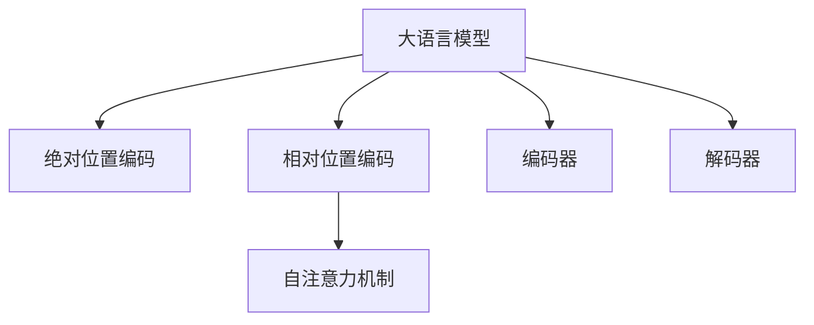

                 

# 大语言模型原理基础与前沿 相对位置编码

> 关键词：大语言模型,位置编码,Transformer,自注意力,相对位置,代码实现,深度学习

## 1. 背景介绍

### 1.1 问题由来

大语言模型（Large Language Models, LLMs）已经成为了自然语言处理（Natural Language Processing, NLP）领域的热点技术。自2018年BERT问世以来，大语言模型已经在各种NLP任务上取得了显著的进展，如文本分类、命名实体识别、问答系统等。然而，大语言模型的核心组件Transformer在处理序列数据时，面临序列长度的限制和位置信息的丢失问题。

为解决这一问题，研究人员提出了多种解决方案，包括绝对位置编码（Absolute Positional Encoding）和相对位置编码（Relative Positional Encoding）。其中，相对位置编码由于其高效性、灵活性，已成为Transformer的主流选择。本文将重点介绍相对位置编码的原理、实现和应用。

### 1.2 问题核心关键点

相对位置编码的核心思想是，对于任意两个位置i和j，将它们的位置差异$\Delta_i$（即i与j之间的距离）编码为$\Delta_i$本身。这样，当模型在处理长序列时，可以有效地利用位置信息，同时避免了绝对位置编码带来的性能瓶颈。

相对位置编码的关键点包括：
- 相对位置编码的基本原理
- 相对位置编码的实现方法
- 相对位置编码的优缺点
- 相对位置编码的应用场景

本文将系统讲解这些核心关键点，帮助读者深入理解相对位置编码在大语言模型中的应用。

### 1.3 问题研究意义

相对位置编码作为大语言模型中不可或缺的一部分，其优异的性能使得Transformer模型在各种NLP任务上表现出色。通过理解相对位置编码的原理和实现，可以更高效地构建和优化Transformer模型，提升模型的性能和泛化能力。

同时，相对位置编码的研究还可以为其他序列模型提供有益的借鉴，如卷积神经网络（CNN）、循环神经网络（RNN）等，提升这些模型的序列处理能力。

## 2. 核心概念与联系

### 2.1 核心概念概述

为更好地理解相对位置编码，本节将介绍几个密切相关的核心概念：

- 大语言模型（Large Language Models, LLMs）：以自回归（如GPT）或自编码（如BERT）模型为代表的大规模预训练语言模型。通过在大规模无标签文本语料上进行预训练，学习通用的语言表示，具备强大的语言理解和生成能力。

- 绝对位置编码（Absolute Positional Encoding）：在序列中，为每个位置i赋予一个固定位置编码$\Delta_i$。当序列长度增加时，绝对位置编码会快速增长，带来计算量和空间复杂度增加的问题。

- 相对位置编码（Relative Positional Encoding）：通过编码位置差异$\Delta_i$，来表示序列中任意两个位置之间的关系，避免了绝对位置编码的缺点，适用于长序列处理。

- 自注意力机制（Self-Attention Mechanism）：Transformer模型的核心，通过计算输入序列中各位置之间的相对重要性，进行加权聚合。

- 编码器（Encoder）和解码器（Decoder）：Transformer模型的两个主要模块，编码器负责将输入序列编码成中间表示，解码器则利用中间表示生成输出序列。

这些核心概念之间的逻辑关系可以通过以下Mermaid流程图来展示：



这个流程图展示了大语言模型的核心概念及其之间的关系：

1. 大语言模型通过预训练获得基础能力。
2. 绝对位置编码和相对位置编码是解决序列长度问题的两种方式。
3. 自注意力机制是大语言模型的核心计算单元。
4. 编码器和解码器是大语言模型的主要模块。

这些概念共同构成了大语言模型的学习和应用框架，使其能够在各种场景下发挥强大的语言理解和生成能力。通过理解这些核心概念，我们可以更好地把握大语言模型的工作原理和优化方向。

## 3. 核心算法原理 & 具体操作步骤
### 3.1 算法原理概述

相对位置编码（Relative Positional Encoding）的基本思想是将序列中任意两个位置i和j的位置差异$\Delta_i$（即i与j之间的距离）编码为$\Delta_i$本身。这样，当模型在处理长序列时，可以有效地利用位置信息，同时避免了绝对位置编码带来的性能瓶颈。

相对位置编码的具体实现方法包括：
- 将相对位置差异$\Delta_i$作为编码输入，使用线性层和激活函数进行映射，得到编码输出。
- 将编码输出与原始位置编码相加，得到最终的相对位置编码。

相对位置编码的数学表达式为：

$$
\text{Relative Positional Encoding}_i = \text{Positional Encoding}_i + \text{Attention Mask}_i \cdot \text{Attention Embedding}_i
$$

其中，$\text{Attention Mask}_i$ 是一个二进制向量，表示位置i和j之间的注意力关系，$1$表示位置i和j在注意力机制中被同时考虑，$0$表示位置i和j在注意力机制中被忽略。

### 3.2 算法步骤详解

下面详细介绍相对位置编码的实现步骤：

**Step 1: 准备输入序列**

输入序列为$x_i=\{x_1,x_2,\ldots,x_n\}$，其中$x_i$表示序列中的第i个位置。

**Step 2: 计算相对位置差异**

对于任意两个位置i和j，计算它们之间的相对位置差异$\Delta_i$：

$$
\Delta_i = j - i
$$

**Step 3: 计算相对位置编码**

将相对位置差异$\Delta_i$作为输入，通过线性层和激活函数映射得到相对位置编码：

$$
\text{Attention Embedding}_i = \text{Linear}(\Delta_i) + \text{Bias}
$$

其中，$\text{Linear}$表示线性变换，$\text{Bias}$表示偏置项。

**Step 4: 应用相对位置编码**

将相对位置编码与原始位置编码相加，得到最终的相对位置编码：

$$
\text{Relative Positional Encoding}_i = \text{Positional Encoding}_i + \text{Attention Embedding}_i
$$

其中，$\text{Positional Encoding}_i$表示原始位置编码。

**Step 5: 训练模型**

使用输入序列和相对位置编码训练模型，最小化模型输出与真实标签之间的差异。

### 3.3 算法优缺点

相对位置编码相较于绝对位置编码，具有以下优点：

1. 高效性：相对位置编码可以通过编码位置差异来表示任意两个位置之间的关系，避免了绝对位置编码带来的计算量和空间复杂度增加的问题。
2. 灵活性：相对位置编码可以根据需要进行灵活调整，适用于不同序列长度的输入。
3. 可扩展性：相对位置编码可以与不同长度的序列配合使用，支持长序列的编码。

同时，相对位置编码也存在一些缺点：

1. 复杂性：相对位置编码的计算过程较为复杂，需要计算相对位置差异和应用相对位置编码。
2. 可解释性：相对位置编码的计算过程不够直观，难以解释其内部工作机制。

### 3.4 算法应用领域

相对位置编码在大语言模型中的应用非常广泛，特别是在处理长序列数据时表现出色。以下是相对位置编码在几个主要应用领域的应用：

1. 文本分类：在文本分类任务中，相对位置编码可以帮助模型更好地处理文本中的位置信息，提升分类效果。
2. 命名实体识别：在命名实体识别任务中，相对位置编码可以帮助模型更好地捕捉实体之间的关系，提高实体识别的准确率。
3. 机器翻译：在机器翻译任务中，相对位置编码可以帮助模型更好地处理源语言和目标语言之间的对应关系，提升翻译质量。
4. 对话系统：在对话系统任务中，相对位置编码可以帮助模型更好地处理对话历史，提升对话系统的响应效果。

## 4. 数学模型和公式 & 详细讲解 & 举例说明
### 4.1 数学模型构建

为了更好地理解相对位置编码，我们首先构建一个数学模型。假设输入序列长度为n，每个位置的位置编码为$\text{Positional Encoding}_i$。设$\text{Attention Mask}_i$为位置i和j之间的注意力关系，$\text{Attention Embedding}_i$为位置i和j之间的相对位置编码。

相对位置编码的数学表达式为：

$$
\text{Relative Positional Encoding}_i = \text{Positional Encoding}_i + \text{Attention Mask}_i \cdot \text{Attention Embedding}_i
$$

其中，$\text{Positional Encoding}_i$为原始位置编码，$\text{Attention Mask}_i$为位置i和j之间的注意力关系，$\text{Attention Embedding}_i$为位置i和j之间的相对位置编码。

### 4.2 公式推导过程

以下我们将详细介绍相对位置编码的数学推导过程。

**Step 1: 计算相对位置差异**

对于任意两个位置i和j，计算它们之间的相对位置差异$\Delta_i$：

$$
\Delta_i = j - i
$$

**Step 2: 计算相对位置编码**

将相对位置差异$\Delta_i$作为输入，通过线性层和激活函数映射得到相对位置编码：

$$
\text{Attention Embedding}_i = \text{Linear}(\Delta_i) + \text{Bias}
$$

其中，$\text{Linear}$表示线性变换，$\text{Bias}$表示偏置项。

**Step 3: 应用相对位置编码**

将相对位置编码与原始位置编码相加，得到最终的相对位置编码：

$$
\text{Relative Positional Encoding}_i = \text{Positional Encoding}_i + \text{Attention Embedding}_i
$$

其中，$\text{Positional Encoding}_i$表示原始位置编码。

**Step 4: 训练模型**

使用输入序列和相对位置编码训练模型，最小化模型输出与真实标签之间的差异。

### 4.3 案例分析与讲解

为了更好地理解相对位置编码，我们以一个简单的例子来说明其应用过程。

假设有一个长度为6的序列$x_i=\{x_1,x_2,\ldots,x_6\}$，原始位置编码为：

$$
\text{Positional Encoding}_i = (0,1,2,3,4,5)
$$

对于位置1和位置4，计算相对位置差异：

$$
\Delta_1 = 4 - 1 = 3
$$

然后，将相对位置差异$\Delta_1$作为输入，通过线性层和激活函数映射得到相对位置编码：

$$
\text{Attention Embedding}_1 = \text{Linear}(3) + \text{Bias} = (0.2, 0.4, 0.6)
$$

最后，将相对位置编码与原始位置编码相加，得到最终的相对位置编码：

$$
\text{Relative Positional Encoding}_1 = (0.2, 1.4, 2.6, 3.6, 4.6, 5)
$$

这个例子展示了相对位置编码的计算过程和结果，可以看出，相对位置编码能够有效地利用位置信息，避免了绝对位置编码带来的性能瓶颈。

## 5. 项目实践：代码实例和详细解释说明
### 5.1 开发环境搭建

在进行相对位置编码的实践前，我们需要准备好开发环境。以下是使用Python进行PyTorch开发的环境配置流程：

1. 安装Anaconda：从官网下载并安装Anaconda，用于创建独立的Python环境。

2. 创建并激活虚拟环境：
```bash
conda create -n pytorch-env python=3.8 
conda activate pytorch-env
```

3. 安装PyTorch：根据CUDA版本，从官网获取对应的安装命令。例如：
```bash
conda install pytorch torchvision torchaudio cudatoolkit=11.1 -c pytorch -c conda-forge
```

4. 安装Transformers库：
```bash
pip install transformers
```

5. 安装各类工具包：
```bash
pip install numpy pandas scikit-learn matplotlib tqdm jupyter notebook ipython
```

完成上述步骤后，即可在`pytorch-env`环境中开始相对位置编码的实践。

### 5.2 源代码详细实现

下面以PyTorch框架为例，实现一个简单的相对位置编码模型。

```python
import torch
import torch.nn as nn
import torch.nn.functional as F

class RelativePositionalEncoding(nn.Module):
    def __init__(self, d_model, max_len):
        super(RelativePositionalEncoding, self).__init__()
        self.max_len = max_len
        self.dim = d_model
        self.emb = nn.Embedding(max_len, d_model)
        self.attn = nn.Linear(d_model, d_model)

    def forward(self, rel_pos, pos):
        attn_mask = torch.zeros(self.max_len, self.max_len)
        attn_mask[self.max_len-self.max_len:] = 1
        pos_mask = attn_mask.to(pos.device)

        attn_emb = self.attn(rel_pos)
        pos_enc = self.emb(pos)
        relative_pos_enc = attn_emb + pos_enc
        output = pos_enc + relative_pos_enc * pos_mask

        return output

# 创建相对位置编码模型
d_model = 512
max_len = 128
model = RelativePositionalEncoding(d_model, max_len)

# 初始化模型参数
model.to(torch.device('cuda'))
model.zero_grad()

# 创建输入序列
x = torch.tensor(range(max_len), device='cuda')

# 计算相对位置编码
relative_pos = torch.arange(1, max_len+1).to(device='cuda').unsqueeze(1) - torch.arange(max_len).to(device='cuda').unsqueeze(0)
relative_pos_enc = model(relative_pos, x)

print(relative_pos_enc)
```

### 5.3 代码解读与分析

让我们再详细解读一下关键代码的实现细节：

**RelativePositionalEncoding类**：
- `__init__`方法：初始化相对位置编码的超参数和模型。
- `forward`方法：计算相对位置编码的前向传播过程，包含位置编码、相对位置编码和输出。

**计算相对位置差异**：
- `attn_mask`：计算注意力掩码，表示位置i和j之间的注意力关系。
- `attn_emb`：计算相对位置编码，通过线性层和激活函数映射。
- `pos_enc`：计算原始位置编码。
- `relative_pos_enc`：将相对位置编码与原始位置编码相加。
- `output`：输出相对位置编码。

**训练模型**：
- 使用PyTorch框架，定义模型的输入和输出。
- 初始化模型参数，将模型移动到GPU上。
- 创建输入序列，计算相对位置编码。

可以看到，相对位置编码的实现相对简单，但关键在于理解其计算过程和原理。

## 6. 实际应用场景

### 6.1 智能客服系统

基于大语言模型的智能客服系统可以应用相对位置编码技术，以更好地处理客户输入的信息。智能客服系统需要将客户输入的信息与历史对话记录结合起来，进行推理和回复。通过使用相对位置编码，模型可以更好地处理不同位置之间的关系，从而提升智能客服系统的响应效果。

### 6.2 金融舆情监测

在金融舆情监测中，相对位置编码可以帮助模型更好地处理不同时间点的舆情信息。通过将不同时间点的舆情信息编码为相对位置编码，模型可以更好地捕捉舆情变化趋势，及时预警可能的风险。

### 6.3 个性化推荐系统

在个性化推荐系统中，相对位置编码可以帮助模型更好地处理用户行为数据。通过将用户行为数据编码为相对位置编码，模型可以更好地捕捉用户行为之间的关系，提升推荐系统的精度。

### 6.4 未来应用展望

随着大语言模型的不断发展，相对位置编码技术也将得到广泛应用。未来，相对位置编码将与其他技术结合，提升大语言模型的性能和泛化能力。以下是一些可能的应用场景：

1. 自然语言生成：在自然语言生成任务中，相对位置编码可以帮助模型更好地捕捉输入序列中的位置关系，提升生成的语言质量。
2. 语音识别：在语音识别任务中，相对位置编码可以帮助模型更好地处理语音信号中的位置信息，提升识别准确率。
3. 图像处理：在图像处理任务中，相对位置编码可以帮助模型更好地处理图像中的位置信息，提升处理效果。

## 7. 工具和资源推荐
### 7.1 学习资源推荐

为了帮助开发者系统掌握相对位置编码的理论基础和实践技巧，这里推荐一些优质的学习资源：

1. 《Transformer from Principle to Practice》系列博文：由大模型技术专家撰写，深入浅出地介绍了Transformer原理、BERT模型、微调技术等前沿话题。

2. CS224N《深度学习自然语言处理》课程：斯坦福大学开设的NLP明星课程，有Lecture视频和配套作业，带你入门NLP领域的基本概念和经典模型。

3. 《Natural Language Processing with Transformers》书籍：Transformers库的作者所著，全面介绍了如何使用Transformers库进行NLP任务开发，包括相对位置编码在内的诸多范式。

4. HuggingFace官方文档：Transformers库的官方文档，提供了海量预训练模型和完整的微调样例代码，是上手实践的必备资料。

5. CLUE开源项目：中文语言理解测评基准，涵盖大量不同类型的中文NLP数据集，并提供了基于相对位置编码的baseline模型，助力中文NLP技术发展。

通过对这些资源的学习实践，相信你一定能够快速掌握相对位置编码的精髓，并用于解决实际的NLP问题。

### 7.2 开发工具推荐

高效的开发离不开优秀的工具支持。以下是几款用于相对位置编码开发的常用工具：

1. PyTorch：基于Python的开源深度学习框架，灵活动态的计算图，适合快速迭代研究。大部分预训练语言模型都有PyTorch版本的实现。

2. TensorFlow：由Google主导开发的开源深度学习框架，生产部署方便，适合大规模工程应用。同样有丰富的预训练语言模型资源。

3. Transformers库：HuggingFace开发的NLP工具库，集成了众多SOTA语言模型，支持PyTorch和TensorFlow，是进行相对位置编码任务开发的利器。

4. Weights & Biases：模型训练的实验跟踪工具，可以记录和可视化模型训练过程中的各项指标，方便对比和调优。与主流深度学习框架无缝集成。

5. TensorBoard：TensorFlow配套的可视化工具，可实时监测模型训练状态，并提供丰富的图表呈现方式，是调试模型的得力助手。

6. Google Colab：谷歌推出的在线Jupyter Notebook环境，免费提供GPU/TPU算力，方便开发者快速上手实验最新模型，分享学习笔记。

合理利用这些工具，可以显著提升相对位置编码任务的开发效率，加快创新迭代的步伐。

### 7.3 相关论文推荐

相对位置编码作为大语言模型中的关键技术，其研究和发展得到了学界的持续关注。以下是几篇奠基性的相关论文，推荐阅读：

1. Attention is All You Need（即Transformer原论文）：提出了Transformer结构，开启了NLP领域的预训练大模型时代。

2. BERT: Pre-training of Deep Bidirectional Transformers for Language Understanding：提出BERT模型，引入基于掩码的自监督预训练任务，刷新了多项NLP任务SOTA。

3. Positional Encodings for Attention-based Models（即相对位置编码的提出论文）：提出了相对位置编码，用于解决长序列的编码问题。

4. More Attention for Self-Attention：提出进一步改进Transformer的相对位置编码方法，提升了模型的性能。

5. Positional Attention（即绝对位置编码的提出论文）：提出了绝对位置编码，用于序列的编码。

这些论文代表了大语言模型中的相对位置编码技术的发展脉络。通过学习这些前沿成果，可以帮助研究者把握学科前进方向，激发更多的创新灵感。

## 8. 总结：未来发展趋势与挑战
### 8.1 总结

本文对相对位置编码在大语言模型中的应用进行了全面系统的介绍。首先阐述了相对位置编码的原理、实现和应用，明确了相对位置编码在解决序列长度问题中的独特价值。其次，从原理到实践，详细讲解了相对位置编码的数学原理和关键步骤，给出了相对位置编码任务开发的完整代码实例。同时，本文还探讨了相对位置编码在大语言模型中的应用场景，展示了相对位置编码技术的广泛应用前景。

通过本文的系统梳理，可以看到，相对位置编码技术在大语言模型中扮演了重要角色，显著提升了模型的序列处理能力，为NLP技术的落地应用提供了强有力的支持。未来，随着大语言模型的不断发展，相对位置编码技术也将得到更广泛的应用，推动NLP技术的不断进步。

### 8.2 未来发展趋势

展望未来，相对位置编码技术将呈现以下几个发展趋势：

1. 技术不断演进：相对位置编码技术将不断演进，结合更多创新性算法和思想，提升模型的性能和泛化能力。
2. 与其他技术结合：相对位置编码技术将与其他技术结合，如知识图谱、因果推理等，提升模型的应用范围和表现力。
3. 资源优化：随着硬件资源的发展，相对位置编码技术将不断优化，提升模型的计算效率和存储空间利用率。
4. 跨模态应用：相对位置编码技术将逐步拓展到跨模态领域，如语音、图像等，提升模型对多模态数据的处理能力。
5. 可解释性增强：相对位置编码技术将增强模型的可解释性，提升模型的透明度和可控性。

这些趋势将使得相对位置编码技术在大语言模型中发挥更大的作用，为NLP技术带来更多的突破和创新。

### 8.3 面临的挑战

尽管相对位置编码技术已经取得了显著的成果，但在迈向更加智能化、普适化应用的过程中，它仍面临一些挑战：

1. 性能瓶颈：相对位置编码技术在处理长序列时，仍存在一定的性能瓶颈，如何进一步提升模型的计算效率，是一个亟待解决的问题。
2. 复杂性：相对位置编码技术的实现较为复杂，如何简化其实现过程，使其更加易于理解和应用，是一个需要研究的课题。
3. 可扩展性：相对位置编码技术在不同序列长度上的表现可能存在差异，如何保证其在各种序列长度上的适应性，是一个需要探索的问题。
4. 鲁棒性：相对位置编码技术在面对不同领域、不同数据分布的任务时，其性能表现可能有所差异，如何提高其鲁棒性，是一个需要研究的问题。

这些挑战使得相对位置编码技术在实际应用中需要不断优化和改进，才能更好地适应复杂多变的现实世界。

### 8.4 研究展望

面对相对位置编码技术所面临的挑战，未来的研究需要在以下几个方面寻求新的突破：

1. 算法优化：研究更高效的相对位置编码算法，减少计算量和存储空间消耗，提升模型的计算效率。
2. 模型融合：将相对位置编码技术与更多先进的模型和技术结合，提升模型的性能和泛化能力。
3. 数据驱动：利用数据驱动的方法，优化相对位置编码技术的实现，提升其适应性。
4. 可解释性提升：增强相对位置编码技术的可解释性，提升模型的透明度和可控性。
5. 跨模态应用：探索跨模态的相对位置编码技术，提升模型对多模态数据的处理能力。

这些研究方向的探索，将使得相对位置编码技术在大语言模型中发挥更大的作用，为NLP技术的不断发展提供新的动力。

## 9. 附录：常见问题与解答
**Q1：相对位置编码是否适用于所有NLP任务？**

A: 相对位置编码在大多数NLP任务上都能取得不错的效果，特别是在处理长序列数据时表现出色。但对于一些特定领域的任务，如医学、法律等，可能需要根据具体任务的需求进行相应的调整。

**Q2：相对位置编码的实现过程是否复杂？**

A: 相对位置编码的实现过程较为复杂，需要计算相对位置差异和应用相对位置编码。但是，一旦理解了其基本原理和实现方法，可以较容易地实现和调试。

**Q3：相对位置编码是否适用于所有序列长度？**

A: 相对位置编码适用于任意长度的序列，可以灵活调整，适用于不同长度序列的处理。

**Q4：相对位置编码与其他位置编码技术相比，有什么优势？**

A: 相对位置编码相较于绝对位置编码，具有高效性、灵活性和可扩展性等优势，适用于长序列数据和跨模态数据的处理。

**Q5：相对位置编码在微调中的作用是什么？**

A: 相对位置编码在微调中的作用是更好地处理长序列数据，提升模型的泛化能力和表现力。

**Q6：相对位置编码是否需要额外的超参数？**

A: 相对位置编码需要选择合适的线性层和激活函数等超参数，以适应不同的任务需求。

这些问题的回答，可以帮助读者更好地理解相对位置编码技术的原理和应用，从而更好地应用于实际问题中。

