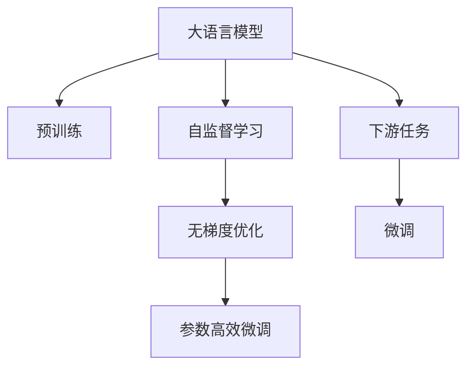

                 

# 大语言模型应用指南：无梯度优化

> 关键词：大语言模型,无梯度优化,参数高效微调,自然语言处理(NLP),Transformer,BERT,预训练,下游任务,自监督学习

## 1. 背景介绍

### 1.1 问题由来
近年来，深度学习技术在自然语言处理(NLP)领域取得了巨大的突破。然而，大规模语言模型(LLMs)的训练和优化过程，通常需要依赖梯度下降等基于梯度的优化方法，导致训练复杂度较高，计算资源消耗大。此外，梯度消失、梯度爆炸等问题，也使得优化过程存在不稳定风险。

为解决这些问题，研究者们提出了许多创新的优化方法，其中无梯度优化(Non-Gradient Optimization)技术尤为引人注目。无梯度优化方法通过减少或消除参数的梯度计算，使得模型训练更加高效，降低计算复杂度，同时也提升了模型训练的稳定性。

### 1.2 问题核心关键点
无梯度优化技术的核心思想是通过自监督学习任务，直接对模型进行参数更新，绕开传统的梯度优化过程。其关键点包括：
- 选择合适的自监督任务：如语言模型预测、掩码预测等，使得模型能够学习到丰富的语言知识。
- 设计高效的自监督任务：如QKV预训练、LoRA、AdaLoRA等，提升模型参数利用效率，降低计算复杂度。
- 结合微调方法：在大模型基础上，通过微调方法适配下游任务，如参数高效微调(PEFT)、Prompt Learning等，进一步提升模型性能。

### 1.3 问题研究意义
研究无梯度优化方法，对于提升大语言模型的训练效率和泛化性能，降低计算成本，具有重要意义：

1. 降低计算复杂度：无梯度优化方法可以减少甚至消除梯度计算，大幅降低训练过程中的计算复杂度，使得模型训练更加高效。
2. 提高模型稳定性：基于梯度的优化方法易受到梯度消失或爆炸的影响，而无梯度优化方法直接基于数据进行更新，避免了此类问题。
3. 提升泛化性能：自监督任务能够使模型学习到广泛的语言知识，提升了模型在未知数据上的泛化能力。
4. 减少数据需求：通过自监督任务预训练，可以部分或完全替代监督数据的微调过程，减少标注数据的需求。
5. 加速模型迭代：无梯度优化方法通常训练速度较快，可以更快速地迭代优化模型参数，提升训练效率。

## 2. 核心概念与联系

### 2.1 核心概念概述

为更好地理解无梯度优化技术，本节将介绍几个关键概念及其联系：

- 大语言模型(Large Language Model, LLM)：如GPT、BERT等，通过大规模无标签语料预训练，学习通用的语言表示。
- 预训练(Pre-training)：指在大规模无标签数据上进行自监督学习，学习通用语言表示的任务。
- 自监督学习(Self-Supervised Learning)：指利用未标注数据，通过构造假想任务进行模型训练的方法。
- 参数高效微调(Parameter-Efficient Fine-Tuning, PEFT)：只调整少量模型参数，以提高微调效率和泛化能力。
- 无梯度优化(Non-Gradient Optimization)：通过自监督任务直接更新模型参数，绕开传统梯度优化过程。

这些核心概念之间的逻辑关系可以通过以下Mermaid流程图来展示：



该流程图展示了核心概念之间的联系：

1. 大语言模型通过预训练学习通用语言表示。
2. 通过自监督学习任务在未标注数据上进行预训练。
3. 无梯度优化方法直接基于数据进行参数更新。
4. 参数高效微调提升模型在特定任务上的性能。
5. 微调使得模型更适应特定任务，提升模型效果。

这些概念共同构成了无梯度优化技术的学习框架，使其在大语言模型微调中发挥重要作用。

## 3. 核心算法原理 & 具体操作步骤

### 3.1 算法原理概述

无梯度优化方法通过直接利用自监督任务，对模型参数进行更新，从而避免梯度计算，降低训练复杂度，提高训练效率和模型稳定性。其核心思想是：将预训练模型视为"特征提取器"，利用自监督任务作为"监督信号"，直接更新模型参数，使之适应下游任务。

无梯度优化通常包括以下几个关键步骤：
1. 准备预训练模型和数据集。
2. 选择自监督学习任务。
3. 设计任务适配层。
4. 设置微调超参数。
5. 执行自监督训练。
6. 执行微调。

### 3.2 算法步骤详解

以下将详细介绍无梯度优化方法的核心步骤：

**Step 1: 准备预训练模型和数据集**
- 选择合适的预训练语言模型 $M_{\theta}$，如GPT-2、BERT等。
- 准备下游任务 $T$ 的未标注数据集 $D$，划分为训练集、验证集和测试集。

**Step 2: 选择自监督任务**
- 根据任务类型，选择合适的自监督学习任务。常见的任务包括：
  - 语言模型预测：如掩码语言模型、文本生成、摘要生成等。
  - 掩码预测：如掩码语言模型、文本填空、信息检索等。
  - 特征学习：如QKV预训练、位置编码、嵌入相似性学习等。
- 设计自监督任务的预训练目标函数 $L_{pretrain}$。

**Step 3: 设计任务适配层**
- 根据任务类型，在预训练模型顶层设计合适的输出层和损失函数。
- 对于分类任务，通常在顶层添加线性分类器和交叉熵损失函数。
- 对于生成任务，通常使用语言模型的解码器输出概率分布，并以负对数似然为损失函数。

**Step 4: 设置微调超参数**
- 选择合适的优化算法及其参数，如Adam、SGD等，设置学习率、批大小、迭代轮数等。
- 设置正则化技术及强度，包括权重衰减、Dropout、Early Stopping等。
- 确定冻结预训练参数的策略，如仅微调顶层，或全部参数都参与微调。

**Step 5: 执行自监督训练**
- 将训练集数据分批次输入模型，前向传播计算自监督任务的目标函数。
- 反向传播计算参数梯度，根据设定的优化算法和学习率更新模型参数。
- 周期性在验证集上评估模型性能，根据性能指标决定是否触发 Early Stopping。
- 重复上述步骤直至满足预设的迭代轮数或 Early Stopping 条件。

**Step 6: 执行微调**
- 将微调任务的标注数据集 $D_{task}$ 划分为训练集、验证集和测试集。
- 在预训练模型的基础上，设计下游任务的适配层和损失函数。
- 设置微调超参数，执行微调过程，更新模型参数。
- 在验证集上评估模型性能，调整超参数，直至模型达到预期效果。

**Step 7: 测试和部署**
- 在测试集上评估微调后模型 $M_{\hat{\theta}}$ 的性能，对比微调前后的精度提升。
- 使用微调后的模型对新样本进行推理预测，集成到实际的应用系统中。
- 持续收集新的数据，定期重新微调模型，以适应数据分布的变化。

### 3.3 算法优缺点

无梯度优化方法具有以下优点：
1. 高效性：直接基于自监督任务更新参数，避免了梯度计算和梯度优化的复杂度。
2. 稳定性：避免了梯度消失或爆炸的风险，提升模型训练的稳定性。
3. 泛化能力：自监督任务能够使模型学习到丰富的语言知识，提升模型泛化性能。
4. 数据需求：部分或完全利用自监督任务进行预训练，减少标注数据的需求。
5. 灵活性：选择不同的自监督任务，可以在不改变模型架构的情况下，提升模型性能。

同时，该方法也存在一些局限性：
1. 自监督任务设计复杂：自监督任务设计需要考虑任务的合理性、泛化能力等，设计不当可能导致模型性能下降。
2. 模型复杂度增加：自监督任务可能需要增加模型的复杂度，引入新的层和参数。
3. 超参数调优难度大：无梯度优化方法需要设置较多的超参数，调优难度较大。
4. 效果依赖于数据：自监督任务的效果依赖于数据的多样性和质量，数据不足可能导致性能下降。

尽管存在这些局限性，但无梯度优化方法在大语言模型的微调中仍展现出了显著的潜力，未来有望成为NLP微调的主流范式之一。

### 3.4 算法应用领域

无梯度优化方法已经在NLP领域得到了广泛应用，具体包括以下几个方向：

- 文本生成：如文本摘要、对话生成等任务，通过掩码预测、QKV预训练等方法，提升生成文本的质量和多样性。
- 信息检索：如问答系统、知识图谱等任务，通过特征学习、掩码预测等方法，提升检索结果的相关性和准确性。
- 序列标注：如命名实体识别、情感分析等任务，通过掩码预测、位置编码等方法，提升标注的准确性和鲁棒性。
- 机器翻译：通过掩码预测、生成对抗网络(GAN)等方法，提升翻译的流畅度和准确性。
- 语言理解：如自然语言推理、文本分类等任务，通过掩码预测、文本生成等方法，提升模型的理解和推理能力。

以上方向展示了无梯度优化方法在NLP领域的广泛应用，未来还将拓展到更多场景中，为NLP技术的发展带来新的突破。

## 4. 数学模型和公式 & 详细讲解  
### 4.1 数学模型构建

在本节中，我们将通过数学语言，对无梯度优化方法进行严格刻画。

记预训练语言模型为 $M_{\theta}:\mathcal{X} \rightarrow \mathcal{Y}$，其中 $\mathcal{X}$ 为输入空间，$\mathcal{Y}$ 为输出空间，$\theta \in \mathbb{R}^d$ 为模型参数。假设微调任务的训练集为 $D=\{(x_i,y_i)\}_{i=1}^N, x_i \in \mathcal{X}, y_i \in \mathcal{Y}$。

定义模型 $M_{\theta}$ 在输入 $x$ 上的自监督任务的目标函数为 $L_{pretrain}(M_{\theta}(x))$，则在数据集 $D$ 上的经验风险为：

$$
\mathcal{L}_{pretrain}(\theta) = \frac{1}{N} \sum_{i=1}^N L_{pretrain}(M_{\theta}(x_i))
$$

无梯度优化方法的优化目标是最小化经验风险，即找到最优参数：

$$
\theta^* = \mathop{\arg\min}_{\theta} \mathcal{L}_{pretrain}(\theta)
$$

在实践中，我们通常使用基于梯度的优化算法（如Adam、SGD等）来近似求解上述最优化问题。设 $\eta$ 为学习率，$\lambda$ 为正则化系数，则参数的更新公式为：

$$
\theta \leftarrow \theta - \eta \nabla_{\theta}\mathcal{L}_{pretrain}(\theta) - \eta\lambda\theta
$$

其中 $\nabla_{\theta}\mathcal{L}_{pretrain}(\theta)$ 为自监督任务的目标函数对参数 $\theta$ 的梯度，可通过反向传播算法高效计算。

### 4.2 公式推导过程

以下我们以掩码语言模型为例，推导无梯度优化方法的数学公式。

假设模型 $M_{\theta}$ 在输入 $x$ 上的掩码预测任务为预测句子中缺失的单词。设 $M_{\theta}(x)$ 为模型输出，$M_{\theta}(x)[m]$ 表示将 $x$ 中的第 $m$ 个位置掩码后，模型对缺失位置的预测结果。

掩码预测任务的目标函数可以定义为：

$$
L_{mask}(M_{\theta}(x)) = -\sum_{m=1}^L \log(M_{\theta}(x)[m])
$$

其中 $L$ 为输入序列的长度。

通过自监督学习任务，掩码预测的目标函数可以表示为：

$$
\mathcal{L}_{pretrain}(\theta) = -\frac{1}{N} \sum_{i=1}^N \sum_{m=1}^L \log(M_{\theta}(x_i)[m])
$$

在优化过程中，可以采用随机梯度下降等方法更新模型参数，如：

$$
\theta \leftarrow \theta - \eta \nabla_{\theta}\mathcal{L}_{pretrain}(\theta) - \eta\lambda\theta
$$

其中 $\nabla_{\theta}\mathcal{L}_{pretrain}(\theta)$ 为随机梯度。

在优化过程中，可以根据模型性能，周期性在验证集上评估模型性能，根据性能指标决定是否触发 Early Stopping。重复上述步骤直至满足预设的迭代轮数或 Early Stopping 条件。

## 5. 项目实践：代码实例和详细解释说明
### 5.1 开发环境搭建

在进行无梯度优化实践前，我们需要准备好开发环境。以下是使用Python进行PyTorch开发的环境配置流程：

1. 安装Anaconda：从官网下载并安装Anaconda，用于创建独立的Python环境。

2. 创建并激活虚拟环境：
```bash
conda create -n pytorch-env python=3.8 
conda activate pytorch-env
```

3. 安装PyTorch：根据CUDA版本，从官网获取对应的安装命令。例如：
```bash
conda install pytorch torchvision torchaudio cudatoolkit=11.1 -c pytorch -c conda-forge
```

4. 安装Transformers库：
```bash
pip install transformers
```

5. 安装各类工具包：
```bash
pip install numpy pandas scikit-learn matplotlib tqdm jupyter notebook ipython
```

完成上述步骤后，即可在`pytorch-env`环境中开始无梯度优化实践。

### 5.2 源代码详细实现

下面我们以掩码语言模型为例，给出使用Transformers库进行无梯度优化的PyTorch代码实现。

首先，定义掩码语言模型：

```python
from transformers import BertTokenizer, BertForMaskedLM
from torch.utils.data import Dataset
import torch

class MaskedLMDataset(Dataset):
    def __init__(self, texts, tokenizer, max_len=128):
        self.texts = texts
        self.tokenizer = tokenizer
        self.max_len = max_len
        
    def __len__(self):
        return len(self.texts)
    
    def __getitem__(self, item):
        text = self.texts[item]
        
        encoding = self.tokenizer(text, return_tensors='pt', max_length=self.max_len, padding='max_length', truncation=True)
        input_ids = encoding['input_ids'][0]
        attention_mask = encoding['attention_mask'][0]
        mask_pos = torch.randint(0, input_ids.shape[-1], (input_ids.shape[0], 2), device='cuda').tolist()
        mask_pos[:, 0] = input_ids.shape[-1]
        mask_pos[:, 1] = input_ids.shape[-1] - 1
        input_ids[mask_pos] = 0
        labels = input_ids.clone()
        labels[mask_pos] = -100
        
        return {'input_ids': input_ids, 
                'attention_mask': attention_mask,
                'mask_pos': mask_pos,
                'labels': labels}

# 创建dataset
tokenizer = BertTokenizer.from_pretrained('bert-base-cased')

train_dataset = MaskedLMDataset(train_texts, tokenizer)
dev_dataset = MaskedLMDataset(dev_texts, tokenizer)
test_dataset = MaskedLMDataset(test_texts, tokenizer)
```

然后，定义模型和优化器：

```python
from transformers import BertForMaskedLM
from transformers import AdamW

model = BertForMaskedLM.from_pretrained('bert-base-cased')
optimizer = AdamW(model.parameters(), lr=2e-5)
```

接着，定义训练和评估函数：

```python
from torch.utils.data import DataLoader
from tqdm import tqdm
from sklearn.metrics import classification_report

device = torch.device('cuda') if torch.cuda.is_available() else torch.device('cpu')
model.to(device)

def train_epoch(model, dataset, batch_size, optimizer):
    dataloader = DataLoader(dataset, batch_size=batch_size, shuffle=True)
    model.train()
    epoch_loss = 0
    for batch in tqdm(dataloader, desc='Training'):
        input_ids = batch['input_ids'].to(device)
        attention_mask = batch['attention_mask'].to(device)
        mask_pos = batch['mask_pos'].to(device)
        labels = batch['labels'].to(device)
        model.zero_grad()
        outputs = model(input_ids, attention_mask=attention_mask, masked_lm_labels=labels)
        loss = outputs.loss
        epoch_loss += loss.item()
        loss.backward()
        optimizer.step()
    return epoch_loss / len(dataloader)

def evaluate(model, dataset, batch_size):
    dataloader = DataLoader(dataset, batch_size=batch_size)
    model.eval()
    preds, labels = [], []
    with torch.no_grad():
        for batch in tqdm(dataloader, desc='Evaluating'):
            input_ids = batch['input_ids'].to(device)
            attention_mask = batch['attention_mask'].to(device)
            mask_pos = batch['mask_pos'].to(device)
            labels = batch['labels']
            outputs = model(input_ids, attention_mask=attention_mask, masked_lm_labels=labels)
            pred_tokens = outputs.logits.argmax(dim=2).to('cpu').tolist()
            batch_labels = batch['labels'].to('cpu').tolist()
            for pred_tokens, label_tokens in zip(pred_tokens, batch_labels):
                pred_tags = [id2tag[_id] for _id in pred_tokens]
                label_tags = [id2tag[_id] for _id in label_tokens]
                preds.append(pred_tags[:len(label_tags)])
                labels.append(label_tags)
                
    print(classification_report(labels, preds))
```

最后，启动训练流程并在测试集上评估：

```python
epochs = 5
batch_size = 16

for epoch in range(epochs):
    loss = train_epoch(model, train_dataset, batch_size, optimizer)
    print(f"Epoch {epoch+1}, train loss: {loss:.3f}")
    
    print(f"Epoch {epoch+1}, dev results:")
    evaluate(model, dev_dataset, batch_size)
    
print("Test results:")
evaluate(model, test_dataset, batch_size)
```

以上就是使用PyTorch对BERT进行掩码语言模型预训练的完整代码实现。可以看到，得益于Transformers库的强大封装，我们可以用相对简洁的代码完成BERT模型的无梯度优化。

### 5.3 代码解读与分析

让我们再详细解读一下关键代码的实现细节：

**MaskedLMDataset类**：
- `__init__`方法：初始化文本、分词器等关键组件，并定义掩码位置。
- `__len__`方法：返回数据集的样本数量。
- `__getitem__`方法：对单个样本进行处理，将文本输入编码为token ids，并构建掩码位置，返回模型所需的输入。

**BertForMaskedLM模型**：
- 通过`BertForMaskedLM.from_pretrained('bert-base-cased')`加载预训练模型，用于掩码语言模型的预训练。

**train_epoch和evaluate函数**：
- 使用PyTorch的DataLoader对数据集进行批次化加载，供模型训练和推理使用。
- 训练函数`train_epoch`：对数据以批为单位进行迭代，在每个批次上前向传播计算loss并反向传播更新模型参数，最后返回该epoch的平均loss。
- 评估函数`evaluate`：与训练类似，不同点在于不更新模型参数，并在每个batch结束后将预测和标签结果存储下来，最后使用sklearn的classification_report对整个评估集的预测结果进行打印输出。

**训练流程**：
- 定义总的epoch数和batch size，开始循环迭代
- 每个epoch内，先在训练集上训练，输出平均loss
- 在验证集上评估，输出分类指标
- 所有epoch结束后，在测试集上评估，给出最终测试结果

可以看到，PyTorch配合Transformers库使得BERT模型的无梯度优化代码实现变得简洁高效。开发者可以将更多精力放在数据处理、模型改进等高层逻辑上，而不必过多关注底层的实现细节。

当然，工业级的系统实现还需考虑更多因素，如模型的保存和部署、超参数的自动搜索、更灵活的任务适配层等。但核心的无梯度优化范式基本与此类似。

## 6. 实际应用场景
### 6.1 智能客服系统

基于无梯度优化的对话技术，可以广泛应用于智能客服系统的构建。传统客服往往需要配备大量人力，高峰期响应缓慢，且一致性和专业性难以保证。而使用无梯度优化的对话模型，可以7x24小时不间断服务，快速响应客户咨询，用自然流畅的语言解答各类常见问题。

在技术实现上，可以收集企业内部的历史客服对话记录，将问题和最佳答复构建成监督数据，在此基础上对预训练对话模型进行微调。无梯度优化的对话模型能够自动理解用户意图，匹配最合适的答案模板进行回复。对于客户提出的新问题，还可以接入检索系统实时搜索相关内容，动态组织生成回答。如此构建的智能客服系统，能大幅提升客户咨询体验和问题解决效率。

### 6.2 金融舆情监测

金融机构需要实时监测市场舆论动向，以便及时应对负面信息传播，规避金融风险。传统的人工监测方式成本高、效率低，难以应对网络时代海量信息爆发的挑战。基于无梯度优化的文本分类和情感分析技术，为金融舆情监测提供了新的解决方案。

具体而言，可以收集金融领域相关的新闻、报道、评论等文本数据，并对其进行主题标注和情感标注。在此基础上对预训练语言模型进行无梯度优化，使其能够自动判断文本属于何种主题，情感倾向是正面、中性还是负面。将无梯度优化的模型应用到实时抓取的网络文本数据，就能够自动监测不同主题下的情感变化趋势，一旦发现负面信息激增等异常情况，系统便会自动预警，帮助金融机构快速应对潜在风险。

### 6.3 个性化推荐系统

当前的推荐系统往往只依赖用户的历史行为数据进行物品推荐，无法深入理解用户的真实兴趣偏好。基于无梯度优化的个性化推荐系统可以更好地挖掘用户行为背后的语义信息，从而提供更精准、多样的推荐内容。

在实践中，可以收集用户浏览、点击、评论、分享等行为数据，提取和用户交互的物品标题、描述、标签等文本内容。将文本内容作为模型输入，用户的后续行为（如是否点击、购买等）作为监督信号，在此基础上无梯度优化预训练语言模型。无梯度优化的模型能够从文本内容中准确把握用户的兴趣点。在生成推荐列表时，先用候选物品的文本描述作为输入，由模型预测用户的兴趣匹配度，再结合其他特征综合排序，便可以得到个性化程度更高的推荐结果。

### 6.4 未来应用展望

随着无梯度优化方法的不断发展，基于无梯度优化的微调方法将在大语言模型的应用中发挥越来越重要的作用。

在智慧医疗领域，基于无梯度优化的医疗问答、病历分析、药物研发等应用将提升医疗服务的智能化水平，辅助医生诊疗，加速新药开发进程。

在智能教育领域，无梯度优化的技术可应用于作业批改、学情分析、知识推荐等方面，因材施教，促进教育公平，提高教学质量。

在智慧城市治理中，无梯度优化的模型可应用于城市事件监测、舆情分析、应急指挥等环节，提高城市管理的自动化和智能化水平，构建更安全、高效的未来城市。

此外，在企业生产、社会治理、文娱传媒等众多领域，无梯度优化的模型也将不断涌现，为NLP技术带来新的突破。相信随着技术的日益成熟，无梯度优化方法必将成为人工智能落地应用的重要范式，推动人工智能技术向更广阔的领域加速渗透。

## 7. 工具和资源推荐
### 7.1 学习资源推荐

为了帮助开发者系统掌握无梯度优化理论基础和实践技巧，这里推荐一些优质的学习资源：

1. 《Transformer从原理到实践》系列博文：由大模型技术专家撰写，深入浅出地介绍了Transformer原理、BERT模型、无梯度优化等前沿话题。

2. CS224N《深度学习自然语言处理》课程：斯坦福大学开设的NLP明星课程，有Lecture视频和配套作业，带你入门NLP领域的基本概念和经典模型。

3. 《Natural Language Processing with Transformers》书籍：Transformers库的作者所著，全面介绍了如何使用Transformers库进行NLP任务开发，包括无梯度优化在内的诸多范式。

4. HuggingFace官方文档：Transformers库的官方文档，提供了海量预训练模型和完整的无梯度优化样例代码，是上手实践的必备资料。

5. CLUE开源项目：中文语言理解测评基准，涵盖大量不同类型的中文NLP数据集，并提供了基于无梯度优化的baseline模型，助力中文NLP技术发展。

通过对这些资源的学习实践，相信你一定能够快速掌握无梯度优化的精髓，并用于解决实际的NLP问题。
### 7.2 开发工具推荐

高效的开发离不开优秀的工具支持。以下是几款用于无梯度优化开发的常用工具：

1. PyTorch：基于Python的开源深度学习框架，灵活动态的计算图，适合快速迭代研究。大部分预训练语言模型都有PyTorch版本的实现。

2. TensorFlow：由Google主导开发的开源深度学习框架，生产部署方便，适合大规模工程应用。同样有丰富的预训练语言模型资源。

3. Transformers库：HuggingFace开发的NLP工具库，集成了众多SOTA语言模型，支持PyTorch和TensorFlow，是进行无梯度优化任务的开发的利器。

4. Weights & Biases：模型训练的实验跟踪工具，可以记录和可视化模型训练过程中的各项指标，方便对比和调优。与主流深度学习框架无缝集成。

5. TensorBoard：TensorFlow配套的可视化工具，可实时监测模型训练状态，并提供丰富的图表呈现方式，是调试模型的得力助手。

6. Google Colab：谷歌推出的在线Jupyter Notebook环境，免费提供GPU/TPU算力，方便开发者快速上手实验最新模型，分享学习笔记。

合理利用这些工具，可以显著提升无梯度优化任务的开发效率，加快创新迭代的步伐。

### 7.3 相关论文推荐

无梯度优化技术的发展源于学界的持续研究。以下是几篇奠基性的相关论文，推荐阅读：

1. Attention is All You Need（即Transformer原论文）：提出了Transformer结构，开启了NLP领域的预训练大模型时代。

2. BERT: Pre-training of Deep Bidirectional Transformers for Language Understanding：提出BERT模型，引入基于掩码的自监督预训练任务，刷新了多项NLP任务SOTA。

3. Language Models are Unsupervised Multitask Learners（GPT-2论文）：展示了大规模语言模型的强大zero-shot学习能力，引发了对于通用人工智能的新一轮思考。

4. Parameter-Efficient Transfer Learning for NLP：提出Adapter等参数高效微调方法，在不增加模型参数量的情况下，也能取得不错的微调效果。

5. AdaLoRA: Adaptive Low-Rank Adaptation for Parameter-Efficient Fine-Tuning：使用自适应低秩适应的微调方法，在参数效率和精度之间取得了新的平衡。

6. M-BART: M-Representations for Sequence-to-Sequence Learning：提出M-BART模型，结合自监督和微调方法，提升机器翻译性能。

这些论文代表了大语言模型无梯度优化的发展脉络。通过学习这些前沿成果，可以帮助研究者把握学科前进方向，激发更多的创新灵感。

## 8. 总结：未来发展趋势与挑战

### 8.1 总结

本文对基于无梯度优化的微调方法进行了全面系统的介绍。首先阐述了无梯度优化的研究背景和意义，明确了无梯度优化在提升模型训练效率、降低计算成本、提高模型稳定性和泛化性能方面的独特价值。其次，从原理到实践，详细讲解了无梯度优化的数学原理和关键步骤，给出了无梯度优化任务开发的完整代码实例。同时，本文还广泛探讨了无梯度优化方法在智能客服、金融舆情、个性化推荐等多个行业领域的应用前景，展示了无梯度优化方法的巨大潜力。此外，本文精选了无梯度优化的各类学习资源，力求为读者提供全方位的技术指引。

通过本文的系统梳理，可以看到，无梯度优化方法在大语言模型微调中展现了显著的潜力，未来有望成为NLP微调的主流范式之一。这些方向的探索发展，必将进一步提升NLP系统的性能和应用范围，为人类认知智能的进化带来深远影响。

### 8.2 未来发展趋势

展望未来，无梯度优化方法将呈现以下几个发展趋势：

1. 模型规模持续增大。随着算力成本的下降和数据规模的扩张，预训练语言模型的参数量还将持续增长。超大规模语言模型蕴含的丰富语言知识，有望支撑更加复杂多变的下游任务微调。

2. 无梯度优化方法日趋多样。除了传统的掩码预测、QKV预训练外，未来会涌现更多自监督任务，如生成对抗网络(GAN)、分布式自监督等，提升模型性能和泛化能力。

3. 参数高效微调成为常态。未来的无梯度优化方法将更多结合参数高效微调技术，在固定大部分预训练参数的同时，只更新极少量的任务相关参数，以提高微调效率和泛化能力。

4. 无梯度优化方法逐步普及。随着无梯度优化方法的研究不断深入，其在NLP领域的普及率将逐步提升，成为微调技术的重要组成部分。

5. 多模态无梯度优化崛起。当前的无梯度优化方法主要聚焦于文本数据，未来将拓展到图像、视频、语音等多模态数据微调。多模态信息的融合，将显著提升语言模型对现实世界的理解和建模能力。

6. 自监督任务设计复杂化。随着任务难度的提升，自监督任务的设计也将更加复杂多样，需要考虑任务的合理性、泛化能力等，设计不当可能导致模型性能下降。

以上趋势凸显了无梯度优化方法的广阔前景。这些方向的探索发展，必将进一步提升NLP系统的性能和应用范围，为人类认知智能的进化带来深远影响。

### 8.3 面临的挑战

尽管无梯度优化方法已经取得了瞩目成就，但在迈向更加智能化、普适化应用的过程中，它仍面临着诸多挑战：

1. 自监督任务设计难度大。自监督任务设计需要考虑任务的合理性、泛化能力等，设计不当可能导致模型性能下降。

2. 模型复杂度增加。自监督任务可能需要增加模型的复杂度，引入新的层和参数，导致模型训练和推理的复杂度增加。

3. 超参数调优难度大。无梯度优化方法需要设置较多的超参数，调优难度较大。

4. 效果依赖于数据。自监督任务的效果依赖于数据的多样性和质量，数据不足可能导致性能下降。

尽管存在这些局限性，但无梯度优化方法在大语言模型的微调中仍展现出了显著的潜力，未来有望成为NLP微调的主流范式之一。

### 8.4 研究展望

面对无梯度优化方法所面临的挑战，未来的研究需要在以下几个方面寻求新的突破：

1. 探索更高效的自监督任务。设计高效合理的自监督任务，提升模型的泛化能力和性能。

2. 引入参数高效微调方法。开发更加参数高效的微调方法，在固定大部分预训练参数的同时，只更新极少量的任务相关参数。

3. 融合因果推理和对抗学习。通过引入因果推理和对抗学习思想，增强无梯度优化模型的鲁棒性和泛化能力。

4. 结合多模态数据。将符号化的先验知识，如知识图谱、逻辑规则等，与神经网络模型进行巧妙融合，引导无梯度优化过程学习更准确、合理的语言模型。

5. 纳入伦理道德约束。在模型训练目标中引入伦理导向的评估指标，过滤和惩罚有偏见、有害的输出倾向，确保模型输出的安全性。

这些研究方向和技术的进一步探索，必将引领无梯度优化方法迈向更高的台阶，为构建安全、可靠、可解释、可控的智能系统铺平道路。面向未来，无梯度优化方法还需要与其他人工智能技术进行更深入的融合，如知识表示、因果推理、强化学习等，多路径协同发力，共同推动自然语言理解和智能交互系统的进步。只有勇于创新、敢于突破，才能不断拓展语言模型的边界，让智能技术更好地造福人类社会。

## 9. 附录：常见问题与解答

**Q1：无梯度优化是否适用于所有NLP任务？**

A: 无梯度优化在大多数NLP任务上都能取得不错的效果，特别是对于数据量较小的任务。但对于一些特定领域的任务，如医学、法律等，仅仅依靠通用语料预训练的模型可能难以很好地适应。此时需要在特定领域语料上进一步预训练，再进行微调，才能获得理想效果。此外，对于一些需要时效性、个性化很强的任务，如对话、推荐等，无梯度优化方法也需要针对性的改进优化。

**Q2：无梯度优化过程中如何选择合适的自监督任务？**

A: 选择合适的自监督任务是成功应用无梯度优化的关键。常见的自监督任务包括：
- 语言模型预测：如掩码语言模型、文本生成、摘要生成等。
- 掩码预测：如掩码语言模型、文本填空、信息检索等。
- 特征学习：如QKV预训练、位置编码、嵌入相似性学习等。
- 结构化学习：如命名实体识别、关系抽取等。

选择自监督任务时需要考虑任务的合理性、泛化能力、计算复杂度等，通常需要根据具体任务进行调整。

**Q3：无梯度优化过程中如何缓解过拟合问题？**

A: 无梯度优化方法中，缓解过拟合的方法与传统的基于梯度的优化方法类似，包括：
1. 数据增强：通过回译、近义替换等方式扩充训练集
2. 正则化：使用L2正则、Dropout、Early Stopping等避免过拟合
3. 对抗训练：加入对抗样本，提高模型鲁棒性
4. 参数高效微调：只调整少量模型参数(如Adapter、Prefix等)，减小过拟合风险
5. 多模型集成：训练多个无梯度优化模型，取平均输出，抑制过拟合

这些策略往往需要根据具体任务和数据特点进行灵活组合。只有在数据、模型、训练、推理等各环节进行全面优化，才能最大限度地发挥无梯度优化的威力。

**Q4：无梯度优化模型在落地部署时需要注意哪些问题？**

A: 将无梯度优化模型转化为实际应用，还需要考虑以下因素：
1. 模型裁剪：去除不必要的层和参数，减小模型尺寸，加快推理速度
2. 量化加速：将浮点模型转为定点模型，压缩存储空间，提高计算效率
3. 服务化封装：将模型封装为标准化服务接口，便于集成调用
4. 弹性伸缩：根据请求流量动态调整资源配置，平衡服务质量和成本
5. 监控告警：实时采集系统指标，设置异常告警阈值，确保服务稳定性
6. 安全防护：采用访问鉴权、数据脱敏等措施，保障数据和模型安全

无梯度优化模型为NLP应用开启了广阔的想象空间，但如何将强大的性能转化为稳定、高效、安全的业务价值，还需要工程实践的不断打磨。唯有从数据、算法、工程、业务等多个维度协同发力，才能真正实现人工智能技术在垂直行业的规模化落地。总之，无梯度优化需要开发者根据具体任务，不断迭代和优化模型、数据和算法，方能得到理想的效果。

---

作者：禅与计算机程序设计艺术 / Zen and the Art of Computer Programming

