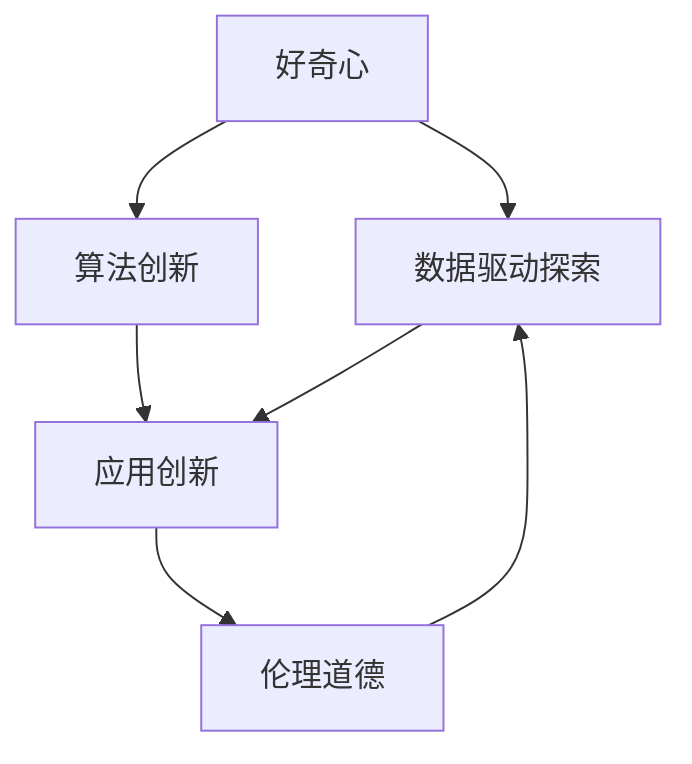

                 

# 好奇心与创造力：创新的双翼

> 关键词：好奇心,创造力,创新,技术进步,人工智能,未来发展

## 1. 背景介绍

### 1.1 问题由来

人类历史长河中，好奇心和创造力一直是推动技术进步、文化发展和社会变迁的核心动力。在科技领域，这两大力量尤为显著。从古代的火种点燃到现代的AI革命，每一项重大的技术突破，背后都离不开科学家们对未知世界的不懈探索和创造性思维的推动。

在当代，随着人工智能（AI）技术的迅速发展，好奇心与创造力成为了驱动AI创新、解决复杂问题的重要因素。在AI领域，好奇心驱动着研究人员探索更深层、更广泛的科学问题，而创造力则使得他们能够以新的方式理解和解决这些问题。

### 1.2 问题核心关键点

好奇心与创造力在大数据、机器学习、深度学习等AI技术领域的应用，使得AI系统的性能和智能水平有了显著提升。具体来说，包括以下几个核心关键点：

- **数据驱动探索**：利用大数据技术，好奇心驱动研究人员探索数据中隐藏的规律，从而发现新的知识。
- **算法创新**：创造力帮助研究人员设计和优化新的算法模型，解决复杂的数学问题。
- **应用创新**：好奇心和创造力推动AI技术在各个领域的应用创新，如自动驾驶、医疗诊断、金融分析等。
- **伦理道德**：在AI技术应用过程中，好奇心和创造力也促使研究者思考如何构建符合伦理道德的技术方案，确保技术的安全、公正和透明。

这些关键点体现了好奇心和创造力在AI技术发展中的双重作用，它们既是技术进步的催化剂，也是社会责任的推动器。

### 1.3 问题研究意义

研究好奇心与创造力在AI领域的应用，具有深远的理论和实践意义：

1. **理论提升**：帮助更深刻理解好奇心和创造力的本质，推动心理学、认知科学等基础理论的发展。
2. **技术创新**：为AI技术的未来发展提供新的思路和方法，推动技术边界不断扩展。
3. **应用落地**：确保AI技术在实际应用中的安全和可靠性，促进AI技术与社会的和谐共存。
4. **伦理导向**：引导AI技术的应用方向，注重技术伦理和社会责任，推动AI技术的可持续健康发展。

本文将全面探讨好奇心与创造力在AI领域的应用，系统介绍其原理、操作步骤、实际应用，以及未来的发展趋势和面临的挑战。

## 2. 核心概念与联系

### 2.1 核心概念概述

为更好地理解好奇心与创造力在AI领域的应用，本节将介绍几个密切相关的核心概念：

- **好奇心（Curiosity）**：指个体对新奇事物的好奇心和求知欲，驱动其在已知范围内不断探索未知，寻求新知。
- **创造力（Creativity）**：指个体利用已知信息创造新知识、新方法、新解决方案的能力。
- **技术进步（Technological Advancement）**：指通过科技创新解决新问题，提升技术水平的过程。
- **人工智能（Artificial Intelligence, AI）**：指利用计算机技术模拟人类智能，实现智能化决策和任务执行的能力。
- **创新（Innovation）**：指在技术、产品、流程等方面的新突破和新思路。

这些概念之间的逻辑关系可以通过以下Mermaid流程图来展示：



这个流程图展示了好奇心与创造力在AI技术发展中的相互作用：

1. 好奇心驱动数据驱动探索，帮助研究人员发现新知识。
2. 创造力促进算法创新，推动AI技术的发展。
3. 应用创新使得AI技术在实际中得到应用和推广。
4. 伦理道德约束技术的应用，确保技术的安全性和公正性。

## 3. 核心算法原理 & 具体操作步骤
### 3.1 算法原理概述

好奇心与创造力在AI领域的应用，主要体现在数据驱动探索、算法创新和应用创新三个方面。其核心算法原理可以归纳为以下几个要点：

1. **数据驱动探索**：利用大数据技术，对大量数据进行探索和分析，发现隐藏的规律和模式。
2. **算法创新**：设计和优化新的算法模型，以解决复杂的数学和计算问题。
3. **应用创新**：将创新的算法模型应用到实际场景中，实现技术突破和应用创新。

### 3.2 算法步骤详解

基于好奇心与创造力的AI技术创新过程，一般包括以下几个关键步骤：

**Step 1: 数据收集与预处理**
- 收集相关领域的原始数据，如文本、图像、音频等。
- 对数据进行清洗、标注和预处理，确保数据质量。

**Step 2: 探索性数据分析**
- 使用大数据技术对数据进行探索性分析，如统计分析、聚类分析、关联分析等。
- 利用可视化工具展示数据特征，发现潜在规律和趋势。

**Step 3: 模型设计与训练**
- 根据数据特征和问题需求，设计新的算法模型。
- 使用训练数据对模型进行训练，调整超参数，优化模型性能。

**Step 4: 模型评估与验证**
- 使用验证集对模型进行评估，衡量其性能指标。
- 根据评估结果进行模型改进和调优。

**Step 5: 应用部署与迭代**
- 将模型部署到实际应用场景中，进行性能测试和优化。
- 收集用户反馈和新数据，不断迭代和优化模型，提升应用效果。

### 3.3 算法优缺点

基于好奇心与创造力的AI技术创新方法具有以下优点：

1. **灵活高效**：好奇心和创造力驱动的探索与创新，能够快速适应新场景和新问题，提高研发效率。
2. **广泛应用**：好奇心和创造力可以在多个领域和场景中应用，推动技术的广泛普及。
3. **持续进步**：好奇心和创造力促使研究人员不断探索和创新，推动技术进步和迭代。

同时，该方法也存在一定的局限性：

1. **高成本投入**：数据收集、模型训练和应用部署需要大量的资源和时间投入。
2. **复杂性高**：好奇心和创造力的探索过程复杂，需要跨学科知识和技能。
3. **不确定性**：探索和创新的结果往往具有不确定性，可能无法直接转化为商业价值。
4. **伦理挑战**：好奇心和创造力驱动的创新过程中，可能涉及数据隐私和伦理道德问题。

尽管存在这些局限性，但就目前而言，基于好奇心与创造力的AI技术创新方法仍然是大数据和人工智能领域的主流范式。未来相关研究的重点在于如何进一步降低创新过程的成本，提高模型的可解释性和伦理道德水平，同时兼顾技术进步和社会责任。

### 3.4 算法应用领域

基于好奇心与创造力的AI技术创新方法，已经在诸多领域得到了广泛应用，例如：

- **自动驾驶**：利用大数据和机器学习，探索道路交通规则和行人行为模式，优化驾驶决策。
- **医疗诊断**：通过分析海量患者数据，发现疾病发展规律，优化诊疗方案。
- **金融分析**：利用大数据技术探索市场趋势和投资规律，优化投资决策。
- **工业制造**：探索生产流程中的优化方案，提升生产效率和产品质量。
- **智慧城市**：探索城市运行规律，优化资源配置和管理策略。

除了上述这些经典应用外，AI技术在更多新兴领域的应用也在不断拓展，如智慧农业、教育、艺术创作等，为各行各业带来新的变革。

## 4. 数学模型和公式 & 详细讲解 & 举例说明

### 4.1 数学模型构建

本节将使用数学语言对好奇心与创造力在AI技术创新中的数学模型进行更加严格的刻画。

假设有一个AI模型 $M(x; \theta)$，其中 $x$ 为输入数据，$\theta$ 为模型参数。模型的训练目标是通过最大化对数似然函数来优化参数，即：

$$
\theta^* = \mathop{\arg\max}_{\theta} \frac{1}{N} \sum_{i=1}^N \log M(x_i; \theta)
$$

其中 $N$ 为样本总数。模型的预测输出为 $y = M(x; \theta)$。

### 4.2 公式推导过程

为了更好地理解AI模型创新过程，我们以一个简单的线性回归模型为例，推导其训练和评估公式。

假设有一个线性回归模型 $M(x; \theta) = \theta_0 + \theta_1 x_1 + \theta_2 x_2$，其中 $x_1, x_2$ 为输入特征，$\theta_0, \theta_1, \theta_2$ 为模型参数。训练数据集为 $(x_{ij}, y_i)$，其中 $x_{ij}$ 为第 $i$ 个样本的第 $j$ 个特征，$y_i$ 为对应标签。

模型的对数似然函数为：

$$
\mathcal{L}(\theta) = \frac{1}{N} \sum_{i=1}^N -\log \left(\frac{1}{1+e^{-(y_i-\theta_0-\theta_1 x_{1i}-\theta_2 x_{2i})}}\right)
$$

模型的参数更新公式为：

$$
\theta_k \leftarrow \theta_k - \eta \nabla_{\theta_k}\mathcal{L}(\theta)
$$

其中 $\eta$ 为学习率，$\nabla_{\theta_k}\mathcal{L}(\theta)$ 为损失函数对参数 $\theta_k$ 的梯度，可通过反向传播算法高效计算。

### 4.3 案例分析与讲解

假设有一个医院，需要对病人的治疗效果进行评估。医院收集了历史病人的治疗数据和结果数据，希望利用这些数据构建一个AI模型，预测病人的治疗效果。

首先，对数据进行预处理和清洗，去除缺失和异常数据。然后，对数据进行探索性分析，发现病人的年龄、性别、病情严重程度等特征与治疗效果有较强的相关性。

接着，设计一个线性回归模型，并使用训练数据对模型进行训练。通过调整超参数和优化算法，使模型在验证集上达到满意的性能。最后，将模型应用到新的病人数据中，评估其预测效果。

## 5. 项目实践：代码实例和详细解释说明

### 5.1 开发环境搭建

在进行好奇心与创造力驱动的AI技术创新实践前，我们需要准备好开发环境。以下是使用Python进行TensorFlow开发的环境配置流程：

1. 安装Anaconda：从官网下载并安装Anaconda，用于创建独立的Python环境。

2. 创建并激活虚拟环境：
```bash
conda create -n tf-env python=3.8 
conda activate tf-env
```

3. 安装TensorFlow：根据CUDA版本，从官网获取对应的安装命令。例如：
```bash
conda install tensorflow==2.8.0 
```

4. 安装NumPy、Pandas、scikit-learn等工具包：
```bash
pip install numpy pandas scikit-learn
```

5. 安装可视化工具：
```bash
pip install matplotlib seaborn
```

完成上述步骤后，即可在`tf-env`环境中开始实践。

### 5.2 源代码详细实现

下面我以医疗诊断领域的创新应用为例，给出使用TensorFlow进行线性回归模型构建和训练的PyTorch代码实现。

```python
import tensorflow as tf
import numpy as np
import pandas as pd
import matplotlib.pyplot as plt

# 数据读取和预处理
data = pd.read_csv('patient_data.csv')
X = data[['age', 'gender', 'disease_severity']]
y = data['treatment_effect']
X = (X - X.mean()) / X.std()  # 标准化处理

# 划分训练集和测试集
split_ratio = 0.8
X_train, y_train = X.iloc[:int(len(X) * split_ratio)].values, y.iloc[:int(len(X) * split_ratio)].values
X_test, y_test = X.iloc[int(len(X) * split_ratio):].values, y.iloc[int(len(X) * split_ratio):].values

# 定义线性回归模型
model = tf.keras.Sequential([
    tf.keras.layers.Dense(1, input_shape=(X.shape[1],), activation='linear')
])

# 编译模型
model.compile(optimizer=tf.keras.optimizers.Adam(learning_rate=0.01),
              loss='mse', metrics=['mae'])

# 训练模型
model.fit(X_train, y_train, epochs=50, batch_size=32, validation_data=(X_test, y_test))

# 模型评估
y_pred = model.predict(X_test)
plt.scatter(y_test, y_pred)
plt.xlabel('True')
plt.ylabel('Predicted')
plt.show()
```

### 5.3 代码解读与分析

让我们再详细解读一下关键代码的实现细节：

**数据预处理**：
- 读取病人数据，使用Pandas进行数据清洗和预处理。
- 将特征数据标准化处理，以便模型更好地学习。

**模型定义**：
- 使用TensorFlow的Sequential模型定义线性回归模型。
- 添加一个全连接层，输出一个标量。

**模型编译**：
- 使用Adam优化器，设置学习率。
- 选择均方误差作为损失函数，平均绝对误差作为评估指标。

**模型训练**：
- 使用训练数据对模型进行训练，设置迭代次数和批次大小。
- 使用测试数据进行验证，防止过拟合。

**模型评估**：
- 对测试集进行预测，并绘制散点图，评估模型预测效果。

可以看到，TensorFlow提供了便捷的API和工具，使得线性回归模型的构建和训练过程变得非常简单。开发者只需关注算法设计和模型优化，无需过多关注底层实现细节。

## 6. 实际应用场景

### 6.1 医疗诊断

好奇心与创造力在医疗诊断领域的应用，主要体现在以下几个方面：

- **疾病预测**：利用大数据和机器学习，探索疾病发展的规律和模式，预测患病风险。
- **诊断支持**：通过分析患者历史数据和当前症状，辅助医生进行诊断决策。
- **治疗方案优化**：探索不同治疗方案的效果，优化治疗方案的选择。

在技术实现上，可以收集患者的历史数据、治疗数据、病情数据等，构建AI模型进行探索和预测。微调过程可以应用在模型参数更新中，使得模型能够更好地适应具体患者的病情和历史数据。

### 6.2 智能制造

好奇心与创造力在智能制造领域的应用，主要体现在以下几个方面：

- **生产流程优化**：通过分析生产数据，探索最优的生产流程和工艺参数，提升生产效率。
- **设备故障预测**：利用大数据技术，探索设备运行规律和异常模式，预测设备故障。
- **质量控制**：通过分析产品质量数据，探索质量变化的规律和影响因素，优化质量控制策略。

在技术实现上，可以收集生产过程中的数据，包括设备状态、原材料数据、生产参数等。构建AI模型进行探索和预测，微调过程可以应用在模型参数更新中，使得模型能够更好地适应具体生产场景。

### 6.3 金融分析

好奇心与创造力在金融分析领域的应用，主要体现在以下几个方面：

- **市场趋势预测**：利用大数据技术，探索市场趋势和波动规律，预测股票价格和市场走向。
- **投资组合优化**：通过分析投资数据，探索最优的投资组合和风险管理策略。
- **信用评估**：利用大数据技术，探索信用风险的规律和影响因素，优化信用评估模型。

在技术实现上，可以收集市场数据、投资数据、信用数据等，构建AI模型进行探索和预测。微调过程可以应用在模型参数更新中，使得模型能够更好地适应具体的市场环境和投资场景。

### 6.4 未来应用展望

随着好奇心与创造力的深入应用，AI技术将在更多领域得到广泛应用，为各行各业带来新的变革。

在智慧城市治理中，AI技术将广泛应用于城市运行数据的分析，优化资源配置和管理策略。在智慧农业中，AI技术将探索作物生长规律和病虫害防治方法，提高农业生产效率。在智慧教育中，AI技术将探索学生学习行为和知识结构，优化教育内容和教学方法。

## 7. 工具和资源推荐

### 7.1 学习资源推荐

为了帮助开发者系统掌握好奇心与创造力在AI领域的应用，这里推荐一些优质的学习资源：

1. 《人工智能：一种现代方法》：斯坦福大学Andrew Ng教授的入门级AI教材，详细介绍了AI的基本概念和算法原理。
2. Coursera的《深度学习专项课程》：由Google、Facebook等顶尖公司的专家讲授，涵盖了深度学习的基础和应用。
3. 《深度学习》书籍：Ian Goodfellow、Yoshua Bengio、Aaron Courville合著，系统介绍了深度学习理论和实践。
4. arXiv论文：顶尖研究机构的最新研究成果，涵盖了AI领域的各个方面。
5. 《创造力与人工智能》专题文章：对好奇心与创造力在AI中的应用进行了深入探讨，提供了丰富的案例和实践建议。

通过对这些资源的学习实践，相信你一定能够掌握好奇心与创造力在AI领域的应用精髓，并用于解决实际的AI问题。

### 7.2 开发工具推荐

高效的开发离不开优秀的工具支持。以下是几款用于好奇心与创造力驱动的AI技术创新开发的常用工具：

1. Jupyter Notebook：开源的交互式编程环境，支持Python、R等多种语言，适合进行数据探索和模型训练。
2. Google Colab：谷歌提供的免费Jupyter Notebook环境，支持GPU/TPU算力，方便开发者快速上手实验最新模型。
3. TensorFlow：由Google主导开发的深度学习框架，生产部署方便，适合大规模工程应用。
4. PyTorch：由Facebook主导开发的深度学习框架，灵活动态，适合快速迭代研究。
5. Matplotlib、Seaborn：用于数据可视化的工具，方便展示和分析数据特征。

合理利用这些工具，可以显著提升好奇心与创造力驱动的AI技术创新开发的效率，加快创新迭代的步伐。

### 7.3 相关论文推荐

好奇心与创造力在大数据和AI技术领域的应用，源于学界的持续研究。以下是几篇奠基性的相关论文，推荐阅读：

1. "Curiosity and Cognitive Behavior" by Richard J. Gale：探讨好奇心在人类认知行为中的作用。
2. "Creativity and Artificial Intelligence" by Teresa A. Cantor：探讨创造力在人工智能中的应用和挑战。
3. "Towards AI for Social Good" by Amanpreet Singh：探讨AI技术在社会福祉中的作用和潜力。
4. "Human-Computer Interaction for Curiosity and Creativity" by Amanpreet Singh：探讨人机交互中好奇心和创造力的应用。
5. "AI Ethics and Responsibility" by Markus Gunter：探讨AI技术应用中的伦理和责任问题。

这些论文代表了好奇心与创造力在AI领域的发展脉络。通过学习这些前沿成果，可以帮助研究者把握学科前进方向，激发更多的创新灵感。

## 8. 总结：未来发展趋势与挑战

### 8.1 总结

本文对好奇心与创造力在AI领域的应用进行了全面系统的介绍。首先阐述了好奇心与创造力在AI技术发展中的独特价值，明确了其在大数据和AI技术中的应用前景。其次，从原理到实践，详细讲解了好奇心与创造力的数学模型和操作步骤，给出了AI技术创新开发的完整代码实例。同时，本文还广泛探讨了好奇心与创造力在医疗、智能制造、金融分析等多个行业领域的应用前景，展示了其广阔的想象空间。此外，本文精选了好奇心与创造力驱动的AI技术创新的各类学习资源，力求为读者提供全方位的技术指引。

通过本文的系统梳理，可以看到，好奇心与创造力在大数据和AI技术领域的应用，已经推动了技术进步和应用落地。未来，伴随好奇心与创造力的不断探索和创新，AI技术必将在更多领域发挥重要作用，为人类社会的各个方面带来深刻变革。

### 8.2 未来发展趋势

展望未来，好奇心与创造力驱动的AI技术创新将呈现以下几个发展趋势：

1. **多模态融合**：AI技术将从单一模态扩展到多模态数据，如文本、图像、音频等，提高综合分析和决策能力。
2. **跨领域应用**：AI技术将在更多垂直领域应用，如智慧农业、智慧教育、智慧医疗等，提升行业效率和用户体验。
3. **自动探索**：AI技术将具备更强的自主探索和发现能力，自动从数据中发现新知识和新规律。
4. **人机协作**：AI技术将与人机协作，共同解决复杂问题，提升人类认知能力。
5. **伦理规范**：AI技术将加强伦理规范和监管机制，确保技术应用的安全性和公正性。

以上趋势凸显了好奇心与创造力在AI技术发展中的重要地位。这些方向的探索发展，必将进一步提升AI技术的智能化水平，推动技术进步和社会进步。

### 8.3 面临的挑战

尽管好奇心与创造力驱动的AI技术创新取得了显著成果，但在迈向更加智能化、普适化应用的过程中，仍面临诸多挑战：

1. **数据隐私**：好奇心和创造力的探索过程中，可能涉及大量敏感数据，如何保护数据隐私和安全是重要问题。
2. **伦理道德**：AI技术的应用过程中，可能存在伦理道德问题，如何确保技术应用符合人类价值观和社会规范。
3. **模型可解释性**：好奇心和创造力驱动的AI模型往往缺乏可解释性，如何提高模型的透明性和可理解性是重要挑战。
4. **资源消耗**：好奇心和创造力的探索过程中，需要大量的计算资源和数据资源，如何高效利用这些资源是关键问题。
5. **技术融合**：好奇心和创造力驱动的AI技术需要与其他技术进行深度融合，如知识表示、因果推理、强化学习等，才能更好地解决复杂问题。

这些挑战需要学界和产业界共同努力，寻找解决方案，确保好奇心与创造力驱动的AI技术创新能够健康、可持续地发展。

### 8.4 研究展望

面对好奇心与创造力驱动的AI技术创新所面临的挑战，未来的研究需要在以下几个方面寻求新的突破：

1. **数据隐私保护**：探索隐私保护技术，如差分隐私、联邦学习等，确保数据安全和隐私保护。
2. **伦理规范制定**：制定AI技术的伦理规范和标准，确保技术应用符合人类价值观和社会规范。
3. **模型可解释性提升**：开发可解释性高的AI模型，提高模型的透明性和可理解性。
4. **资源优化利用**：优化数据采集、模型训练和应用部署的资源消耗，提高效率和效益。
5. **跨学科融合**：促进AI技术与其他学科的深度融合，提高技术的综合应用能力。

这些研究方向的探索，必将引领好奇心与创造力驱动的AI技术创新迈向新的高度，为构建智能、公正、安全的AI系统铺平道路。面向未来，好奇心与创造力驱动的AI技术创新必将成为推动技术进步和社会发展的重要力量。

## 9. 附录：常见问题与解答

**Q1：好奇心与创造力驱动的AI技术创新是否适用于所有应用场景？**

A: 好奇心与创造力驱动的AI技术创新虽然具有广泛适用性，但并不是所有应用场景都适合。对于数据量较小、规律明确的场景，传统的统计分析方法可能更为高效。对于复杂、非结构化数据的探索和预测，好奇心与创造力驱动的AI技术创新具有独特优势。

**Q2：好奇心与创造力驱动的AI技术创新过程中，如何避免过拟合？**

A: 过拟合是好奇心与创造力驱动的AI技术创新中常见的问题。为了避免过拟合，可以采用以下方法：

- **数据增强**：通过回译、近义替换等方式扩充训练集。
- **正则化技术**：使用L2正则、Dropout、Early Stopping等防止模型过度适应训练集。
- **模型简化**：通过模型剪枝、特征选择等方式简化模型，减少参数量。

这些方法可以有效缓解过拟合问题，提高模型泛化性能。

**Q3：好奇心与创造力驱动的AI技术创新过程中，如何确保模型的可解释性？**

A: 好奇心与创造力驱动的AI技术创新过程中，模型的可解释性往往是一个重要问题。为了确保模型的可解释性，可以采用以下方法：

- **模型可视化**：使用可视化工具展示模型的决策过程和特征权重。
- **模型简化**：通过简化模型结构和参数，提高模型的透明性和可理解性。
- **可解释性技术**：引入可解释性技术，如LIME、SHAP等，对模型输出进行解释。

这些方法可以帮助开发者更好地理解模型的内部机制，提高模型的透明性和可解释性。

**Q4：好奇心与创造力驱动的AI技术创新过程中，如何优化资源利用效率？**

A: 好奇心与创造力驱动的AI技术创新过程中，资源优化利用是关键问题。以下是一些优化资源利用的方法：

- **模型并行**：利用GPU、TPU等高性能设备，并行化计算过程，提高计算效率。
- **混合精度训练**：使用混合精度技术，减少模型训练和推理的内存和计算资源消耗。
- **数据压缩**：使用数据压缩技术，减少数据存储和传输的资源消耗。
- **模型压缩**：使用模型压缩技术，减少模型大小和计算资源消耗。

这些方法可以有效优化资源利用效率，提高AI技术创新的实际应用效果。

**Q5：好奇心与创造力驱动的AI技术创新过程中，如何处理多模态数据？**

A: 处理多模态数据是好奇心与创造力驱动的AI技术创新中的一个重要问题。以下是一些处理多模态数据的方法：

- **特征融合**：使用特征融合技术，将不同模态的数据进行融合，提高综合分析能力。
- **联合训练**：使用联合训练技术，将不同模态的数据联合训练，提高模型性能。
- **跨模态学习**：使用跨模态学习技术，探索不同模态数据之间的关联和规律。

这些方法可以有效处理多模态数据，提高AI技术创新的综合应用能力。

---

作者：禅与计算机程序设计艺术 / Zen and the Art of Computer Programming

