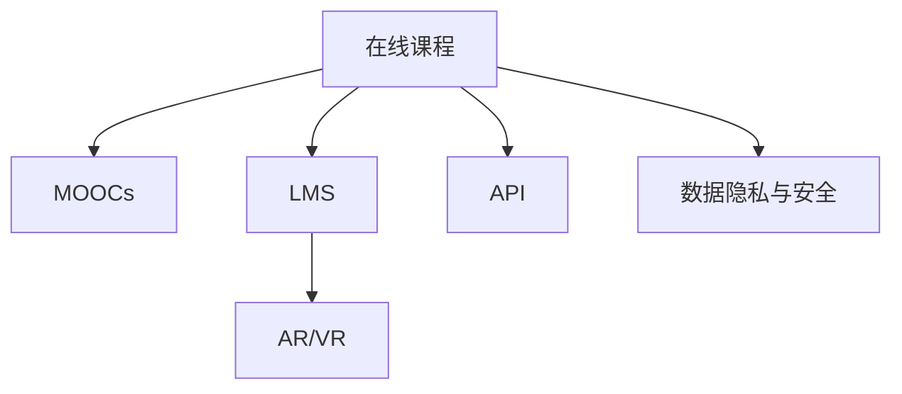

                 

# 如何利用技术能力创建在线课程

## 1. 背景介绍

### 1.1 问题由来

随着信息技术和互联网的飞速发展，在线教育已经成为了现代教育的重要组成部分。传统的面对面授课模式已经被在线学习所替代，特别是在新冠疫情期间，在线教育的重要性得到了进一步的凸显。然而，在线课程的创建和管理并不是一件容易的事情，尤其是在课程内容、技术实现和用户体验方面，需要高度的专业技术能力。

### 1.2 问题核心关键点

在线课程的创建主要涉及以下几个关键点：
1. **课程设计**：确定课程目标、内容和结构，选择合适的教学方法和媒体形式。
2. **技术实现**：利用前端和后端技术实现课程的呈现和交互。
3. **用户体验**：优化课程的界面和交互设计，提升用户体验。
4. **技术挑战**：处理大文件、视频流传输、用户数据保护等技术挑战。
5. **运营管理**：课程的推广、营销、用户管理等运营策略。

### 1.3 问题研究意义

在线课程的创建和运营不仅能满足知识传播的需求，还能提供灵活的学习方式，适应不同用户的学习需求。同时，在线课程的创建也为教育技术的创新和应用提供了新的契机，促进了教育领域的技术进步和产业发展。

## 2. 核心概念与联系

### 2.1 核心概念概述

为更好地理解如何利用技术能力创建在线课程，本节将介绍几个关键概念：

- **在线课程**：基于网络技术，通过互联网平台提供的学习课程，包括视频、音频、文字等多种媒体形式。
- **MOOCs（大规模在线开放课程）**：利用互联网技术，提供大规模免费开放课程，如Coursera、edX等平台。
- **LMS（学习管理系统）**：用于管理和提供在线课程的软件系统，如Moodle、Blackboard等。
- **AR/VR技术**：增强现实和虚拟现实技术，用于提供沉浸式学习体验，如Google Expeditions。
- **API（应用程序编程接口）**：用于连接不同系统和应用程序的标准接口，便于课程的集成和数据共享。
- **数据隐私和安全**：在线课程中需要保护用户数据的隐私和安全，防止数据泄露和滥用。

这些概念之间的逻辑关系可以通过以下Mermaid流程图来展示：



这个流程图展示了大规模在线课程的创建过程，涉及到多种技术的应用和协同。

## 3. 核心算法原理 & 具体操作步骤
### 3.1 算法原理概述

在线课程的创建涉及到多个技术的协同，包括前端和后端技术、AR/VR技术、API集成等。其核心思想是利用这些技术手段，提供灵活、高效、互动的学习体验，同时确保课程内容的传递和用户数据的保护。

### 3.2 算法步骤详解

基于技术能力的在线课程创建可以分为以下几个关键步骤：

**Step 1: 课程设计**

1. **确定课程目标和内容**：明确课程的目标和核心内容，设计合适的教学方法和媒体形式。
2. **选择教学平台**：根据课程需求选择合适的在线学习平台，如Coursera、edX、Moodle等。
3. **设计课程结构**：设计课程的章节、知识点和测试，制定合理的教学计划。

**Step 2: 技术实现**

1. **选择开发工具和框架**：选择合适的开发工具和框架，如React、Vue、Django等。
2. **开发前端页面**：开发课程的前端页面，包括课程介绍、章节、课件和测试等。
3. **开发后端逻辑**：开发课程的后端逻辑，包括用户管理、课程发布、学习记录等。
4. **集成API和第三方服务**：集成API和第三方服务，如视频流服务、数据分析服务、支付服务等。
5. **优化性能**：优化课程的性能，确保课程的流畅性和响应速度。

**Step 3: 用户体验**

1. **界面设计**：设计简洁、易用的课程界面，提升用户体验。
2. **互动设计**：设计互动性的学习体验，如讨论区、问答、作业等。
3. **个性化推荐**：根据用户的学习情况和兴趣，提供个性化的学习推荐。

**Step 4: 技术挑战**

1. **大文件处理**：处理课程中的大文件，如视频、音频等。
2. **视频流传输**：优化视频流的传输，确保视频播放的流畅性和稳定性。
3. **数据隐私和安全**：确保用户数据的隐私和安全，防止数据泄露和滥用。

**Step 5: 运营管理**

1. **课程推广**：通过多种渠道推广课程，吸引更多的用户参与。
2. **用户管理**：管理用户的学习记录和反馈，提升用户体验。
3. **数据分析**：分析用户的学习行为和效果，优化课程内容和教学方法。

### 3.3 算法优缺点

基于技术能力的在线课程创建具有以下优点：
1. **灵活性高**：可以根据用户需求和课程内容，灵活调整课程结构和内容。
2. **覆盖面广**：覆盖多种媒体形式和教学方法，满足不同用户的学习需求。
3. **互动性强**：通过互动性的学习体验，提升用户的学习效果和参与度。
4. **技术支撑**：利用前沿技术手段，提供高品质的学习体验。

同时，该方法也存在一定的局限性：
1. **技术门槛高**：需要较高的技术能力，特别是对于技术实现和性能优化方面。
2. **课程质量难以保障**：课程设计和内容质量需要高度专业化，否则容易影响用户的学习体验。
3. **用户粘性不足**：如何提高用户的参与度和粘性，需要更多的运营策略和技术手段。
4. **技术风险**：技术实现中的各种问题，如数据泄露、性能问题等，需要及时解决。

尽管存在这些局限性，但就目前而言，基于技术能力的在线课程创建仍是一种较为高效、灵活的课程创建方式。未来相关研究的重点在于如何进一步降低技术门槛，提高课程质量和用户粘性，同时兼顾数据隐私和技术安全等因素。

### 3.4 算法应用领域

在线课程的创建已经在教育、企业培训、职业认证等多个领域得到广泛应用，成为教育技术的重要组成部分。

- **教育领域**：提供大规模的在线课程，满足不同人群的学习需求，如K-12教育、高等教育等。
- **企业培训**：利用在线课程进行员工的职业培训和技能提升，提高员工的工作效率和职业素养。
- **职业认证**：通过在线课程提供职业资格认证，提高人才素质和就业竞争力。
- **语言学习**：提供多语种的在线课程，促进语言学习和跨文化交流。
- **技能培训**：提供专业技能培训课程，如编程、数据分析、项目管理等。

除了上述这些经典应用外，在线课程还被创新性地应用到更多场景中，如远程医疗、虚拟实验室、虚拟旅游等，为在线教育带来了新的发展方向。随着技术的发展和社会的进步，在线课程将在更广阔的领域得到应用，成为推动教育技术革新的重要力量。

## 4. 数学模型和公式 & 详细讲解  
### 4.1 数学模型构建

在线课程的创建涉及到多种技术的协同，如视频流传输、API集成等，其数学模型通常较为复杂。本节将通过数学语言对在线课程的创建过程进行更加严格的刻画。

假设在线课程由$m$个视频课程组成，每个视频课程时长为$T$分钟，视频流传输速率$R$，用户下载带宽为$B$。课程学习时间为$t$小时，用户学习效率为$\eta$（即单位时间内学习的视频时长）。

定义课程完成率为$P$，其计算公式为：

$$
P = \frac{t \times \eta \times m \times T}{t \times \eta \times m \times T + \frac{T \times m}{R} \times (1 - P)}
$$

其中，$\frac{T \times m}{R}$表示课程总时长除以下载带宽，即完成课程所需的时间。$(1 - P)$表示未完成课程的比例。

**4.2 公式推导过程**

在上述模型中，完成率$P$随时间的变化遵循以下微分方程：

$$
\frac{dP}{dt} = \frac{m \times T \times \eta}{m \times T \times \eta + \frac{T \times m}{R}}
$$

令$C = \frac{T \times m}{R}$，则有：

$$
\frac{dP}{dt} = \frac{\eta}{\eta + C}
$$

对方程两边同时积分，得：

$$
P(t) = \eta t + \frac{C}{\eta + C} - 1
$$

因此，课程完成率随时间$t$的变化为：

$$
P(t) = \frac{\eta t}{\eta + C} + \frac{C}{\eta + C} - 1
$$

其中，$\frac{C}{\eta + C}$表示课程总时长除以学习效率和下载带宽之和，即课程完成所需的理论时间。$-1$表示完全未完成的状态。

### 4.3 案例分析与讲解

以Coursera平台为例，分析其在线课程的创建过程和技术实现：

1. **课程设计**：Coursera提供了多种课程模板和教学资源，课程设计相对灵活。
2. **技术实现**：Coursera采用云架构，提供了丰富的API和开发工具，支持课程的快速开发和集成。
3. **用户体验**：Coursera提供了互动性的学习体验，如讨论区、作业、测验等，提升了用户的学习效果和参与度。
4. **技术挑战**：Coursera通过CDN技术优化视频流传输，确保视频播放的流畅性和稳定性。
5. **运营管理**：Coursera通过数据分析和用户反馈，不断优化课程内容和教学方法。

## 5. 项目实践：代码实例和详细解释说明
### 5.1 开发环境搭建

在进行在线课程的创建实践前，我们需要准备好开发环境。以下是使用Python进行Django开发的环境配置流程：

1. 安装Anaconda：从官网下载并安装Anaconda，用于创建独立的Python环境。

2. 创建并激活虚拟环境：
```bash
conda create -n django-env python=3.8 
conda activate django-env
```

3. 安装Django：根据CUDA版本，从官网获取对应的安装命令。例如：
```bash
conda install django 
```

4. 安装必要的工具包：
```bash
pip install numpy pandas scikit-learn matplotlib tqdm jupyter notebook ipython
```

完成上述步骤后，即可在`django-env`环境中开始在线课程的创建实践。

### 5.2 源代码详细实现

下面我们以一个简单的在线课程创建为例，给出使用Django框架进行在线课程创建的PyTorch代码实现。

首先，定义课程模型：

```python
from django.db import models
from django.contrib.auth.models import User

class Course(models.Model):
    title = models.CharField(max_length=255)
    description = models.TextField()
    start_date = models.DateTimeField()
    end_date = models.DateTimeField()
    status = models.CharField(max_length=10)
    enrollment_count = models.IntegerField(default=0)
    created_at = models.DateTimeField(auto_now_add=True)
    updated_at = models.DateTimeField(auto_now=True)
    users = models.ManyToManyField(User)

    def __str__(self):
        return self.title
```

然后，定义用户模型：

```python
class User(models.Model):
    username = models.CharField(max_length=255, unique=True)
    email = models.EmailField(unique=True)
    password = models.CharField(max_length=255)
    created_at = models.DateTimeField(auto_now_add=True)
    updated_at = models.DateTimeField(auto_now=True)

    def __str__(self):
        return self.username
```

接着，定义用户注册和登录视图：

```python
from django.shortcuts import render, redirect
from django.contrib.auth.forms import UserCreationForm, AuthenticationForm
from django.contrib.auth import login, logout

def register(request):
    if request.method == 'POST':
        form = UserCreationForm(request.POST)
        if form.is_valid():
            form.save()
            username = form.cleaned_data.get('username')
            user = User.objects.get(username=username)
            login(request, user)
            return redirect('home')
    else:
        form = UserCreationForm()
    return render(request, 'register.html', {'form': form})

def login_view(request):
    if request.method == 'POST':
        form = AuthenticationForm(data=request.POST)
        if form.is_valid():
            user = form.get_user()
            login(request, user)
            return redirect('home')
    else:
        form = AuthenticationForm()
    return render(request, 'login.html', {'form': form})

def logout_view(request):
    logout(request)
    return redirect('home')
```

最后，定义课程注册和创建视图：

```python
from django.shortcuts import render, redirect
from .forms import CourseForm

def course_register(request):
    if request.method == 'POST':
        form = CourseForm(request.POST)
        if form.is_valid():
            course = form.save(commit=False)
            course.users.add(request.user)
            course.save()
            return redirect('courses')
    else:
        form = CourseForm()
    return render(request, 'course_register.html', {'form': form})

def courses(request):
    courses = Course.objects.all()
    return render(request, 'courses.html', {'courses': courses})
```

以上就是使用Django框架进行在线课程创建的完整代码实现。可以看到，通过Django的强大封装，我们可以用相对简洁的代码完成在线课程的创建和管理。

### 5.3 代码解读与分析

让我们再详细解读一下关键代码的实现细节：

**Course模型**：
- `__str__`方法：定义了模型的字符串表示，方便在管理界面中查看。
- `title`、`description`、`start_date`、`end_date`、`status`、`enrollment_count`等字段：定义了课程的基本信息，如课程标题、描述、开始时间、结束时间、状态、注册人数等。
- `users`字段：定义了参与课程的用户，通过`ManyToManyField`实现了多对多关系。

**User模型**：
- `__str__`方法：定义了用户的字符串表示。
- `username`、`email`、`password`字段：定义了用户的基本信息，如用户名、邮箱、密码等。
- `created_at`、`updated_at`字段：定义了用户创建和更新时间的自动记录。

**用户注册和登录视图**：
- `register`视图：处理用户注册请求，验证表单数据，创建用户并登录。
- `login_view`视图：处理用户登录请求，验证表单数据，登录用户。
- `logout_view`视图：处理用户注销请求，注销用户。

**课程注册和创建视图**：
- `course_register`视图：处理课程注册请求，验证表单数据，创建课程并添加用户。
- `courses`视图：查询并显示所有课程，供用户浏览。

这些视图的实现展示了Django框架的强大功能，能够快速开发出灵活、高效、互动的在线课程创建和管理系统。

## 6. 实际应用场景
### 6.1 教育领域

在线课程在教育领域的应用非常广泛，可以帮助学生自主学习、跨越地域限制，获取优质的教育资源。在线课程可以为K-12教育、高等教育、职业培训等多个层次提供支持。

具体应用包括：
1. **K-12教育**：提供基础学科和兴趣课程，帮助学生自主学习。
2. **高等教育**：提供专业课程和学位课程，满足学术研究和职业发展的需求。
3. **职业培训**：提供职业技能培训课程，提升员工的工作效率和职业素养。

在线课程不仅能够提供灵活的学习方式，还能够适应不同人群的学习需求，推动教育公平和知识普及。

### 6.2 企业培训

在线课程在企业培训中的应用也非常广泛，可以帮助企业员工掌握新技能、提升职业素养，提高企业的整体竞争力。

具体应用包括：
1. **员工培训**：提供员工所需的技能培训课程，如编程、数据分析、项目管理等。
2. **管理培训**：提供领导力和管理技能培训课程，提升管理人员的领导能力。
3. **客户培训**：提供产品和服务培训课程，提升客户满意度和忠诚度。

在线课程能够提供灵活、互动的学习体验，帮助企业员工快速掌握新技能，提升工作质量和效率。

### 6.3 职业认证

在线课程在职业认证中的应用也非常广泛，可以帮助职业人员获得专业的技能认证，提高就业竞争力。

具体应用包括：
1. **编程认证**：提供编程语言和框架的认证课程，如Python、Java等。
2. **数据分析认证**：提供数据分析工具和技术的认证课程，如R、SQL等。
3. **项目管理认证**：提供项目管理工具和方法的认证课程，如PMP、Prince2等。

在线课程能够提供权威、专业的技能认证，提升职业人员的竞争力和就业机会。

## 7. 工具和资源推荐
### 7.1 学习资源推荐

为了帮助开发者系统掌握在线课程的创建技术，这里推荐一些优质的学习资源：

1. **Coursera官方文档**：Coursera提供的官方文档，包含丰富的教程和开发资源，适合深入学习在线课程的创建和管理。

2. **edX官方文档**：edX提供的官方文档，包含丰富的教程和开发资源，适合深入学习在线课程的创建和管理。

3. **Django官方文档**：Django提供的官方文档，包含详细的教程和开发资源，适合深入学习Django框架的开发和使用。

4. **React官方文档**：React提供的官方文档，包含详细的教程和开发资源，适合深入学习前端开发技术。

5. **Vue官方文档**：Vue提供的官方文档，包含详细的教程和开发资源，适合深入学习前端开发技术。

通过学习这些资源，相信你一定能够快速掌握在线课程的创建技术，并用于解决实际的在线课程创建问题。

### 7.2 开发工具推荐

高效的开发离不开优秀的工具支持。以下是几款用于在线课程创建的常用工具：

1. **Django框架**：Python语言的高效Web开发框架，提供了丰富的API和模板，适合开发复杂的在线课程系统。

2. **React框架**：JavaScript语言的前端开发框架，提供高效、灵活的组件化开发方式，适合开发交互性强的在线课程页面。

3. **Vue框架**：JavaScript语言的前端开发框架，提供高效、灵活的组件化开发方式，适合开发交互性强的在线课程页面。

4. **AWS云服务**：提供丰富的云服务和资源，适合部署和管理在线课程系统，提供高可用性、可扩展性的解决方案。

5. **Heroku平台**：提供快速、灵活的云服务平台，适合部署和管理在线课程系统，提供简单易用的开发和部署环境。

合理利用这些工具，可以显著提升在线课程的开发效率，加快创新迭代的步伐。

### 7.3 相关论文推荐

在线课程的创建涉及到多种技术的协同，相关论文代表了大规模在线课程的发展脉络。以下是几篇奠基性的相关论文，推荐阅读：

1. **MOOCs: A Research Agenda for Moving Online Learning Forward**：提出MOOCs的概念和应用，推动在线教育的快速发展。

2. **The Design of Large Online Courses: A Research Agenda**：提出大规模在线课程的设计方法，提升课程的灵活性和可扩展性。

3. **Coursera: A Massively Open Online Course Platform**：介绍Coursera平台的创建和发展，探讨在线课程的运营和管理策略。

4. **edX: A Platform for Sustainable, High-Quality Open Online Courses**：介绍edX平台的创建和发展，探讨在线课程的质量和可持续性。

5. **Programming for Everybody**：提供编程教育的在线课程，通过互动性学习提升编程技能。

这些论文代表了大规模在线课程的发展脉络，通过学习这些前沿成果，可以帮助研究者把握学科前进方向，激发更多的创新灵感。

## 8. 总结：未来发展趋势与挑战
### 8.1 总结

本文对如何利用技术能力创建在线课程进行了全面系统的介绍。首先阐述了在线课程的创建背景和意义，明确了在线课程在教育、企业培训、职业认证等多个领域的应用前景。其次，从原理到实践，详细讲解了在线课程的创建过程和关键步骤，给出了在线课程创建的全代码实例。同时，本文还广泛探讨了在线课程在教育、企业培训、职业认证等多个行业领域的应用前景，展示了在线课程的巨大潜力。

通过本文的系统梳理，可以看到，利用技术能力创建在线课程不仅能够满足不同人群的学习需求，还能够推动教育技术的创新和应用，促进教育领域的技术进步和产业发展。

### 8.2 未来发展趋势

展望未来，在线课程的创建将呈现以下几个发展趋势：

1. **个性化学习**：通过数据分析和用户行为预测，提供个性化的学习内容和路径，提升学习效果和用户满意度。
2. **互动性增强**：通过社交网络和协作工具，增强在线课程的互动性，提升用户的学习体验和参与度。
3. **技术融合**：将AI、AR/VR等新技术融入在线课程，提供沉浸式、交互性的学习体验，提升学习效果。
4. **多平台融合**：将在线课程与其他教育平台和工具融合，提供一站式的学习体验，提升用户的整体学习体验。
5. **社区建设**：通过社交网络和社区建设，形成学习共同体，提升用户的参与度和互动性。
6. **数据分析和优化**：通过数据分析和优化算法，不断优化课程内容和教学方法，提升学习效果和用户满意度。

以上趋势凸显了在线课程的广阔前景。这些方向的探索发展，必将进一步提升在线课程的质量和用户满意度，为在线教育带来新的突破。

### 8.3 面临的挑战

尽管在线课程的创建技术已经取得了一定的进展，但在迈向更加智能化、普适化应用的过程中，仍然面临诸多挑战：

1. **技术门槛高**：在线课程的创建需要较高的技术能力，特别是在课程设计和性能优化方面。如何降低技术门槛，提高课程质量，是未来的重要研究方向。
2. **用户粘性不足**：如何提高用户的参与度和粘性，保持用户的长期学习兴趣，是未来的重要研究方向。
3. **数据隐私和安全**：如何保护用户数据隐私和安全，防止数据泄露和滥用，是未来的重要研究方向。
4. **课程质量不稳定**：如何保证课程的质量和稳定性，避免课程内容重复和错误，是未来的重要研究方向。
5. **技术风险高**：在线课程的创建过程中，如何避免技术风险，保障系统的稳定性和安全性，是未来的重要研究方向。

尽管存在这些挑战，但通过不断的研究和创新，未来的在线课程创建技术必将不断成熟，为在线教育的发展提供坚实的基础。

### 8.4 研究展望

面对在线课程创建所面临的种种挑战，未来的研究需要在以下几个方面寻求新的突破：

1. **降低技术门槛**：开发更加易用、易扩展的在线课程创建工具，降低技术门槛，提高课程质量。
2. **提高用户粘性**：通过社交网络和互动性增强，提高用户的参与度和粘性，保持长期学习兴趣。
3. **保护数据隐私和安全**：开发更加安全的在线课程创建系统，保护用户数据的隐私和安全。
4. **保证课程质量**：通过高质量的内容审核和课程评估，保证课程的质量和稳定性。
5. **降低技术风险**：开发更加鲁棒的在线课程创建系统，降低技术风险，保障系统的稳定性和安全性。

这些研究方向将引领在线课程创建技术迈向更高的台阶，为在线教育的普及和应用提供坚实的基础。

## 9. 附录：常见问题与解答
### 9.1 Q1: 如何选择合适的在线课程平台？

A: 选择合适的在线课程平台需要考虑以下几个方面：
1. **平台功能**：评估平台的课程设计、学习管理、互动性等功能，是否满足课程需求。
2. **技术支持**：评估平台的技术支持和服务能力，是否能够提供稳定的开发和运营支持。
3. **用户评价**：评估平台的用户评价和口碑，是否受到用户好评和信任。
4. **课程质量**：评估平台的课程质量和教学资源，是否具有权威性和实用性。

### 9.2 Q2: 在线课程的运营管理需要注意哪些问题？

A: 在线课程的运营管理需要注意以下几个问题：
1. **课程推广**：通过多种渠道推广课程，吸引更多的用户参与。
2. **用户管理**：管理用户的学习记录和反馈，提升用户体验。
3. **数据分析**：分析用户的学习行为和效果，优化课程内容和教学方法。
4. **内容更新**：定期更新课程内容和资源，保持课程的时效性和新鲜度。
5. **技术维护**：及时解决技术问题和故障，保障系统的稳定性和安全性。

### 9.3 Q3: 如何提高在线课程的用户粘性？

A: 提高在线课程的用户粘性可以从以下几个方面入手：
1. **互动性设计**：设计互动性的学习体验，如讨论区、问答、作业等。
2. **个性化推荐**：根据用户的学习情况和兴趣，提供个性化的学习推荐。
3. **社交网络**：通过社交网络和协作工具，增强用户之间的互动和交流。
4. **奖励机制**：设置奖励机制，激励用户积极参与学习。
5. **反馈机制**：建立用户反馈机制，及时了解用户需求和问题，不断优化课程内容。

### 9.4 Q4: 如何保护在线课程的用户数据隐私和安全？

A: 保护在线课程的用户数据隐私和安全需要注意以下几个方面：
1. **数据加密**：采用数据加密技术，保护用户数据的安全性。
2. **访问控制**：设置严格的访问控制机制，防止未经授权的访问和操作。
3. **隐私保护**：保护用户的隐私信息，避免数据泄露和滥用。
4. **安全审计**：定期进行安全审计，发现和修复系统漏洞和问题。
5. **法律合规**：遵循相关的法律法规，保障用户数据隐私和安全。

通过不断的研究和创新，未来的在线课程创建技术必将不断成熟，为在线教育的发展提供坚实的基础。总之，在线课程的创建需要综合考虑技术、教育、运营等多方面的因素，通过不断的研究和实践，提升在线课程的质量和用户满意度。

---

作者：禅与计算机程序设计艺术 / Zen and the Art of Computer Programming

