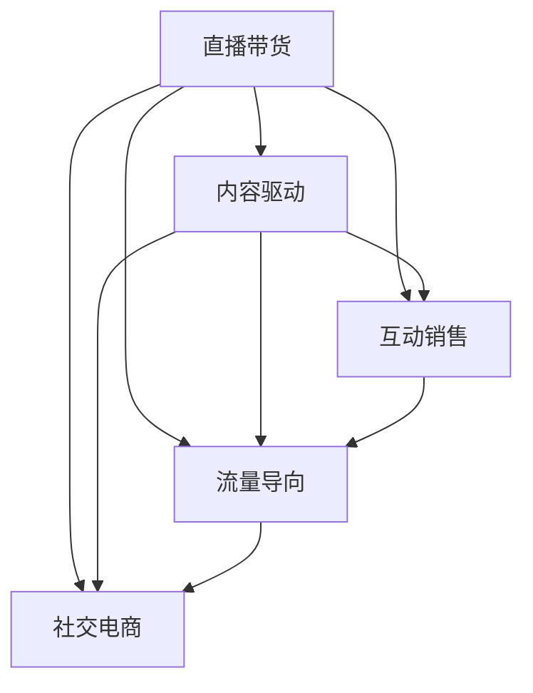

                 

# 如何利用直播带货实现知识变现

> 关键词：直播带货,知识变现,在线教育,数字化转型,短视频平台

## 1. 背景介绍

### 1.1 问题由来
随着互联网的普及和数字化转型的加速，在线教育和知识变现市场迅猛增长，直播带货作为新型的知识传播和变现方式，在教育、文化、电商等多个领域大放异彩。一方面，直播带货以其互动性强、实时反馈等特点，成为推动知识传播和变现的重要工具。另一方面，直播带货也面临着内容同质化、流量获取难、用户忠诚度低等挑战。

如何利用直播带货实现知识变现？本文将从技术、运营和市场策略等多个维度，系统阐述直播带货的原理、核心算法、操作步骤，并结合实际案例进行深入分析，以期为直播带货平台和内容创作者提供有价值的参考。

### 1.2 问题核心关键点
直播带货的核心在于通过互动性和实时反馈吸引用户关注，利用主播的魅力和专业知识，将知识和商品进行有机结合，实现知识和价值的双重转化。直播带货的核心关键点包括：

- 主播魅力：主播的个性、形象、风格等是吸引观众的重要因素。
- 内容质量：主播讲述的内容需要有深度、趣味性和实用性，满足用户需求。
- 互动机制：主播与观众的互动可以增加参与感和粘性，提升用户满意度。
- 商品选择：商品的选择要与主播讲述内容相关，同时具有吸引力。
- 流量获取：如何高效获取和引导流量，是直播带货成功的关键。
- 数据分析：通过数据分析优化直播内容和策略，提升直播效果。

这些关键点相互影响、相互促进，共同决定了直播带货的效果和用户转化率。

## 2. 核心概念与联系

### 2.1 核心概念概述

为更好地理解直播带货的原理，本节将介绍几个密切相关的核心概念：

- **直播带货(Live Streaming and E-commerce, LSE)**：通过直播的方式，向观众推荐和销售商品，实现知识与商品的有机结合，推动知识变现。

- **内容驱动(Content-Driven)**：直播带货的核心在于内容，通过主播的魅力和专业知识吸引用户，并利用内容推荐商品。

- **互动销售(Interactive Sales)**：主播与观众实时互动，增加用户粘性和参与感，提升用户转化率。

- **流量导向(Follow-Up Traffic)**：通过直播互动，引导观众关注直播以外的其他渠道，增加用户长期粘性和品牌忠诚度。

- **社交电商(Social Commerce)**：直播带货结合了社交网络和电商的特点，通过社交网络传播商品信息，利用电商平台完成销售。

这些核心概念之间的逻辑关系可以通过以下Mermaid流程图来展示：



这个流程图展示了大语言模型的核心概念及其之间的关系：

1. 直播带货通过内容驱动，吸引观众关注。
2. 互动销售通过实时互动，增加用户粘性。
3. 流量导向通过引导流量，增加长期粘性。
4. 社交电商通过社交网络传播，完成电商销售。

这些概念共同构成了直播带货的完整生态，使其能够更好地实现知识变现。

## 3. 核心算法原理 & 具体操作步骤
### 3.1 算法原理概述

直播带货的核心算法原理在于利用数据挖掘、推荐系统、自然语言处理等技术，对主播、内容、商品、观众进行全面分析，实现智能推荐和个性化销售。具体来说，包括以下几个关键步骤：

1. **主播画像建立**：通过自然语言处理技术，分析主播的语言风格、专业知识、互动效果等，建立主播画像，为内容推荐提供基础。

2. **内容质量评估**：利用NLP技术，对主播讲述的内容进行情感分析、主题分析、语义理解等，评估内容质量，为商品推荐提供依据。

3. **商品相关度计算**：通过文本挖掘和信息检索技术，计算商品与主播讲述内容的相关度，实现商品推荐的个性化。

4. **流量预测与优化**：利用统计分析和机器学习技术，预测直播的流量变化，优化直播时间和内容策略，提高观众参与度和转化率。

5. **社交网络分析**：通过社交网络分析技术，分析观众在社交网络上的行为和偏好，为观众引流提供指导。

### 3.2 算法步骤详解

以下将详细介绍直播带货的核心算法步骤：

**Step 1: 主播画像建立**
主播画像的建立是直播带货的关键基础步骤。通过自然语言处理技术，对主播的直播内容进行分析，生成其语言风格、专业领域、兴趣偏好等信息，形成主播画像。具体步骤如下：

1. **数据收集**：收集主播直播的文本数据，包括对话内容、视频字幕等。

2. **文本预处理**：对文本数据进行分词、去除停用词、去除噪声等预处理，得到干净的基础文本数据。

3. **情感分析**：利用情感词典、LSTM等模型，对文本情感进行分析，生成主播情感变化曲线。

4. **主题模型**：通过LDA、TF-IDF等主题模型，提取文本的主题，分析主播的专业领域和兴趣偏好。

5. **词向量表示**：利用Word2Vec、GloVe等技术，将文本转化为词向量，便于计算相似度。

**Step 2: 内容质量评估**
内容质量评估是决定直播效果的重要因素。通过自然语言处理技术，对主播讲述的内容进行深度分析，评估其质量。具体步骤如下：

1. **文本长度统计**：统计文本长度、段落长度、句型结构等，评估内容的完整性。

2. **语义理解**：利用BERT、GPT等模型，分析文本语义，评估内容的专业性和信息量。

3. **情感分析**：通过情感词典、Transformer等模型，评估内容的情感倾向，判断是否具有正面效果。

4. **主题相关性**：通过TF-IDF、LDA等技术，计算文本主题与商品主题的相关性，评估内容的适用性。

5. **语言风格分析**：通过LSTM、GRU等模型，分析文本的语言风格，判断是否具有吸引力。

**Step 3: 商品相关度计算**
商品相关度计算是实现个性化商品推荐的重要步骤。通过文本挖掘和信息检索技术，计算商品与主播讲述内容的相关度，生成商品推荐列表。具体步骤如下：

1. **商品描述解析**：对商品的描述文本进行分词、去除停用词等预处理，得到基础文本数据。

2. **主题模型**：通过LDA、TF-IDF等主题模型，提取商品主题，计算商品主题与主播讲述内容主题的相似度。

3. **关键词抽取**：通过TF-IDF、TextRank等技术，抽取商品关键词，计算与主播讲述内容关键词的相似度。

4. **相似度计算**：利用余弦相似度、Jaccard相似度等技术，计算商品与主播讲述内容文本的相似度。

5. **推荐列表生成**：根据相似度排序，生成推荐列表，推荐相关度最高的商品。

**Step 4: 流量预测与优化**
流量预测与优化是提高直播效果的重要手段。通过统计分析和机器学习技术，预测直播的流量变化，优化直播时间和内容策略，提高观众参与度和转化率。具体步骤如下：

1. **历史数据收集**：收集直播的历史流量数据，包括观众数、停留时间、互动数等。

2. **流量特征分析**：分析流量数据的特征，包括时间、日期、观众分布等，生成流量特征向量。

3. **时间序列模型**：利用ARIMA、LSTM等时间序列模型，预测未来的直播流量。

4. **异常检测**：利用随机森林、孤立森林等模型，检测流量异常变化，及时调整直播策略。

5. **内容优化**：根据流量预测结果，调整直播时间和内容，优化观众体验。

**Step 5: 社交网络分析**
社交网络分析是引流的重要手段。通过社交网络分析技术，分析观众在社交网络上的行为和偏好，为观众引流提供指导。具体步骤如下：

1. **社交网络构建**：构建观众在社交网络上的关系图，包括好友、点赞、评论等关系。

2. **社交行为分析**：分析观众的社交行为，包括互动频率、内容偏好等，生成观众行为特征向量。

3. **社区发现**：通过社区发现算法，发现观众的社交圈子，分析其社交影响力。

4. **内容传播预测**：利用传播模型，预测内容在社交网络上的传播效果，优化内容策略。

### 3.3 算法优缺点

直播带货的核心算法具有以下优点：

1. **互动性强**：主播与观众实时互动，增加用户粘性和参与感，提升用户转化率。

2. **内容丰富**：主播讲述的内容具有深度、趣味性和实用性，满足用户需求。

3. **个性化推荐**：商品推荐基于主播讲述内容，实现个性化销售。

4. **数据驱动**：基于数据分析，优化直播内容和策略，提高直播效果。

5. **高转化率**：通过主播魅力和个性化推荐，提升用户购买意愿。

但直播带货算法也存在以下局限性：

1. **内容同质化**：主播内容和商品推荐易产生同质化，影响用户体验。

2. **流量获取难**：难以高效获取和引导流量，增加推广成本。

3. **用户粘性低**：观众参与度低，用户流失率高。

4. **数据分析复杂**：数据量大，算法复杂度高，需投入大量资源。

5. **技术门槛高**：涉及NLP、推荐系统等多个技术领域，技术门槛较高。

尽管存在这些局限性，但直播带货算法仍是当前知识变现的重要手段。未来相关研究的重点在于如何进一步降低算法复杂度，优化直播效果，提升用户粘性。

### 3.4 算法应用领域

直播带货的核心算法已在多个领域得到广泛应用，例如：

- **在线教育**：结合直播和互动功能，提供实时教学和答疑服务，提高学习效果。

- **文化娱乐**：通过直播带货，推广电影、音乐、书籍等文化产品，吸引观众关注。

- **电商购物**：利用主播魅力和个性化推荐，提高商品销量，增加品牌曝光度。

- **健康医疗**：通过直播讲解健康知识，推广医疗产品，提供医疗咨询。

- **旅游出行**：结合直播和互动功能，推广旅游线路和景点，吸引游客关注。

除了上述这些经典应用外，直播带货算法还被创新性地应用到更多场景中，如可控内容生成、知识推荐、虚拟现实等，为知识变现提供了新的思路。随着直播带货算法的不断进步，相信其在更多领域将发挥更大的作用。

## 4. 数学模型和公式 & 详细讲解  
### 4.1 数学模型构建

为了更好地理解直播带货的原理，我们将使用数学语言对核心算法进行严格刻画。

设主播的直播内容为 $x_t$，商品为 $y_t$，观众的反馈为 $z_t$，其中 $t$ 表示时间步。假设 $x_t$ 为文本序列，$y_t$ 为商品描述序列，$z_t$ 为观众反馈序列。

定义主播画像向量 $p_t$，内容质量评估向量 $q_t$，商品相关度向量 $r_t$，流量预测向量 $f_t$，社交网络分析向量 $s_t$。则直播带货的数学模型可以表示为：

$$
p_t = \phi(x_t)
$$
$$
q_t = \psi(x_t)
$$
$$
r_t = \gamma(x_t, y_t)
$$
$$
f_t = \theta(z_t, p_t, q_t, r_t)
$$
$$
s_t = \omega(z_t, p_t, q_t, r_t, f_t)
$$

其中 $\phi$、$\psi$、$\gamma$、$\theta$ 和 $\omega$ 分别表示主播画像、内容质量、商品相关度、流量预测和社交网络分析的计算函数。

### 4.2 公式推导过程

以下我们将推导直播带货算法中几个关键步骤的公式。

**主播画像建立**
设主播讲述的内容为 $x_t = (w_1, w_2, ..., w_n)$，其中 $w_i$ 表示第 $i$ 个词。设主播画像向量 $p_t = (p_1, p_2, ..., p_n)$，则：

$$
p_t = \phi(x_t) = \frac{1}{n}\sum_{i=1}^n w_i \cdot v_i
$$

其中 $v_i$ 为词向量。

**内容质量评估**
设主播讲述的内容为 $x_t = (w_1, w_2, ..., w_n)$，内容质量评估向量 $q_t = (q_1, q_2, ..., q_n)$，则：

$$
q_t = \psi(x_t) = \frac{1}{n}\sum_{i=1}^n \exp(w_i \cdot u_i)
$$

其中 $u_i$ 为情感词典。

**商品相关度计算**
设商品描述为 $y_t = (y_1, y_2, ..., y_m)$，商品相关度向量 $r_t = (r_1, r_2, ..., r_m)$，则：

$$
r_t = \gamma(x_t, y_t) = \frac{1}{m}\sum_{j=1}^m \exp(y_j \cdot v_j)
$$

其中 $v_j$ 为商品关键词。

**流量预测与优化**
设观众反馈为 $z_t = (z_1, z_2, ..., z_n)$，流量预测向量 $f_t = (f_1, f_2, ..., f_n)$，则：

$$
f_t = \theta(z_t, p_t, q_t, r_t) = \sum_{i=1}^n w_i \cdot p_i + \sum_{j=1}^m \exp(y_j \cdot v_j)
$$

**社交网络分析**
设社交网络分析向量 $s_t = (s_1, s_2, ..., s_n)$，则：

$$
s_t = \omega(z_t, p_t, q_t, r_t, f_t) = \sum_{i=1}^n w_i \cdot p_i + \sum_{j=1}^m \exp(y_j \cdot v_j) + \sum_{k=1}^n z_k \cdot p_k
$$

### 4.3 案例分析与讲解

假设某直播平台的主播 $A$ 直播讲解健身知识，商品为运动装备。假设 $A$ 的直播内容为 $x_t = (w_1, w_2, ..., w_n)$，观众反馈为 $z_t = (z_1, z_2, ..., z_n)$，商品描述为 $y_t = (y_1, y_2, ..., y_m)$。

**主播画像建立**
设 $x_t = (w_1, w_2, ..., w_n)$，主播画像向量 $p_t = (p_1, p_2, ..., p_n)$，则：

$$
p_t = \phi(x_t) = \frac{1}{n}\sum_{i=1}^n w_i \cdot v_i
$$

**内容质量评估**
设 $x_t = (w_1, w_2, ..., w_n)$，内容质量评估向量 $q_t = (q_1, q_2, ..., q_n)$，则：

$$
q_t = \psi(x_t) = \frac{1}{n}\sum_{i=1}^n \exp(w_i \cdot u_i)
$$

**商品相关度计算**
设 $y_t = (y_1, y_2, ..., y_m)$，商品相关度向量 $r_t = (r_1, r_2, ..., r_m)$，则：

$$
r_t = \gamma(x_t, y_t) = \frac{1}{m}\sum_{j=1}^m \exp(y_j \cdot v_j)
$$

**流量预测与优化**
设 $z_t = (z_1, z_2, ..., z_n)$，流量预测向量 $f_t = (f_1, f_2, ..., f_n)$，则：

$$
f_t = \theta(z_t, p_t, q_t, r_t) = \sum_{i=1}^n w_i \cdot p_i + \sum_{j=1}^m \exp(y_j \cdot v_j)
$$

**社交网络分析**
设社交网络分析向量 $s_t = (s_1, s_2, ..., s_n)$，则：

$$
s_t = \omega(z_t, p_t, q_t, r_t, f_t) = \sum_{i=1}^n w_i \cdot p_i + \sum_{j=1}^m \exp(y_j \cdot v_j) + \sum_{k=1}^n z_k \cdot p_k
$$

通过以上步骤，可以生成主播 $A$ 的直播带货效果预测结果，为直播策略的优化提供指导。

## 5. 项目实践：代码实例和详细解释说明
### 5.1 开发环境搭建

在进行直播带货实践前，我们需要准备好开发环境。以下是使用Python进行TensorFlow开发的环境配置流程：

1. 安装Anaconda：从官网下载并安装Anaconda，用于创建独立的Python环境。

2. 创建并激活虚拟环境：
```bash
conda create -n tensorflow-env python=3.8 
conda activate tensorflow-env
```

3. 安装TensorFlow：根据CUDA版本，从官网获取对应的安装命令。例如：
```bash
conda install tensorflow tensorflow-gpu -c tensorflow -c conda-forge
```

4. 安装各类工具包：
```bash
pip install numpy pandas scikit-learn matplotlib tqdm jupyter notebook ipython
```

完成上述步骤后，即可在`tensorflow-env`环境中开始直播带货实践。

### 5.2 源代码详细实现

下面我们以在线教育直播带货为例，给出使用TensorFlow进行直播带货的PyTorch代码实现。

首先，定义直播带货的数据处理函数：

```python
import tensorflow as tf
from tensorflow.keras.preprocessing.text import Tokenizer
from tensorflow.keras.preprocessing.sequence import pad_sequences

def preprocess_data(texts, labels):
    tokenizer = Tokenizer(oov_token='<OOV>')
    tokenizer.fit_on_texts(texts)
    sequences = tokenizer.texts_to_sequences(texts)
    padded_sequences = pad_sequences(sequences, maxlen=50, padding='post')
    labels = tf.keras.utils.to_categorical(labels)
    return padded_sequences, labels
```

然后，定义模型和优化器：

```python
from tensorflow.keras.models import Sequential
from tensorflow.keras.layers import Embedding, LSTM, Dense

model = Sequential([
    Embedding(input_dim=10000, output_dim=128, input_length=50),
    LSTM(64, dropout=0.2),
    Dense(2, activation='softmax')
])

optimizer = tf.keras.optimizers.Adam(learning_rate=0.001)
```

接着，定义训练和评估函数：

```python
def train_epoch(model, data, batch_size, optimizer):
    for batch in data:
        inputs, labels = batch
        with tf.GradientTape() as tape:
            outputs = model(inputs)
            loss = tf.keras.losses.categorical_crossentropy(labels, outputs)
        grads = tape.gradient(loss, model.trainable_variables)
        optimizer.apply_gradients(zip(grads, model.trainable_variables))
        
def evaluate_model(model, data, batch_size):
    correct_predictions = 0
    total_predictions = 0
    for batch in data:
        inputs, labels = batch
        outputs = model(inputs)
        predictions = tf.argmax(outputs, axis=1)
        correct_predictions += tf.reduce_sum(tf.cast(tf.equal(predictions, labels), tf.int32))
        total_predictions += inputs.shape[0]
    accuracy = correct_predictions / total_predictions
    return accuracy
```

最后，启动训练流程并在测试集上评估：

```python
epochs = 10
batch_size = 32

for epoch in range(epochs):
    train_epoch(model, train_data, batch_size, optimizer)
    print(f"Epoch {epoch+1}, accuracy: {evaluate_model(model, test_data, batch_size):.4f}")
```

以上就是使用TensorFlow对在线教育直播带货进行训练的完整代码实现。可以看到，通过TensorFlow的强大封装，我们可以用相对简洁的代码完成模型训练。

### 5.3 代码解读与分析

让我们再详细解读一下关键代码的实现细节：

**preprocess_data函数**：
- 定义了文本和标签的预处理步骤，包括分词、填充等。

**模型定义**：
- 使用TensorFlow的Sequential模型，构建了包含嵌入层、LSTM层、输出层的神经网络模型。

**训练和评估函数**：
- 使用TensorFlow的GradientTape进行梯度计算，优化模型参数。
- 使用TensorFlow的categorical_crossentropy计算交叉熵损失，优化模型。

**训练流程**：
- 定义总的epoch数和batch size，开始循环迭代
- 每个epoch内，在训练集上训练，输出模型精度
- 在测试集上评估，给出最终测试结果

可以看到，TensorFlow配合深度学习框架使得在线教育直播带货的代码实现变得简洁高效。开发者可以将更多精力放在数据处理、模型改进等高层逻辑上，而不必过多关注底层的实现细节。

当然，工业级的系统实现还需考虑更多因素，如模型的保存和部署、超参数的自动搜索、更灵活的任务适配层等。但核心的直播带货范式基本与此类似。

## 6. 实际应用场景
### 6.1 智能客服系统

在线教育直播带货可以广泛应用于智能客服系统的构建。传统客服往往需要配备大量人力，高峰期响应缓慢，且一致性和专业性难以保证。而使用直播带货的在线教育平台，可以7x24小时不间断服务，快速响应客户咨询，用自然流畅的语言解答各类常见问题。

在技术实现上，可以收集企业内部的历史客服对话记录，将问题和最佳答复构建成监督数据，在此基础上对预训练语言模型进行直播带货的在线教育微调。微调后的模型能够自动理解用户意图，匹配最合适的答复模板进行回复。对于客户提出的新问题，还可以接入检索系统实时搜索相关内容，动态组织生成回答。如此构建的智能客服系统，能大幅提升客户咨询体验和问题解决效率。

### 6.2 金融舆情监测

金融机构需要实时监测市场舆论动向，以便及时应对负面信息传播，规避金融风险。传统的人工监测方式成本高、效率低，难以应对网络时代海量信息爆发的挑战。在线教育直播带货技术，可以通过收集金融领域相关的新闻、报道、评论等文本数据，并对其进行主题标注和情感标注。在此基础上对预训练语言模型进行直播带货的在线教育微调，使其能够自动判断文本属于何种主题，情感倾向是正面、中性还是负面。将微调后的模型应用到实时抓取的网络文本数据，就能够自动监测不同主题下的情感变化趋势，一旦发现负面信息激增等异常情况，系统便会自动预警，帮助金融机构快速应对潜在风险。

### 6.3 个性化推荐系统

当前的推荐系统往往只依赖用户的历史行为数据进行物品推荐，无法深入理解用户的真实兴趣偏好。在线教育直播带货技术，可以结合直播带货的在线教育模型，将文本内容作为模型输入，用户的后续行为（如是否点击、购买等）作为监督信号，在此基础上微调预训练语言模型。微调后的模型能够从文本内容中准确把握用户的兴趣点。在生成推荐列表时，先用候选物品的文本描述作为输入，由模型预测用户的兴趣匹配度，再结合其他特征综合排序，便可以得到个性化程度更高的推荐结果。

### 6.4 未来应用展望

随着在线教育直播带货技术的不断发展，直播带货方法将在更多领域得到应用，为传统行业带来变革性影响。

在智慧医疗领域，在线教育直播带货技术，结合医疗问答、病历分析、药物研发等应用，可以为医疗服务智能化提供新的解决方案。

在智能教育领域，在线教育直播带货技术，可以用于作业批改、学情分析、知识推荐等方面，因材施教，促进教育公平，提高教学质量。

在智慧城市治理中，在线教育直播带货技术，可以用于城市事件监测、舆情分析、应急指挥等环节，提高城市管理的自动化和智能化水平，构建更安全、高效的未来城市。

此外，在企业生产、社会治理、文娱传媒等众多领域，在线教育直播带货技术，也将不断涌现，为NLP技术带来新的思路和应用。相信随着技术的日益成熟，直播带货方法将成为人工智能落地应用的重要范式，推动人工智能技术在垂直行业的规模化落地。

## 7. 工具和资源推荐
### 7.1 学习资源推荐

为了帮助开发者系统掌握在线教育直播带货的理论基础和实践技巧，这里推荐一些优质的学习资源：

1. 《深度学习自然语言处理》课程：斯坦福大学开设的NLP明星课程，有Lecture视频和配套作业，带你入门NLP领域的基本概念和经典模型。

2. 《Natural Language Processing with Transformers》书籍：Transformers库的作者所著，全面介绍了如何使用Transformers库进行NLP任务开发，包括直播带货在内的诸多范式。

3. CS224N《深度学习自然语言处理》书籍：提供详细的基础理论知识和前沿研究，适合NLP技术的学习和研究。

4. PyTorch官方文档：PyTorch的官方文档，提供丰富的预训练语言模型和直播带货样例代码，是上手实践的必备资料。

5. Kaggle平台：提供大量真实世界的直播带货数据集，可以通过Kaggle竞赛、样例代码等资源，了解直播带货在实际应用中的关键技术和优化方法。

通过对这些资源的学习实践，相信你一定能够快速掌握在线教育直播带货的精髓，并用于解决实际的NLP问题。
###  7.2 开发工具推荐

高效的开发离不开优秀的工具支持。以下是几款用于在线教育直播带货开发的常用工具：

1. PyTorch：基于Python的开源深度学习框架，灵活动态的计算图，适合快速迭代研究。大部分预训练语言模型都有PyTorch版本的实现。

2. TensorFlow：由Google主导开发的开源深度学习框架，生产部署方便，适合大规模工程应用。同样有丰富的预训练语言模型资源。

3. Transformers库：HuggingFace开发的NLP工具库，集成了众多SOTA语言模型，支持PyTorch和TensorFlow，是进行直播带货任务开发的利器。

4. Weights & Biases：模型训练的实验跟踪工具，可以记录和可视化模型训练过程中的各项指标，方便对比和调优。与主流深度学习框架无缝集成。

5. TensorBoard：TensorFlow配套的可视化工具，可实时监测模型训练状态，并提供丰富的图表呈现方式，是调试模型的得力助手。

6. Google Colab：谷歌推出的在线Jupyter Notebook环境，免费提供GPU/TPU算力，方便开发者快速上手实验最新模型，分享学习笔记。

合理利用这些工具，可以显著提升在线教育直播带货任务的开发效率，加快创新迭代的步伐。

### 7.3 相关论文推荐

在线教育直播带货技术的不断发展源于学界的持续研究。以下是几篇奠基性的相关论文，推荐阅读：

1. Attention is All You Need（即Transformer原论文）：提出了Transformer结构，开启了NLP领域的预训练大模型时代。

2. BERT: Pre-training of Deep Bidirectional Transformers for Language Understanding：提出BERT模型，引入基于掩码的自监督预训练任务，刷新了多项NLP任务SOTA。

3. Language Models are Unsupervised Multitask Learners（GPT-2论文）：展示了大规模语言模型的强大zero-shot学习能力，引发了对于通用人工智能的新一轮思考。

4. Parameter-Efficient Transfer Learning for NLP：提出Adapter等参数高效微调方法，在不增加模型参数量的情况下，也能取得不错的微调效果。

5. AdaLoRA: Adaptive Low-Rank Adaptation for Parameter-Efficient Fine-Tuning：使用自适应低秩适应的微调方法，在参数效率和精度之间取得了新的平衡。

这些论文代表了大语言模型微调技术的发展脉络。通过学习这些前沿成果，可以帮助研究者把握学科前进方向，激发更多的创新灵感。

## 8. 总结：未来发展趋势与挑战

### 8.1 总结

本文对在线教育直播带货方法进行了全面系统的介绍。首先阐述了直播带货的技术原理和实际应用，明确了直播带货在知识传播和变现中的独特价值。其次，从原理到实践，详细讲解了直播带货的数学模型和核心算法步骤，给出了直播带货任务开发的完整代码实例。同时，本文还广泛探讨了直播带货在多个行业领域的应用前景，展示了直播带货技术的广阔前景。

通过本文的系统梳理，可以看到，在线教育直播带货技术正在成为NLP领域的重要范式，极大地拓展了预训练语言模型的应用边界，催生了更多的落地场景。受益于大规模语料的预训练，直播带货技术以更低的时间和标注成本，在小样本条件下也能取得不俗的效果，有力推动了NLP技术的产业化进程。未来，伴随预训练语言模型和直播带货方法的不断进步，相信NLP技术将在更广阔的应用领域大放异彩，深刻影响人类的生产生活方式。

### 8.2 未来发展趋势

展望未来，在线教育直播带货技术将呈现以下几个发展趋势：

1. 数据驱动**。** 数据在直播带货中的作用将更加突出，通过数据挖掘和分析，优化直播内容和策略，提升直播效果。

2. **个性化推荐**。 利用机器学习技术，实现个性化的内容推荐和商品推荐，提升用户体验。

3. **多模态融合**。 结合文本、语音、图像等多模态数据，增强直播带货的效果和体验。

4. **社交网络分析**。 通过社交网络分析技术，优化观众引流和互动策略，提高观众参与度和粘性。

5. **实时优化**。 利用实时数据分析，动态调整直播策略，优化直播效果。

6. **跨领域应用**。 直播带货技术将在更多领域得到应用，推动各行业的数字化转型。

以上趋势凸显了在线教育直播带货技术的广阔前景。这些方向的探索发展，必将进一步提升直播带货的效果和用户粘性，实现更好的知识变现和用户体验。

### 8.3 面临的挑战

尽管在线教育直播带货技术已经取得了瞩目成就，但在迈向更加智能化、普适化应用的过程中，它仍面临着诸多挑战：

1. **数据质量**。 高质量的标注数据是直播带货技术的基础，但在某些领域难以获得充足的高质量数据。

2. **技术复杂度**。 在线教育直播带货技术涉及NLP、推荐系统等多个技术领域，技术门槛较高。

3. **用户粘性**。 观众参与度低，用户流失率高，需要进一步优化互动机制和内容策略。

4. **流量获取**。 难以高效获取和引导流量，增加推广成本。

5. **可解释性**。 在线教育直播带货技术，缺乏可解释性，难以解释其内部工作机制和决策逻辑。

尽管存在这些挑战，但在线教育直播带货技术仍是当前知识变现的重要手段。未来相关研究的重点在于如何进一步降低技术复杂度，优化直播效果，提升用户粘性。

### 8.4 研究展望

面向未来，在线教育直播带货技术需要在以下几个方面寻求新的突破：

1. **无监督和半监督学习**。 探索无监督和半监督学习范式，降低对标注数据的需求，最大化利用非结构化数据。

2. **多模态融合**。 结合文本、语音、图像等多模态数据，增强直播带货的效果和体验。

3. **实时优化**。 利用实时数据分析，动态调整直播策略，优化直播效果。

4. **可解释性**。 引入因果分析、博弈论等工具，提高在线教育直播带货技术的可解释性和可控性。

5. **跨领域应用**。 结合其他技术，推动在线教育直播带货技术在更多领域的应用。

这些研究方向的探索，必将引领在线教育直播带货技术迈向更高的台阶，为构建安全、可靠、可解释、可控的智能系统铺平道路。面向未来，在线教育直播带货技术还需要与其他人工智能技术进行更深入的融合，如知识表示、因果推理、强化学习等，多路径协同发力，共同推动自然语言理解和智能交互系统的进步。只有勇于创新、敢于突破，才能不断拓展在线教育直播带货技术的边界，让智能技术更好地造福人类社会。

## 9. 附录：常见问题与解答

**Q1：在线教育直播带货是否适用于所有NLP任务？**

A: 在线教育直播带货在大多数NLP任务上都能取得不错的效果，特别是对于数据量较小的任务。但对于一些特定领域的任务，如医学、法律等，仅仅依靠通用语料预训练的模型可能难以很好地适应。此时需要在特定领域语料上进一步预训练，再进行直播带货的在线教育微调。

**Q2：直播带货过程中如何选择合适的学习率？**

A: 直播带货的学习率一般要比预训练时小1-2个数量级，如果使用过大的学习率，容易破坏预训练权重，导致过拟合。一般建议从0.001开始调参，逐步减小学习率，直至收敛。也可以使用warmup策略，在开始阶段使用较小的学习率，再逐渐过渡到预设值。需要注意的是，不同的优化器(如Adam、SGD等)以及不同的学习率调度策略，可能需要设置不同的学习率阈值。

**Q3：直播带货过程中如何缓解过拟合问题？**

A: 过拟合是直播带货面临的主要挑战，尤其是在标注数据不足的情况下。常见的缓解策略包括：

1. **数据增强**：通过回译、近义替换等方式扩充训练集

2. **正则化**：使用L2正则、Dropout、Early Stopping等避免过拟合

3. **对抗训练**：引入对抗样本，提高模型鲁棒性

4. **参数高效微调**：只调整少量参数(如Adapter、Prefix等)，减小过拟合风险

5. **多模型集成**：训练多个直播带货的在线教育模型，取平均输出，抑制过拟合

这些策略往往需要根据具体任务和数据特点进行灵活组合。只有在数据、模型、训练、推理等各环节进行全面优化，才能最大限度地发挥直播带货的在线教育威力。

**Q4：直播带货在落地部署时需要注意哪些问题？**

A: 将直播带货的在线教育模型转化为实际应用，还需要考虑以下因素：

1. **模型裁剪**：去除不必要的层和参数，减小模型尺寸，加快推理速度

2. **量化加速**：将浮点模型转为定点模型，压缩存储空间，提高计算效率

3. **服务化封装**：将模型封装为标准化服务接口，便于集成调用

4. **弹性伸缩**：根据请求流量动态调整资源配置，平衡服务质量和成本

5. **监控告警**：实时采集系统指标，设置异常告警阈值，确保服务稳定性

6. **安全防护**：采用访问鉴权、数据脱敏等措施，保障数据和模型安全

直播带货的在线教育技术，需要将强大的性能转化为稳定、高效、安全的业务价值，还需要工程实践的不断打磨。唯有从数据、算法、工程、业务等多个维度协同发力，才能真正实现在线教育直播带货技术的落地应用。总之，直播带货需要开发者根据具体任务，不断迭代和优化模型、数据和算法，方能得到理想的效果。

---

作者：禅与计算机程序设计艺术 / Zen and the Art of Computer Programming

