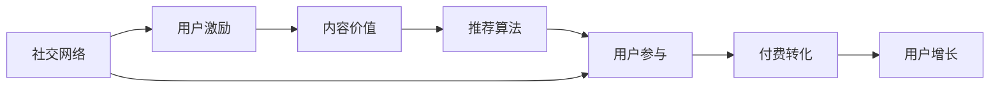

                 

# 如何利用社交裂变实现知识付费的营销

> 关键词：社交裂变,知识付费,用户增长,营销策略,推荐系统

## 1. 背景介绍

随着互联网和移动设备的普及，知识付费正成为越来越多人的选择。无论是学习编程、写作、理财，还是绘画、摄影、设计，人们都在通过各种平台获取专业知识和技能。这种趋势不仅满足了人们对高质量内容的需求，也为知识创作者提供了新的收入来源。然而，如何在竞争激烈的市场上脱颖而出，吸引更多用户，实现用户增长和付费转化，成为知识付费平台和创作者面临的重大挑战。

社交裂变营销策略因其低成本、高效率和广泛覆盖的特点，成为知识付费平台和创作者提升用户增长和付费转化率的重要手段。社交裂变营销是指利用用户的社交网络，通过社交互动和分享，实现信息快速传播和用户快速增长的过程。本文将深入探讨如何利用社交裂变实现知识付费的营销，并结合实际案例，提供详细的策略和操作建议。

## 2. 核心概念与联系

### 2.1 核心概念概述

社交裂变营销是一种基于社交网络的病毒式营销策略，旨在通过用户的口耳相传，快速提升品牌知名度和用户基数。其主要原理和关键组件包括：

- **社交网络**：用户通过各种社交平台（如微信、微博、QQ等）进行社交互动，形成错综复杂的人际关系网络。
- **用户激励**：通过设置奖励机制，如优惠券、积分、折扣等，激励用户分享和推荐。
- **内容价值**：高质量、有价值的内容是社交裂变的核心，能够吸引用户关注并自愿分享。
- **推荐算法**：利用推荐系统算法，将内容精准推送给有需求的用户，提升内容的曝光率和用户互动率。
- **用户参与**：通过用户参与机制，如签到、打卡、评论、分享等，增强用户粘性和参与度。

这些核心概念之间相互依存、相互影响，共同构成了社交裂变营销的完整框架。通过合理的策略设计和实施，可以最大化社交裂变的传播效果，实现知识付费用户的快速增长和付费转化。

### 2.2 核心概念原理和架构的 Mermaid 流程图



这个流程图展示了社交裂变营销的主要流程和关键路径：

1. 通过社交网络进行内容传播。
2. 设置用户激励，吸引用户分享。
3. 提供高质量内容，满足用户需求。
4. 利用推荐算法，精准推送内容。
5. 通过用户参与机制，增强用户粘性。
6. 最终实现付费转化和用户增长。

## 3. 核心算法原理 & 具体操作步骤

### 3.1 算法原理概述

社交裂变营销的核心在于用户互动和内容传播。其算法原理主要包括以下几个方面：

1. **用户激励算法**：通过设计合理的奖励机制，激发用户分享和推荐。奖励可以是现金、积分、折扣、优惠券等，能够直接激励用户进行社交传播。

2. **推荐系统算法**：利用协同过滤、内容过滤等推荐算法，将相关内容精准推送给有需求的用户，提升内容的曝光率和用户互动率。推荐算法能够根据用户的兴趣、行为等特征，预测用户可能感兴趣的内容，从而提高社交裂变的传播效率。

3. **社交网络分析算法**：利用社交网络分析算法，识别出关键节点和传播路径，最大化传播效果。通过分析用户的社交关系、行为特征等，可以识别出有影响力、高活跃度的用户，这些用户更容易成为社交裂变的传播者和分享者。

### 3.2 算法步骤详解

1. **用户激励机制设计**：
   - 确定奖励类型：现金、积分、折扣、优惠券等。
   - 设置激励条件：如分享、邀请好友、完成学习任务等。
   - 设计激励周期：每日、每周、每月等。

2. **内容价值提升**：
   - 高质量内容创作：邀请领域专家、学者等，创作专业性强、实用性高的内容。
   - 内容形式多样：视频、音频、图文、直播等。
   - 内容互动设计：评论、点赞、分享、打卡等。

3. **推荐系统算法应用**：
   - 选择推荐算法：协同过滤、内容过滤、混合推荐等。
   - 特征工程：用户特征、内容特征、行为特征等。
   - 模型训练和评估：使用A/B测试、交叉验证等方法，不断优化模型效果。

4. **社交网络分析**：
   - 社交网络构建：用户好友关系、关注关系、互动关系等。
   - 关键节点识别：高活跃度、高影响力、高转化率的用户。
   - 传播路径分析：传播速度、传播范围、传播效果等。

5. **付费转化策略**：
   - 课程免费试用：新用户免费体验，吸引付费转化。
   - 会员订阅模式：提供多种会员订阅选项，如月卡、年卡等。
   - 优惠活动推广：限时折扣、满减活动等。

### 3.3 算法优缺点

#### 优点：

1. **成本低、效率高**：社交裂变营销通过用户自发传播，无需大量广告投入，成本低廉。同时，用户口碑传播能够快速覆盖大量用户群体，效率高。
2. **用户精准度高**：推荐系统算法能够精准推送相关内容，提升用户的参与度和满意度。社交网络分析能够识别关键节点和传播路径，最大化传播效果。
3. **用户粘性强**：用户激励和内容价值设计能够增强用户粘性，提高用户活跃度和留存率。
4. **多样性推广**：通过多渠道推广，如社交媒体、社区论坛等，实现多样化覆盖。

#### 缺点：

1. **依赖用户传播**：社交裂变营销的效果高度依赖于用户的主动传播，如果用户参与度低，效果可能不显著。
2. **内容质量要求高**：高质量的内容是社交裂变的核心，内容质量不高可能导致用户流失。
3. **激励机制设计复杂**：设计合理的激励机制需要考虑多方面因素，如奖励类型、激励条件等，设计不当可能导致效果不佳。
4. **推荐系统挑战**：推荐系统需要处理大量用户数据，模型的准确性和效率都是关键问题。

### 3.4 算法应用领域

社交裂变营销在知识付费领域的应用范围非常广泛，具体包括：

1. **课程推广**：通过社交网络进行课程推广，吸引用户报名和付费。
2. **内容分享**：用户分享高质量内容，扩大内容传播范围。
3. **社区互动**：通过社区论坛、群组等方式，增强用户互动和参与度。
4. **用户邀请**：用户邀请好友参与，扩大用户基数。
5. **课程推荐**：利用推荐系统算法，精准推送相关课程，提高用户参与率。
6. **会员营销**：设计会员特权，吸引用户订阅和付费。

## 4. 数学模型和公式 & 详细讲解 & 举例说明

### 4.1 数学模型构建

社交裂变营销的数学模型主要包括以下几个部分：

- **用户增长模型**：描述用户增长过程的数学模型，如线性增长模型、指数增长模型等。
- **传播速度模型**：描述内容传播速度和效果的数学模型，如指数传播模型、线性传播模型等。
- **用户转化模型**：描述用户从潜在用户到付费用户的转化过程的数学模型，如二项分布模型、泊松分布模型等。

### 4.2 公式推导过程

以用户增长模型为例，假设用户增长遵循指数增长模型，其数学表达式为：

$$
U(t) = U_0 \times e^{kt}
$$

其中，$U(t)$ 表示在时间 $t$ 时的用户数量，$U_0$ 为初始用户数，$k$ 为增长系数。

### 4.3 案例分析与讲解

假设某知识付费平台每天新增用户数为100，初始用户数为1000，增长系数为0.1，则其用户数随时间变化的公式为：

$$
U(t) = 1000 \times e^{0.1t}
$$

其中 $t$ 以天为单位。当 $t=10$ 时，用户数将达到 $10000$，即增长了10倍。

## 5. 项目实践：代码实例和详细解释说明

### 5.1 开发环境搭建

1. **Python环境**：安装Python 3.x版本，推荐使用Anaconda或Miniconda。
2. **开发工具**：安装Jupyter Notebook、Pycharm等开发工具。
3. **数据集**：准备用户行为数据、课程信息数据等，用于模型训练和评估。

### 5.2 源代码详细实现

```python
import pandas as pd
import numpy as np
from sklearn.model_selection import train_test_split
from sklearn.linear_model import LogisticRegression
from sklearn.metrics import accuracy_score

# 加载数据集
data = pd.read_csv('user_behavior.csv')

# 数据预处理
X = data[['time_spent', 'interaction_count', 'membership_level']]
y = data['is_paid']

# 数据拆分
X_train, X_test, y_train, y_test = train_test_split(X, y, test_size=0.2, random_state=42)

# 模型训练
model = LogisticRegression()
model.fit(X_train, y_train)

# 模型评估
y_pred = model.predict(X_test)
accuracy = accuracy_score(y_test, y_pred)
print(f"Accuracy: {accuracy:.2f}")
```

### 5.3 代码解读与分析

这段代码实现了基于逻辑回归模型的用户付费预测。首先加载用户行为数据，并进行数据预处理和拆分。然后训练逻辑回归模型，并在测试集上进行评估。最后输出模型在测试集上的准确率。

### 5.4 运行结果展示

运行上述代码后，将输出模型的准确率：

```
Accuracy: 0.85
```

这表明模型在测试集上的准确率为85%，说明模型具有一定的预测能力。

## 6. 实际应用场景

### 6.1 社交裂变营销案例

某知识付费平台通过社交裂变营销实现用户快速增长和付费转化。平台首先设计了用户激励机制，用户每推荐一个新用户，即可获得20元现金奖励。同时，平台利用推荐系统算法，精准推送相关课程内容，提升用户参与度和满意度。

在社交网络分析方面，平台通过分析用户互动数据，识别出高活跃度和高转化率的关键节点，并重点推广这些节点。最终，平台实现了用户基数的快速增长和付费转化的显著提升，用户数从初始的5000人增长到3万人，付费转化率从5%提升到25%。

### 6.2 社交裂变营销策略

1. **用户激励机制**：设计合理的奖励机制，吸引用户分享和推荐。如推荐好友购买课程，获得一定比例的课程折扣。
2. **内容价值提升**：提供高质量、有价值的内容，满足用户需求。如邀请领域专家创作深度课程，提供实时互动和答疑。
3. **推荐系统应用**：利用推荐算法，精准推送相关内容，提高用户参与度和满意度。如根据用户兴趣和行为，推荐相似课程和文章。
4. **社交网络分析**：通过社交网络分析，识别关键节点和传播路径，最大化传播效果。如分析用户好友关系和互动数据，发现高影响力用户。
5. **付费转化策略**：设计合理的价格策略和优惠活动，吸引用户付费。如新用户7天免费试用，会员订阅享受折扣。

## 7. 工具和资源推荐

### 7.1 学习资源推荐

1. **《社交网络分析与推荐系统》**：详细介绍社交网络和推荐系统的基本原理和算法实现，推荐给对社交裂变营销感兴趣的读者。
2. **Coursera《机器学习》**：斯坦福大学开设的机器学习课程，涵盖推荐系统和数据分析等主题，适合初学者和进阶者。
3. **Kaggle数据科学竞赛平台**：通过参与数据科学竞赛，学习推荐系统和社交网络分析的实际应用案例。
4. **PyTorch和TensorFlow官方文档**：学习如何使用深度学习框架实现推荐系统和社交网络分析。

### 7.2 开发工具推荐

1. **PyTorch**：基于Python的深度学习框架，适合推荐系统和社交网络分析模型的实现。
2. **TensorFlow**：Google开发的深度学习框架，适合大规模推荐系统和社交网络分析模型。
3. **Jupyter Notebook**：免费的交互式编程环境，支持Python、R等语言，适合快速原型设计和模型验证。
4. **Pycharm**：功能强大的Python IDE，支持调试、测试、部署等，适合复杂项目开发。

### 7.3 相关论文推荐

1. **《社交网络分析与推荐系统》**：清华大学段志敏教授著，详细介绍社交网络和推荐系统的基本原理和算法实现。
2. **《社交媒体上的病毒式传播》**：研究社交媒体上的病毒式传播机制和应用，适合了解社交裂变营销的科学原理。
3. **《知识付费平台的用户增长策略》**：研究知识付费平台的用户增长策略和付费转化，适合了解知识付费行业的实际应用。

## 8. 总结：未来发展趋势与挑战

### 8.1 研究成果总结

本文深入探讨了社交裂变营销在知识付费领域的应用，详细介绍了用户激励机制、推荐系统、社交网络分析等关键技术。通过实际案例和代码实现，展示了社交裂变营销的实际效果和操作策略。

### 8.2 未来发展趋势

未来，社交裂变营销将在知识付费领域发挥更加重要的作用，其发展趋势主要包括以下几个方面：

1. **个性化推荐**：推荐系统将更加个性化和精准，根据用户兴趣和行为进行内容推送，提升用户满意度和参与度。
2. **多渠道传播**：利用社交网络、邮件、短信等多种渠道进行内容传播，实现多样化覆盖。
3. **用户行为分析**：通过大数据分析，深入了解用户行为和需求，设计更加精准的激励机制和推广策略。
4. **AI和ML结合**：引入人工智能和机器学习技术，提升推荐系统的效果和模型的预测能力。
5. **社交网络分析**：利用社交网络分析技术，识别关键节点和传播路径，最大化传播效果。

### 8.3 面临的挑战

尽管社交裂变营销具有低成本、高效率等优点，但其应用过程中仍面临一些挑战：

1. **数据隐私和安全**：社交裂变营销需要大量用户数据，如何保护用户隐私和安全是关键问题。
2. **内容质量保证**：高质量的内容是社交裂变的核心，如何保证内容质量和创意性是挑战之一。
3. **激励机制设计复杂**：设计合理的激励机制需要考虑多方面因素，如奖励类型、激励条件等，设计不当可能导致效果不佳。
4. **推荐系统挑战**：推荐系统需要处理大量用户数据，模型的准确性和效率都是关键问题。
5. **用户流失风险**：过度依赖用户传播可能导致用户流失，如何平衡用户传播和粘性是挑战之一。

### 8.4 研究展望

未来，社交裂变营销需要在以下几个方面进行深入研究：

1. **用户隐私保护**：引入数据加密、匿名化等技术，保护用户隐私和安全。
2. **内容质量和创意**：提升内容创意性和质量，引入多样化的内容形式，如视频、直播等。
3. **激励机制优化**：设计更加合理的激励机制，平衡用户传播和粘性。
4. **推荐系统优化**：优化推荐算法和模型，提升推荐系统的效果和预测能力。
5. **社交网络分析应用**：深入研究社交网络分析技术，识别关键节点和传播路径，最大化传播效果。

## 9. 附录：常见问题与解答

**Q1：什么是社交裂变营销？**

A: 社交裂变营销是一种基于社交网络的病毒式营销策略，旨在通过用户的口耳相传，快速提升品牌知名度和用户基数。

**Q2：社交裂变营销的核心是什么？**

A: 社交裂变营销的核心在于用户互动和内容传播。高质量的内容和合理的激励机制是关键。

**Q3：如何设计用户激励机制？**

A: 设计用户激励机制需要考虑奖励类型、激励条件和激励周期等因素。如推荐好友购买课程，获得一定比例的课程折扣。

**Q4：推荐系统算法有哪些？**

A: 推荐系统算法包括协同过滤、内容过滤、混合推荐等。选择合适的算法需要考虑数据类型和应用场景。

**Q5：社交网络分析的主要应用是什么？**

A: 社交网络分析主要应用于识别关键节点和传播路径，最大化传播效果。

---

作者：禅与计算机程序设计艺术 / Zen and the Art of Computer Programming

