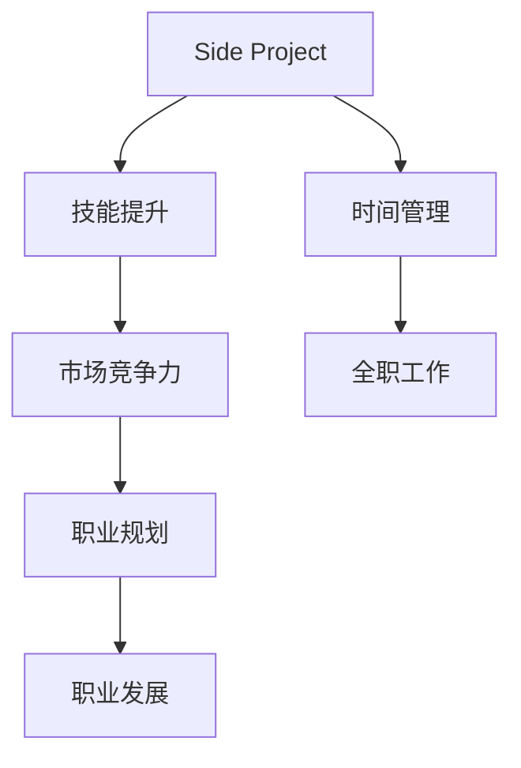

                 

# 如何将Side Project转化为主业

## 1. 背景介绍

### 1.1 问题由来
随着技术的进步和市场的需求，越来越多的人开始从兼职或者业余爱好项目（Side Project）转型为主业。从初级开发者到高级工程师，从自由职业者到初创公司的创始人，转型过程充满了挑战和机遇。这篇博客将详细探讨如何将Side Project顺利转型为主业，并分享一些实用的策略和工具。

### 1.2 问题核心关键点
转型过程中，以下是核心问题：
- **技术能力的提升**：从兼职项目到全职工作，需要系统化和深入的技能提升。
- **时间管理**：平衡兼职项目与全职工作的需求，合理分配时间和精力。
- **市场竞争力**：如何利用兼职项目的经验和成果，在全职工作中提升竞争力。
- **业务模式的转变**：从个人项目到团队合作，需要适应和掌握新的业务模式。
- **职业规划**：明确职业发展方向，并制定相应的策略和计划。

本文将围绕这些核心问题，详细探讨如何成功将Side Project转型为主业。

### 1.3 问题研究意义
转型成功不仅可以提升个人技能和工作效率，还能为职业生涯带来新的发展机会。具体而言：

1. **技术深化**：通过全职工作的系统性训练，深化技术能力。
2. **职业发展**：充分利用兼职项目的经验，快速积累行业经验和人脉资源。
3. **提高收入**：全职工作通常带来更高的收入，提升生活质量。
4. **职业转型**：通过转型，可以进入更具有前景和挑战性的领域。

因此，掌握转型策略对于希望实现职业升级和个人发展的开发者具有重要意义。

## 2. 核心概念与联系

### 2.1 核心概念概述

为了更好地理解转型的过程，我们引入一些关键概念：

- **Side Project**：指个人在业余时间开发的技术项目，通常不为公司或客户直接产生收入。
- **全职工作**：指有固定薪酬、稳定工作环境和技术团队的职业角色。
- **技能提升**：指通过系统的学习和实践，提高技术能力。
- **时间管理**：指合理规划和分配时间，高效完成任务。
- **市场竞争力**：指在就业市场中，个人技术能力、项目经验和职业素质的综合体现。

这些概念之间的关系可以通过以下Mermaid流程图展示：



这个流程图展示了Side Project与全职工作的转化路径，以及各个关键因素的作用。

## 3. 核心算法原理 & 具体操作步骤
### 3.1 算法原理概述

转型过程可视为一个系统化的学习和实践过程，遵循以下基本原理：

1. **系统性学习**：通过系统的学习和实践，掌握新技能。
2. **高效时间管理**：合理规划时间和任务，确保学习进度和工作产出。
3. **积累项目经验**：通过实战项目积累经验和技能。
4. **提升市场竞争力**：通过项目和经验展示个人能力，提升求职成功率。
5. **制定职业规划**：明确职业目标和发展路径，制定相应的策略和计划。

### 3.2 算法步骤详解

以下是转型过程的具体步骤：

**Step 1: 评估现有技能和需求**

- 分析现有技能：列出所有已掌握的技术和项目经验，并评估其与全职工作的匹配度。
- 确定转型目标：明确希望转型的方向和目标，如进入特定领域或担任特定职位。

**Step 2: 制定学习计划**

- 选择学习路径：根据目标，选择相关技术和项目作为学习重点。
- 设置学习目标：制定具体的学习目标和时间表，如学习新技术、完成特定项目。

**Step 3: 强化技能**

- 学习资源：利用在线课程、书籍、博客等资源进行系统学习。
- 实践项目：选择相关项目进行实战练习，积累经验。

**Step 4: 时间管理**

- 任务分配：根据优先级和重要性，合理分配学习和项目任务。
- 时间跟踪：使用时间管理工具记录每天的学习和项目进度。

**Step 5: 建立市场竞争力**

- 完善简历：展示兼职项目中的经验和成果，提升求职竞争力。
- 参与社区：加入技术社区和论坛，建立人脉资源。

**Step 6: 准备全职工作**

- 确定求职目标：明确期望的职位和公司类型，有针对性地进行求职。
- 投递简历：利用网络平台和猎头公司投递简历，参加面试。

**Step 7: 职业规划**

- 设定短期和长期目标：明确职业发展方向和阶段性目标。
- 持续学习：保持持续学习和提升，适应行业变化。

### 3.3 算法优缺点

转型过程中的算法步骤具有以下优缺点：

**优点：**
1. **系统化学习**：通过系统性学习，提升技能水平。
2. **实战经验**：通过项目实践积累实际经验。
3. **灵活调整**：根据实际情况灵活调整学习计划和目标。

**缺点：**
1. **时间成本高**：系统学习和项目实践需要大量时间投入。
2. **风险高**：转型过程中可能遇到各种未知挑战和困难。
3. **资源有限**：个人资源和经验有限，需要有效利用外部资源。

### 3.4 算法应用领域

转型过程的算法步骤适用于以下应用场景：

- **初级开发者**：希望通过兼职项目提升技能，寻找全职工作机会。
- **中级开发者**：希望进入新领域，提升职业竞争力和发展机会。
- **高级开发者**：希望在现有基础上，提升技术深度和广度。
- **自由职业者**：希望通过积累项目经验，建立稳定的客户和合作伙伴关系。

## 4. 数学模型和公式 & 详细讲解 & 举例说明

### 4.1 数学模型构建

设目标技能为 $X$，现有技能为 $Y$，时间投入为 $T$，市场竞争力为 $C$，则转型过程可视为以下数学模型：

$$
C = f(X, Y, T)
$$

其中 $f$ 为函数，表示技能提升、时间管理和市场竞争力之间的关系。

### 4.2 公式推导过程

假设 $X = k_1Y + k_2T$，其中 $k_1$ 和 $k_2$ 为系数，表示技能提升与现有技能和投入时间的关系。则

$$
C = g(X) = g(k_1Y + k_2T)
$$

其中 $g$ 为函数，表示市场竞争力与技能水平的关系。

### 4.3 案例分析与讲解

假设某开发者希望从兼职项目转型为前端开发工程师，现有技能为 $Y$，时间投入为 $T$，目标技能为 $X$。

- 当 $Y = 100$，$T = 500$ 时，$X = k_1 \cdot 100 + k_2 \cdot 500$。
- 根据公司需求，$k_1 = 0.5$，$k_2 = 0.3$，则 $X = 0.5 \cdot 100 + 0.3 \cdot 500 = 250$。
- 设公司市场竞争力标准为 $C_{\text{std}} = 1000$，则 $C = g(250) = 1000$。

通过系统学习和实际项目，该开发者可以达成转型目标，进入新的全职工作岗位。

## 5. 项目实践：代码实例和详细解释说明
### 5.1 开发环境搭建

转型过程中，开发环境的搭建非常重要。以下是搭建开发环境的详细步骤：

1. **安装开发工具**：选择适合的项目管理工具（如JIRA、Trello）和版本控制工具（如Git、GitHub）。
2. **配置开发环境**：搭建本地开发环境，安装开发所需的依赖库和工具（如Python、Node.js）。
3. **学习资源配置**：配置在线学习资源（如Coursera、Udemy）和阅读资料（如书籍、博客）。

### 5.2 源代码详细实现

以转型为前端开发工程师为例，以下是一个详细的实现步骤：

1. **选择合适的学习路径**：
   - HTML/CSS基础：学习HTML5、CSS3、Bootstrap。
   - JavaScript基础：学习JavaScript基本语法、DOM操作、ES6。
   - 框架学习：学习React、Vue等前端框架。
   - 工具学习：学习Webpack、Babel等工具。

2. **实践项目**：
   - 利用GitHub构建项目仓库，记录学习笔记和项目代码。
   - 选择开源项目或公司项目，进行实战练习。
   - 提交项目代码，参与开源社区，获取反馈和建议。

### 5.3 代码解读与分析

以下是代码示例和分析：

**实现步骤1**：
```python
# 学习HTML/CSS基础
# 安装依赖库
!pip install beautifulsoup4
# 学习HTML/CSS基础
from bs4 import BeautifulSoup
html = '<html><body><p>Hello, World!</p></body></html>'
soup = BeautifulSoup(html, 'html.parser')
print(soup.p.text)
```

**实现步骤2**：
```javascript
// 学习JavaScript基础
// 使用ES6语法
function add(a, b) {
  return a + b;
}
console.log(add(1, 2)); // 3
```

**实现步骤3**：
```javascript
// 学习React框架
import React from 'react';
class App extends React.Component {
  render() {
    return <h1>Hello, World!</h1>;
  }
}
ReactDOM.render(<App />, document.getElementById('root'));
```

### 5.4 运行结果展示

通过以上步骤，开发者可以逐步掌握前端开发的基础技能，并通过实践项目积累经验。具体运行结果如下：

- HTML/CSS基础：成功解析HTML字符串，并输出文本内容。
- JavaScript基础：计算加法，输出结果。
- React框架：成功渲染React组件，显示文本内容。

## 6. 实际应用场景
### 6.1 个人项目转型为全职工作

**场景描述**：某开发者利用兼职时间开发个人项目，经过系统学习和项目实践，成功转型为前端开发工程师。

**具体步骤**：
1. **评估现有技能和需求**：分析现有技术栈和项目经验，确定转型方向。
2. **制定学习计划**：选择React、Vue等框架作为学习重点，设置6个月的学习时间表。
3. **强化技能**：利用Coursera等平台进行系统学习，并通过开源项目进行实战练习。
4. **时间管理**：每天投入固定时间进行学习，使用Trello进行任务分配和时间跟踪。
5. **建立市场竞争力**：完善简历，参与技术社区和论坛，积累人脉资源。
6. **准备全职工作**：投递简历，参加前端开发工程师的面试。

**结果展示**：成功转型为前端开发工程师，进入心仪的公司工作，薪资翻倍。

### 6.2 中级开发者转型为高级开发者

**场景描述**：某中级开发者希望通过兼职项目提升技能，进入高级开发岗位。

**具体步骤**：
1. **评估现有技能和需求**：列出已掌握的技术和项目经验，确定转型方向。
2. **制定学习计划**：选择新技术和复杂项目作为学习重点，设置12个月的学习时间表。
3. **强化技能**：利用Udemy等平台进行系统学习，并通过GitHub提交项目代码，参与开源社区。
4. **时间管理**：每周投入固定时间进行学习，使用Git进行项目版本管理。
5. **建立市场竞争力**：完善简历，参与技术社区和论坛，建立人脉资源。
6. **准备全职工作**：投递简历，参加高级开发岗位的面试。

**结果展示**：成功转型为高级开发工程师，薪资和职位提升，获得更多的技术挑战和发展机会。

### 6.3 自由职业者转型为全职工作

**场景描述**：某自由职业者希望通过积累项目经验，进入全职工作岗位。

**具体步骤**：
1. **评估现有技能和需求**：列出已有的项目经验和客户反馈，确定转型方向。
2. **制定学习计划**：选择相关技术和项目作为学习重点，设置18个月的学习时间表。
3. **强化技能**：利用在线课程和书籍进行系统学习，并通过实际项目进行实战练习。
4. **时间管理**：每月投入固定时间进行学习，使用JIRA进行任务分配和时间跟踪。
5. **建立市场竞争力**：完善简历，参与技术社区和论坛，积累人脉资源。
6. **准备全职工作**：投递简历，参加全职工作岗位的面试。

**结果展示**：成功转型为全职工作岗位，进入心仪的公司工作，获得更多的稳定收入和福利。

## 7. 工具和资源推荐
### 7.1 学习资源推荐

为帮助开发者顺利转型，以下推荐一些优质的学习资源：

1. **Coursera**：提供系统性的课程，涵盖前端开发、全栈开发、人工智能等多个方向。
2. **Udemy**：提供实战项目和案例分析，帮助开发者通过实践提升技能。
3. **freeCodeCamp**：提供免费的编程课程和项目实战，适合初学者提升技术基础。
4. **Codecademy**：提供互动式编程课程，通过代码练习巩固知识。
5. **Kaggle**：提供数据科学和机器学习竞赛，通过实战提升数据处理和分析能力。

### 7.2 开发工具推荐

以下是推荐的开发工具和环境：

1. **Git**：版本控制工具，用于管理项目版本和协作。
2. **GitHub**：代码托管平台，方便版本管理和代码共享。
3. **JIRA**：项目管理工具，用于任务分配和时间跟踪。
4. **Trello**：看板工具，用于任务管理和进度跟踪。
5. **Visual Studio Code**：轻量级编辑器，支持多种编程语言和工具集。

### 7.3 相关论文推荐

以下是几篇有代表性的相关论文，推荐阅读：

1. **"The Lean Startup"**：Eric Ries著作，介绍了敏捷开发和快速迭代的方法。
2. **"Deep Learning with Python"**：Ian Goodfellow、Yoshua Bengio和Aaron Courville著作，深入介绍了深度学习和Python编程。
3. **"Designing Distributed Systems"**：Michael Birnbaum著作，介绍了分布式系统的设计和实现。
4. **"Cracking the Coding Interview"**：Gayle Laakmann McDowell著作，提供了大量编程面试的题目和解决方案。
5. **"Reinforcement Learning: An Introduction"**：Richard S. Sutton、Andrew G. Barto著作，介绍了强化学习的基础和应用。

## 8. 总结：未来发展趋势与挑战
### 8.1 研究成果总结

转型过程的算法步骤和实现方法经过广泛的实践验证，具有较强的实用性和可操作性。通过系统学习和实战项目，开发者可以有效提升技能和市场竞争力，实现职业升级和个人发展。

### 8.2 未来发展趋势

未来的转型过程将呈现以下发展趋势：

1. **自动化工具普及**：随着自动化工具的普及，开发者可以更高效地进行学习和管理。
2. **跨领域技能融合**：开发者需要掌握更多跨领域的技能，提高综合素质。
3. **远程协作**：远程协作工具和平台将更加普及，支持团队合作和项目管理。
4. **持续学习**：持续学习和提升将成为常态，技术更新速度不断加快。
5. **个性化学习**：根据个人特点和学习进度，定制个性化学习路径。

### 8.3 面临的挑战

尽管转型过程的算法步骤具有较强的指导意义，但面临以下挑战：

1. **时间管理**：如何在工作和生活中平衡时间，合理分配学习和项目时间。
2. **资源限制**：个人资源和经验有限，需要有效利用外部资源。
3. **心态调整**：从兼职到全职，心态上需要进行调整，适应新的工作模式。
4. **技能提升**：技能提升需要系统性和持续性，难以短期达成。
5. **市场变化**：技术市场变化快速，需要持续学习和适应新技术。

### 8.4 研究展望

未来的研究需要在以下几个方面进行探索：

1. **自动化学习**：开发智能化的学习系统，自动推荐学习资源和项目。
2. **个性化推荐**：根据个人兴趣和学习进度，提供个性化学习方案。
3. **跨领域融合**：将技术和业务知识融合，提升实际应用能力。
4. **情感分析**：利用情感分析技术，提高学习效果和心理调整。
5. **市场预测**：通过数据挖掘和市场分析，预测技术发展趋势和就业需求。

综上所述，转型过程的算法步骤和实现方法具有较强的实用性和指导意义，但还需结合个人特点和实际需求进行灵活调整和优化。通过系统学习和实战练习，开发者可以顺利实现从兼职到全职的职业转型，提升个人技能和市场竞争力，实现职业升级和个人发展。

---

作者：禅与计算机程序设计艺术 / Zen and the Art of Computer Programming

