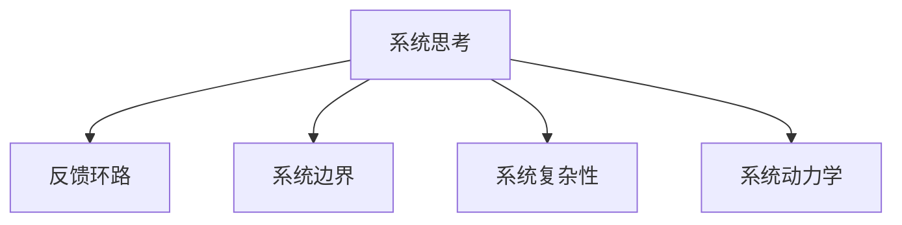

                 

## 1. 背景介绍

### 1.1 问题由来
在现代企业管理中，系统思考(System Thinking)已成为一种重要的思维方式，尤其在复杂多变的环境中，系统思考能够帮助团队识别整体和局部的关系，把握全局视角，从根本上解决系统性问题。然而，尽管系统思考的重要性已经得到了广泛的认同，但在实际应用中仍然面临诸多挑战，如：
- 团队成员对系统思考的理解和应用缺乏深度，无法有效识别系统结构。
- 系统模型构建复杂，难以与业务紧密结合。
- 数据分析和反馈机制不健全，系统思考无法持续迭代优化。

本文将从系统思考的基本原理出发，结合实际案例，详细介绍如何将系统思考应用于团队管理，帮助管理者系统性地识别、分析和解决系统问题，提升团队绩效和组织效率。

## 2. 核心概念与联系

### 2.1 核心概念概述

为了更好地理解系统思考在团队管理中的应用，本节将介绍几个关键概念及其相互联系：

- **系统思考(System Thinking)**：指从整体视角出发，系统性地分析系统组成部分和相互关系，寻找系统结构的复杂性和动态性。系统思考强调理解系统的因果关系，而非表面现象，旨在从根本上解决系统性问题。
- **反馈环路(Feedback Loop)**：指系统内部或系统与其他系统之间的信息循环，影响系统的行为和状态。反馈环路是系统思考中的核心概念，通过分析反馈环路，可以揭示系统动态变化和行为模式。
- **系统边界(System Boundaries)**：指系统与外部环境之间的界线，决定了系统功能和行为。系统边界是理解系统功能和行为的前提，也是进行系统设计和优化时的关键考虑因素。
- **系统复杂性(System Complexity)**：指系统组成部分和相互关系的多样性和层次性，决定了系统的复杂度和不确定性。系统复杂性是系统思考的重要研究对象，也是系统设计和优化时需要考虑的关键因素。
- **系统动力学(System Dynamics)**：指系统结构、行为和功能之间的动态关系，通过分析系统动力学的变化规律，可以预测系统行为，进行优化设计。系统动力学是系统思考的重要工具，可以帮助系统思考者识别和设计系统结构。

这些概念之间通过以下Mermaid流程图进行联系：



该图展示了系统思考与其他核心概念之间的联系：

1. **反馈环路**是系统思考中的核心概念，通过分析反馈环路可以揭示系统的动态行为。
2. **系统边界**是理解系统功能和行为的前提，系统思考需从系统边界出发进行设计和优化。
3. **系统复杂性**是系统思考的重要研究对象，理解系统的复杂性有助于发现系统问题和进行优化设计。
4. **系统动力学**是系统思考的重要工具，通过系统动力学分析可以预测系统行为并优化系统设计。

这些概念共同构成了系统思考的理论基础，帮助团队管理者系统性地识别、分析和解决系统问题。

## 3. 核心算法原理 & 具体操作步骤

### 3.1 算法原理概述

系统思考应用于团队管理，核心在于通过识别系统边界、分析反馈环路、理解系统复杂性和应用系统动力学，系统性地分析和管理团队系统。其基本流程如下：

1. **识别系统边界**：明确团队系统的功能和行为，识别与外部环境的关系。
2. **分析反馈环路**：分析团队系统内部的信息循环，理解系统的动态行为和变化规律。
3. **理解系统复杂性**：识别团队系统组成部分和相互关系的多样性和层次性，把握系统的复杂度。
4. **应用系统动力学**：利用系统动力学模型预测系统行为，进行优化设计。

通过这一流程，系统思考者可以全面理解团队系统的结构和动态，从而进行系统性管理和优化。

### 3.2 算法步骤详解

以下将详细介绍系统思考应用于团队管理的详细步骤：

**Step 1: 识别系统边界**
1. **定义系统目标**：明确团队系统的目标和功能，如提高团队协作效率、提升产品质量等。
2. **识别系统组成部分**：列出团队系统的所有组成部分，如团队成员、资源、任务等。
3. **确定系统边界**：明确团队系统与外部环境的关系，如与客户、供应商、竞争对手等的关系。

**Step 2: 分析反馈环路**
1. **绘制系统流图**：使用系统流图(SDK)等工具，绘制团队系统的反馈环路，包括信息流、任务流和资源流。
2. **分析反馈环路行为**：识别反馈环路中的关键节点和控制点，理解系统的动态行为和变化规律。
3. **识别系统瓶颈**：通过分析反馈环路，识别团队系统中的瓶颈和关键问题，如信息传递不畅、任务协调困难等。

**Step 3: 理解系统复杂性**
1. **识别系统组成部分**：列出团队系统中的所有组成部分，如团队成员、任务、资源等。
2. **分析组成部分关系**：理解团队系统中各组成部分之间的相互作用和关系，如依赖关系、交互关系等。
3. **评估系统复杂性**：使用复杂性指标，如熵、度中心性等，评估团队系统的复杂度和不确定性。

**Step 4: 应用系统动力学**
1. **构建系统动力学模型**：使用系统动力学软件，如Vensim、Stella等，构建团队系统的动力学模型。
2. **分析系统动力学行为**：通过仿真实验，预测团队系统的行为和变化规律，如团队协作效率、任务完成时间等。
3. **优化系统设计**：根据系统动力学分析结果，优化团队系统的设计和运营，如改进信息传递机制、优化任务协调等。

通过上述步骤，系统思考者可以全面理解团队系统的结构和动态，进行系统性管理和优化。

### 3.3 算法优缺点

系统思考应用于团队管理的优点包括：
1. **全局视角**：系统思考从整体视角出发，系统性地分析团队系统，避免了片面看待问题的局限性。
2. **深度分析**：系统思考强调深入理解系统结构和动态，揭示了系统的根本原因，而非表面现象。
3. **持续优化**：系统思考强调持续迭代优化，通过反馈环路和系统动力学的动态分析，进行持续改进。
4. **团队协作**：系统思考强调团队协作，通过系统边界和组成部分关系的设计，促进团队成员之间的协作。

同时，系统思考也存在一些局限性：
1. **模型构建复杂**：系统思考需要构建复杂的系统模型，对模型的理解和应用要求较高。
2. **数据需求大**：系统思考需要大量的数据支持，特别是在分析反馈环路和系统复杂性时，数据的不足会影响分析结果。
3. **时间成本高**：系统思考的分析和优化过程较为复杂，需要较长的时间投入。
4. **应用门槛高**：系统思考对应用者的系统思考能力和数学建模能力要求较高，需要系统思考者具备相应的知识背景。

尽管存在这些局限性，但系统思考在团队管理中的应用具有广阔的前景，能够显著提升团队绩效和组织效率。

### 3.4 算法应用领域

系统思考在团队管理中的应用领域广泛，以下是几个典型的应用场景：

1. **项目管理**：系统思考可以帮助项目管理者系统性地识别项目中的关键因素和潜在风险，通过优化反馈环路和系统设计，提高项目管理的效率和成功率。

2. **团队协作**：系统思考可以帮助团队管理者理解团队成员之间的关系和互动，识别协作中的瓶颈和问题，通过优化系统边界和组成部分关系，促进团队成员之间的协作和沟通。

3. **绩效管理**：系统思考可以帮助绩效管理者系统性地分析影响绩效的因素，如任务分配、资源配置等，通过优化系统设计和运营，提高团队绩效。

4. **组织变革**：系统思考可以帮助组织管理者系统性地识别组织中的问题和瓶颈，通过优化系统边界和组成部分关系，促进组织变革和创新。

5. **创新管理**：系统思考可以帮助创新管理者系统性地识别创新机会和潜在风险，通过优化系统设计和运营，促进组织创新。

## 4. 数学模型和公式 & 详细讲解 & 举例说明

### 4.1 数学模型构建

本节将使用数学语言对系统思考应用于团队管理的基本流程进行更加严格的刻画。

假设团队系统由多个组成部分组成，其中 $i$ 表示第 $i$ 个组成部分，$x_i$ 表示该组成部分的输入，$y_i$ 表示该组成部分的输出。系统边界为 $S$，与外部环境的关系为 $E$。

定义系统流图 $G=(V,E)$，其中 $V$ 表示组成部分节点，$E$ 表示信息流、任务流和资源流。系统动力学模型为 $M=(X,U)$，其中 $X$ 表示系统状态变量，$U$ 表示系统动力规则。

### 4.2 公式推导过程

以下我们将对系统思考应用于团队管理的数学模型进行推导。

**Step 1: 识别系统边界**
1. **定义系统目标**：假设系统目标为 $T$。
2. **识别系统组成部分**：假设系统组成部分为 $S_i$，$i=1,2,\cdots,n$。
3. **确定系统边界**：假设系统边界为 $S$，与外部环境的关系为 $E$。

**Step 2: 分析反馈环路**
1. **绘制系统流图**：假设系统流图为 $G=(V,E)$，其中 $V=\{S_i|i=1,2,\cdots,n\}$，$E$ 表示信息流、任务流和资源流。
2. **分析反馈环路行为**：假设反馈环路为 $F=(V,F,E)$，其中 $V=\{S_i|i=1,2,\cdots,n\}$，$F$ 表示信息流、任务流和资源流。
3. **识别系统瓶颈**：假设系统瓶颈为 $B=(V,B,E)$，其中 $V=\{S_i|i=1,2,\cdots,n\}$，$B$ 表示瓶颈环节。

**Step 3: 理解系统复杂性**
1. **识别系统组成部分**：假设系统组成部分为 $S_i$，$i=1,2,\cdots,n$。
2. **分析组成部分关系**：假设组成部分关系为 $R=(R_{ij}|i,j=1,2,\cdots,n)$。
3. **评估系统复杂性**：假设系统复杂性为 $C$，使用复杂性指标，如熵、度中心性等。

**Step 4: 应用系统动力学**
1. **构建系统动力学模型**：假设系统动力学模型为 $M=(X,U)$，其中 $X$ 表示系统状态变量，$U$ 表示系统动力规则。
2. **分析系统动力学行为**：假设系统动力学行为为 $D=(X,D)$，其中 $X$ 表示系统状态变量，$D$ 表示系统动力规则。
3. **优化系统设计**：假设系统设计为 $D'$，优化系统设计的过程为 $O=(X,D',U')$，其中 $X$ 表示系统状态变量，$U'$ 表示优化后的系统动力规则。

### 4.3 案例分析与讲解

以下通过一个简单的项目管理案例，详细讲解系统思考的应用。

假设某软件开发项目，涉及多个团队成员、多个任务和多个资源。系统目标为按时交付高质量的软件产品。项目经理希望通过系统思考，识别和优化项目管理的瓶颈和问题，提升项目管理效率。

**Step 1: 识别系统边界**
1. **定义系统目标**：按时交付高质量的软件产品。
2. **识别系统组成部分**：团队成员、任务、资源。
3. **确定系统边界**：项目经理、客户、供应商、竞争对手。

**Step 2: 分析反馈环路**
1. **绘制系统流图**：绘制项目管理系统的流图，包含信息流、任务流和资源流。
2. **分析反馈环路行为**：分析项目管理系统中的反馈环路，识别瓶颈环节。
3. **识别系统瓶颈**：识别项目管理系统中的瓶颈环节，如任务协调困难、资源分配不均等。

**Step 3: 理解系统复杂性**
1. **识别系统组成部分**：团队成员、任务、资源。
2. **分析组成部分关系**：理解团队成员之间的关系和互动。
3. **评估系统复杂性**：评估项目管理的复杂度和不确定性。

**Step 4: 应用系统动力学**
1. **构建系统动力学模型**：使用系统动力学软件，构建项目管理系统的动力学模型。
2. **分析系统动力学行为**：通过仿真实验，预测项目管理系统的行为和变化规律。
3. **优化系统设计**：优化项目管理系统的设计和运营，如改进任务协调机制、优化资源分配等。

通过系统思考的应用，项目经理可以系统性地识别和解决项目管理中的问题，提升项目管理效率。

## 5. 项目实践：代码实例和详细解释说明

### 5.1 开发环境搭建

在进行系统思考的实践前，我们需要准备好开发环境。以下是使用Python进行开发的环境配置流程：

1. 安装Anaconda：从官网下载并安装Anaconda，用于创建独立的Python环境。

2. 创建并激活虚拟环境：
```bash
conda create -n systemthinking python=3.8 
conda activate systemthinking
```

3. 安装系统思考相关库：
```bash
pip install system-dynamics-python
```

4. 安装数据处理相关库：
```bash
pip install pandas numpy matplotlib seaborn
```

5. 安装可视化相关库：
```bash
pip install plotly dash
```

完成上述步骤后，即可在`systemthinking`环境中开始系统思考的实践。

### 5.2 源代码详细实现

这里我们以项目管理为例，给出使用Python进行系统思考的代码实现。

首先，定义项目管理系统的组成部分：

```python
import pandas as pd
import numpy as np
import matplotlib.pyplot as plt

class Project:
    def __init__(self, num_members, num_tasks, num_resources):
        self.num_members = num_members
        self.num_tasks = num_tasks
        self.num_resources = num_resources
        self.member_id = np.arange(num_members)
        self.task_id = np.arange(num_tasks)
        self.resource_id = np.arange(num_resources)
        
        self.member_tasks = pd.DataFrame({'member_id': self.member_id, 'task_id': self.task_id, 'task_done': False})
        self.task_resources = pd.DataFrame({'task_id': self.task_id, 'resource_id': self.resource_id, 'resource_usage': 0})
        self.resource_capacities = pd.DataFrame({'resource_id': self.resource_id, 'capacity': np.ones(num_resources)})
        
    def assign_tasks(self, task_assignments):
        self.member_tasks['task_done'] = task_assignments
        
    def allocate_resources(self, resource_assignments):
        self.task_resources['resource_usage'] = resource_assignments
        self.resource_capacities['capacity'] -= resource_assignments
```

然后，定义系统流图和反馈环路：

```python
import networkx as nx
import systemdynamics as sd

class ProjectSystem:
    def __init__(self, project):
        self.project = project
        self.graph = nx.DiGraph()
        
        self.member_tasks = self.project.member_tasks
        self.task_resources = self.project.task_resources
        self.resource_capacities = self.project.resource_capacities
        
        self.graph.add_nodes_from(self.member_tasks.member_id, type='member')
        self.graph.add_nodes_from(self.task_resources.resource_id, type='task')
        self.graph.add_nodes_from(self.resource_capacities.resource_id, type='resource')
        
        self.graph.add_edges_from(self.member_tasks[(self.member_tasks['task_done'] == 0)]['member_id'], (self.task_resources['task_id']))
        self.graph.add_edges_from(self.resource_capacities, (self.task_resources['resource_id']))
        
        self.feedback_loops = []
        for task_id in self.task_resources['task_id'].unique():
            feedback_loop = sd.FeedbackLoop()
            feedback_loop.add_input(self.task_resources[(self.task_resources['task_id'] == task_id)]['resource_usage'], 'resource_utilization')
            feedback_loop.add_output(self.resource_capacities[(self.resource_capacities['resource_id'] == task_id)]['capacity'], 'resource_capacity')
            feedback_loop.add_rule('resource_utilization > resource_capacity', 'reallocate_resource')
            self.feedback_loops.append(feedback_loop)
```

接着，定义系统动力规则：

```python
class ProjectDynamics:
    def __init__(self, project_system):
        self.project_system = project_system
        
        self.member_tasks = project_system.member_tasks
        self.task_resources = project_system.task_resources
        self.resource_capacities = project_system.resource_capacities
        
        self.dynamics = sd.SystemDynamics()
        self.dynamics.add_variable(self.member_tasks.member_id, 'member_task_start')
        self.dynamics.add_variable(self.member_tasks.member_id, 'member_task_done')
        self.dynamics.add_variable(self.resource_capacities.resource_id, 'resource_capacity')
        self.dynamics.add_variable(self.task_resources.resource_id, 'resource_usage')
        
        self.dynamics.add_rule('member_task_start', 'assign_task')
        self.dynamics.add_rule('member_task_done', 'complete_task')
        self.dynamics.add_rule('resource_utilization > resource_capacity', 'reallocate_resource')
        
        self.dynamics.add_feedback(self.project_system.feedback_loops)
```

最后，启动仿真和优化流程：

```python
import dash
import dash_core_components as dcc
import dash_html_components as html
from dash.dependencies import Input, Output

def create_system():
    project = Project(10, 20, 5)
    project_system = ProjectSystem(project)
    project_dynamics = ProjectDynamics(project_system)
    return project_dynamics

app = dash.Dash(__name__)

app.layout = html.Div([
    html.H1('Project Management System Dynamics'),
    dcc.Graph(id='dynamics-graph'),
    dcc.Graph(id='performance-graph')
])

@app.callback(
    Output('dynamics-graph', 'figure'),
    [Input('project-dynamics', 'state')],
    [Input('simulation-time', 'state')]
)
def update_dynamics_graph(project_dynamics, simulation_time):
    simulation = project_dynamics.dynamics
    simulation_result = simulation.solve(simulation_time)
    member_tasks = project_dynamics.project_system.member_tasks
    task_resources = project_dynamics.project_system.task_resources
    resource_capacities = project_dynamics.project_system.resource_capacities
    
    fig, ax = plt.subplots(figsize=(10, 6))
    ax.set_xlabel('Time')
    ax.set_ylabel('Resource Utilization')
    ax.set_title('Resource Utilization over Time')
    ax.plot(simulation_result['resource_usage'], label='Resource Utilization')
    ax.legend()
    fig = ax.figure
    return fig

@app.callback(
    Output('performance-graph', 'figure'),
    [Input('project-dynamics', 'state')],
    [Input('simulation-time', 'state')]
)
def update_performance_graph(project_dynamics, simulation_time):
    simulation = project_dynamics.dynamics
    simulation_result = simulation.solve(simulation_time)
    member_tasks = project_dynamics.project_system.member_tasks
    task_resources = project_dynamics.project_system.task_resources
    resource_capacities = project_dynamics.project_system.resource_capacities
    
    fig, ax = plt.subplots(figsize=(10, 6))
    ax.set_xlabel('Time')
    ax.set_ylabel('Task Completion')
    ax.set_title('Task Completion over Time')
    ax.plot(simulation_result['member_task_done'], label='Task Completion')
    ax.legend()
    fig = ax.figure
    return fig

if __name__ == '__main__':
    app.run_server(debug=True)
```

以上就是使用Python进行项目管理案例的系统思考实践。可以看到，通过构建系统流图、反馈环路和系统动力学模型，可以系统性地分析和优化项目管理系统的设计和运营。

### 5.3 代码解读与分析

让我们再详细解读一下关键代码的实现细节：

**Project类**：
- `__init__`方法：初始化项目管理系统的组成部分，如团队成员、任务、资源等。
- `assign_tasks`方法：根据任务分配情况，更新团队成员的任务完成状态。
- `allocate_resources`方法：根据资源分配情况，更新任务资源的资源使用情况和资源容量的变化。

**ProjectSystem类**：
- `__init__`方法：初始化项目管理系统的组成部分和系统流图，添加成员、任务、资源节点，以及任务和资源之间的关联边。
- `add_feedback_loops`方法：添加反馈环路，通过资源利用率和资源容量的比较，触发资源重新分配。

**ProjectDynamics类**：
- `__init__`方法：初始化系统动力学模型，添加成员、任务、资源状态变量和系统动力规则。
- `add_variables`方法：添加系统状态变量，如成员任务开始时间、任务完成时间和资源容量等。
- `add_rules`方法：添加系统动力规则，如任务分配、任务完成和资源重新分配等。
- `add_feedback`方法：添加反馈环路，通过资源利用率和资源容量的比较，触发资源重新分配。

**主程序**：
- 创建项目管理实例，定义系统流图和反馈环路。
- 通过系统动力学模型进行仿真，分析资源利用率和任务完成时间。
- 通过Dash库，实现系统动力学模型的可视化，展示资源利用率和任务完成时间的变化规律。

通过上述代码实现，可以系统性地分析和优化项目管理系统的设计和运营，提升项目管理效率。

## 6. 实际应用场景

### 6.1 智能客服系统

系统思考可以应用于智能客服系统的设计和运营，提升客户咨询体验和问题解决效率。通过系统思考，智能客服系统可以系统性地识别客户咨询中的关键问题和瓶颈，通过优化反馈环路和系统设计，提高客户咨询的响应速度和问题解决效率。

### 6.2 金融舆情监测

系统思考可以应用于金融舆情监测系统的设计和运营，提升舆情分析和风险预警的准确性和及时性。通过系统思考，金融舆情监测系统可以系统性地识别舆情变化中的关键因素和潜在风险，通过优化反馈环路和系统设计，提高舆情分析和风险预警的准确性和及时性。

### 6.3 个性化推荐系统

系统思考可以应用于个性化推荐系统的设计和运营，提升推荐效果和用户满意度。通过系统思考，个性化推荐系统可以系统性地识别用户兴趣和行为中的关键因素和潜在问题，通过优化反馈环路和系统设计，提高推荐效果和用户满意度。

### 6.4 未来应用展望

随着系统思考在实际应用中的不断推广，系统思考将应用于更多领域，为组织和系统提供系统性分析和优化，提升组织和系统的绩效和效率。未来，系统思考将与人工智能、大数据、区块链等前沿技术深度融合，推动系统思考在更广泛的应用领域中发挥作用。

## 7. 工具和资源推荐

### 7.1 学习资源推荐

为了帮助开发者系统掌握系统思考的理论基础和实践技巧，这里推荐一些优质的学习资源：

1. **《系统思考：迎接复杂性的方法》**：由系统思考大师彼得·圣吉所著，系统全面地介绍了系统思考的基本概念和应用方法，适合初学者入门。
2. **《系统动力学导论》**：由杜震亚、王玎、杨志刚等著，系统介绍了系统动力学的基本概念和应用方法，适合系统思考者和系统动力学研究者参考。
3. **Coursera系统思考课程**：由斯坦福大学和麻省理工学院联合开设的系统思考课程，系统全面地介绍了系统思考的基本概念和应用方法，适合在线学习。
4. **《系统思考：解决复杂性问题的实用方法》**：由罗伯特·凯茨所著，系统介绍了系统思考在复杂性问题解决中的应用方法，适合实践者参考。
5. **《系统思考与组织变革》**：由约翰·斯图尔特、安德鲁·库珀等著，系统介绍了系统思考在组织变革中的应用方法，适合组织管理者和变革推动者参考。

通过对这些资源的学习实践，相信你一定能够系统掌握系统思考的理论基础和实践技巧，并应用于实际问题解决中。

### 7.2 开发工具推荐

高效的开发离不开优秀的工具支持。以下是几款用于系统思考开发的常用工具：

1. **Anaconda**：用于创建独立的Python环境，方便系统思考模型的开发和部署。
2. **PyCharm**：Python开发环境，提供了丰富的插件和扩展，支持系统思考模型的开发和调试。
3. **Jupyter Notebook**：交互式开发环境，适合系统思考模型的实验和分析。
4. **Vensim**：系统动力学建模和仿真工具，支持复杂的系统动力学模型构建和仿真。
5. **Stella**：系统动力学建模和仿真工具，支持可视化的系统动力学模型构建和仿真。

合理利用这些工具，可以显著提升系统思考模型的开发效率，加快创新迭代的步伐。

### 7.3 相关论文推荐

系统思考在实际应用中得到了广泛的研究，以下是几篇奠基性的相关论文，推荐阅读：

1. **《系统思考：解决复杂性问题的实用方法》**：由罗伯特·凯茨所著，系统介绍了系统思考在复杂性问题解决中的应用方法。
2. **《系统动力学导论》**：由杜震亚、王玎、杨志刚等著，系统介绍了系统动力学的基本概念和应用方法。
3. **《系统思考与组织变革》**：由约翰·斯图尔特、安德鲁·库珀等著，系统介绍了系统思考在组织变革中的应用方法。
4. **《系统思考：迎接复杂性的方法》**：由彼得·圣吉所著，系统全面地介绍了系统思考的基本概念和应用方法。
5. **《系统思考与企业创新》**：由克里斯托弗·阿德尔、阿尔贝托·达斯·查韦斯等著，系统介绍了系统思考在企业创新中的应用方法。

这些论文代表了大系统思考的研究进展，通过学习这些前沿成果，可以帮助研究者把握学科前进方向，激发更多的创新灵感。

## 8. 总结：未来发展趋势与挑战

### 8.1 研究成果总结

系统思考作为一门系统性和综合性较强的思维方式，在系统管理、组织变革、复杂性问题解决等方面具有重要应用价值。本文详细介绍了系统思考的基本原理和应用方法，通过实际案例和代码实现，系统性地分析和优化了团队管理系统的设计和运营。

### 8.2 未来发展趋势

展望未来，系统思考将呈现以下几个发展趋势：

1. **系统模型自动化**：系统模型的构建将越来越依赖于自动化的工具和方法，降低对人工干预的需求，提高模型构建的效率和准确性。
2. **数据驱动的系统思考**：系统思考将更加依赖于大数据和人工智能技术，通过数据驱动的系统思考，提高系统分析和优化效果。
3. **跨学科的系统思考**：系统思考将与更多学科领域相结合，如心理学、社会学、经济学等，从更全面和深入的角度分析和解决系统问题。
4. **人机协作的系统思考**：系统思考将与人工智能技术深度融合，通过人机协作，提高系统分析和优化的效率和效果。
5. **伦理和可持续性的系统思考**：系统思考将更加注重伦理和可持续性问题，通过系统思考，促进社会和环境的可持续发展。

### 8.3 面临的挑战

尽管系统思考在实际应用中已经取得了显著成果，但仍面临诸多挑战：

1. **模型构建复杂**：系统模型的构建需要系统思考者和系统动力学专家具备丰富的知识和经验，模型的理解和应用要求较高。
2. **数据需求大**：系统思考需要大量的数据支持，特别是在分析反馈环路和系统复杂性时，数据的不足会影响分析结果。
3. **时间成本高**：系统思考的分析和优化过程较为复杂，需要较长的时间投入。
4. **应用门槛高**：系统思考对应用者的系统思考能力和数学建模能力要求较高，需要系统思考者具备相应的知识背景。

尽管存在这些挑战，但系统思考在实际应用中的不断推广，必将在组织和系统管理中发挥更大作用，提升组织和系统的绩效和效率。

### 8.4 研究展望

未来，系统思考需要进一步结合人工智能、大数据、区块链等前沿技术，推动系统思考在更广泛的应用领域中发挥作用。同时，需要系统思考者和系统动力学专家不断探索和创新，开发更加高效和灵活的系统思考方法和工具，提升系统分析和优化的效果和效率。

## 9. 附录：常见问题与解答

**Q1: 系统思考与传统管理方法有何不同？**

A: 系统思考与传统管理方法相比，最大的不同在于其全局视角和深入分析能力。传统管理方法往往基于局部视角和短期决策，难以系统性地识别和解决问题。而系统思考从整体视角出发，深入分析系统结构和动态，能够系统性地识别和解决问题，从而提升管理效果。

**Q2: 系统思考在项目管理中如何应用？**

A: 系统思考在项目管理中的应用，主要体现在以下几个方面：

1. **识别系统边界**：明确项目目标和功能，识别项目中的关键因素和外部环境的关系。
2. **分析反馈环路**：绘制项目管理系统流图，识别关键瓶颈和问题。
3. **理解系统复杂性**：评估项目管理的复杂度和不确定性。
4. **应用系统动力学**：通过系统动力学模型，预测项目管理行为和变化规律，进行优化设计。

通过系统思考的应用，项目经理可以系统性地识别和解决项目管理中的问题，提升项目管理效率。

**Q3: 系统思考在智能客服系统中的应用前景如何？**

A: 系统思考在智能客服系统中的应用前景非常广阔，可以系统性地识别客户咨询中的关键问题和瓶颈，通过优化反馈环路和系统设计，提高客户咨询的响应速度和问题解决效率。智能客服系统可以利用系统思考，提升客户咨询体验，提高问题解决效率，进一步提升客户满意度。

**Q4: 系统思考是否适用于所有组织和系统？**

A: 系统思考适用于各种组织和系统，尤其适用于复杂多变的环境和系统。其核心思想是通过系统性分析和优化，从根本上解决系统问题，提升组织和系统的绩效和效率。虽然系统思考的构建和应用需要一定的知识和经验，但通过不断的学习和实践，系统思考可以应用于各种组织和系统，提升其管理效果和运营效率。

**Q5: 系统思考的实施难点是什么？**

A: 系统思考的实施难点主要在于以下几个方面：

1. **模型构建复杂**：系统模型的构建需要系统思考者和系统动力学专家具备丰富的知识和经验，模型的理解和应用要求较高。
2. **数据需求大**：系统思考需要大量的数据支持，特别是在分析反馈环路和系统复杂性时，数据的不足会影响分析结果。
3. **时间成本高**：系统思考的分析和优化过程较为复杂，需要较长的时间投入。
4. **应用门槛高**：系统思考对应用者的系统思考能力和数学建模能力要求较高，需要系统思考者具备相应的知识背景。

尽管存在这些挑战，但系统思考在实际应用中的不断推广，必将在组织和系统管理中发挥更大作用，提升组织和系统的绩效和效率。

---

作者：禅与计算机程序设计艺术 / Zen and the Art of Computer Programming

