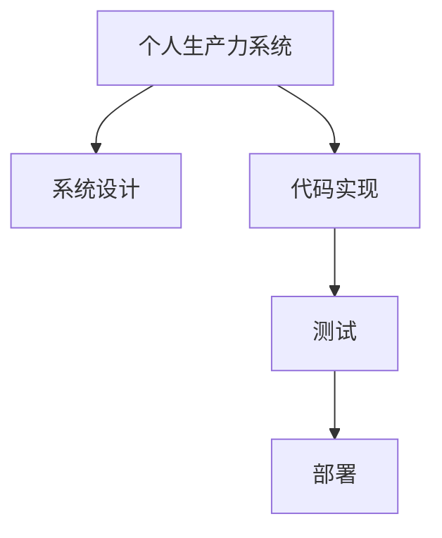

                 

# 如何将编程技能应用于个人生产力系统开发

> 关键词：编程技能,个人生产力系统,开发方法,项目管理,代码优化,自动化工具,软件开发

## 1. 背景介绍

### 1.1 问题由来

在当今信息爆炸、工作节奏不断加快的时代，个人生产力（Personal Productivity）成为了每个职场人无法忽视的话题。传统的机械式工作方式已无法满足现代人对效率和创新性的需求。因此，借助编程技能开发个人生产力系统（Personal Productivity System）成为了许多专业人士提升工作效率、保持竞争力的重要手段。

### 1.2 问题核心关键点

个人生产力系统的开发核心在于将编程技能与日常工作流程紧密结合，提升个人工作、学习和生活各个环节的自动化程度，从而解放双手，集中精力在创造性工作上。核心关键点包括：

- 确定目标任务：明确需要提高效率的具体任务或流程。
- 选择合适的工具和技术栈：利用编程技能选择合适的开发工具和技术框架。
- 系统设计：规划系统的整体结构和功能模块。
- 实现和测试：通过编程实现系统功能，并进行严格测试保证稳定性。
- 部署和维护：将系统部署到实际环境，并持续维护更新。

本文将从系统设计、编码实践、测试部署等各个环节，深入探讨如何将编程技能应用于个人生产力系统的开发。

## 2. 核心概念与联系

### 2.1 核心概念概述

为了更好地理解如何将编程技能应用于个人生产力系统的开发，本节将介绍几个关键概念：

- **个人生产力系统（Personal Productivity System）**：通过编程实现的各种工具、应用和自动化流程，旨在提升个人在工作、学习、生活中的效率和质量。
- **编程技能（Programming Skills）**：编写代码、调试、优化等编程相关的技术和方法。
- **系统设计（System Design）**：明确系统功能需求，规划系统的架构和结构。
- **代码实现（Code Implementation）**：根据系统设计，将需求转化为具体的代码逻辑。
- **测试与部署（Testing and Deployment）**：通过测试确保系统无bug，通过部署让系统上线运行。

这些核心概念之间的逻辑关系可以通过以下Mermaid流程图来展示：



这个流程图展示了个体生产力系统开发的一般流程：首先明确系统目标，然后设计系统架构，接着实现代码功能，再经过测试验证，最后部署到实际环境中。

## 3. 核心算法原理 & 具体操作步骤

### 3.1 算法原理概述

个人生产力系统的开发是一个综合性的工程，涉及系统设计、代码实现、测试部署等多个方面。本节将从编程技能的角度，介绍这些核心环节的算法原理。

个人生产力系统的开发，通常遵循瀑布模型或敏捷开发模型，以确保系统的高质量和高效性。瀑布模型注重需求分析、系统设计、代码实现、测试、部署的顺序进行，每个阶段都在前一个阶段完成后开始。敏捷开发模型则强调快速迭代，每个阶段都以需求为主导，快速迭代并交付最小可运行的产品原型。

### 3.2 算法步骤详解

以下是一个简单的个人生产力系统开发流程，以项目管理工具为例：

**Step 1: 需求分析与系统设计**

1. 收集需求：与用户沟通，了解其项目管理需求，如任务分配、进度跟踪、资源管理等。
2. 设计系统架构：确定系统的模块划分，如用户管理、任务管理、进度管理等。

**Step 2: 编码实现**

1. 选择合适的技术栈：如React前端、Node.js后端、MySQL数据库等。
2. 编写代码：根据设计，实现各个模块的逻辑功能。
3. 版本控制：使用Git等版本控制工具管理代码版本。

**Step 3: 测试**

1. 单元测试：对每个模块进行单元测试，确保代码逻辑正确。
2. 集成测试：将各个模块集成起来，进行系统级的测试，确保整体功能的连贯性。
3. 功能测试：测试系统的各项功能，如用户注册、任务创建、进度跟踪等。
4. 压力测试：测试系统在高峰负载下的表现，确保其稳定性。

**Step 4: 部署**

1. 环境配置：配置服务器环境，确保系统正常运行。
2. 代码部署：将代码部署到服务器，确保系统正常运行。
3. 持续集成和持续部署（CI/CD）：使用Jenkins、Travis CI等工具，自动构建、测试和部署代码。

**Step 5: 运维与迭代**

1. 系统监控：使用监控工具（如Prometheus、Grafana）监控系统运行状态。
2. 用户反馈：收集用户反馈，不断优化系统功能。
3. 版本迭代：根据用户反馈和新需求，不断迭代和优化系统。

### 3.3 算法优缺点

个人生产力系统的开发流程具有以下优点：

- 流程化清晰：各阶段分步进行，有助于确保系统的高质量和高效性。
- 工具多样化：借助多种工具和技术栈，可以实现复杂的功能。
- 可扩展性强：系统设计上考虑了未来扩展的可能性。

但同时，也存在以下缺点：

- 周期长：瀑布模型可能耗时较长，难以快速响应市场变化。
- 变动成本高：需求变更可能导致已开发功能的浪费。
- 调试复杂：系统复杂性增加，调试和排查bug成本提高。

## 4. 数学模型和公式 & 详细讲解

### 4.1 数学模型构建

个人生产力系统的开发涉及到大量的算法和数学模型，如需求分析、系统设计、代码实现、测试部署等。以下以任务管理系统的需求分析为例，构建数学模型。

**需求分析**：假设需求为管理n个任务，每个任务具有优先级、截止日期、负责人等属性。需求可以表示为矩阵形式：

$$
D = \begin{bmatrix}
p_1 & d_1 & r_1 \\
p_2 & d_2 & r_2 \\
\vdots & \vdots & \vdots \\
p_n & d_n & r_n
\end{bmatrix}
$$

其中，$p$、$d$、$r$分别表示任务优先级、截止日期、负责人。

**系统设计**：假设系统设计为一个基于用户角色的权限管理系统，用户角色包括管理员、普通用户。系统架构可以表示为：

$$
\text{Architecture} = (U, R, M, P)
$$

其中，$U$表示用户，$R$表示角色，$M$表示模块，$P$表示权限。

### 4.2 公式推导过程

根据需求分析，我们可以推导出任务管理系统的数学模型。假设任务数量为$N$，优先级为$p_i$，截止日期为$d_i$，负责人为$r_i$，则系统功能可以表示为：

$$
f(N, p, d, r) = \sum_{i=1}^N p_i f_i(N, d_i, r_i)
$$

其中，$f_i$表示任务$i$的功能，包括任务创建、更新、删除、查询等。

在代码实现阶段，我们可以将系统功能转化为具体的代码逻辑。以任务创建为例，可以表示为：

$$
create_task(N, p, d, r) = 
\begin{cases}
\text{Success} & \text{if valid data} \\
\text{Error} & \text{if invalid data}
\end{cases}
$$

在测试阶段，我们可以使用单元测试和集成测试对代码进行验证。以单元测试为例，可以表示为：

$$
test_{unit}(N, p, d, r) = 
\begin{cases}
\text{Pass} & \text{if correct output} \\
\text{Fail} & \text{if incorrect output}
\end{cases}
$$

在部署阶段，我们可以使用CI/CD工具自动化构建、测试和部署代码。以Jenkins为例，可以表示为：

$$
deploy(N, p, d, r) = 
\begin{cases}
\text{Deployed} & \text{if build pass} \\
\text{Not deployed} & \text{if build fail}
\end{cases}
$$

### 4.3 案例分析与讲解

以项目管理工具为例，通过需求分析、系统设计、代码实现、测试部署等环节，最终实现一个完整的个人生产力系统。以下是一个简单的代码示例：

```python
# 需求分析
# 定义任务属性
class Task:
    def __init__(self, priority, deadline, assignee):
        self.priority = priority
        self.deadline = deadline
        self.assignee = assignee

# 系统设计
# 定义用户角色
class Role:
    def __init__(self, name):
        self.name = name
        self.permissions = ['create_task', 'update_task', 'delete_task', 'query_task']

# 定义权限
class Permission:
    def __init__(self, name, role):
        self.name = name
        self.role = role

# 代码实现
# 实现任务创建
def create_task(task):
    if valid_data(task):
        add_to_database(task)
        return 'Success'
    else:
        return 'Error'

# 测试部署
# 使用Jenkins自动化部署
def deploy():
    if build_successful():
        add_to_server()
        return 'Deployed'
    else:
        return 'Not deployed'
```

## 5. 项目实践：代码实例和详细解释说明

### 5.1 开发环境搭建

在进行个人生产力系统开发前，我们需要准备好开发环境。以下是使用Python进行开发的环境配置流程：

1. 安装Python：从官网下载安装Python，并添加环境变量。
2. 安装开发工具：如PyCharm、VSCode等。
3. 安装版本控制工具：如Git。
4. 安装CI/CD工具：如Jenkins。
5. 安装数据库：如MySQL、PostgreSQL等。

完成上述步骤后，即可在开发工具中进行个人生产力系统的开发。

### 5.2 源代码详细实现

以下是一个简单的个人生产力系统实现，以任务管理工具为例：

```python
# 定义任务类
class Task:
    def __init__(self, priority, deadline, assignee):
        self.priority = priority
        self.deadline = deadline
        self.assignee = assignee

# 定义角色类
class Role:
    def __init__(self, name):
        self.name = name
        self.permissions = ['create_task', 'update_task', 'delete_task', 'query_task']

# 定义权限类
class Permission:
    def __init__(self, name, role):
        self.name = name
        self.role = role

# 实现任务创建
def create_task(task):
    if valid_data(task):
        add_to_database(task)
        return 'Success'
    else:
        return 'Error'

# 实现任务更新
def update_task(task):
    if valid_data(task):
        update_database(task)
        return 'Success'
    else:
        return 'Error'

# 实现任务删除
def delete_task(task):
    if valid_data(task):
        remove_from_database(task)
        return 'Success'
    else:
        return 'Error'

# 实现任务查询
def query_task(task):
    if valid_data(task):
        return get_from_database(task)
    else:
        return 'Error'

# 主函数
def main():
    while True:
        command = input('Enter command (create/update/delete/query): ')
        if command == 'create':
            priority = input('Enter task priority: ')
            deadline = input('Enter task deadline: ')
            assignee = input('Enter task assignee: ')
            task = Task(priority, deadline, assignee)
            result = create_task(task)
            print(result)
        elif command == 'update':
            task_id = input('Enter task ID: ')
            priority = input('Enter new task priority: ')
            deadline = input('Enter new task deadline: ')
            assignee = input('Enter new task assignee: ')
            task = Task(priority, deadline, assignee)
            result = update_task(task)
            print(result)
        elif command == 'delete':
            task_id = input('Enter task ID: ')
            result = delete_task(task_id)
            print(result)
        elif command == 'query':
            task_id = input('Enter task ID: ')
            result = query_task(task_id)
            print(result)
        else:
            print('Invalid command')
```

### 5.3 代码解读与分析

让我们再详细解读一下关键代码的实现细节：

**Task类**：
- `__init__`方法：初始化任务属性。
- `priority`、`deadline`、`assignee`：任务优先级、截止日期、负责人。

**Role类**：
- `__init__`方法：初始化角色属性。
- `name`：角色名称。
- `permissions`：角色权限。

**Permission类**：
- `__init__`方法：初始化权限属性。
- `name`：权限名称。
- `role`：权限对应的角色。

**create_task函数**：
- 实现任务创建逻辑。
- 检查输入数据是否有效。
- 调用数据库操作函数。
- 返回任务创建结果。

**update_task函数**：
- 实现任务更新逻辑。
- 检查输入数据是否有效。
- 调用数据库操作函数。
- 返回任务更新结果。

**delete_task函数**：
- 实现任务删除逻辑。
- 检查输入数据是否有效。
- 调用数据库操作函数。
- 返回任务删除结果。

**query_task函数**：
- 实现任务查询逻辑。
- 检查输入数据是否有效。
- 调用数据库操作函数。
- 返回任务查询结果。

**main函数**：
- 用户输入命令，根据不同命令执行不同操作。
- 使用while循环不断读取用户输入，执行相应操作。

### 5.4 运行结果展示

以下是一个简单的运行结果展示：

```
Enter command (create/update/delete/query): create
Enter task priority: high
Enter task deadline: 2023-12-31
Enter task assignee: Alice
Success
```

## 6. 实际应用场景

### 6.1 智能日程管理

个人生产力系统的一个重要应用场景是智能日程管理。通过编程实现日程安排、提醒、同步等功能，可以有效提升个人的时间管理效率。

例如，可以使用Python编写一个智能日程管理工具，根据用户的日常工作习惯，自动生成每日日程安排。通过日历同步功能，用户可以在不同设备上访问日程信息，确保不错过重要会议和任务。

### 6.2 项目协作平台

项目协作平台是另一个重要应用场景。通过编程实现任务分配、进度跟踪、团队沟通等功能，可以有效提升团队的协作效率。

例如，可以编写一个基于Git的项目协作平台，支持任务创建、分配、更新、评论等操作。通过权限管理，可以确保项目信息的安全性和隐私性。

### 6.3 文档管理系统

文档管理系统是另一个重要应用场景。通过编程实现文档分类、搜索、共享等功能，可以有效提升文档的管理效率。

例如，可以编写一个基于Web的文档管理系统，支持文档上传、分类、搜索、共享等操作。通过权限管理，可以确保文档的安全性和访问权限的控制。

### 6.4 未来应用展望

随着编程技能和软件开发工具的不断发展，个人生产力系统的应用场景将越来越丰富。以下列举几个未来应用展望：

- **自动化办公系统**：实现各种办公任务的自动化处理，如邮件处理、文件管理、数据录入等。
- **智能推荐系统**：基于用户的偏好和行为数据，实现个性化推荐，如书籍推荐、音乐推荐等。
- **健康管理平台**：通过编程实现健康数据记录、分析、提醒等功能，提升个人健康管理效率。
- **家庭智能系统**：通过编程实现家庭设备的自动化控制和管理，提升家庭生活质量。

## 7. 工具和资源推荐

### 7.1 学习资源推荐

为了帮助开发者掌握编程技能并将其应用于个人生产力系统的开发，这里推荐一些优质的学习资源：

1. **Python官方文档**：Python官方文档提供了完整的语言特性、标准库和第三方库的使用指南，是学习Python编程的重要资源。
2. **Git官方文档**：Git官方文档提供了Git版本控制工具的使用指南和最佳实践，是学习版本控制的重要资源。
3. **Jenkins官方文档**：Jenkins官方文档提供了CI/CD工具的使用指南和配置技巧，是学习CI/CD的重要资源。
4. **Kubernetes官方文档**：Kubernetes官方文档提供了容器编排工具的使用指南和最佳实践，是学习容器编排的重要资源。
5. **Docker官方文档**：Docker官方文档提供了容器技术的使用指南和最佳实践，是学习容器技术的重要资源。

通过对这些学习资源的系统学习，相信你一定能够快速掌握编程技能，并将其应用于个人生产力系统的开发。

### 7.2 开发工具推荐

高效的开发离不开优秀的工具支持。以下是几款用于个人生产力系统开发的常用工具：

1. **PyCharm**：PyCharm是一款功能强大的Python IDE，支持代码高亮、调试、版本控制、代码自动补全等功能，是Python开发的首选工具。
2. **VSCode**：VSCode是一款轻量级、跨平台的开发工具，支持多种编程语言和开发框架，是开发各种应用的重要工具。
3. **Jenkins**：Jenkins是一款开源的CI/CD工具，支持自动化构建、测试和部署，是软件开发过程中的必备工具。
4. **Docker**：Docker是一款容器技术工具，支持将应用打包成容器，跨平台、跨环境部署，是开发和运维的重要工具。
5. **Kubernetes**：Kubernetes是一款容器编排工具，支持多节点、高可用、自愈性的容器集群管理，是容器编排的重要工具。

合理利用这些工具，可以显著提升个人生产力系统的开发效率，加快创新迭代的步伐。

### 7.3 相关论文推荐

个人生产力系统的研究源于学界的持续研究。以下是几篇奠基性的相关论文，推荐阅读：

1. **Design and Implementation of a Collaborative Workspace**：描述了一个基于Web的协作平台，通过编程实现任务分配、进度跟踪、团队沟通等功能。
2. **Automatic Scheduling of Software Engineering Activities**：描述了一个基于机器学习的自动化办公系统，通过编程实现各种办公任务的自动化处理。
3. **Personal Productivity Enhancement through Smart Tools**：探讨了如何通过编程实现个人生产力系统的优化和提升，提出了多种智能工具的实现方法。
4. **Smart Document Management System**：描述了一个基于Web的文档管理系统，通过编程实现文档分类、搜索、共享等功能。
5. **AI-Enhanced Daily Scheduling for Professionals**：描述了一个基于AI的智能日程管理工具，通过编程实现日程安排、提醒、同步等功能。

这些论文代表了大语言模型微调技术的发展脉络。通过学习这些前沿成果，可以帮助研究者把握学科前进方向，激发更多的创新灵感。

## 8. 总结：未来发展趋势与挑战

### 8.1 总结

本文对如何将编程技能应用于个人生产力系统的开发进行了全面系统的介绍。首先阐述了个人生产力系统的定义和重要性，明确了编程技能在其中的关键作用。其次，从需求分析、系统设计、代码实现、测试部署等各个环节，详细讲解了开发个人生产力系统的流程和方法。最后，通过多个实际应用场景，展示了编程技能在提升个人生产力方面的巨大潜力。

通过本文的系统梳理，可以看到，编程技能在个人生产力系统开发中的应用已经成为提升个人效率、保持竞争力的重要手段。编程技能不仅能实现任务的自动化处理，还能帮助用户快速应对各种复杂场景，显著提升个人生产力系统的效能和灵活性。

### 8.2 未来发展趋势

展望未来，个人生产力系统的开发将呈现以下几个发展趋势：

1. **自动化程度更高**：随着AI技术的不断发展，自动化程度将越来越高，能够实现更多复杂场景的自动化处理。
2. **个性化程度更深**：通过大数据和AI技术，个人生产力系统将能够更好地理解用户需求，提供更加个性化的服务。
3. **多平台支持更强**：个人生产力系统将支持更多的平台和设备，实现跨平台无缝切换。
4. **智能化程度更高**：结合自然语言处理、机器学习等技术，个人生产力系统将更加智能化，具备更加高级的推理和决策能力。
5. **开源化趋势更明显**：开源工具和框架的普及，将使个人生产力系统更加普及，能够更方便地使用和扩展。

以上趋势凸显了个人生产力系统的广阔前景。这些方向的探索发展，必将进一步提升个人生产力系统的性能和应用范围，为个人提升工作效率和质量提供更强大的技术支撑。

### 8.3 面临的挑战

尽管个人生产力系统的开发已经取得了不少进展，但在迈向更加智能化、普适化应用的过程中，它仍面临着诸多挑战：

1. **复杂性增加**：个人生产力系统的功能越来越多，代码复杂度也相应增加，维护和调试变得更加困难。
2. **用户体验不一致**：不同的平台和设备上，个人生产力系统的用户体验可能不一致，导致用户适应成本增加。
3. **隐私和安全问题**：个人生产力系统通常涉及大量用户数据，如何保护用户隐私和安全是一个重要挑战。
4. **兼容性问题**：不同的系统之间，数据格式和接口标准可能不一致，导致兼容性问题。
5. **持续迭代成本高**：个人生产力系统需要不断迭代和更新，维护成本较高。

### 8.4 研究展望

面对个人生产力系统开发所面临的挑战，未来的研究需要在以下几个方面寻求新的突破：

1. **简化系统架构**：设计更加简洁的架构，减少代码复杂度，降低维护和调试成本。
2. **提高用户体验一致性**：通过跨平台适配和优化，提升不同平台和设备上的用户体验。
3. **加强隐私和安全保护**：引入隐私保护和安全技术，确保用户数据的安全性和隐私性。
4. **解决兼容性问题**：制定和遵守统一的数据格式和接口标准，提高系统兼容性。
5. **降低持续迭代成本**：通过持续集成和持续部署（CI/CD）等技术，降低系统迭代和维护成本。

这些研究方向将帮助个人生产力系统走向更加成熟和稳定，为提升个人效率和质量提供更加有力的技术保障。

## 9. 附录：常见问题与解答

**Q1：个人生产力系统开发需要哪些技术栈？**

A: 个人生产力系统的开发需要多种技术栈的支持，包括但不限于：
- **前端**：如React、Vue等。
- **后端**：如Node.js、Python等。
- **数据库**：如MySQL、PostgreSQL等。
- **版本控制**：如Git。
- **CI/CD**：如Jenkins、Travis CI等。
- **容器技术**：如Docker、Kubernetes等。

选择合适技术栈，可以显著提升开发效率和系统性能。

**Q2：如何确保个人生产力系统的稳定性？**

A: 确保个人生产力系统的稳定性，可以从以下几个方面入手：
- **版本控制**：使用Git等版本控制工具，确保代码的历史记录和备份。
- **测试部署**：使用CI/CD工具，自动化构建、测试和部署代码，减少人工操作带来的风险。
- **监控告警**：使用Prometheus、Grafana等监控工具，实时监测系统运行状态，设置异常告警阈值。
- **持续优化**：通过用户反馈和新需求，不断优化系统功能和性能。

**Q3：如何提高个人生产力系统的用户体验？**

A: 提高个人生产力系统的用户体验，可以从以下几个方面入手：
- **界面设计**：设计简洁、易用的用户界面，确保用户操作流畅。
- **操作便捷**：优化系统操作流程，减少用户操作步骤。
- **反馈及时**：及时响应用户操作，确保系统响应迅速。
- **个性化配置**：允许用户自定义系统参数和设置，提高用户使用满意度。

**Q4：个人生产力系统的未来发展方向是什么？**

A: 个人生产力系统的未来发展方向包括但不限于：
- **智能化程度更高**：结合AI技术，提升系统智能化水平，实现更加高效、个性化的服务。
- **跨平台支持更强**：支持更多平台和设备，实现跨平台无缝切换。
- **开源化趋势更明显**：开源工具和框架的普及，将使系统更加普及，方便用户使用和扩展。
- **隐私和安全保护更强**：引入隐私保护和安全技术，确保用户数据的安全性和隐私性。

**Q5：如何应对个人生产力系统开发中的复杂性？**

A: 应对个人生产力系统开发中的复杂性，可以从以下几个方面入手：
- **简化系统架构**：设计简洁的架构，减少代码复杂度。
- **模块化设计**：将系统划分为多个模块，每个模块独立开发、测试和部署。
- **持续集成和持续部署**：使用CI/CD工具，自动化构建、测试和部署代码，降低维护成本。
- **代码重用和组件化**：通过代码重用和组件化，减少代码重复开发，提升开发效率。

通过以上方法，可以有效应对个人生产力系统开发中的复杂性，确保系统的稳定性和可维护性。

---

作者：禅与计算机程序设计艺术 / Zen and the Art of Computer Programming

