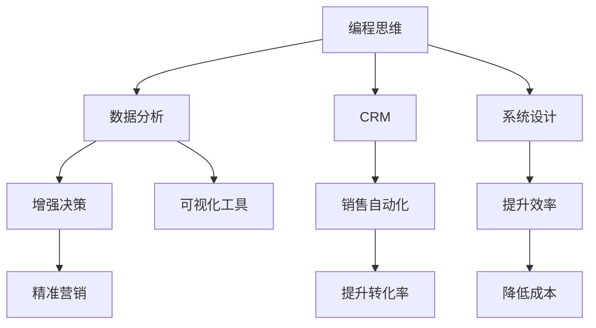

                 

# 如何将编程技能转化为销售能力

在快速发展的科技时代，将编程技能与销售能力相结合，已经成为企业和个人追求成长与竞争力的重要手段。本文旨在探索如何通过编程思维和技术手段，有效提升销售人员的业绩和职业发展，为销售团队注入新的活力和竞争力。

## 1. 背景介绍

### 1.1 问题由来

随着互联网的普及和电子商务的兴起，销售模式和客户需求发生了深刻的变化。传统以产品为中心的销售方式，正在向以客户体验为中心的销售模式转变。在这种背景下，销售人员需要具备更全面的技能，以应对多变而复杂的市场环境。

传统销售技能包括市场调研、产品知识、谈判技巧等，而现代销售人员还需掌握数据分析、网络营销、客户关系管理(CRM)等技术技能。这些技能不仅需要销售人员具备深厚的市场洞察力和沟通能力，更需要他们掌握一定的编程技能，以便在处理海量数据、进行精准营销时更高效、更灵活。

### 1.2 问题核心关键点

将编程技能转化为销售能力的核心在于：

- 利用编程思维优化销售流程，提高效率。
- 通过数据分析技术提升销售决策的精准性。
- 开发定制化的客户管理系统，增强客户关系管理能力。
- 运用自动化工具简化繁琐的销售工作，提升工作效率。
- 实现销售数据可视化和报告生成，增强决策支持。

## 2. 核心概念与联系

### 2.1 核心概念概述

为更好地理解如何将编程技能转化为销售能力，本节将介绍几个密切相关的核心概念：

- **编程思维(Programming Mindset)**：一种系统化的思考方式，强调逻辑性、抽象性、模块化和可复用性。通过编程思维，可以提高问题解决能力和系统设计能力。
- **数据分析(Analytical Skills)**：利用统计学和机器学习等技术，从数据中提取有用信息，为销售决策提供支持。
- **客户关系管理(CRM)**：通过自动化工具和技术，管理客户信息、沟通记录等，提升客户满意度和忠诚度。
- **销售自动化(Automated Sales Processes)**：运用软件和系统，自动化销售流程，包括线索管理、客户跟进、销售预测等。
- **可视化工具(Visualization Tools)**：通过图形界面展示数据，使销售人员能够更直观地理解和分析数据。

这些核心概念之间的逻辑关系可以通过以下Mermaid流程图来展示：



这个流程图展示了一系列的逻辑流程：

1. 编程思维通过系统化设计提升效率。
2. 数据分析增强决策的精准性。
3. CRM增强客户管理能力。
4. 自动化简化销售流程，提升转化率。
5. 可视化工具增强数据理解能力。

## 3. 核心算法原理 & 具体操作步骤
### 3.1 算法原理概述

将编程技能转化为销售能力的核心算法原理可以归纳为以下几个方面：

- **数据收集与处理**：通过编程技能采集和处理销售数据，如客户信息、销售记录、市场反馈等，为数据分析和决策提供数据支持。
- **数据建模与分析**：利用编程技能构建统计模型和机器学习模型，从数据中提取有用的信息，预测销售趋势，优化销售策略。
- **自动化流程设计**：通过编程实现销售流程的自动化，包括线索管理、客户跟进、销售预测等，提升销售效率和转化率。
- **客户管理系统构建**：通过编程设计和实现客户关系管理系统，实现客户信息的有效管理，增强客户关系。
- **决策支持系统开发**：利用编程技能开发可视化工具和报告系统，支持销售决策，提高决策的准确性和速度。

### 3.2 算法步骤详解

以下将详细介绍将编程技能转化为销售能力的各个关键步骤：

#### Step 1: 数据收集与预处理

**数据收集**：
- 利用编程技能编写爬虫程序，从网站、社交媒体等渠道采集销售数据。
- 使用API接口获取第三方数据，如天气、地理信息等。
- 通过SQL或数据库操作，获取内部销售记录和客户信息。

**数据预处理**：
- 清洗数据，去除噪声和异常值，确保数据的准确性。
- 对数据进行归一化和标准化处理，以便后续分析。
- 将数据分为训练集和测试集，用于模型训练和验证。

#### Step 2: 数据分析与建模

**数据分析**：
- 使用Python或R等编程语言进行数据分析，如描述性统计、相关性分析等。
- 利用Pandas、NumPy等库进行数据处理和分析。
- 使用Scikit-learn、TensorFlow等库构建统计模型和机器学习模型，进行预测和分类。

**数据建模**：
- 构建线性回归、逻辑回归、决策树、随机森林等统计模型，进行销售趋势预测。
- 使用神经网络、支持向量机、深度学习等机器学习模型，进行客户分类和行为预测。
- 利用集成学习、交叉验证等技术，提高模型的准确性和鲁棒性。

#### Step 3: 自动化流程设计与实现

**自动化流程设计**：
- 设计线索管理系统，自动化跟进客户线索，生成跟进计划。
- 设计客户跟进流程，自动化发送跟进邮件和信息，提升客户满意度。
- 设计销售预测系统，自动化预测销售目标和业绩，生成销售报告。

**自动化流程实现**：
- 利用Python或JavaScript等编程语言编写脚本，实现自动化任务。
- 使用Zapier、IFTTT等自动化工具，连接不同应用和系统，实现跨应用自动化。
- 使用Zuulz或Salesforce等CRM系统，实现客户信息管理和自动化跟进。

#### Step 4: 客户管理系统构建

**客户管理系统设计**：
- 设计客户信息记录表，包括客户基本信息、购买记录、沟通记录等。
- 设计客户关系图谱，展示客户间的关系和联系。
- 设计客户反馈收集表，收集客户满意度反馈和建议。

**客户管理系统实现**：
- 使用数据库技术（如MySQL、MongoDB）存储和管理客户信息。
- 利用编程技能实现客户信息查询和导出功能。
- 使用Web开发技术（如Flask、Django）实现客户管理系统界面，便于销售人员使用。

#### Step 5: 决策支持系统开发

**决策支持系统设计**：
- 设计可视化报表，展示销售数据和分析结果。
- 设计仪表盘，实时展示销售业绩和趋势。
- 设计预测模型，预测销售目标和业绩，生成自动化销售报告。

**决策支持系统实现**：
- 利用Tableau、Power BI等可视化工具，展示和分析数据。
- 使用Python或R等编程语言，开发定制化的数据分析和报告生成工具。
- 集成决策支持系统到销售管理系统，支持决策过程。

### 3.3 算法优缺点

将编程技能转化为销售能力的方法具有以下优点：

- **提升效率**：通过自动化和编程优化销售流程，节省大量时间和人力资源。
- **增强决策精准性**：利用数据分析和机器学习模型，提升销售决策的科学性和准确性。
- **系统可扩展性**：通过编程设计和实现系统，便于后续的优化和扩展。
- **技术壁垒提升**：掌握编程技能和数据分析能力，增强个人竞争力，获取更多职业发展机会。

同时，该方法也存在一定的局限性：

- **技术门槛较高**：需要具备一定的编程基础和数据分析能力，学习成本较高。
- **数据质量要求高**：数据收集和处理过程中，需要保证数据的质量和完整性。
- **系统集成难度大**：不同的系统和工具之间需要良好的集成和兼容，有时需要开发定制化的解决方案。
- **需求变化快**：销售需求和市场环境变化迅速，需要快速调整系统，更新数据模型。

## 4. 数学模型和公式 & 详细讲解  
### 4.1 数学模型构建

本节将使用数学语言对将编程技能转化为销售能力的技术流程进行更加严格的刻画。

设销售数据集为 $D=\{(x_i,y_i)\}_{i=1}^N, x_i \in \mathcal{X}, y_i \in \mathcal{Y}$，其中 $x_i$ 为特征向量，$y_i$ 为销售结果。定义损失函数 $\ell(y_i,\hat{y}_i)$，用于衡量预测结果与实际结果之间的差距。

假设销售流程中存在若干个步骤，每个步骤对应一个函数 $f_j(x_j)$，其中 $x_j$ 为当前步骤的输入数据，$f_j$ 为函数映射关系。最终销售结果为 $y=\bigcup_{j=1}^M f_j(x_j)$，其中 $M$ 为销售步骤数。

在数据收集和预处理阶段，需要构建数据采集函数 $D_{\text{collect}}$ 和数据预处理函数 $D_{\text{preprocess}}$，确保数据的准确性和可用性。

在数据分析和建模阶段，需要构建数据特征提取函数 $F_{\text{extract}}$ 和模型训练函数 $M_{\text{train}}$，提取特征并进行模型训练。

在自动化流程设计和实现阶段，需要构建流程自动化函数 $P_{\text{auto}}$，自动化实现销售流程。

在客户管理系统构建阶段，需要构建客户信息管理函数 $C_{\text{manage}}$ 和关系图谱构建函数 $C_{\text{graph}}$，实现客户信息的管理和展示。

在决策支持系统开发阶段，需要构建数据可视化函数 $V_{\text{visualize}}$ 和报告生成函数 $R_{\text{generate}}$，实现数据可视化和决策支持。

### 4.2 公式推导过程

以下我们以二分类任务为例，推导模型训练的损失函数及其梯度的计算公式。

假设模型 $M_{\theta}$ 在输入 $x$ 上的输出为 $\hat{y}=M_{\theta}(x) \in [0,1]$，表示样本属于正类的概率。真实标签 $y \in \{0,1\}$。则二分类交叉熵损失函数定义为：

$$
\ell(M_{\theta}(x),y) = -[y\log \hat{y} + (1-y)\log (1-\hat{y})]
$$

将其代入经验风险公式，得：

$$
\mathcal{L}(\theta) = -\frac{1}{N}\sum_{i=1}^N [y_i\log M_{\theta}(x_i)+(1-y_i)\log(1-M_{\theta}(x_i))]
$$

根据链式法则，损失函数对参数 $\theta_k$ 的梯度为：

$$
\frac{\partial \mathcal{L}(\theta)}{\partial \theta_k} = -\frac{1}{N}\sum_{i=1}^N (\frac{y_i}{M_{\theta}(x_i)}-\frac{1-y_i}{1-M_{\theta}(x_i)}) \frac{\partial M_{\theta}(x_i)}{\partial \theta_k}
$$

其中 $\frac{\partial M_{\theta}(x_i)}{\partial \theta_k}$ 可进一步递归展开，利用自动微分技术完成计算。

在得到损失函数的梯度后，即可带入参数更新公式，完成模型的迭代优化。重复上述过程直至收敛，最终得到适应销售任务的最优模型参数 $\theta^*$。

## 5. 项目实践：代码实例和详细解释说明
### 5.1 开发环境搭建

在进行销售自动化实践前，我们需要准备好开发环境。以下是使用Python进行项目开发的简要环境配置流程：

1. 安装Anaconda：从官网下载并安装Anaconda，用于创建独立的Python环境。

2. 创建并激活虚拟环境：
```bash
conda create -n sales-env python=3.8 
conda activate sales-env
```

3. 安装必要库：
```bash
pip install pandas numpy scikit-learn sqlalchemy sqlalchemy-sqlalchemy pyodbc matplotlib jupyter notebook ipython
```

4. 配置数据库：
```bash
sqlalchemy setup --configure -e sales-env
```

完成上述步骤后，即可在`sales-env`环境中开始销售自动化的开发实践。

### 5.2 源代码详细实现

下面我们以销售预测系统为例，给出使用Python和Pandas库对销售数据进行建模的代码实现。

首先，准备数据：

```python
import pandas as pd
import numpy as np

data = pd.read_csv('sales_data.csv')

# 数据预处理
data['date'] = pd.to_datetime(data['date'])
data['weekday'] = data['date'].dt.weekday
data['month'] = data['date'].dt.month
data['day_of_year'] = data['date'].dt.day_of_year
data['season'] = data['month'].apply(lambda x: 'Q1' if x <= 3 else 'Q2' if x <= 6 else 'Q3' if x <= 9 else 'Q4')

# 特征工程
data['temperature'] = data['weather'].map({'Sunny': 0, 'Partly Cloudy': 1, 'Cloudy': 2, 'Rain': 3, 'Snow': 4})
data['holiday'] = data['date'].map({'Holiday': 1, 'Non-Holiday': 0})

# 训练集和测试集划分
train_data = data[data['date'] < '2021-01-01']
test_data = data[data['date'] >= '2021-01-01']
```

然后，构建模型：

```python
from sklearn.linear_model import LinearRegression

# 特征选择
X = train_data[['day_of_year', 'season', 'temperature', 'holiday']].values
y = train_data['sales'].values

# 模型训练
model = LinearRegression()
model.fit(X, y)

# 模型评估
test_X = test_data[['day_of_year', 'season', 'temperature', 'holiday']].values
test_y = test_data['sales'].values
score = model.score(test_X, test_y)
print(f'模型评估得分: {score:.2f}')
```

接着，训练和评估模型：

```python
from sklearn.model_selection import train_test_split

# 数据拆分
X_train, X_test, y_train, y_test = train_test_split(X, y, test_size=0.2, random_state=42)

# 模型训练
model = LinearRegression()
model.fit(X_train, y_train)

# 模型评估
score = model.score(X_test, y_test)
print(f'模型评估得分: {score:.2f}')
```

最后，运行预测并生成报告：

```python
# 生成预测结果
predictions = model.predict(test_X)

# 生成报告
import matplotlib.pyplot as plt

plt.figure(figsize=(10, 6))
plt.plot(test_data['date'], test_data['sales'], label='Actual')
plt.plot(test_data['date'], predictions, label='Predicted')
plt.legend()
plt.show()
```

以上就是使用Python和Pandas库对销售数据进行建模的完整代码实现。可以看到，通过编程技能，我们能够高效地处理和分析数据，构建模型并进行预测。

### 5.3 代码解读与分析

让我们再详细解读一下关键代码的实现细节：

**数据准备**：
- 使用Pandas读取销售数据文件，进行清洗和处理。
- 将日期字段转换为时间戳，并提取周数、月数和季节。
- 使用特征工程技术，将天气、节日等非数值型特征转化为数值型特征。

**模型训练**：
- 使用Scikit-learn库中的LinearRegression模型，进行线性回归训练。
- 将特征和标签数据传入模型，进行模型训练。
- 使用模型评估函数score计算模型在测试集上的评分。

**预测和报告生成**：
- 使用模型进行销售预测，生成预测结果。
- 使用Matplotlib库绘制实际销售和预测销售的对比图，展示模型效果。

可以看到，编程技能在数据处理、模型构建、结果展示等各个环节都起到了关键作用。通过编程，我们不仅能够高效地进行数据处理和模型训练，还能将分析结果以直观的方式展示出来，为销售决策提供支持。

## 6. 实际应用场景
### 6.1 智能销售助手

智能销售助手是一种基于编程技能和数据分析能力的智能工具，能够实时监控销售数据，提供销售建议和决策支持。通过集成多种功能，智能销售助手可以显著提升销售人员的工作效率和业绩。

在技术实现上，智能销售助手可以采集公司内部的销售数据，如客户信息、销售记录等，结合外部市场数据（如天气、节假日等），使用数据分析和机器学习技术，构建预测模型，自动生成销售建议和预警。销售人员可以通过界面查看预测结果，接收系统推荐的销售策略，优化销售活动。

### 6.2 客户细分与个性化营销

客户细分和个性化营销是提升销售业绩的重要手段。通过编程技能和数据分析技术，可以实现基于客户行为和属性特征的细分，制定个性化的营销策略。

具体而言，可以收集客户的历史购买记录、互动记录、社交媒体数据等，使用聚类算法和关联规则挖掘等技术，对客户进行细分。在细分的客户群体中，根据客户的消费行为、偏好和需求，制定个性化的销售策略和推荐商品，提升客户满意度和忠诚度。

### 6.3 销售预测与库存管理

销售预测和库存管理是销售管理的核心环节，通过编程技能和数据分析技术，可以实现准确的销售预测，优化库存管理。

在销售预测方面，可以收集历史销售数据、市场趋势、促销活动等数据，构建时间序列模型（如ARIMA、LSTM等）进行销售预测。预测结果可以用于制定销售计划和促销策略，减少库存积压和缺货情况。

在库存管理方面，可以实时监控销售数据和库存情况，自动调整订货量和补货计划，优化库存结构，降低库存成本。

### 6.4 未来应用展望

随着编程技能和数据分析技术的不断发展，销售自动化的未来应用场景将更加广阔。

- **智能推荐系统**：利用编程技能和数据分析技术，构建智能推荐系统，根据客户的浏览记录、购买记录、搜索记录等数据，推荐相关商品，提升客户购物体验和销售转化率。
- **自动化客服系统**：通过编程技能和数据分析技术，构建自动化客服系统，处理客户咨询和反馈，提升客户满意度。
- **大数据分析与决策支持**：利用大数据分析和机器学习技术，构建决策支持系统，支持销售策略优化和市场分析。
- **区块链技术应用**：利用区块链技术，确保销售数据的透明性和安全性，实现数据共享和合作，提升企业竞争力和客户信任度。

## 7. 工具和资源推荐
### 7.1 学习资源推荐

为了帮助开发者系统掌握将编程技能转化为销售能力的理论基础和实践技巧，这里推荐一些优质的学习资源：

1. **《Python编程：从入门到实践》**：一本经典的Python入门书籍，涵盖基础语法、数据分析、Web开发等方面的内容，适合初学者入门。
2. **Coursera《数据科学专业》课程**：斯坦福大学开设的在线课程，涵盖数据科学、机器学习、统计学等领域的核心内容，具有很强的实战性。
3. **Kaggle数据科学竞赛**：一个数据科学社区，提供大量的数据集和比赛项目，通过实践积累数据分析和机器学习的经验。
4. **Scikit-learn官方文档**：Scikit-learn库的官方文档，提供了丰富的数据处理、机器学习模型和工具的使用指南。
5. **Salesforce官方文档**：Salesforce CRM系统的官方文档，提供了系统配置、自定义开发、集成应用等方面的详细指南。

通过对这些资源的学习实践，相信你一定能够快速掌握将编程技能转化为销售能力的关键技术，并将其应用于实际工作中。

### 7.2 开发工具推荐

高效的开发离不开优秀的工具支持。以下是几款用于销售自动化开发的常用工具：

1. **Jupyter Notebook**：一个开源的Web应用程序，支持Python等编程语言的交互式编程和数据分析，适合进行复杂的数据处理和模型训练。
2. **Pandas**：一个开源的数据分析库，提供了丰富的数据处理和分析功能，支持多种数据格式和操作。
3. **Scikit-learn**：一个开源的机器学习库，提供了多种机器学习算法和工具，适合进行数据建模和预测。
4. **Flask**：一个轻量级的Web框架，支持Python编程，适合快速开发Web应用和API接口。
5. **SQLAlchemy**：一个开源的数据库访问库，提供了丰富的ORM（对象关系映射）功能和SQL语句构建工具，适合进行数据库操作和数据管理。
6. **Tableau**：一个流行的数据可视化工具，支持多种数据源和图表展示方式，适合进行数据可视化和报告生成。

合理利用这些工具，可以显著提升销售自动化任务的开发效率，加快创新迭代的步伐。

### 7.3 相关论文推荐

将编程技能转化为销售能力的研究源于学界的持续探索。以下是几篇奠基性的相关论文，推荐阅读：

1. **"Programming in the Key of Data"**：一篇探讨数据驱动编程范式的论文，强调编程思维与数据分析的结合，提升问题解决能力。
2. **"Sales Predictive Analytics: A Practical Guide to Using Data Mining for Sales"**：一本关于销售预测分析的书籍，详细介绍了如何利用数据建模和机器学习技术进行销售预测。
3. **"The Power of Predictive Analytics in Sales"**：一篇探讨预测分析在销售中的应用的论文，强调了数据分析在销售决策中的重要性。
4. **"Machine Learning in Sales"**：一篇关于机器学习在销售中的应用综述，介绍了多种机器学习算法和工具在销售领域的应用。
5. **"Sales Data Analytics: A Practical Guide to Analyzing Sales Data"**：一本关于销售数据分析的书籍，提供了丰富的数据分析和建模技术。

这些论文代表了大数据与销售结合的研究方向，通过学习这些前沿成果，可以帮助研究者把握学科前进方向，激发更多的创新灵感。

## 8. 总结：未来发展趋势与挑战

### 8.1 总结

本文对将编程技能转化为销售能力进行了全面系统的介绍。首先阐述了这一技术背景和实际意义，明确了编程技能在销售自动化中的关键作用。其次，从原理到实践，详细讲解了编程技能转化为销售能力的数学原理和操作步骤，给出了完整的代码实现和分析。同时，本文还广泛探讨了这一技术在智能销售助手、客户细分与个性化营销、销售预测与库存管理等领域的实际应用，展示了其广阔的落地前景。最后，本文精选了相关的学习资源、开发工具和论文，力求为读者提供全方位的技术指引。

通过本文的系统梳理，可以看到，将编程技能转化为销售能力是大数据与销售结合的重要方向，极大地提升了销售流程的效率和精确性。编程技能使得数据处理和模型构建变得更加高效，数据分析和机器学习技术为销售决策提供了科学依据，两者结合为销售自动化注入新的活力和竞争力。未来，随着技术的不断发展，这一技术的普及和应用，必将使销售行业发生深刻的变革。

### 8.2 未来发展趋势

展望未来，将编程技能转化为销售能力将呈现以下几个发展趋势：

1. **数据驱动决策**：大数据和机器学习技术将进一步渗透到销售决策中，销售人员将更加依赖数据驱动的决策过程，提升决策的科学性和精准性。
2. **智能化交互**：智能销售助手、聊天机器人等智能化交互工具将更加普及，提升客户体验和销售效率。
3. **个性化营销**：基于客户数据和行为分析的个性化营销策略将更加普遍，提升客户满意度和忠诚度。
4. **实时化监控**：销售预测和库存管理将实现实时监控和预测，提升企业运营效率。
5. **多渠道整合**：线上和线下销售渠道将进一步整合，实现全渠道的销售自动化管理。
6. **区块链技术应用**：利用区块链技术，确保销售数据的透明性和安全性，提升企业信任度和客户满意度。

这些趋势表明，将编程技能转化为销售能力将在未来发挥更大的作用，为销售行业带来深刻的变革。

### 8.3 面临的挑战

尽管将编程技能转化为销售能力已经取得了一定进展，但在走向普及和应用的过程中，仍面临诸多挑战：

1. **数据质量问题**：销售数据的质量和完整性问题，直接影响到数据建模和预测的准确性。
2. **技术门槛较高**：掌握编程技能和数据分析技术需要一定的学习成本，销售人员需要具备一定的技术基础。
3. **系统集成难度大**：不同系统和工具之间的集成和兼容问题，需要开发定制化的解决方案。
4. **需求变化快**：销售需求和市场环境变化迅速，需要快速调整系统和模型，更新数据和算法。
5. **安全性和隐私保护**：销售数据的隐私保护和系统安全问题，需要严格的数据管理和访问控制。
6. **客户信任度**：自动化的销售助手和推荐系统需要建立客户信任，避免客户对自动化的不信任和反感。

这些挑战需要从数据质量、技术支持、系统集成、需求响应等方面进行综合优化，才能真正实现销售自动化的普及和应用。

### 8.4 研究展望

面向未来，将编程技能转化为销售能力的研究需要在以下几个方面寻求新的突破：

1. **数据融合与集成**：如何更好地融合和集成不同来源的数据，构建更全面、准确的数据模型。
2. **实时处理与流数据**：如何处理和分析实时数据流，实现实时销售预测和决策支持。
3. **个性化与推荐系统**：如何构建更加个性化和智能化的推荐系统，提升客户满意度和转化率。
4. **自动化与智能化交互**：如何进一步提升智能销售助手和聊天机器人的智能化水平，提升客户体验和效率。
5. **区块链与数据透明**：如何利用区块链技术确保销售数据的透明性和安全性，提升企业信任度和客户满意度。
6. **安全与隐私保护**：如何建立严格的数据管理和访问控制机制，保护客户隐私和数据安全。

这些研究方向将引领销售自动化技术的发展方向，为构建智能、高效、安全的销售系统提供新的思路和方案。

## 9. 附录：常见问题与解答

**Q1: 将编程技能转化为销售能力是否适合所有销售人员？**

A: 将编程技能转化为销售能力对于数据驱动型销售团队尤其适合。适合那些具备数据分析基础和编程技能的销售人员，能够更好地利用数据和模型进行销售决策和策略优化。然而，对于传统销售人员，特别是新入行或基础较弱的销售人员，可能有一定的技术门槛和学习成本。

**Q2: 如何平衡数据隐私和业务需求？**

A: 数据隐私和业务需求之间的平衡是销售自动化中需要重点考虑的问题。在数据收集和处理过程中，需要遵循数据保护法规，如GDPR、CCPA等，确保客户数据的合法性和安全性。可以采用匿名化处理、去标识化处理等技术，减少对客户隐私的侵害。同时，建立严格的数据访问和管理系统，确保只有授权人员能够访问和处理数据。

**Q3: 如何提升销售自动化的可扩展性？**

A: 提升销售自动化的可扩展性需要从多个方面入手：
1. 构建模块化和可扩展的系统架构，方便后续的扩展和优化。
2. 采用云计算和容器化技术，实现快速部署和弹性扩展。
3. 开发标准的API接口和数据格式，方便与其他系统和应用的集成。
4. 使用DevOps工具和持续集成(CI)工具，快速迭代和发布新功能。

**Q4: 销售自动化如何应对需求变化？**

A: 销售需求和市场环境变化迅速，销售自动化系统需要具备良好的可扩展性和灵活性。可以通过以下方式应对需求变化：
1. 使用微服务架构，方便对不同模块进行独立的扩展和更新。
2. 建立持续集成的CI/CD流水线，快速部署新功能和更新。
3. 使用先进的算法和模型，支持动态调整和优化。
4. 持续收集和分析客户反馈，快速响应需求变化。

**Q5: 如何将编程技能转化为销售能力的最佳实践？**

A: 以下是一些将编程技能转化为销售能力的最佳实践：
1. 培养数据驱动的销售思维，提升对数据的敏感度和分析能力。
2. 学习数据分析和机器学习的核心技术，掌握常用的数据处理和模型构建工具。
3. 参与销售数据建模和预测项目，积累实战经验，提升技能水平。
4. 与数据科学家和IT团队紧密合作，构建数据驱动的决策支持系统。
5. 不断学习新技术和新方法，提升自身的技术能力和竞争力。

通过这些最佳实践，销售人员可以更好地将编程技能转化为销售能力，提升自身竞争力，实现职业发展。

---

作者：禅与计算机程序设计艺术 / Zen and the Art of Computer Programming

