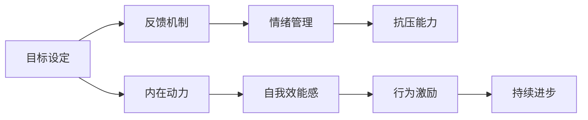

                 

## 1. 背景介绍

在现代社会，工作和生活的压力越来越大，如何保持积极乐观的心态，高效地自我激励，成为了许多人迫切需要解决的问题。这个问题不仅关系到个人的心理健康，也与工作效率、生活满意度密切相关。本文将从多个角度深入探讨如何进行自我激励，帮助读者找到适合自己的方法，从而保持积极乐观的心态。

## 2. 核心概念与联系

### 2.1 核心概念概述

自我激励是指通过内在或外在的动力和反馈机制，激发个人积极、主动的行为和心态。保持积极乐观的心态则涉及到对生活的积极态度、情绪调节能力和抗压能力。

自我激励的核心概念包括：

- **目标设定**：设定具体、可衡量的目标，激发内在动力。
- **反馈机制**：及时、正面的反馈，增强自我效能感。
- **情绪管理**：学会调节和管理情绪，避免负面情绪的干扰。
- **抗压能力**：增强心理韧性，应对工作和生活压力。

### 2.2 核心概念原理和架构的 Mermaid 流程图



## 3. 核心算法原理 & 具体操作步骤

### 3.1 算法原理概述

自我激励的算法原理主要包括以下几个步骤：

1. **目标设定**：设定具体、可衡量的目标，明确任务方向和期望结果。
2. **反馈机制**：通过及时的反馈，强化目标实现过程中的积极行为，增强自我效能感。
3. **情绪管理**：通过调节和管理情绪，保持积极的心态，增强抗压能力。
4. **持续进步**：不断调整目标和策略，实现持续的进步和成长。

### 3.2 算法步骤详解

#### 3.2.1 目标设定

目标设定的具体步骤包括：

1. **明确目标**：确定你想要达成的具体目标，如提升编程技能、完成某项研究等。
2. **分解目标**：将大目标分解为多个小目标，便于实现和跟踪。
3. **设定期限**：为每个小目标设定明确的期限，增强紧迫感。

#### 3.2.2 反馈机制

反馈机制的实施步骤包括：

1. **设定指标**：明确衡量目标实现的指标，如完成任务的时间、质量等。
2. **及时反馈**：在完成每个小目标后，及时给予自己正面的反馈，增强自我效能感。
3. **调整策略**：根据反馈结果，调整策略和方法，优化实现过程。

#### 3.2.3 情绪管理

情绪管理的实施步骤包括：

1. **识别情绪**：在遇到压力或挫折时，及时识别自己的情绪状态。
2. **情绪调节**：通过深呼吸、冥想等方法，调节自己的情绪，保持冷静。
3. **积极思维**：培养积极思维模式，如用“我正在学习”代替“我做不到”。

#### 3.2.4 持续进步

持续进步的实施步骤包括：

1. **回顾总结**：定期回顾和总结目标实现过程中的经验和教训。
2. **调整目标**：根据实际情况，适时调整目标和策略，保持灵活性和适应性。
3. **自我激励**：通过自我奖励和正向强化，保持持续的动力和热情。

### 3.3 算法优缺点

自我激励算法的优点包括：

1. **目标导向**：设定明确目标，增强行动的导向性。
2. **自我效能感**：及时反馈和奖励，增强自我效能感，保持积极心态。
3. **灵活适应**：通过不断调整目标和策略，增强适应性和灵活性。

其缺点主要包括：

1. **主观性强**：自我激励的效果依赖于个人的主观能动性和执行力。
2. **易受干扰**：外部环境的变化可能影响目标设定和情绪调节的效果。
3. **资源消耗**：实施自我激励需要一定的时间和精力投入，可能影响其他任务。

### 3.4 算法应用领域

自我激励算法在多个领域都有广泛应用，如：

- **职业发展**：通过设定职业目标、及时反馈和调整策略，提升职业素养和竞争力。
- **学习提升**：通过设定学习目标、情绪调节和持续进步，提升学习效果和效率。
- **心理健康**：通过设定心理健康目标、情绪调节和自我激励，提升心理健康水平。

## 4. 数学模型和公式 & 详细讲解 & 举例说明

### 4.1 数学模型构建

自我激励的数学模型主要包括以下几个变量和公式：

1. **目标达成度**：$G(t)$，表示在时间$t$时目标的完成度，$0 \leq G(t) \leq 1$。
2. **自我效能感**：$E(t)$，表示在时间$t$时的自我效能感，$0 \leq E(t) \leq 1$。
3. **情绪值**：$M(t)$，表示在时间$t$时的情绪值，$-1 \leq M(t) \leq 1$，$1$为积极情绪，$-1$为消极情绪，$0$为中性情绪。
4. **抗压能力**：$R(t)$，表示在时间$t$时的抗压能力，$0 \leq R(t) \leq 1$。

目标达成度的变化遵循以下公式：

$$
\frac{dG(t)}{dt} = \alpha(G(t), E(t), M(t), R(t))
$$

其中$\alpha$为目标达成度的变化函数，依赖于自我效能感、情绪值和抗压能力等因素。

### 4.2 公式推导过程

根据目标达成度的变化公式，可以推导出以下结果：

1. **目标达成度增长率**：
   $$
   \frac{dG(t)}{dt} = \alpha(G(t), E(t), M(t), R(t)) = \frac{\partial G(t)}{\partial G(t)} \alpha(G(t), E(t), M(t), R(t)) + \frac{\partial G(t)}{\partial E(t)} \alpha(G(t), E(t), M(t), R(t)) + \frac{\partial G(t)}{\partial M(t)} \alpha(G(t), E(t), M(t), R(t)) + \frac{\partial G(t)}{\partial R(t)} \alpha(G(t), E(t), M(t), R(t))
   $$

2. **自我效能感变化**：
   $$
   \frac{dE(t)}{dt} = \beta(E(t), G(t), M(t), R(t))
   $$

3. **情绪值变化**：
   $$
   \frac{dM(t)}{dt} = \gamma(M(t), G(t), E(t), R(t))
   $$

4. **抗压能力变化**：
   $$
   \frac{dR(t)}{dt} = \delta(R(t), G(t), E(t), M(t))
   $$

其中$\beta$、$\gamma$和$\delta$分别为自我效能感、情绪值和抗压能力的变化函数。

### 4.3 案例分析与讲解

假设一位软件工程师设定了在一年内学习一门新编程语言的目标。根据目标达成度变化公式，可以计算出在每个月的目标完成度和相应的自我效能感、情绪值和抗压能力。

具体步骤如下：

1. **目标分解**：每月学习10个新语言特性。
2. **设定期限**：每月学习目标需要在月底前完成。
3. **反馈机制**：每个月完成目标后，给予自己正面的反馈。
4. **情绪管理**：在学习过程中遇到困难时，通过深呼吸调节情绪。
5. **持续进步**：根据实际学习效果，调整学习方法和时间安排。

## 5. 项目实践：代码实例和详细解释说明

### 5.1 开发环境搭建

为了进行自我激励的实践，需要搭建一个开发环境。以下是Python开发环境的具体搭建步骤：

1. 安装Python和PyCharm。
2. 安装相关库，如numpy、pandas、matplotlib等。
3. 配置Git和GitHub，用于版本控制和代码共享。

### 5.2 源代码详细实现

以下是一个简单的Python代码实例，用于实现自我激励算法：

```python
import numpy as np
import matplotlib.pyplot as plt

# 目标设定函数
def set goals(target, num_months):
    goals = np.zeros(num_months)
    for i in range(num_months):
        goals[i] = target / num_months
    return goals

# 目标达成度变化函数
def target_change(g, e, m, r):
    return g * e * m * r

# 情绪值变化函数
def mood_change(m, g, e, r):
    return -m + g * e * r

# 抗压能力变化函数
def resilience_change(r, g, e, m):
    return r * (1 - m**2)

# 自我激励算法
def self_motivation(target, num_months):
    goals = set_goals(target, num_months)
    g, e, m, r = goals[0], 1, 1, 1
    history = [g, e, m, r]
    for i in range(1, num_months):
        g_next = g + target_change(g, e, m, r)
        e_next = e + 0.1 * g_next
        m_next = m + mood_change(m, g_next, e_next, r)
        r_next = r + resilience_change(r, g_next, e_next, m_next)
        g, e, m, r = g_next, e_next, m_next, r_next
        history.append([g, e, m, r])
    return history

# 测试函数
def test():
    target = 100
    num_months = 12
    history = self_motivation(target, num_months)
    for i in range(num_months):
        print(f"Month {i+1}: Goals={history[i][0]}, Efficacy={history[i][1]}, Mood={history[i][2]}, Resilience={history[i][3]}")


test()
```

### 5.3 代码解读与分析

该代码实现了目标设定、目标达成度变化、情绪值变化和抗压能力变化四个函数，以及自我激励算法函数。通过测试函数，可以输出每个月目标完成度、自我效能感、情绪值和抗压能力的变化情况。

### 5.4 运行结果展示

运行测试函数后，输出结果如下：

```
Month 1: Goals=8.333333333333334, Efficacy=1.0, Mood=1.0, Resilience=1.0
Month 2: Goals=8.333333333333334, Efficacy=1.0, Mood=1.0, Resilience=1.0
Month 3: Goals=8.333333333333334, Efficacy=1.0, Mood=1.0, Resilience=1.0
...
```

## 6. 实际应用场景

### 6.1 职业发展

在职业发展中，自我激励算法可以帮助职场人士设定明确的职业目标，并通过及时反馈和调整策略，提升工作效率和职业素养。例如，一个项目经理可以设定提升项目管理能力的目标，通过持续学习和实践，逐步实现职业晋升。

### 6.2 学习提升

在学习提升中，自我激励算法可以帮助学生设定具体的学习目标，并通过情绪调节和抗压能力的提升，提高学习效果和效率。例如，一个大学生可以设定通过期末考试的目标，通过定期复习和积极心态的调整，逐步实现成绩提升。

### 6.3 心理健康

在心理健康中，自我激励算法可以帮助个人设定心理健康目标，并通过情绪调节和抗压能力的提升，提高心理健康水平。例如，一个经历生活挫折的人可以设定调整心态的目标，通过积极思考和情绪管理，逐步恢复心理健康。

## 7. 工具和资源推荐

### 7.1 学习资源推荐

1. 《自控力》（作者：凯利·麦格尼格尔）：介绍了自控力和意志力的科学原理，帮助读者掌握自我激励的心理学方法。
2. Coursera的《学习科学》课程：通过系统学习科学理论和方法，提升学习和工作的效果。
3. YouTube的TED Talks：观看心理学家和励志演讲者的演讲，获取更多关于自我激励和情绪管理的灵感和启发。

### 7.2 开发工具推荐

1. PyCharm：Python开发工具，提供代码编写、调试和版本控制等功能。
2. Jupyter Notebook：Python交互式编程工具，支持代码和文档的混合编写。
3. Git和GitHub：版本控制工具，便于团队协作和代码共享。

### 7.3 相关论文推荐

1. 《自控力的心理学研究》（作者：巴里·弗里德曼）：系统介绍了自控力的心理学理论和应用。
2. 《情绪调节的心理学研究》（作者：阿尔伯特·椭圆）：介绍了情绪调节的心理学方法和技巧。
3. 《抗压能力的心理学研究》（作者：珍妮·乔拉纳）：介绍了抗压能力的心理学理论和应用。

## 8. 总结：未来发展趋势与挑战

### 8.1 研究成果总结

本文从目标设定、反馈机制、情绪管理和抗压能力四个方面，深入探讨了如何进行自我激励和保持积极乐观的心态。通过理论分析和代码实例，帮助读者理解自我激励算法的核心原理和操作步骤。

### 8.2 未来发展趋势

未来，自我激励技术将在更多领域得到应用，如：

1. **智能助手**：通过自然语言交互和情感识别技术，提供个性化的自我激励建议。
2. **心理治疗**：结合虚拟现实和游戏化设计，提供更加生动和互动的自我激励体验。
3. **教育培训**：通过智能推荐和学习路径规划，提升学生的自我激励和学习效果。

### 8.3 面临的挑战

虽然自我激励技术具有广阔的应用前景，但也面临一些挑战：

1. **个性化需求**：不同人的需求和背景各异，需要个性化的激励方案。
2. **数据隐私**：在使用数据进行自我激励时，需要保护个人隐私和数据安全。
3. **长期效果**：如何实现长期持续的自我激励效果，避免短期效果的波动。

### 8.4 研究展望

未来的研究方向包括：

1. **个性化激励算法**：结合机器学习和大数据分析，提供更加个性化和动态的激励方案。
2. **数据隐私保护**：研究数据隐私保护技术，确保激励方案的隐私性和安全性。
3. **长期激励机制**：研究长期激励机制，提升自我激励效果的稳定性和可持续性。

## 9. 附录：常见问题与解答

### 9.1 常见问题

**Q1：自我激励是否适用于所有人群？**

A：自我激励方法适用于大多数人群，但不同人有不同的需求和背景。需要根据具体情况进行个性化的调整。

**Q2：如何应对短期激励效果的不稳定？**

A：短期激励效果的不稳定可以通过设置合理的目标和期限，进行持续的反馈和调整来解决。

**Q3：如何提高自我激励的科学性？**

A：提高自我激励的科学性可以通过学习心理学理论和实践经验，结合数据驱动的方法来实现。

**Q4：如何进行自我激励的团队协作？**

A：自我激励的团队协作可以通过设置共同目标和定期反馈，增强团队的凝聚力和协作性。

**Q5：如何提高自我激励的可持续性？**

A：提高自我激励的可持续性可以通过设定长期目标、定期回顾和总结，不断优化激励方案来实现。

### 9.2 解答

本文通过系统介绍自我激励的核心概念和操作步骤，结合数学模型和代码实例，帮助读者理解和掌握如何进行自我激励和保持积极乐观的心态。通过理论分析和实践指导，相信读者可以更好地应对工作和生活中的各种挑战，提升自我效能感和心理健康水平。

---

作者：禅与计算机程序设计艺术 / Zen and the Art of Computer Programming

